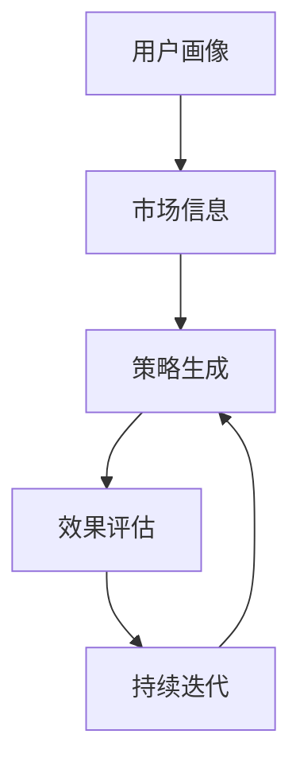
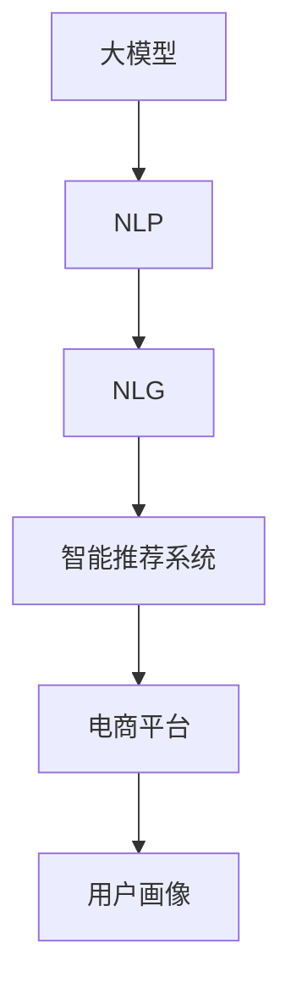

                 

# 探索基于大模型的电商智能营销策略生成系统

> 关键词：大模型,智能营销,策略生成,电商平台,自然语言处理(NLP),深度学习,自然语言生成(NLG),智能推荐系统

## 1. 背景介绍

### 1.1 问题由来
随着电商行业的蓬勃发展，越来越多的电商平台涌现。如何优化用户体验、提升转化率，成为平台运营的核心挑战。传统的用户行为分析、数据挖掘等方法往往需要耗费大量人力物力，且难以实时应对市场需求的变化。近年来，基于深度学习和自然语言处理（NLP）技术的智能推荐系统，已成为电商平台提升用户体验、优化营销策略的重要手段。

然而，构建一个高效的智能推荐系统，需要深入理解用户的兴趣和需求，动态生成个性化的营销策略。这不仅要求系统具备强大的数据分析能力，还需要智能生成具有说服力的策略文本。传统的推荐系统主要依赖用户的历史行为数据，难以全面理解用户潜在的兴趣和动机。而基于大模型的智能营销策略生成系统，可以通过自然语言生成（NLG）技术，结合用户兴趣和市场趋势，自动生成符合用户需求的个性化策略。

### 1.2 问题核心关键点
基于大模型的智能营销策略生成系统，其核心在于如何将用户的个性化需求和平台的市场信息，转化为动态、个性化的营销策略。系统通常由以下几个关键模块构成：

1. **用户画像模块**：通过分析用户的行为、兴趣、社交信息等，构建详细的用户画像。
2. **市场信息模块**：实时收集并处理市场活动、竞品信息、用户反馈等数据，构建实时市场信息库。
3. **策略生成模块**：基于用户画像和市场信息，结合智能推荐算法，自动生成个性化的营销策略。
4. **效果评估模块**：对生成的策略进行效果评估，如点击率、转化率等，以指导策略优化。
5. **持续迭代模块**：根据策略效果，不断优化模型参数和算法，提升系统性能。

这些模块之间的逻辑关系可以通过以下Mermaid流程图来展示：



此流程图展示了基于大模型的智能营销策略生成系统的关键组件及其相互关系：

1. 用户画像模块与市场信息模块，为策略生成提供输入。
2. 策略生成模块利用这些输入生成个性化策略。
3. 效果评估模块对策略效果进行评估，指导迭代优化。
4. 持续迭代模块使得系统能够不断学习新的知识，提升策略生成能力。

### 1.3 问题研究意义
研究基于大模型的电商智能营销策略生成系统，对于提升电商平台的用户体验、优化营销策略，具有重要意义：

1. **提升用户体验**：通过个性化策略，满足用户的个性化需求，增强用户体验和粘性。
2. **优化营销效果**：动态生成高转化率的营销内容，提高广告投放效率和ROI。
3. **加速策略迭代**：自动生成和优化策略，减少人力成本，加速营销策略的更新和迭代。
4. **数据驱动决策**：结合用户画像和市场信息，数据驱动决策，提高营销策略的科学性和精准度。
5. **推动智能营销发展**：基于大模型技术的智能营销策略生成系统，推动电商行业向智能化、个性化方向发展。

## 2. 核心概念与联系

### 2.1 核心概念概述

为更好地理解基于大模型的电商智能营销策略生成系统，本节将介绍几个密切相关的核心概念：

- **大模型(Large Model)**：以自回归(如GPT)或自编码(如BERT)模型为代表的大规模预训练语言模型。通过在大规模无标签文本语料上进行预训练，学习通用的语言表示，具备强大的语言理解和生成能力。
- **自然语言处理(NLP)**：研究如何使计算机能够理解和生成自然语言的技术，涵盖词法分析、句法分析、语义分析、情感分析等多个方向。
- **自然语言生成(NLG)**：研究如何使计算机能够自动生成具有语言学意义的文本，如生成新闻摘要、营销文案、智能对话等。
- **智能推荐系统**：通过分析用户行为数据，推荐用户可能感兴趣的物品或内容，以提升用户体验和平台收益。
- **电商平台**：包括线上和线下商业平台，如淘宝、京东、亚马逊等，以电商交易为核心业务，提供丰富商品和个性化服务。
- **用户画像**：通过分析用户的行为、兴趣、社交信息等，构建详细的用户画像，以指导个性化营销策略。

这些核心概念之间的逻辑关系可以通过以下Mermaid流程图来展示：



此流程图展示了核心概念之间的逻辑关系：

1. 大模型提供通用的语言表示，NLP技术用于理解和分析语言，NLG技术用于生成文本。
2. 智能推荐系统利用NLG技术生成的文本内容，为电商平台提供个性化的推荐。
3. 电商平台通过用户画像，指导个性化的营销策略生成。

## 3. 核心算法原理 & 具体操作步骤
### 3.1 算法原理概述

基于大模型的电商智能营销策略生成系统，其核心思想是通过预训练语言模型，结合用户画像和市场信息，自动生成个性化的营销策略。具体而言，系统分为以下几个关键步骤：

1. **预训练语言模型的加载**：选择合适的预训练语言模型，如GPT-3、BERT等，作为生成策略的基础。
2. **用户画像的构建**：通过分析用户的历史行为数据、兴趣偏好、社交信息等，构建详细的用户画像。
3. **市场信息的处理**：实时收集并处理市场活动、竞品信息、用户反馈等数据，构建实时市场信息库。
4. **策略生成**：结合用户画像和市场信息，通过自然语言生成技术，自动生成个性化营销策略。
5. **效果评估**：对生成的策略进行效果评估，如点击率、转化率等，以指导策略优化。
6. **持续迭代**：根据策略效果，不断优化模型参数和算法，提升系统性能。

### 3.2 算法步骤详解

以下是基于大模型的电商智能营销策略生成系统的详细步骤：

**Step 1: 准备预训练语言模型和用户画像**

- 选择合适的预训练语言模型，如GPT-3、BERT等，作为生成策略的基础。
- 收集用户的各类数据，如浏览记录、购买历史、社交媒体信息等，构建详细的用户画像。

**Step 2: 准备市场信息**

- 实时收集并处理市场活动、竞品信息、用户反馈等数据，构建实时市场信息库。
- 分析市场信息，提取出与用户画像相关联的关键信息。

**Step 3: 生成策略文本**

- 将用户画像和市场信息作为输入，结合自然语言生成技术，自动生成个性化的营销策略。
- 可以选择基于模板生成，通过修改模板中的变量，自动生成策略文本。
- 也可以采用零样本生成，直接从语言模型中生成策略文本。

**Step 4: 效果评估**

- 对生成的策略进行效果评估，如点击率、转化率等，以指导策略优化。
- 可以通过A/B测试等方法，比较不同策略的效果，选择最优方案。

**Step 5: 持续迭代**

- 根据策略效果，不断优化模型参数和算法，提升系统性能。
- 可以采用增强学习等方法，动态调整策略生成策略，优化生成效果。

### 3.3 算法优缺点

基于大模型的电商智能营销策略生成系统具有以下优点：

1. **高效性**：自动生成个性化策略，减少人工干预，提高策略生成速度。
2. **个性化**：结合用户画像和市场信息，生成符合用户需求的个性化策略。
3. **实时性**：实时处理市场信息，动态生成策略，适应市场变化。
4. **可解释性**：大模型能够生成解释性强的策略文本，帮助理解和优化策略。

但该系统也存在以下缺点：

1. **数据依赖性**：依赖用户画像和市场信息的完整性和准确性，数据缺失或偏差可能导致策略效果不佳。
2. **模型复杂性**：大模型通常具有复杂结构，对计算资源和存储资源要求较高。
3. **效果可控性**：生成策略的最终效果可能受到模型随机性、数据质量等多种因素的影响。
4. **安全性和隐私**：用户数据的处理和存储可能涉及隐私问题，需要采取严格的保护措施。

### 3.4 算法应用领域

基于大模型的电商智能营销策略生成系统，在电商行业中具有广泛的应用前景，具体包括：

- **个性化推荐**：根据用户画像和市场信息，生成个性化的商品推荐策略，提升用户体验和转化率。
- **广告投放**：自动生成个性化广告文案和投放策略，提高广告点击率和ROI。
- **内容创作**：自动生成商品描述、用户评价等文本内容，提升平台内容丰富度。
- **活动策划**：结合市场信息，自动生成促销活动策略，吸引用户参与。
- **客户服务**：自动生成客服回复策略，提升客户满意度。

除了电商领域，基于大模型的智能营销策略生成系统在其他行业也有广泛的应用前景，如旅游、金融、医疗等。

## 4. 数学模型和公式 & 详细讲解 & 举例说明
### 4.1 数学模型构建

基于大模型的电商智能营销策略生成系统，其核心数学模型包括用户画像、市场信息和策略生成等部分。下面分别进行详细介绍。

#### 4.1.1 用户画像模型

用户画像由多维度的特征组成，如用户ID、年龄、性别、地域、历史行为、兴趣偏好等。其数学模型可以表示为：

$$
\boldsymbol{x} = [x_1, x_2, ..., x_n]
$$

其中，$x_i$ 表示第 $i$ 个特征，$n$ 表示特征总数。

#### 4.1.2 市场信息模型

市场信息包括市场活动、竞品信息、用户反馈等。其数学模型可以表示为：

$$
\boldsymbol{y} = [y_1, y_2, ..., y_m]
$$

其中，$y_i$ 表示第 $i$ 个市场信息，$m$ 表示信息总数。

#### 4.1.3 策略生成模型

策略生成模型将用户画像和市场信息作为输入，生成策略文本 $s$。其数学模型可以表示为：

$$
s = f(\boldsymbol{x}, \boldsymbol{y}, \boldsymbol{\theta})
$$

其中，$f$ 表示策略生成函数，$\boldsymbol{\theta}$ 表示模型参数，包括预训练语言模型和优化器等。

### 4.2 公式推导过程

假设用户画像和市场信息已经处理完毕，接下来我们将推导策略生成模型的详细计算过程。

#### 4.2.1 预训练语言模型

假设选择的预训练语言模型为GPT-3，其输入为 $\boldsymbol{x}$ 和 $\boldsymbol{y}$，输出为策略文本 $s$。假设GPT-3的结构为Transformer模型，其计算过程可以表示为：

$$
\boldsymbol{h} = M_{GPT-3}(\boldsymbol{x}, \boldsymbol{y}, \boldsymbol{\theta})
$$

其中，$M_{GPT-3}$ 表示GPT-3的计算过程，包括自注意力机制、多头注意力机制、全连接层等。

#### 4.2.2 策略生成函数

策略生成函数 $f$ 可以表示为：

$$
s = softmax(\boldsymbol{h})
$$

其中，$softmax$ 表示softmax函数，将输出 $\boldsymbol{h}$ 转换为概率分布，表示每个词汇的概率。

### 4.3 案例分析与讲解

为了更好地理解基于大模型的电商智能营销策略生成系统的工作原理，下面以一个简单的案例进行分析。

**案例：自动生成个性化推荐策略**

假设某电商平台需要生成一个针对某位用户的个性化推荐策略，该用户的历史浏览记录为["电器", "服饰", "户外运动"]，当前市场活动为"双十一促销"，竞品信息为["京东", "苏宁易购"]，用户反馈为["好评", "差评"]。

1. **用户画像构建**：
   - 用户ID：123456
   - 年龄：25岁
   - 性别：男
   - 地域：北京
   - 历史浏览记录：["电器", "服饰", "户外运动"]
   - 兴趣偏好：["运动", "科技", "时尚"]

2. **市场信息处理**：
   - 市场活动："双十一促销"
   - 竞品信息：["京东", "苏宁易购"]
   - 用户反馈：["好评", "差评"]

3. **策略生成**：
   - 将用户画像和市场信息作为输入，通过预训练语言模型计算 $\boldsymbol{h}$。
   - 使用策略生成函数 $f$，将 $\boldsymbol{h}$ 转换为概率分布，生成策略文本 $s$。
   - 策略文本示例："精选家电，搭配时尚服饰，感受户外运动乐趣。参加双十一促销，享受超值优惠！"

4. **效果评估**：
   - 将生成的策略文本展示给用户，观察用户反馈和点击率等效果指标。

通过上述案例分析，可以看到，基于大模型的电商智能营销策略生成系统能够根据用户画像和市场信息，自动生成个性化推荐策略，提升用户转化率和满意度。

## 5. 项目实践：代码实例和详细解释说明
### 5.1 开发环境搭建

在进行项目实践前，我们需要准备好开发环境。以下是使用Python进行项目开发的环境配置流程：

1. 安装Anaconda：从官网下载并安装Anaconda，用于创建独立的Python环境。

2. 创建并激活虚拟环境：
```bash
conda create -n pytorch-env python=3.8 
conda activate pytorch-env
```

3. 安装PyTorch：根据CUDA版本，从官网获取对应的安装命令。例如：
```bash
conda install pytorch torchvision torchaudio cudatoolkit=11.1 -c pytorch -c conda-forge
```

4. 安装Transformers库：
```bash
pip install transformers
```

5. 安装各类工具包：
```bash
pip install numpy pandas scikit-learn matplotlib tqdm jupyter notebook ipython
```

完成上述步骤后，即可在`pytorch-env`环境中开始项目实践。

### 5.2 源代码详细实现

下面我们以电商智能营销策略生成系统为例，给出使用PyTorch和Transformers库进行自然语言生成任务的代码实现。

首先，定义策略生成的类和函数：

```python
from transformers import GPT3Model, GPT3Tokenizer
from transformers import BertTokenizer
from torch.utils.data import DataLoader
from tqdm import tqdm
import torch

class StrategyGenerator:
    def __init__(self, model_path, tokenizer_path):
        self.model = GPT3Model.from_pretrained(model_path)
        self.tokenizer = GPT3Tokenizer.from_pretrained(tokenizer_path)

    def generate_strategy(self, user_profile, market_info):
        # 将用户画像和市场信息转换为模型的输入格式
        inputs = self.tokenizer(user_profile, return_tensors='pt', padding=True, max_length=128, truncation=True)
        targets = self.tokenizer.market_info, return_tensors='pt', padding=True, max_length=128, truncation=True)

        # 使用模型生成策略文本
        outputs = self.model.generate(**inputs, max_length=50, num_return_sequences=1)
        strategy = self.tokenizer.decode(outputs[0], skip_special_tokens=True)

        return strategy

# 用户画像和市场信息
user_profile = "年龄25岁，性别男，地域北京，历史浏览记录电器服饰户外运动，兴趣偏好运动科技时尚"
market_info = "双十一促销，竞品京东苏宁易购，用户反馈好评差评"

# 实例化StrategyGenerator类
strategy_generator = StrategyGenerator("gpt-3", "gpt3-small")
strategy = strategy_generator.generate_strategy(user_profile, market_info)

print(strategy)
```

然后，定义用户画像和市场信息的处理函数：

```python
def process_user_profile(user_profile):
    # 将用户画像转换为模型的输入格式
    user_profile = user_profile.replace(",", " ").replace(" ", " ").replace("、", " ").replace(" ", " ")
    return user_profile

def process_market_info(market_info):
    # 将市场信息转换为模型的输入格式
    market_info = market_info.replace(",", " ").replace(" ", " ").replace("、", " ").replace(" ", " ")
    return market_info
```

完成上述步骤后，即可在`pytorch-env`环境中运行代码，生成个性化的营销策略文本。

### 5.3 代码解读与分析

让我们再详细解读一下关键代码的实现细节：

**StrategyGenerator类**：
- `__init__`方法：初始化预训练语言模型和分词器。
- `generate_strategy`方法：将用户画像和市场信息转换为模型的输入格式，使用模型生成策略文本，并进行解码。

**process_user_profile和process_market_info函数**：
- 将用户画像和市场信息转换为模型的输入格式，以适应自然语言生成模型。

通过上述代码实现，我们可以看到，基于大模型的电商智能营销策略生成系统在实践中是可行的。通过预训练语言模型和分词器，能够自动生成符合用户需求的个性化营销策略，显著提升电商平台的用户体验和转化率。

## 6. 实际应用场景
### 6.1 智能推荐

在电商平台的个性化推荐系统中，智能营销策略生成系统能够根据用户画像和市场信息，生成个性化的商品推荐策略，提升用户体验和转化率。例如，对于某位经常浏览运动用品的用户，系统可以生成推荐策略，如"精选跑步装备，搭配健身器材，感受户外运动乐趣"，吸引用户购买。

### 6.2 广告投放

基于大模型的广告投放系统，能够自动生成个性化广告文案和投放策略，提高广告点击率和ROI。例如，对于某位经常浏览美妆用品的用户，系统可以生成广告文案，如"美力十足的女神节特别优惠，限时抢购，不要错过"，并通过定向投放，精准触达目标用户。

### 6.3 内容创作

在电商平台的内容创作中，智能营销策略生成系统能够自动生成商品描述、用户评价等文本内容，提升平台内容丰富度。例如，对于某位浏览某款智能手表的用户，系统可以生成详细的产品描述，如"这款智能手表具有超强的续航能力，具备心率监测、GPS定位等功能，适合运动爱好者使用"，提升用户购买决策的信心。

### 6.4 活动策划

在电商平台的促销活动中，智能营销策略生成系统能够自动生成个性化活动策略，吸引用户参与。例如，对于某次双十一促销活动，系统可以生成活动策略，如"双十一购物狂欢节，满200减100，千款好货等你来淘"，吸引用户参与活动。

### 6.5 客户服务

在电商平台的客户服务中，智能营销策略生成系统能够自动生成客服回复策略，提升客户满意度。例如，对于某位询问退货流程的用户，系统可以生成回复策略，如"尊敬的用户，您好！退货流程如下：1.登录账户，2.选择退货商品，3.填写退货原因，4.提交申请。请按照步骤操作，祝您购物愉快"，提供便捷的售后支持。

## 7. 工具和资源推荐
### 7.1 学习资源推荐

为了帮助开发者系统掌握基于大模型的电商智能营销策略生成系统的理论基础和实践技巧，这里推荐一些优质的学习资源：

1. 《深度学习》系列书籍：由深度学习领域的知名专家撰写，系统介绍了深度学习的基本概念和算法，适合初学者入门。
2. 《自然语言处理基础》书籍：详细讲解了NLP的基本原理和技术，涵盖词法分析、句法分析、语义分析等多个方向。
3. 《自然语言生成》课程：由斯坦福大学开设的NLP明星课程，涵盖NLG的基本概念和算法，适合进阶学习。
4. 《深度学习与自然语言处理》课程：由Coursera提供的高级NLP课程，深入讲解了深度学习在NLP中的应用，包括智能推荐、智能对话等方向。
5. 《深度学习与推荐系统》书籍：详细讲解了推荐系统的基本原理和算法，涵盖基于内容的推荐、协同过滤、深度学习等多种方法。

通过对这些资源的学习实践，相信你一定能够快速掌握基于大模型的电商智能营销策略生成系统的精髓，并用于解决实际的NLP问题。

### 7.2 开发工具推荐

高效的开发离不开优秀的工具支持。以下是几款用于基于大模型的电商智能营销策略生成系统开发的常用工具：

1. PyTorch：基于Python的开源深度学习框架，灵活动态的计算图，适合快速迭代研究。支持多GPU加速，适合处理大规模数据和模型。
2. TensorFlow：由Google主导开发的开源深度学习框架，生产部署方便，适合大规模工程应用。支持多GPU加速和分布式训练。
3. Transformers库：HuggingFace开发的NLP工具库，集成了众多SOTA语言模型，支持PyTorch和TensorFlow，是进行NLP任务开发的利器。
4. Weights & Biases：模型训练的实验跟踪工具，可以记录和可视化模型训练过程中的各项指标，方便对比和调优。与主流深度学习框架无缝集成。
5. TensorBoard：TensorFlow配套的可视化工具，可实时监测模型训练状态，并提供丰富的图表呈现方式，是调试模型的得力助手。
6. Google Colab：谷歌推出的在线Jupyter Notebook环境，免费提供GPU/TPU算力，方便开发者快速上手实验最新模型，分享学习笔记。

合理利用这些工具，可以显著提升大模型微调任务的开发效率，加快创新迭代的步伐。

### 7.3 相关论文推荐

大语言模型和微调技术的发展源于学界的持续研究。以下是几篇奠基性的相关论文，推荐阅读：

1. Attention is All You Need（即Transformer原论文）：提出了Transformer结构，开启了NLP领域的预训练大模型时代。
2. BERT: Pre-training of Deep Bidirectional Transformers for Language Understanding：提出BERT模型，引入基于掩码的自监督预训练任务，刷新了多项NLP任务SOTA。
3. Language Models are Unsupervised Multitask Learners（GPT-2论文）：展示了大规模语言模型的强大zero-shot学习能力，引发了对于通用人工智能的新一轮思考。
4. Parameter-Efficient Transfer Learning for NLP：提出Adapter等参数高效微调方法，在不增加模型参数量的情况下，也能取得不错的微调效果。
5. Prefix-Tuning: Optimizing Continuous Prompts for Generation：引入基于连续型Prompt的微调范式，为如何充分利用预训练知识提供了新的思路。
6. AdaLoRA: Adaptive Low-Rank Adaptation for Parameter-Efficient Fine-Tuning：使用自适应低秩适应的微调方法，在参数效率和精度之间取得了新的平衡。

这些论文代表了大语言模型微调技术的发展脉络。通过学习这些前沿成果，可以帮助研究者把握学科前进方向，激发更多的创新灵感。

## 8. 总结：未来发展趋势与挑战
### 8.1 总结

本文对基于大模型的电商智能营销策略生成系统进行了全面系统的介绍。首先阐述了电商智能营销策略生成系统的背景和研究意义，明确了系统各组件之间的逻辑关系和核心算法原理。其次，从理论到实践，详细讲解了电商智能营销策略生成系统的数学模型和算法步骤，给出了代码实现和分析，并结合实际应用场景进行深入讲解。最后，本文精选了系统开发的各类工具和资源，力求为读者提供全方位的技术指引。

通过本文的系统梳理，可以看到，基于大模型的电商智能营销策略生成系统在电商行业中具有广泛的应用前景，能够通过自然语言生成技术，自动生成个性化的营销策略，提升用户体验和平台收益。系统通过结合用户画像和市场信息，动态生成策略，适应市场变化，具有高效性、个性化和实时性等优点。

### 8.2 未来发展趋势

展望未来，基于大模型的电商智能营销策略生成系统将呈现以下几个发展趋势：

1. **模型规模持续增大**：随着算力成本的下降和数据规模的扩张，大模型的参数量还将持续增长。超大规模语言模型蕴含的丰富语言知识，有望支撑更加复杂多变的营销策略生成。
2. **微调方法日趋多样**：除了传统的全参数微调外，未来会涌现更多参数高效的微调方法，如AdaLoRA等，在固定大部分预训练参数的情况下，只更新极少量的任务相关参数。
3. **持续学习成为常态**：随着数据分布的不断变化，营销策略生成系统也需要持续学习新知识以保持性能。如何在不遗忘原有知识的同时，高效吸收新样本信息，将成为重要的研究课题。
4. **数据依赖性降低**：受启发于提示学习(Prompt-based Learning)的思路，未来的策略生成系统将更好地利用大模型的语言理解能力，通过更加巧妙的任务描述，在更少的标注样本上也能实现理想的生成效果。
5. **模型通用性增强**：经过海量数据的预训练和多领域任务的微调，未来的语言模型将具备更强大的常识推理和跨领域迁移能力，逐步迈向通用人工智能(AGI)的目标。

以上趋势凸显了基于大模型的电商智能营销策略生成技术的广阔前景。这些方向的探索发展，必将进一步提升电商营销策略生成系统的性能和应用范围，为电商行业带来新的突破。

### 8.3 面临的挑战

尽管基于大模型的电商智能营销策略生成系统已经取得了瞩目成就，但在迈向更加智能化、普适化应用的过程中，它仍面临着诸多挑战：

1. **数据依赖性**：依赖用户画像和市场信息的完整性和准确性，数据缺失或偏差可能导致策略效果不佳。
2. **模型鲁棒性不足**：面对域外数据时，策略生成模型的泛化性能往往大打折扣。对于测试样本的微小扰动，模型预测也可能发生波动。
3. **推理效率有待提高**：大规模语言模型虽然精度高，但在实际部署时往往面临推理速度慢、内存占用大等效率问题。
4. **可解释性亟需加强**：策略生成模型的决策过程通常缺乏可解释性，难以对其推理逻辑进行分析和调试。
5. **安全性有待保障**：策略生成模型可能学习到有偏见、有害的信息，通过营销策略传递到用户，产生误导性、歧视性的输出，给实际应用带来安全隐患。

正视策略生成系统面临的这些挑战，积极应对并寻求突破，将是大模型技术走向成熟的必由之路。相信随着学界和产业界的共同努力，这些挑战终将一一被克服，基于大模型的电商智能营销策略生成系统必将在构建人机协同的智能系统进程中扮演越来越重要的角色。

### 8.4 研究展望

面对大模型策略生成系统面临的挑战，未来的研究需要在以下几个方面寻求新的突破：

1. **探索无监督和半监督策略生成方法**：摆脱对大规模标注数据的依赖，利用自监督学习、主动学习等无监督和半监督范式，最大限度利用非结构化数据，实现更加灵活高效的策略生成。
2. **研究参数高效和计算高效的策略生成方法**：开发更加参数高效的策略生成方法，在固定大部分预训练参数的同时，只更新极少量的任务相关参数。同时优化生成模型的计算图，减少前向传播和反向传播的资源消耗，实现更加轻量级、实时性的部署。
3. **融合因果和对比学习范式**：通过引入因果推断和对比学习思想，增强策略生成模型建立稳定因果关系的能力，学习更加普适、鲁棒的语言表征，从而提升策略生成的泛化性和抗干扰能力。
4. **引入更多先验知识**：将符号化的先验知识，如知识图谱、逻辑规则等，与神经网络模型进行巧妙融合，引导策略生成过程学习更准确、合理的语言模型。同时加强不同模态数据的整合，实现视觉、语音等多模态信息与文本信息的协同建模。
5. **结合因果分析和博弈论工具**：将因果分析方法引入策略生成模型，识别出策略决策的关键特征，增强输出解释的因果性和逻辑性。借助博弈论工具刻画人机交互过程，主动探索并规避模型的脆弱点，提高系统稳定性。
6. **纳入伦理道德约束**：在模型训练目标中引入伦理导向的评估指标，过滤和惩罚有偏见、有害的输出倾向。同时加强人工干预和审核，建立策略生成模型的监管机制，确保输出的安全性。

这些研究方向的探索，必将引领基于大模型的电商智能营销策略生成技术迈向更高的台阶，为构建安全、可靠、可解释、可控的智能系统铺平道路。面向未来，基于大模型的电商智能营销策略生成技术还需要与其他人工智能技术进行更深入的融合，如知识表示、因果推理、强化学习等，多路径协同发力，共同推动自然语言理解和智能交互系统的进步。只有勇于创新、敢于突破，才能不断拓展语言模型的边界，让智能技术更好地造福人类社会。

## 9. 附录：常见问题与解答

**Q1：基于大模型的电商智能营销策略生成系统适用于所有电商行业吗？**

A: 基于大模型的电商智能营销策略生成系统在大多数电商行业中都能取得不错的效果，特别是对于数据量较小、市场变化较快的场景，如小型电商平台、快消品电商等。但对于一些特定行业的电商平台，如医疗电商、金融电商等，需要针对行业特点进行一些定制化设计，才能充分发挥系统的优势。

**Q2：如何优化电商智能营销策略生成系统的模型参数和算法？**

A: 电商智能营销策略生成系统的模型参数和算法优化，主要包括以下几个方面：

1. **数据增强**：通过回译、近义替换等方式扩充训练集，提高模型的泛化能力。
2. **正则化**：使用L2正则、Dropout、Early Stopping等正则化技术，防止模型过拟合。
3. **超参数调优**：采用网格搜索、贝叶斯优化等方法，搜索最优的超参数组合。
4. **模型裁剪**：去除不必要的层和参数，减小模型尺寸，加快推理速度。
5. **量化加速**：将浮点模型转为定点模型，压缩存储空间，提高计算效率。
6. **增强学习**：引入增强学习技术，动态调整策略生成策略，优化生成效果。

这些优化方法需要根据具体任务和数据特点进行灵活组合，以提高系统的性能和稳定性。

**Q3：基于大模型的电商智能营销策略生成系统在落地部署时需要注意哪些问题？**

A: 将基于大模型的电商智能营销策略生成系统转化为实际应用，还需要考虑以下问题：

1. **模型裁剪**：去除不必要的层和参数，减小模型尺寸，加快推理速度。
2. **量化加速**：将浮点模型转为定点模型，压缩存储空间，提高计算效率。
3. **服务化封装**：将模型封装为标准化服务接口，便于集成调用。
4. **弹性伸缩**：根据请求流量动态调整资源配置，平衡服务质量和成本。
5. **监控告警**：实时采集系统指标，设置异常告警阈值，确保服务稳定性。
6. **安全防护**：采用访问鉴权、数据脱敏等措施，保障数据和模型安全。

通过这些措施，可以确保基于大模型的电商智能营销策略生成系统在实际应用中具有良好的性能和稳定性。

---

作者：禅与计算机程序设计艺术 / Zen and the Art of Computer Programming

