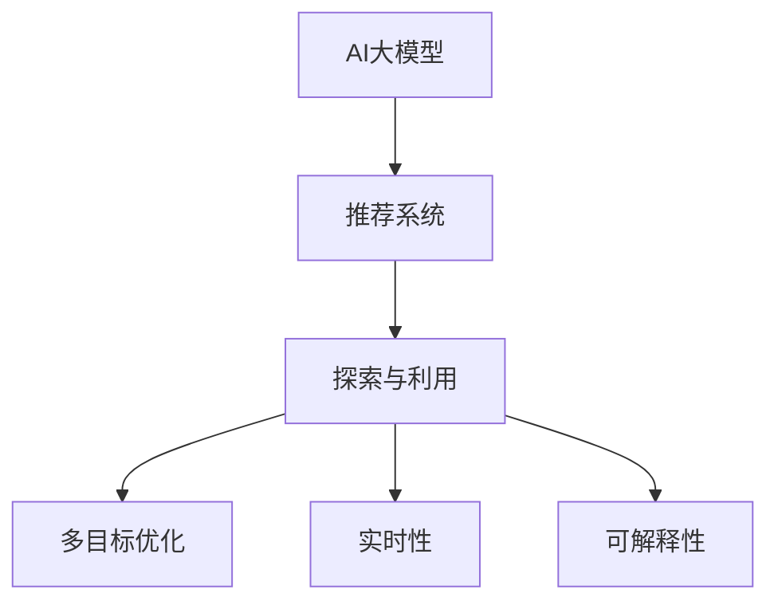

                 

# 推荐系统中AI大模型的探索与利用平衡

## 1. 背景介绍

### 1.1 问题由来

推荐系统（Recommendation Systems）在近年来得到了快速发展，它通过分析用户的行为和偏好，为用户推荐个性化的商品、内容等，极大地提升了用户体验和系统收益。然而，传统的推荐系统主要依赖于基于协同过滤、基于内容的推荐等方法，存在维度灾难、冷启动问题、数据稀疏等瓶颈。

近年来，人工智能（AI）技术，尤其是大模型技术，逐渐成为推荐系统的新突破口。AI大模型（AI Large Models）通过在海量数据上进行预训练，能够学习到用户行为背后的隐含语义，从而大幅提升推荐系统的表现。然而，在大模型快速发展的背后，如何平衡模型的探索和利用（Exploitation & Exploration），成为业内的一个重要话题。

### 1.2 问题核心关键点

在大模型的推荐应用中，探索与利用的平衡，主要体现在以下几个方面：

- **探索与利用**：如何在已有数据上进行充分的探索，挖掘用户的新兴趣点，同时利用已知数据进行精准推荐。
- **模型泛化**：如何在新的数据上保持模型的预测能力，避免过拟合或欠拟合。
- **多目标优化**：如何在用户满意度、系统收益、模型性能等多个目标之间取得平衡。
- **实时性和效率**：如何在保持高性能的同时，满足实时推荐的需求。
- **模型的可解释性**：如何提高模型的可解释性，增强用户信任和系统的透明度。

本文将系统介绍AI大模型在推荐系统中的应用，并探讨如何在推荐系统中实现AI大模型的探索与利用平衡。

## 2. 核心概念与联系

### 2.1 核心概念概述

为更好地理解AI大模型在推荐系统中的应用，本节将介绍几个密切相关的核心概念：

- AI大模型（Large AI Models）：以自回归（如GPT）或自编码（如BERT）模型为代表的大规模预训练模型。通过在海量数据上进行预训练，学习用户行为和商品特征的深层次语义表示。
- 推荐系统（Recommendation Systems）：通过分析用户历史行为和偏好，为用户推荐个性化商品、内容等。包括协同过滤、基于内容的推荐等传统方法，以及AI大模型等新兴方法。
- 探索与利用（Exploitation & Exploration）：在推荐系统中，如何平衡已有数据上的利用（利用已有数据进行精准推荐）和新的数据上的探索（探索用户新兴趣点）。
- 多目标优化（Multi-Objective Optimization）：如何在用户满意度、系统收益、模型性能等目标之间取得平衡。
- 实时性（Real-time）：推荐系统需要满足实时推荐的需求，即在短时间内给出个性化推荐。
- 可解释性（Explainability）：提高模型的可解释性，增强用户信任和系统的透明度。

这些核心概念之间的逻辑关系可以通过以下Mermaid流程图来展示：



这个流程图展示了大模型在推荐系统中的应用及其探索与利用的关键环节：

1. 大模型通过预训练获得用户行为和商品特征的表示。
2. 推荐系统利用已有数据进行精准推荐，同时探索新数据挖掘用户新兴趣点。
3. 多目标优化平衡用户满意度、系统收益和模型性能。
4. 实时性满足推荐系统快速响应的需求。
5. 可解释性增强用户信任和系统的透明度。

## 3. 核心算法原理 & 具体操作步骤
### 3.1 算法原理概述

AI大模型在推荐系统中的应用，主要基于以下三个步骤：

1. **数据预处理**：收集用户行为数据和商品特征数据，并进行清洗、归一化等预处理操作。
2. **模型训练**：使用AI大模型进行预训练，学习用户行为和商品特征的语义表示。
3. **推荐生成**：在用户查询时，使用训练好的模型进行推理，生成个性化推荐。

推荐系统中的AI大模型主要通过两种方式进行利用：

1. **特征增强**：将AI大模型提取的语义特征与传统推荐算法结合，提高推荐性能。
2. **推荐生成**：直接使用AI大模型生成推荐结果，无需融合其他算法。

### 3.2 算法步骤详解

**Step 1: 数据预处理**

推荐系统需要大量的用户行为数据和商品特征数据。数据预处理主要包括以下几个步骤：

1. **数据收集**：收集用户行为数据和商品特征数据，包括点击、浏览、评分、评论等。
2. **数据清洗**：去除缺失、异常、重复等数据，确保数据质量。
3. **特征工程**：对用户和商品特征进行编码、归一化、分箱等操作，生成模型可接受的输入。
4. **数据划分**：将数据划分为训练集、验证集和测试集，供模型训练、调优和评估使用。

**Step 2: 模型训练**

模型训练主要包括以下几个步骤：

1. **模型选择**：选择适合预训练和微调的模型，如BERT、GPT等。
2. **预训练**：使用无监督学习任务（如掩码语言模型、下一句预测等）对模型进行预训练，学习语义表示。
3. **微调**：在标注数据上进行有监督学习，微调模型参数，适应推荐系统任务。
4. **模型评估**：在验证集和测试集上评估模型性能，调整超参数。

**Step 3: 推荐生成**

推荐生成主要包括以下几个步骤：

1. **用户输入**：用户输入查询或行为数据，作为模型的输入。
2. **特征提取**：将用户行为数据和商品特征数据输入模型，提取语义特征。
3. **推荐排序**：使用模型输出的特征向量进行排序，生成推荐结果。
4. **结果展示**：将推荐结果展示给用户，供用户选择。

### 3.3 算法优缺点

AI大模型在推荐系统中的应用，有以下优点：

1. **语义理解能力强**：大模型能够学习到用户行为和商品特征的深层次语义表示，提高推荐性能。
2. **可解释性强**：大模型通过预训练和微调，能够提供推荐结果的可解释性，增强用户信任。
3. **适应性强**：大模型能够适应不同的推荐任务和数据分布，提高系统的泛化能力。

同时，也存在以下缺点：

1. **计算资源消耗大**：大模型的训练和推理需要大量计算资源，对硬件要求高。
2. **模型复杂度高**：大模型的参数量庞大，推理速度慢，实时性差。
3. **数据依赖性强**：大模型的性能依赖于标注数据的质量和数量，数据收集和标注成本高。

### 3.4 算法应用领域

AI大模型在推荐系统中有着广泛的应用，主要包括以下几个领域：

1. **电商推荐**：在电商平台上，使用AI大模型推荐商品，提高用户购买率。
2. **视频推荐**：在视频平台上，使用AI大模型推荐视频内容，提高用户观看时长。
3. **音乐推荐**：在音乐平台上，使用AI大模型推荐歌曲，提高用户满意度。
4. **新闻推荐**：在新闻平台上，使用AI大模型推荐文章，提高用户阅读量。

除了上述这些经典应用外，AI大模型还在智能推荐系统、个性化推荐系统等新兴领域中不断探索新的应用场景，为推荐系统带来新的突破。

## 4. 数学模型和公式 & 详细讲解
### 4.1 数学模型构建

推荐系统中的AI大模型主要基于深度学习框架进行构建，常用的框架包括PyTorch、TensorFlow等。以下是基于PyTorch构建推荐系统AI大模型的数学模型：

1. **用户行为数据**：设用户行为数据为 $x_i \in \mathbb{R}^d$，其中 $d$ 为特征维度。
2. **商品特征数据**：设商品特征数据为 $y_i \in \mathbb{R}^k$，其中 $k$ 为商品特征维度。
3. **推荐模型**：设推荐模型为 $M_{\theta}$，其中 $\theta$ 为模型参数。

推荐模型 $M_{\theta}$ 的输出为 $z_i \in \mathbb{R}^m$，其中 $m$ 为推荐向量维度。推荐向量 $z_i$ 表示商品对用户的潜在价值。

推荐系统中的AI大模型主要通过以下三个步骤进行计算：

1. **特征提取**：将用户行为数据和商品特征数据输入模型，提取语义特征 $h_i \in \mathbb{R}^h$，其中 $h$ 为特征提取层的维度。
2. **模型训练**：使用标注数据对模型进行微调，调整参数 $\theta$。
3. **推荐排序**：将特征 $h_i$ 输入模型，得到推荐向量 $z_i$，排序后生成推荐结果。

### 4.2 公式推导过程

以下是基于PyTorch的推荐系统AI大模型公式推导过程：

1. **特征提取层**：
$$
h_i = M_{\theta}(x_i, y_i) = M_{\theta}(\text{[CLS]} \cdot x_i + \text{[SEP]} \cdot y_i)
$$

其中 $\text{[CLS]}$ 和 $\text{[SEP]}$ 为特殊的标记符号，用于拼接用户行为和商品特征。

2. **推荐向量**：
$$
z_i = M_{\phi}(h_i) = M_{\phi}(M_{\theta}(x_i, y_i))
$$

其中 $M_{\phi}$ 为推荐向量生成层，通常采用线性层或注意力机制。

3. **推荐排序**：
$$
r_i = \text{softmax}(z_i)
$$

其中 $r_i$ 为推荐结果向量，通过softmax函数对推荐向量进行归一化，得到每个商品的推荐概率。

### 4.3 案例分析与讲解

以电商推荐系统为例，分析AI大模型在推荐系统中的应用。电商推荐系统需要为用户推荐个性化商品，提高用户购买率。AI大模型通过预训练和微调，学习用户行为和商品特征的深层次语义表示，从而提升推荐性能。

在用户输入查询或行为数据时，将查询和商品特征数据输入模型，通过特征提取层 $M_{\theta}$ 提取语义特征 $h_i$，再通过推荐向量生成层 $M_{\phi}$ 生成推荐向量 $z_i$。最后，使用softmax函数对推荐向量进行归一化，得到每个商品的推荐概率 $r_i$。系统根据推荐概率，生成推荐结果并展示给用户。

## 5. 项目实践：代码实例和详细解释说明
### 5.1 开发环境搭建

在进行AI大模型推荐系统开发前，我们需要准备好开发环境。以下是使用Python进行PyTorch开发的环境配置流程：

1. 安装Anaconda：从官网下载并安装Anaconda，用于创建独立的Python环境。

2. 创建并激活虚拟环境：
```bash
conda create -n pytorch-env python=3.8 
conda activate pytorch-env
```

3. 安装PyTorch：根据CUDA版本，从官网获取对应的安装命令。例如：
```bash
conda install pytorch torchvision torchaudio cudatoolkit=11.1 -c pytorch -c conda-forge
```

4. 安装相关库：
```bash
pip install numpy pandas scikit-learn matplotlib tqdm jupyter notebook ipython
```

完成上述步骤后，即可在`pytorch-env`环境中开始推荐系统开发。

### 5.2 源代码详细实现

我们以电商推荐系统为例，使用AI大模型进行推荐。首先，定义数据集和模型结构：

```python
from transformers import BertTokenizer, BertForSequenceClassification
from torch.utils.data import Dataset, DataLoader
from torch.nn import CrossEntropyLoss
import torch

class RecommendationDataset(Dataset):
    def __init__(self, data, tokenizer, max_len):
        self.data = data
        self.tokenizer = tokenizer
        self.max_len = max_len
        
    def __len__(self):
        return len(self.data)
    
    def __getitem__(self, idx):
        item = self.data[idx]
        title = item[0]
        description = item[1]
        return self.tokenizer(title, description, max_length=self.max_len, padding='max_length', truncation=True)

# 定义模型结构
tokenizer = BertTokenizer.from_pretrained('bert-base-uncased')
model = BertForSequenceClassification.from_pretrained('bert-base-uncased', num_labels=2)

# 定义损失函数和优化器
criterion = CrossEntropyLoss()
optimizer = torch.optim.Adam(model.parameters(), lr=1e-5)
```

接着，加载数据集并进行预处理：

```python
# 加载数据集
dataset = RecommendationDataset(train_data, tokenizer, max_len)
train_loader = DataLoader(dataset, batch_size=32, shuffle=True)

# 预处理数据
tokenizer_data = tokenizer(
    [(train_title, train_description) for train_title, train_description in train_data],
    padding='max_length', max_length=max_len, truncation=True)
```

然后，进行模型训练和微调：

```python
# 模型训练
model.train()
for batch in train_loader:
    input_ids = batch['input_ids']
    attention_mask = batch['attention_mask']
    labels = batch['labels']
    optimizer.zero_grad()
    outputs = model(input_ids, attention_mask=attention_mask, labels=labels)
    loss = criterion(outputs, labels)
    loss.backward()
    optimizer.step()
```

最后，进行推荐排序和结果展示：

```python
# 模型评估
model.eval()
with torch.no_grad():
    for batch in test_loader:
        input_ids = batch['input_ids']
        attention_mask = batch['attention_mask']
        labels = batch['labels']
        outputs = model(input_ids, attention_mask=attention_mask)
        predicted = torch.argmax(outputs, dim=1)
        # 输出推荐结果
        print(predicted)
```

以上即为基于AI大模型的电商推荐系统代码实现。可以看到，通过PyTorch和Transformer库，代码实现简洁高效，易于理解和维护。

### 5.3 代码解读与分析

让我们再详细解读一下关键代码的实现细节：

**RecommendationDataset类**：
- `__init__`方法：初始化数据集，设置tokenizer和max_len。
- `__len__`方法：返回数据集长度。
- `__getitem__`方法：对单个数据进行处理，将标题和描述拼接后进行分词，返回token ids和attention mask。

**模型结构**：
- `tokenizer`：使用BertTokenizer对用户行为和商品特征进行分词。
- `model`：使用BertForSequenceClassification作为推荐模型，输出向量经过softmax函数归一化。

**训练过程**：
- 使用Adam优化器更新模型参数，通过cross entropy损失函数计算损失。
- 在训练集上进行模型训练，使用softmax函数进行推荐排序。

**推荐结果展示**：
- 在测试集上进行模型评估，将推荐向量通过argmax函数取最大值，得到推荐结果。

可以看到，基于PyTorch和Transformer库的AI大模型推荐系统开发，代码实现简洁高效，易于理解和维护。开发者可以将更多精力放在数据处理和模型改进上，而不必过多关注底层的实现细节。

## 6. 实际应用场景
### 6.1 电商推荐

基于AI大模型的电商推荐系统，可以极大地提升用户的购物体验和商家的销售额。电商推荐系统通过收集用户的浏览、点击、购买等行为数据，利用AI大模型学习用户行为和商品特征的深层次语义表示，为用户推荐个性化的商品。通过推荐系统，用户可以更快地找到所需商品，商家也可以更精准地推送商品，提高用户购买率和销售额。

### 6.2 视频推荐

视频推荐系统在视频平台上应用广泛。视频推荐系统通过收集用户的观看行为数据，利用AI大模型学习用户行为和视频特征的深层次语义表示，为用户推荐个性化的视频内容。通过推荐系统，用户可以更快地找到感兴趣的视频，视频平台也可以提高用户的观看时长和广告收入。

### 6.3 音乐推荐

音乐推荐系统在音乐平台上应用广泛。音乐推荐系统通过收集用户的听歌行为数据，利用AI大模型学习用户行为和歌曲特征的深层次语义表示，为用户推荐个性化的音乐内容。通过推荐系统，用户可以更快地找到感兴趣的歌曲，音乐平台也可以提高用户的听歌时长和收益。

### 6.4 新闻推荐

新闻推荐系统在新闻平台上应用广泛。新闻推荐系统通过收集用户的阅读行为数据，利用AI大模型学习用户行为和新闻特征的深层次语义表示，为用户推荐个性化的新闻内容。通过推荐系统，用户可以更快地找到感兴趣的新闻，新闻平台也可以提高用户的阅读量和广告收入。

## 7. 工具和资源推荐
### 7.1 学习资源推荐

为了帮助开发者系统掌握AI大模型在推荐系统中的应用，这里推荐一些优质的学习资源：

1. 《深度学习推荐系统：原理与实践》书籍：介绍推荐系统基础理论和实践方法，包括协同过滤、基于内容的推荐、深度学习等。
2. 《Transformers从原理到实践》系列博文：介绍Transformer原理、BERT模型、微调技术等前沿话题，适合深度学习初学者。
3. CS231n《深度学习视觉与模式识别》课程：斯坦福大学开设的计算机视觉课程，涵盖深度学习推荐系统的理论和方法。
4. Kaggle推荐系统竞赛：参与Kaggle推荐系统竞赛，训练和优化推荐模型，提升推荐系统开发能力。
5. TensorFlow官网文档：TensorFlow官方文档，提供丰富的预训练模型和代码样例，适合实践学习和开发。

通过对这些资源的学习实践，相信你一定能够快速掌握AI大模型在推荐系统中的应用，并用于解决实际的推荐问题。

### 7.2 开发工具推荐

高效的开发离不开优秀的工具支持。以下是几款用于AI大模型推荐系统开发的常用工具：

1. PyTorch：基于Python的开源深度学习框架，灵活动态的计算图，适合快速迭代研究。
2. TensorFlow：由Google主导开发的开源深度学习框架，生产部署方便，适合大规模工程应用。
3. Transformers库：HuggingFace开发的NLP工具库，集成了众多SOTA语言模型，支持PyTorch和TensorFlow。
4. Weights & Biases：模型训练的实验跟踪工具，可以记录和可视化模型训练过程中的各项指标，方便对比和调优。
5. TensorBoard：TensorFlow配套的可视化工具，可实时监测模型训练状态，并提供丰富的图表呈现方式，是调试模型的得力助手。

合理利用这些工具，可以显著提升AI大模型推荐系统的开发效率，加快创新迭代的步伐。

### 7.3 相关论文推荐

AI大模型在推荐系统中的应用源于学界的持续研究。以下是几篇奠基性的相关论文，推荐阅读：

1. Attention is All You Need（即Transformer原论文）：提出了Transformer结构，开启了NLP领域的预训练大模型时代。
2. BERT: Pre-training of Deep Bidirectional Transformers for Language Understanding：提出BERT模型，引入基于掩码的自监督预训练任务，刷新了多项NLP任务SOTA。
3. Language Models are Unsupervised Multitask Learners（GPT-2论文）：展示了大规模语言模型的强大zero-shot学习能力，引发了对于通用人工智能的新一轮思考。
4. Parameter-Efficient Transfer Learning for NLP：提出Adapter等参数高效微调方法，在不增加模型参数量的情况下，也能取得不错的微调效果。
5. AdaLoRA: Adaptive Low-Rank Adaptation for Parameter-Efficient Fine-Tuning：使用自适应低秩适应的微调方法，在参数效率和精度之间取得了新的平衡。

这些论文代表了大模型在推荐系统中的发展脉络。通过学习这些前沿成果，可以帮助研究者把握学科前进方向，激发更多的创新灵感。

## 8. 总结：未来发展趋势与挑战
### 8.1 总结

本文对AI大模型在推荐系统中的应用进行了全面系统的介绍。首先阐述了AI大模型和推荐系统的发展背景和重要性，明确了探索与利用在推荐系统中的关键作用。其次，从原理到实践，详细讲解了AI大模型的推荐生成和微调方法，给出了推荐系统开发的完整代码实例。同时，本文还广泛探讨了AI大模型在电商、视频、音乐、新闻等推荐系统中的应用前景，展示了AI大模型的巨大潜力。此外，本文精选了推荐系统的学习资源、开发工具和相关论文，力求为开发者提供全方位的技术指引。

通过本文的系统梳理，可以看到，AI大模型在推荐系统中的应用，不仅能够提升推荐性能，还能为推荐系统带来新的思路和突破。未来，随着AI大模型的不断发展，推荐系统必将迎来更多的创新和应用。

### 8.2 未来发展趋势

展望未来，AI大模型在推荐系统中的应用将呈现以下几个发展趋势：

1. **模型规模持续增大**：随着算力成本的下降和数据规模的扩张，AI大模型的参数量还将持续增长。超大规模语言模型蕴含的丰富语义表示，有望支撑更加复杂多变的推荐任务。
2. **模型泛化能力增强**：未来的AI大模型将具备更强的泛化能力，能够在新的数据上保持高性能，避免过拟合或欠拟合。
3. **实时性进一步提升**：通过模型剪枝、量化加速等技术，AI大模型的推理速度将显著提升，实时推荐的需求得到更好满足。
4. **可解释性增强**：未来的AI大模型将具有更强的可解释性，增强用户信任和系统的透明度。
5. **多目标优化更优化**：未来的推荐系统将在用户满意度、系统收益、模型性能等多个目标之间取得更优平衡。

以上趋势凸显了AI大模型在推荐系统中的应用前景，这些方向的探索发展，必将进一步提升推荐系统的性能和应用范围，为推荐系统带来新的突破。

### 8.3 面临的挑战

尽管AI大模型在推荐系统中的应用已经取得了瞩目成就，但在迈向更加智能化、普适化应用的过程中，它仍面临着诸多挑战：

1. **数据依赖性强**：AI大模型的性能依赖于标注数据的质量和数量，数据收集和标注成本高。
2. **模型复杂度高**：AI大模型的参数量庞大，推理速度慢，实时性差。
3. **模型泛化能力不足**：AI大模型面对域外数据时，泛化性能往往大打折扣。
4. **数据隐私和安全问题**：AI大模型需要大量的用户数据进行训练，存在数据隐私和安全风险。
5. **模型偏见和伦理问题**：AI大模型可能学习到有偏见的数据，导致推荐系统存在歧视性和误导性。

正视这些挑战，积极应对并寻求突破，将是AI大模型在推荐系统中迈向成熟的重要路径。

### 8.4 研究展望

面对AI大模型在推荐系统中的应用，未来的研究需要在以下几个方面寻求新的突破：

1. **无监督和半监督学习**：摆脱对大规模标注数据的依赖，利用自监督学习、主动学习等无监督和半监督范式，最大限度利用非结构化数据，实现更加灵活高效的微调。
2. **多目标优化算法**：开发更加高效的推荐系统优化算法，平衡用户满意度、系统收益和模型性能。
3. **实时推荐算法**：探索更加高效的推荐算法，提升推荐系统的实时响应能力。
4. **可解释性提升**：提高模型的可解释性，增强用户信任和系统的透明度。
5. **数据隐私和安全保护**：加强数据隐私和安全保护，确保用户数据的安全性。

这些研究方向的探索，必将引领AI大模型在推荐系统中的进一步发展，为推荐系统带来新的突破。面向未来，AI大模型需要与其他AI技术进行更深入的融合，如知识表示、因果推理、强化学习等，多路径协同发力，共同推动推荐系统的进步。

## 9. 附录：常见问题与解答

**Q1：AI大模型在推荐系统中的探索与利用如何平衡？**

A: 在推荐系统中，AI大模型的探索与利用平衡主要体现在以下几个方面：

1. **探索**：在新的数据上，AI大模型可以学习用户的新兴趣点，发现潜在的推荐机会。
2. **利用**：在已有数据上，AI大模型可以充分利用用户的历史行为数据，进行精准推荐。
3. **多目标优化**：在用户满意度、系统收益和模型性能等多个目标之间取得平衡，优化推荐效果。

通过数据增强、模型微调、实时推荐等技术手段，AI大模型可以在探索与利用之间取得平衡，提升推荐系统的性能。

**Q2：AI大模型在推荐系统中的应用有哪些？**

A: AI大模型在推荐系统中的应用广泛，主要包括以下几个领域：

1. **电商推荐**：为用户推荐个性化商品，提高用户购买率。
2. **视频推荐**：为用户推荐个性化视频内容，提高用户观看时长。
3. **音乐推荐**：为用户推荐个性化音乐内容，提高用户听歌时长和收益。
4. **新闻推荐**：为用户推荐个性化新闻内容，提高用户阅读量和广告收入。

除了上述这些经典应用外，AI大模型还在智能推荐系统、个性化推荐系统等新兴领域中不断探索新的应用场景，为推荐系统带来新的突破。

**Q3：AI大模型在推荐系统中的数据预处理有哪些步骤？**

A: AI大模型在推荐系统中的数据预处理主要包括以下几个步骤：

1. **数据收集**：收集用户行为数据和商品特征数据，包括点击、浏览、评分、评论等。
2. **数据清洗**：去除缺失、异常、重复等数据，确保数据质量。
3. **特征工程**：对用户和商品特征进行编码、归一化、分箱等操作，生成模型可接受的输入。
4. **数据划分**：将数据划分为训练集、验证集和测试集，供模型训练、调优和评估使用。

通过数据预处理，AI大模型可以更好地提取用户行为和商品特征的深层次语义表示，提升推荐系统的性能。

**Q4：AI大模型在推荐系统中的模型训练有哪些关键步骤？**

A: AI大模型在推荐系统中的模型训练主要包括以下几个关键步骤：

1. **模型选择**：选择适合预训练和微调的模型，如BERT、GPT等。
2. **预训练**：使用无监督学习任务（如掩码语言模型、下一句预测等）对模型进行预训练，学习语义表示。
3. **微调**：在标注数据上进行有监督学习，微调模型参数，适应推荐系统任务。
4. **模型评估**：在验证集和测试集上评估模型性能，调整超参数。

通过模型训练，AI大模型可以学习用户行为和商品特征的深层次语义表示，提升推荐系统的性能。

**Q5：AI大模型在推荐系统中的推荐生成有哪些关键步骤？**

A: AI大模型在推荐系统中的推荐生成主要包括以下几个关键步骤：

1. **用户输入**：用户输入查询或行为数据，作为模型的输入。
2. **特征提取**：将用户行为数据和商品特征数据输入模型，提取语义特征。
3. **推荐排序**：使用模型输出的特征向量进行排序，生成推荐结果。

通过推荐生成，AI大模型可以为用户推荐个性化的商品、视频、音乐、新闻等内容。

---

作者：禅与计算机程序设计艺术 / Zen and the Art of Computer Programming

