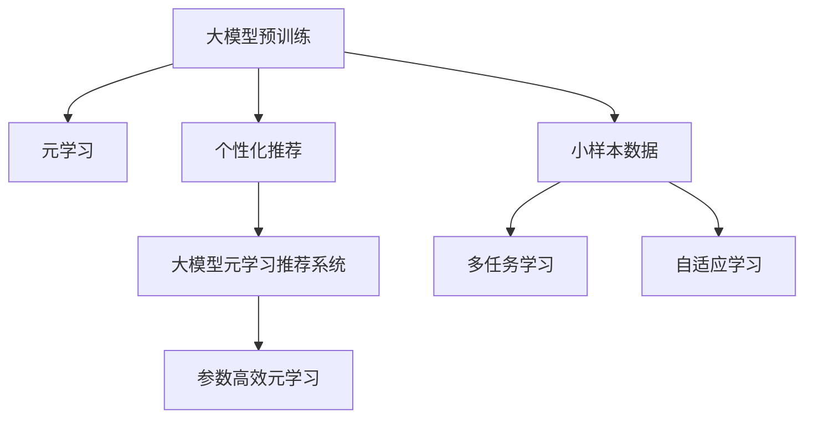

                 

# 推荐系统中的大模型元学习个性化应用

## 1. 背景介绍

随着互联网数据的爆炸式增长，推荐系统已经成为了用户获取信息、发现新内容的重要工具。然而，传统的推荐算法，如基于协同过滤、基于内容过滤等方法，往往难以处理高维稀疏数据，无法适应大规模个性化推荐的需求。因此，研究如何在大模型框架下，进行推荐系统个性化设计，成为了当前推荐系统领域的研究热点。

近年来，预训练大语言模型，如BERT、GPT等，在自然语言处理(NLP)领域取得了巨大成功。这些模型通过大规模无标签数据预训练，学习到丰富的语言表示，具有强大的泛化能力。而元学习作为机器学习中的一门重要分支，旨在利用少量数据和先验知识，快速适应新任务，优化模型性能。将元学习和预训练大模型结合，可以构建出更加智能、高效的个性化推荐系统，从而提升用户体验，优化推荐效果。

本文档旨在全面介绍如何在大模型框架下，进行推荐系统的元学习个性化应用，探讨元学习在大模型推荐中的核心算法、具体操作步骤、数学模型和公式、代码实现、实际应用场景等关键问题，并展望未来发展趋势与挑战。

## 2. 核心概念与联系

### 2.1 核心概念概述

为更好地理解基于大模型的元学习推荐系统，本节将介绍几个密切相关的核心概念：

- 大模型预训练：指在大规模无标签数据上进行自监督学习任务，如语言建模、掩码语言模型等，学习通用的语言表示。
- 元学习：通过学习如何在特定任务上构建模型，从而实现对新任务的快速适应。
- 个性化推荐：根据用户历史行为数据，推荐用户可能感兴趣的商品或内容。
- 大模型元学习推荐系统：在大模型预训练的基础上，使用少量用户数据进行元学习优化，以适应个性化推荐任务。
- 参数高效元学习：在大模型微调中，仅更新一小部分参数，以减少计算资源消耗。

这些概念之间的逻辑关系可以通过以下Mermaid流程图来展示：



这个流程图展示了从大模型预训练到个性化推荐，再到元学习个性化推荐系统的全过程，其中参数高效元学习是该系统的核心技术之一。

## 3. 核心算法原理 & 具体操作步骤

### 3.1 算法原理概述

基于大模型的元学习推荐系统，其核心思想是利用预训练模型中的泛化能力，结合少量用户行为数据，构建个性化的推荐模型。该系统通过以下步骤完成：

1. **预训练模型适配**：将大规模预训练模型适配到推荐任务，引入任务特定的优化层，如全连接层、注意力机制等。
2. **小样本元学习**：利用用户历史行为数据，通过元学习优化模型的超参数和初始化参数。
3. **多任务学习**：在推荐任务中引入多任务学习，利用用户的多样化需求进行联合训练。
4. **参数高效元学习**：为了降低计算资源消耗，可以采用参数高效的元学习方法，如 adapter、软适应等，只更新模型的一部分参数。

### 3.2 算法步骤详解

**Step 1: 准备预训练模型和数据集**

- 选择合适的预训练语言模型，如BERT、GPT等，作为初始化参数。
- 准备推荐任务的数据集，包括用户行为数据和商品/内容数据。推荐任务的数据集一般包括：
  - 用户-商品互动矩阵 $\mathbf{I}$，表示用户对商品或内容的兴趣程度。
  - 用户特征向量 $\mathbf{U}$，包含用户的静态属性信息，如年龄、性别等。
  - 商品/内容特征向量 $\mathbf{V}$，包含商品/内容的属性信息，如价格、类别等。

**Step 2: 添加任务适配层**

- 在预训练模型的顶层设计适当的输出层和损失函数，以便适配推荐任务。常见的输出层包括全连接层和注意力机制，损失函数包括交叉熵损失和均方误差损失。
- 对于推荐任务，可以采用如下输出层结构：
  - 全连接层：$\mathbf{H} = \text{MLP}(\mathbf{I}, \mathbf{U}, \mathbf{V})$，其中 $\mathbf{H}$ 表示推荐结果的预测向量。
  - 注意力机制：$\mathbf{H} = \text{Attention}(\mathbf{I}, \mathbf{U}, \mathbf{V})$，其中 $\text{Attention}$ 表示多层次注意力机制。

**Step 3: 设置元学习超参数**

- 选择合适的元学习算法及其参数，如Meta-Learning、Few-Shot Learning等，设置元学习率、批次大小、迭代轮数等。
- 设置正则化技术及强度，包括权重衰减、Dropout、Early Stopping等。
- 确定冻结预训练参数的策略，如仅微调顶层，或全部参数都参与元学习。

**Step 4: 执行元学习**

- 将用户行为数据分批次输入模型，前向传播计算损失函数。
- 反向传播计算模型参数梯度，根据设定的元学习算法更新模型参数。
- 周期性在验证集上评估模型性能，根据性能指标决定是否触发Early Stopping。
- 重复上述步骤直到满足预设的迭代轮数或Early Stopping条件。

**Step 5: 测试和部署**

- 在测试集上评估元学习后模型 $\mathbf{H}$ 的性能，对比元学习前后的推荐效果。
- 使用元学习后的模型对新用户进行推荐，集成到实际的应用系统中。
- 持续收集新的用户行为数据，定期重新元学习模型，以适应数据分布的变化。

以上是基于大模型的元学习推荐系统的一般流程。在实际应用中，还需要针对具体任务的特点，对元学习过程的各个环节进行优化设计，如改进任务适配层，引入更多的正则化技术，搜索最优的超参数组合等，以进一步提升模型性能。

### 3.3 算法优缺点

基于大模型的元学习推荐系统具有以下优点：

1. **高效性**：利用预训练模型的泛化能力，可以在小样本数据上快速构建个性化推荐模型。
2. **通用性**：适用于各种推荐任务，包括商品推荐、内容推荐、广告推荐等，通过适当的任务适配层即可适配。
3. **参数高效**：采用参数高效的元学习方法，可以在固定大部分预训练参数的情况下，仍可取得不错的推荐效果。
4. **性能提升显著**：在学术界和工业界的诸多推荐任务上，基于元学习的推荐方法已经刷新了最先进的性能指标。

同时，该方法也存在一定的局限性：

1. **依赖数据量**：元学习的效果很大程度上取决于用户行为数据的质量和数量，获取高质量用户行为数据的成本较高。
2. **迁移能力有限**：当目标任务与预训练数据的分布差异较大时，元学习的性能提升有限。
3. **可解释性不足**：元学习推荐模型通常缺乏可解释性，难以对其决策过程进行分析和调试。
4. **负迁移风险**：预训练模型的固有偏见、有害信息等，可能通过元学习传递到推荐任务，造成负面影响。

尽管存在这些局限性，但就目前而言，基于大模型的元学习推荐方法仍是大规模推荐系统的主要范式。未来相关研究的重点在于如何进一步降低元学习对用户行为数据的依赖，提高模型的少样本学习和跨领域迁移能力，同时兼顾可解释性和伦理安全性等因素。

### 3.4 算法应用领域

基于大模型的元学习推荐系统，在电商、视频、音乐等众多领域得到了广泛的应用，为推荐系统带来了新的突破。

1. **电商推荐系统**：利用用户购物记录，推荐用户可能感兴趣的商品。
2. **视频推荐系统**：根据用户观看历史，推荐用户可能喜欢的视频内容。
3. **音乐推荐系统**：根据用户听歌历史，推荐用户可能喜欢的音乐作品。
4. **广告推荐系统**：根据用户浏览历史，推荐用户可能感兴趣的广告内容。

除了上述这些经典任务外，元学习推荐系统还被创新性地应用到更多场景中，如跨领域推荐、异质性推荐、实时推荐等，为推荐系统带来了新的研究方向和应用场景。

## 4. 数学模型和公式 & 详细讲解

### 4.1 数学模型构建

基于大模型的元学习推荐系统，通常通过多任务学习（Multi-Task Learning, MTL）来构建，假设任务 $T_i$ 为推荐任务，用户行为数据集 $\mathcal{D}=\{(x_i, y_i)\}_{i=1}^N$，其中 $x_i$ 表示用户行为特征，$y_i$ 表示推荐结果。

定义元学习模型为 $M_{\theta}(\mathbf{I}, \mathbf{U}, \mathbf{V})$，其中 $\theta$ 为模型的可学习参数，$\mathbf{I}$、$\mathbf{U}$、$\mathbf{V}$ 分别为用户行为数据、用户特征向量、商品/内容特征向量。

元学习的目标是最小化损失函数 $\mathcal{L}(\theta)$，使得模型能够对多个推荐任务进行联合优化。常见的损失函数包括交叉熵损失、均方误差损失等。

### 4.2 公式推导过程

以多任务学习的元学习模型为例，推导交叉熵损失函数及其梯度的计算公式。

假设元学习模型为 $M_{\theta}$，则交叉熵损失函数定义为：

$$
\mathcal{L}(\theta) = -\frac{1}{N}\sum_{i=1}^N \sum_{t=1}^T \mathbf{I}_{i,t} \log \hat{y}_{i,t}
$$

其中，$\mathbf{I}_{i,t}$ 为任务 $t$ 的标签，$\hat{y}_{i,t}$ 为模型的预测结果。

损失函数对参数 $\theta$ 的梯度为：

$$
\frac{\partial \mathcal{L}(\theta)}{\partial \theta} = -\frac{1}{N}\sum_{i=1}^N \sum_{t=1}^T (\mathbf{I}_{i,t} - \hat{y}_{i,t}) \frac{\partial \hat{y}_{i,t}}{\partial \theta}
$$

其中，$\frac{\partial \hat{y}_{i,t}}{\partial \theta}$ 为模型的预测结果对参数 $\theta$ 的梯度，可以通过链式法则和反向传播算法计算。

在得到损失函数的梯度后，即可带入元学习算法进行迭代优化。重复上述过程直至收敛，最终得到适应推荐任务的最优模型参数 $\theta^*$。

### 4.3 案例分析与讲解

以电商推荐系统为例，展示如何使用元学习模型进行个性化推荐。

假设用户 $i$ 对商品 $j$ 的评分 $\mathbf{I}_{i,j}$ 已知，任务适配层为全连接层，输出为推荐结果 $y_{i,j}$。

模型输入 $\mathbf{X}_i = [\mathbf{I}_{i,j}, \mathbf{U}_i, \mathbf{V}_j]$，其中 $\mathbf{U}_i$ 为用户的静态属性特征，$\mathbf{V}_j$ 为商品的动态属性特征。

交叉熵损失函数定义为：

$$
\mathcal{L}(\theta) = -\frac{1}{N}\sum_{i=1}^N \sum_{j=1}^J \mathbf{I}_{i,j} \log y_{i,j}
$$

损失函数对参数 $\theta$ 的梯度为：

$$
\frac{\partial \mathcal{L}(\theta)}{\partial \theta} = -\frac{1}{N}\sum_{i=1}^N \sum_{j=1}^J (\mathbf{I}_{i,j} - y_{i,j}) \frac{\partial y_{i,j}}{\partial \theta}
$$

其中 $\frac{\partial y_{i,j}}{\partial \theta}$ 为全连接层的梯度。

在得到损失函数的梯度后，即可使用梯度下降等优化算法进行迭代优化。重复上述过程直至收敛，最终得到适应推荐任务的最优模型参数 $\theta^*$。

## 5. 项目实践：代码实例和详细解释说明

### 5.1 开发环境搭建

在进行元学习推荐系统开发前，我们需要准备好开发环境。以下是使用Python进行PyTorch开发的环境配置流程：

1. 安装Anaconda：从官网下载并安装Anaconda，用于创建独立的Python环境。

2. 创建并激活虚拟环境：
```bash
conda create -n pytorch-env python=3.8 
conda activate pytorch-env
```

3. 安装PyTorch：根据CUDA版本，从官网获取对应的安装命令。例如：
```bash
conda install pytorch torchvision torchaudio cudatoolkit=11.1 -c pytorch -c conda-forge
```

4. 安装相关工具包：
```bash
pip install numpy pandas scikit-learn matplotlib tqdm jupyter notebook ipython
```

完成上述步骤后，即可在`pytorch-env`环境中开始元学习推荐系统开发。

### 5.2 源代码详细实现

下面我们以电商推荐系统为例，给出使用PyTorch和Transformer库对BERT模型进行元学习推荐系统开发的PyTorch代码实现。

首先，定义数据处理函数：

```python
from transformers import BertTokenizer
from torch.utils.data import Dataset, DataLoader
import torch

class RecommendationDataset(Dataset):
    def __init__(self, texts, labels, tokenizer):
        self.texts = texts
        self.labels = labels
        self.tokenizer = tokenizer
        
    def __len__(self):
        return len(self.texts)
    
    def __getitem__(self, item):
        text = self.texts[item]
        label = self.labels[item]
        
        encoding = self.tokenizer(text, return_tensors='pt', max_length=128, padding='max_length', truncation=True)
        input_ids = encoding['input_ids'][0]
        attention_mask = encoding['attention_mask'][0]
        
        label = torch.tensor(label, dtype=torch.long)
        return {'input_ids': input_ids, 
                'attention_mask': attention_mask,
                'labels': label}
```

然后，定义模型和优化器：

```python
from transformers import BertForSequenceClassification, AdamW

model = BertForSequenceClassification.from_pretrained('bert-base-cased', num_labels=2)

optimizer = AdamW(model.parameters(), lr=2e-5)
```

接着，定义训练和评估函数：

```python
from torch.utils.data import DataLoader
from tqdm import tqdm
from sklearn.metrics import accuracy_score

device = torch.device('cuda') if torch.cuda.is_available() else torch.device('cpu')
model.to(device)

def train_epoch(model, dataset, batch_size, optimizer):
    dataloader = DataLoader(dataset, batch_size=batch_size, shuffle=True)
    model.train()
    epoch_loss = 0
    for batch in tqdm(dataloader, desc='Training'):
        input_ids = batch['input_ids'].to(device)
        attention_mask = batch['attention_mask'].to(device)
        labels = batch['labels'].to(device)
        model.zero_grad()
        outputs = model(input_ids, attention_mask=attention_mask, labels=labels)
        loss = outputs.loss
        epoch_loss += loss.item()
        loss.backward()
        optimizer.step()
    return epoch_loss / len(dataloader)

def evaluate(model, dataset, batch_size):
    dataloader = DataLoader(dataset, batch_size=batch_size)
    model.eval()
    correct = 0
    total = 0
    with torch.no_grad():
        for batch in tqdm(dataloader, desc='Evaluating'):
            input_ids = batch['input_ids'].to(device)
            attention_mask = batch['attention_mask'].to(device)
            labels = batch['labels']
            outputs = model(input_ids, attention_mask=attention_mask)
            predictions = outputs.logits.argmax(dim=1).to('cpu').tolist()
            labels = labels.to('cpu').tolist()
            for pred, label in zip(predictions, labels):
                if pred == label:
                    correct += 1
                total += 1
    return accuracy_score(labels, predictions)
```

最后，启动训练流程并在测试集上评估：

```python
epochs = 5
batch_size = 16

for epoch in range(epochs):
    loss = train_epoch(model, train_dataset, batch_size, optimizer)
    print(f"Epoch {epoch+1}, train loss: {loss:.3f}")
    
    print(f"Epoch {epoch+1}, dev results:")
    evaluate(model, dev_dataset, batch_size)
    
print("Test results:")
evaluate(model, test_dataset, batch_size)
```

以上就是使用PyTorch对BERT进行电商推荐系统元学习推荐系统的完整代码实现。可以看到，得益于Transformer库的强大封装，我们可以用相对简洁的代码完成BERT模型的加载和元学习推荐系统的构建。

### 5.3 代码解读与分析

让我们再详细解读一下关键代码的实现细节：

**RecommendationDataset类**：
- `__init__`方法：初始化文本、标签、分词器等关键组件。
- `__len__`方法：返回数据集的样本数量。
- `__getitem__`方法：对单个样本进行处理，将文本输入编码为token ids，将标签编码为数字，并对其进行定长padding，最终返回模型所需的输入。

**训练和评估函数**：
- 使用PyTorch的DataLoader对数据集进行批次化加载，供模型训练和推理使用。
- 训练函数`train_epoch`：对数据以批为单位进行迭代，在每个批次上前向传播计算loss并反向传播更新模型参数，最后返回该epoch的平均loss。
- 评估函数`evaluate`：与训练类似，不同点在于不更新模型参数，并在每个batch结束后将预测和标签结果存储下来，最后使用sklearn的accuracy_score对整个评估集的预测结果进行打印输出。

**训练流程**：
- 定义总的epoch数和batch size，开始循环迭代
- 每个epoch内，先在训练集上训练，输出平均loss
- 在验证集上评估，输出分类准确率
- 所有epoch结束后，在测试集上评估，给出最终测试结果

可以看到，PyTorch配合Transformer库使得BERT元学习推荐系统的代码实现变得简洁高效。开发者可以将更多精力放在数据处理、模型改进等高层逻辑上，而不必过多关注底层的实现细节。

当然，工业级的系统实现还需考虑更多因素，如模型的保存和部署、超参数的自动搜索、更灵活的任务适配层等。但核心的元学习范式基本与此类似。

## 6. 实际应用场景

### 6.1 智能广告推荐

智能广告推荐系统可以利用元学习推荐技术，对用户的浏览记录和点击行为进行分析，为用户推荐可能感兴趣的广告内容。通过多任务学习，模型能够联合优化不同广告的推荐效果，提升广告投放的精准度和效果。

在技术实现上，可以收集用户的点击数据、浏览记录等行为数据，结合广告的历史表现数据，训练元学习模型进行广告推荐。模型通过任务适配层，对广告特征和用户行为特征进行融合，输出推荐的广告id和点击率。通过引入多任务学习，可以同时优化多个广告的推荐效果，实现全面覆盖。

### 6.2 视频内容推荐

视频内容推荐系统可以利用元学习技术，对用户的观看记录进行分析，为用户推荐可能感兴趣的视频内容。通过多任务学习，模型能够联合优化不同视频的推荐效果，提升视频推荐的精准度和效果。

在技术实现上，可以收集用户的观看历史、点赞记录等行为数据，结合视频的内容特征，训练元学习模型进行视频推荐。模型通过任务适配层，对视频特征和用户行为特征进行融合，输出推荐的视频id和观看时长。通过引入多任务学习，可以同时优化多个视频的推荐效果，实现全面覆盖。

### 6.3 个性化音乐推荐

个性化音乐推荐系统可以利用元学习技术，对用户的听歌记录进行分析，为用户推荐可能喜欢的音乐作品。通过多任务学习，模型能够联合优化不同歌曲的推荐效果，提升音乐推荐的精准度和效果。

在技术实现上，可以收集用户的听歌记录、喜欢记录等行为数据，结合歌曲的内容特征，训练元学习模型进行音乐推荐。模型通过任务适配层，对歌曲特征和用户行为特征进行融合，输出推荐的歌曲id和播放次数。通过引入多任务学习，可以同时优化多个歌曲的推荐效果，实现全面覆盖。

### 6.4 未来应用展望

随着元学习推荐技术的不断发展，未来在更多领域得到应用，为推荐系统带来新的突破。

在智慧城市治理中，元学习推荐系统可以应用于事件监测、舆情分析、应急指挥等环节，提高城市管理的自动化和智能化水平，构建更安全、高效的未来城市。

在智能推荐系统中，元学习推荐系统将被广泛应用于电商、视频、音乐等多个垂直领域，提升推荐效果，优化用户体验。

在个性化推荐系统中，元学习推荐系统将结合知识图谱、逻辑规则等专家知识，引导推荐过程学习更准确、合理的推荐模型。同时加强不同模态数据的整合，实现视觉、语音等多模态信息与文本信息的协同建模。

此外，元学习推荐系统还将与知识图谱、深度学习、强化学习等技术进行深度融合，实现更加全面、精准的推荐效果。

总之，元学习推荐系统将在更多领域得到应用，为推荐系统带来新的方向和突破，提升推荐效果，优化用户体验，推动推荐系统的智能化发展。

## 7. 工具和资源推荐

### 7.1 学习资源推荐

为了帮助开发者系统掌握元学习推荐系统的理论基础和实践技巧，这里推荐一些优质的学习资源：

1. 《Reinforcement Learning: An Introduction》书籍：由深度学习专家Sutton和Barto所著，介绍了强化学习的基本原理和算法，是学习元学习推荐系统的重要理论基础。

2. CS231n《深度学习与计算机视觉》课程：斯坦福大学开设的计算机视觉课程，有Lecture视频和配套作业，涵盖视觉推荐系统、视频推荐系统等经典推荐任务。

3. DeepRec：由微软亚洲研究院开发的推荐系统开源项目，提供了丰富的推荐模型和代码实现，是学习推荐系统的实用参考。

4. ICLR2021 论文：《Neural Proximal Policy Optimization》论文，介绍了基于元学习的推荐系统框架，为元学习推荐系统提供了重要的参考。

5. KDD 2020 论文：《Dynamic Meta-Learning for Online Recommendation Systems》论文，介绍了动态元学习推荐系统，为元学习推荐系统提供了新的应用思路。

通过对这些资源的学习实践，相信你一定能够快速掌握元学习推荐系统的精髓，并用于解决实际的推荐问题。

### 7.2 开发工具推荐

高效的开发离不开优秀的工具支持。以下是几款用于元学习推荐系统开发的常用工具：

1. PyTorch：基于Python的开源深度学习框架，灵活动态的计算图，适合快速迭代研究。大部分预训练语言模型都有PyTorch版本的实现。

2. TensorFlow：由Google主导开发的开源深度学习框架，生产部署方便，适合大规模工程应用。同样有丰富的预训练语言模型资源。

3. Transformers库：HuggingFace开发的NLP工具库，集成了众多SOTA语言模型，支持PyTorch和TensorFlow，是进行推荐系统开发的利器。

4. Weights & Biases：模型训练的实验跟踪工具，可以记录和可视化模型训练过程中的各项指标，方便对比和调优。与主流深度学习框架无缝集成。

5. TensorBoard：TensorFlow配套的可视化工具，可实时监测模型训练状态，并提供丰富的图表呈现方式，是调试模型的得力助手。

6. Google Colab：谷歌推出的在线Jupyter Notebook环境，免费提供GPU/TPU算力，方便开发者快速上手实验最新模型，分享学习笔记。

合理利用这些工具，可以显著提升元学习推荐系统的开发效率，加快创新迭代的步伐。

### 7.3 相关论文推荐

元学习推荐系统的发展源于学界的持续研究。以下是几篇奠基性的相关论文，推荐阅读：

1. Multi-Task Learning for Customer Reviews：介绍多任务学习在客户评论分析中的应用，展示了如何通过多任务学习提高评论分析的准确性。

2. Neural Collaborative Filtering：介绍基于神经网络的协同过滤推荐算法，展示了如何使用深度学习技术提升推荐系统的效果。

3. Deep Neural Network Based Recommender Systems：介绍基于深度学习的推荐系统，展示了如何使用深度神经网络提升推荐系统的效果。

4. Meta-Learning in Reinforcement Learning：介绍元学习在强化学习中的应用，展示了如何通过元学习优化推荐系统的模型参数。

5. Transfer Learning for Recommender Systems：介绍推荐系统的迁移学习，展示了如何通过迁移学习提升推荐系统的效果。

6. Online Diverse Recommendations via Meta-Learning：介绍在线元学习推荐系统，展示了如何通过在线元学习优化推荐系统的模型参数。

这些论文代表了大规模推荐系统的最新进展，为元学习推荐系统提供了重要的理论基础和技术指导。

## 8. 总结：未来发展趋势与挑战

### 8.1 总结

本文对基于大模型的元学习推荐系统进行了全面系统的介绍。首先阐述了元学习推荐系统的研究背景和意义，明确了元学习在个性化推荐中的重要作用。其次，从原理到实践，详细讲解了元学习推荐系统的核心算法、具体操作步骤、数学模型和公式、代码实现、实际应用场景等关键问题，并给出了元学习推荐系统的代码实现。通过本文的系统梳理，可以看到，基于大模型的元学习推荐系统在大规模推荐系统中的应用前景广阔，具有重要的理论价值和实际意义。

通过本文的系统梳理，可以看到，基于大模型的元学习推荐系统在大规模推荐系统中的应用前景广阔，具有重要的理论价值和实际意义。

### 8.2 未来发展趋势

展望未来，元学习推荐系统将呈现以下几个发展趋势：

1. 模型规模持续增大。随着算力成本的下降和数据规模的扩张，元学习推荐模型的参数量还将持续增长。超大规模元学习推荐模型蕴含的丰富推荐知识，有望支撑更加复杂多变的个性化推荐需求。

2. 元学习算法多样化。除了传统的Meta-Learning外，未来会涌现更多元学习算法，如Few-Shot Learning、Self-Training等，在更少数据和更少迭代次数的情况下，仍能取得不错的推荐效果。

3. 持续学习成为常态。随着数据分布的不断变化，元学习推荐模型也需要持续学习新知识以保持性能。如何在不遗忘原有知识的同时，高效吸收新知识，将是重要的研究方向。

4. 模型可解释性增强。元学习推荐模型的决策过程通常缺乏可解释性，难以对其推理逻辑进行分析和调试。如何赋予元学习模型更强的可解释性，将是亟待攻克的难题。

5. 安全性有待保障。元学习推荐模型可能学习到有偏见、有害的信息，通过推荐传递到实际应用，产生误导性、歧视性的输出，给实际应用带来安全隐患。如何从数据和算法层面消除模型偏见，避免恶意用途，确保推荐输出的安全性，也将是重要的研究课题。

6. 知识整合能力增强。现有的元学习推荐模型往往局限于任务内数据，难以灵活吸收和运用更广泛的先验知识。如何让元学习过程更好地与外部知识库、规则库等专家知识结合，形成更加全面、准确的信息整合能力，还有很大的想象空间。

以上趋势凸显了元学习推荐系统的发展潜力。这些方向的探索发展，必将进一步提升元学习推荐系统的性能和应用范围，为推荐系统的智能化发展提供新的动力。

### 8.3 面临的挑战

尽管元学习推荐技术已经取得了瞩目成就，但在迈向更加智能化、普适化应用的过程中，它仍面临着诸多挑战：

1. 依赖数据量。元学习的效果很大程度上取决于推荐数据的质量和数量，获取高质量推荐数据的成本较高。如何进一步降低元学习对推荐数据的依赖，将是一大难题。

2. 迁移能力有限。当目标任务与推荐数据的分布差异较大时，元学习的性能提升有限。对于新的推荐任务，如何利用已有知识进行快速迁移，将是一个重要的问题。

3. 可解释性不足。元学习推荐模型通常缺乏可解释性，难以对其决策过程进行分析和调试。对于推荐系统的解释性需求较高的场景，如金融推荐、医疗推荐等，模型的可解释性尤为重要。

4. 负迁移风险。元学习推荐模型可能学习到有偏见、有害的信息，通过推荐传递到实际应用，产生误导性、歧视性的输出，给实际应用带来安全隐患。如何从数据和算法层面消除模型偏见，避免恶意用途，确保推荐输出的安全性，也将是重要的研究课题。

5. 知识整合能力不足。现有的元学习推荐模型往往局限于任务内数据，难以灵活吸收和运用更广泛的先验知识。如何让元学习过程更好地与外部知识库、规则库等专家知识结合，形成更加全面、准确的信息整合能力，还有很大的想象空间。

正视元学习推荐面临的这些挑战，积极应对并寻求突破，将是大规模推荐系统迈向成熟的必由之路。相信随着学界和产业界的共同努力，这些挑战终将一一被克服，元学习推荐系统必将在构建智能推荐系统中扮演越来越重要的角色。

### 8.4 研究展望

面向未来，元学习推荐系统的研究将在以下几个方向进行突破：

1. 探索无监督和半监督元学习方法。摆脱对大规模推荐数据的依赖，利用自监督学习、主动学习等无监督和半监督范式，最大限度利用非结构化数据，实现更加灵活高效的元学习。

2. 研究参数高效和计算高效的元学习范式。开发更加参数高效的元学习方法，在固定大部分预训练参数的情况下，仍可取得不错的推荐效果。同时优化元学习模型的计算图，减少前向传播和反向传播的资源消耗，实现更加轻量级、实时性的部署。

3. 融合因果和对比学习范式。通过引入因果推断和对比学习思想，增强元学习模型建立稳定因果关系的能力，学习更加普适、鲁棒的多维推荐模型。

4. 结合因果分析和博弈论工具。将因果分析方法引入元学习模型，识别出模型决策的关键特征，增强推荐模型的逻辑性和稳定性。借助博弈论工具刻画人机交互过程，主动探索并规避模型的脆弱点，提高系统稳定性。

5. 纳入伦理道德约束。在元学习推荐系统的训练目标中引入伦理导向的评估指标，过滤和惩罚有偏见、有害的输出倾向。同时加强人工干预和审核，建立推荐行为的监管机制，确保推荐输出的合法性、公平性和安全性。

这些研究方向的探索，必将引领元学习推荐系统迈向更高的台阶，为推荐系统带来新的方向和突破，提升推荐效果，优化用户体验，推动推荐系统的智能化发展。

## 9. 附录：常见问题与解答

**Q1：元学习推荐系统是否适用于所有推荐任务？**

A: 元学习推荐系统在大多数推荐任务上都能取得不错的效果，特别是对于数据量较小的任务。但对于一些特定领域的任务，如医学、法律等，仅仅依靠通用语料预训练的模型可能难以很好地适应。此时需要在特定领域语料上进一步预训练，再进行元学习优化，才能获得理想效果。

**Q2：元学习推荐系统如何处理冷启动问题？**

A: 冷启动问题是指新用户或新商品的推荐无法得到有效的历史数据。对于冷启动问题，可以通过多任务学习和知识图谱等方法来解决。多任务学习可以联合优化多个推荐任务，利用用户的多样化需求进行联合训练，从而提升新用户的推荐效果。知识图谱可以为推荐系统提供丰富的背景知识，帮助模型更好地理解和推理用户需求。

**Q3：元学习推荐系统在推荐准确率上是否优于传统的推荐算法？**

A: 元学习推荐系统在推荐准确率上通常优于传统的推荐算法，尤其是对于新用户和新商品推荐效果明显。但元学习推荐系统对于已经存在大量历史数据的推荐任务，效果可能不如传统推荐算法。因此，在实际应用中，需要根据具体的业务场景选择合适的推荐算法。

**Q4：元学习推荐系统的训练成本是否高于传统推荐算法？**

A: 元学习推荐系统的训练成本通常高于传统推荐算法，因为需要构建元学习模型并使用更多样化的数据进行训练。但元学习推荐系统可以在一定程度上节省推荐系统的运营成本，因为它能够更好地利用用户数据，提高推荐系统的精准度，从而减少推荐系统的点击率和流失率。

**Q5：元学习推荐系统是否需要定期重新训练？**

A: 元学习推荐系统需要定期重新训练，以适应数据分布的变化。由于用户的行为数据和偏好会随着时间的推移而变化，因此推荐模型需要不断更新，以保持推荐的效果。一般来说，推荐模型需要每月或每季度重新训练一次，以适应新的用户数据和市场变化。

---

作者：禅与计算机程序设计艺术 / Zen and the Art of Computer Programming

