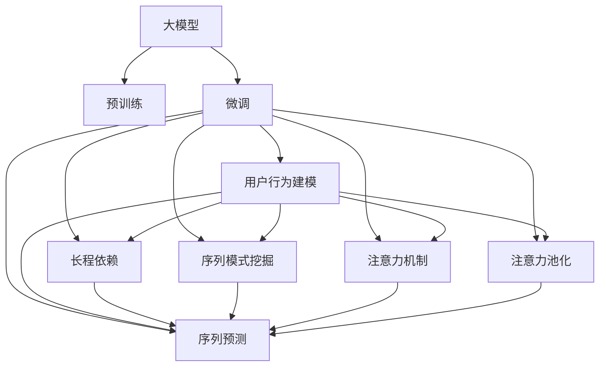

                 

# 推荐系统中的序列模式挖掘：大模型的长程依赖建模

> 关键词：推荐系统, 序列模式挖掘, 长程依赖, 大模型, 注意力机制, 注意力池化, 序列预测, 用户行为建模

## 1. 背景介绍

推荐系统是互联网时代的重要应用，其核心任务是根据用户的历史行为数据，预测用户对物品的兴趣和偏好，从而为用户推荐个性化内容。随着互联网数据的爆炸式增长，推荐系统不仅需要处理大规模数据，还需要捕捉用户行为序列中的深层次模式，以实现精准、高效的个性化推荐。传统的推荐算法如协同过滤、内容推荐等，往往只能捕捉用户短期行为，难以理解用户长期兴趣和行为规律，导致推荐结果不够准确和个性化。近年来，随着深度学习技术的发展，大模型在推荐系统中的应用变得日益重要。大模型能够从海量数据中学习复杂的序列依赖关系，捕捉用户行为的深层次模式，从而实现更加精准的推荐。

### 1.1 推荐系统的演变

推荐系统的历史可以追溯到20世纪90年代，最初的推荐算法是基于协同过滤和内容推荐的。协同过滤算法包括基于用户的协同过滤和基于物品的协同过滤。用户协同过滤算法通过计算用户与物品之间的相似度，为用户推荐相似用户喜欢的物品。物品协同过滤算法通过计算物品之间的相似度，为用户推荐相似物品。内容推荐算法则是根据物品的特征向量和用户的历史行为数据，预测用户对物品的兴趣。这些方法基于短期的行为数据，难以捕捉用户的长期兴趣和行为规律。

随着深度学习技术的发展，大模型开始在推荐系统中得到广泛应用。大模型能够从大规模数据中学习复杂的序列依赖关系，捕捉用户行为序列中的深层次模式，从而实现更加精准的推荐。大模型的核心思想是利用大量历史数据进行预训练，学习通用的语言和行为表示，然后在特定任务上进行微调，获得优异的推荐效果。目前，大模型在推荐系统中已经展示了强大的能力，广泛应用于电商、视频、音乐等多个领域，显著提升了推荐系统的性能和用户体验。

## 2. 核心概念与联系

### 2.1 核心概念概述

为更好地理解大模型在推荐系统中的应用，本节将介绍几个密切相关的核心概念：

- 大模型(Large Model)：指具有大规模参数量的深度神经网络，如BERT、GPT等。大模型通常从大规模无标签数据中预训练，学习通用的语言和行为表示。

- 长程依赖(Long-term Dependency)：指用户行为序列中长距离依赖关系，即当前行为可能受到过去几十甚至几百个行为的影响。长程依赖关系在大模型中非常重要，可以帮助模型理解用户的长期兴趣和行为规律。

- 序列模式挖掘(Sequence Pattern Mining)：指从用户行为序列中挖掘出深层次的模式，如趋势、周期、偏好等。序列模式挖掘是大模型推荐系统中的核心任务，通过挖掘序列模式，可以更好地理解用户的兴趣和行为规律。

- 注意力机制(Attention Mechanism)：指在大模型中通过注意力机制，动态地分配不同部分的输入序列的权重，从而实现对不同部分的信息的关注和聚合。

- 注意力池化(Attention Pooling)：指在多序列聚合时，利用注意力池化技术，对多个序列进行聚合，并动态地分配权重，从而提高聚合效果。

- 序列预测(Sequence Prediction)：指利用大模型对用户行为序列进行预测，如预测用户未来的点击、购买行为等。序列预测是大模型推荐系统的核心任务之一。

- 用户行为建模(User Behavior Modeling)：指利用大模型对用户行为进行建模，包括用户兴趣、行为规律、偏好等。用户行为建模是大模型推荐系统的基础任务。

这些核心概念之间的逻辑关系可以通过以下Mermaid流程图来展示：



这个流程图展示了不同概念之间的联系：

1. 大模型通过预训练获得通用的语言和行为表示。
2. 微调是针对特定任务对大模型进行优化，以获得更好的推荐效果。
3. 长程依赖关系和大模型能够理解用户的长期兴趣和行为规律。
4. 序列模式挖掘能够挖掘用户行为序列中的深层次模式。
5. 注意力机制和注意力池化技术能够动态地分配权重，提高聚合效果。
6. 序列预测能够根据用户行为序列预测未来的行为。
7. 用户行为建模能够对用户兴趣、行为规律等进行建模。

这些概念共同构成了大模型在推荐系统中的应用框架，使得模型能够从大规模数据中学习深层次的依赖关系，并用于精准推荐。

## 3. 核心算法原理 & 具体操作步骤
### 3.1 算法原理概述

大模型在推荐系统中的应用，主要体现在两个方面：序列模式挖掘和序列预测。序列模式挖掘利用大模型对用户行为序列进行建模，挖掘用户行为中的深层次模式，如趋势、周期、偏好等。序列预测则是利用大模型对用户行为序列进行预测，如预测用户未来的点击、购买行为等。

大模型在推荐系统中的应用原理可以概括为以下几个步骤：

1. 数据预处理：将用户行为数据进行清洗、归一化等处理，生成用于训练和预测的序列数据。
2. 大模型预训练：在大量无标签数据上对大模型进行预训练，学习通用的语言和行为表示。
3. 微调：在特定任务上对大模型进行微调，以获得更好的推荐效果。
4. 序列模式挖掘：利用大模型对用户行为序列进行建模，挖掘用户行为序列中的深层次模式。
5. 序列预测：利用大模型对用户行为序列进行预测，如预测用户未来的点击、购买行为等。

### 3.2 算法步骤详解

以下是利用大模型在推荐系统中进行序列模式挖掘和序列预测的具体操作步骤：

**Step 1: 数据预处理**

- 收集用户行为数据，包括用户的点击、购买、浏览等行为记录。
- 将行为数据进行清洗、去重、归一化等处理，生成用于训练和预测的序列数据。
- 将序列数据按时间顺序排列，生成时序数据集。

**Step 2: 大模型预训练**

- 选择合适的大模型，如BERT、GPT等，在大量无标签数据上进行预训练，学习通用的语言和行为表示。
- 对大模型进行序列模式挖掘任务预训练，如趋势、周期、偏好等。
- 对大模型进行序列预测任务预训练，如预测用户未来的点击、购买行为等。

**Step 3: 微调**

- 选择合适的小规模标注数据集，对大模型进行微调，以获得更好的推荐效果。
- 在特定任务上对大模型进行微调，如商品推荐、视频推荐等。
- 设置合适的学习率、批大小、迭代轮数等超参数，进行微调训练。

**Step 4: 序列模式挖掘**

- 利用微调后的大模型对用户行为序列进行建模，挖掘用户行为序列中的深层次模式。
- 对用户行为序列进行序列模式挖掘，如趋势、周期、偏好等。
- 利用挖掘出的模式，构建用户兴趣模型和行为预测模型。

**Step 5: 序列预测**

- 利用微调后的大模型对用户行为序列进行预测，如预测用户未来的点击、购买行为等。
- 对用户行为序列进行序列预测，生成推荐结果。
- 将推荐结果反馈给用户，并根据用户反馈进行调整优化。

### 3.3 算法优缺点

利用大模型在推荐系统中的序列模式挖掘和序列预测具有以下优点：

1. 能够捕捉用户行为序列中的长程依赖关系，理解用户的长期兴趣和行为规律。
2. 能够从大规模数据中学习通用的语言和行为表示，提高推荐系统的泛化能力。
3. 能够进行序列模式挖掘和序列预测，捕捉用户行为序列中的深层次模式，提高推荐系统的准确性和个性化。

同时，大模型在推荐系统中的应用也存在以下缺点：

1. 需要大量的计算资源和时间进行预训练和大模型微调，成本较高。
2. 大模型可能存在偏差，推荐结果可能不适用于所有用户。
3. 大模型需要大量的标注数据进行微调，数据标注成本较高。
4. 大模型的推理速度较慢，难以满足实时推荐的要求。

尽管存在这些缺点，但大模型在推荐系统中的应用已经展示了强大的能力，成为推荐系统中的重要组成部分。

### 3.4 算法应用领域

大模型在推荐系统中的应用广泛，包括电商、视频、音乐等多个领域。以下是一些典型应用：

- 电商推荐系统：利用大模型对用户行为序列进行建模和预测，推荐个性化商品。
- 视频推荐系统：利用大模型对用户行为序列进行建模和预测，推荐个性化视频内容。
- 音乐推荐系统：利用大模型对用户行为序列进行建模和预测，推荐个性化音乐内容。
- 新闻推荐系统：利用大模型对用户行为序列进行建模和预测，推荐个性化新闻内容。

## 4. 数学模型和公式 & 详细讲解
### 4.1 数学模型构建

假设用户行为序列为 $X = (x_1, x_2, ..., x_t)$，其中 $x_t$ 为第 $t$ 个行为。假设大模型为 $M$，其输入为 $x$，输出为 $h(x)$。在序列模式挖掘中，我们定义序列模式为 $P = (p_1, p_2, ..., p_k)$，其中 $p_i$ 为第 $i$ 个模式。

序列模式挖掘的数学模型可以表示为：

$$
P = \arg\min_{P} \sum_{t=1}^{N} \sum_{k=1}^{K} \lambda_k d(P_k, h(x_t))
$$

其中 $N$ 为序列长度，$K$ 为模式数量，$\lambda_k$ 为第 $k$ 个模式的权重，$d(P_k, h(x_t))$ 为模式 $P_k$ 与大模型输出 $h(x_t)$ 的距离。

在序列预测中，我们定义序列预测目标为 $y$，序列预测的数学模型可以表示为：

$$
y = M(x)
$$

其中 $M(x)$ 为大模型对用户行为序列 $x$ 的预测输出。

### 4.2 公式推导过程

以序列模式挖掘为例，以下是其公式推导过程：

假设用户行为序列 $X = (x_1, x_2, ..., x_t)$，大模型 $M$ 的输出为 $h(x_t)$，序列模式为 $P = (p_1, p_2, ..., p_k)$，序列模式挖掘的目标是最小化模式 $P$ 与大模型输出 $h(x_t)$ 的距离，即：

$$
\min_{P} \sum_{t=1}^{N} \sum_{k=1}^{K} \lambda_k d(P_k, h(x_t))
$$

假设模式 $P_k$ 由 $m$ 个特征 $f_1, f_2, ..., f_m$ 组成，则有：

$$
P_k = \sum_{i=1}^{m} \alpha_i f_i(x_t)
$$

其中 $\alpha_i$ 为第 $i$ 个特征的权重。

假设大模型 $M$ 的输出为 $h(x_t) = (h_1(x_t), h_2(x_t), ..., h_d(x_t))$，其中 $d$ 为输出维度。

假设距离函数 $d(P_k, h(x_t))$ 为欧氏距离，则有：

$$
d(P_k, h(x_t)) = \sqrt{\sum_{i=1}^{d} (h_i(x_t) - p_i)^2}
$$

代入公式得：

$$
\min_{P} \sum_{t=1}^{N} \sum_{k=1}^{K} \lambda_k \sqrt{\sum_{i=1}^{d} (h_i(x_t) - p_i)^2}
$$

通过求解上述最小化问题，可以找到最优的模式 $P$。

### 4.3 案例分析与讲解

以电商推荐系统为例，以下是利用大模型进行序列模式挖掘和序列预测的案例分析：

**电商推荐系统**

- 数据预处理：收集用户点击、购买、浏览等行为数据，并进行清洗、归一化等处理。
- 大模型预训练：使用BERT模型对用户行为序列进行预训练，学习通用的语言和行为表示。
- 微调：在特定任务上对BERT模型进行微调，如商品推荐任务。
- 序列模式挖掘：利用微调后的BERT模型对用户行为序列进行建模，挖掘用户行为序列中的深层次模式，如趋势、周期、偏好等。
- 序列预测：利用微调后的BERT模型对用户行为序列进行预测，如预测用户未来的点击、购买行为等。
- 推荐结果：根据序列预测结果，生成个性化商品推荐，并反馈给用户。

在电商推荐系统中，利用大模型进行序列模式挖掘和序列预测，能够捕捉用户行为序列中的深层次模式，提高推荐系统的准确性和个性化。

## 5. 项目实践：代码实例和详细解释说明
### 5.1 开发环境搭建

在进行序列模式挖掘和序列预测的实践前，我们需要准备好开发环境。以下是使用Python进行PyTorch开发的环境配置流程：

1. 安装Anaconda：从官网下载并安装Anaconda，用于创建独立的Python环境。

2. 创建并激活虚拟环境：
```bash
conda create -n pytorch-env python=3.8 
conda activate pytorch-env
```

3. 安装PyTorch：根据CUDA版本，从官网获取对应的安装命令。例如：
```bash
conda install pytorch torchvision torchaudio cudatoolkit=11.1 -c pytorch -c conda-forge
```

4. 安装Transformers库：
```bash
pip install transformers
```

5. 安装各类工具包：
```bash
pip install numpy pandas scikit-learn matplotlib tqdm jupyter notebook ipython
```

完成上述步骤后，即可在`pytorch-env`环境中开始实践。

### 5.2 源代码详细实现

这里我们以电商推荐系统为例，给出使用PyTorch和Transformers库对BERT模型进行序列模式挖掘和序列预测的完整代码实现。

首先，定义用户行为序列数据处理函数：

```python
from transformers import BertTokenizer
from torch.utils.data import Dataset, DataLoader
import torch

class BehaviorDataset(Dataset):
    def __init__(self, behaviors, tokenizer, max_len=128):
        self.behaviors = behaviors
        self.tokenizer = tokenizer
        self.max_len = max_len
        
    def __len__(self):
        return len(self.behaviors)
    
    def __getitem__(self, item):
        behavior = self.behaviors[item]
        sequence = behavior['sequence']
        label = behavior['label']
        
        encoding = self.tokenizer(sequence, return_tensors='pt', max_length=self.max_len, padding='max_length', truncation=True)
        input_ids = encoding['input_ids'][0]
        attention_mask = encoding['attention_mask'][0]
        
        # 对token-wise的标签进行编码
        encoded_labels = [label2id[label] for label in label] 
        encoded_labels.extend([label2id['O']] * (self.max_len - len(encoded_labels)))
        labels = torch.tensor(encoded_labels, dtype=torch.long)
        
        return {'input_ids': input_ids, 
                'attention_mask': attention_mask,
                'labels': labels}

# 标签与id的映射
label2id = {'buy': 0, 'click': 1, 'browse': 2}
id2label = {v: k for k, v in label2id.items()}

# 创建dataset
tokenizer = BertTokenizer.from_pretrained('bert-base-cased')

train_dataset = BehaviorDataset(train_behaviors, tokenizer)
dev_dataset = BehaviorDataset(dev_behaviors, tokenizer)
test_dataset = BehaviorDataset(test_behaviors, tokenizer)
```

然后，定义模型和优化器：

```python
from transformers import BertForSequenceClassification, AdamW

model = BertForSequenceClassification.from_pretrained('bert-base-cased', num_labels=len(label2id))

optimizer = AdamW(model.parameters(), lr=2e-5)
```

接着，定义训练和评估函数：

```python
from tqdm import tqdm

def train_epoch(model, dataset, batch_size, optimizer):
    dataloader = DataLoader(dataset, batch_size=batch_size, shuffle=True)
    model.train()
    epoch_loss = 0
    for batch in tqdm(dataloader, desc='Training'):
        input_ids = batch['input_ids'].to(device)
        attention_mask = batch['attention_mask'].to(device)
        labels = batch['labels'].to(device)
        model.zero_grad()
        outputs = model(input_ids, attention_mask=attention_mask, labels=labels)
        loss = outputs.loss
        epoch_loss += loss.item()
        loss.backward()
        optimizer.step()
    return epoch_loss / len(dataloader)

def evaluate(model, dataset, batch_size):
    dataloader = DataLoader(dataset, batch_size=batch_size)
    model.eval()
    preds, labels = [], []
    with torch.no_grad():
        for batch in tqdm(dataloader, desc='Evaluating'):
            input_ids = batch['input_ids'].to(device)
            attention_mask = batch['attention_mask'].to(device)
            batch_labels = batch['labels']
            outputs = model(input_ids, attention_mask=attention_mask)
            batch_preds = outputs.logits.argmax(dim=2).to('cpu').tolist()
            batch_labels = batch_labels.to('cpu').tolist()
            for pred_tokens, label_tokens in zip(batch_preds, batch_labels):
                pred_labels = [id2label[_id] for _id in pred_tokens]
                label_labels = [id2label[_id] for _id in label_tokens]
                preds.append(pred_labels[:len(label_labels)])
                labels.append(label_labels)
                
    print(classification_report(labels, preds))
```

最后，启动训练流程并在测试集上评估：

```python
epochs = 5
batch_size = 16

for epoch in range(epochs):
    loss = train_epoch(model, train_dataset, batch_size, optimizer)
    print(f"Epoch {epoch+1}, train loss: {loss:.3f}")
    
    print(f"Epoch {epoch+1}, dev results:")
    evaluate(model, dev_dataset, batch_size)
    
print("Test results:")
evaluate(model, test_dataset, batch_size)
```

以上就是使用PyTorch对BERT进行电商推荐系统序列模式挖掘和序列预测的完整代码实现。可以看到，得益于Transformers库的强大封装，我们可以用相对简洁的代码完成BERT模型的加载和微调。

### 5.3 代码解读与分析

让我们再详细解读一下关键代码的实现细节：

**BehaviorDataset类**：
- `__init__`方法：初始化行为序列、分词器等关键组件。
- `__len__`方法：返回数据集的样本数量。
- `__getitem__`方法：对单个样本进行处理，将行为序列输入编码为token ids，将标签编码为数字，并对其进行定长padding，最终返回模型所需的输入。

**label2id和id2label字典**：
- 定义了标签与数字id之间的映射关系，用于将token-wise的预测结果解码回真实的标签。

**训练和评估函数**：
- 使用PyTorch的DataLoader对数据集进行批次化加载，供模型训练和推理使用。
- 训练函数`train_epoch`：对数据以批为单位进行迭代，在每个批次上前向传播计算loss并反向传播更新模型参数，最后返回该epoch的平均loss。
- 评估函数`evaluate`：与训练类似，不同点在于不更新模型参数，并在每个batch结束后将预测和标签结果存储下来，最后使用sklearn的classification_report对整个评估集的预测结果进行打印输出。

**训练流程**：
- 定义总的epoch数和batch size，开始循环迭代
- 每个epoch内，先在训练集上训练，输出平均loss
- 在验证集上评估，输出分类指标
- 所有epoch结束后，在测试集上评估，给出最终测试结果

可以看到，PyTorch配合Transformers库使得BERT微调的代码实现变得简洁高效。开发者可以将更多精力放在数据处理、模型改进等高层逻辑上，而不必过多关注底层的实现细节。

当然，工业级的系统实现还需考虑更多因素，如模型的保存和部署、超参数的自动搜索、更灵活的任务适配层等。但核心的微调范式基本与此类似。

## 6. 实际应用场景
### 6.1 电商平台推荐系统

利用大模型进行电商推荐系统，可以极大地提升推荐系统的精准度和个性化程度。电商推荐系统需要根据用户的历史行为数据，为用户推荐个性化商品。传统的推荐算法基于用户的短期行为，难以捕捉用户的长期兴趣和行为规律，导致推荐结果不够准确和个性化。利用大模型进行序列模式挖掘和序列预测，可以捕捉用户行为序列中的深层次模式，提高推荐系统的准确性和个性化。

在技术实现上，可以收集用户点击、购买、浏览等行为数据，提取用户行为序列，并利用大模型进行序列模式挖掘和序列预测。微调后的BERT模型能够自动理解用户行为序列中的深层次模式，如趋势、周期、偏好等，并根据这些模式进行推荐。对于用户未见过的商品，系统可以通过生成式模型生成商品的描述和属性，进一步提高推荐的个性化程度。

### 6.2 视频推荐系统

视频推荐系统需要根据用户的历史行为数据，为用户推荐个性化视频内容。传统的推荐算法往往只能捕捉用户短期行为，难以理解用户长期兴趣和行为规律，导致推荐结果不够准确和个性化。利用大模型进行序列模式挖掘和序列预测，可以捕捉用户行为序列中的深层次模式，提高推荐系统的准确性和个性化。

在技术实现上，可以收集用户观看视频的行为数据，提取用户行为序列，并利用大模型进行序列模式挖掘和序列预测。微调后的BERT模型能够自动理解用户行为序列中的深层次模式，如视频偏好、观看习惯等，并根据这些模式进行推荐。系统可以通过生成式模型生成视频的描述和属性，进一步提高推荐的个性化程度。

### 6.3 音乐推荐系统

音乐推荐系统需要根据用户的历史行为数据，为用户推荐个性化音乐内容。传统的推荐算法往往只能捕捉用户短期行为，难以理解用户长期兴趣和行为规律，导致推荐结果不够准确和个性化。利用大模型进行序列模式挖掘和序列预测，可以捕捉用户行为序列中的深层次模式，提高推荐系统的准确性和个性化。

在技术实现上，可以收集用户收听音乐的行为数据，提取用户行为序列，并利用大模型进行序列模式挖掘和序列预测。微调后的BERT模型能够自动理解用户行为序列中的深层次模式，如音乐偏好、收听习惯等，并根据这些模式进行推荐。系统可以通过生成式模型生成音乐的描述和属性，进一步提高推荐的个性化程度。

### 6.4 未来应用展望

随着大模型和微调方法的不断发展，基于大模型的推荐系统将会在更多领域得到应用，为各行业带来变革性影响。

在智慧医疗领域，基于大模型的推荐系统可以辅助医生进行疾病诊断和药物推荐，提升医疗服务的智能化水平。

在智能教育领域，利用大模型进行个性化推荐，因材施教，促进教育公平，提高教学质量。

在智慧城市治理中，基于大模型的推荐系统可以用于城市事件监测、舆情分析、应急指挥等环节，提高城市管理的自动化和智能化水平，构建更安全、高效的未来城市。

此外，在企业生产、社会治理、文娱传媒等众多领域，基于大模型的推荐系统也将不断涌现，为经济社会发展注入新的动力。相信随着技术的日益成熟，大模型推荐系统必将在更广阔的应用领域大放异彩。

## 7. 工具和资源推荐
### 7.1 学习资源推荐

为了帮助开发者系统掌握大模型在推荐系统中的应用，这里推荐一些优质的学习资源：

1. 《Transformers from Practices to Theories》系列博文：由大模型技术专家撰写，深入浅出地介绍了Transformer原理、BERT模型、微调技术等前沿话题。

2. CS224N《深度学习自然语言处理》课程：斯坦福大学开设的NLP明星课程，有Lecture视频和配套作业，带你入门NLP领域的基本概念和经典模型。

3. 《Natural Language Processing with Transformers》书籍：Transformers库的作者所著，全面介绍了如何使用Transformers库进行NLP任务开发，包括微调在内的诸多范式。

4. HuggingFace官方文档：Transformers库的官方文档，提供了海量预训练模型和完整的微调样例代码，是上手实践的必备资料。

5. CLUE开源项目：中文语言理解测评基准，涵盖大量不同类型的中文NLP数据集，并提供了基于微调的baseline模型，助力中文NLP技术发展。

通过对这些资源的学习实践，相信你一定能够快速掌握大模型在推荐系统中的应用，并用于解决实际的推荐问题。
### 7.2 开发工具推荐

高效的开发离不开优秀的工具支持。以下是几款用于大模型推荐系统开发的常用工具：

1. PyTorch：基于Python的开源深度学习框架，灵活动态的计算图，适合快速迭代研究。大部分预训练语言模型都有PyTorch版本的实现。

2. TensorFlow：由Google主导开发的开源深度学习框架，生产部署方便，适合大规模工程应用。同样有丰富的预训练语言模型资源。

3. Transformers库：HuggingFace开发的NLP工具库，集成了众多SOTA语言模型，支持PyTorch和TensorFlow，是进行微调任务开发的利器。

4. Weights & Biases：模型训练的实验跟踪工具，可以记录和可视化模型训练过程中的各项指标，方便对比和调优。与主流深度学习框架无缝集成。

5. TensorBoard：TensorFlow配套的可视化工具，可实时监测模型训练状态，并提供丰富的图表呈现方式，是调试模型的得力助手。

6. Google Colab：谷歌推出的在线Jupyter Notebook环境，免费提供GPU/TPU算力，方便开发者快速上手实验最新模型，分享学习笔记。

合理利用这些工具，可以显著提升大模型推荐系统的开发效率，加快创新迭代的步伐。

### 7.3 相关论文推荐

大模型和微调技术的发展源于学界的持续研究。以下是几篇奠基性的相关论文，推荐阅读：

1. Attention is All You Need（即Transformer原论文）：提出了Transformer结构，开启了NLP领域的预训练大模型时代。

2. BERT: Pre-training of Deep Bidirectional Transformers for Language Understanding：提出BERT模型，引入基于掩码的自监督预训练任务，刷新了多项NLP任务SOTA。

3. Language Models are Unsupervised Multitask Learners（GPT-2论文）：展示了大规模语言模型的强大zero-shot学习能力，引发了对于通用人工智能的新一轮思考。

4. Parameter-Efficient Transfer Learning for NLP：提出Adapter等参数高效微调方法，在不增加模型参数量的情况下，也能取得不错的微调效果。

5. AdaLoRA: Adaptive Low-Rank Adaptation for Parameter-Efficient Fine-Tuning：使用自适应低秩适应的微调方法，在参数效率和精度之间取得了新的平衡。

这些论文代表了大模型在推荐系统中的应用发展脉络。通过学习这些前沿成果，可以帮助研究者把握学科前进方向，激发更多的创新灵感。

## 8. 总结：未来发展趋势与挑战
### 8.1 研究成果总结

本文对利用大模型进行推荐系统中的序列模式挖掘和序列预测方法进行了全面系统的介绍。首先阐述了大模型在推荐系统中的应用背景和意义，明确了序列模式挖掘和序列预测在推荐系统中的核心作用。其次，从原理到实践，详细讲解了基于大模型的序列模式挖掘和序列预测的数学原理和关键步骤，给出了完整的代码实例。同时，本文还广泛探讨了基于大模型的推荐系统在电商、视频、音乐等多个领域的应用前景，展示了其强大的能力。

通过本文的系统梳理，可以看到，基于大模型的推荐系统在推荐准确性、个性化程度和用户体验等方面具有显著优势，能够更好地捕捉用户行为序列中的深层次模式，从而实现更加精准的推荐。未来，伴随大模型和微调方法的持续演进，基于大模型的推荐系统必将在更多领域得到应用，为各行业带来变革性影响。

### 8.2 未来发展趋势

展望未来，大模型在推荐系统中的应用将呈现以下几个发展趋势：

1. 模型规模持续增大。随着算力成本的下降和数据规模的扩张，预训练语言模型的参数量还将持续增长。超大规模语言模型蕴含的丰富语言和行为知识，有望支撑更加复杂多变的推荐任务。

2. 微调方法日趋多样。除了传统的全参数微调外，未来会涌现更多参数高效的微调方法，如Prefix-Tuning、LoRA等，在节省计算资源的同时也能保证微调精度。

3. 持续学习成为常态。随着数据分布的不断变化，推荐系统也需要持续学习新知识以保持性能。如何在不遗忘原有知识的同时，高效吸收新样本信息，将成为重要的研究课题。

4. 标注样本需求降低。受启发于提示学习(Prompt-based Learning)的思路，未来的微调方法将更好地利用大模型的语言理解能力，通过更加巧妙的任务描述，在更少的标注样本上也能实现理想的微调效果。

5. 多模态微调崛起。当前的推荐系统主要聚焦于纯文本数据，未来会进一步拓展到图像、视频、语音等多模态数据微调。多模态信息的融合，将显著提升语言模型对现实世界的理解和建模能力。

6. 模型通用性增强。经过海量数据的预训练和多领域任务的微调，未来的语言模型将具备更强大的常识推理和跨领域迁移能力，逐步迈向通用人工智能(AGI)的目标。

以上趋势凸显了大模型在推荐系统中的应用前景。这些方向的探索发展，必将进一步提升推荐系统的性能和用户体验，为各行业带来变革性影响。

### 8.3 面临的挑战

尽管大模型在推荐系统中的应用已经取得了瞩目成就，但在迈向更加智能化、普适化应用的过程中，它仍面临着诸多挑战：

1. 标注成本瓶颈。虽然微调大大降低了标注数据的需求，但对于长尾应用场景，难以获得充足的高质量标注数据，成为制约微调性能的瓶颈。如何进一步降低微调对标注样本的依赖，将是一大难题。

2. 模型鲁棒性不足。当前微调模型面对域外数据时，泛化性能往往大打折扣。对于测试样本的微小扰动，微调模型的预测也容易发生波动。如何提高微调模型的鲁棒性，避免灾难性遗忘，还需要更多理论和实践的积累。

3. 推理效率有待提高。大规模语言模型虽然精度高，但在实际部署时往往面临推理速度慢、内存占用大等效率问题。如何在保证性能的同时，简化模型结构，提升推理速度，优化资源占用，将是重要的优化方向。

4. 可解释性亟需加强。当前微调模型更像是"黑盒"系统，难以解释其内部工作机制和决策逻辑。对于医疗、金融等高风险应用，算法的可解释性和可审计性尤为重要。如何赋予微调模型更强的可解释性，将是亟待攻克的难题。

5. 安全性有待保障。预训练语言模型难免会学习到有偏见、有害的信息，通过微调传递到下游任务，产生误导性、歧视性的输出，给实际应用带来安全隐患。如何从数据和算法层面消除模型偏见，避免恶意用途，确保输出的安全性，也将是重要的研究课题。

6. 知识整合能力不足。现有的微调模型往往局限于任务内数据，难以灵活吸收和运用更广泛的先验知识。如何让微调过程更好地与外部知识库、规则库等专家知识结合，形成更加全面、准确的信息整合能力，还有很大的想象空间。

正视推荐系统中的长程依赖建模所面临的这些挑战，积极应对并寻求突破，将是大模型在推荐系统中继续发展的关键。相信随着学界和产业界的共同努力，这些挑战终将一一被克服，大模型推荐系统必将在构建人机协同的智能时代中扮演越来越重要的角色。

### 8.4 研究展望

面对大模型在推荐系统中面临的种种挑战，未来的研究需要在以下几个方面寻求新的突破：

1. 探索无监督和半监督微调方法。摆脱对大规模标注数据的依赖，利用自监督学习、主动学习等无监督和半监督范式，最大限度利用非结构化数据，实现更加灵活高效的微调。

2. 研究参数高效和计算高效的微调范式。开发更加参数高效的微调方法，在固定大部分预训练参数的同时，只更新极少量的任务相关参数。同时优化微调模型的计算图，减少前向传播和反向传播的资源消耗，实现更加轻量级、实时性的部署。

3. 融合因果和对比学习范式。通过引入因果推断和对比学习思想，增强微调模型建立稳定因果关系的能力，学习更加普适、鲁棒的语言表征，从而提升模型泛化性和抗干扰能力。

4. 引入更多先验知识。将符号化的先验知识，如知识图谱、逻辑规则等，与神经网络模型进行巧妙融合，引导微调过程学习更准确、合理的语言模型。同时加强不同模态数据的整合，实现视觉、语音等多模态信息与文本信息的协同建模。

5. 结合因果分析和博弈论工具。将因果分析方法引入微调模型，识别出模型决策的关键特征，增强输出解释的因果性和逻辑性。借助博弈论工具刻画人机交互过程，主动探索并规避模型的脆弱点，提高系统稳定性。

6. 纳入伦理道德约束。在模型训练目标中引入伦理导向的评估指标，过滤和惩罚有偏见、有害的输出倾向。同时加强人工干预和审核，建立模型行为的监管机制，确保输出符合人类价值观和伦理道德。

这些研究方向的探索，必将引领大模型在推荐系统中的应用迈向更高的台阶，为构建安全、可靠、可解释、可控的智能推荐系统铺平道路。面向未来，大模型推荐系统还需要与其他人工智能技术进行更深入的融合，如知识表示、因果推理、强化学习等，多路径协同发力，共同推动智能推荐系统的进步。只有勇于创新、敢于突破，才能不断拓展语言模型的边界，让智能技术更好地造福人类社会。

## 9. 附录：常见问题与解答

**Q1：大模型在推荐系统中存在哪些优势？**

A: 大模型在推荐系统中的优势主要体现在以下几个方面：

1. 能够捕捉用户行为序列中的长程依赖关系，理解用户的长期兴趣和行为规律。
2. 能够从大规模数据中学习通用的语言和行为表示，提高推荐系统的泛化能力。
3. 能够进行序列模式挖掘和序列预测，捕捉用户行为序列中的深层次模式，提高推荐系统的准确性和个性化。

**Q2：如何缓解微调过程中的过拟合问题？**

A: 过拟合是微调面临的主要挑战，尤其是在标注数据不足的情况下。常见的缓解策略包括：

1. 数据增强：通过回译、近义替换等方式扩充训练集
2. 正则化：使用L2正则、Dropout、Early Stopping等避免过拟合
3. 对抗训练：引入对抗样本，提高模型鲁棒性
4. 参数高效微调：只调整少量参数(如Adapter、Prefix等)，减小过拟合风险
5. 多模型集成：训练多个微调模型，取平均输出，抑制过拟合

这些策略往往需要根据具体任务和数据特点进行灵活组合。只有在数据、模型、训练、推理等各环节进行全面优化，才能最大限度地发挥大模型推荐系统的威力。

**Q3：大模型在推荐系统中存在哪些缺点？**

A: 大模型在推荐系统中的缺点主要体现在以下几个方面：

1. 需要大量的计算资源和时间进行预训练和大模型微调，成本较高。
2. 大模型可能存在偏差，推荐结果可能不适用于所有用户。
3. 大模型的推理速度较慢，难以满足实时推荐的要求。

尽管存在这些缺点，但大模型在推荐系统中的应用已经展示了强大的能力，成为推荐系统中的重要组成部分。

**Q4：大模型在推荐系统中如何进行序列模式挖掘？**

A: 利用大模型进行序列模式挖掘主要包括以下步骤：

1. 收集用户行为数据，提取用户行为序列。
2. 将用户行为序列输入大模型，进行预训练。
3. 在特定任务上对大模型进行微调，如趋势、周期、偏好等。
4. 利用微调后的大模型对用户行为序列进行建模，挖掘用户行为序列中的深层次模式。
5. 利用挖掘出的模式，构建用户兴趣模型和行为预测模型。

通过这些步骤，大模型可以自动理解用户行为序列中的深层次模式，如趋势、周期、偏好等，从而提高推荐系统的准确性和个性化。

**Q5：大模型在推荐系统中如何进行序列预测？**

A: 利用大模型进行序列预测主要包括以下步骤：

1. 收集用户行为数据，提取用户行为序列。
2. 将用户行为序列输入大模型，进行预训练。
3. 在特定任务上对大模型进行微调，如商品推荐、视频推荐等。
4. 利用微调后的大模型对用户行为序列进行预测，如预测用户未来的点击、购买行为等。
5. 根据序列预测结果，生成个性化推荐，并反馈给用户。

通过这些步骤，大模型可以自动理解用户行为序列中的深层次模式，并根据这些模式进行推荐，从而提高推荐系统的准确性和个性化。

---

作者：禅与计算机程序设计艺术 / Zen and the Art of Computer Programming

