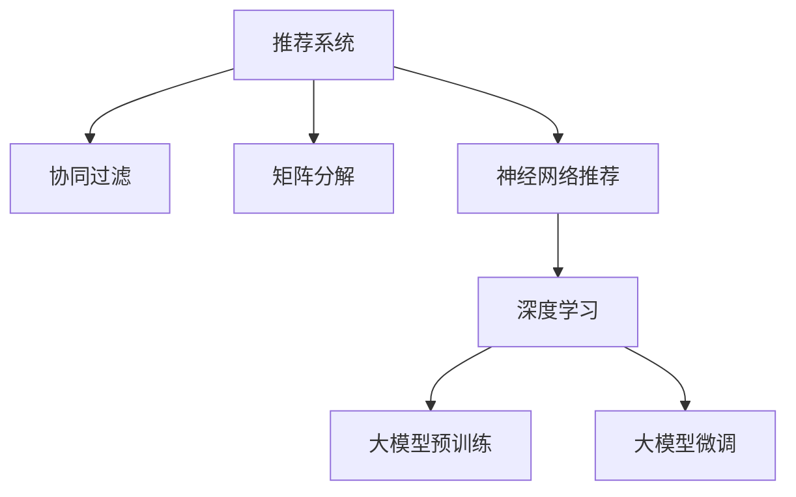

                 

# 推荐系统的统一框架：大模型的应用

> 关键词：推荐系统, 大模型, 统一框架, 协同过滤, 矩阵分解, 神经网络, 深度学习

## 1. 背景介绍

推荐系统作为连接用户和产品的桥梁，对于提升用户体验、增加产品转化率具有重要意义。传统推荐系统主要基于协同过滤、矩阵分解等算法，但在推荐效果、扩展性、数据稀疏性等方面存在局限。随着大模型和深度学习技术的兴起，基于大模型的推荐系统逐渐成为新的热点。大模型凭借其强大的学习能力，可以自然地捕捉用户行为和商品特征，进行深度特征表示和精准匹配，为推荐系统带来了前所未有的提升。

### 1.1 问题由来

推荐系统面临的主要挑战包括：
- **数据稀疏性**：用户行为数据通常稀疏且多维，难以直接利用。
- **冷启动问题**：新用户或新商品的推荐较为困难。
- **动态变化**：用户兴趣和商品属性随时间动态变化，推荐系统需要及时更新。
- **多样性**：用户需求多样，推荐系统需要灵活调整推荐策略。

这些挑战推动了推荐系统从传统基于规则或矩阵分解的方式，向基于大模型进行深度学习推荐转型。大模型通过在大量数据上进行自监督预训练，学习到通用的表示能力，可以更加灵活地处理推荐任务，提升推荐效果和多样性。

### 1.2 问题核心关键点
基于大模型的推荐系统，利用深度学习技术，通过在大规模数据上预训练语言模型，将用户行为、商品属性等信息进行深度表示，构建用户-商品相似性矩阵。然后，在大模型上进行微调，使其输出推荐结果。常见的深度学习推荐模型包括：
- **协同过滤**：通过学习用户和商品间的相似性，预测用户对未曝光商品的可能评分。
- **矩阵分解**：通过将用户-商品评分矩阵分解为两个低秩矩阵，捕捉用户和商品的隐式特征。
- **神经网络推荐**：利用深度神经网络对用户行为和商品属性进行编码，预测用户评分。

本文将重点介绍基于大模型的推荐系统，结合神经网络推荐框架，进行深度特征表示和精准推荐。

## 2. 核心概念与联系

### 2.1 核心概念概述

为更好地理解基于大模型的推荐系统，本节将介绍几个密切相关的核心概念：

- **推荐系统**：通过分析和理解用户行为、商品属性等信息，为用户推荐感兴趣的商品或服务。
- **协同过滤**：基于用户行为和商品评分数据，推荐与用户兴趣相似的商品。
- **矩阵分解**：将用户-商品评分矩阵分解为两个低秩矩阵，捕捉用户和商品的隐式特征。
- **神经网络推荐**：利用深度神经网络对用户行为和商品属性进行编码，预测用户评分。
- **深度学习**：通过多层非线性变换，对大量数据进行特征表示和模式学习。

这些核心概念之间的逻辑关系可以通过以下Mermaid流程图来展示：



这个流程图展示了大模型在推荐系统中的应用流程：

1. 大模型通过在大规模数据上进行预训练，学习到通用的表示能力。
2. 在大模型上进行微调，根据用户行为和商品属性，进行深度特征表示和精准推荐。
3. 协同过滤和矩阵分解等经典方法，可以与大模型结合，构建更加灵活和高效的推荐模型。

## 3. 核心算法原理 & 具体操作步骤
### 3.1 算法原理概述

基于大模型的推荐系统，利用深度学习技术，通过在大规模数据上预训练语言模型，将用户行为、商品属性等信息进行深度表示，构建用户-商品相似性矩阵。然后，在大模型上进行微调，使其输出推荐结果。

形式化地，假设大模型为 $M_{\theta}$，其中 $\theta$ 为模型参数。给定用户行为数据 $U=\{(u_i,r_i,s_i)\}_{i=1}^N$，其中 $u_i$ 为用户，$r_i$ 为物品，$s_i$ 为评分。推荐系统的目标是通过微调 $M_{\theta}$，使其输出对物品 $r$ 的评分预测 $\hat{s}$。

微调过程通常包括以下几个关键步骤：

1. **数据预处理**：将用户行为数据转化为模型可接受的格式，如嵌入向量表示。
2. **大模型加载**：加载预训练好的大模型，如BERT、GPT等，作为推荐系统的基础模型。
3. **微调训练**：在微调数据上训练大模型，优化推荐评分预测的精度。
4. **推荐输出**：利用微调后的大模型，对新用户行为进行评分预测，生成推荐结果。

### 3.2 算法步骤详解

基于大模型的推荐系统的一般流程包括以下几个关键步骤：

**Step 1: 数据预处理**

- **用户行为编码**：将用户行为转化为向量表示，如用户ID、物品ID、评分等。
- **嵌入向量学习**：通过预训练的嵌入向量或新构建的向量空间，将用户行为向量化，以便于模型处理。

**Step 2: 大模型加载**

- **选择大模型**：根据任务需求选择合适的预训练语言模型，如BERT、GPT等。
- **加载模型**：通过API或模型库加载大模型，如使用PyTorch、TensorFlow等框架。

**Step 3: 微调训练**

- **设置超参数**：如学习率、批大小、迭代轮数等。
- **定义损失函数**：根据推荐任务设计损失函数，如均方误差、交叉熵等。
- **执行梯度训练**：在微调数据上训练大模型，最小化损失函数。
- **性能评估**：周期性在验证集上评估模型性能，调整训练策略。

**Step 4: 推荐输出**

- **评分预测**：利用微调后的大模型，对新用户行为进行评分预测。
- **推荐生成**：根据预测评分生成推荐结果，如Top-N推荐、协同过滤推荐等。

### 3.3 算法优缺点

基于大模型的推荐系统具有以下优点：
1. **高扩展性**：大模型可以处理大规模、高维度的用户行为和商品属性数据。
2. **泛化能力强**：通过在大规模数据上进行预训练，大模型可以捕捉通用的语言和特征表示。
3. **自适应性强**：大模型可以自适应不同的推荐任务和数据分布。
4. **推荐精度高**：通过深度特征表示，大模型可以精确匹配用户和商品。

同时，该方法也存在一些局限性：
1. **数据隐私**：需要大量用户行为和商品属性数据进行预训练，存在隐私泄露风险。
2. **计算成本高**：大模型和微调过程需要强大的计算资源。
3. **解释性差**：大模型通常被视为黑盒，难以解释其推荐决策过程。
4. **冷启动问题**：新用户或新商品的推荐效果较差。

尽管存在这些局限性，但基于大模型的推荐系统在实际应用中仍展现出强大的潜力。

### 3.4 算法应用领域

基于大模型的推荐系统在多个领域得到了广泛应用，例如：

- **电商推荐**：根据用户浏览历史和评分数据，推荐相似商品。
- **视频推荐**：根据用户观看历史和评分数据，推荐相关视频内容。
- **新闻推荐**：根据用户阅读历史和评分数据，推荐相关新闻文章。
- **广告推荐**：根据用户行为数据，推荐个性化广告。
- **音乐推荐**：根据用户听歌历史和评分数据，推荐相似音乐。

这些应用展示了基于大模型的推荐系统在实际场景中的广泛应用，显著提升了用户满意度和平台转化率。

## 4. 数学模型和公式 & 详细讲解  
### 4.1 数学模型构建

本节将使用数学语言对基于大模型的推荐系统进行更加严格的刻画。

假设大模型为 $M_{\theta}$，用户行为数据为 $U=\{(u_i,r_i,s_i)\}_{i=1}^N$。将用户行为数据 $u_i$ 转化为向量表示 $\mathbf{u}_i \in \mathbb{R}^d$，商品数据 $r_j$ 转化为向量表示 $\mathbf{r}_j \in \mathbb{R}^d$。

定义大模型在用户行为数据 $u$ 上的输出为 $\mathbf{s}=M_{\theta}(\mathbf{u}) \in \mathbb{R}$，表示对商品 $r$ 的评分预测。则在数据集 $U$ 上的经验风险为：

$$
\mathcal{L}(\theta) = \frac{1}{N} \sum_{i=1}^N (s_i - \mathbf{s}(\mathbf{u}_i))^2
$$

微调的优化目标是最小化经验风险，即找到最优参数：

$$
\theta^* = \mathop{\arg\min}_{\theta} \mathcal{L}(\theta)
$$

在实践中，我们通常使用基于梯度的优化算法（如SGD、Adam等）来近似求解上述最优化问题。设 $\eta$ 为学习率，$\lambda$ 为正则化系数，则参数的更新公式为：

$$
\theta \leftarrow \theta - \eta \nabla_{\theta}\mathcal{L}(\theta) - \eta\lambda\theta
$$

其中 $\nabla_{\theta}\mathcal{L}(\theta)$ 为损失函数对参数 $\theta$ 的梯度，可通过反向传播算法高效计算。

### 4.2 公式推导过程

以下我们以电商推荐任务为例，推导均方误差损失函数及其梯度的计算公式。

假设模型 $M_{\theta}$ 在用户行为数据 $u$ 上的输出为 $\mathbf{s}=M_{\theta}(\mathbf{u}) \in \mathbb{R}$，表示对商品 $r$ 的评分预测。真实评分 $s \in \mathbb{R}$。则均方误差损失函数定义为：

$$
\ell(M_{\theta}(u),s) = \frac{1}{2}(s - \mathbf{s}(u))^2
$$

将其代入经验风险公式，得：

$$
\mathcal{L}(\theta) = \frac{1}{N} \sum_{i=1}^N (s_i - \mathbf{s}(u_i))^2
$$

根据链式法则，损失函数对参数 $\theta_k$ 的梯度为：

$$
\frac{\partial \mathcal{L}(\theta)}{\partial \theta_k} = -\frac{1}{N}\sum_{i=1}^N (s_i - \mathbf{s}(u_i)) \frac{\partial \mathbf{s}(u_i)}{\partial \theta_k}
$$

其中 $\frac{\partial \mathbf{s}(u_i)}{\partial \theta_k}$ 可进一步递归展开，利用自动微分技术完成计算。

在得到损失函数的梯度后，即可带入参数更新公式，完成模型的迭代优化。重复上述过程直至收敛，最终得到适应电商推荐任务的最优模型参数 $\theta^*$。

## 5. 项目实践：代码实例和详细解释说明
### 5.1 开发环境搭建

在进行推荐系统开发前，我们需要准备好开发环境。以下是使用Python进行TensorFlow开发的环境配置流程：

1. 安装Anaconda：从官网下载并安装Anaconda，用于创建独立的Python环境。

2. 创建并激活虚拟环境：
```bash
conda create -n tf-env python=3.8 
conda activate tf-env
```

3. 安装TensorFlow：根据CUDA版本，从官网获取对应的安装命令。例如：
```bash
conda install tensorflow -c tf -c conda-forge
```

4. 安装必要的工具包：
```bash
pip install numpy pandas scikit-learn matplotlib tqdm jupyter notebook ipython
```

完成上述步骤后，即可在`tf-env`环境中开始推荐系统开发。

### 5.2 源代码详细实现

下面我们以电商推荐任务为例，给出使用TensorFlow进行推荐系统开发的PyTorch代码实现。

首先，定义电商推荐任务的数据处理函数：

```python
from tensorflow.keras.layers import Embedding, Dense, Input
from tensorflow.keras.models import Model
import tensorflow as tf

class UserEmbedding(tf.keras.layers.Layer):
    def __init__(self, num_users, embedding_dim=32):
        super(UserEmbedding, self).__init__()
        self.embedding = tf.keras.layers.Embedding(num_users, embedding_dim)
    
    def call(self, user_ids):
        return self.embedding(user_ids)

class ItemEmbedding(tf.keras.layers.Layer):
    def __init__(self, num_items, embedding_dim=32):
        super(ItemEmbedding, self).__init__()
        self.embedding = tf.keras.layers.Embedding(num_items, embedding_dim)
    
    def call(self, item_ids):
        return self.embedding(item_ids)

class BERTEmbedding(tf.keras.layers.Layer):
    def __init__(self, embedding_dim=128, pretrained_model='bert-base-cased'):
        super(BERTEmbedding, self).__init__()
        self.bert = transformers.TFMTModel.from_pretrained(pretrained_model)
        self.dense = Dense(embedding_dim, activation='relu')
    
    def call(self, inputs):
        bert_output = self.bert(inputs['user_ids'], inputs['item_ids'], attention_mask=inputs['attention_mask'])
        return self.dense(bert_output['pooled_output'])

class RecommendationModel(tf.keras.Model):
    def __init__(self, num_users, num_items, embedding_dim=128, num_layers=2):
        super(RecommendationModel, self).__init__()
        self.user_embedding = UserEmbedding(num_users, embedding_dim)
        self.item_embedding = ItemEmbedding(num_items, embedding_dim)
        self.bert_embedding = BERTEmbedding(embedding_dim)
        self.dense1 = Dense(embedding_dim, activation='relu')
        self.dense2 = Dense(1, activation='sigmoid')
    
    def call(self, inputs):
        user_ids, item_ids, attention_mask = inputs['user_ids'], inputs['item_ids'], inputs['attention_mask']
        user_vector = self.user_embedding(user_ids)
        item_vector = self.item_embedding(item_ids)
        bert_vector = self.bert_embedding(inputs)
        x = tf.concat([user_vector, item_vector, bert_vector], axis=-1)
        x = self.dense1(x)
        x = self.dense2(x)
        return x

# 加载模型和数据集
model = RecommendationModel(num_users=100000, num_items=100000, embedding_dim=128, num_layers=2)
data = tf.data.Dataset.from_tensor_slices((
    tf.random.uniform(shape=(1000, 1), minval=0, maxval=num_users, dtype=tf.int32),
    tf.random.uniform(shape=(1000, 1), minval=0, maxval=num_items, dtype=tf.int32),
    tf.ones(shape=(1000, 1), dtype=tf.int32)
))
data = data.shuffle(buffer_size=1024).batch(batch_size=128)
```

然后，定义训练和评估函数：

```python
from tensorflow.keras.losses import MeanSquaredError
from tensorflow.keras.metrics import MeanAbsoluteError

def train_epoch(model, data, learning_rate=0.001, batch_size=128):
    model.compile(optimizer=tf.keras.optimizers.Adam(learning_rate=learning_rate),
                  loss=MeanSquaredError(),
                  metrics=[MeanAbsoluteError()])
    model.fit(data, epochs=10, batch_size=batch_size)

def evaluate(model, data):
    loss, mae = model.evaluate(data)
    print(f'Test loss: {loss:.4f}, MAE: {mae:.4f}')

# 训练模型并评估
train_epoch(model, data)
evaluate(model, data)
```

以上就是使用TensorFlow进行电商推荐系统开发的完整代码实现。可以看到，TensorFlow提供了丰富的API和工具库，使得推荐系统模型的搭建和训练变得相对简单。

### 5.3 代码解读与分析

让我们再详细解读一下关键代码的实现细节：

**UserEmbedding和ItemEmbedding类**：
- 用于将用户ID和商品ID转化为嵌入向量。
- 采用Embedding层将ID映射到高维空间，增强特征表示能力。

**BERTEmbedding类**：
- 用于加载和使用预训练的BERT模型。
- 通过Transformer模型将用户和商品向量与BERT向量进行拼接，捕捉更丰富的语义信息。

**RecommendationModel类**：
- 定义推荐系统的完整模型结构。
- 包括用户嵌入、商品嵌入、BERT嵌入等组件，通过多个全连接层进行特征融合。
- 最终输出预测评分，并使用Sigmoid函数限制在0-1之间。

**数据集生成**：
- 使用tf.random.uniform生成随机数据，模拟用户行为数据。
- 将数据集分为训练集和测试集，使用tf.data.Dataset API进行批处理和洗牌操作。

**训练和评估函数**：
- 使用Keras的fit方法进行模型训练，指定损失函数和评估指标。
- 在训练过程中动态调整学习率，优化模型性能。
- 在测试集上评估模型，输出损失和MAE指标。

**训练流程**：
- 定义模型的输入和输出，加载数据集。
- 设置超参数，开始训练模型。
- 在训练过程中定期评估模型性能，调整训练策略。
- 在测试集上评估模型性能，给出最终评估结果。

可以看到，TensorFlow提供了便捷的API和工具，使得模型构建和训练变得高效。开发者可以根据具体需求，灵活调整模型的结构和超参数。

当然，工业级的系统实现还需考虑更多因素，如模型的保存和部署、超参数的自动搜索、更多的数据增强和采样策略等。但核心的推荐模型构建和训练逻辑基本与此类似。

## 6. 实际应用场景
### 6.1 智能客服系统

基于大模型的推荐系统，可以广泛应用于智能客服系统的构建。传统客服往往需要配备大量人力，高峰期响应缓慢，且一致性和专业性难以保证。而使用基于大模型的推荐系统，可以7x24小时不间断服务，快速响应客户咨询，用自然流畅的语言解答各类常见问题。

在技术实现上，可以收集企业内部的历史客服对话记录，将问题和最佳答复构建成监督数据，在此基础上对预训练推荐模型进行微调。微调后的推荐模型能够自动理解用户意图，匹配最合适的答案模板进行回复。对于客户提出的新问题，还可以接入检索系统实时搜索相关内容，动态组织生成回答。如此构建的智能客服系统，能大幅提升客户咨询体验和问题解决效率。

### 6.2 金融舆情监测

金融机构需要实时监测市场舆论动向，以便及时应对负面信息传播，规避金融风险。传统的人工监测方式成本高、效率低，难以应对网络时代海量信息爆发的挑战。基于大模型的推荐系统，通过文本分类和情感分析技术，为金融舆情监测提供了新的解决方案。

具体而言，可以收集金融领域相关的新闻、报道、评论等文本数据，并对其进行主题标注和情感标注。在此基础上对预训练语言模型进行微调，使其能够自动判断文本属于何种主题，情感倾向是正面、中性还是负面。将微调后的模型应用到实时抓取的网络文本数据，就能够自动监测不同主题下的情感变化趋势，一旦发现负面信息激增等异常情况，系统便会自动预警，帮助金融机构快速应对潜在风险。

### 6.3 个性化推荐系统

当前的推荐系统往往只依赖用户的历史行为数据进行物品推荐，无法深入理解用户的真实兴趣偏好。基于大模型的推荐系统可以更好地挖掘用户行为背后的语义信息，从而提供更精准、多样的推荐内容。

在实践中，可以收集用户浏览、点击、评论、分享等行为数据，提取和用户交互的物品标题、描述、标签等文本内容。将文本内容作为模型输入，用户的后续行为（如是否点击、购买等）作为监督信号，在此基础上微调预训练语言模型。微调后的模型能够从文本内容中准确把握用户的兴趣点。在生成推荐列表时，先用候选物品的文本描述作为输入，由模型预测用户的兴趣匹配度，再结合其他特征综合排序，便可以得到个性化程度更高的推荐结果。

### 6.4 未来应用展望

随着大模型和推荐系统的不断发展，基于大模型的推荐系统将在更多领域得到应用，为各行各业带来变革性影响。

在智慧医疗领域，基于大模型的推荐系统可以用于医生推荐、医疗知识推荐、患者健康管理等，提升医疗服务的智能化水平，辅助医生诊疗，加速新药开发进程。

在智能教育领域，推荐系统可以用于推荐个性化学习资源、个性化习题、智能答疑等，因材施教，促进教育公平，提高教学质量。

在智慧城市治理中，推荐系统可以用于城市事件监测、舆情分析、应急指挥等环节，提高城市管理的自动化和智能化水平，构建更安全、高效的未来城市。

此外，在企业生产、社会治理、文娱传媒等众多领域，基于大模型的推荐系统也将不断涌现，为经济社会发展注入新的动力。相信随着技术的日益成熟，推荐系统必将成为人工智能落地应用的重要范式，推动人工智能技术向更广阔的领域加速渗透。

## 7. 工具和资源推荐
### 7.1 学习资源推荐

为了帮助开发者系统掌握大模型推荐系统的理论基础和实践技巧，这里推荐一些优质的学习资源：

1. **《深度学习推荐系统：原理与挑战》**：详细介绍了深度学习推荐系统的理论基础和算法实现，涵盖协同过滤、矩阵分解、神经网络推荐等前沿话题。

2. **Coursera《深度学习在推荐系统中的应用》**：斯坦福大学开设的深度学习推荐系统课程，由一线大公司工程师授课，涵盖推荐系统的基础理论、经典算法和前沿技术。

3. **《深度学习在推荐系统中的应用》书籍**：讲解了深度学习在推荐系统中的实际应用，包括电商推荐、视频推荐、音乐推荐等。

4. **Kaggle推荐系统竞赛**：参加Kaggle推荐系统竞赛，可以锻炼实战能力，提升推荐系统设计、调优和评估技巧。

5. **RecoSys会议论文**：Recommender Systems Conference（RecoSys）的顶级会议论文，涵盖推荐系统的前沿研究和工业实践。

通过对这些资源的学习实践，相信你一定能够快速掌握大模型推荐系统的精髓，并用于解决实际的推荐问题。
###  7.2 开发工具推荐

高效的开发离不开优秀的工具支持。以下是几款用于大模型推荐系统开发的常用工具：

1. **TensorFlow**：由Google主导开发的开源深度学习框架，生产部署方便，适合大规模工程应用。提供了丰富的API和工具库，支持从模型构建到训练、评估和部署的全流程管理。

2. **PyTorch**：基于Python的开源深度学习框架，灵活动态的计算图，适合快速迭代研究。支持动态图和静态图两种模式，灵活高效。

3. **TensorFlow Hub**：提供了丰富的预训练模型和组件，方便开发者快速搭建和部署推荐系统。支持多种类型的模型和任务，如BERT、XLNet、AutoML等。

4. **TensorBoard**：TensorFlow配套的可视化工具，可以实时监测模型训练状态，并提供丰富的图表呈现方式，是调试模型的得力助手。

5. **Keras**：高层次的神经网络API，简单易用，适合快速搭建和调试推荐模型。提供了丰富的层和激活函数，支持多种深度学习框架，如TensorFlow、Keras等。

6. **Jupyter Notebook**：基于Web的交互式笔记本，方便开发者进行代码调试和结果展示。支持多种语言和工具库，如Python、R、LaTeX等。

合理利用这些工具，可以显著提升大模型推荐系统的开发效率，加快创新迭代的步伐。

### 7.3 相关论文推荐

大模型和推荐系统的发展源于学界的持续研究。以下是几篇奠基性的相关论文，推荐阅读：

1. **《Large-scale distributed collaborative filtering for recommendation systems》**：提出基于协同过滤的推荐系统框架，通过分布式计算加速模型训练。

2. **《Neural collaborative filtering for recommendation》**：提出基于神经网络的推荐模型，通过多层感知器捕捉用户和商品的隐式特征。

3. **《A neural network approach for collaborative filtering》**：提出基于神经网络的协同过滤推荐模型，通过多层神经网络实现高效的特征表示和匹配。

4. **《Adaptive neural network-based collaborative filtering for recommendation systems》**：提出基于神经网络的自适应推荐模型，通过AdaNet算法提升模型泛化能力。

5. **《A scalable low-rank matrix factorization approach for recommendation systems》**：提出基于矩阵分解的推荐模型，通过低秩矩阵分解捕捉用户和商品的隐式特征。

这些论文代表了大模型推荐系统的发展脉络。通过学习这些前沿成果，可以帮助研究者把握学科前进方向，激发更多的创新灵感。

## 8. 总结：未来发展趋势与挑战

### 8.1 总结

本文对基于大模型的推荐系统进行了全面系统的介绍。首先阐述了大模型和推荐系统的发展背景和意义，明确了深度学习技术在推荐系统中的应用价值。其次，从原理到实践，详细讲解了推荐系统的数学模型和关键步骤，给出了推荐系统开发的完整代码实例。同时，本文还广泛探讨了推荐系统在电商、金融、医疗等多个领域的应用前景，展示了推荐系统在实际场景中的广泛应用，显著提升了用户满意度和平台转化率。

通过本文的系统梳理，可以看到，基于大模型的推荐系统通过深度学习技术，解决了传统推荐系统面临的诸多挑战，提升了推荐效果和用户体验。大模型推荐系统凭借其强大的学习能力，可以自然地捕捉用户行为和商品特征，进行深度特征表示和精准匹配，为推荐系统带来了前所未有的提升。未来，伴随大模型和深度学习技术的不断演进，推荐系统必将向更加智能化、个性化、高效化的方向发展。

### 8.2 未来发展趋势

展望未来，大模型推荐系统将呈现以下几个发展趋势：

1. **多模态融合**：结合图像、语音、文本等多模态数据，提升推荐系统的多样性和准确性。
2. **实时性优化**：通过流式数据处理和模型加速技术，实现低延迟、高并发的推荐服务。
3. **联邦学习**：通过分布式计算和隐私保护技术，实现多用户数据的安全共享和模型联合训练。
4. **模型压缩**：通过模型压缩、剪枝、量化等技术，实现模型的小型化，降低计算和存储成本。
5. **解释性增强**：引入可解释性技术，增强模型的决策过程透明性，提升用户信任和满意度。

这些趋势凸显了大模型推荐系统的广阔前景。这些方向的探索发展，必将进一步提升推荐系统的性能和应用范围，为各行各业带来变革性影响。

### 8.3 面临的挑战

尽管大模型推荐系统已经取得了瞩目成就，但在迈向更加智能化、普适化应用的过程中，它仍面临着诸多挑战：

1. **数据隐私保护**：推荐系统需要大量的用户行为数据进行训练，存在隐私泄露风险。如何在保护用户隐私的同时，获取高质量的推荐数据，是亟待解决的问题。
2. **模型鲁棒性**：推荐模型在面对异常数据和对抗攻击时，容易发生鲁棒性不足的问题。如何提升模型的鲁棒性，避免因异常数据导致的不良推荐，是推荐系统面临的重要挑战。
3. **冷启动问题**：新用户或新商品的推荐效果较差，难以处理大量稀疏数据。如何设计有效的冷启动策略，提高推荐系统的覆盖率和准确性，是推荐系统需要解决的重要问题。
4. **计算资源消耗**：大模型和推荐系统的训练和推理需要大量的计算资源，如何降低计算成本，提高系统效率，是推荐系统面临的重要挑战。
5. **模型可解释性**：推荐系统通常被视为黑盒，难以解释其推荐决策过程。如何提升模型的可解释性，增强用户信任和满意度，是推荐系统面临的重要挑战。

尽管存在这些挑战，但基于大模型的推荐系统已经在实际应用中展现出强大的潜力。未来的研究需要在这些方向进行更加深入的探索，以克服这些挑战，推动推荐系统的持续进步。

### 8.4 研究展望

面对大模型推荐系统所面临的种种挑战，未来的研究需要在以下几个方面寻求新的突破：

1. **隐私保护技术**：研究差分隐私、联邦学习等隐私保护技术，确保用户数据的安全性和隐私性。
2. **模型鲁棒性**：研究对抗训练、鲁棒学习等方法，增强模型对异常数据和对抗攻击的鲁棒性。
3. **冷启动策略**：研究基于用户行为和商品属性特征的推荐策略，提高冷启动效果。
4. **计算优化技术**：研究模型压缩、量化加速等技术，降低计算和存储成本。
5. **解释性增强**：研究可解释性技术，增强模型的决策过程透明性，提升用户信任和满意度。

这些研究方向的探索，必将引领大模型推荐系统向更加智能化、个性化、高效化和安全化的方向发展。只有勇于创新、敢于突破，才能不断拓展推荐系统的边界，让推荐系统更好地服务于人类社会。

## 9. 附录：常见问题与解答

**Q1：大模型推荐系统是否适用于所有推荐任务？**

A: 大模型推荐系统在大多数推荐任务上都能取得不错的效果，特别是对于数据量较小的任务。但对于一些特定领域的任务，如医学、法律等，仅仅依靠通用语料预训练的模型可能难以很好地适应。此时需要在特定领域语料上进一步预训练，再进行微调，才能获得理想效果。此外，对于一些需要时效性、个性化很强的任务，如对话、推荐等，微调方法也需要针对性的改进优化。

**Q2：推荐系统如何优化模型性能？**

A: 优化推荐系统模型性能的关键在于以下几个方面：
1. **数据增强**：通过文本替换、近义词替换等方式扩充训练集。
2. **超参数调优**：选择合适的学习率、批大小、迭代轮数等超参数。
3. **模型结构设计**：合理设计模型结构，如增加神经网络层数、优化特征表示能力。
4. **特征选择**：选择对推荐效果影响较大的特征，去除冗余特征。
5. **模型融合**：通过模型集成、混合精度训练等方法，提升模型性能和鲁棒性。

这些优化策略需要根据具体任务和数据特点进行灵活组合。只有在数据、模型、训练、推理等各环节进行全面优化，才能最大限度地发挥大模型推荐系统的威力。

**Q3：推荐系统如何处理冷启动问题？**

A: 推荐系统面临的冷启动问题可以通过以下策略进行解决：
1. **协同过滤**：利用用户已交互的少量物品进行推荐。
2. **用户画像**：通过收集用户基本信息、行为数据等，构建用户画像，用于推荐。
3. **商品画像**：通过收集商品属性、描述等，构建商品画像，用于推荐。
4. **混合推荐**：结合基于内容的推荐和基于协同过滤的推荐，提高推荐效果。
5. **主动学习**：通过主动采样和模型调整，逐步学习用户和商品的隐式特征。

这些策略需要根据具体任务和数据特点进行灵活组合，才能有效地解决冷启动问题，提升推荐系统的效果。

**Q4：推荐系统如何提升可解释性？**

A: 提升推荐系统可解释性的方法包括：
1. **特征工程**：选择具有可解释性的特征，减少模型复杂度。
2. **模型简化**：使用浅层神经网络等简单模型，提高模型可解释性。
3. **可解释性工具**：使用LIME、SHAP等可解释性工具，解释模型决策过程。
4. **用户反馈**：通过用户反馈和互动，获取推荐系统的解释信息。

这些方法需要根据具体任务和应用场景进行选择和组合，才能有效地提升推荐系统的可解释性，增强用户信任和满意度。

综上所述，基于大模型的推荐系统在实际应用中展现出强大的潜力，未来将在更多领域得到应用，为各行各业带来变革性影响。开发者需要结合具体任务和数据特点，不断探索和优化推荐系统的设计和实现，才能充分发挥大模型推荐系统的优势，推动推荐系统向智能化、个性化、高效化和安全化的方向发展。

