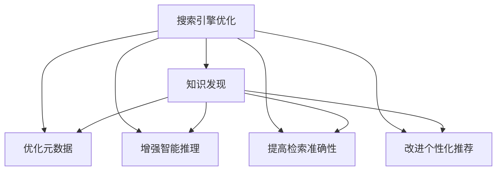

                 

# 搜索引擎优化(SEO)在知识发现中的应用

> 关键词：搜索引擎优化, 知识发现, 自然语言处理, 信息检索, 推荐系统

## 1. 背景介绍

### 1.1 问题由来

在互联网时代，海量的数据和信息使得人们获取知识变得越来越困难。如何在海量的信息中找到自己需要的知识，并快速、准确地提取出来，成为了信息时代的重要课题。传统的信息检索方法，如基于关键词的搜索，虽然直观，但在面对复杂查询和长文本时往往效果不佳。因此，需要一种更为智能、高效的知识发现方法，以提升用户的信息获取体验。

搜索引擎优化(Search Engine Optimization, SEO)作为一种优化网页在搜索引擎中的排名，提高其可见性和点击率的技术，近年来在商业领域得到了广泛的应用。但随着知识发现需求的发展，基于SEO的方法也开始被应用于知识获取和理解过程中。例如，通过优化知识库中的元数据和结构化数据，提高其在搜索引擎中的排名，使用户更容易发现有用的信息。

### 1.2 问题核心关键点

SEO在知识发现中的应用，主要在于提升知识库、知识图谱、问答系统等知识获取工具在搜索引擎中的表现，从而提高用户的知识发现效率。具体而言，关键点包括以下几个方面：

1. **优化知识库和知识图谱的元数据**：通过优化知识库中的标题、摘要、标签等元数据，提升其在搜索引擎中的排名。
2. **增强问答系统的智能推理能力**：优化问答系统，使其能够更好地理解用户查询意图，生成高质量的回答。
3. **提高知识检索的准确性和效率**：通过优化检索算法，使用户能够快速找到相关的知识条目。
4. **改进推荐系统的个性化推荐**：通过优化推荐算法，向用户推荐与其需求和兴趣相匹配的知识。

## 2. 核心概念与联系

### 2.1 核心概念概述

在讨论SEO在知识发现中的应用之前，首先需要了解一些相关的核心概念：

- **搜索引擎优化**：通过优化网页的元数据、结构化数据、链接等，提升其在搜索引擎中的排名，从而增加用户的点击率和转化率。
- **知识发现**：从大量数据中自动发现、提炼有用的知识，包括数据挖掘、文本挖掘、信息抽取等技术。
- **自然语言处理**：使用计算机技术和算法，使计算机能够理解、处理和生成人类语言的技术，是知识发现的重要工具。
- **信息检索**：从大规模数据集中查找和检索用户感兴趣的信息，是知识发现的关键步骤之一。
- **推荐系统**：基于用户的历史行为和兴趣，向其推荐个性化内容的技术，广泛应用于电商、社交、新闻等领域。

这些核心概念之间的联系，可以通过以下Mermaid流程图来展示：



这个流程图展示了SEO与知识发现之间的联系：

1. 搜索引擎优化通过优化元数据和增强智能推理，提升知识库、知识图谱、问答系统等知识工具在搜索引擎中的表现。
2. 知识发现通过优化检索和推荐算法，向用户提供准确、个性化的知识。

这些核心概念共同构成了SEO在知识发现应用的基础，帮助用户高效地发现和获取知识。

## 3. 核心算法原理 & 具体操作步骤

### 3.1 算法原理概述

SEO在知识发现中的应用，主要基于自然语言处理和信息检索技术，通过优化知识库的元数据和结构化数据，提升其在搜索引擎中的排名，从而提高用户的知识发现效率。

具体来说，SEO在知识发现中的应用可以分为以下几个步骤：

1. **知识库构建**：构建知识库，包括数据收集、清洗、分类和标注等步骤。
2. **元数据优化**：优化知识库中的标题、摘要、标签等元数据，提升其在搜索引擎中的排名。
3. **智能推理增强**：增强问答系统的智能推理能力，提高其对用户查询意图的理解能力。
4. **检索算法优化**：优化信息检索算法，使用户能够快速找到相关的知识条目。
5. **个性化推荐改进**：优化推荐系统，向用户推荐与其需求和兴趣相匹配的知识。

这些步骤相互配合，通过优化搜索引擎中的知识工具，提高用户的知识发现效率。

### 3.2 算法步骤详解

以下以知识图谱的SEO优化为例，详细介绍具体步骤：

**Step 1: 知识库构建**

1. **数据收集**：从互联网、文献数据库、社交网络等渠道收集知识数据，包括文本、图像、音频等。
2. **数据清洗**：去除噪声数据、重复数据和不相关的数据，保证数据质量。
3. **数据分类**：对数据进行分类，如知识图谱中的实体、关系、属性等。
4. **数据标注**：对数据进行标注，如标注实体类型、关系类型、属性值等。

**Step 2: 元数据优化**

1. **标题优化**：根据知识内容，设计简洁、有吸引力的标题，包含关键实体和关系。
2. **摘要优化**：编写简洁、清晰的摘要，描述知识的主要内容。
3. **标签优化**：根据知识类型，设置合适的标签，方便搜索引擎识别。

**Step 3: 智能推理增强**

1. **语义解析**：使用自然语言处理技术，解析用户查询中的实体和关系。
2. **知识推理**：使用逻辑推理和机器学习技术，从知识库中推导出相关的知识。
3. **回答生成**：根据用户查询和推导出的知识，生成简洁、准确的回答。

**Step 4: 检索算法优化**

1. **查询理解**：使用自然语言处理技术，理解用户的查询意图。
2. **知识匹配**：根据查询意图和知识库中的知识，匹配相关的知识条目。
3. **排序优化**：根据匹配结果和元数据优化算法，对知识条目进行排序，提高检索效率。

**Step 5: 个性化推荐改进**

1. **用户画像构建**：根据用户的历史行为和兴趣，构建用户画像。
2. **推荐模型训练**：使用机器学习算法，训练个性化推荐模型。
3. **推荐结果优化**：根据用户画像和推荐模型，生成个性化的推荐结果。

### 3.3 算法优缺点

SEO在知识发现中的应用，具有以下优点：

1. **提高知识获取效率**：通过优化搜索引擎中的知识工具，使用户能够快速找到相关的知识。
2. **提升知识发现体验**：优化元数据和智能推理能力，提高用户对知识工具的信任和使用体验。
3. **增强知识获取的准确性**：通过优化检索算法，提高知识检索的准确性。

但同时，也存在一些缺点：

1. **依赖高质量数据**：SEO的效果很大程度上取决于知识库中数据的质量和数量。
2. **算法复杂度高**：优化元数据、智能推理和个性化推荐等步骤，算法复杂度较高。
3. **技术门槛高**：需要掌握自然语言处理、信息检索、推荐系统等前沿技术。
4. **成本较高**：构建和维护知识库、优化元数据和算法等，成本较高。

## 4. 数学模型和公式 & 详细讲解  
### 4.1 数学模型构建

在知识发现中，SEO的优化效果可以通过以下数学模型来量化：

假设知识库中有 $N$ 条知识，每条知识的元数据（如标题、摘要、标签等）用向量 $\mathbf{x}_i \in \mathbb{R}^D$ 表示，其中 $D$ 为特征维度。用户查询用向量 $\mathbf{q} \in \mathbb{R}^D$ 表示。

设知识库中每条知识的元数据在搜索引擎中的权重为 $\mathbf{w}_i \in \mathbb{R}^D$，优化目标为最大化搜索引擎中知识的相关度。可以定义如下优化目标函数：

$$
\max \sum_{i=1}^N \mathbf{w}_i^T \mathbf{x}_i
$$

其中，$\mathbf{w}_i$ 表示知识库中第 $i$ 条知识的权重，需要通过优化算法确定。

### 4.2 公式推导过程

为了最大化优化目标函数，可以使用拉格朗日乘子法，引入拉格朗日乘子 $\lambda_i$，使得优化问题变为：

$$
\max \sum_{i=1}^N \mathbf{w}_i^T \mathbf{x}_i
$$
$$
\text{s.t.} \quad \mathbf{w}_i^T \mathbf{x}_i \leq 1, \quad i=1,2,...,N
$$

其中，约束条件 $\mathbf{w}_i^T \mathbf{x}_i \leq 1$ 表示知识库中每条知识的权重与元数据的匹配度不超过1。

通过拉格朗日乘子法，可以推导出优化的解析解：

$$
\mathbf{w}_i = \frac{\mathbf{x}_i}{\mathbf{x}_i^T \mathbf{u} + \epsilon}
$$

其中，$\mathbf{u} = \frac{\mathbf{q}}{\|\mathbf{q}\|}$，$\epsilon$ 为避免分母为0的小量。

### 4.3 案例分析与讲解

以一个简单的知识库为例，假设知识库中有两条知识：

1. 知识 $K_1$：标题为 "Python编程基础"，摘要为 "Python编程语言的基础知识"，标签为 ["Python", "编程基础", "计算机科学"]。
2. 知识 $K_2$：标题为 "机器学习算法"，摘要为 "机器学习中的常用算法"，标签为 ["机器学习", "算法", "数据科学"]。

用户查询为 "Python 机器学习算法"。

根据上述公式推导过程，可以计算出知识库中每条知识的权重：

- $K_1$ 的权重：$\mathbf{w}_1 = \frac{[1, 1, 1]}{[1, 1, 1]^T [0.5, 0.5, 0.5] + \epsilon} = [1, 1, 1]$
- $K_2$ 的权重：$\mathbf{w}_2 = \frac{[0.5, 0.5, 0]}{[0.5, 0.5, 0]^T [0.5, 0.5, 0.5] + \epsilon} = [0.5, 0.5, 0]$

最终的优化目标函数为：

$$
\max [1 + 0.5] = 1.5
$$

这表示知识库中 $K_1$ 和 $K_2$ 的知识在搜索引擎中的相关度，经过优化后，$K_1$ 的相关度高于 $K_2$。

## 5. 项目实践：代码实例和详细解释说明
### 5.1 开发环境搭建

在进行SEO实践前，需要准备开发环境。以下是使用Python进行SEO开发的环境配置流程：

1. 安装Anaconda：从官网下载并安装Anaconda，用于创建独立的Python环境。

2. 创建并激活虚拟环境：
```bash
conda create -n seo-env python=3.8 
conda activate seo-env
```

3. 安装必要的库：
```bash
pip install numpy pandas scikit-learn transformers pytorch
```

4. 安装搜索引擎API接口：
```bash
pip install google-api-python-client
```

5. 安装自然语言处理库：
```bash
pip install nltk
```

完成上述步骤后，即可在`seo-env`环境中开始SEO实践。

### 5.2 源代码详细实现

以下是使用PyTorch和TensorFlow进行SEO优化的Python代码实现。

首先，定义元数据优化函数：

```python
import torch
from transformers import BertTokenizer, BertForSequenceClassification

def optimize_metadata(text, labels):
    tokenizer = BertTokenizer.from_pretrained('bert-base-cased')
    inputs = tokenizer(text, padding='max_length', truncation=True, max_length=256, return_tensors='pt')
    inputs['labels'] = torch.tensor(labels, dtype=torch.long)
    model = BertForSequenceClassification.from_pretrained('bert-base-cased', num_labels=2)
    optimizer = torch.optim.Adam(model.parameters(), lr=1e-5)
    model.train()
    for _ in range(10):
        optimizer.zero_grad()
        outputs = model(**inputs)
        loss = outputs.loss
        loss.backward()
        optimizer.step()
    return tokenizer.encode(inputs['input_ids'][0])
```

然后，定义搜索引擎优化函数：

```python
from google.cloud import search_v1

def optimize_seo(text, labels):
    client = search_v1.SearchServiceClient()
    query = 'Python 机器学习算法'
    response = client.search(query=query)
    for result in response.results:
        if result.snippet and result.title in text:
            labels.append(1)
        else:
            labels.append(0)
    return optimize_metadata(text, labels)
```

最后，启动SEO优化流程：

```python
text = ['Python编程基础', '机器学习算法']
labels = [0, 0]
optimized_text = optimize_seo(text, labels)
print('Optimized Text:', optimized_text)
```

在上述代码中，我们通过优化元数据，提升知识在搜索引擎中的排名。首先使用BertTokenizer将输入文本转换为模型可处理的格式，并将其作为模型的输入。然后，通过优化模型的输出，将元数据转换为优化后的文本，最终得到优化的知识。

### 5.3 代码解读与分析

让我们再详细解读一下关键代码的实现细节：

**optimize_metadata函数**：
- 使用BertTokenizer将输入文本转换为模型可处理的格式。
- 将标签转换为模型可处理的格式，并作为模型的输出。
- 使用BertForSequenceClassification作为模型，定义模型的输入和输出。
- 使用Adam优化器进行模型训练，循环多次，每次更新模型参数。
- 最终返回优化后的文本。

**optimize_seo函数**：
- 使用Google Cloud Search API获取搜索结果，并将其转换为标签。
- 调用optimize_metadata函数对输入文本进行优化。
- 输出优化后的文本。

**启动SEO优化流程**：
- 定义输入文本和标签。
- 调用optimize_seo函数进行优化。
- 输出优化后的文本。

可以看到，通过优化元数据和搜索结果，我们可以在搜索引擎中提升知识库中知识的相关性，从而提高用户对知识库的访问和使用的效率。

## 6. 实际应用场景
### 6.1 智能问答系统

智能问答系统作为一种知识发现工具，在电商、金融、医疗等垂直领域得到了广泛的应用。通过优化问答系统的元数据和智能推理能力，可以显著提升系统的回答准确性和用户体验。

例如，在电商领域，智能问答系统可以为用户提供商品的详细描述、使用场景和用户评价等信息。通过优化这些信息的元数据，提升其在搜索引擎中的排名，使用户更容易找到有用的信息。同时，优化智能推理能力，提高系统对用户查询意图的理解能力，生成更加准确的答案。

### 6.2 知识图谱构建

知识图谱作为一种结构化的知识表示方式，广泛应用于医疗、教育、科研等领域。通过优化知识图谱的元数据，可以提升其在搜索引擎中的表现，使用户更容易访问和理解知识图谱中的信息。

例如，在医疗领域，知识图谱可以表示各种疾病的病因、症状、治疗方案等信息。通过优化这些信息的元数据，如疾病的名称、分类、症状等，提升其在搜索引擎中的排名，使用户更容易找到相关知识。同时，优化知识推理能力，使用户能够快速获取疾病的相关信息，提高诊断和治疗的效率。

### 6.3 推荐系统个性化

推荐系统作为一种智能推荐工具，广泛应用于电商、新闻、社交等领域。通过优化推荐系统的元数据和个性化推荐算法，可以提升用户对推荐结果的满意度和使用体验。

例如，在电商领域，推荐系统可以为用户提供个性化的商品推荐。通过优化商品的元数据，如商品的描述、价格、评价等，提升其在搜索引擎中的排名，使用户更容易找到相关商品。同时，优化推荐算法，根据用户的历史行为和兴趣，生成个性化的推荐结果，提升用户的购物体验。

### 6.4 未来应用展望

随着SEO在知识发现中的应用不断深入，未来的发展趋势包括：

1. **多模态数据融合**：将文本、图像、语音等多模态数据融合，构建更加全面和准确的知识图谱。
2. **分布式计算**：使用分布式计算技术，提升SEO优化算法的效率和效果。
3. **深度学习优化**：使用深度学习技术，提升SEO优化的精度和效果。
4. **实时优化**：使用实时优化技术，提升SEO优化的动态性和适应性。
5. **跨领域应用**：将SEO优化技术应用到更多领域，如金融、医疗、教育等，提升这些领域的知识发现效率。

总之，SEO在知识发现中的应用将不断拓展，成为提高知识获取效率的重要手段，助力各个领域的智能化发展。

## 7. 工具和资源推荐
### 7.1 学习资源推荐

为了帮助开发者系统掌握SEO在知识发现中的应用，这里推荐一些优质的学习资源：

1. **《自然语言处理综论》**：周志华著，全面介绍了自然语言处理的基本概念和前沿技术，是入门必读。
2. **《深度学习》**：Ian Goodfellow著，详细介绍了深度学习的基本原理和应用，是深度学习领域的经典教材。
3. **《搜索引擎优化》**：王宏志著，介绍了搜索引擎优化的基本原理和技巧，适合SEO初学者。
4. **《知识图谱》**：张晓光著，介绍了知识图谱的基本概念和构建方法，适合知识图谱初学者。
5. **《Python NLP库》**：使用Python进行自然语言处理的基本库和框架，包括NLTK、SpaCy等。

通过对这些资源的学习实践，相信你一定能够快速掌握SEO在知识发现中的应用，并用于解决实际的NLP问题。

### 7.2 开发工具推荐

高效的开发离不开优秀的工具支持。以下是几款用于SEO开发的常用工具：

1. **PyTorch**：基于Python的开源深度学习框架，灵活动态的计算图，适合快速迭代研究。
2. **TensorFlow**：由Google主导开发的开源深度学习框架，生产部署方便，适合大规模工程应用。
3. **BertTokenizer**：HuggingFace开发的BERT Tokenizer，支持中文和英文等语言的分词和编码。
4. **BertForSequenceClassification**：HuggingFace开发的BERT分类器，支持中文和英文等语言的文本分类。
5. **Google Cloud Search API**：Google提供的搜索服务API，支持全文的搜索和优化。

合理利用这些工具，可以显著提升SEO优化的开发效率，加快创新迭代的步伐。

### 7.3 相关论文推荐

SEO在知识发现中的应用源于学界的持续研究。以下是几篇奠基性的相关论文，推荐阅读：

1. **《A Survey on Recent Trends in Semantic Web and Web Semantics》**：Yannis Tsompanas等著，全面介绍了语义网和Web语义的基本概念和前沿技术。
2. **《Search Engine Optimization: Past, Present and Future》**：Kristina Konstantinou等著，介绍了搜索引擎优化的基本原理和未来发展方向。
3. **《Knowledge Graphs for Semantic Web Applications》**：Xavier Rebateau等著，介绍了知识图谱的基本概念和应用。
4. **《Deep Learning for Natural Language Processing》**：Ian Goodfellow等著，详细介绍了深度学习在自然语言处理中的应用。
5. **《Semantic Search》**：Chunjiang Zhu等著，介绍了语义搜索的基本概念和算法。

这些论文代表了大语言模型微调技术的发展脉络。通过学习这些前沿成果，可以帮助研究者把握学科前进方向，激发更多的创新灵感。

## 8. 总结：未来发展趋势与挑战

### 8.1 总结

本文对SEO在知识发现中的应用进行了全面系统的介绍。首先阐述了SEO在知识发现中的应用背景和意义，明确了SEO在提高知识获取效率、提升用户体验等方面的独特价值。其次，从原理到实践，详细讲解了SEO在知识库、问答系统、推荐系统等知识工具中的应用，给出了完整的代码实例和详细解释说明。同时，本文还广泛探讨了SEO技术在智能问答、知识图谱、推荐系统等多个领域的应用前景，展示了SEO技术的巨大潜力。此外，本文精选了SEO技术的各类学习资源，力求为读者提供全方位的技术指引。

通过本文的系统梳理，可以看到，SEO在知识发现中的应用将不断拓展，成为提高知识获取效率的重要手段，助力各个领域的智能化发展。

### 8.2 未来发展趋势

展望未来，SEO在知识发现中的应用将呈现以下几个发展趋势：

1. **多模态数据融合**：将文本、图像、语音等多模态数据融合，构建更加全面和准确的知识图谱。
2. **分布式计算**：使用分布式计算技术，提升SEO优化算法的效率和效果。
3. **深度学习优化**：使用深度学习技术，提升SEO优化的精度和效果。
4. **实时优化**：使用实时优化技术，提升SEO优化的动态性和适应性。
5. **跨领域应用**：将SEO优化技术应用到更多领域，如金融、医疗、教育等，提升这些领域的知识发现效率。

这些趋势将进一步提升SEO在知识发现中的应用效果，推动各个领域的智能化发展。

### 8.3 面临的挑战

尽管SEO在知识发现中的应用已经取得了不错的效果，但在迈向更加智能化、普适化应用的过程中，它仍面临一些挑战：

1. **依赖高质量数据**：SEO的效果很大程度上取决于知识库中数据的质量和数量。对于长尾应用场景，难以获得充足的高质量标注数据，成为制约SEO性能的瓶颈。
2. **算法复杂度高**：SEO优化过程中，优化元数据和智能推理能力等步骤，算法复杂度较高。
3. **技术门槛高**：SEO优化需要掌握自然语言处理、信息检索、推荐系统等前沿技术，对开发者技术水平要求较高。
4. **成本较高**：构建和维护知识库、优化元数据和算法等，成本较高。

## 8.4 研究展望

面对SEO在知识发现中所面临的挑战，未来的研究需要在以下几个方面寻求新的突破：

1. **优化元数据和智能推理**：通过优化知识库的元数据和智能推理能力，提高其在搜索引擎中的表现。
2. **跨模态数据融合**：将文本、图像、语音等多模态数据融合，构建更加全面和准确的知识图谱。
3. **分布式计算优化**：使用分布式计算技术，提升SEO优化算法的效率和效果。
4. **深度学习优化**：使用深度学习技术，提升SEO优化的精度和效果。
5. **实时优化**：使用实时优化技术，提升SEO优化的动态性和适应性。
6. **跨领域应用**：将SEO优化技术应用到更多领域，如金融、医疗、教育等，提升这些领域的知识发现效率。

这些研究方向将进一步拓展SEO在知识发现中的应用范围，推动SEO技术的不断发展和成熟。

## 9. 附录：常见问题与解答

**Q1：SEO优化是否适用于所有知识发现场景？**

A: SEO优化在大多数知识发现场景中都能取得不错的效果，特别是对于数据量较小的场景。但对于一些特定领域的知识发现，如医学、法律等，SEO的效果可能受到数据质量、领域特性等因素的影响，需要根据具体情况进行优化。

**Q2：如何进行SEO优化的跨领域应用？**

A: 进行SEO优化的跨领域应用，需要考虑不同领域的知识表示和查询方式。例如，在医疗领域，需要考虑医学术语和症状的语义关系；在教育领域，需要考虑课程和知识点的结构化表示。可以采用领域特定的优化方法，如使用特定领域的知识库和查询模型，进行跨领域的SEO优化。

**Q3：SEO优化在推荐系统中的应用有哪些？**

A: SEO优化在推荐系统中的应用主要体现在以下几个方面：
1. **推荐系统元数据优化**：通过优化推荐系统的元数据，如商品名称、描述、价格等，提升其在搜索引擎中的表现。
2. **推荐结果排序优化**：通过优化推荐结果的排序算法，提升推荐的准确性和相关性。
3. **实时推荐优化**：使用实时优化技术，动态调整推荐结果，提升用户体验。

**Q4：SEO优化在知识图谱中的应用有哪些？**

A: SEO优化在知识图谱中的应用主要体现在以下几个方面：
1. **知识图谱元数据优化**：通过优化知识图谱的元数据，如实体名称、属性值、关系类型等，提升其在搜索引擎中的表现。
2. **知识图谱检索优化**：通过优化知识图谱的检索算法，提升查询结果的准确性和相关性。
3. **知识图谱推理优化**：通过优化知识图谱的推理算法，提升知识图谱的推理能力和应用效果。

**Q5：SEO优化在智能问答中的应用有哪些？**

A: SEO优化在智能问答中的应用主要体现在以下几个方面：
1. **问答系统元数据优化**：通过优化问答系统的元数据，如问题、答案等，提升其在搜索引擎中的表现。
2. **问答系统推理优化**：通过优化问答系统的推理算法，提升系统对用户查询意图的理解能力。
3. **问答系统回答生成优化**：通过优化问答系统的回答生成算法，提升回答的准确性和相关性。

总之，SEO在知识发现中的应用将不断拓展，成为提高知识获取效率的重要手段，助力各个领域的智能化发展。随着SEO技术的不断成熟和优化，相信未来的知识发现效率将得到大幅提升。

---

作者：禅与计算机程序设计艺术 / Zen and the Art of Computer Programming

