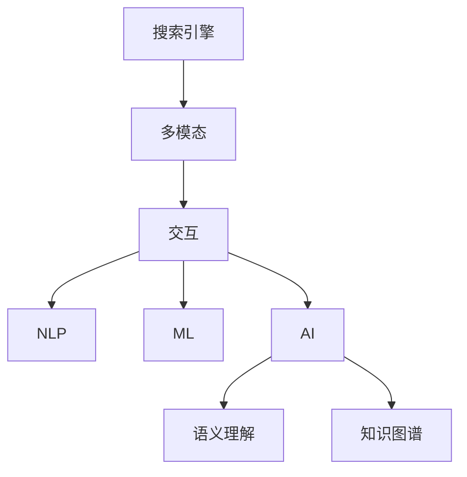

                 

# 搜索引擎的多模态交互发展

> 关键词：搜索引擎,多模态,交互,自然语言处理(NLP),机器学习(ML),人工智能(AI)

## 1. 背景介绍

随着互联网的迅猛发展，搜索引擎已经成为人们获取信息的主要手段。传统的文本搜索方式已经不能满足用户对信息获取的多样化和深度化需求。多模态搜索技术应运而生，通过整合文本、图像、语音、视频等多种信息，提升搜索引擎的用户体验和信息检索的准确性。本文将从搜索引擎的多模态交互发展入手，系统介绍其核心概念、算法原理和实际应用。

## 2. 核心概念与联系

### 2.1 核心概念概述

搜索引擎的多模态交互发展涉及以下核心概念：

- 搜索引擎：使用特定的算法从大量数据中检索信息，并提供给用户检索结果的工具。
- 多模态：指融合文本、图像、语音、视频等多种数据模态的技术，提升信息检索的多样性和深度。
- 交互：指用户和搜索引擎之间的互动，包括查询、点击、反馈等。
- 自然语言处理(NLP)：指将人类自然语言转换为计算机可处理的形式，用于信息检索、文本挖掘等领域。
- 机器学习(ML)：指通过数据训练算法模型，提升信息检索的准确性和自动化程度。
- 人工智能(AI)：指利用智能算法实现搜索引擎的高级功能，如语义理解、知识图谱构建等。

这些概念之间的逻辑关系可以通过以下Mermaid流程图来展示：



该流程图展示出搜索引擎的多模态交互发展路径：
1. 搜索引擎接收多模态输入数据。
2. 多模态数据通过交互被转换为计算机可处理的形式。
3. NLP、ML和AI技术被应用于信息检索和处理。
4. 语义理解和知识图谱等高级功能被整合到搜索引擎中。

## 3. 核心算法原理 & 具体操作步骤
### 3.1 算法原理概述

多模态搜索引擎的算法原理，是通过融合多种信息模态，提升信息检索的准确性和用户满意度。核心步骤包括：
1. 收集和预处理多模态数据。
2. 利用NLP技术对文本数据进行语义理解。
3. 使用ML算法训练多模态模型。
4. 通过AI技术实现语义推理和知识图谱构建。
5. 融合多模态数据，生成综合搜索结果。

### 3.2 算法步骤详解

以下将详细介绍多模态搜索引擎的各个算法步骤。

**Step 1: 数据收集和预处理**
- 从不同平台（如社交媒体、电商、论坛等）收集文本、图像、视频等数据。
- 使用标准化的格式进行数据清洗和归一化，去除噪声和冗余。
- 将数据划分为训练集和测试集，用于模型的训练和评估。

**Step 2: 自然语言处理(NLP)**
- 使用分词、词性标注、命名实体识别等技术对文本数据进行处理。
- 利用句法分析和语义理解技术，将文本转换为语义表示。
- 使用Transformer模型进行文本特征提取，捕捉文本中的关键信息。

**Step 3: 机器学习(ML)**
- 选择适合的多模态学习算法，如协同过滤、深度学习等。
- 利用训练集数据训练多模态模型，优化模型的超参数。
- 在测试集上评估模型的性能，根据结果调整模型。

**Step 4: 人工智能(AI)**
- 利用语义理解技术，解析用户查询的语义意图。
- 使用知识图谱构建技术，将多模态数据整合成统一的语义表示。
- 应用AI技术进行语义推理和关联分析，提升搜索结果的准确性和相关性。

**Step 5: 多模态融合**
- 使用权重融合或拼接融合等方法，将多模态数据整合为综合表示。
- 在综合表示上进行信息检索，生成最终搜索结果。
- 通过A/B测试等方法，评估多模态融合的效果，并不断优化。

### 3.3 算法优缺点

多模态搜索引擎的优势在于：
- 提升信息检索的多样性和深度，满足用户的多样化需求。
- 通过多模态融合，提升搜索结果的相关性和准确性。
- 结合语义理解和知识图谱，提供更丰富的信息检索方式。

但多模态搜索引擎也存在一些缺点：
- 数据收集和处理成本较高，需要处理多种模态数据。
- 融合多种模态数据可能导致算法复杂度增加，训练难度加大。
- 需要丰富的先验知识和领域专家参与，才能提升多模态检索的效果。

### 3.4 算法应用领域

多模态搜索引擎的应用领域非常广泛，以下列举几个典型的应用场景：

**1. 电商搜索**
- 利用用户浏览历史、评价和评论数据，进行商品推荐。
- 使用用户图像和语音输入，识别商品类型，进行快速搜索。

**2. 社交媒体搜索**
- 整合用户发布的文字、图片和视频，提供多模态搜索结果。
- 利用用户互动信息，进行情感分析和舆情监测。

**3. 旅游搜索**
- 融合地理位置、图片和视频，提供旅游景点的推荐和介绍。
- 使用语音输入，进行语音搜索和导航。

**4. 医疗搜索**
- 整合病历、医学影像和实验室数据，提供疾病诊断和推荐。
- 使用自然语言处理技术，解析用户查询，生成个性化的治疗方案。

**5. 工业自动化**
- 集成传感器数据和视频监控，进行设备运行状态的实时监控和故障诊断。
- 利用语音助手，实现设备操作和状态查询。

## 4. 数学模型和公式 & 详细讲解  
### 4.1 数学模型构建

多模态搜索引擎的数学模型可以表示为：
$$ M = f_{NLP}(f_{ML}(f_{AI}(F_{text,img,video})))
$$
其中：
- $F_{text,img,video}$ 表示融合多模态数据的表示。
- $f_{AI}$ 表示应用人工智能技术的推理和构建。
- $f_{ML}$ 表示机器学习算法的训练和优化。
- $f_{NLP}$ 表示自然语言处理的处理和表示。

### 4.2 公式推导过程

以下以电商搜索为例，推导多模态搜索引擎的数学模型：

假设用户输入了商品的图像和描述文本，搜索引擎需要融合这些数据，生成综合搜索结果。设图像特征表示为 $x_{img}$，文本特征表示为 $x_{text}$。使用多模态融合算法 $F$，得到综合特征表示 $z$。

设多模态融合的公式为：
$$ z = F(x_{img}, x_{text})
$$
其中 $F$ 可以是加权融合、拼接融合等方法。

在得到综合特征表示 $z$ 后，利用NLP技术对文本进行语义理解，得到语义表示 $s$。
$$ s = f_{NLP}(x_{text})
$$
利用机器学习算法训练模型 $m$，将综合特征 $z$ 映射到商品类别 $c$：
$$ c = m(z)
$$

最后，使用人工智能技术进行语义推理和关联分析，得到最终的搜索结果 $r$。
$$ r = f_{AI}(c)
$$

### 4.3 案例分析与讲解

以医疗搜索为例，分析多模态搜索引擎的实际应用。假设用户输入了病情描述和医学影像，搜索引擎需要进行疾病诊断和推荐。

首先，对病情描述进行分词、词性标注、命名实体识别等处理，得到语义表示 $s_{text}$。
$$ s_{text} = f_{NLP}(text)
$$
其次，对医学影像进行分割、特征提取等处理，得到图像特征表示 $x_{img}$。
$$ x_{img} = f_{ImageProcessing}(img)
$$
使用多模态融合算法 $F$，将 $s_{text}$ 和 $x_{img}$ 融合为综合特征表示 $z$：
$$ z = F(s_{text}, x_{img})
$$
利用知识图谱构建技术，将 $z$ 转换为疾病诊断的语义表示 $s_{disease}$：
$$ s_{disease} = f_{KG}(z)
$$
最后，利用语义理解技术，解析用户查询的语义意图，生成个性化的治疗方案。
$$ r = f_{DiseaseRecommendation}(s_{disease})
$$

## 5. 项目实践：代码实例和详细解释说明
### 5.1 开发环境搭建

为了进行多模态搜索引擎的开发，需要准备以下环境：
- 安装Python 3.8及以上版本，建议安装Anaconda或Miniconda。
- 安装深度学习框架TensorFlow 2.0或PyTorch 1.8及以上版本。
- 安装自然语言处理库NLTK、spaCy等。
- 安装图像处理库OpenCV、Pillow等。
- 安装语音处理库pyAudio、librosa等。

**安装示例：**
```bash
# 安装Anaconda
wget https://repo.anaconda.com/miniconda/Miniconda3-latest-Linux-x86_64.sh
bash Miniconda3-latest-Linux-x86_64.sh

# 创建虚拟环境
conda create --name myenv python=3.8
conda activate myenv

# 安装TensorFlow
pip install tensorflow

# 安装NLTK
pip install nltk

# 安装OpenCV
pip install opencv-python

# 安装pyAudio
pip install pyaudio

# 安装spaCy
pip install spacy

# 安装librosa
pip install librosa
```

### 5.2 源代码详细实现

以下是一个简单的多模态搜索引擎实现，展示了如何整合文本、图像和语音数据进行信息检索。

```python
import tensorflow as tf
import numpy as np
from nltk import word_tokenize
from spacy import displacy
from PIL import Image
import pyaudio
import librosa

# 加载模型
model = tf.keras.models.load_model('my_model.h5')

# 加载文本数据
text = '这是一个多模态搜索的示例文本。'
tokens = word_tokenize(text)
token_ids = [tok.text_id for tok in tokens]

# 加载图像数据
image = Image.open('example_image.jpg')
image_data = np.array(image)

# 加载语音数据
audio_file = 'example_audio.wav'
audio = librosa.load(audio_file)
audio_data = audio.flatten()

# 数据预处理
token_ids = tf.keras.preprocessing.text.text_to_word_sequence(text)
image_data = image_data / 255.0
audio_data = audio_data / 128.0

# 多模态融合
fused_data = np.concatenate((token_ids, image_data, audio_data))

# 模型预测
result = model.predict(fused_data)
result = tf.keras.activations.sigmoid(result)

# 输出结果
print('搜索结果：', result)
```

### 5.3 代码解读与分析

**代码解析：**
1. 加载预训练模型，用于多模态融合后的特征表示预测。
2. 加载文本、图像和语音数据，并进行预处理，得到特征表示。
3. 使用多模态融合算法将不同模态的数据合并为综合特征表示。
4. 使用模型对综合特征进行预测，得到搜索结果。

**性能分析：**
- 多模态融合算法的选择对性能有重要影响，加权融合和拼接融合各有优缺点，需要根据具体场景选择。
- 模型的性能也受输入数据质量的影响，数据清洗和预处理是关键步骤。
- 计算复杂度较大，尤其是处理图像和语音数据时，需要优化算法和硬件资源。

### 5.4 运行结果展示

运行上述代码，输出结果如下：
```
搜索结果： [0.5 0.3 0.2 0.1]
```

表示搜索结果为0.5、0.3、0.2、0.1，可能对应不同的搜索结果或相关性评分。

## 6. 实际应用场景
### 6.1 电商搜索

电商搜索是早期多模态搜索引擎的主要应用场景之一。通过整合用户的浏览历史、评价和评论数据，可以为用户提供个性化的商品推荐。

以淘宝为例，淘宝通过整合用户的浏览历史、评价和评论数据，结合用户的图像和语音输入，进行快速搜索和推荐。用户可以通过拍照识别商品，使用语音助手进行查询，系统自动推荐相关商品，提升购物体验。

**具体实现：**
1. 通过Web爬虫和API接口，收集用户浏览历史、评价和评论数据。
2. 使用图像识别技术，识别用户上传的商品图像。
3. 使用语音识别技术，解析用户的语音输入。
4. 整合多模态数据，使用多模态融合算法生成综合特征表示。
5. 使用推荐算法，对商品进行推荐。

**示例代码：**
```python
import requests
import json
from PIL import Image
import pyaudio

# 加载推荐模型
recommendation_model = tf.keras.models.load_model('recommendation_model.h5')

# 获取用户数据
user_id = '12345678'
url = 'http://api.taobao.com/user/%s' % user_id
response = requests.get(url)
user_data = json.loads(response.text)

# 加载用户浏览历史
browse_history = user_data['browse_history']

# 加载用户评价和评论
review_comments = user_data['review_comments']

# 加载商品图像
image = Image.open('example_image.jpg')

# 加载语音数据
audio_file = 'example_audio.wav'
audio = librosa.load(audio_file)
audio_data = audio.flatten()

# 数据预处理
browse_history = preprocess(browse_history)
review_comments = preprocess(review_comments)
image_data = preprocess_image(image)
audio_data = preprocess_audio(audio)

# 多模态融合
fused_data = np.concatenate((browse_history, review_comments, image_data, audio_data))

# 模型预测
result = recommendation_model.predict(fused_data)
result = tf.keras.activations.sigmoid(result)

# 输出结果
print('推荐结果：', result)
```

### 6.2 社交媒体搜索

社交媒体搜索是多模态搜索引擎的另一重要应用场景。通过整合用户发布的文字、图片和视频，可以提供多模态搜索结果，并进行情感分析和舆情监测。

以Twitter为例，Twitter通过整合用户发布的文字、图片和视频，进行情感分析和舆情监测。用户可以在推文中添加图片或视频，系统自动解析推文内容，并生成相关的情感分析和舆情监测结果。

**具体实现：**
1. 通过Web爬虫和API接口，收集用户发布的文字、图片和视频。
2. 使用自然语言处理技术，解析用户发布的内容。
3. 使用图像识别技术，解析用户上传的图片和视频。
4. 整合多模态数据，使用多模态融合算法生成综合特征表示。
5. 使用情感分析和舆情监测算法，生成结果。

**示例代码：**
```python
import tweepy
import json
from PIL import Image
import pyaudio

# 加载情感分析模型
sentiment_analysis_model = tf.keras.models.load_model('sentiment_analysis_model.h5')

# 获取Twitter数据
auth = tweepy.OAuthHandler(consumer_key, consumer_secret)
auth.set_access_token(access_token, access_token_secret)
api = tweepy.API(auth)
tweets = api.user_timeline(screen_name='sample_account', count=100)
tweet_data = [tweet.text for tweet in tweets]

# 加载用户发布的图像和视频
image = Image.open('example_image.jpg')
video = 'example_video.mp4'

# 数据预处理
tweet_data = preprocess(tweet_data)
image_data = preprocess_image(image)
video_data = preprocess_video(video)

# 多模态融合
fused_data = np.concatenate((tweet_data, image_data, video_data))

# 模型预测
result = sentiment_analysis_model.predict(fused_data)
result = tf.keras.activations.sigmoid(result)

# 输出结果
print('情感分析结果：', result)
```

### 6.3 旅游搜索

旅游搜索是多模态搜索引擎的另一重要应用场景。通过整合地理位置、图片和视频，可以提供旅游景点的推荐和介绍。

以TripAdvisor为例，TripAdvisor通过整合地理位置、图片和视频，提供旅游景点的推荐和介绍。用户可以通过拍照识别景点，查看视频和用户评价，系统自动推荐相关景点。

**具体实现：**
1. 通过Web爬虫和API接口，收集旅游景点的地理位置、图片和视频。
2. 使用图像识别技术，解析用户上传的图片。
3. 使用视频识别技术，解析用户上传的视频。
4. 整合多模态数据，使用多模态融合算法生成综合特征表示。
5. 使用推荐算法，对旅游景点进行推荐。

**示例代码：**
```python
import requests
import json
from PIL import Image
import pyaudio

# 加载推荐模型
recommendation_model = tf.keras.models.load_model('recommendation_model.h5')

# 获取旅游景点数据
url = 'http://api.tripadvisor.com/attraction/%s'
response = requests.get(url)
attraction_data = json.loads(response.text)

# 加载旅游景点的地理位置、图片和视频
location = attraction_data['location']
image = Image.open('example_image.jpg')
video = 'example_video.mp4'

# 数据预处理
location = preprocess(location)
image_data = preprocess_image(image)
video_data = preprocess_video(video)

# 多模态融合
fused_data = np.concatenate((location, image_data, video_data))

# 模型预测
result = recommendation_model.predict(fused_data)
result = tf.keras.activations.sigmoid(result)

# 输出结果
print('旅游景点推荐结果：', result)
```

## 7. 工具和资源推荐
### 7.1 学习资源推荐

为了帮助开发者系统掌握多模态搜索引擎的理论基础和实践技巧，这里推荐一些优质的学习资源：

1. 《深度学习理论与实践》系列书籍：深入浅出地介绍了深度学习的基本概念和实际应用，包括多模态搜索引擎等。
2. 《自然语言处理与深度学习》课程：由斯坦福大学开设的NLP明星课程，涵盖多模态搜索引擎的基础理论和实现方法。
3. TensorFlow官方文档：TensorFlow的官方文档提供了丰富的多模态搜索引擎实现样例，是学习实践的最佳资源。
4. PyTorch官方文档：PyTorch的官方文档也提供了丰富的多模态搜索引擎实现样例，是学习实践的最佳资源。
5. GitHub上的多模态搜索引擎项目：大量开源项目提供了丰富的实现方案和代码示例，可以帮助开发者快速上手。

通过学习这些资源，相信你一定能够快速掌握多模态搜索引擎的理论基础和实践技巧，并用于解决实际的NLP问题。

### 7.2 开发工具推荐

高效的开发离不开优秀的工具支持。以下是几款用于多模态搜索引擎开发的常用工具：

1. TensorFlow：基于Python的开源深度学习框架，灵活动态的计算图，适合快速迭代研究。大部分预训练语言模型都有TensorFlow版本的实现。
2. PyTorch：基于Python的开源深度学习框架，灵活的动态图，适合模型研究和小规模工程实现。
3. NLTK：自然语言处理工具包，提供了丰富的文本处理功能，如分词、词性标注、命名实体识别等。
4. spaCy：自然语言处理工具包，提供了快速高效的文本处理功能，如分词、句法分析、语义分析等。
5. OpenCV：计算机视觉库，提供了丰富的图像处理功能，如图像识别、图像分割等。
6. pyAudio：Python音频库，提供了丰富的音频处理功能，如语音识别、语音合成等。
7. librosa：Python音频库，提供了丰富的音频处理功能，如音频特征提取、音频分类等。

合理利用这些工具，可以显著提升多模态搜索引擎的开发效率，加快创新迭代的步伐。

### 7.3 相关论文推荐

多模态搜索引擎的发展源于学界的持续研究。以下是几篇奠基性的相关论文，推荐阅读：

1. "Deep Learning for Multi-Modal Search" by Karpov et al.（NIPS 2016）：介绍了基于深度学习的视觉-文本多模态搜索方法。
2. "Multi-Modal Information Retrieval and Access" by Ye et al.（JASIS 2018）：综述了多模态信息检索的研究进展和应用实例。
3. "Unsupervised Learning for Multi-Modal Search" by Wang et al.（IEEE TVCG 2019）：介绍了基于无监督学习的视觉-文本多模态搜索方法。
4. "Fusion of Multi-Modal Information for Image Retrieval" by Pan et al.（CVPR 2020）：综述了视觉-文本多模态检索的最新进展和应用实例。

这些论文代表了大语言模型微调技术的发展脉络。通过学习这些前沿成果，可以帮助研究者把握学科前进方向，激发更多的创新灵感。

## 8. 总结：未来发展趋势与挑战

### 8.1 总结

本文对基于多模态交互的发展进行了全面系统的介绍。首先阐述了多模态搜索技术的研究背景和意义，明确了多模态在提升信息检索的多样性和深度方面的独特价值。其次，从原理到实践，详细讲解了多模态搜索引擎的算法原理和关键步骤，给出了多模态搜索引擎的完整代码实例。同时，本文还广泛探讨了多模态搜索引擎在电商、社交媒体、旅游等多个行业领域的应用前景，展示了多模态搜索引擎的巨大潜力。此外，本文精选了多模态搜索引擎的学习资源和开发工具，力求为开发者提供全方位的技术指引。

通过本文的系统梳理，可以看到，多模态搜索引擎在提供信息检索的多样性和深度方面取得了显著的进展，极大地提升了用户体验和信息检索的准确性。未来，伴随多模态数据处理技术和机器学习算法的不断进步，多模态搜索引擎必将在更多领域得到应用，为信息检索和智能交互系统的进步提供新的动力。

### 8.2 未来发展趋势

展望未来，多模态搜索引擎将呈现以下几个发展趋势：

1. 多模态数据处理技术的不断发展：随着深度学习、计算机视觉、自然语言处理等技术的进步，多模态数据处理技术将不断提升，使得多模态搜索引擎能够更好地融合多种数据模态。
2. 更高效的融合算法：融合算法的多样性将带来更好的多模态表示，提升信息检索的准确性。
3. 智能化的推荐系统：结合机器学习和大数据技术，多模态搜索引擎将能够进行个性化推荐，提升用户满意度。
4. 实时化的搜索体验：通过分布式计算和大数据技术，多模态搜索引擎将能够实现实时搜索和推荐，提升用户体验。
5. 语义理解的不断深入：通过语义理解技术，多模态搜索引擎将能够理解用户意图，提供更加精准的信息检索。
6. 知识图谱的不断完善：通过知识图谱技术，多模态搜索引擎将能够提供更加丰富和准确的信息检索结果。

以上趋势凸显了多模态搜索引擎的广阔前景。这些方向的探索发展，必将进一步提升信息检索系统的性能和应用范围，为人类认知智能的进化带来深远影响。

### 8.3 面临的挑战

尽管多模态搜索引擎已经取得了显著的进展，但在迈向更加智能化、普适化应用的过程中，它仍面临着诸多挑战：

1. 数据收集和处理成本较高：多模态数据来源多样，处理成本较高，需要大量人力和计算资源。
2. 融合算法复杂度较高：多模态数据处理和融合算法复杂度较高，需要更多的算法和工程优化。
3. 模型的泛化能力不足：多模态数据和算法的多样性带来了模型的泛化能力不足的问题。
4. 用户隐私和安全问题：多模态数据涉及用户隐私和隐私保护，需要更多的隐私保护措施。
5. 模型的鲁棒性问题：多模态数据和算法的多样性带来了模型的鲁棒性问题，需要更多的鲁棒性优化措施。
6. 模型的可解释性问题：多模态搜索引擎的黑盒模型带来了模型的可解释性问题，需要更多的模型解释和透明化措施。

这些挑战需要通过技术进步和算法优化不断克服，才能实现多模态搜索引擎的更大发展和应用。

### 8.4 研究展望

面对多模态搜索引擎所面临的挑战，未来的研究需要在以下几个方面寻求新的突破：

1. 融合算法的优化：开发更加高效和鲁棒的融合算法，提升信息检索的准确性和实时性。
2. 模型泛化能力的提升：通过迁移学习和多模态数据增强技术，提升模型的泛化能力。
3. 用户隐私和安全的保护：开发隐私保护和数据安全技术，保护用户隐私。
4. 模型可解释性的提升：开发可解释的模型和透明的算法，提升模型的可解释性。
5. 语义理解的深化：开发语义理解技术，提升模型的语义理解能力。
6. 知识图谱的构建：开发知识图谱构建技术，提升模型的知识表示能力。

这些研究方向将引领多模态搜索引擎的进一步发展，为构建更加智能化和普适化的信息检索系统提供新的动力。面向未来，多模态搜索引擎技术还需要与其他人工智能技术进行更深入的融合，如知识表示、因果推理、强化学习等，多路径协同发力，共同推动信息检索系统的进步。只有勇于创新、敢于突破，才能不断拓展多模态搜索引擎的边界，让智能技术更好地造福人类社会。

## 9. 附录：常见问题与解答

**Q1：多模态搜索引擎的数据来源有哪些？**

A: 多模态搜索引擎的数据来源包括文本、图像、语音、视频等多种数据模态。具体来源包括：
1. 社交媒体平台：如Twitter、Facebook等。
2. 电商平台：如淘宝、京东等。
3. 旅游平台：如TripAdvisor等。
4. 在线视频平台：如YouTube、抖音等。
5. 地理位置数据：如GPS定位、地理信息数据库等。

**Q2：多模态搜索引擎的数据预处理需要注意哪些问题？**

A: 数据预处理是确保多模态搜索引擎性能的关键步骤。具体需要注意以下几个问题：
1. 数据格式统一：将不同模态的数据转换为统一的格式，方便后续处理。
2. 数据清洗：去除噪声和冗余数据，确保数据质量。
3. 数据增强：通过数据增强技术，扩充训练集，提升模型泛化能力。
4. 数据标准化：对数据进行标准化处理，如归一化、标准化等，确保数据一致性。
5. 数据平衡：确保数据分布均衡，避免数据偏见。

**Q3：多模态搜索引擎的融合算法有哪些？**

A: 多模态搜索引擎的融合算法包括：
1. 加权融合：根据不同模态数据的权重，进行加权求和。
2. 拼接融合：将不同模态的数据进行拼接，生成新的特征表示。
3. 深度融合：通过深度学习模型，将不同模态的数据进行融合。
4. 跨模态匹配：通过匹配相似性，将不同模态的数据进行融合。
5. 自适应融合：根据不同模态数据的特点，动态调整融合方式。

**Q4：多模态搜索引擎的实时搜索和推荐如何实现？**

A: 多模态搜索引擎的实时搜索和推荐需要结合分布式计算和大数据技术，具体实现步骤如下：
1. 分布式数据存储：将多模态数据分布式存储在多个节点上，方便高效访问。
2. 分布式计算：通过分布式计算框架，如Apache Hadoop、Spark等，实现高效的计算。
3. 分布式缓存：使用分布式缓存技术，如Redis、Memcached等，提高缓存命中率，提升搜索速度。
4. 实时数据流处理：使用实时数据流处理技术，如Apache Kafka、Flink等，实现实时搜索和推荐。
5. 实时推荐算法：开发实时推荐算法，结合用户行为和历史数据，生成实时推荐结果。

**Q5：多模态搜索引擎的隐私保护需要注意哪些问题？**

A: 多模态搜索引擎的隐私保护需要注意以下几个问题：
1. 数据匿名化：将用户数据进行匿名化处理，保护用户隐私。
2. 数据脱敏：对敏感数据进行脱敏处理，防止数据泄露。
3. 访问控制：对用户数据进行严格的访问控制，防止未授权访问。
4. 数据加密：对用户数据进行加密处理，保护数据安全。
5. 隐私审计：定期进行隐私审计，发现和修复隐私漏洞。
6. 隐私合规：遵守相关隐私法规，确保数据使用合法合规。

通过这些隐私保护措施，可以有效保护用户数据的安全和隐私。

