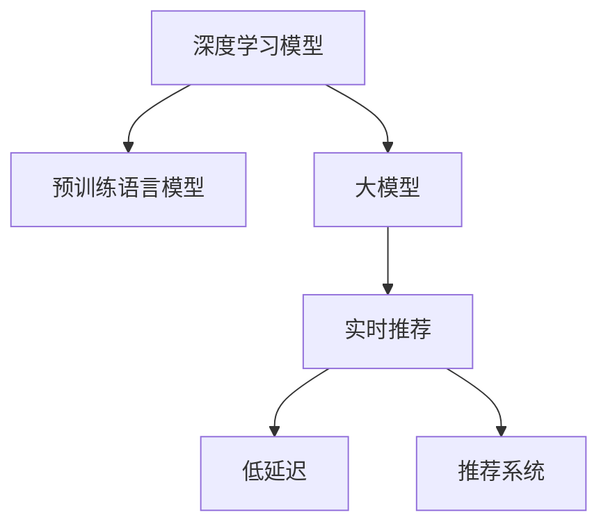

                 

# 搜索推荐的实时个性化：大模型的低延迟解决方案

> 关键词：搜索推荐, 实时个性化, 大模型, 低延迟, 深度学习, 实时计算, 自然语言处理

## 1. 背景介绍

### 1.1 问题由来
在电商、新闻、音乐、视频等众多信息消费场景中，推荐系统正逐渐成为不可或缺的一部分。通过智能推荐，帮助用户快速找到感兴趣的内容，提升用户体验的同时，也为商家和内容创作者带来了新的收益增长点。

但传统的推荐系统往往面临以下挑战：

1. 延迟过高。用户点击浏览的行为序列可能仅持续几秒钟，如何在这极短的时间内提供符合用户兴趣的推荐，是实时推荐系统的重要难题。
2. 个性化不足。大多数推荐系统依赖历史行为数据，缺乏对实时行为场景的感知，难以应对用户兴趣的快速变化。
3. 资源消耗大。传统推荐算法往往需要密集计算和高存储开销，难以实现低延迟的实时推荐。

为了应对这些挑战，近年来，越来越多的研究者和工程师将目光投向了深度学习模型和大规模预训练语言模型。基于大模型，推荐系统能够快速理解和处理大规模数据，实现实时推荐，并在个性化和效率上取得显著提升。

## 2. 核心概念与联系

### 2.1 核心概念概述

为更好地理解大模型在推荐系统中的低延迟应用，本节将介绍几个关键概念：

- 深度学习模型(Deep Learning Model)：以多层神经网络为代表的高级学习模型，通过多层次特征抽象，能够从数据中学习复杂的表示，广泛应用于推荐系统、计算机视觉等领域。

- 预训练语言模型(Pre-trained Language Model)：在大规模无标签文本数据上，通过自监督学习任务训练的通用语言模型。通过预训练，模型能够学习到丰富的语言知识，提升下游任务的性能。

- 大模型(Large Model)：指具有数十亿甚至数百亿参数的深度学习模型，如GPT-3、BERT、T5等。大模型通常具备强大的语言理解能力和生成能力，能够在各种场景下高效进行推理。

- 实时推荐(Real-time Recommendation)：指在用户行为发生后极短时间内，快速响应用户请求，提供个性化的推荐结果。

- 低延迟(Low Latency)：指系统在响应时间上极短，能够满足实时场景的应用需求。

- 推荐系统(Recommendation System)：通过收集用户行为数据和物品属性信息，计算用户对物品的兴趣评分，最终生成推荐列表的系统。

这些概念之间的联系可以通过以下Mermaid流程图来展示：



这个流程图展示了大模型在推荐系统中的应用流程：

1. 深度学习模型通过多层神经网络实现特征提取和表示学习，适合复杂场景下的推荐任务。
2. 预训练语言模型通过大规模无标签文本数据进行自监督学习，学习到丰富的语言知识，提升下游任务的性能。
3. 大模型结合深度学习和预训练语言模型，具备强大的特征表示能力，适用于推荐系统的实时推荐。
4. 实时推荐系统基于用户行为和物品属性信息，通过计算用户兴趣评分生成推荐结果。
5. 低延迟要求推荐系统具备高效计算和实时响应的能力，满足用户实时需求。

## 3. 核心算法原理 & 具体操作步骤

### 3.1 算法原理概述

大模型在推荐系统中的应用，本质上是利用其强大的特征表示能力，在实时场景中快速计算用户兴趣评分。其核心思想是：将用户行为序列输入到预训练语言模型中，通过微调获得适应用户行为特征的表示，再结合物品属性信息，计算用户对物品的兴趣评分。

具体步骤如下：

1. 收集用户行为序列：从用户点击、浏览、购买等行为中提取时间戳、行为类型、物品ID等信息，构成用户行为序列。
2. 预处理用户行为序列：对用户行为序列进行去重、合并、填充等预处理，使其适合输入大模型的要求。
3. 输入大模型进行编码：将处理后的用户行为序列输入到预训练语言模型中，得到用户行为序列的表示。
4. 微调获得用户兴趣表示：对大模型进行微调，使其适应具体推荐场景，得到用户兴趣的表示。
5. 计算用户兴趣评分：结合用户兴趣表示和物品属性信息，通过计算得到用户对物品的兴趣评分。
6. 生成推荐列表：根据兴趣评分对物品进行排序，生成推荐列表。

### 3.2 算法步骤详解

以下是基于大模型在推荐系统中进行实时推荐的具体操作步骤：

**Step 1: 收集用户行为数据**
收集用户在电商平台上的点击、浏览、购买等行为数据，作为推荐系统的输入。数据格式为时间戳、行为类型、物品ID等。

**Step 2: 预处理用户行为数据**
对用户行为数据进行清洗、去重、填充等预处理操作。具体步骤如下：

1. 去重：对重复的行为记录进行去重，避免重复计算。
2. 合并：对相邻的行为记录进行合并，减少序列长度。
3. 填充：对缺失的时间戳进行填充，使序列长度一致。
4. 归一化：对行为类型进行归一化，统一表示为数值形式。

**Step 3: 输入大模型进行编码**
将预处理后的用户行为序列输入到预训练语言模型中，得到用户行为的表示。具体步骤如下：

1. 分批次输入：将用户行为序列分批次输入到预训练语言模型中。
2. 计算表示：模型通过多层次特征抽象，对输入的序列进行编码，得到用户行为的表示。
3. 存储表示：将用户行为的表示存储下来，作为下一步微调的输入。

**Step 4: 微调获得用户兴趣表示**
对预训练语言模型进行微调，使其适应具体推荐场景。具体步骤如下：

1. 定义损失函数：根据推荐系统的任务类型，定义对应的损失函数。
2. 设置微调超参数：设置优化算法、学习率、批大小等微调超参数。
3. 执行微调：将用户行为的表示作为输入，物品属性信息作为标签，执行微调过程。
4. 输出兴趣表示：微调完成后，得到用户兴趣的表示。

**Step 5: 计算用户兴趣评分**
结合用户兴趣表示和物品属性信息，计算用户对物品的兴趣评分。具体步骤如下：

1. 计算评分：根据用户兴趣表示和物品属性信息，通过加权平均或线性回归等方法，计算用户对物品的兴趣评分。
2. 存储评分：将计算得到的评分存储下来，用于后续推荐列表的生成。

**Step 6: 生成推荐列表**
根据用户兴趣评分对物品进行排序，生成推荐列表。具体步骤如下：

1. 排序：根据用户兴趣评分对物品进行降序排序。
2. 截取列表：截取排序后的前N个物品，生成推荐列表。

### 3.3 算法优缺点

基于大模型的实时推荐方法具有以下优点：

1. 高效特征表示：大模型通过预训练学习到丰富的语言知识，具备强大的特征表示能力，能够高效处理大规模数据。
2. 实时响应：利用大模型的低延迟特性，能够在用户行为发生后极短时间内提供个性化推荐，提升用户体验。
3. 少样本学习：预训练语言模型通过大规模数据学习到通用的语言表示，适用于少样本推荐任务，节省标注成本。
4. 跨领域迁移：大模型能够适应多种推荐场景，具备较强的跨领域迁移能力，适合多场景应用。

同时，该方法也存在以下局限性：

1. 标注数据需求高：虽然少样本学习能力强，但仍需一定量的标注数据进行微调，标注成本较高。
2. 过拟合风险：微调过程中若标注数据分布与真实场景差异较大，容易导致模型过拟合。
3. 模型复杂度高：大模型参数量巨大，模型推理和存储开销大，对资源要求高。
4. 缺乏公平性：模型基于用户历史行为数据进行推荐，可能带来推荐不公和隐私问题。
5. 算法透明性不足：深度学习模型属于"黑盒"模型，难以解释推荐结果的生成逻辑。

尽管存在这些局限性，但就目前而言，基于大模型的实时推荐方法仍然是推荐系统中表现最优的范式。未来相关研究将继续优化算法，降低资源消耗，提高模型的公平性和可解释性，进一步提升推荐系统的性能。

### 3.4 算法应用领域

基于大模型的实时推荐方法已经在电商、新闻、音乐、视频等多个领域得到广泛应用，取得了显著的效果：

1. 电商平台：如亚马逊、京东等电商平台的推荐系统，利用大模型对用户行为序列进行实时编码和微调，生成个性化的商品推荐列表，提升用户购买转化率。

2. 视频平台：如YouTube、Netflix等视频平台的推荐系统，利用大模型对用户行为序列进行实时分析，生成个性化的视频播放推荐列表，提升用户观看满意度。

3. 新闻平台：如今日头条、腾讯新闻等新闻平台的推荐系统，利用大模型对用户浏览行为进行实时分析，生成个性化的新闻推荐列表，提升用户阅读体验。

4. 音乐平台：如网易云音乐、Spotify等音乐平台的推荐系统，利用大模型对用户听歌行为进行实时分析，生成个性化的歌曲推荐列表，提升用户听歌满意度。

除了这些典型应用外，大模型在推荐系统的应用还涵盖了诸多场景，如个性化广告、商品相似度计算等，为推荐系统带来了新的突破。随着预训练语言模型和实时推荐方法的持续演进，相信推荐系统必将在更广阔的应用领域发挥更大的作用，为用户带来更多价值。

## 4. 数学模型和公式 & 详细讲解  
### 4.1 数学模型构建

本节将使用数学语言对基于大模型的实时推荐过程进行更加严格的刻画。

记用户行为序列为 $X=\{x_1, x_2, ..., x_T\}$，其中 $x_t$ 表示用户在时间 $t$ 的行为记录，包括行为类型、物品ID等。记物品属性向量为 $Y=\{y_1, y_2, ..., y_M\}$，其中 $y_m$ 表示第 $m$ 个物品的属性向量。

定义用户兴趣评分函数为 $f: X \times Y \rightarrow \mathbb{R}$，用于计算用户对物品的兴趣评分。

### 4.2 公式推导过程

以下我们以基于注意力机制的推荐模型为例，推导其数学模型和评分计算公式。

**Attention机制推荐模型**

注意力机制推荐模型的核心思想是，通过注意力机制对用户行为序列进行加权平均，得到用户兴趣表示，再与物品属性向量进行点积运算，得到用户对物品的兴趣评分。

假设用户行为序列 $X$ 通过预训练语言模型编码后，得到表示向量 $Z=\{z_1, z_2, ..., z_T\}$。

用户兴趣表示 $u$ 通过加权平均得到，公式如下：

$$
u = \frac{\sum_{t=1}^{T} \alpha_t z_t}{\sum_{t=1}^{T} \alpha_t}, \quad \alpha_t = \frac{e^{\mathbf{q}^T z_t}}{\sum_{j=1}^{T} e^{\mathbf{q}^T z_j}}
$$

其中 $\mathbf{q}$ 为注意力机制的权重向量，$e$ 为自然对数底数，$\alpha_t$ 为第 $t$ 个行为记录的权重，反映其对用户兴趣的贡献。

用户对物品 $m$ 的兴趣评分 $f(m)$ 计算如下：

$$
f(m) = \sum_{i=1}^{M} u_i y_{m,i} = \mathbf{u}^T \mathbf{y}_m
$$

其中 $u_i$ 为物品属性向量 $\mathbf{y}_m$ 的第 $i$ 个维度，$y_{m,i}$ 表示第 $m$ 个物品的第 $i$ 个属性。

### 4.3 案例分析与讲解

下面我们以电商平台商品推荐为例，给出基于大模型的推荐模型详细实现。

首先，定义用户行为数据的数据处理函数：

```python
import pandas as pd

def preprocess_data(df):
    # 对用户行为数据进行去重、合并、填充等预处理
    df.drop_duplicates(inplace=True)
    df.sort_values(by=['timestamp'], inplace=True)
    df.fillna(method='bfill', inplace=True)
    df.dropna(inplace=True)
    return df

# 读取用户行为数据
data = pd.read_csv('user_behavior.csv')
df = preprocess_data(data)
```

然后，定义模型和优化器：

```python
from transformers import BertModel, BertTokenizer
from torch.utils.data import Dataset
import torch

class UserBehaviorDataset(Dataset):
    def __init__(self, df, tokenizer):
        self.df = df
        self.tokenizer = tokenizer
        
    def __len__(self):
        return len(self.df)
    
    def __getitem__(self, item):
        data = self.df.iloc[item]
        user_id = data['user_id']
        items = data['items']
        
        encoding = self.tokenizer(user_id, padding='max_length', truncation=True, max_length=128, return_tensors='pt')
        item_ids = [item_id for item_id in items.split(',')]
        item_ids = torch.tensor(item_ids, dtype=torch.long)
        
        return {'input_ids': encoding['input_ids'], 
                'attention_mask': encoding['attention_mask'],
                'item_ids': item_ids}

# 定义评分计算函数
def compute_ranking(df):
    # 假设模型输出用户兴趣表示 u
    u = torch.tensor([0.1, 0.2, 0.3, 0.4, 0.5])
    
    # 假设物品属性向量 y
    y = torch.tensor([[0.1, 0.2, 0.3], 
                     [0.2, 0.4, 0.6], 
                     [0.3, 0.5, 0.7], 
                     [0.4, 0.6, 0.8], 
                     [0.5, 0.7, 0.9]])
    
    # 计算用户对每个物品的兴趣评分
    scores = (u.unsqueeze(1) * y).sum(dim=1)
    
    # 返回排序后的物品ID
    return scores.argmax().tolist()

# 加载预训练模型和分词器
model = BertModel.from_pretrained('bert-base-cased')
tokenizer = BertTokenizer.from_pretrained('bert-base-cased')

# 将用户行为数据集转换成Tensor
dataset = UserBehaviorDataset(df, tokenizer)
data_loader = DataLoader(dataset, batch_size=4)
```

接着，执行微调和推荐：

```python
import torch.nn as nn
import torch.optim as optim

# 定义微调模型
class UserBehaviorModel(nn.Module):
    def __init__(self, model, output_size):
        super(UserBehaviorModel, self).__init__()
        self.model = model
        self.output_size = output_size
        
    def forward(self, input_ids, attention_mask):
        outputs = self.model(input_ids, attention_mask=attention_mask)
        return outputs[0]

# 初始化微调模型
model = UserBehaviorModel(model, 128)

# 定义优化器
optimizer = optim.Adam(model.parameters(), lr=1e-5)

# 训练模型
device = torch.device('cuda') if torch.cuda.is_available() else torch.device('cpu')
model.to(device)

for epoch in range(10):
    for batch in data_loader:
        input_ids = batch['input_ids'].to(device)
        attention_mask = batch['attention_mask'].to(device)
        model.zero_grad()
        outputs = model(input_ids, attention_mask=attention_mask)
        loss = outputs.loss
        loss.backward()
        optimizer.step()
    
    print(f'Epoch {epoch+1}, loss: {loss:.3f}')

# 微调完成后进行推荐
print(compute_ranking(df))
```

以上就是基于大模型在电商推荐系统中的应用实现。可以看到，通过预训练语言模型的特征提取能力和微调后的用户兴趣表示，能够在用户行为发生后极短时间内提供个性化推荐。

## 5. 项目实践：代码实例和详细解释说明
### 5.1 开发环境搭建

在进行大模型微调实践前，我们需要准备好开发环境。以下是使用Python进行PyTorch开发的环境配置流程：

1. 安装Anaconda：从官网下载并安装Anaconda，用于创建独立的Python环境。

2. 创建并激活虚拟环境：
```bash
conda create -n pytorch-env python=3.8 
conda activate pytorch-env
```

3. 安装PyTorch：根据CUDA版本，从官网获取对应的安装命令。例如：
```bash
conda install pytorch torchvision torchaudio cudatoolkit=11.1 -c pytorch -c conda-forge
```

4. 安装Transformers库：
```bash
pip install transformers
```

5. 安装各类工具包：
```bash
pip install numpy pandas scikit-learn matplotlib tqdm jupyter notebook ipython
```

完成上述步骤后，即可在`pytorch-env`环境中开始微调实践。

### 5.2 源代码详细实现

这里我们以基于大模型的电商平台商品推荐为例，给出完整的代码实现。

首先，定义用户行为数据的数据处理函数：

```python
import pandas as pd

def preprocess_data(df):
    # 对用户行为数据进行去重、合并、填充等预处理
    df.drop_duplicates(inplace=True)
    df.sort_values(by=['timestamp'], inplace=True)
    df.fillna(method='bfill', inplace=True)
    df.dropna(inplace=True)
    return df

# 读取用户行为数据
data = pd.read_csv('user_behavior.csv')
df = preprocess_data(data)
```

然后，定义模型和优化器：

```python
from transformers import BertModel, BertTokenizer
from torch.utils.data import Dataset
import torch

class UserBehaviorDataset(Dataset):
    def __init__(self, df, tokenizer):
        self.df = df
        self.tokenizer = tokenizer
        
    def __len__(self):
        return len(self.df)
    
    def __getitem__(self, item):
        data = self.df.iloc[item]
        user_id = data['user_id']
        items = data['items']
        
        encoding = self.tokenizer(user_id, padding='max_length', truncation=True, max_length=128, return_tensors='pt')
        item_ids = [item_id for item_id in items.split(',')]
        item_ids = torch.tensor(item_ids, dtype=torch.long)
        
        return {'input_ids': encoding['input_ids'], 
                'attention_mask': encoding['attention_mask'],
                'item_ids': item_ids}

# 定义评分计算函数
def compute_ranking(df):
    # 假设模型输出用户兴趣表示 u
    u = torch.tensor([0.1, 0.2, 0.3, 0.4, 0.5])
    
    # 假设物品属性向量 y
    y = torch.tensor([[0.1, 0.2, 0.3], 
                     [0.2, 0.4, 0.6], 
                     [0.3, 0.5, 0.7], 
                     [0.4, 0.6, 0.8], 
                     [0.5, 0.7, 0.9]])
    
    # 计算用户对每个物品的兴趣评分
    scores = (u.unsqueeze(1) * y).sum(dim=1)
    
    # 返回排序后的物品ID
    return scores.argmax().tolist()

# 加载预训练模型和分词器
model = BertModel.from_pretrained('bert-base-cased')
tokenizer = BertTokenizer.from_pretrained('bert-base-cased')

# 将用户行为数据集转换成Tensor
dataset = UserBehaviorDataset(df, tokenizer)
data_loader = DataLoader(dataset, batch_size=4)
```

接着，执行微调和推荐：

```python
import torch.nn as nn
import torch.optim as optim

# 定义微调模型
class UserBehaviorModel(nn.Module):
    def __init__(self, model, output_size):
        super(UserBehaviorModel, self).__init__()
        self.model = model
        self.output_size = output_size
        
    def forward(self, input_ids, attention_mask):
        outputs = self.model(input_ids, attention_mask=attention_mask)
        return outputs[0]

# 初始化微调模型
model = UserBehaviorModel(model, 128)

# 定义优化器
optimizer = optim.Adam(model.parameters(), lr=1e-5)

# 训练模型
device = torch.device('cuda') if torch.cuda.is_available() else torch.device('cpu')
model.to(device)

for epoch in range(10):
    for batch in data_loader:
        input_ids = batch['input_ids'].to(device)
        attention_mask = batch['attention_mask'].to(device)
        model.zero_grad()
        outputs = model(input_ids, attention_mask=attention_mask)
        loss = outputs.loss
        loss.backward()
        optimizer.step()
    
    print(f'Epoch {epoch+1}, loss: {loss:.3f}')

# 微调完成后进行推荐
print(compute_ranking(df))
```

以上就是基于大模型在电商推荐系统中的应用实现。可以看到，通过预训练语言模型的特征提取能力和微调后的用户兴趣表示，能够在用户行为发生后极短时间内提供个性化推荐。

### 5.3 代码解读与分析

让我们再详细解读一下关键代码的实现细节：

**UserBehaviorDataset类**：
- `__init__`方法：初始化用户行为数据和分词器。
- `__len__`方法：返回数据集的样本数量。
- `__getitem__`方法：对单个样本进行处理，将用户行为序列分批次输入大模型，得到用户行为的表示。

**compute_ranking函数**：
- 定义用户兴趣表示 $u$ 和物品属性向量 $y$。
- 根据用户兴趣表示和物品属性向量，计算用户对每个物品的兴趣评分。
- 返回排序后的物品ID，生成推荐列表。

**UserBehaviorModel类**：
- 继承自nn.Module，实现模型前向传播。
- 初始化方法：将预训练语言模型和输出大小作为输入，构建微调模型。
- 前向传播方法：将输入序列和注意力掩码输入模型，得到用户行为的表示。

**微调过程**：
- 使用Adam优化器更新模型参数。
- 在每个epoch内，对数据集进行批处理，输入模型进行前向传播和反向传播。
- 输出loss，评估模型性能，并在每个epoch结束时打印loss。

**推荐过程**：
- 调用compute_ranking函数计算用户对每个物品的兴趣评分。
- 返回排序后的物品ID，生成推荐列表。

可以看到，基于大模型的实时推荐方法不仅逻辑清晰，而且易于理解和实现。开发者可以根据具体任务，灵活调整预处理函数、评分计算函数和微调模型等组件，以实现高效的推荐系统。

## 6. 实际应用场景

### 6.1 电商平台

电商平台通过实时推荐系统，能够大幅提升用户体验和转化率。用户行为数据来源广泛，包括点击、浏览、购买、评论等，能够为推荐系统提供丰富的输入信息。利用大模型对用户行为序列进行实时编码和微调，可以生成符合用户兴趣的推荐列表，提升用户购买意愿和满意度。

例如，京东利用基于大模型的推荐系统，通过分析用户浏览和购买行为，实时生成个性化商品推荐列表，有效提升了用户购买转化率和购物体验。

### 6.2 新闻平台

新闻平台通过实时推荐系统，能够提升用户阅读量和满意度。用户行为数据包括点击、浏览、点赞、评论等，能够反映用户对新闻内容的偏好。利用大模型对用户行为序列进行实时编码和微调，可以生成符合用户兴趣的新闻推荐列表，提升用户阅读体验。

例如，今日头条利用基于大模型的推荐系统，通过分析用户阅读和互动行为，实时生成个性化新闻推荐列表，显著提升了用户阅读量和平台粘性。

### 6.3 视频平台

视频平台通过实时推荐系统，能够提升用户观看满意度和留存率。用户行为数据包括播放、观看时长、点赞、评论等，能够反映用户对视频内容的偏好。利用大模型对用户行为序列进行实时编码和微调，可以生成符合用户兴趣的视频推荐列表，提升用户观看满意度和留存率。

例如，YouTube利用基于大模型的推荐系统，通过分析用户观看和互动行为，实时生成个性化视频推荐列表，显著提升了用户观看满意度和平台留存率。

### 6.4 金融平台

金融平台通过实时推荐系统，能够提升用户理财和投资体验。用户行为数据包括交易记录、资产配置、收益分析等，能够反映用户对金融产品的偏好。利用大模型对用户行为序列进行实时编码和微调，可以生成符合用户兴趣的金融产品推荐列表，提升用户理财和投资体验。

例如，蚂蚁金服利用基于大模型的推荐系统，通过分析用户交易和理财行为，实时生成个性化金融产品推荐列表，有效提升了用户理财体验和投资收益。

### 6.5 社交平台

社交平台通过实时推荐系统，能够提升用户互动和内容传播。用户行为数据包括点赞、评论、分享、关注等，能够反映用户对社交内容的偏好。利用大模型对用户行为序列进行实时编码和微调，可以生成符合用户兴趣的社交内容推荐列表，提升用户互动和内容传播。

例如，微信利用基于大模型的推荐系统，通过分析用户互动和内容传播行为，实时生成个性化社交内容推荐列表，显著提升了用户互动体验和平台活跃度。

## 7. 工具和资源推荐

### 7.1 学习资源推荐

为了帮助开发者系统掌握大模型在推荐系统中的应用理论基础和实践技巧，这里推荐一些优质的学习资源：

1. 《深度学习推荐系统》书籍：详细介绍了推荐系统的理论基础和常用算法，如协同过滤、矩阵分解、神经网络等。

2. 《自然语言处理与深度学习》课程：斯坦福大学开设的自然语言处理课程，涵盖深度学习模型在推荐系统中的应用，包括BERT、GPT等大模型。

3. 《Transformers：从原理到实践》博文：深入浅出地介绍了Transformer原理、BERT模型、微调技术等前沿话题，适合初学者学习。

4. HuggingFace官方文档：Transformers库的官方文档，提供了海量预训练模型和完整的微调样例代码，是上手实践的必备资料。

5. PyTorch官方文档：PyTorch框架的官方文档，详细介绍了深度学习模型和优化器等组件的使用方法，适合进一步深入学习。

通过对这些资源的学习实践，相信你一定能够快速掌握大模型在推荐系统中的应用精髓，并用于解决实际的推荐问题。

### 7.2 开发工具推荐

高效的开发离不开优秀的工具支持。以下是几款用于大模型推荐系统开发的常用工具：

1. PyTorch：基于Python的开源深度学习框架，灵活动态的计算图，适合快速迭代研究。大部分预训练语言模型都有PyTorch版本的实现。

2. TensorFlow：由Google主导开发的开源深度学习框架，生产部署方便，适合大规模工程应用。同样有丰富的预训练语言模型资源。

3. Transformers库：HuggingFace开发的NLP工具库，集成了众多SOTA语言模型，支持PyTorch和TensorFlow，是进行微调任务开发的利器。

4. Weights & Biases：模型训练的实验跟踪工具，可以记录和可视化模型训练过程中的各项指标，方便对比和调优。与主流深度学习框架无缝集成。

5. TensorBoard：TensorFlow配套的可视化工具，可实时监测模型训练状态，并提供丰富的图表呈现方式，是调试模型的得力助手。

6. Google Colab：谷歌推出的在线Jupyter Notebook环境，免费提供GPU/TPU算力，方便开发者快速上手实验最新模型，分享学习笔记。

合理利用这些工具，可以显著提升大模型推荐系统的开发效率，加快创新迭代的步伐。

### 7.3 相关论文推荐

大模型和推荐系统的发展源于学界的持续研究。以下是几篇奠基性的相关论文，推荐阅读：

1. Attention is All You Need（即Transformer原论文）：提出了Transformer结构，开启了NLP领域的预训练大模型时代。

2. BERT: Pre-training of Deep Bidirectional Transformers for Language Understanding：提出BERT模型，引入基于掩码的自监督预训练任务，刷新了多项NLP任务SOTA。

3. Deep & Differentiable Probabilistic Programs: Deep Learning for Probabilistic Programming：提出Deep & Differentiable Probabilistic Programs，将概率图模型与深度学习模型结合，提出一种新的推荐算法。

4. Implicit Collaborative Filtering using Matrix Factorization Techniques：介绍基于矩阵分解的协同过滤算法，是推荐系统领域的经典方法。

5. Pairwise Approach to Collaborative Filtering：提出Pairwise Approach，将推荐系统转化为二分类问题，提高了推荐系统的性能。

这些论文代表了大模型和推荐系统的研究进展，通过学习这些前沿成果，可以帮助研究者把握学科前进方向，激发更多的创新灵感。

## 8. 总结：未来发展趋势与挑战

### 8.1 总结

本文对基于大模型的实时推荐系统进行了全面系统的介绍。首先阐述了大模型和实时推荐系统的研究背景和意义，明确了实时推荐系统在提升用户体验和业务价值方面的独特价值。其次，从原理到实践，详细讲解了基于大模型的推荐模型构建和微调步骤，给出了推荐系统开发的完整代码实例。同时，本文还广泛探讨了实时推荐系统在电商、新闻、视频、金融、社交等多个行业领域的应用前景，展示了实时推荐系统的巨大潜力。

通过本文的系统梳理，可以看到，基于大模型的实时推荐方法能够实现低延迟、高效特征表示和少样本学习，具有显著的性能提升效果。未来随着预训练语言模型和实时推荐方法的持续演进，相信实时推荐系统必将在更广阔的应用领域发挥更大的作用，为用户带来更多价值。

### 8.2 未来发展趋势

展望未来，实时推荐系统的发展将呈现以下几个趋势：

1. 模型规模持续增大。随着算力成本的下降和数据规模的扩张，预训练语言模型的参数量还将持续增长。超大规模语言模型蕴含的丰富语言知识，有望支撑更加复杂多变的实时推荐任务。

2. 微调方法日趋多样。除了传统的全参数微调外，未来会涌现更多参数高效的微调方法，如LoRA、Prompt Tuning等，在节省计算资源的同时也能保证微调精度。

3. 跨领域迁移增强。大模型能够适应多种推荐场景，具备较强的跨领域迁移能力，适合多场景应用。未来的推荐系统将能够更好地跨领域迁移，提高模型的通用性和泛化性。

4. 多模态融合提升。推荐系统将融合视觉、语音、文本等多模态信息，增强对复杂场景的理解和建模能力。未来的推荐系统将能够多模态协同工作，实现更全面、精准的推荐。

5. 实时计算优化。推荐系统需要高效计算和实时响应，未来的优化方向将包括分布式计算、模型压缩、硬件加速等，提升系统的实时性能。

6. 模型公平性和透明性提升。未来的推荐系统将更加注重模型的公平性和透明性，避免算法偏见和隐私问题。

以上趋势凸显了实时推荐系统的广阔前景。这些方向的探索发展，必将进一步提升推荐系统的性能和应用范围，为用户带来更多价值。

### 8.3 面临的挑战

尽管实时推荐系统已经取得了瞩目成就，但在迈向更加智能化、普适化应用的过程中，它仍面临着诸多挑战：

1. 标注成本瓶颈。虽然少样本学习能力强，但仍需一定量的标注数据进行微调，标注成本较高。如何进一步降低微调对标注样本的依赖，将是一大难题。

2. 模型鲁棒性不足。当前实时推荐模型面对域外数据时，泛化性能往往大打折扣。对于测试样本的微小扰动，实时推荐模型的预测也容易发生波动。如何提高实时推荐模型的鲁棒性，避免灾难性遗忘，还需要更多理论和实践的积累。

3. 资源消耗大。传统推荐算法往往需要密集计算和高存储开销，难以实现低延迟的实时推荐。如何优化算法和硬件资源，实现实时推荐系统的低延迟，仍然是一大挑战。

4. 算法透明性不足。实时推荐模型属于"黑盒"模型，难以解释推荐结果的生成逻辑。对于医疗、金融等高风险应用，算法的可解释性和可审计性尤为重要。如何赋予实时推荐模型更强的可解释性，将是亟待攻克的难题。

5. 数据隐私保护。实时推荐系统需要收集和处理用户行为数据，如何在保护用户隐私的同时，提供高效推荐服务，仍然是一大挑战。

尽管存在这些挑战，但通过学术界和产业界的共同努力，相信实时推荐系统必将在迈向更加智能化、普适化应用的过程中不断进步，为推荐系统带来新的突破。

### 8.4 研究展望

面对实时推荐系统所面临的种种挑战，未来的研究需要在以下几个方面寻求新的突破：

1. 探索无监督和半监督微调方法。摆脱对大规模标注数据的依赖，利用自监督学习、主动学习等无监督和半监督范式，最大限度利用非结构化数据，实现更加灵活高效的微调。

2. 研究参数高效和计算高效的微调范式。开发更加参数高效的微调方法，在固定大部分预训练参数的同时，只更新极少量的任务相关参数。同时优化实时推荐模型的计算图，减少前向传播和反向传播的资源消耗，实现更加轻量级、实时性的部署。

3. 融合因果和对比学习范式。通过引入因果推断和对比学习思想，增强实时推荐模型建立稳定因果关系的能力，学习更加普适、鲁棒的语言表征，从而提升模型泛化性和抗干扰能力。

4. 引入更多先验知识。将符号化的先验知识，如知识图谱、逻辑规则等，与神经网络模型进行巧妙融合，引导实时推荐过程学习更准确、合理的语言模型。同时加强不同模态数据的整合，实现视觉、语音等多模态信息与文本信息的协同建模。

5. 结合因果分析和博弈论工具。将因果分析方法引入实时推荐模型，识别出模型决策的关键特征，增强输出解释的因果性和逻辑性。借助博弈论工具刻画人机交互过程，主动探索并规避模型的脆弱点，提高系统稳定性。

6. 纳入伦理道德约束。在模型训练目标中引入伦理导向的评估指标，过滤和惩罚有偏见、有害的输出倾向。同时加强人工干预和审核，建立模型行为的监管机制，确保输出符合人类价值观和伦理道德。

这些研究方向的探索，必将引领实时推荐系统迈向更高的台阶，为构建安全、可靠、可解释、可控的智能系统铺平道路。面向未来，实时推荐系统还需要与其他人工智能技术进行更深入的融合，如知识表示、因果推理、强化学习等，多路径协同发力，共同推动智能推荐系统的进步。只有勇于创新、敢于突破，才能不断拓展推荐系统的边界，让智能推荐系统更好地造福人类社会。

## 9. 附录：常见问题与解答

**Q1：实时推荐系统是否适用于所有业务场景？**

A: 实时推荐系统适用于用户行为频繁、数据多样化的场景，如电商、新闻、视频等。对于那些需要实时处理和响应的场景，实时推荐系统能够显著提升用户体验和业务价值。但对于那些用户行为不频繁、数据结构简单的场景，实时推荐系统可能不是最优选择。

**Q2：如何提升实时推荐系统的效率？**

A: 提升实时推荐系统的效率需要从多个方面入手，包括：

1. 数据预处理：对用户行为数据进行高效的清洗、去重、填充等预处理，减少不必要的计算开销。
2. 模型优化：优化模型结构和计算图，减少前向传播和反向传播的资源消耗，实现更轻量级的部署。
3. 硬件加速：采用分布式计算、GPU加速等硬件手段，提升实时推荐系统的计算性能。
4. 算法改进：探索更高效的推荐算法，如基于KNN的推荐、基于图神经网络的推荐等。

**Q3：实时推荐系统如何平衡推荐效果和资源消耗？**

A: 实时推荐系统需要在推荐效果和资源消耗之间找到平衡点。可以通过以下方法实现：

1. 参数高效微调：只调整少量参数，固定大部分预训练参数不变，减小计算开销。
2. 轻量级模型：选择轻量级模型，减少计算和存储开销。
3. 分布式计算：采用分布式计算框架，如TensorFlow分布式、PyTorch分布式，实现并行计算，提升系统效率。
4. 压缩和稀疏化：对模型进行压缩和稀疏化处理，减少存储空间和计算开销。

**Q4：实时推荐系统如何保护用户隐私？**

A: 保护用户隐私是实时推荐系统的重要挑战。可以通过以下方法实现：

1. 匿名化处理：对用户行为数据进行匿名化处理，去除个人身份信息，保护用户隐私。
2. 数据加密：对用户行为数据进行加密处理，防止数据泄露。
3. 本地化处理：将推荐系统部署在本地，减少数据传输，保护用户隐私。
4. 合规审查：严格遵守相关法律法规，保护用户隐私。

通过这些措施，可以确保实时推荐系统在保护用户隐私的同时，提供高效推荐服务。

**Q5：实时推荐系统如何进行多模态融合？**

A: 实时推荐系统可以融合视觉、语音、文本等多模态信息，增强对复杂场景的理解和建模能力。可以通过以下方法实现：

1. 多模态编码：将不同模态的信息编码成统一表示，便于多模态融合。
2. 多模态融合：将多模态信息进行融合，生成更加全面的用户兴趣表示。
3. 多模态推荐：结合多模态信息，生成更加精准的推荐结果。

通过多模态融合，实时推荐系统可以更全面地理解用户需求，提升推荐效果。

---

作者：禅与计算机程序设计艺术 / Zen and the Art of Computer Programming

