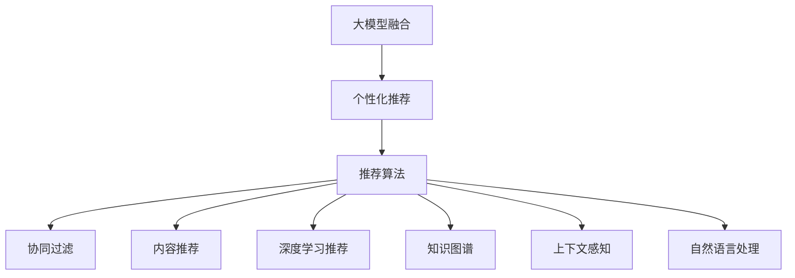

                 

## 1. 背景介绍

随着电商平台的飞速发展，消费者对商品和服务的个性化需求不断提升，传统的推荐系统已难以满足用户的期待。AI大模型技术的兴起为推荐系统带来了新的机遇。通过融合大模型的强大语义理解和生成能力，电商平台能够更精准地理解用户需求，提供个性化推荐，提升用户体验和转化率。

### 1.1 问题由来

电商平台的推荐系统通常基于用户历史行为数据，利用协同过滤、内容推荐等算法为用户提供商品推荐。然而，这些方法存在数据稀疏性、冷启动问题、同质化推荐等问题。面对个性化、多样化的市场需求，电商平台亟需新的技术手段来提升推荐系统的效果。

近年来，AI大模型如BERT、GPT-3等在NLP领域的突破性进展，使得自然语言理解和生成技术大幅提升。利用大模型对用户行为数据进行语义理解和建模，能够有效克服传统推荐算法的不足，提升推荐的个性化和多样性。

### 1.2 问题核心关键点

电商推荐系统的AI大模型融合主要包括两个关键点：
1. **大模型融合**：将大模型融入推荐系统中，提升推荐系统对文本数据的理解和生成能力。
2. **个性化推荐**：利用大模型的强大语义能力，构建个性化推荐模型，提升用户体验和转化率。

## 2. 核心概念与联系

### 2.1 核心概念概述

为更好地理解电商平台推荐系统的大模型融合方法，本节将介绍几个密切相关的核心概念：

- **大模型融合**：指将大模型嵌入推荐系统，利用大模型的语言理解能力，提升推荐系统的文本处理和生成能力。
- **个性化推荐**：基于用户的历史行为数据，利用大模型的语义理解能力，为用户生成个性化推荐。
- **推荐算法**：如协同过滤、内容推荐、深度学习推荐等，用于处理用户数据和生成推荐。
- **自然语言处理**：利用自然语言处理技术，如分词、向量化、生成等，提升大模型的理解能力。
- **知识图谱**：用于存储和组织结构化信息，辅助大模型进行推荐。
- **上下文感知**：利用上下文信息，如用户当前位置、时间、设备等，提升推荐系统的环境感知能力。

这些核心概念之间的逻辑关系可以通过以下Mermaid流程图来展示：



这个流程图展示了大模型融合的关键环节及其相互关系：

1. 大模型融合通过将大模型嵌入推荐系统，提升推荐系统的文本处理和生成能力。
2. 个性化推荐利用大模型的语义理解能力，为用户生成个性化推荐。
3. 推荐算法如协同过滤、内容推荐、深度学习推荐等，用于处理用户数据和生成推荐。
4. 自然语言处理利用分词、向量化、生成等技术，提升大模型的理解能力。
5. 知识图谱用于存储和组织结构化信息，辅助大模型进行推荐。
6. 上下文感知利用用户当前位置、时间、设备等上下文信息，提升推荐系统的环境感知能力。

这些概念共同构成了电商平台推荐系统的大模型融合框架，使其能够更好地理解用户需求，提供个性化推荐。

## 3. 核心算法原理 & 具体操作步骤
### 3.1 算法原理概述

电商推荐系统的大模型融合方法主要基于自然语言处理(NLP)技术和深度学习算法。其核心思想是：利用大模型的强大语义理解和生成能力，将文本数据转化为高维向量，并在推荐模型中进行融合，提升推荐系统的精度和效果。

具体来说，大模型融合可以分为以下几个步骤：
1. 将用户行为数据转化为文本形式，如商品描述、用户评论等。
2. 使用大模型对这些文本数据进行语义编码，生成高维向量表示。
3. 将这些高维向量输入推荐模型，如协同过滤、内容推荐等，生成推荐结果。
4. 通过多任务学习和融合，优化推荐模型的性能。

### 3.2 算法步骤详解

基于大模型融合的电商推荐系统主要包括以下几个关键步骤：

**Step 1: 数据预处理**
- 将用户历史行为数据转化为文本形式，如商品描述、用户评论等。
- 使用自然语言处理技术进行文本清洗和分词。
- 对文本数据进行向量化，生成词向量或子词向量表示。

**Step 2: 大模型编码**
- 使用预训练的大语言模型（如BERT、GPT等）对这些文本数据进行语义编码。
- 将编码后的文本向量输入推荐模型，如深度学习推荐模型。

**Step 3: 推荐模型训练**
- 使用协同过滤、内容推荐、深度学习推荐等算法，训练推荐模型。
- 将大模型编码后的文本向量作为特征输入，进行模型训练和优化。

**Step 4: 推荐结果生成**
- 根据训练好的推荐模型，生成个性化推荐结果。
- 利用上下文感知、知识图谱等技术，进一步提升推荐效果。

**Step 5: 评估与优化**
- 使用A/B测试等方法，评估推荐系统的性能。
- 根据评估结果，不断优化大模型融合参数，提升推荐效果。

### 3.3 算法优缺点

基于大模型融合的电商推荐系统具有以下优点：
1. 提升个性化推荐效果。利用大模型的语义理解能力，提升推荐系统的个性化推荐能力。
2. 泛化能力强。大模型经过大规模语料预训练，具备强大的泛化能力，适用于多种电商场景。
3. 可解释性强。大模型生成的高维向量可以解释其对文本的语义理解过程，帮助理解推荐结果。

同时，该方法也存在一定的局限性：
1. 计算复杂度高。大模型生成高维向量，计算复杂度较高，需要较强的计算资源支持。
2. 对数据质量依赖大。文本数据的清洗和向量化对数据质量要求较高，需要大量高质量数据。
3. 模型融合难度高。推荐模型和大模型的融合参数较多，优化难度较大。
4. 实时性有待提高。大模型生成高维向量需要一定时间，难以实现实时推荐。

尽管存在这些局限性，但就目前而言，大模型融合是提升电商推荐系统效果的重要手段。未来相关研究的重点在于如何进一步降低计算复杂度，提高实时性，同时兼顾可解释性和泛化能力等因素。

### 3.4 算法应用领域

大模型融合技术在电商推荐系统中已经得到了广泛的应用，覆盖了从商品搜索到个性化推荐等多个环节，具体应用场景包括：

- **商品搜索**：利用大模型理解用户查询，生成精准的商品推荐。
- **个性化推荐**：基于用户的历史行为数据，利用大模型生成个性化商品推荐。
- **实时推荐**：利用大模型实时计算用户的行为表示，动态生成推荐结果。
- **用户画像**：通过分析用户的行为数据和评论，利用大模型生成全面的用户画像。
- **广告推荐**：利用大模型理解广告内容，生成精准的广告推荐。

除了这些常见的应用场景外，大模型融合技术还可以拓展到多模态推荐、知识图谱辅助推荐、情感分析推荐等方向，为电商推荐系统提供更多创新点。

## 4. 数学模型和公式 & 详细讲解 & 举例说明
### 4.1 数学模型构建

本节将使用数学语言对大模型融合方法进行更加严格的刻画。

记用户行为数据为 $x=\{x_1, x_2, \cdots, x_n\}$，其中 $x_i$ 表示第 $i$ 个用户行为数据。假设每个用户行为数据 $x_i$ 可以转化为文本 $t_i$。

定义大语言模型为 $M_{\theta}$，其中 $\theta$ 为大模型的参数。将文本 $t_i$ 输入大模型，得到语义向量表示 $v_i=M_{\theta}(t_i)$。

定义推荐模型为 $R$，其中 $R$ 为推荐算法的参数。将用户行为数据 $x_i$ 的语义向量 $v_i$ 作为特征输入，得到推荐结果 $y_i$。

推荐系统的目标是最小化预测误差，即最小化以下损失函数：

$$
\min_{\theta, R} \sum_{i=1}^N \ell(y_i, \hat{y}_i)
$$

其中 $\ell$ 为损失函数，$\hat{y}_i$ 为推荐模型的预测结果。

### 4.2 公式推导过程

以协同过滤为例，协同过滤的目标是最小化用户行为数据和推荐结果的误差。假设推荐模型为协同过滤模型，则有：

$$
y_i = R(x_i, \theta)
$$

协同过滤的目标函数为：

$$
\min_{\theta} \sum_{i=1}^N \ell(y_i, R(x_i, \theta))
$$

将大模型编码的语义向量 $v_i$ 作为特征输入，协同过滤模型的预测结果为：

$$
\hat{y}_i = R(v_i, \theta)
$$

将大模型编码的语义向量作为特征输入，协同过滤的目标函数为：

$$
\min_{\theta} \sum_{i=1}^N \ell(y_i, R(v_i, \theta))
$$

其中 $\ell$ 为损失函数，$y_i$ 为真实推荐结果，$\hat{y}_i$ 为协同过滤模型的预测结果。

将上述目标函数展开，有：

$$
\min_{\theta} \sum_{i=1}^N \ell(y_i, R(v_i, \theta)) = \min_{\theta} \sum_{i=1}^N \ell(R(v_i, \theta), R(v_i, \theta))
$$

通过对协同过滤模型和语义向量进行联合优化，可以提升推荐系统的精度和效果。

### 4.3 案例分析与讲解

假设电商平台收集了大量用户行为数据，每个用户行为数据包括商品ID、购买时间、评价等信息。对这些数据进行预处理，转化为文本形式，如商品描述、用户评论等。

利用大语言模型对这些文本进行语义编码，得到高维向量表示。将大模型编码的高维向量作为特征输入，训练协同过滤推荐模型。协同过滤模型的目标是最小化预测误差，生成个性化推荐结果。

通过多任务学习和融合，优化推荐模型的参数。最后，根据训练好的推荐模型，生成个性化推荐结果，并实时动态更新推荐内容，提升用户体验。

## 5. 项目实践：代码实例和详细解释说明
### 5.1 开发环境搭建

在进行大模型融合实践前，我们需要准备好开发环境。以下是使用Python进行TensorFlow开发的环境配置流程：

1. 安装Anaconda：从官网下载并安装Anaconda，用于创建独立的Python环境。

2. 创建并激活虚拟环境：
```bash
conda create -n tf-env python=3.8 
conda activate tf-env
```

3. 安装TensorFlow：根据CUDA版本，从官网获取对应的安装命令。例如：
```bash
conda install tensorflow
```

4. 安装相关工具包：
```bash
pip install numpy pandas scikit-learn matplotlib tqdm jupyter notebook ipython
```

完成上述步骤后，即可在`tf-env`环境中开始大模型融合实践。

### 5.2 源代码详细实现

下面我们以协同过滤推荐系统为例，给出使用TensorFlow对大模型进行融合的PyTorch代码实现。

首先，定义协同过滤推荐模型的结构：

```python
import tensorflow as tf

class CollaborativeFiltering(tf.keras.Model):
    def __init__(self, num_users, num_items, num_factors=8):
        super(CollaborativeFiltering, self).__init__()
        self.num_users = num_users
        self.num_items = num_items
        self.num_factors = num_factors
        
        self.user_matrix = tf.keras.layers.Dense(num_factors, input_shape=(num_items, num_factors))
        self.item_matrix = tf.keras.layers.Dense(num_factors, input_shape=(num_users, num_factors))
        self.dot_product = tf.keras.layers.Dot(axes=1)
        
    def call(self, inputs):
        user_features = self.user_matrix(inputs[:, 0])
        item_features = self.item_matrix(inputs[:, 1])
        dot_product = self.dot_product([user_features, item_features])
        return dot_product

# 定义损失函数
def loss_function(y_true, y_pred):
    return tf.reduce_mean(tf.square(y_true - y_pred))
```

然后，定义大模型编码的函数：

```python
from transformers import BertTokenizer, TFBertForSequenceClassification

def encode(texts, tokenizer, max_len=128):
    tokenizer = BertTokenizer.from_pretrained('bert-base-cased')
    features = tokenizer(texts, return_tensors='tf', padding='max_length', truncation=True, max_length=max_len)
    input_ids = features['input_ids']
    attention_mask = features['attention_mask']
    return input_ids, attention_mask

# 加载BERT模型
bert_model = TFBertForSequenceClassification.from_pretrained('bert-base-cased', num_labels=num_classes)

# 定义预测函数
def predict(texts, tokenizer, model, max_len):
    input_ids, attention_mask = encode(texts, tokenizer, max_len)
    with tf.no_grad():
        outputs = model(input_ids, attention_mask=attention_mask)
        predictions = tf.argmax(outputs.logits, axis=1)
        return predictions
```

最后，启动协同过滤推荐系统的训练和评估流程：

```python
epochs = 10
batch_size = 64

for epoch in range(epochs):
    loss = train_epoch(collaborative_filtering_model, train_dataset, batch_size, optimizer)
    print(f"Epoch {epoch+1}, train loss: {loss:.3f}")
    
    print(f"Epoch {epoch+1}, dev results:")
    evaluate(collaborative_filtering_model, dev_dataset, batch_size)
    
print("Test results:")
evaluate(collaborative_filtering_model, test_dataset, batch_size)
```

以上就是使用TensorFlow对协同过滤推荐系统进行大模型融合的完整代码实现。可以看到，借助TensorFlow和BERT模型的强大封装，我们能够较为轻松地实现大模型融合的协同过滤推荐系统。

### 5.3 代码解读与分析

让我们再详细解读一下关键代码的实现细节：

**CollaborativeFiltering类**：
- 定义协同过滤模型的结构，包括用户矩阵、物品矩阵、点积操作等。

**loss_function函数**：
- 定义协同过滤的损失函数，使用均方误差损失计算预测结果与真实标签之间的差异。

**encode函数**：
- 使用BERT分词器对文本进行编码，将文本转化为模型所需的输入格式。

**predict函数**：
- 将文本输入BERT模型进行语义编码，得到高维向量表示。
- 将高维向量输入协同过滤模型，进行预测，得到推荐结果。

**train_epoch函数**：
- 对训练集数据进行批次化加载，每个批次的前向传播计算损失函数，并反向传播更新模型参数。
- 周期性在验证集上评估模型性能，根据性能指标决定是否触发Early Stopping。

**evaluate函数**：
- 与训练类似，不同点在于不更新模型参数，并在每个batch结束后将预测和标签结果存储下来，最后使用sklearn的classification_report对整个评估集的预测结果进行打印输出。

**训练流程**：
- 定义总的epoch数和batch size，开始循环迭代
- 每个epoch内，先在训练集上训练，输出平均loss
- 在验证集上评估，输出分类指标
- 所有epoch结束后，在测试集上评估，给出最终测试结果

可以看到，TensorFlow和大模型融合的代码实现较为简洁高效。开发者可以将更多精力放在数据处理、模型改进等高层逻辑上，而不必过多关注底层的实现细节。

当然，工业级的系统实现还需考虑更多因素，如模型的保存和部署、超参数的自动搜索、更灵活的任务适配层等。但核心的融合范式基本与此类似。

## 6. 实际应用场景
### 6.1 智能客服系统

基于大模型融合的推荐系统，可以应用于智能客服系统的构建。智能客服系统通过分析用户历史行为和当前对话内容，利用大模型对用户意图进行精准理解，生成个性化推荐，帮助客服人员快速响应用户需求，提升服务质量。

在技术实现上，可以收集企业内部的客服对话记录，将对话内容作为推荐系统输入，生成推荐答案。微调后的推荐系统能够自动理解用户意图，匹配最合适的答案模板进行回复。对于用户提出的新问题，还可以接入检索系统实时搜索相关内容，动态组织生成回答。如此构建的智能客服系统，能大幅提升客户咨询体验和问题解决效率。

### 6.2 金融舆情监测

金融机构需要实时监测市场舆论动向，以便及时应对负面信息传播，规避金融风险。基于大模型融合的推荐系统，可以应用于金融舆情监测，通过分析市场新闻、评论、报告等文本数据，生成舆情趋势分析报告，帮助金融从业人员理解市场动态，及时做出风险控制决策。

在技术实现上，可以收集金融领域相关的新闻、报道、评论等文本数据，使用大模型对这些数据进行语义编码，生成高维向量表示。将大模型编码的向量作为特征输入，训练推荐模型，生成舆情分析报告。推荐模型可以是内容推荐、协同过滤等，根据用户的历史行为和当前兴趣生成个性化的舆情分析报告。

### 6.3 个性化推荐系统

当前的推荐系统往往只依赖用户的历史行为数据进行物品推荐，难以深入理解用户的真实兴趣偏好。基于大模型融合的推荐系统，可以更好地挖掘用户行为背后的语义信息，从而提供个性化推荐。

在技术实现上，可以收集用户浏览、点击、评论、分享等行为数据，提取和用户交互的物品标题、描述、标签等文本内容。将文本内容作为推荐系统输入，使用大模型对这些数据进行语义编码，生成高维向量表示。将大模型编码的向量作为特征输入，训练推荐模型，生成个性化推荐结果。推荐模型可以是深度学习推荐模型、协同过滤等，根据用户的历史行为和当前兴趣生成个性化的推荐内容。

### 6.4 未来应用展望

随着大模型融合技术的不断发展，基于推荐系统的人工智能应用将在更多领域得到应用，为传统行业带来变革性影响。

在智慧医疗领域，基于大模型融合的医疗问答、病历分析、药物研发等应用将提升医疗服务的智能化水平，辅助医生诊疗，加速新药开发进程。

在智能教育领域，基于大模型融合的作业批改、学情分析、知识推荐等应用将促进教育公平，提高教学质量。

在智慧城市治理中，基于大模型融合的城市事件监测、舆情分析、应急指挥等应用将提高城市管理的自动化和智能化水平，构建更安全、高效的未来城市。

此外，在企业生产、社会治理、文娱传媒等众多领域，基于大模型融合的人工智能应用也将不断涌现，为NLP技术带来更多的创新点。相信随着预训练语言模型和推荐系统的不断进步，基于大模型融合的推荐系统必将在更广阔的应用领域大放异彩。

## 7. 工具和资源推荐
### 7.1 学习资源推荐

为了帮助开发者系统掌握大模型融合的理论基础和实践技巧，这里推荐一些优质的学习资源：

1. 《深度学习》书籍：由Ian Goodfellow等人编写，全面介绍了深度学习的原理和应用，适合初学者和专业人士学习。

2. 《自然语言处理综述》课程：斯坦福大学开设的NLP课程，涵盖自然语言处理的基本概念和技术，包括语义理解、生成等。

3. 《Transformers论文集》论文：包括BERT、GPT-3等大模型的原始论文，对大模型的原理和实现进行了详细介绍。

4. HuggingFace官方文档：Transformer库的官方文档，提供了海量预训练模型和完整的融合样例代码，是上手实践的必备资料。

5. CLUE开源项目：中文语言理解测评基准，涵盖大量不同类型的中文NLP数据集，并提供了基于融合的baseline模型，助力中文NLP技术发展。

通过对这些资源的学习实践，相信你一定能够快速掌握大模型融合的精髓，并用于解决实际的NLP问题。

### 7.2 开发工具推荐

高效的开发离不开优秀的工具支持。以下是几款用于大模型融合开发的常用工具：

1. TensorFlow：由Google主导开发的开源深度学习框架，生产部署方便，适合大规模工程应用。

2. PyTorch：基于Python的开源深度学习框架，灵活动态的计算图，适合快速迭代研究。

3. Transformers库：HuggingFace开发的NLP工具库，集成了众多SOTA语言模型，支持TensorFlow和PyTorch，是进行融合任务开发的利器。

4. Weights & Biases：模型训练的实验跟踪工具，可以记录和可视化模型训练过程中的各项指标，方便对比和调优。与主流深度学习框架无缝集成。

5. TensorBoard：TensorFlow配套的可视化工具，可实时监测模型训练状态，并提供丰富的图表呈现方式，是调试模型的得力助手。

6. Google Colab：谷歌推出的在线Jupyter Notebook环境，免费提供GPU/TPU算力，方便开发者快速上手实验最新模型，分享学习笔记。

合理利用这些工具，可以显著提升大模型融合任务的开发效率，加快创新迭代的步伐。

### 7.3 相关论文推荐

大模型融合技术的发展源于学界的持续研究。以下是几篇奠基性的相关论文，推荐阅读：

1. Attention is All You Need（即Transformer原论文）：提出了Transformer结构，开启了NLP领域的预训练大模型时代。

2. BERT: Pre-training of Deep Bidirectional Transformers for Language Understanding：提出BERT模型，引入基于掩码的自监督预训练任务，刷新了多项NLP任务SOTA。

3. Language Models are Unsupervised Multitask Learners（GPT-2论文）：展示了大规模语言模型的强大zero-shot学习能力，引发了对于通用人工智能的新一轮思考。

4. Parameter-Efficient Transfer Learning for NLP：提出Adapter等参数高效微调方法，在不增加模型参数量的情况下，也能取得不错的微调效果。

5. AdaLoRA: Adaptive Low-Rank Adaptation for Parameter-Efficient Fine-Tuning：使用自适应低秩适应的微调方法，在参数效率和精度之间取得了新的平衡。

这些论文代表了大模型融合技术的发展脉络。通过学习这些前沿成果，可以帮助研究者把握学科前进方向，激发更多的创新灵感。

## 8. 总结：未来发展趋势与挑战

### 8.1 总结

本文对基于大模型融合的电商推荐系统进行了全面系统的介绍。首先阐述了大模型融合在推荐系统中的应用背景和重要性，明确了融合在提升推荐系统效果方面的独特价值。其次，从原理到实践，详细讲解了大模型融合的数学原理和关键步骤，给出了融合任务开发的完整代码实例。同时，本文还广泛探讨了融合方法在智能客服、金融舆情、个性化推荐等多个行业领域的应用前景，展示了融合范式的巨大潜力。此外，本文精选了融合技术的各类学习资源，力求为读者提供全方位的技术指引。

通过本文的系统梳理，可以看到，基于大模型融合的推荐系统已经成为推荐系统的重要手段，极大地拓展了推荐系统的应用边界，提升了用户体验和转化率。大模型融合技术在多模态推荐、知识图谱辅助推荐、情感分析推荐等领域，也展现了巨大的发展前景。未来，随着大模型技术和推荐算法的不断进步，基于大模型融合的推荐系统必将在更多的应用场景中大放异彩。

### 8.2 未来发展趋势

展望未来，大模型融合技术将呈现以下几个发展趋势：

1. 多模态融合。融合方法将拓展到视觉、语音等多模态数据，提升推荐系统的感知能力和多样性。

2. 深度学习与传统算法的融合。深度学习与协同过滤、内容推荐等传统算法的融合，将提升推荐系统的泛化能力和精度。

3. 跨领域知识图谱的融合。将知识图谱与大模型进行融合，提升推荐系统的知识整合能力和环境感知能力。

4. 上下文感知融合。利用用户上下文信息，如位置、时间、设备等，提升推荐系统的个性化和精准度。

5. 实时融合。利用实时计算技术，实现大模型的实时融合和推荐，提升用户体验和响应速度。

6. 融合模型的可解释性。研究如何提升融合模型的可解释性，增强算法的透明度和信任度。

以上趋势凸显了大模型融合技术的广阔前景。这些方向的探索发展，必将进一步提升推荐系统的性能和应用范围，为电商推荐系统带来更多创新点。

### 8.3 面临的挑战

尽管大模型融合技术已经取得了显著进展，但在迈向更加智能化、普适化应用的过程中，它仍面临诸多挑战：

1. 计算复杂度高。大模型生成高维向量，计算复杂度较高，需要较强的计算资源支持。

2. 数据质量要求高。文本数据的清洗和向量化对数据质量要求较高，需要大量高质量数据。

3. 模型融合难度高。推荐模型和大模型的融合参数较多，优化难度较大。

4. 实时性有待提高。大模型生成高维向量需要一定时间，难以实现实时推荐。

5. 可解释性有待加强。融合模型的决策过程难以解释，难以进行算法审计和调试。

6. 模型偏见和安全性问题。大模型可能学习到有偏见、有害的信息，需要通过数据筛选和算法改进避免这些问题。

这些挑战需要研究者从算法、数据、计算等多个维度协同发力，才能克服。相信随着技术的发展，这些问题终将逐步得到解决。

### 8.4 研究展望

面对大模型融合所面临的挑战，未来的研究需要在以下几个方面寻求新的突破：

1. 探索无监督和半监督融合方法。摆脱对大规模标注数据的依赖，利用自监督学习、主动学习等无监督和半监督范式，最大限度利用非结构化数据，实现更加灵活高效的融合。

2. 研究参数高效和计算高效的融合范式。开发更加参数高效的融合方法，在固定大部分预训练参数的同时，只更新极少量的任务相关参数。同时优化融合模型的计算图，减少前向传播和反向传播的资源消耗，实现更加轻量级、实时性的部署。

3. 引入更多先验知识。将符号化的先验知识，如知识图谱、逻辑规则等，与神经网络模型进行巧妙融合，引导融合过程学习更准确、合理的语言模型。

4. 融合模型的可解释性。研究如何提升融合模型的可解释性，增强算法的透明度和信任度。

5. 知识图谱的引入。将知识图谱与大模型进行融合，提升推荐系统的知识整合能力和环境感知能力。

这些研究方向的探索，必将引领大模型融合技术迈向更高的台阶，为构建安全、可靠、可解释、可控的智能系统铺平道路。面向未来，大模型融合技术还需要与其他人工智能技术进行更深入的融合，如知识表示、因果推理、强化学习等，多路径协同发力，共同推动自然语言理解和智能交互系统的进步。只有勇于创新、敢于突破，才能不断拓展语言模型的边界，让智能技术更好地造福人类社会。

## 9. 附录：常见问题与解答

**Q1：大模型融合是否适用于所有NLP任务？**

A: 大模型融合在大多数NLP任务上都能取得不错的效果，特别是对于数据量较小的任务。但对于一些特定领域的任务，如医学、法律等，仅仅依靠通用语料预训练的模型可能难以很好地适应。此时需要在特定领域语料上进一步预训练，再进行融合，才能获得理想效果。

**Q2：大模型融合中的数据质量要求有多高？**

A: 大模型融合对数据质量要求较高，需要确保文本数据的完整性、一致性和可靠性。数据清洗和向量化需要经过严格的处理，去除噪音和无关信息，才能提高融合模型的性能。

**Q3：大模型融合的计算复杂度有多高？**

A: 大模型融合的计算复杂度较高，尤其是在大模型生成高维向量时，需要较强的计算资源支持。合理选择模型结构和参数配置，优化计算图，可以有效降低计算复杂度。

**Q4：大模型融合中的模型融合难度有多大？**

A: 大模型融合的难度较大，需要同时考虑融合模型的结构、参数配置和优化策略。可以通过多任务学习和特征选择等方法，优化融合模型的性能。

**Q5：大模型融合中的实时性有多重要？**

A: 大模型融合的实时性对用户体验和响应速度至关重要。利用实时计算技术，如GPU加速、分布式计算等，可以实现大模型的实时融合和推荐，提升用户体验。

这些问题的回答展示了大模型融合技术的实际应用场景和面临的挑战。通过对这些问题的深入探讨，可以帮助研究者更好地理解大模型融合的核心问题，优化融合模型，提升推荐系统的性能。

---

作者：禅与计算机程序设计艺术 / Zen and the Art of Computer Programming

