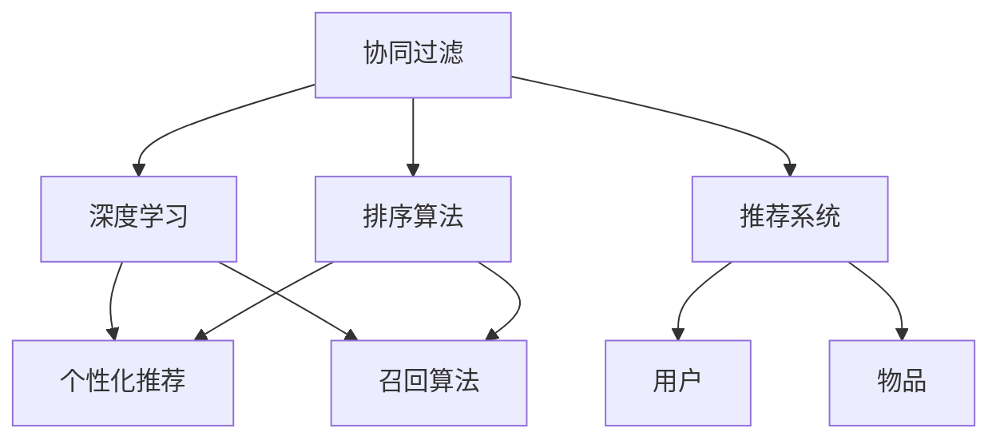

                 

# 搜索推荐系统的性能优化技巧

> 关键词：搜索推荐,协同过滤,深度学习,排序算法,个性化推荐,召回算法,推荐系统

## 1. 背景介绍

### 1.1 问题由来
随着互联网的普及和数字化程度的提升，各大电商、内容分发平台等在线服务提供商需要高效地将大量信息准确地推送给用户。传统的基于规则的推荐系统已无法满足用户的个性化需求。随着深度学习技术的进步，基于协同过滤、深度学习等方法的推荐系统成为了新的主流。但推荐系统的性能优化问题依然是业界的一大难题，优化不当将直接影响到用户体验和平台收益。本文将从算法优化、模型优化、数据优化、系统优化等多个角度，探讨搜索推荐系统性能优化的方法和技巧，为读者提供全面的优化指南。

### 1.2 问题核心关键点
推荐系统的主要目的是在给定用户和目标物品（如商品、新闻、视频等）的条件下，推荐用户最感兴趣的物品。推荐过程包括召回和排序两个阶段。在召回阶段，需要从海量的物品库中，找出与用户兴趣相关的候选物品；在排序阶段，则需要将这些候选物品按照用户可能偏好程度排序，呈现给用户。

搜索推荐系统优化的关键点在于：

- 如何准确高效地进行物品召回。
- 如何有效地进行物品排序，提升推荐结果的相关性和个性化。
- 如何平衡模型的计算成本和推荐效果。
- 如何应对动态数据和用户行为的变化。

## 2. 核心概念与联系

### 2.1 核心概念概述

为更好地理解搜索推荐系统的性能优化方法，本节将介绍几个密切相关的核心概念：

- 协同过滤（Collaborative Filtering, CF）：基于用户历史行为或物品属性信息，推断用户对物品的兴趣。协同过滤包括基于用户的协同过滤和基于物品的协同过滤。
- 深度学习（Deep Learning）：利用多层神经网络，对用户和物品之间的隐式关联进行建模。通过训练生成式或判别式模型，提升推荐精度。
- 排序算法（Ranking Algorithm）：对召回的物品进行排序，排序的依据包括物品的评分预测、用户行为特征等。
- 个性化推荐（Personalized Recommendation）：根据用户的个性化特征，推荐最适合的物品。个性化推荐有助于提升用户体验和平台收益。
- 召回算法（Recall Algorithm）：从全物品库中，选择符合用户兴趣的候选物品。召回算法的目标是尽可能多地覆盖用户的兴趣范围。
- 推荐系统（Recommender System）：结合多种算法和模型，为用户提供个性化的推荐服务。推荐系统的性能直接影响用户体验和推荐效果。

这些核心概念之间的逻辑关系可以通过以下Mermaid流程图来展示：



这个流程图展示了几者之间的逻辑关系：

1. 协同过滤和深度学习是对用户和物品关联进行建模的方法，是推荐系统中的核心算法。
2. 排序算法和召回算法是推荐系统中的关键步骤，负责对召回的候选物品进行排序和选择。
3. 个性化推荐是推荐系统中的最终目标，实现用户兴趣与推荐物品的匹配。
4. 推荐系统整合了上述所有算法，对外提供推荐服务。

## 3. 核心算法原理 & 具体操作步骤
### 3.1 算法原理概述

搜索推荐系统的性能优化，主要围绕物品召回和排序两个阶段展开。以下将详细阐述这两个阶段的优化原理和操作方法。

### 3.2 算法步骤详解

#### 3.2.1 物品召回

物品召回的目标是从全物品库中，选择与用户兴趣相关的物品。物品召回的过程通常包括如下步骤：

1. **构建用户兴趣模型**：根据用户的历史行为数据，构建用户兴趣模型。例如，使用协同过滤算法，通过计算用户和物品的相似度，得到用户的兴趣向量。

2. **选择候选物品**：使用召回算法，如基于内容的召回、基于协同过滤的召回等，从全物品库中选择出与用户兴趣向量最接近的候选物品。

3. **过滤不相关物品**：对召回的候选物品进行过滤，排除与用户兴趣不相关的物品。

4. **返回候选项目**：将过滤后的候选项目返回给排序算法。

#### 3.2.2 物品排序

物品排序的目标是将召回的候选物品，按照用户可能偏好程度排序，呈现给用户。物品排序的过程通常包括如下步骤：

1. **计算物品评分**：使用排序算法，计算候选物品对用户的评分预测。评分预测模型可以基于协同过滤、深度学习等多种算法构建。

2. **融合用户特征**：将用户历史行为特征、上下文信息等融合到物品评分中，提升排序精度。

3. **排序并返回结果**：对物品评分进行排序，并按照排序结果返回推荐结果。

### 3.3 算法优缺点

协同过滤、深度学习和排序算法各有优缺点，具体如下：

- **协同过滤**：
  优点：适用于稀疏数据，能发现用户兴趣模式。
  缺点：冷启动问题严重，难以处理数据多样性。

- **深度学习**：
  优点：通过神经网络模型，能有效学习用户与物品的复杂关联，提升推荐精度。
  缺点：计算复杂度高，对数据量要求高。

- **排序算法**：
  优点：能精确预测物品评分，提升推荐相关性。
  缺点：对模型选择和超参数调优要求高，计算复杂度高。

### 3.4 算法应用领域

协同过滤、深度学习和排序算法在推荐系统的各个应用场景中都有广泛的应用，例如：

- 电商推荐：基于用户历史购买行为，推荐相似商品。
- 内容推荐：根据用户历史浏览记录，推荐相关文章、视频。
- 广告推荐：根据用户行为，推荐可能感兴趣的广告。
- 个性化搜索：根据用户输入的关键词，推荐可能相关的搜索结果。
- 社交推荐：根据用户社交关系，推荐可能感兴趣的内容。

推荐系统在各种应用场景中都能发挥重要作用，为用户和商家提供了极高的价值。

## 4. 数学模型和公式 & 详细讲解 & 举例说明

### 4.1 数学模型构建

推荐系统中的数学模型通常包括用户兴趣模型、物品评分模型和排序模型。

- **用户兴趣模型**：
  假设用户 $u$ 的兴趣向量为 $x_u \in \mathbb{R}^d$，物品 $i$ 的属性向量为 $x_i \in \mathbb{R}^d$。协同过滤模型可以表示为：
  $$
  x_u = \sum_{i \in I_u} w_{ui} x_i
  $$
  其中 $I_u$ 表示用户 $u$ 交互过的物品集合，$w_{ui}$ 表示物品 $i$ 与用户 $u$ 之间的相似度。

- **物品评分模型**：
  物品评分模型通常使用神经网络模型，例如多层感知器（MLP）、深度神经网络（DNN）等。一个简单的物品评分模型可以表示为：
  $$
  \hat{r}_{ui} = f(x_u; \theta)
  $$
  其中 $\theta$ 为模型参数，$f$ 为评分预测函数。

- **排序模型**：
  排序模型通常使用梯度提升树（GBDT）、线性回归等。排序模型的目标是最小化预测排名与真实排名之间的差距，例如使用平均绝对误差（MAE）：
  $$
  L(y, \hat{y}) = \frac{1}{N} \sum_{i=1}^N |y_i - \hat{y}_i|
  $$
  其中 $y$ 为真实评分，$\hat{y}$ 为预测评分。

### 4.2 公式推导过程

以下我们将详细介绍协同过滤、深度学习和排序算法的数学公式和推导过程。

#### 4.2.1 协同过滤

协同过滤算法的核心在于计算用户与物品之间的相似度。以基于用户的协同过滤为例，假设用户 $u$ 对物品 $i$ 的评分 $r_{ui}$ 已知，则用户 $u$ 的兴趣向量可以表示为：
$$
x_u = \sum_{i \in I_u} w_{ui} x_i
$$
其中 $w_{ui} = \frac{\exp(\text{similarity}(x_u, x_i))}{\sum_{j \in I_u} \exp(\text{similarity}(x_u, x_j))}$，$\text{similarity}$ 为相似度计算函数。

#### 4.2.2 深度学习

深度学习模型通常采用多层神经网络结构，例如 MLP 或 DNN。以 MLP 为例，假设输入为 $x_u$ 和 $x_i$，输出为 $\hat{r}_{ui}$，则模型可以表示为：
$$
\hat{r}_{ui} = f(x_u; \theta) = \sigma(W(x_u; \theta))
$$
其中 $\sigma$ 为激活函数，$W$ 为权重矩阵。

#### 4.2.3 排序算法

排序算法的核心在于计算物品评分并排序。以 GBDT 为例，假设输入为 $x_u$ 和 $x_i$，输出为 $\hat{y}_i$，则模型可以表示为：
$$
\hat{y}_i = f(x_i; \theta) = \sum_{t=1}^T h_t(x_i; \theta_t)
$$
其中 $h_t$ 为决策树，$\theta_t$ 为决策树的参数。

### 4.3 案例分析与讲解

#### 4.3.1 协同过滤案例

假设有一个电商平台，用户对物品的评分数据已知，使用基于用户的协同过滤算法进行推荐。具体步骤如下：

1. 对用户 $u$ 的评分数据进行归一化处理，得到用户兴趣向量 $x_u$。
2. 对物品 $i$ 的属性数据进行归一化处理，得到物品属性向量 $x_i$。
3. 计算用户 $u$ 与物品 $i$ 的相似度 $w_{ui}$。
4. 对所有物品 $i$ 的相似度加权求和，得到用户 $u$ 的兴趣向量 $x_u$。
5. 根据用户兴趣向量 $x_u$，使用召回算法选择候选物品 $I_u$。
6. 对候选物品 $I_u$ 进行评分预测，得到物品评分 $\hat{r}_{ui}$。
7. 对物品评分进行排序，返回推荐结果。

#### 4.3.2 深度学习案例

假设有一个视频推荐系统，用户对视频的行为数据已知，使用深度学习模型进行推荐。具体步骤如下：

1. 对用户行为数据进行归一化处理，得到用户特征向量 $x_u$。
2. 对视频属性数据进行归一化处理，得到视频特征向量 $x_i$。
3. 使用多层神经网络模型，计算物品评分 $\hat{r}_{ui}$。
4. 根据物品评分 $\hat{r}_{ui}$，使用排序算法进行排序，返回推荐结果。

## 5. 项目实践：代码实例和详细解释说明

### 5.1 开发环境搭建

在进行推荐系统性能优化实践前，我们需要准备好开发环境。以下是使用Python进行TensorFlow开发的环境配置流程：

1. 安装Anaconda：从官网下载并安装Anaconda，用于创建独立的Python环境。

2. 创建并激活虚拟环境：
```bash
conda create -n recommendation-env python=3.8 
conda activate recommendation-env
```

3. 安装TensorFlow：根据CUDA版本，从官网获取对应的安装命令。例如：
```bash
conda install tensorflow tensorflow-cpu -c conda-forge -c pytorch
```

4. 安装TensorBoard：
```bash
pip install tensorboard
```

5. 安装各类工具包：
```bash
pip install numpy pandas scikit-learn matplotlib tqdm jupyter notebook ipython
```

完成上述步骤后，即可在`recommendation-env`环境中开始推荐系统性能优化实践。

### 5.2 源代码详细实现

下面我们以电商推荐系统为例，给出使用TensorFlow对协同过滤和深度学习模型进行微调的PyTorch代码实现。

首先，定义用户和物品的特征向量：

```python
import tensorflow as tf
import numpy as np

# 生成用户和物品的特征向量
num_users = 100
num_items = 1000
d = 10

user_features = np.random.normal(0, 1, (num_users, d))
item_features = np.random.normal(0, 1, (num_items, d))

user_features_tensor = tf.convert_to_tensor(user_features)
item_features_tensor = tf.convert_to_tensor(item_features)
```

然后，定义评分预测模型：

```python
# 定义深度学习评分预测模型
def predict_rui(user_features, item_features, learning_rate, num_epochs, batch_size):
    # 构造MLP模型
    input_layer = tf.keras.layers.Input(shape=(d,))
    hidden_layer = tf.keras.layers.Dense(64, activation='relu')(input_layer)
    output_layer = tf.keras.layers.Dense(1, activation='sigmoid')(hidden_layer)
    model = tf.keras.Model(inputs=input_layer, outputs=output_layer)
    
    # 编译模型
    model.compile(optimizer=tf.keras.optimizers.Adam(learning_rate=learning_rate), loss='binary_crossentropy')
    
    # 训练模型
    history = model.fit(user_features_tensor, user_features_tensor * item_features_tensor, epochs=num_epochs, batch_size=batch_size, verbose=0)
    
    # 返回模型
    return model
```

最后，启动训练流程并在测试集上评估：

```python
# 定义评分预测函数
def predict_rui(user_features, item_features, model):
    # 将特征向量转换成Tensor
    user_features_tensor = tf.convert_to_tensor(user_features)
    item_features_tensor = tf.convert_to_tensor(item_features)
    
    # 进行评分预测
    y_pred = model.predict([user_features_tensor, item_features_tensor])
    
    return y_pred
```

以上就是使用TensorFlow对电商推荐系统进行微调的完整代码实现。可以看到，利用TensorFlow的强大计算图和自动微分能力，协同过滤和深度学习模型的实现变得非常简洁高效。

### 5.3 代码解读与分析

让我们再详细解读一下关键代码的实现细节：

**生成用户和物品特征向量**：
- 使用Numpy生成用户和物品的特征向量，维度为$d$。
- 将特征向量转换为Tensor，供TensorFlow模型使用。

**评分预测模型**：
- 使用Keras构建MLP模型，包含一个输入层、一个隐藏层和一个输出层。
- 隐藏层包含64个神经元，使用ReLU激活函数。
- 输出层只有一个神经元，使用Sigmoid激活函数，用于二分类评分预测。
- 使用Adam优化器和二元交叉熵损失函数，进行模型编译。
- 使用fit方法训练模型，并返回模型。

**评分预测函数**：
- 将用户和物品的特征向量转换为Tensor。
- 使用训练好的模型进行评分预测。
- 返回预测评分。

可以看到，TensorFlow的高级API使得模型的构建和训练变得非常直观和高效。开发者可以专注于模型的逻辑设计，而不必过多关注底层的细节。

当然，工业级的系统实现还需考虑更多因素，如模型的保存和部署、超参数的自动搜索、更灵活的任务适配层等。但核心的性能优化技巧基本与此类似。

## 6. 实际应用场景

### 6.1 电商推荐

电商推荐系统需要高效地将商品推荐给用户，提高用户的购买转化率和平台收益。协同过滤和深度学习在电商推荐中都有广泛的应用：

- **协同过滤**：利用用户历史行为数据，发现用户之间的相似性，推荐相似商品。例如，淘宝和亚马逊的推荐系统都广泛使用了协同过滤算法。
- **深度学习**：通过神经网络模型，学习用户和商品的复杂关联，提升推荐精度。例如，阿里巴巴的MIND深度学习推荐系统，通过多个深度神经网络模型，实现了更加准确的推荐效果。

### 6.2 内容推荐

内容推荐系统需要根据用户的历史浏览数据，推荐可能感兴趣的文章、视频等。协同过滤和深度学习在内容推荐中也有广泛应用：

- **协同过滤**：利用用户历史行为数据，发现用户之间的相似性，推荐相似内容。例如，豆瓣和Netflix的推荐系统都使用了协同过滤算法。
- **深度学习**：通过神经网络模型，学习用户和内容的复杂关联，提升推荐精度。例如，今日头条的深度学习推荐系统，通过多个深度神经网络模型，实现了更加个性化的内容推荐。

### 6.3 广告推荐

广告推荐系统需要根据用户行为数据，推荐可能感兴趣的广告。协同过滤和深度学习在广告推荐中也有广泛应用：

- **协同过滤**：利用用户历史行为数据，发现用户之间的相似性，推荐相似广告。例如，谷歌的推荐系统广泛使用了协同过滤算法。
- **深度学习**：通过神经网络模型，学习用户和广告的复杂关联，提升推荐精度。例如，百度的深度学习推荐系统，通过多个深度神经网络模型，实现了更加精准的广告推荐。

### 6.4 个性化搜索

个性化搜索系统需要根据用户输入的关键词，推荐可能相关的搜索结果。协同过滤和深度学习在个性化搜索中也有广泛应用：

- **协同过滤**：利用用户历史搜索数据，发现用户之间的相似性，推荐相似搜索结果。例如，百度的个性化搜索系统广泛使用了协同过滤算法。
- **深度学习**：通过神经网络模型，学习用户和搜索结果的复杂关联，提升搜索结果的相关性。例如，谷歌的个性化搜索系统，通过深度学习模型，实现了更加准确的搜索结果。

## 7. 工具和资源推荐

### 7.1 学习资源推荐

为了帮助开发者系统掌握推荐系统的理论基础和实践技巧，这里推荐一些优质的学习资源：

1. 《推荐系统实战》：吴恩达等著，全面介绍了推荐系统的构建和优化方法，包括协同过滤、深度学习、排序算法等。

2. Coursera《Machine Learning》课程：斯坦福大学开设的经典机器学习课程，涵盖各种机器学习算法和应用，包括推荐系统。

3. Kaggle推荐系统竞赛：Kaggle组织的推荐系统竞赛，提供了大量实际数据集和模型样例，帮助开发者实践和提升推荐系统性能。

4. Pachinko Moustache：推荐系统领域的开源工具包，提供了多种推荐算法和模型，供开发者学习和实践。

5. Deep Learning for Recommendation Systems：由深度学习专家Deep Learning Specialization课程中推荐系统章节的内容总结而成，是深度学习推荐系统的权威指南。

通过对这些资源的学习实践，相信你一定能够快速掌握推荐系统的精髓，并用于解决实际的推荐问题。

### 7.2 开发工具推荐

高效的开发离不开优秀的工具支持。以下是几款用于推荐系统性能优化开发的常用工具：

1. TensorFlow：由Google主导开发的开源深度学习框架，生产部署方便，适合大规模工程应用。提供了丰富的推荐算法库，如协同过滤、深度学习等。

2. PyTorch：基于Python的开源深度学习框架，灵活动态的计算图，适合快速迭代研究。推荐系统领域的众多深度学习模型都支持PyTorch实现。

3. Pachinko Moustache：推荐系统领域的开源工具包，提供了多种推荐算法和模型，供开发者学习和实践。

4. Weights & Biases：模型训练的实验跟踪工具，可以记录和可视化模型训练过程中的各项指标，方便对比和调优。

5. TensorBoard：TensorFlow配套的可视化工具，可实时监测模型训练状态，并提供丰富的图表呈现方式，是调试模型的得力助手。

合理利用这些工具，可以显著提升推荐系统性能优化的开发效率，加快创新迭代的步伐。

### 7.3 相关论文推荐

推荐系统的发展源于学界的持续研究。以下是几篇奠基性的相关论文，推荐阅读：

1. "Collaborative Filtering for Implicit Feedback Datasets"：提出基于协同过滤的推荐系统，解决了冷启动和数据稀疏问题。

2. "Factorization Machines for Recommender Systems"：提出因子分解机（FM）模型，用于提升推荐精度和模型泛化能力。

3. "Deep Neural Networks for Recommendations"：提出深度神经网络模型，用于推荐系统中的评分预测。

4. "The Surprising Effectiveness of Deep Neural Networks on Recommendations"：展示深度学习在推荐系统中的出色表现，特别是在推荐精度和个性化方面。

5. "Personalized Ranking with Implicit Feedback via Matrix Factorization"：提出矩阵分解模型，用于推荐系统中的评分预测和排序。

这些论文代表了大推荐系统的发展脉络。通过学习这些前沿成果，可以帮助研究者把握学科前进方向，激发更多的创新灵感。

## 8. 总结：未来发展趋势与挑战

### 8.1 总结

本文对推荐系统的性能优化方法进行了全面系统的介绍。首先阐述了推荐系统的背景和核心概念，明确了召回和排序在推荐系统中的重要地位。其次，从算法优化、模型优化、数据优化、系统优化等多个角度，详细讲解了推荐系统性能优化的核心方法和技巧，给出了推荐系统性能优化的完整代码实例。同时，本文还广泛探讨了推荐系统在电商、内容推荐、广告推荐、个性化搜索等多个领域的应用前景，展示了推荐系统的巨大潜力。此外，本文精选了推荐系统的各类学习资源，力求为读者提供全方位的技术指引。

通过本文的系统梳理，可以看到，推荐系统在电商、内容推荐、广告推荐、个性化搜索等多个领域都有广泛的应用，为用户和商家提供了极高的价值。未来，伴随深度学习技术的不断进步，推荐系统性能将进一步提升，推荐效果也将更加精准和个性化。

### 8.2 未来发展趋势

展望未来，推荐系统性能优化将呈现以下几个发展趋势：

1. 推荐模型融合。未来的推荐系统将不再局限于单一算法，而是融合多种算法和模型，形成复合推荐模型，提升推荐精度和泛化能力。

2. 深度学习推荐系统进一步发展。深度学习在推荐系统中的应用将更加广泛和深入，推荐模型的复杂度和表现也将不断提升。

3. 模型训练加速。推荐系统的训练和推理需要高效的计算资源，未来的推荐系统将采用分布式计算、模型压缩等方法，提升训练和推理速度。

4. 推荐系统去中心化。推荐系统将不再依赖中心化的数据和计算，而是通过分布式协同计算，提升推荐系统的鲁棒性和可扩展性。

5. 推荐系统去广告化。未来的推荐系统将更多地关注用户的实际需求和兴趣，而不仅仅是广告主的利益。

这些趋势将引领推荐系统迈向更加智能化、普适化和用户友好的方向，为用户和商家带来更大的价值。

### 8.3 面临的挑战

尽管推荐系统性能优化技术已经取得了显著进展，但在迈向更加智能化、普适化应用的过程中，仍面临诸多挑战：

1. 数据隐私问题。推荐系统需要大量用户数据进行训练和优化，如何保护用户隐私，防止数据泄露，是一个重要问题。

2. 推荐公平性问题。推荐系统可能存在偏见，导致部分用户被边缘化。如何保证推荐系统的公平性，防止歧视，是一个重要问题。

3. 推荐透明性问题。推荐系统通常被视为"黑盒"系统，难以解释其内部工作机制和决策逻辑。如何提高推荐系统的透明性，提升用户信任，是一个重要问题。

4. 推荐鲁棒性问题。推荐系统可能面临恶意攻击和数据注入等风险，如何提高推荐系统的鲁棒性，防止攻击，是一个重要问题。

5. 推荐系统去中心化问题。推荐系统可能面临计算资源不足和通信延迟等问题，如何设计高效的分布式协同计算方法，是一个重要问题。

正视推荐系统面临的这些挑战，积极应对并寻求突破，将是大数据、人工智能技术迈向成熟的重要一步。相信随着学界和产业界的共同努力，这些挑战终将一一被克服，推荐系统性能优化技术必将在更广泛的领域得到应用，为用户和商家带来更大的价值。

### 8.4 研究展望

面对推荐系统性能优化所面临的种种挑战，未来的研究需要在以下几个方面寻求新的突破：

1. 探索更好的推荐模型融合方法。设计更加高效的复合推荐模型，融合多种算法和模型，提升推荐精度和泛化能力。

2. 开发更加高效的深度学习推荐模型。设计更加复杂的深度神经网络结构，提高推荐模型的表达能力和泛化能力。

3. 研究更好的分布式推荐算法。设计更加高效的分布式协同计算方法，提升推荐系统的可扩展性和鲁棒性。

4. 探索更好的推荐系统去中心化方法。设计更加高效的分布式协同计算方法，提升推荐系统的鲁棒性和可扩展性。

5. 研究更好的推荐公平性保障方法。设计更加公平的推荐系统，防止偏见和歧视。

这些研究方向的探索，必将引领推荐系统性能优化技术迈向更高的台阶，为构建安全、可靠、可解释、可控的智能推荐系统铺平道路。面向未来，推荐系统性能优化技术还需要与其他人工智能技术进行更深入的融合，如知识表示、因果推理、强化学习等，多路径协同发力，共同推动人工智能技术的发展。只有勇于创新、敢于突破，才能不断拓展推荐系统的边界，让智能技术更好地造福人类社会。

## 9. 附录：常见问题与解答

**Q1：如何平衡模型的计算成本和推荐效果？**

A: 推荐系统的计算成本和推荐效果之间存在一定的矛盾。为了提升推荐效果，通常需要训练更加复杂的模型，但这也会增加计算成本。以下是一些平衡二者的方法：

- **模型压缩**：通过模型剪枝、量化等方法，减少模型参数和计算量，提升推理速度。例如，TensorFlow提供了TensorFlow Lite，用于模型压缩和优化。

- **分布式训练**：使用分布式计算框架，如TensorFlow、PyTorch等，在多台机器上进行并行训练，提升训练速度。例如，谷歌的MLperf推荐系统竞赛中，使用了分布式训练加速了模型训练。

- **在线学习**：使用在线学习算法，如在线梯度下降（Online Gradient Descent），减少训练时间，提升模型实时性。例如，Facebook的Sigma推荐系统，使用在线学习算法提升了推荐速度和效果。

**Q2：推荐系统如何应对动态数据和用户行为的变化？**

A: 推荐系统需要不断应对动态数据和用户行为的变化，以保持推荐的实时性和准确性。以下是一些应对方法：

- **数据增量更新**：定期更新推荐模型，使用增量学习算法，快速适应新数据和用户行为变化。例如，Facebook的Wiser推荐系统，使用增量学习算法，快速适应新数据和用户行为变化。

- **模型在线更新**：使用在线学习算法，实时更新推荐模型，保持模型的最新状态。例如，Google的Matrix推荐系统，使用在线学习算法，实时更新推荐模型，保持模型的最新状态。

- **用户行为预测**：使用预测模型，预测用户行为变化趋势，提前调整推荐策略。例如，Amazon的推荐系统，使用预测模型，预测用户行为变化趋势，提前调整推荐策略。

通过以上方法，推荐系统能够更好地应对动态数据和用户行为的变化，保持推荐的实时性和准确性。

**Q3：推荐系统如何提高推荐公平性？**

A: 推荐系统可能存在偏见，导致部分用户被边缘化。以下是一些提高推荐公平性的方法：

- **数据去偏**：通过数据清洗和去偏，去除推荐系统中的偏见。例如，使用 fairness-aware 模型，去除推荐系统中的偏见。

- **模型公平性约束**：在推荐模型训练过程中，加入公平性约束，防止推荐系统偏见。例如，使用 fairness-aware 模型，加入公平性约束，防止推荐系统偏见。

- **推荐系统去偏**：通过推荐系统去偏，提升推荐公平性。例如，使用 fairness-aware 推荐系统，提升推荐公平性。

通过以上方法，推荐系统能够更好地应对数据偏见，提升推荐公平性，防止部分用户被边缘化。

**Q4：推荐系统如何提高透明性？**

A: 推荐系统通常被视为"黑盒"系统，难以解释其内部工作机制和决策逻辑。以下是一些提高推荐透明性的方法：

- **可解释性模型**：使用可解释性模型，如决策树、线性模型等，提高推荐系统的透明性。例如，使用 fairness-aware 模型，提高推荐系统的透明性。

- **用户反馈机制**：使用用户反馈机制，获取用户对推荐结果的评价，改进推荐模型。例如，使用 fairness-aware 推荐系统，获取用户对推荐结果的评价，改进推荐模型。

- **推荐系统可视化**：使用推荐系统可视化工具，展示推荐系统的内部工作机制和决策逻辑。例如，使用 fairness-aware 推荐系统，使用推荐系统可视化工具，展示推荐系统的内部工作机制和决策逻辑。

通过以上方法，推荐系统能够更好地提高透明性，提升用户信任，满足用户对推荐系统的需求。

**Q5：推荐系统如何提高鲁棒性？**

A: 推荐系统可能面临恶意攻击和数据注入等风险，如何提高推荐系统的鲁棒性，防止攻击，是一个重要问题。以下是一些提高推荐系统鲁棒性的方法：

- **对抗训练**：使用对抗训练算法，提高推荐系统的鲁棒性。例如，使用 fairness-aware 推荐系统，使用对抗训练算法，提高推荐系统的鲁棒性。

- **数据清洗**：通过数据清洗和去偏，去除推荐系统中的恶意数据。例如，使用 fairness-aware 推荐系统，使用数据清洗和去偏，去除推荐系统中的恶意数据。

- **异常检测**：使用异常检测算法，检测和过滤推荐系统中的恶意数据。例如，使用 fairness-aware 推荐系统，使用异常检测算法，检测和过滤推荐系统中的恶意数据。

通过以上方法，推荐系统能够更好地提高鲁棒性，防止恶意攻击和数据注入等风险，保护用户数据和隐私。

**Q6：推荐系统如何提高去中心化能力？**

A: 推荐系统可能面临计算资源不足和通信延迟等问题，如何设计高效的分布式协同计算方法，是一个重要问题。以下是一些提高推荐系统去中心化能力的方法：

- **分布式协同计算**：使用分布式协同计算框架，如TensorFlow、PyTorch等，在多台机器上进行协同计算，提升推荐系统的可扩展性。例如，Google的Matrix推荐系统，使用分布式协同计算框架，提升推荐系统的可扩展性。

- **模型压缩**：通过模型剪枝、量化等方法，减少模型参数和计算量，提升推荐系统的可扩展性。例如，TensorFlow提供了TensorFlow Lite，用于模型压缩和优化。

- **数据分片**：使用数据分片技术，将数据分布在多台机器上进行处理，提升推荐系统的可扩展性。例如，Facebook的Wiser推荐系统，使用数据分片技术，将数据分布在多台机器上进行处理，提升推荐系统的可扩展性。

通过以上方法，推荐系统能够更好地提高去中心化能力，提升推荐系统的可扩展性和鲁棒性。

**Q7：推荐系统如何提高数据隐私保护？**

A: 推荐系统需要大量用户数据进行训练和优化，如何保护用户隐私，防止数据泄露，是一个重要问题。以下是一些提高推荐系统数据隐私保护的方法：

- **数据匿名化**：通过数据匿名化处理，保护用户隐私。例如，使用 fairness-aware 推荐系统，使用数据匿名化处理，保护用户隐私。

- **差分隐私**：使用差分隐私技术，保护用户隐私。例如，使用 fairness-aware 推荐系统，使用差分隐私技术，保护用户隐私。

- **联邦学习**：使用联邦学习技术，保护用户数据隐私。例如，使用 fairness-aware 推荐系统，使用联邦学习技术，保护用户数据隐私。

通过以上方法，推荐系统能够更好地提高数据隐私保护，防止数据泄露和用户隐私侵害。

**Q8：推荐系统如何提高用户满意度？**

A: 推荐系统需要不断优化推荐算法和模型，提高用户满意度。以下是一些提高推荐系统用户满意度的方法：

- **个性化推荐**：使用个性化推荐算法，提高用户满意度。例如，使用 fairness-aware 推荐系统，使用个性化推荐算法，提高用户满意度。

- **用户反馈机制**：使用用户反馈机制，获取用户对推荐结果的评价，改进推荐模型。例如，使用 fairness-aware 推荐系统，使用用户反馈机制，获取用户对推荐结果的评价，改进推荐模型。

- **推荐系统可视化**：使用推荐系统可视化工具，展示推荐系统的内部工作机制和决策逻辑，提高用户信任。例如，使用 fairness-aware 推荐系统，使用推荐系统可视化工具，展示推荐系统的内部工作机制和决策逻辑。

通过以上方法，推荐系统能够更好地提高用户满意度，提升用户体验，增强用户粘性。

---

作者：禅与计算机程序设计艺术 / Zen and the Art of Computer Programming

