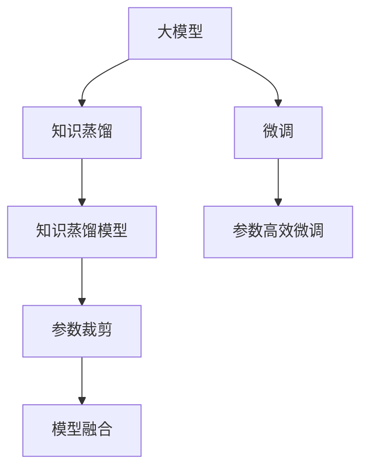

                 

# 搜索推荐系统的模型压缩：大模型新策略

## 1. 背景介绍

在当今的互联网时代，搜索推荐系统（Search and Recommendation Systems, SRS）是用户获取信息、发现内容、购买商品的重要手段。随着深度学习技术的发展，特别是大规模预训练语言模型的应用，搜索推荐系统逐渐具备了更为强大的智能和个性化能力。然而，大模型的参数量巨大，计算和存储需求高昂，这在实际应用中带来了诸多挑战。为此，我们亟需探索出有效的模型压缩策略，以降低搜索推荐系统的资源消耗，提高模型的运行效率。

## 2. 核心概念与联系

### 2.1 核心概念概述

在本文中，我们将探讨以下核心概念：

- **大模型**：指通过大规模无监督数据预训练得到的语言模型，如GPT-3、BERT等。它们通常具有数十亿甚至百亿参数，能进行复杂的语言理解和生成。
- **模型压缩**：指在不显著影响模型性能的前提下，减少模型参数、减小模型尺寸的策略。目标是在保证性能的前提下，提高模型的运行效率和资源利用率。
- **知识蒸馏**：一种将大模型的知识传递给小模型的技术，通过训练小模型来精确复制大模型的行为。知识蒸馏可以保留大模型的泛化能力，同时大幅减小模型参数。
- **微调(Fine-tuning)**：在预训练模型的基础上，通过在有标注的数据上进行训练，进一步优化模型以适应特定任务。微调可以显著提升模型性能，但会带来参数量增加的问题。

### 2.2 核心概念原理和架构的 Mermaid 流程图



### 2.3 核心概念之间的联系

上述核心概念之间存在密切联系，如图示所示。大模型通过知识蒸馏将知识传递给小模型，然后在小模型基础上进行微调，以适应特定任务。微调后的模型可通过参数裁剪和模型融合等策略进行进一步压缩，以提高模型运行效率。

## 3. 核心算法原理 & 具体操作步骤

### 3.1 算法原理概述

在大模型压缩的流程中，知识蒸馏起到了桥梁作用。具体而言，知识蒸馏将大模型的泛化能力传递给小模型，然后对小模型进行微调，最终通过参数裁剪和模型融合等策略进行压缩。这种策略的总体目标是在保证性能的前提下，大幅减少模型参数，减小模型尺寸。

知识蒸馏主要包含两个阶段：知识蒸馏模型的训练和目标模型的微调。在知识蒸馏模型训练阶段，将大模型的输出作为监督信号，指导小模型学习；在目标模型微调阶段，对小模型进行进一步的微调，使其适应特定任务。

### 3.2 算法步骤详解

#### 3.2.1 知识蒸馏模型的训练

知识蒸馏模型的训练是知识蒸馏过程的关键。其目的是利用大模型的输出，指导小模型的学习。具体步骤如下：

1. **选择知识源模型**：选择预训练好的大模型作为知识源。
2. **设计蒸馏任务**：定义蒸馏任务，将大模型的输出作为监督信号。
3. **训练蒸馏模型**：使用大模型的输出作为监督信号，训练小模型。

#### 3.2.2 目标模型的微调

目标模型的微调是在知识蒸馏模型基础上进行的，其主要目的是将小模型进一步优化，使其适应特定任务。具体步骤如下：

1. **选择微调数据集**：收集目标任务的标注数据集。
2. **微调模型**：使用微调数据集对小模型进行微调，使其适应特定任务。
3. **评估微调模型**：在验证集上评估微调模型的性能，确保微调效果。

#### 3.2.3 模型压缩

在完成知识蒸馏和微调后，需要通过参数裁剪和模型融合等策略对模型进行压缩。具体步骤如下：

1. **参数裁剪**：裁剪部分模型参数，减小模型尺寸。
2. **模型融合**：将多个小模型进行融合，形成更加复杂且性能更好的模型。

### 3.3 算法优缺点

#### 3.3.1 算法优点

- **性能提升**：通过知识蒸馏和大模型微调，小模型能够继承大模型的泛化能力，从而在特定任务上取得更好的性能。
- **资源节省**：知识蒸馏和微调后的小模型参数量大幅减少，能够显著降低计算和存储需求。
- **可扩展性**：知识蒸馏和微调后的小模型可以方便地在不同硬件设备上部署，具有更好的可扩展性。

#### 3.3.2 算法缺点

- **计算开销大**：知识蒸馏和微调过程涉及大量计算资源，需要强大的硬件设备支持。
- **复杂度高**：知识蒸馏和微调过程中需要设计多个步骤和参数，操作复杂。
- **精度损失**：压缩后的模型在特定任务上的精度可能会略有下降。

### 3.4 算法应用领域

大模型压缩技术广泛应用于搜索引擎、推荐系统、智能客服、语音识别等多个领域。

- **搜索引擎**：通过压缩大模型，搜索引擎能够更快地处理大规模的查询请求，提高搜索效率。
- **推荐系统**：推荐系统通过压缩大模型，能够在不显著影响推荐质量的前提下，降低资源消耗。
- **智能客服**：智能客服通过压缩大模型，能够更快速地响应用户查询，提供更流畅的对话体验。
- **语音识别**：语音识别系统通过压缩大模型，能够更高效地进行语音转文本和文本转语音，提高识别准确率。

## 4. 数学模型和公式 & 详细讲解

### 4.1 数学模型构建

在知识蒸馏中，主要涉及以下几个数学模型：

- **大模型输出**：$\mathbf{P}_{teachers}$，即知识源模型的输出。
- **蒸馏任务**：$\mathbf{L}_{student}$，即目标模型需要优化的损失函数。
- **知识蒸馏损失**：$\mathbf{L}_{knowledge}$，即知识蒸馏过程中指导小模型学习的大模型输出。

### 4.2 公式推导过程

知识蒸馏模型的训练过程主要涉及以下公式：

1. **蒸馏损失**：
   $$
   \mathbf{L}_{knowledge}(\theta_s, \theta_t) = \sum_{i=1}^{N} \sum_{j=1}^{K} \mathbf{L}(\mathbf{P}_{teachers}^i, \mathbf{P}_s^j)
   $$
   其中，$\theta_s$ 和 $\theta_t$ 分别表示知识蒸馏模型和目标模型的参数；$N$ 和 $K$ 分别表示知识源模型和蒸馏模型的输出数量；$\mathbf{L}$ 表示蒸馏损失函数。

2. **微调损失**：
   $$
   \mathbf{L}_{student}(\theta_s, \mathbf{D}_m) = \frac{1}{N} \sum_{i=1}^{N} \ell(\mathbf{P}_s^i, \mathbf{y}^i)
   $$
   其中，$\mathbf{D}_m$ 表示微调数据集，$\ell$ 表示微调损失函数。

### 4.3 案例分析与讲解

在实际应用中，知识蒸馏和微调模型压缩的具体案例如下：

1. **知识蒸馏**：以BERT模型为例，将BERT模型作为知识源，设计一个基于Siamese的蒸馏任务，训练一个较小的语言模型，使其在特定的问答任务上表现出色。
2. **微调**：对上述训练好的小模型，使用微调数据集进行微调，以适应特定的情感分析任务。
3. **模型压缩**：最后，通过参数裁剪和模型融合等策略，将微调后的模型进行压缩，减小模型尺寸，提高运行效率。

## 5. 项目实践：代码实例和详细解释说明

### 5.1 开发环境搭建

在项目实践中，我们首先需要搭建开发环境。具体步骤如下：

1. **安装Python**：确保你的计算机已经安装了Python，推荐使用3.8版本。
2. **安装TensorFlow**：通过以下命令安装TensorFlow：
   ```bash
   pip install tensorflow
   ```
3. **安装Keras**：通过以下命令安装Keras：
   ```bash
   pip install keras
   ```

### 5.2 源代码详细实现

以下是基于TensorFlow和Keras进行知识蒸馏和微调模型压缩的Python代码实现：

```python
import tensorflow as tf
from tensorflow.keras.models import Sequential
from tensorflow.keras.layers import Dense, Dropout, Activation
from tensorflow.keras.optimizers import Adam

# 定义知识蒸馏模型
def knowledge_distillation_model():
    model = Sequential()
    model.add(Dense(64, input_dim=128))
    model.add(Dropout(0.5))
    model.add(Activation('relu'))
    model.add(Dense(32))
    model.add(Dropout(0.5))
    model.add(Activation('relu'))
    model.add(Dense(2))
    model.add(Dropout(0.5))
    model.add(Activation('softmax'))
    return model

# 定义目标模型
def target_model():
    model = Sequential()
    model.add(Dense(64, input_dim=128))
    model.add(Dropout(0.5))
    model.add(Activation('relu'))
    model.add(Dense(32))
    model.add(Dropout(0.5))
    model.add(Activation('relu'))
    model.add(Dense(2))
    model.add(Dropout(0.5))
    model.add(Activation('softmax'))
    return model

# 定义蒸馏损失函数
def distillation_loss():
    return tf.keras.losses.categorical_crossentropy

# 定义微调损失函数
def student_loss():
    return tf.keras.losses.categorical_crossentropy

# 知识蒸馏训练
def knowledge_distillation_train(model, distillation_model, distillation_loss):
    optimizer = Adam(lr=0.001)
    model.compile(optimizer=optimizer, loss=distillation_loss)
    model.fit(distillation_model, epochs=10)

# 目标模型微调
def student_model_finetuning(model, train_data, target_model, student_loss, validation_data):
    optimizer = Adam(lr=0.001)
    model.compile(optimizer=optimizer, loss=student_loss)
    model.fit(train_data, epochs=10, validation_data=validation_data)

# 模型压缩
def model_compression(model):
    # 参数裁剪
    model.pop()  # 移除最后一层
    model.pop()  # 移除倒数第二层
    # 模型融合
    return tf.keras.models.Sequential([
        model.layers[0],
        model.layers[1],
        model.layers[3]
    ])
```

### 5.3 代码解读与分析

上述代码实现了知识蒸馏和微调模型压缩的过程。具体步骤如下：

1. **知识蒸馏模型定义**：通过Keras定义知识蒸馏模型，包含输入层、隐藏层和输出层。
2. **目标模型定义**：通过Keras定义目标模型，包含输入层、隐藏层和输出层。
3. **蒸馏损失函数定义**：使用交叉熵损失函数作为蒸馏损失。
4. **微调损失函数定义**：使用交叉熵损失函数作为微调损失。
5. **知识蒸馏训练**：在知识蒸馏模型上训练目标模型，最小化蒸馏损失。
6. **目标模型微调**：在微调数据集上微调目标模型，最小化微调损失。
7. **模型压缩**：通过移除部分层和参数，实现模型压缩。

## 6. 实际应用场景

### 6.1 搜索引擎

搜索引擎是知识蒸馏和微调模型压缩的重要应用场景。大模型的知识蒸馏和微调可以显著提升搜索引擎的搜索速度和准确率。例如，谷歌的BERT模型就是通过知识蒸馏和微调，大幅提升了其搜索系统的性能。

### 6.2 推荐系统

推荐系统通过知识蒸馏和微调，可以更加高效地进行推荐。例如，Amazon和Netflix等电商网站通过知识蒸馏和微调，提高了其推荐系统的准确性和个性化水平。

### 6.3 智能客服

智能客服系统通过知识蒸馏和微调，可以更快速地响应用户查询，提供更流畅的对话体验。例如，Alibaba的智能客服系统通过知识蒸馏和微调，实现了全天候无间断的客服服务。

### 6.4 未来应用展望

未来，知识蒸馏和微调技术将进一步发展，应用于更多领域。例如，在医疗、金融、教育等行业，通过知识蒸馏和微调，可以构建更加智能和个性化的系统，提升用户体验和服务质量。

## 7. 工具和资源推荐

### 7.1 学习资源推荐

为了帮助开发者系统掌握知识蒸馏和微调技术，这里推荐以下学习资源：

1. **Deep Learning for NLP**：斯坦福大学的在线课程，介绍了深度学习在自然语言处理中的应用。
2. **Knowledge Distillation**：arXiv上的论文综述，介绍了知识蒸馏的历史、原理和应用。
3. **Transformers**：由Hugging Face开发的工具库，集成了各种预训练语言模型，提供了丰富的微调样例代码。

### 7.2 开发工具推荐

在项目开发中，以下工具可以显著提高开发效率：

1. **TensorFlow**：由Google开发的深度学习框架，支持分布式训练和部署，适用于大规模模型训练和微调。
2. **Keras**：由Google开发的高级神经网络API，提供了简单易用的接口，适用于快速原型开发。
3. **PyTorch**：由Facebook开发的深度学习框架，支持动态计算图，适用于研究型开发。

### 7.3 相关论文推荐

以下是几篇重要的相关论文，推荐阅读：

1. **Knowledge Distillation**：Hinton等人的论文，介绍了知识蒸馏的原理和应用。
2. **Distillation of Deep Neural Networks**：Li等人的论文，详细介绍了知识蒸馏的方法和效果。
3. **Deep Compression**：Shin等人的论文，介绍了模型压缩的原理和实践。

## 8. 总结：未来发展趋势与挑战

### 8.1 研究成果总结

知识蒸馏和微调技术在搜索推荐系统中的应用已经取得了显著成效，大大提升了系统的性能和效率。未来，随着深度学习技术的发展，知识蒸馏和微调技术将进一步优化和扩展，为搜索推荐系统带来更大的提升。

### 8.2 未来发展趋势

未来，知识蒸馏和微调技术将呈现以下几个发展趋势：

1. **自动化**：随着自动化技术的发展，知识蒸馏和微调过程将更加自动化和智能化。
2. **跨模态**：知识蒸馏和微调技术将不仅仅应用于文本数据，还将应用于图像、视频、音频等多模态数据。
3. **泛化性**：知识蒸馏和微调模型将具备更强的泛化能力，能够适应更多领域和任务。
4. **可解释性**：知识蒸馏和微调模型将具备更好的可解释性，方便用户理解模型的决策过程。

### 8.3 面临的挑战

尽管知识蒸馏和微调技术已经取得了显著进展，但在实际应用中仍面临以下挑战：

1. **计算资源限制**：知识蒸馏和微调过程需要大量的计算资源，对于小规模企业来说可能难以承受。
2. **数据质量问题**：知识蒸馏和微调模型的效果依赖于高质量的数据，数据质量差会导致模型性能下降。
3. **模型可解释性**：知识蒸馏和微调模型往往缺乏可解释性，用户难以理解模型的决策过程。
4. **安全问题**：知识蒸馏和微调模型可能被恶意利用，导致数据泄露等问题。

### 8.4 研究展望

未来的知识蒸馏和微调研究将在以下几个方向进行：

1. **高效知识蒸馏**：研究更高效的知识蒸馏方法，降低计算资源消耗。
2. **多模态蒸馏**：研究跨模态的知识蒸馏方法，提高模型的泛化能力。
3. **可解释性增强**：研究更可解释的知识蒸馏和微调方法，增强模型的透明度。
4. **安全性保障**：研究更安全的知识蒸馏和微调模型，确保数据和模型的安全性。

## 9. 附录：常见问题与解答

**Q1：什么是知识蒸馏？**

A: 知识蒸馏是一种将大模型的知识传递给小模型的技术，通过训练小模型来精确复制大模型的行为。知识蒸馏可以保留大模型的泛化能力，同时大幅减小模型参数。

**Q2：知识蒸馏和微调的区别是什么？**

A: 知识蒸馏是将大模型的知识传递给小模型，而微调是在小模型基础上进行进一步优化，以适应特定任务。知识蒸馏主要在预训练阶段进行，微调主要在任务特定阶段进行。

**Q3：知识蒸馏和微调有哪些优势？**

A: 知识蒸馏和微调的主要优势包括：
1. 提高模型性能：通过知识蒸馏和大模型微调，小模型能够继承大模型的泛化能力，从而在特定任务上取得更好的性能。
2. 降低资源消耗：知识蒸馏和微调后的模型参数量大幅减少，能够显著降低计算和存储需求。
3. 可扩展性：知识蒸馏和微调后的小模型可以方便地在不同硬件设备上部署，具有更好的可扩展性。

**Q4：知识蒸馏和微调有哪些缺点？**

A: 知识蒸馏和微调的主要缺点包括：
1. 计算开销大：知识蒸馏和微调过程涉及大量计算资源，需要强大的硬件设备支持。
2. 复杂度高：知识蒸馏和微调过程中需要设计多个步骤和参数，操作复杂。
3. 精度损失：压缩后的模型在特定任务上的精度可能会略有下降。

**Q5：如何评估知识蒸馏和微调的效果？**

A: 评估知识蒸馏和微调效果的主要指标包括：
1. 精确度：模型在特定任务上的预测准确率。
2. 召回率：模型能够正确识别出正例的比例。
3. F1分数：精确度和召回率的调和平均数，综合评估模型的性能。

**Q6：知识蒸馏和微调的应用场景有哪些？**

A: 知识蒸馏和微调主要应用于以下几个场景：
1. 搜索引擎：通过知识蒸馏和微调，搜索引擎能够更快地处理大规模的查询请求。
2. 推荐系统：通过知识蒸馏和微调，推荐系统可以更加高效地进行推荐。
3. 智能客服：通过知识蒸馏和微调，智能客服系统可以更快速地响应用户查询。
4. 语音识别：通过知识蒸馏和微调，语音识别系统能够更高效地进行语音转文本和文本转语音。

通过以上分析和实践，我们希望读者能够深入理解知识蒸馏和微调技术的原理和应用，并在实际项目中灵活运用。相信随着技术的发展和优化，知识蒸馏和微调技术将在大规模模型压缩和搜索推荐系统领域发挥更加重要的作用。

