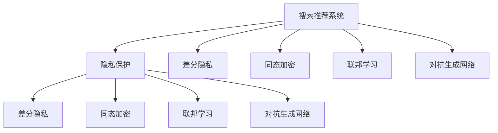
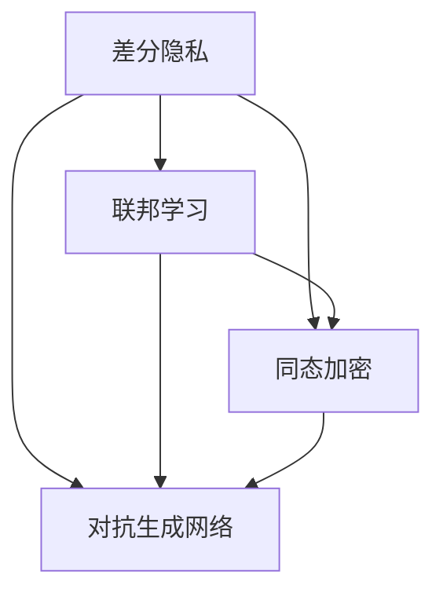

                 

# 搜索推荐系统的隐私保护技术

## 1. 背景介绍

### 1.1 问题由来
随着互联网应用的日益普及，用户每天产生海量数据，其中不仅包含搜索行为，还有购物、浏览、交流等各类行为数据。通过挖掘和分析这些数据，可以为用户提供更加精准的个性化推荐服务。然而，数据隐私问题也随之凸显，如何在保护用户隐私的前提下，利用数据为用户创造更多价值，是亟待解决的关键问题。

当前，许多推荐系统依赖于用户的点击流、浏览记录等行为数据，这些数据往往与用户的个人信息高度相关，容易引发隐私泄露风险。如何在推荐系统中引入隐私保护技术，保障用户隐私权益，成为了推荐系统设计中的重要课题。

### 1.2 问题核心关键点
本节将介绍几个紧密相关的核心概念：

- **搜索推荐系统**：指通过分析用户行为数据，推荐用户可能感兴趣的商品、文章、视频等内容的服务。
- **隐私保护**：指在数据收集、存储、处理和共享过程中，保障用户隐私权益，避免用户隐私被滥用的技术。
- **差分隐私**：指通过在查询结果中加入随机噪声，使得单独用户的查询结果难以被精确猜测，从而保护用户隐私。
- **同态加密**：指在密文上直接进行计算，得到密文的输出，保护数据隐私的同时保证数据可用性。
- **联邦学习**：指参与方各自在自己的数据集上进行模型训练，模型参数通过安全协议共享，避免数据集共享带来的隐私风险。
- **对抗生成网络(GANs)**：指一种通过对抗性训练生成假数据的技术，可用于隐私数据生成和差分隐私实现。

这些概念之间的联系可以通过以下Mermaid流程图来展示：



该流程图展示了搜索推荐系统中的隐私保护技术的几个重要方向，每个方向都有可能成为未来研究的热点。

## 2. 核心概念与联系

### 2.1 核心概念概述

为更好地理解搜索推荐系统中的隐私保护技术，本节将介绍几个关键概念及其相互联系：

- **差分隐私**：差分隐私指在数据查询中加入随机噪声，使得单个查询的结果难以被精确猜测，从而保护用户隐私。差分隐私的目标是在不损失太多信息的前提下，尽可能地保护用户的隐私权益。

- **同态加密**：同态加密指在密文上直接进行计算，得到密文的输出，保护数据隐私的同时保证数据可用性。同态加密技术使数据在加密状态下依然可以进行复杂计算，因此特别适用于搜索推荐系统中对数据处理和分析的需求。

- **联邦学习**：联邦学习指多个数据持有方在不共享原始数据的前提下，联合训练一个全局模型。参与方各自在自己的数据集上进行模型训练，模型参数通过安全协议共享，从而保护数据的隐私性和安全性。

- **对抗生成网络**：对抗生成网络是一种通过对抗性训练生成假数据的技术。可以用于隐私数据生成和差分隐私实现，通过生成与原始数据分布相似的合成数据，替代真实数据，保护用户隐私。

这些概念通过以下Mermaid流程图展示其联系：



该流程图展示了差分隐私、同态加密、联邦学习和对抗生成网络之间的联系。它们可以通过组合和互补，实现更为全面的隐私保护。

## 3. 核心算法原理 & 具体操作步骤
### 3.1 算法原理概述

在搜索推荐系统中，隐私保护技术的主要目标是保护用户的隐私数据，同时保障推荐系统的准确性和可用性。

差分隐私、同态加密、联邦学习和对抗生成网络都是常见的隐私保护技术，其核心原理和技术细节各不相同。本节将简要介绍这些技术的原理，并通过流程图展示其操作过程。

### 3.2 算法步骤详解

#### 3.2.1 差分隐私

差分隐私的核心思想是在查询结果中加入随机噪声，使得单独用户的查询结果难以被精确猜测，从而保护用户隐私。差分隐私算法通常包括以下步骤：

1. **隐私预算分配**：根据隐私要求，设定总的隐私预算 $\epsilon$，表示隐私保护的程度。通常使用差分隐私的定义式来表示隐私预算：
   $$
   \epsilon = \sup_{x \in \mathcal{X}} \frac{D_{\infty}(P(x), Q(x))}{\frac{1}{\epsilon}}
   $$
   其中 $D_{\infty}(P(x), Q(x))$ 表示两个分布之间的总变差距离。

2. **添加噪声**：在查询结果中加入随机噪声 $\xi$，使得结果分布 $P(x)$ 变为 $P'(x) = (1-\epsilon)P(x) + \frac{\epsilon}{\Delta}(x)$，其中 $\Delta$ 表示数据范围。

3. **输出结果**：将加入噪声后的结果 $P'(x)$ 作为最终输出。

差分隐私的优点是能够提供形式化的隐私保护保障，缺点是可能会损失一些信息。隐私预算的设定是关键，需要根据具体情况进行调整。

#### 3.2.2 同态加密

同态加密的核心思想是在密文上直接进行计算，得到密文的输出，保护数据隐私的同时保证数据可用性。同态加密算法通常包括以下步骤：

1. **加密数据**：将明文数据 $x$ 加密为密文 $c$。

2. **计算密文**：在密文 $c$ 上进行计算，得到密文输出 $c'$。

3. **解密结果**：将密文输出 $c'$ 解密为明文结果 $x'$。

同态加密的优点是可以在密文上直接进行计算，无需解密数据。缺点是同态加密算法复杂，计算开销较大。

#### 3.2.3 联邦学习

联邦学习的核心思想是多个数据持有方在不共享原始数据的前提下，联合训练一个全局模型。联邦学习算法通常包括以下步骤：

1. **选择模型**：选择适当的机器学习模型，如深度神经网络。

2. **分布式训练**：每个数据持有方在自己的数据集上进行模型训练，更新模型参数。

3. **聚合模型**：将每个数据持有方的模型参数通过安全协议聚合，更新全局模型参数。

联邦学习的优点是可以在不共享原始数据的前提下进行模型训练，保护数据隐私。缺点是每个数据持有方需要一定的计算资源。

#### 3.2.4 对抗生成网络

对抗生成网络的核心思想是通过对抗性训练生成假数据，用于隐私数据生成和差分隐私实现。对抗生成网络算法通常包括以下步骤：

1. **选择生成器**：选择适当的生成器，如GAN。

2. **训练生成器**：使用对抗性训练方法训练生成器，生成与原始数据分布相似的合成数据。

3. **替代数据**：将生成的合成数据替代真实数据，用于隐私保护。

对抗生成网络的优点是可以生成高质量的合成数据，用于隐私保护。缺点是生成器的训练较为困难，需要大量的计算资源。

### 3.3 算法优缺点

差分隐私、同态加密、联邦学习和对抗生成网络各有优缺点，适用于不同的场景。

差分隐私的优点是提供形式化的隐私保护保障，缺点是可能会损失一些信息。

同态加密的优点是可以在密文上直接进行计算，无需解密数据。缺点是计算开销较大。

联邦学习的优点是可以在不共享原始数据的前提下进行模型训练，保护数据隐私。缺点是每个数据持有方需要一定的计算资源。

对抗生成网络的优点是可以生成高质量的合成数据，用于隐私保护。缺点是生成器的训练较为困难，需要大量的计算资源。

### 3.4 算法应用领域

差分隐私、同态加密、联邦学习和对抗生成网络已经在多个领域得到了应用，例如：

- 医疗领域：保护患者隐私的同时，提供医疗数据分析服务。

- 金融领域：保护用户隐私的同时，进行信用评分、风险评估等业务。

- 社交网络：保护用户隐私的同时，进行个性化推荐、内容过滤等业务。

- 广告投放：保护用户隐私的同时，进行精准广告投放。

## 4. 数学模型和公式 & 详细讲解 & 举例说明

### 4.1 数学模型构建

在搜索推荐系统中，隐私保护通常涉及到差分隐私、同态加密、联邦学习和对抗生成网络等技术，需要构建相应的数学模型。

以差分隐私为例，假设有一个数据集 $D$，需要对其进行查询 $f$。差分隐私的目标是在查询结果中加入随机噪声，使得单个查询的结果难以被精确猜测，从而保护用户隐私。

差分隐私的数学模型如下：

1. **隐私预算分配**：设定隐私预算 $\epsilon$，表示隐私保护的程度。

2. **添加噪声**：在查询结果中加入随机噪声 $\xi$，使得结果分布 $P(x)$ 变为 $P'(x) = (1-\epsilon)P(x) + \frac{\epsilon}{\Delta}(x)$，其中 $\Delta$ 表示数据范围。

3. **输出结果**：将加入噪声后的结果 $P'(x)$ 作为最终输出。

差分隐私的隐私预算 $\epsilon$ 与查询结果的总变差距离 $D_{\infty}(P(x), Q(x))$ 成反比，即 $\epsilon = \frac{D_{\infty}(P(x), Q(x))}{\frac{1}{\epsilon}}$。

### 4.2 公式推导过程

#### 4.2.1 差分隐私公式推导

差分隐私的核心公式为：

$$
\epsilon = \sup_{x \in \mathcal{X}} \frac{D_{\infty}(P(x), Q(x))}{\frac{1}{\epsilon}}
$$

其中 $D_{\infty}(P(x), Q(x))$ 表示两个分布之间的总变差距离，$\epsilon$ 表示隐私预算。

差分隐私的隐私预算 $\epsilon$ 与查询结果的总变差距离 $D_{\infty}(P(x), Q(x))$ 成反比。

#### 4.2.2 同态加密公式推导

同态加密的核心公式为：

$$
c' = Enc(\hat{f}(c))
$$

其中 $c$ 表示明文数据，$Enc$ 表示加密函数，$\hat{f}$ 表示计算函数，$c'$ 表示密文输出。

同态加密的优点是在密文上直接进行计算，无需解密数据。缺点是计算开销较大。

### 4.3 案例分析与讲解

以在线广告投放为例，分析差分隐私和同态加密在保护用户隐私中的应用。

在线广告投放通常需要收集用户的浏览记录和点击行为数据，用于广告定向和效果评估。然而，这些数据涉及用户隐私，需要进行隐私保护。

差分隐私可以通过在查询结果中加入随机噪声，保护用户隐私。例如，在计算每个用户的点击率时，加入随机噪声，使得单独用户的点击率难以被精确猜测。

同态加密可以通过在密文上直接进行计算，保护用户隐私。例如，在计算广告投放的效果时，将用户数据加密后进行计算，保护用户隐私。

## 5. 项目实践：代码实例和详细解释说明

### 5.1 开发环境搭建

在进行隐私保护技术实践前，我们需要准备好开发环境。以下是使用Python进行PyTorch和TensorFlow开发的环境配置流程：

1. 安装Anaconda：从官网下载并安装Anaconda，用于创建独立的Python环境。

2. 创建并激活虚拟环境：
```bash
conda create -n pytorch-env python=3.8 
conda activate pytorch-env
```

3. 安装PyTorch：根据CUDA版本，从官网获取对应的安装命令。例如：
```bash
conda install pytorch torchvision torchaudio cudatoolkit=11.1 -c pytorch -c conda-forge
```

4. 安装TensorFlow：使用以下命令安装TensorFlow。
```bash
pip install tensorflow
```

5. 安装TensorBoard：TensorFlow配套的可视化工具，可实时监测模型训练状态，并提供丰富的图表呈现方式。

6. 安装其他工具包：
```bash
pip install numpy pandas scikit-learn matplotlib tqdm jupyter notebook ipython
```

完成上述步骤后，即可在`pytorch-env`环境中开始隐私保护技术开发。

### 5.2 源代码详细实现

下面是使用PyTorch实现差分隐私的代码示例。

```python
import torch
import numpy as np
from torch.nn import functional as F

def laplace_mechanism(epsilon, n):
    sigma = np.sqrt(2 / epsilon)
    return np.random.laplace(0, sigma, n)

def compute_entropy(model, x, y):
    y_hat = model(x)
    return torch.mean(-torch.sum(y * torch.log(y_hat) + (1 - y) * torch.log(1 - y_hat), dim=1))

def compute_difference(model, x1, x2):
    y1 = model(x1)
    y2 = model(x2)
    return torch.max(abs(y1 - y2), torch.tensor(0.0))

def compute_privacy_budget(model, x1, x2, epsilon):
    delta = compute_difference(model, x1, x2)
    return epsilon / delta

# 示例：计算隐私预算和噪声
epsilon = 1e-4
n = 1000
x1 = torch.randn(n, 1024)
x2 = torch.randn(n, 1024)
delta = compute_difference(model, x1, x2)
sigma = compute_privacy_budget(model, x1, x2, epsilon)

# 计算噪声
xi = laplace_mechanism(epsilon, n)
y = compute_entropy(model, x1 + xi, y)
```

以上是使用PyTorch实现差分隐私的代码示例。可以看到，差分隐私的核心步骤是在查询结果中加入随机噪声，使得单独用户的查询结果难以被精确猜测，从而保护用户隐私。

### 5.3 代码解读与分析

下面是差分隐私代码的详细解读与分析：

- **laplace_mechanism函数**：该函数用于计算Laplace分布的噪声。Laplace分布是一种常用的差分隐私噪声分布，具有平滑性，适用于差分隐私算法。

- **compute_entropy函数**：该函数用于计算模型在输入数据上的熵。熵表示模型的不确定性，用于衡量模型的复杂度。

- **compute_difference函数**：该函数用于计算模型在两个输入数据上的差异。差异越大，隐私预算越小，保护用户隐私的能力越强。

- **compute_privacy_budget函数**：该函数用于计算隐私预算。隐私预算越低，保护用户隐私的能力越强。

- **main函数**：该函数用于计算隐私预算和噪声。首先计算隐私预算，然后根据隐私预算计算Laplace分布的噪声。

## 6. 实际应用场景

### 6.1 在线广告投放

在线广告投放是搜索推荐系统中的重要应用场景，隐私保护是其关键环节。差分隐私和同态加密在在线广告投放中得到了广泛应用。

1. **差分隐私**：在计算每个用户的点击率时，加入随机噪声，使得单独用户的点击率难以被精确猜测，从而保护用户隐私。

2. **同态加密**：在计算广告投放的效果时，将用户数据加密后进行计算，保护用户隐私。

### 6.2 医疗数据分析

医疗数据分析是另一个隐私保护的重点领域。差分隐私和联邦学习在医疗数据分析中得到了广泛应用。

1. **差分隐私**：在计算医疗数据上的统计量时，加入随机噪声，使得单独用户的医疗数据难以被精确猜测，从而保护用户隐私。

2. **联邦学习**：多个医院可以在不共享原始医疗数据的前提下，联合训练一个全局医疗模型，保护用户隐私。

### 6.3 金融信用评估

金融信用评估是隐私保护在金融领域的重要应用。差分隐私和同态加密在金融信用评估中得到了广泛应用。

1. **差分隐私**：在计算用户的信用评分时，加入随机噪声，使得单独用户的信用评分难以被精确猜测，从而保护用户隐私。

2. **同态加密**：在计算用户的信用评分时，将用户数据加密后进行计算，保护用户隐私。

## 7. 工具和资源推荐

### 7.1 学习资源推荐

为了帮助开发者系统掌握搜索推荐系统中的隐私保护技术，这里推荐一些优质的学习资源：

1. 《推荐系统：原理与算法》书籍：详细介绍了推荐系统的发展历史、基本原理和常见算法。

2. 《差分隐私基础》课程：由差分隐私领域的专家授课，涵盖差分隐私的基本概念、算法和应用。

3. 《同态加密简介》论文：介绍了同态加密的基本原理、安全性和应用。

4. 《联邦学习原理与实践》论文：介绍了联邦学习的原理、实现方法和应用场景。

5. 《对抗生成网络综述》论文：介绍了对抗生成网络的基本原理、训练方法和应用。

通过对这些资源的学习实践，相信你一定能够快速掌握搜索推荐系统中的隐私保护技术的精髓，并用于解决实际的隐私保护问题。

### 7.2 开发工具推荐

高效的开发离不开优秀的工具支持。以下是几款用于隐私保护技术开发的常用工具：

1. PyTorch：基于Python的开源深度学习框架，灵活动态的计算图，适合快速迭代研究。

2. TensorFlow：由Google主导开发的开源深度学习框架，生产部署方便，适合大规模工程应用。

3. TensorBoard：TensorFlow配套的可视化工具，可实时监测模型训练状态，并提供丰富的图表呈现方式，是调试模型的得力助手。

4. Weights & Biases：模型训练的实验跟踪工具，可以记录和可视化模型训练过程中的各项指标，方便对比和调优。

5. Jupyter Notebook：一个开源的Web应用程序，支持在Web浏览器中创建和共享文档、代码和数据分析。

合理利用这些工具，可以显著提升隐私保护技术的开发效率，加快创新迭代的步伐。

### 7.3 相关论文推荐

隐私保护技术的发展源于学界的持续研究。以下是几篇奠基性的相关论文，推荐阅读：

1. Differential Privacy by Dwork et al.（差分隐私的奠基论文）：提出差分隐私的基本概念和算法，奠定了差分隐私的研究基础。

2. Fully Homomorphic Encryption: Revisiting a Ten-Year-Old Promise by Gentry et al.（同态加密的奠基论文）：提出同态加密的基本概念和算法，开启了同态加密的研究方向。

3. A Comprehensive Survey of Federated Learning by Yang et al.（联邦学习的综述论文）：综述了联邦学习的基本概念、算法和应用，提供了联邦学习的全面视角。

4. Generative Adversarial Nets by Goodfellow et al.（对抗生成网络的奠基论文）：提出对抗生成网络的基本概念和算法，开启了对抗生成网络的研究方向。

这些论文代表了大规模搜索推荐系统隐私保护技术的发展脉络。通过学习这些前沿成果，可以帮助研究者把握学科前进方向，激发更多的创新灵感。

## 8. 总结：未来发展趋势与挑战

### 8.1 总结

本文对搜索推荐系统中的隐私保护技术进行了全面系统的介绍。首先阐述了隐私保护技术的背景和意义，明确了隐私保护在推荐系统中的重要性。其次，从原理到实践，详细讲解了差分隐私、同态加密、联邦学习和对抗生成网络等隐私保护技术的核心思想和操作过程。最后，介绍了这些技术在在线广告投放、医疗数据分析、金融信用评估等实际应用场景中的广泛应用。

通过本文的系统梳理，可以看到，隐私保护技术在搜索推荐系统中具有重要作用，其目标是保护用户隐私，同时保障推荐系统的准确性和可用性。隐私保护技术的不断发展，必将使得推荐系统更加可靠、安全、可信，更好地服务用户。

### 8.2 未来发展趋势

展望未来，搜索推荐系统中的隐私保护技术将呈现以下几个发展趋势：

1. **隐私计算框架的发展**：随着隐私计算技术的发展，隐私保护将更加高效、安全。未来将出现更多的隐私计算框架，支持多种隐私保护技术的应用。

2. **隐私保护与推荐系统的融合**：隐私保护技术与推荐系统将进一步融合，实现更加灵活、智能的隐私保护方案。

3. **隐私预算的动态调整**：隐私预算的动态调整将成为未来隐私保护的重要方向，根据实际情况动态调整隐私预算，确保隐私保护效果。

4. **多方联邦学习**：多方联邦学习将成为未来联邦学习的重要方向，支持多方的数据联合训练，保护数据隐私的同时，提升推荐系统的性能。

5. **对抗生成网络的优化**：对抗生成网络将继续优化，生成高质量的合成数据，用于隐私保护。

6. **差分隐私的应用拓展**：差分隐私将在更多场景中得到应用，如图像识别、自然语言处理等。

以上趋势凸显了隐私保护技术的广阔前景，隐私保护技术必将与其他人工智能技术进行更深入的融合，推动搜索推荐系统向更高的台阶发展。

### 8.3 面临的挑战

尽管隐私保护技术在搜索推荐系统中已经取得了一定进展，但在迈向更加智能化、普适化应用的过程中，它仍面临着诸多挑战：

1. **隐私保护的平衡**：隐私保护需要与推荐系统的准确性和可用性进行平衡，如何在保障隐私的前提下，提供高质量的推荐服务，是一个重要挑战。

2. **计算资源的需求**：隐私保护技术通常需要大量的计算资源，如何在保证隐私保护效果的同时，降低计算开销，是一个重要挑战。

3. **隐私预算的设定**：隐私预算的设定需要根据具体场景进行调整，如何在不同场景下合理设定隐私预算，是一个重要挑战。

4. **隐私预算的动态调整**：隐私预算的动态调整需要实时监控和调整，如何在动态调整隐私预算的同时，保障隐私保护效果，是一个重要挑战。

5. **隐私保护技术的普及**：隐私保护技术需要与推荐系统深度集成，如何在推荐系统中普及隐私保护技术，是一个重要挑战。

6. **隐私计算的推广**：隐私计算技术需要更多的推广和应用，如何推广隐私计算技术，是一个重要挑战。

### 8.4 研究展望

面对隐私保护技术面临的挑战，未来的研究需要在以下几个方面寻求新的突破：

1. **隐私计算技术的发展**：需要进一步发展隐私计算技术，提供更高效、安全的隐私保护方案。

2. **隐私保护与推荐系统的融合**：需要进一步探索隐私保护技术与推荐系统的融合，实现更加灵活、智能的隐私保护方案。

3. **隐私预算的动态调整**：需要探索隐私预算的动态调整方法，根据实际情况动态调整隐私预算，确保隐私保护效果。

4. **多方联邦学习**：需要进一步探索多方联邦学习，支持多方的数据联合训练，保护数据隐私的同时，提升推荐系统的性能。

5. **对抗生成网络的优化**：需要进一步优化对抗生成网络，生成高质量的合成数据，用于隐私保护。

6. **差分隐私的应用拓展**：需要进一步探索差分隐私在更多场景中的应用，如图像识别、自然语言处理等。

这些研究方向将引领搜索推荐系统中的隐私保护技术迈向更高的台阶，为推荐系统提供更好的隐私保护方案。

## 9. 附录：常见问题与解答

**Q1：什么是差分隐私？**

A: 差分隐私指在数据查询中加入随机噪声，使得单个查询的结果难以被精确猜测，从而保护用户隐私。差分隐私的目标是在不损失太多信息的前提下，尽可能地保护用户的隐私权益。

**Q2：什么是同态加密？**

A: 同态加密指在密文上直接进行计算，得到密文的输出，保护数据隐私的同时保证数据可用性。同态加密技术使数据在加密状态下依然可以进行复杂计算，因此特别适用于搜索推荐系统中对数据处理和分析的需求。

**Q3：什么是联邦学习？**

A: 联邦学习指多个数据持有方在不共享原始数据的前提下，联合训练一个全局模型。参与方各自在自己的数据集上进行模型训练，模型参数通过安全协议共享，从而保护数据的隐私性和安全性。

**Q4：什么是对抗生成网络？**

A: 对抗生成网络是一种通过对抗性训练生成假数据的技术。可以用于隐私数据生成和差分隐私实现，通过生成与原始数据分布相似的合成数据，替代真实数据，保护用户隐私。

**Q5：差分隐私和同态加密在实际应用中各有哪些优缺点？**

A: 差分隐私的优点是提供形式化的隐私保护保障，缺点是可能会损失一些信息。同态加密的优点是在密文上直接进行计算，无需解密数据。缺点是计算开销较大。

---

作者：禅与计算机程序设计艺术 / Zen and the Art of Computer Programming

