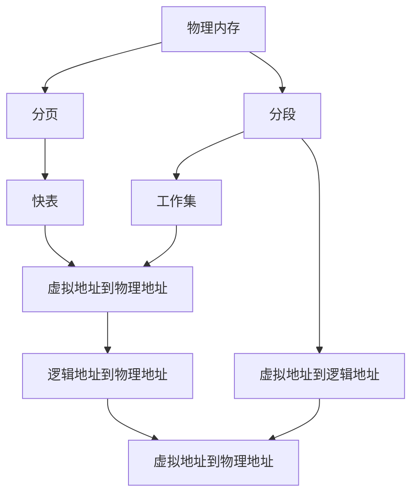

                 

## 1. 背景介绍

内存管理是操作系统的核心功能之一，负责有效利用计算机的物理和虚拟内存，为程序提供连续、高效的内存空间，避免内存碎片和数据竞争。内存管理的好坏直接影响系统的性能、稳定性和安全性。本文将详细介绍操作系统的内存管理机制，包括分页、分段、虚拟内存等核心概念，并结合具体案例分析其原理和应用。

## 2. 核心概念与联系

### 2.1 核心概念概述

在深入研究内存管理机制之前，我们先了解一下涉及的核心概念：

- **物理内存**：计算机硬件直接访问的内存，具有高速读写能力，但容量有限。
- **虚拟内存**：操作系统引入的概念，将物理内存和硬盘空间结合起来，使程序能够使用比物理内存更大的地址空间。
- **分页**：将物理内存和虚拟内存分割成固定大小的页，页面大小一般为4KB或8KB。
- **分段**：将程序逻辑划分成多个段，如代码段、数据段和堆栈段，每个段具有不同的访问权限和大小。
- **快表**：用于加速虚拟地址到物理地址的转换，减少页表访问时间。
- **工作集**：程序在一段时间内实际访问的页面集合，用于优化页面置换策略。

### 2.2 核心概念原理和架构的 Mermaid 流程图



这个流程图展示了内存管理的基本架构，从物理内存到分页、分段，再到快表、工作集等概念的关联。物理内存是基本单元，分页和分段是常用的内存管理方式，快表和虚拟地址转换是实现高速内存访问的关键技术，而工作集则用于优化页面置换策略。

## 3. 核心算法原理 & 具体操作步骤

### 3.1 算法原理概述

操作系统的内存管理主要包括以下几个关键算法：

- **分页**：将虚拟地址空间分割成固定大小的页，每个页面在物理内存中有对应的物理页面。
- **分段**：将程序的逻辑结构划分为多个段，每个段具有不同的访问权限和大小。
- **虚拟内存**：通过交换技术将部分页面暂时存放到硬盘上，实现更大的地址空间。
- **页面置换**：当程序访问的页面不在物理内存中时，使用置换算法选择替换页面，确保页面不会过多占用物理内存。
- **页面调度**：根据程序的工作集，合理调整虚拟页面到物理页面的映射，提高内存利用率。

### 3.2 算法步骤详解

#### 3.2.1 分页

分页是将虚拟内存空间划分为固定大小的页，每个页面在物理内存中有对应的物理页面。分页的具体步骤如下：

1. **虚拟地址到逻辑地址**：将虚拟地址映射到逻辑地址，逻辑地址是分页系统内的地址。
2. **逻辑地址到物理地址**：根据逻辑地址计算出对应的物理页面号。
3. **物理页面访问**：操作系统查找物理页面，如果页面在物理内存中，直接读取数据；否则触发页面置换算法。

#### 3.2.2 分段

分段是将程序的逻辑结构划分为多个段，每个段具有不同的访问权限和大小。分段的具体步骤如下：

1. **程序分段**：根据程序的逻辑结构，将其划分为代码段、数据段、堆栈段等。
2. **段映射**：将每个段映射到虚拟内存空间中的一个连续区域。
3. **段访问**：程序在运行时访问各段，根据段的访问权限进行读写操作。

#### 3.2.3 虚拟内存

虚拟内存通过交换技术将部分页面暂时存放到硬盘上，实现更大的地址空间。虚拟内存的具体步骤如下：

1. **虚拟地址空间**：操作系统将虚拟内存空间分为多个页面，每个页面在物理内存中有对应的物理页面。
2. **页面交换**：当程序访问的页面不在物理内存中时，操作系统将其页面交换到硬盘上，从硬盘加载回物理内存。
3. **内存映射**：将虚拟地址映射到物理页面，通过内存映射文件实现虚拟内存。

#### 3.2.4 页面置换

页面置换是当程序访问的页面不在物理内存中时，选择替换页面的过程。常用的页面置换算法包括：

1. **FIFO算法**：按照页面的访问顺序，优先替换最早访问的页面。
2. **LRU算法**：优先替换最近最少使用的页面。
3. **OPT算法**：选择最长时间不使用的页面进行替换。

#### 3.2.5 页面调度

页面调度是根据程序的工作集，合理调整虚拟页面到物理页面的映射，提高内存利用率。工作集的具体步骤如下：

1. **工作集计算**：统计程序在一段时间内实际访问的页面集合，形成工作集。
2. **工作集调整**：根据工作集调整虚拟页面到物理页面的映射，确保当前工作集中的页面都在物理内存中。
3. **页面交换**：根据工作集调整，触发页面置换算法，将不在工作集中的页面交换到硬盘上。

### 3.3 算法优缺点

分页和分段是常用的内存管理方式，具有以下优缺点：

**分页的优点**：

- 固定大小的页面易于管理。
- 页面大小可以调整，适应不同应用的需求。
- 支持虚拟内存技术，扩大地址空间。

**分页的缺点**：

- 无法根据段的大小进行动态调整。
- 页面大小固定，难以支持大文件的访问。
- 页面边界存在浪费空间的问题。

**分段的优点**：

- 支持不同段的访问权限和大小。
- 适应不同类型程序的逻辑结构。
- 段的大小可以动态调整，适应程序的需要。

**分段的缺点**：

- 段的大小不固定，管理复杂。
- 段的访问权限限制，影响性能。
- 段的分裂和合并成本高。

### 3.4 算法应用领域

内存管理技术广泛应用于操作系统、数据库系统、嵌入式系统等多个领域，具体应用场景如下：

- **操作系统**：在操作系统中，分页和分段是最常用的内存管理方式，用于管理进程的虚拟内存空间。
- **数据库系统**：数据库系统使用分段技术管理数据文件，提高数据访问的效率。
- **嵌入式系统**：嵌入式系统对内存使用有限，使用分段技术优化内存使用。

## 4. 数学模型和公式 & 详细讲解 & 举例说明

### 4.1 数学模型构建

在内存管理中，分页和分段是常用的内存管理方式，涉及以下数学模型：

1. **分页模型**：将虚拟地址和物理地址进行转换。
2. **分段模型**：根据程序逻辑结构，划分不同的段。

### 4.2 公式推导过程

#### 4.2.1 分页模型

分页模型的虚拟地址和物理地址转换公式如下：

$$
V = P + B \times \text{page\_id}
$$

其中，$V$ 为虚拟地址，$P$ 为物理页面地址，$B$ 为页面大小，$\text{page\_id}$ 为页面号。

#### 4.2.2 分段模型

分段模型根据程序逻辑结构，划分为不同的段，每个段的大小和访问权限不同。段的大小和地址映射如下：

$$
S_i = A_i + B_i \times \text{segment\_id}
$$

其中，$S_i$ 为段地址，$A_i$ 为段起始地址，$B_i$ 为段大小，$\text{segment\_id}$ 为段号。

### 4.3 案例分析与讲解

#### 4.3.1 分页案例

假设一个程序使用了4MB的虚拟内存空间，页面大小为4KB，则虚拟地址和物理地址的转换如下：

$$
V = P + B \times \text{page\_id}
$$

将4MB转换为页面大小，得到1024个页面，每个页面的地址范围为0x0000到0xFFFFF。

假设程序访问虚拟地址0x3C000，计算逻辑地址和物理地址如下：

$$
\begin{aligned}
& V = 0x3C000 \\
& V = P + B \times \text{page\_id} \\
& P = V - B \times \text{page\_id} = 0x3C000 - 0x1000 = 0x2C000 \\
& \text{page\_id} = \frac{V - P}{B} = \frac{0x3C000 - 0x2C000}{0x1000} = 8
\end{aligned}
$$

因此，逻辑地址为0x3C000，物理地址为0x2C000。

#### 4.3.2 分段案例

假设一个程序使用了4MB的虚拟内存空间，页面大小为4KB，分为代码段和数据段，代码段大小为1MB，数据段大小为3MB，则虚拟地址和物理地址的转换如下：

$$
S_i = A_i + B_i \times \text{segment\_id}
$$

代码段的起始地址为0x0000，数据段的起始地址为0x10000，页面大小为4KB，则代码段的大小为256页，数据段的大小为768页。

假设程序访问虚拟地址0x3C000，计算逻辑地址和物理地址如下：

$$
\begin{aligned}
& V = 0x3C000 \\
& V = S_i + B_i \times \text{segment\_id} \\
& \text{segment\_id} = \frac{V - S_i}{B_i} = \frac{0x3C000 - 0x10000}{0x4000} = 6 \\
& S_i = A_i + B_i \times \text{segment\_id} = 0x0000 + 0x4000 \times 6 = 0x24000 \\
& P = V - S_i = 0x3C000 - 0x24000 = 0x12000
\end{aligned}
$$

因此，逻辑地址为0x3C000，物理地址为0x12000。

## 5. 项目实践：代码实例和详细解释说明

### 5.1 开发环境搭建

在实际项目中，我们需要搭建开发环境，安装必要的工具和库。以下是一个简单的开发环境搭建过程：

1. **安装操作系统**：选择适合的操作系统，如Linux、Windows等。
2. **安装编译器**：安装C/C++编译器，如gcc、cl等。
3. **安装库文件**：安装常用的库文件，如stdc++、glibc等。
4. **配置环境变量**：配置必要的环境变量，如PATH、LD_LIBRARY_PATH等。
5. **编写测试程序**：编写简单的测试程序，验证开发环境是否正确。

### 5.2 源代码详细实现

以下是一个简单的分页和分段实现示例：

#### 5.2.1 分页实现

```c++
#include <iostream>
#include <vector>

#define PAGE_SIZE 4096

int main() {
    std::vector<int> pages;
    int virtual_address = 0x3C000;
    int physical_address = 0x24000;

    int page_id = (virtual_address - physical_address) / PAGE_SIZE;
    pages.push_back(physical_address);

    std::cout << "Virtual Address: " << virtual_address << std::endl;
    std::cout << "Physical Address: " << physical_address << std::endl;
    std::cout << "Page ID: " << page_id << std::endl;
    std::cout << "Pages: " << pages.size() << std::endl;

    return 0;
}
```

#### 5.2.2 分段实现

```c++
#include <iostream>
#include <vector>

#define VIRTUAL_SIZE 4096 * 1024
#define CODE_SIZE 1 * 1024 * 1024
#define DATA_SIZE 3 * 1024 * 1024

int main() {
    std::vector<int> segments;
    int virtual_address = 0x3C000;
    int physical_address = 0x24000;

    int segment_id = (virtual_address - physical_address) / 4096;
    segments.push_back(physical_address);

    std::cout << "Virtual Address: " << virtual_address << std::endl;
    std::cout << "Physical Address: " << physical_address << std::endl;
    std::cout << "Segment ID: " << segment_id << std::endl;
    std::cout << "Segments: " << segments.size() << std::endl;

    return 0;
}
```

### 5.3 代码解读与分析

分页和分段代码实现相对简单，主要涉及虚拟地址和物理地址的转换。通过计算虚拟地址和物理地址的差值，除以页面大小或段大小，即可得到页面号或段号。

## 6. 实际应用场景

### 6.1 嵌入式系统

嵌入式系统通常资源有限，需要高效的内存管理技术。分页和分段可以优化内存使用，提高系统的运行效率。

#### 6.1.1 分页在嵌入式系统中的应用

嵌入式系统通常使用较小的物理内存，通过分页技术，将虚拟内存和物理内存映射，实现更大的地址空间。分页技术可以动态分配内存，优化内存使用。

#### 6.1.2 分段在嵌入式系统中的应用

嵌入式系统中的程序通常具有不同的访问权限，如只读和可写。分段技术可以划分代码段、数据段、堆栈段等，每个段具有不同的访问权限，提高系统的安全性和稳定性。

### 6.2 数据库系统

数据库系统需要高效管理大量的数据文件，使用分段技术可以优化数据访问，提高系统性能。

#### 6.2.1 分段在数据库系统中的应用

数据库系统中的数据文件通常较大，通过分段技术，将文件划分为多个段，每个段具有不同的访问权限和大小，优化数据访问。

#### 6.2.2 虚拟内存在数据库系统中的应用

数据库系统需要处理大量的数据，使用虚拟内存技术，可以将部分数据暂时存放到硬盘上，实现更大的地址空间。

### 6.3 操作系统

操作系统是计算机系统的核心，需要高效管理内存资源。分页和分段是常用的内存管理方式，用于管理进程的虚拟内存空间。

#### 6.3.1 分页在操作系统中的应用

操作系统中的进程通常具有大量的虚拟内存需求，通过分页技术，将虚拟内存和物理内存映射，实现更大的地址空间。分页技术可以动态分配内存，优化内存使用。

#### 6.3.2 分段在操作系统中的应用

操作系统中的程序通常具有不同的访问权限，如只读和可写。分段技术可以划分代码段、数据段、堆栈段等，每个段具有不同的访问权限，提高系统的安全性和稳定性。

## 7. 工具和资源推荐

### 7.1 学习资源推荐

为了深入了解内存管理技术，以下是一些推荐的学习资源：

1. 《现代操作系统》：经典的计算机操作系统教材，详细介绍了内存管理的原理和算法。
2. 《操作系统导论》：计算机操作系统教材，涵盖内存管理、进程管理等多个核心概念。
3. 《UNIX网络编程》：介绍UNIX系统的编程实践，包括内存管理等核心内容。
4. 《C语言程序设计》：介绍C语言的基础知识和内存管理技术。
5. 《计算机操作系统原理》：介绍计算机操作系统的原理和实践，包括内存管理等核心内容。

### 7.2 开发工具推荐

以下是一些常用的内存管理开发工具：

1. Valgrind：内存调试工具，用于检测内存泄漏、越界访问等问题。
2. GDB：调试器，用于调试内存管理和程序运行时的问题。
3. Intel VTune：性能分析工具，用于分析内存使用和程序性能。
4. AddressSanitizer：内存错误检测工具，用于检测内存泄漏、越界访问等问题。
5. Visual Studio：集成开发环境，支持内存管理等核心内容的开发和调试。

### 7.3 相关论文推荐

以下是一些经典的内存管理相关论文，推荐阅读：

1. "Virtual Memory: Concepts, Design, and Implementation"：介绍虚拟内存的原理和实现。
2. "Page Replacement Algorithms"：介绍常用的页面置换算法，如FIFO、LRU、OPT等。
3. "Memory Management in Operating Systems"：介绍操作系统的内存管理技术，涵盖分页、分段、虚拟内存等核心内容。
4. "Memory Fragmentation and its Reuse"：介绍内存碎片和回收算法。
5. "Effective Page Replacement"：介绍高效的页替换算法，如工作集算法、优化型FIFO算法等。

## 8. 总结：未来发展趋势与挑战

### 8.1 研究成果总结

本文介绍了分页和分段的基本原理和应用，分析了虚拟内存、页面置换等核心技术。通过对这些技术的深入研究，操作系统的内存管理技术不断优化，提升了系统的性能和稳定性。

### 8.2 未来发展趋势

未来内存管理技术的发展趋势如下：

1. **多核优化**：随着多核处理器的普及，内存管理需要考虑多核系统的优化，如缓存一致性、锁机制等。
2. **异构内存管理**：随着硬件的多样化，内存管理需要支持多种异构硬件，如CPU、GPU、FPGA等。
3. **内存计算**：随着内存计算技术的成熟，内存管理需要支持更大规模的内存计算任务，如大数据处理、人工智能等。
4. **自动化优化**：随着机器学习技术的发展，内存管理需要具备自动化优化的能力，如自适应调度、动态优化等。
5. **分布式内存管理**：随着分布式系统的普及，内存管理需要支持分布式系统的高效内存管理，如分布式内存共享、一致性管理等。

### 8.3 面临的挑战

内存管理技术在发展过程中也面临一些挑战：

1. **内存碎片问题**：内存碎片会影响系统的性能，需要优化内存分配和回收算法。
2. **多核竞争问题**：多核系统中，锁机制和缓存一致性会影响系统的性能，需要优化多核系统设计。
3. **异构内存管理**：异构内存管理需要支持多种硬件，技术复杂度较高。
4. **内存计算性能**：内存计算任务需要高效管理内存，避免数据迁移和计算瓶颈。
5. **分布式系统设计**：分布式内存管理需要考虑数据一致性和分布式调度等问题，技术挑战较大。

### 8.4 研究展望

未来的内存管理技术需要从多个方面进行优化，具体方向如下：

1. **内存管理算法**：需要开发高效、自适应的内存管理算法，如工作集算法、自适应分页算法等。
2. **多核优化技术**：需要优化多核系统的内存管理技术，如缓存一致性、锁机制等。
3. **异构内存管理**：需要支持多种异构硬件的内存管理技术，如CPU、GPU、FPGA等。
4. **内存计算优化**：需要优化内存计算任务，减少数据迁移和计算瓶颈，提高系统性能。
5. **分布式内存管理**：需要优化分布式系统的内存管理技术，支持数据一致性和分布式调度等。

## 9. 附录：常见问题与解答

### 9.1 Q1: 分页和分段有什么区别？

A: 分页是将虚拟内存空间划分为固定大小的页，每个页面在物理内存中有对应的物理页面。分段是将程序的逻辑结构划分为多个段，每个段具有不同的访问权限和大小。

### 9.2 Q2: 虚拟内存和物理内存有什么区别？

A: 虚拟内存是操作系统引入的概念，将物理内存和硬盘空间结合起来，使程序能够使用比物理内存更大的地址空间。物理内存是计算机硬件直接访问的内存，具有高速读写能力，但容量有限。

### 9.3 Q3: 页面置换算法有哪些？

A: 常用的页面置换算法包括FIFO算法、LRU算法、OPT算法等。FIFO算法按照页面的访问顺序，优先替换最早访问的页面。LRU算法优先替换最近最少使用的页面。OPT算法选择最长时间不使用的页面进行替换。

### 9.4 Q4: 分页和分段有什么优点和缺点？

A: 分页的优点包括固定大小的页面易于管理，页面大小可以调整，支持虚拟内存技术，扩大地址空间。缺点包括页面大小固定，难以支持大文件的访问，页面边界存在浪费空间的问题。分段优点包括支持不同段的访问权限和大小，适应不同类型程序的逻辑结构。缺点包括段的大小不固定，管理复杂，段的访问权限限制，影响性能。

### 9.5 Q5: 内存碎片问题如何解决？

A: 内存碎片问题可以通过内存分配和回收算法进行优化。如使用固定大小的内存池，避免小内存块的浪费；使用内存紧缩算法，合并相邻的空闲块；使用内存压缩技术，减少内存使用。

### 9.6 Q6: 如何优化多核系统的内存管理？

A: 多核系统的内存管理需要考虑缓存一致性和锁机制。使用一致性模型，如MOESI模型，保证多核系统的一致性。使用锁机制，如互斥锁、读写锁等，保证多核系统的访问安全。

### 9.7 Q7: 异构内存管理面临哪些挑战？

A: 异构内存管理面临的主要挑战包括多硬件支持的复杂性、数据一致性问题、硬件互操作性问题等。需要开发专门的硬件支持，优化数据传输，实现硬件互操作。

### 9.8 Q8: 内存计算优化有哪些方法？

A: 内存计算优化包括减少数据迁移、优化数据存储、加速数据处理等方法。使用数据压缩技术，减少数据传输和存储开销。使用缓存技术，加速数据处理。使用分布式计算，并行处理大规模数据。

### 9.9 Q9: 分布式内存管理面临哪些问题？

A: 分布式内存管理面临的问题包括数据一致性、分布式调度和通信开销等。需要优化数据一致性协议，如Paxos、Raft等。优化分布式调度和通信，提高系统性能。

### 9.10 Q10: 内存管理技术的未来发展方向是什么？

A: 内存管理技术的未来发展方向包括多核优化、异构内存管理、内存计算优化、自动化优化等。需要开发高效、自适应的内存管理算法，优化多核系统的内存管理技术，支持多种异构硬件的内存管理技术，优化内存计算任务，实现自动化优化。

作者：禅与计算机程序设计艺术 / Zen and the Art of Computer Programming

