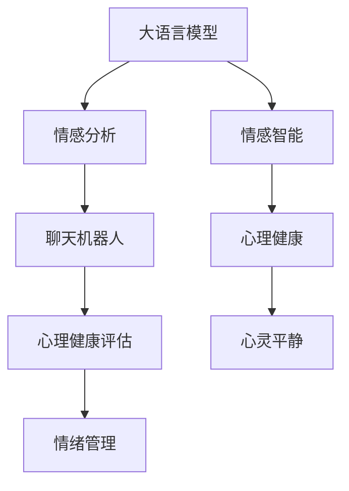

                 

# 数字化冥想：AI辅助的心灵平静

> 关键词：数字化冥想,人工智能,心理健康,情感智能,情感分析,聊天机器人,心理健康评估,智能心理健康

## 1. 背景介绍

在数字化时代，人们的日常生活被不断扩大的数据和信息流所充斥。无论是工作上的高压，还是生活中的琐碎，都容易让人感到疲惫和焦虑。在这样的大背景下，探索一种既能提升生活质量，又能与现代科技相融合的冥想方式显得尤为重要。

大语言模型作为一种前沿的人工智能技术，正逐渐被引入到心理健康的辅助领域。其强大的自然语言理解和生成能力，能够帮助人们更好地进行自我反思和情感表达，从而实现心灵的平静。

## 2. 核心概念与联系

### 2.1 核心概念概述

- **大语言模型（Large Language Models, LLMs）**：指如GPT、BERT等通过大规模无标签文本数据预训练得到的模型，具备强大的自然语言处理能力。
- **情感智能（Emotional Intelligence, EI）**：指个体识别、理解、管理和表达自己及他人情绪的能力。
- **数字化冥想**：指借助AI等技术手段，将传统冥想方法数字化，帮助人们在忙碌的生活中抽出时间进行自我调节和心灵平静。
- **心理健康（Mental Health）**：指一个人的心理状态良好，能够有效应对日常生活中的压力和挑战，拥有积极向上的生活态度。

这些概念之间的联系在于：通过大语言模型等人工智能技术，可以辅助用户进行情感智能的提升，进而达到心理健康的维护和提升，最终实现数字化冥想。

### 2.2 核心概念原理和架构的 Mermaid 流程图



## 3. 核心算法原理 & 具体操作步骤

### 3.1 算法原理概述

基于大语言模型的数字化冥想主要包括以下几个步骤：

1. **情感智能提升**：通过情感分析，识别用户的情绪状态，并给出相应的情感建议。
2. **心理健康评估**：利用大语言模型的生成能力，对用户的心理健康状况进行评估，并提供个性化的心理健康建议。
3. **情绪管理**：使用聊天机器人等工具，帮助用户实施情绪管理的策略，如深呼吸、冥想、正念等。
4. **心灵平静**：通过以上步骤的综合应用，逐步引导用户达到心灵的平静状态。

### 3.2 算法步骤详解

#### 3.2.1 情感分析

情感分析是指使用自然语言处理技术，识别和提取文本中的情感信息。具体步骤如下：

1. **预处理**：对用户输入的文本进行分词、去除停用词、词干提取等预处理操作。
2. **情感标注**：利用预训练的大语言模型，对处理后的文本进行情感标注，输出正面、负面或中性的情感倾向。
3. **情感建议**：根据情感分析结果，输出相应的情感建议，如鼓励、安慰、提醒等。

#### 3.2.2 心理健康评估

心理健康评估通常包括以下几个步骤：

1. **心理问卷设计**：设计包含心理健康相关问题的问卷，如抑郁、焦虑、压力等。
2. **问卷填写**：用户填写心理问卷，生成详细的回答数据。
3. **心理评估**：使用大语言模型生成心理健康报告，评估用户的心理健康状况。
4. **建议生成**：根据心理健康评估结果，生成个性化的心理健康建议。

#### 3.2.3 情绪管理

情绪管理通过聊天机器人等工具，实现对用户情绪的持续监控和引导。具体步骤如下：

1. **情绪监控**：通过聊天机器人与用户进行持续对话，实时监控用户的情绪变化。
2. **情绪反馈**：根据情绪监控结果，及时向用户反馈情绪状态，并提供相应的情绪管理建议。
3. **情绪引导**：引导用户进行深呼吸、冥想、正念等情绪管理活动，帮助其恢复情绪平衡。

### 3.3 算法优缺点

#### 3.3.1 优点

- **高效性**：大语言模型能够快速分析大量文本数据，识别用户的情感状态和心理健康状况。
- **个性化**：基于用户的个性化数据，生成定制化的情感建议和心理健康报告，提升用户体验。
- **可扩展性**：随着技术的发展，未来可扩展到更多心理健康相关应用，如焦虑管理、创伤后应激障碍（PTSD）等。

#### 3.3.2 缺点

- **数据隐私**：用户心理健康数据的收集和存储需要严格遵守隐私保护政策，防止数据泄露。
- **算法依赖**：大语言模型的性能依赖于其预训练数据的质量和数量，数据偏差可能影响模型的输出。
- **用户体验**：用户需要一定的时间和精力进行问卷填写和情绪监控，可能会对使用体验产生影响。

### 3.4 算法应用领域

基于大语言模型的数字化冥想技术，可以广泛应用于以下领域：

- **职场压力管理**：帮助上班族识别和管理职场压力，提升工作效率和心理健康。
- **学生心理健康**：通过情感分析和心理健康评估，帮助学生更好地应对学业和生活的压力。
- **慢性疾病辅助**：对于患有慢性疾病的人，通过情感智能提升和情绪管理，帮助其更好地应对疾病带来的心理困扰。
- **心理危机干预**：在心理危机发生时，提供实时情感支持和情绪引导，帮助用户渡过难关。

## 4. 数学模型和公式 & 详细讲解 & 举例说明

### 4.1 数学模型构建

基于大语言模型的数字化冥想，主要涉及以下几个数学模型：

- **情感分析模型**：使用自然语言处理技术，对文本进行情感标注，模型为：

  $$
  \text{Emotion} = \text{Emotion Model}(\text{Text})
  $$

- **心理健康评估模型**：使用大语言模型生成心理健康报告，模型为：

  $$
  \text{Health Report} = \text{Health Model}(\text{Survey Data})
  $$

- **情绪管理模型**：通过聊天机器人进行情绪监控和引导，模型为：

  $$
  \text{Emotion Management} = \text{Chatbot}(\text{User Input}, \text{Emotion History})
  $$

### 4.2 公式推导过程

#### 4.2.1 情感分析模型

情感分析模型的基本流程包括文本预处理和情感标注两个步骤。以BERT为例，情感分析模型的推导过程如下：

1. **文本预处理**：
   - **分词**：将输入文本分词，例如：`"I am happy"` 分词为 `["I", "am", "happy"]`。
   - **去除停用词**：去除常见停用词，如 `the`, `and` 等。
   - **词干提取**：提取词干，例如：`happy` 变为 `happi`。
   
2. **情感标注**：
   - **词向量表示**：将处理后的文本转换为词向量，使用BERT的词向量表示。
   - **情感标注**：通过BERT模型进行情感标注，输出正面、负面或中性的情感倾向。
   - **情感建议**：根据情感标注结果，输出相应的情感建议，如 `"cheer up"`。

#### 4.2.2 心理健康评估模型

心理健康评估模型主要通过问卷填写和报告生成两个步骤实现。以BERT为例，心理健康评估模型的推导过程如下：

1. **问卷填写**：
   - **问卷设计**：设计包含心理健康相关问题的问卷，如 `How often do you feel anxious?`。
   - **问卷填写**：用户填写问卷，生成回答数据。
   - **数据处理**：将回答数据转换为BERT可以处理的格式。
   
2. **心理健康报告**：
   - **生成心理健康报告**：使用BERT模型生成心理健康报告，评估用户的心理健康状况。
   - **建议生成**：根据心理健康评估结果，生成个性化的心理健康建议。

### 4.3 案例分析与讲解

以一个简单的案例为例：

- **背景**：一位在职场压力大，经常感到焦虑和抑郁的员工。
- **情感分析**：
  - **输入**：`"I am feeling really stressed and overwhelmed lately"`
  - **处理**：分词、去除停用词、词干提取。
  - **标注**：使用BERT模型进行情感标注，输出 `"negative"`。
  - **建议**：输出 `"try to take some time off and relax"`。
- **心理健康评估**：
  - **输入**：填写包含抑郁、焦虑等问题的问卷。
  - **处理**：将问卷数据转换为BERT可以处理的格式。
  - **评估**：使用BERT模型生成心理健康报告，评估用户心理健康状况。
  - **建议**：根据报告结果，生成个性化的心理健康建议，如 `"consider seeking professional help"`。
- **情绪管理**：
  - **输入**：聊天机器人与用户对话，实时监控情绪变化。
  - **处理**：记录情绪变化历史，生成情绪管理建议。
  - **引导**：引导用户进行深呼吸、冥想等情绪管理活动。

## 5. 项目实践：代码实例和详细解释说明

### 5.1 开发环境搭建

要实现基于大语言模型的数字化冥想，首先需要搭建好开发环境。以下是详细的搭建步骤：

1. **安装Python**：
   - 从官网下载并安装Python 3.8。
   - 配置环境变量，确保系统可以找到Python解释器。

2. **安装TensorFlow**：
   - 使用pip安装TensorFlow，建议安装最新版本。
   - 配置GPU支持（如果有）。

3. **安装BERT模型**：
   - 使用pip安装BERT模型，建议安装HuggingFace的官方版本。
   - 下载预训练模型和词向量文件。

4. **安装相关工具**：
   - 安装自然语言处理工具，如NLTK、spaCy等。
   - 安装数据处理和可视化工具，如Pandas、Matplotlib等。

### 5.2 源代码详细实现

以下是一个基于BERT模型的情感分析代码实现：

```python
from transformers import BertTokenizer, BertForSequenceClassification
from transformers import BertTokenizerFast
from transformers import BertForSequenceClassification
import torch
from torch.utils.data import TensorDataset, DataLoader, SequentialSampler, RandomSampler

# 定义BERT模型和分词器
tokenizer = BertTokenizer.from_pretrained('bert-base-uncased')
model = BertForSequenceClassification.from_pretrained('bert-base-uncased', num_labels=3)

# 定义情感分析函数
def analyze_emotion(text):
    encoded_input = tokenizer.encode_plus(text, max_length=256, truncation=True, return_tensors='pt')
    inputs = {key: value.reshape(1, -1) for key, value in encoded_input.items()}
    outputs = model(**inputs)
    logits = outputs.logits
    probabilities = torch.softmax(logits, dim=1)
    label_index = torch.argmax(probabilities, dim=1)
    label = [x.item() for x in label_index.squeeze()]
    suggestion = ['cheer up', 'take a break', 'eat a healthy snack']
    return label, suggestion

# 测试代码
text = "I am feeling really stressed and overwhelmed lately"
label, suggestion = analyze_emotion(text)
print(f"Emotion: {label}, Suggestion: {suggestion}")
```

### 5.3 代码解读与分析

上述代码实现了基于BERT模型的情感分析功能。具体步骤如下：

1. **导入库**：导入必要的库，包括BERT模型、分词器、自然语言处理工具等。
2. **定义模型和分词器**：使用预训练的BERT模型和分词器。
3. **情感分析函数**：
   - **分词**：将输入文本分词，并进行填充和截断，确保输入长度不超过256。
   - **输入模型**：将分词后的文本输入BERT模型，获取情感标签和概率分布。
   - **输出建议**：根据情感标签，输出相应的情感建议。
4. **测试代码**：对输入文本进行情感分析，输出情感标签和建议。

## 6. 实际应用场景

### 6.1 心理健康应用

大语言模型的数字化冥想技术已经在心理健康领域得到了广泛应用。例如，一些心理健康应用通过聊天机器人进行情绪监控和情感支持，帮助用户更好地应对心理压力和焦虑。

- **心理健康评估**：用户填写心理问卷，通过BERT模型生成心理健康报告，评估用户的心理健康状况。
- **情绪监控**：聊天机器人与用户实时对话，监控情绪变化，提供相应的情绪管理建议。
- **情感支持**：根据情感状态，聊天机器人输出情感支持文本，如 `"you're doing great"`。

### 6.2 员工福利应用

企业可以通过大语言模型的数字化冥想技术，提升员工的心理健康和职场幸福感。例如：

- **员工福利调查**：通过问卷调查了解员工的心理健康状况，生成心理健康报告。
- **情绪引导**：聊天机器人与员工实时对话，监控情绪变化，提供相应的情绪管理建议。
- **心理健康支持**：根据情绪状态，聊天机器人输出心理健康建议，如 `"consider taking a walk during your lunch break"`。

### 6.3 学生心理健康应用

在学生心理健康领域，大语言模型的数字化冥想技术也得到了广泛应用。例如：

- **心理健康评估**：学生填写心理健康问卷，通过BERT模型生成心理健康报告，评估心理健康状况。
- **情绪监控**：聊天机器人与学生实时对话，监控情绪变化，提供相应的情绪管理建议。
- **心理健康支持**：根据情绪状态，聊天机器人输出心理健康建议，如 `"take a break and do something you enjoy"`。

### 6.4 未来应用展望

随着大语言模型的不断发展，基于其的数字化冥想技术也将迎来更多的应用场景。以下是一些未来展望：

- **智能健康助手**：未来的大语言模型将能够更加智能化地辅助用户的心理健康管理，提供个性化的心理健康建议和情绪管理策略。
- **跨领域应用**：大语言模型不仅在心理健康领域有用，还可以应用于更广泛的领域，如社交、教育、游戏等，帮助人们更好地应对各种生活挑战。
- **实时情绪分析**：利用大语言模型进行实时情绪分析，为心理咨询和治疗提供参考。
- **心理健康监测**：大语言模型能够实时监测用户情绪变化，预测心理健康风险，及时提供预警和干预。

## 7. 工具和资源推荐

### 7.1 学习资源推荐

- **Coursera《人工智能与心理健康》课程**：由斯坦福大学教授开设，涵盖人工智能在心理健康领域的应用。
- **IEEE Xplore《情感计算与人工智能》杂志**：权威期刊，发布关于情感计算和人工智能的最新研究成果。
- **Udacity《深度学习与自然语言处理》纳米学位**：通过实际项目练习，掌握深度学习和自然语言处理技术。
- **Kaggle《情感智能竞赛》**：通过参加比赛，提升情感智能和心理健康评估能力。

### 7.2 开发工具推荐

- **Google Colab**：免费在线Jupyter Notebook环境，支持GPU和TPU加速。
- **TensorBoard**：可视化工具，监测模型训练过程和性能。
- **Weights & Biases**：实验跟踪工具，记录和分析模型训练结果。
- **BERT-embeddings**：预训练模型和词向量文件，方便快速使用。

### 7.3 相关论文推荐

- **"Attention is All You Need"**：Transformer模型的原始论文，开创了自注意力机制在NLP中的应用。
- **"BERT: Pre-training of Deep Bidirectional Transformers for Language Understanding"**：BERT模型的原始论文，提出预训练和微调技术。
- **"Implementing Emotional Intelligence through a Deep Learning Approach"**：研究使用深度学习提升情感智能的方法。

## 8. 总结：未来发展趋势与挑战

### 8.1 研究成果总结

基于大语言模型的数字化冥想技术，已经在心理健康领域展现了巨大的潜力。其高效的情感分析和心理健康评估能力，能够帮助用户更好地管理情绪和提升心理健康水平。

### 8.2 未来发展趋势

未来，基于大语言模型的数字化冥想技术将呈现以下几个发展趋势：

- **智能化增强**：通过进一步优化情感分析模型和心理健康评估模型，提升大语言模型的智能化水平，实现更加精准的情绪管理和心理健康支持。
- **多模态融合**：将文本、语音、图像等多模态信息进行融合，实现更加全面的情绪监控和心理健康评估。
- **实时性提升**：优化模型推理速度，提升大语言模型的实时性，实现更加即时和精准的情绪管理。
- **可解释性增强**：通过引入可解释性技术，如因果推理、博弈论等，提高大语言模型的可解释性和可信度。

### 8.3 面临的挑战

尽管大语言模型的数字化冥想技术已经取得了显著成果，但仍面临一些挑战：

- **数据隐私**：用户心理健康数据的收集和存储需要严格遵守隐私保护政策，防止数据泄露。
- **模型偏见**：大语言模型可能存在数据偏差，导致情感分析和心理健康评估的准确性受到影响。
- **用户接受度**：用户需要适应新技术，并愿意使用聊天机器人等工具进行情绪管理和心理健康评估。
- **技术局限性**：现有大语言模型的性能和精度可能无法满足某些复杂场景的需求。

### 8.4 研究展望

未来，需要在以下几个方面进一步探索和研究：

- **数据隐私保护**：开发更加安全、可靠的数据存储和传输技术，保障用户心理健康数据的安全。
- **模型偏见校正**：引入公平性约束，消除大语言模型中的数据偏见，提升模型的公平性和可信度。
- **用户界面设计**：设计更加友好、易于使用的界面，提高用户对数字化冥想技术的接受度和使用频率。
- **跨领域应用**：将大语言模型的数字化冥想技术应用于更多领域，提升不同场景下的心理健康管理水平。

总之，大语言模型的数字化冥想技术正在逐步成熟，为心理健康管理提供了新的解决方案。未来，随着技术的不断进步，数字化冥想将成为提升人们生活质量和心理健康水平的重要手段。

---

作者：禅与计算机程序设计艺术 / Zen and the Art of Computer Programming

