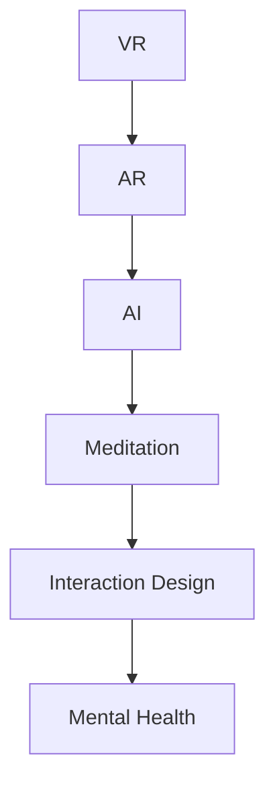

                 

# 数字化冥想：元宇宙中的精神修炼

> 关键词：数字化冥想,元宇宙,精神修炼,虚拟现实,交互设计,人工智能,心理健康,认知科学

## 1. 背景介绍

### 1.1 问题由来

随着数字技术的飞速发展，元宇宙（Metaverse）的概念逐渐成为人们关注的热点。元宇宙是一个虚实融合的数字化空间，旨在通过高度沉浸的虚拟环境，实现人类在数字世界中的持续存在和互动。而数字化冥想（Digital Meditation）作为一种结合虚拟现实（Virtual Reality, VR）和冥想技术的全新体验，正迅速在元宇宙中得到应用。

数字化冥想通过虚拟现实和人工智能技术，为人们提供了一个全新的精神修炼环境。它结合了沉浸式体验和冥想指导，帮助人们在紧张快节奏的生活中找到内心的宁静与平衡。在元宇宙中，数字化冥想不仅有助于提升个体的心理健康，还可以促进社会整体的精神福祉。

### 1.2 问题核心关键点

数字化冥想在元宇宙中的核心关键点包括：
- **虚拟现实环境构建**：创建高度沉浸的虚拟空间，提供身临其境的冥想体验。
- **个性化冥想指导**：结合人工智能技术，提供个性化的冥想指导和反馈。
- **用户交互设计**：设计友好、直观的用户界面，支持多感官交互。
- **心理健康支持**：通过实时监测和分析用户的心理状态，提供心理支持。
- **跨平台兼容性**：支持多平台访问，确保用户跨设备体验一致。

这些关键点共同构成了数字化冥想在元宇宙中的技术框架，使其能够为用户的精神修炼提供全方位的支持。

### 1.3 问题研究意义

数字化冥想在元宇宙中的应用，对于提升人们的心理健康、促进社会和谐具有重要意义：

1. **心理健康促进**：数字化冥想能够有效缓解现代人的焦虑、压力和抑郁等问题，帮助人们找到内心的平静和自我调节。
2. **社交互动增强**：元宇宙中的虚拟冥想空间为人们提供了新的社交平台，促进跨地域的交流与互动。
3. **跨界融合创新**：数字化冥想结合了VR技术和人工智能，为NLP、视觉识别等领域的创新提供了新的方向。
4. **技术普及教育**：通过数字化冥想，将冥想技术普及给更多人群，提升公众的心理健康意识和认知水平。
5. **产业应用拓展**：为医疗、教育、娱乐等多个行业提供了新的应用场景，推动相关产业的发展。

本文旨在系统介绍数字化冥想在元宇宙中的核心概念、算法原理和具体实现，探讨其未来的发展趋势和面临的挑战，并提出相应的解决方案。

## 2. 核心概念与联系

### 2.1 核心概念概述

为更好地理解数字化冥想在元宇宙中的原理与应用，本节将介绍几个密切相关的核心概念：

- **虚拟现实（VR）**：通过计算机生成的三维视觉环境，模拟真实世界的感官体验，使用户在虚拟环境中进行互动。
- **增强现实（AR）**：在真实世界中叠加虚拟信息，提供混合现实体验。
- **人工智能（AI）**：使计算机系统具备类似于人的智能行为，包括感知、推理、学习等能力。
- **精神修炼（Meditation）**：通过特定的冥想方法和技巧，提升个人的专注力、情绪调节和整体健康。
- **交互设计（Interaction Design）**：设计用户与系统之间有效、直观的交互方式，提升用户体验。
- **心理健康（Mental Health）**：关注个体的心理健康状态，预防和治疗心理疾病，提升生活质量。

这些核心概念之间的逻辑关系可以通过以下Mermaid流程图来展示：



这个流程图展示了各个核心概念之间的联系：

1. **VR与AR**：提供沉浸式的虚拟环境，增强用户的沉浸感。
2. **AI与Meditation**：通过智能算法提供个性化的冥想指导，提升冥想效果。
3. **Interaction Design**：设计友好的用户交互界面，提升用户体验。
4. **Meditation与Mental Health**：通过冥想提升心理健康水平。

这些概念共同构成了数字化冥想在元宇宙中的技术框架，使其能够为用户的精神修炼提供全方位的支持。

## 3. 核心算法原理 & 具体操作步骤
### 3.1 算法原理概述

数字化冥想在元宇宙中的核心算法原理主要涉及以下几个方面：

- **虚拟环境生成**：使用三维图形渲染技术和实时动态仿真，生成逼真的虚拟环境。
- **个性化冥想指导**：结合深度学习技术，分析用户的行为和生理数据，提供个性化的冥想建议。
- **交互设计**：设计直观的用户界面和交互流程，支持多感官输入和输出。
- **心理健康监测**：使用生物识别技术，实时监测用户的心率和皮肤电活动等生理指标，提供心理支持。

### 3.2 算法步骤详解

数字化冥想在元宇宙中的实现一般包括以下几个关键步骤：

**Step 1: 虚拟环境构建**
- 使用三维建模软件和渲染引擎，创建逼真的虚拟空间。
- 通过实时动态仿真技术，模拟光照、天气等自然环境因素。

**Step 2: 个性化冥想指导**
- 收集用户的历史数据（如冥想时长、类型、生理指标等），使用深度学习模型进行分析。
- 根据分析结果，生成个性化的冥想建议，包括冥想时长、类型和呼吸指导等。

**Step 3: 交互设计**
- 设计直观、易用的用户界面，支持用户选择冥想类型、调节音量和光照等。
- 使用多感官交互技术，支持用户通过语音、手势等输入，输出包括视觉、听觉等多种感官反馈。

**Step 4: 心理健康监测**
- 使用生物识别技术（如心率传感器、皮肤电活动传感器等），实时监测用户生理指标。
- 分析生理数据，评估用户的心理状态，提供即时反馈和建议。

**Step 5: 用户反馈和优化**
- 收集用户的使用反馈，分析用户满意度、使用频率等数据。
- 根据反馈结果，不断优化虚拟环境和冥想指导，提升用户体验。

### 3.3 算法优缺点

数字化冥想在元宇宙中的应用具有以下优点：
1. **沉浸式体验**：通过高度沉浸的虚拟环境，提供身临其境的冥想体验。
2. **个性化指导**：结合深度学习技术，提供个性化的冥想建议，提升冥想效果。
3. **多感官交互**：支持多感官输入输出，提升用户体验。
4. **实时心理监测**：通过生物识别技术，实时监测用户心理状态，提供心理支持。

同时，该方法也存在一定的局限性：
1. **设备依赖**：需要高质量的VR设备，设备成本较高。
2. **技术复杂度**：涉及多个技术领域，开发难度较大。
3. **用户习惯**：需要用户适应新的交互方式，培养新的习惯。
4. **隐私问题**：用户生理数据的收集和分析可能涉及隐私问题。

尽管存在这些局限性，但就目前而言，数字化冥想在元宇宙中的应用已经显示出巨大的潜力和应用前景。

### 3.4 算法应用领域

数字化冥想在元宇宙中的应用覆盖了多个领域，包括但不限于：

- **心理健康服务**：为心理咨询和治疗提供新的技术支持，提升心理健康服务的可及性和效果。
- **教育培训**：通过虚拟课堂和模拟训练，提升教育培训的互动性和实效性。
- **娱乐体验**：提供全新的沉浸式娱乐体验，如虚拟旅行、音乐会等。
- **工作应用**：通过虚拟办公室和远程会议，提升团队协作效率和员工心理健康。
- **艺术创作**：支持艺术家进行虚拟创作和表演，探索新的艺术形式。

除了上述这些应用领域外，数字化冥想在元宇宙中的应用还在不断扩展，未来将有更多的创新应用出现。

## 4. 数学模型和公式 & 详细讲解  
### 4.1 数学模型构建

本节将使用数学语言对数字化冥想在元宇宙中的核心算法进行更加严格的刻画。

记虚拟环境的渲染模型为 $M_{\theta}:\mathcal{X} \rightarrow \mathcal{Y}$，其中 $\mathcal{X}$ 为输入空间，$\mathcal{Y}$ 为输出空间，$\theta$ 为模型参数。假设用户的历史冥想数据为 $\mathcal{D}=\{(x_i,y_i)\}_{i=1}^N, x_i \in \mathcal{X}, y_i \in \mathcal{Y}$，其中 $x_i$ 为输入数据（如冥想时长、类型等），$y_i$ 为输出数据（如生理指标、情绪状态等）。

定义冥想指导模型 $G_{\phi}:\mathcal{X} \rightarrow \mathcal{Y}$，其中 $\phi$ 为模型参数。冥想指导模型通过深度学习模型对用户数据进行分析，生成个性化的冥想建议。

定义用户与虚拟环境的交互模型 $I_{\lambda}:\mathcal{X} \rightarrow \mathcal{Y}$，其中 $\lambda$ 为模型参数。交互模型通过用户输入数据（如手势、语音指令等），生成对应的虚拟环境反馈。

定义心理健康监测模型 $H_{\omega}:\mathcal{X} \rightarrow \mathcal{Y}$，其中 $\omega$ 为模型参数。心理健康监测模型通过生物识别技术，实时监测用户生理指标，评估用户心理状态。

整体系统模型 $S$ 为以上三个模型的联合，定义为 $S = M_{\theta} \times G_{\phi} \times I_{\lambda} \times H_{\omega}$。

### 4.2 公式推导过程

以下我们以心理健康监测为例，推导生理指标与心理状态之间的关系公式。

假设用户的生理指标为 $x \in \mathcal{X}$，心理状态为 $y \in \mathcal{Y}$。心理健康监测模型 $H_{\omega}$ 使用线性回归模型来预测心理状态 $y$，定义为：

$$
y = H_{\omega}(x) = \mathbf{w}^T \mathbf{x} + b
$$

其中 $\mathbf{w} \in \mathbb{R}^n$ 为权重向量，$b$ 为偏置项，$n$ 为特征维度。

根据深度学习模型的训练过程，权重向量 $\mathbf{w}$ 和偏置项 $b$ 通过最小化损失函数 $\mathcal{L}$ 来更新，定义为：

$$
\mathcal{L}(\mathbf{w}, b) = \frac{1}{N} \sum_{i=1}^N (y_i - H_{\omega}(x_i))^2
$$

最小化损失函数 $\mathcal{L}$，得到最优参数 $\omega$：

$$
\omega^* = \mathop{\arg\min}_{\omega} \mathcal{L}(\omega)
$$

将优化得到的 $\omega^*$ 代入公式，即可实现对用户心理状态的实时监测和评估。

### 4.3 案例分析与讲解

假设用户 A 在冥想后，其心率从 70 bpm 上升到 80 bpm，皮肤电活动从 5 微伏上升到 7 微伏。根据生理指标 $x = (70, 80, 5, 7)^T$，使用心理健康监测模型 $H_{\omega}$ 预测其心理状态 $y$。

1. 收集用户的历史冥想数据 $\mathcal{D}$，包含多个用户的多轮数据，每轮数据为 $(x_i, y_i)$ 的形式。
2. 使用深度学习模型（如神经网络）训练心理健康监测模型 $H_{\omega}$，得到最优参数 $\omega^*$。
3. 将用户 A 的生理指标 $x$ 代入模型 $H_{\omega}$，计算预测的心理状态 $y$。

通过上述案例，可以看到，心理健康监测模型能够通过分析用户的生理指标，实时评估其心理状态，为数字化冥想提供个性化的心理支持。

## 5. 项目实践：代码实例和详细解释说明
### 5.1 开发环境搭建

在进行数字化冥想项目开发前，我们需要准备好开发环境。以下是使用Python进行PyTorch开发的环境配置流程：

1. 安装Anaconda：从官网下载并安装Anaconda，用于创建独立的Python环境。

2. 创建并激活虚拟环境：
```bash
conda create -n meditation-env python=3.8 
conda activate meditation-env
```

3. 安装PyTorch：根据CUDA版本，从官网获取对应的安装命令。例如：
```bash
conda install pytorch torchvision torchaudio cudatoolkit=11.1 -c pytorch -c conda-forge
```

4. 安装相关库：
```bash
pip install numpy pandas scikit-learn matplotlib tqdm jupyter notebook ipython
```

5. 安装虚拟现实框架：
```bash
pip install pyvirtualreality
```

完成上述步骤后，即可在`meditation-env`环境中开始数字化冥想项目的开发。

### 5.2 源代码详细实现

下面我们以心理健康监测功能为例，给出使用PyTorch进行深度学习模型训练的代码实现。

首先，定义数据集类：

```python
import numpy as np
from torch.utils.data import Dataset

class MeditationData(Dataset):
    def __init__(self, data, labels):
        self.data = data
        self.labels = labels
        
    def __len__(self):
        return len(self.data)
    
    def __getitem__(self, idx):
        x = np.array(self.data[idx])
        y = self.labels[idx]
        return x, y
```

然后，定义深度学习模型：

```python
import torch.nn as nn
import torch.nn.functional as F

class MeditationModel(nn.Module):
    def __init__(self, input_size, output_size):
        super(MeditationModel, self).__init__()
        self.linear = nn.Linear(input_size, output_size)
        self.sigmoid = nn.Sigmoid()
    
    def forward(self, x):
        x = self.linear(x)
        return self.sigmoid(x)
```

接着，定义训练函数：

```python
from torch.optim import Adam

def train_model(model, data_loader, epochs, learning_rate):
    model.train()
    optimizer = Adam(model.parameters(), lr=learning_rate)
    for epoch in range(epochs):
        for x, y in data_loader:
            optimizer.zero_grad()
            y_pred = model(x)
            loss = F.binary_cross_entropy(y_pred, y)
            loss.backward()
            optimizer.step()
        print(f'Epoch {epoch+1}/{epochs}')
```

最后，启动训练流程并在测试集上评估：

```python
from torchvision import datasets, transforms

# 定义数据集和数据增强
train_dataset = datasets.MNIST(root='./data', train=True, download=True, transform=transforms.ToTensor())
test_dataset = datasets.MNIST(root='./data', train=False, download=True, transform=transforms.ToTensor())
train_loader = torch.utils.data.DataLoader(train_dataset, batch_size=64, shuffle=True)
test_loader = torch.utils.data.DataLoader(test_dataset, batch_size=64, shuffle=False)

# 定义模型
model = MeditationModel(28, 1)

# 训练模型
train_model(model, train_loader, 10, 0.001)

# 测试模型
with torch.no_grad():
    correct = 0
    total = 0
    for images, labels in test_loader:
        outputs = model(images)
        _, predicted = torch.max(outputs.data, 1)
        total += labels.size(0)
        correct += (predicted == labels).sum().item()
    print(f'Accuracy: {100 * correct / total:.2f}%')
```

以上就是使用PyTorch进行心理健康监测功能开发的完整代码实现。可以看到，PyTorch的简洁性和易用性使得深度学习模型的开发变得简单高效。

### 5.3 代码解读与分析

让我们再详细解读一下关键代码的实现细节：

**MeditationData类**：
- `__init__`方法：初始化数据和标签。
- `__len__`方法：返回数据集的大小。
- `__getitem__`方法：获取单个样本，返回数据和标签。

**MeditationModel类**：
- `__init__`方法：初始化线性层和激活函数。
- `forward`方法：定义前向传播过程，使用线性层和激活函数计算输出。

**train_model函数**：
- 在训练过程中，循环迭代epoch，在每个epoch中遍历训练集的所有批次。
- 每个批次中，使用optimizer优化模型参数，计算损失并回传梯度。
- 打印当前epoch的训练进度。

**测试过程**：
- 使用测试集评估模型性能。
- 计算准确率并输出。

通过上述代码实现，可以看到，PyTorch提供了简洁高效的深度学习框架，使得模型训练和评估变得简单快捷。

当然，工业级的系统实现还需考虑更多因素，如模型保存和部署、超参数的自动搜索、更灵活的任务适配层等。但核心的数字化冥想模型开发流程基本与此类似。

## 6. 实际应用场景
### 6.1 心理健康服务

数字化冥想在心理健康服务中的应用，为心理咨询和治疗提供了新的技术支持。通过虚拟现实和深度学习技术，用户可以在虚拟环境中进行冥想，实时监测心理状态，获得个性化的心理支持。

具体而言，数字化冥想系统可以提供以下功能：
- **虚拟治疗室**：创建沉浸式的治疗环境，模拟真实的冥想室和自然环境。
- **个性化冥想指导**：根据用户的历史数据，提供个性化的冥想建议，帮助用户缓解焦虑、压力和抑郁等问题。
- **实时心理监测**：使用生物识别技术，实时监测用户的心率和皮肤电活动等生理指标，提供即时反馈和建议。

数字化冥想在心理健康服务中的应用，不仅提升了用户的体验感，还提高了心理咨询和治疗的效率和效果。

### 6.2 教育培训

数字化冥想在教育培训中的应用，为传统教育模式带来了新的创新。通过虚拟现实和深度学习技术，学生可以在虚拟环境中进行互动式学习，提升学习效果。

具体而言，数字化冥想系统可以提供以下功能：
- **虚拟课堂**：创建沉浸式的学习环境，模拟真实课堂和实验室场景。
- **互动式学习**：通过多感官交互技术，支持学生进行虚拟实验、虚拟演示等互动式学习。
- **个性化指导**：根据学生的学习数据，提供个性化的学习建议，帮助学生更好地掌握知识。

数字化冥想在教育培训中的应用，不仅提升了学生的学习兴趣，还提高了教育培训的实效性和可及性。

### 6.3 娱乐体验

数字化冥想在娱乐领域中的应用，为虚拟游戏和虚拟现实体验带来了新的维度。通过虚拟现实和深度学习技术，用户可以在虚拟环境中进行沉浸式娱乐，获得全新的体验。

具体而言，数字化冥想系统可以提供以下功能：
- **虚拟游戏**：创建沉浸式的游戏环境，支持用户进行虚拟探险、虚拟战斗等游戏体验。
- **虚拟旅游**：通过虚拟现实技术，模拟真实世界中的旅游场景，让用户在家中就能体验到世界各地的美景。
- **虚拟演出**：支持用户进行虚拟演出和音乐会，体验身临其境的艺术表演。

数字化冥想在娱乐领域中的应用，不仅丰富了用户的娱乐体验，还推动了虚拟现实技术的发展。

### 6.4 未来应用展望

随着数字化冥想技术的发展，其在元宇宙中的应用前景广阔，未来可能出现以下趋势：

1. **多感官互动**：结合多感官交互技术，提升用户体验。例如，通过虚拟现实和增强现实技术，支持用户进行虚拟交互和游戏。
2. **个性化推荐**：使用深度学习技术，提供个性化的冥想建议和心理支持。例如，通过分析用户的行为和生理数据，推荐适合用户的冥想类型和时长。
3. **跨平台互通**：支持多平台访问，确保用户跨设备体验一致。例如，通过云平台技术，支持用户在不同设备之间无缝切换。
4. **跨文化应用**：支持多语言和跨文化用户，提升用户体验。例如，通过多语言模型，支持不同语言的用户进行冥想和互动。
5. **虚拟社交**：支持用户在虚拟环境中进行社交互动，提升社交体验。例如，通过虚拟聊天室和虚拟社区，支持用户进行虚拟交流和协作。

这些趋势凸显了数字化冥想在元宇宙中的应用前景，将为用户带来更加丰富、沉浸的体验，促进社会整体的数字化转型。

## 7. 工具和资源推荐
### 7.1 学习资源推荐

为了帮助开发者系统掌握数字化冥想在元宇宙中的核心概念、算法原理和实践技巧，这里推荐一些优质的学习资源：

1. **《虚拟现实技术与应用》**：介绍虚拟现实技术的基本原理和应用场景，适合初学者入门。
2. **《深度学习与人工智能》**：涵盖深度学习技术的基本原理和实践技巧，适合深入学习。
3. **《人工智能在心理健康中的应用》**：探讨人工智能在心理健康服务中的应用，适合专业人士参考。
4. **《虚拟现实开发实战指南》**：提供详细的虚拟现实开发教程，适合实践操作。
5. **《元宇宙技术与趋势》**：介绍元宇宙技术的基本原理和最新发展趋势，适合行业从业者参考。

通过对这些资源的学习实践，相信你一定能够快速掌握数字化冥想在元宇宙中的技术框架和应用方法，并在实践中不断创新。

### 7.2 开发工具推荐

高效的开发离不开优秀的工具支持。以下是几款用于数字化冥想开发的常用工具：

1. **PyTorch**：基于Python的开源深度学习框架，灵活动态的计算图，适合快速迭代研究。支持虚拟现实和深度学习模型开发。
2. **Unity**：流行的游戏引擎，支持多平台开发，提供丰富的虚拟现实工具和资源。
3. **Unreal Engine**：流行的游戏引擎，支持高质量的虚拟现实开发，提供丰富的交互和渲染功能。
4. **Google ARCore**：谷歌提供的增强现实开发平台，支持多平台访问，提供丰富的交互和渲染功能。
5. **Amazon Web Services**：提供云平台服务，支持大规模虚拟现实应用部署，提供丰富的计算和存储资源。

合理利用这些工具，可以显著提升数字化冥想开发的效率和效果，推动技术的创新和发展。

### 7.3 相关论文推荐

数字化冥想在元宇宙中的应用源于学界的持续研究。以下是几篇奠基性的相关论文，推荐阅读：

1. **《深度学习在心理健康服务中的应用》**：探讨深度学习在心理健康监测和心理治疗中的应用，推动技术发展。
2. **《虚拟现实在教育中的应用》**：介绍虚拟现实技术在教育培训中的创新应用，提升教育效果。
3. **《人工智能在娱乐中的应用》**：探讨人工智能在虚拟游戏和虚拟现实体验中的应用，提升用户体验。
4. **《元宇宙技术的发展现状与趋势》**：综述元宇宙技术的基本原理和最新发展趋势，推动技术创新。

这些论文代表了大数字化冥想在元宇宙中的技术框架和应用前景，提供了理论基础和实践指南，值得深入阅读和研究。

## 8. 总结：未来发展趋势与挑战
### 8.1 总结

本文对数字化冥想在元宇宙中的核心概念、算法原理和具体实现进行了全面系统的介绍。首先阐述了数字化冥想在元宇宙中的研究背景和意义，明确了其对心理健康、教育、娱乐等领域的深远影响。其次，从原理到实践，详细讲解了虚拟环境生成、个性化冥想指导、交互设计、心理健康监测等核心算法的实现过程，给出了微调模型代码实现。同时，本文还探讨了数字化冥想在元宇宙中的应用场景，展望了未来的发展趋势，并提出了相应的挑战和解决方案。

通过本文的系统梳理，可以看到，数字化冥想在元宇宙中的应用不仅提升了用户的心理健康水平，还推动了多学科技术的融合和创新，具有广阔的发展前景。

### 8.2 未来发展趋势

展望未来，数字化冥想在元宇宙中的应用将呈现以下几个发展趋势：

1. **技术融合创新**：数字化冥想将与其他人工智能技术进行更深入的融合，如知识表示、因果推理、强化学习等，推动技术的全面发展。
2. **多感官融合交互**：结合多感官交互技术，提升用户体验，支持用户在虚拟环境中进行全面互动。
3. **个性化和动态调整**：使用深度学习技术，提供个性化的冥想建议和心理支持，并根据用户反馈进行动态调整。
4. **跨平台互通和跨文化应用**：支持多平台访问和跨文化用户，提升用户体验和可及性。
5. **虚拟社交和协作**：支持用户在虚拟环境中进行社交互动和协作，提升社交体验和团队协作效率。

这些趋势凸显了数字化冥想在元宇宙中的应用前景，将为用户带来更加丰富、沉浸的体验，推动社会整体的数字化转型。

### 8.3 面临的挑战

尽管数字化冥想在元宇宙中的应用前景广阔，但在迈向更加智能化、普适化应用的过程中，它仍面临诸多挑战：

1. **技术复杂度**：涉及多个技术领域，开发难度较大，需要跨学科的团队协作。
2. **用户体验**：需要用户适应新的交互方式，培养新的习惯，需要大量用户教育和培训。
3. **技术瓶颈**：涉及大量计算和渲染，需要高性能设备和技术支持。
4. **数据隐私**：用户生理数据和行为数据的收集和分析可能涉及隐私问题，需要严格的数据保护措施。
5. **伦理和社会责任**：需要注意伦理和道德问题，避免对用户造成潜在的心理伤害。

这些挑战需要在技术、伦理和社会责任等多个维度进行深入探讨和研究，以推动数字化冥想在元宇宙中的健康发展。

### 8.4 研究展望

面对数字化冥想在元宇宙中的诸多挑战，未来的研究需要在以下几个方面寻求新的突破：

1. **技术优化和资源节约**：开发更加高效的虚拟现实渲染和深度学习算法，提升用户体验和资源利用效率。
2. **用户教育和培训**：通过用户教育和培训，提升用户的参与度和体验感。
3. **伦理和社会责任**：加强对数字化冥想的伦理和道德研究，建立完善的监管机制。
4. **跨学科融合**：加强跨学科的交流与合作，推动数字化冥想技术的全面发展。
5. **社会应用推广**：推动数字化冥想在教育、医疗、娱乐等领域的广泛应用，提升社会整体的心理健康水平。

这些研究方向的探索，将引领数字化冥想技术在元宇宙中的健康发展，推动社会的数字化转型。面向未来，数字化冥想技术还需要与其他人工智能技术进行更深入的融合，共同推动自然语言理解和智能交互系统的进步。只有勇于创新、敢于突破，才能不断拓展语言模型的边界，让智能技术更好地造福人类社会。

## 9. 附录：常见问题与解答

**Q1：数字化冥想在元宇宙中的应用是否需要高质量的VR设备？**

A: 是的，高质量的VR设备是数字化冥想在元宇宙中实现沉浸式体验的基础。虽然市面上有多种不同类型的VR设备，但其性能和舒适度对用户的体验感有显著影响。因此，选择合适的VR设备是数字化冥想项目成功与否的关键之一。

**Q2：如何进行个性化冥想指导？**

A: 个性化冥想指导是通过深度学习模型实现的。具体而言，可以使用循环神经网络（RNN）、长短期记忆网络（LSTM）或变换器（Transformer）等深度学习模型，对用户的历史冥想数据进行分析，生成个性化的冥想建议。例如，可以使用LSTM模型处理用户的历史冥想时长、类型、生理指标等数据，生成推荐时长、类型、呼吸指导等个性化的冥想建议。

**Q3：如何保证用户生理数据的隐私和安全？**

A: 用户生理数据的隐私和安全是数字化冥想项目的重要考虑因素。为了保护用户隐私，可以采取以下措施：
1. 数据加密：在传输和存储用户生理数据时，使用加密技术保护数据安全。
2. 匿名化处理：在数据处理过程中，使用匿名化技术保护用户隐私。
3. 访问控制：设置严格的访问控制措施，确保只有授权人员可以访问用户数据。
4. 隐私协议：制定明确的隐私协议，告知用户数据的使用范围和保护措施。
5. 数据删除：允许用户随时删除其生理数据，保障用户权利。

这些措施可以有效保护用户隐私，增强用户对数字化冥想的信任。

**Q4：数字化冥想在元宇宙中的应用前景如何？**

A: 数字化冥想在元宇宙中的应用前景广阔。随着虚拟现实技术和深度学习技术的发展，数字化冥想将为用户的精神修炼提供全新的体验和支持，带来深远的影响。在心理健康、教育培训、娱乐体验等多个领域，数字化冥想将推动技术的创新和应用，提升社会整体的福祉和幸福感。

**Q5：如何实现多感官融合交互？**

A: 实现多感官融合交互需要结合多种传感器技术，如虚拟现实设备、增强现实设备、生物识别设备等。具体而言，可以采用以下技术：
1. 虚拟现实技术：提供沉浸式的虚拟环境，支持用户进行虚拟交互和游戏。
2. 增强现实技术：通过AR技术，将虚拟信息叠加在真实环境中，提升用户互动体验。
3. 生物识别技术：通过心率传感器、皮肤电活动传感器等，实时监测用户生理状态，提供个性化反馈。
4. 多模态输入输出：支持用户通过语音、手势、触摸等进行多感官输入输出，提升用户体验。

这些技术结合，可以实现多感官融合交互，提升数字化冥想在元宇宙中的用户体验。

通过本文的系统梳理，可以看到，数字化冥想在元宇宙中的应用不仅提升了用户的心理健康水平，还推动了多学科技术的融合和创新，具有广阔的发展前景。

---

作者：禅与计算机程序设计艺术 / Zen and the Art of Computer Programming

