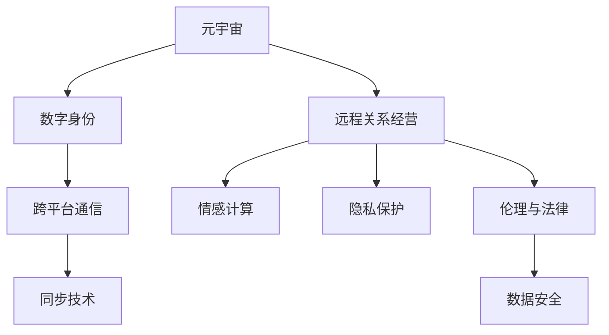

                 

# 数字化恋爱指南:元宇宙中的远程关系经营

## 1. 背景介绍

### 1.1 问题由来
随着数字技术和元宇宙的兴起，人们对于虚拟空间和数字身份的接受度日益提高。元宇宙提供了前所未有的社交与互动环境，使得远程关系经营成为可能。然而，在这样一个数字化、虚拟化的环境中，如何维持和发展稳定的关系，成为一项亟待解决的问题。数字化恋爱，即在虚拟空间中的远程关系经营，不仅关乎情感的维系，还涉及技术、伦理等多个维度。

### 1.2 问题核心关键点
数字化恋爱的核心在于如何利用数字技术和元宇宙平台，保持和发展远程关系。关键点包括：
- 虚拟空间和数字身份的创建与管理。
- 跨平台的通信与同步技术。
- 情感交流的数字化表达与理解。
- 隐私保护与数据安全。
- 伦理道德与法律规范。

## 2. 核心概念与联系

### 2.1 核心概念概述

为更好地理解数字化恋爱在元宇宙中的应用，本节将介绍几个密切相关的核心概念：

- **元宇宙**：一种通过数字技术创建并持续发展、身临其境的虚拟空间，提供社交、娱乐、工作等多种场景。
- **数字身份**：用户在元宇宙中的虚拟形象和行为记录，通常由用户自行创建和维护。
- **远程关系经营**：指在虚拟空间或数字世界中，通过网络通信、虚拟互动等方式维持和发展与他人的关系。
- **情感计算**：研究如何通过技术手段捕捉、分析、理解并生成情感，以提升人机交互质量。
- **隐私保护**：在数字化恋爱中，保护用户隐私和数据安全，防止信息泄露和滥用。
- **伦理与法律**：在元宇宙和数字化恋爱中，如何确保伦理道德与法律规范的遵守，保护用户的权益。

这些核心概念之间的逻辑关系可以通过以下Mermaid流程图来展示：



这个流程图展示了大语言模型的核心概念及其之间的关系：

1. 元宇宙是虚拟空间的基础，数字身份在其中得以创建和互动。
2. 远程关系经营依托于元宇宙平台和数字身份，通过通信和同步技术实现。
3. 情感计算用于捕捉和理解情感表达，提升互动质量。
4. 隐私保护和数据安全是远程关系经营中的重要考量。
5. 伦理与法律规范在数字化恋爱中至关重要，确保行为的合规性。

## 3. 核心算法原理 & 具体操作步骤
### 3.1 算法原理概述

数字化恋爱的核心在于通过数字技术和元宇宙平台，实现跨空间、跨时间的远程情感交流。其算法原理可以归纳为以下几点：

1. **数字身份创建与维护**：用户在元宇宙中创建并维护数字身份，包括外观、性格、行为等属性，这些属性构成用户与他人互动的基础。
2. **跨平台通信与同步**：通过分布式网络技术，实现不同平台间的无缝连接与数据同步，保障远程关系中信息的实时传递。
3. **情感表达与理解**：利用情感计算技术，捕捉用户在不同场景下的情感状态，并通过算法理解并生成相应的情感回应，提升交互体验。
4. **隐私保护与数据安全**：采用加密、访问控制等技术手段，确保用户隐私和数据安全，防止信息泄露和滥用。
5. **伦理与法律合规性**：建立行为规范和法律框架，确保数字化恋爱中各方的权益得到保护，防止滥用和侵害。

### 3.2 算法步骤详解

数字化恋爱的具体操作步骤如下：

**Step 1: 创建和管理数字身份**
- 用户选择元宇宙平台（如VRChat、Slack Spaces等）创建数字身份。
- 设定数字身份的外观、性格、兴趣等属性，确保其与现实中的自我一致。
- 设计数字身份的行为模式，如习惯、偏好等，以模拟真实的社交互动。

**Step 2: 建立远程关系**
- 在元宇宙中寻找或邀请现实中的亲友加入，共同创建虚拟空间或参与活动。
- 通过跨平台通信技术，实时分享和传递语音、文字、视频等信息，保持联系。
- 设定虚拟空间的环境和规则，确保互动的和谐与秩序。

**Step 3: 情感交流与互动**
- 利用情感计算技术，捕捉用户在不同场景下的情感状态，如高兴、愤怒、悲伤等。
- 通过算法理解情感，生成相应的回应，如安慰、鼓励、同情等，提升互动质量。
- 利用虚拟礼物、虚拟拥抱等形式，表达情感和关怀。

**Step 4: 隐私保护与数据安全**
- 采用加密技术，确保通信和数据传输的安全性。
- 设置访问控制，限制他人访问数字身份和数据。
- 定期进行数据备份和恢复，防止数据丢失。

**Step 5: 伦理与法律合规性**
- 遵守元宇宙平台的使用规则和法律条文，确保行为的合规性。
- 尊重他人隐私和选择，避免滥用和侵害。
- 定期更新法律法规，确保数字化恋爱的健康发展。

### 3.3 算法优缺点

数字化恋爱的算法有以下优点：

1. **时空自由**：数字技术和元宇宙平台突破了现实空间的限制，允许用户在任何时间和地点进行互动。
2. **丰富多样**：数字身份和虚拟空间的多样性，提供了丰富的互动形式和内容，满足不同用户的需求。
3. **隐私保护**：通过加密和访问控制技术，保护用户的隐私和数据安全。
4. **灵活性**：算法可以根据用户情感和行为模式，生成个性化的回应，提升互动体验。

同时，该算法也存在一定的局限性：

1. **技术依赖**：对数字技术和元宇宙平台的依赖，可能导致技术问题影响互动效果。
2. **情感理解误差**：情感计算技术可能存在误判，影响情感交流的真实性。
3. **伦理法律挑战**：数字化恋爱中的行为规范和法律问题尚待明确，可能存在伦理道德风险。
4. **社会信任度**：虚拟环境中的互动缺乏现实中的信任感和真实性，可能影响长期关系的发展。

## 4. 数学模型和公式 & 详细讲解  
### 4.1 数学模型构建

数字化恋爱的数学模型可以基于以下几个关键维度构建：

- **数字身份属性建模**：通过数学模型捕捉数字身份的外观、性格、兴趣等属性，确保其与现实自我的一致性。
- **情感状态建模**：通过数学模型捕捉和分析用户的情感状态，如高兴、愤怒、悲伤等。
- **互动行为建模**：通过数学模型预测用户在不同情境下的行为模式，提升互动质量。
- **隐私保护与数据安全建模**：通过数学模型设计和实现加密和访问控制技术，保障用户数据的安全性。
- **伦理与法律合规性建模**：通过数学模型制定和评估行为规范和法律条文，确保数字化恋爱的合规性。

### 4.2 公式推导过程

以情感状态建模为例，假设用户的情感状态由多种因素决定，包括环境、互动对象、个人历史等。则情感状态 $E$ 可以表示为：

$$
E = f(\text{环境} + \text{互动对象} + \text{个人历史})
$$

其中 $f$ 为情感状态的计算函数。对于情感计算技术，可以使用机器学习模型，如神经网络、决策树等，来捕捉和分析用户的情感状态。例如，利用卷积神经网络（CNN）对情感表达进行处理，通过特征提取和分类算法，捕捉用户的情感状态。

### 4.3 案例分析与讲解

以情感计算为例，假设有两个用户在元宇宙中互动，通过捕捉和分析用户的语音、文字、面部表情等信息，可以计算出用户的情感状态。例如，利用CNN对用户的语音进行分析，提取情感特征，通过分类算法识别出用户是高兴还是悲伤。然后，根据情感状态，生成相应的回应，如安慰、鼓励等，提升互动体验。

## 5. 项目实践：代码实例和详细解释说明
### 5.1 开发环境搭建

在进行数字化恋爱的实践前，我们需要准备好开发环境。以下是使用Python进行PyTorch开发的环境配置流程：

1. 安装Anaconda：从官网下载并安装Anaconda，用于创建独立的Python环境。

2. 创建并激活虚拟环境：
```bash
conda create -n pytorch-env python=3.8 
conda activate pytorch-env
```

3. 安装PyTorch：根据CUDA版本，从官网获取对应的安装命令。例如：
```bash
conda install pytorch torchvision torchaudio cudatoolkit=11.1 -c pytorch -c conda-forge
```

4. 安装TensorFlow：
```bash
pip install tensorflow
```

5. 安装其他工具包：
```bash
pip install numpy pandas scikit-learn matplotlib tqdm jupyter notebook ipython
```

完成上述步骤后，即可在`pytorch-env`环境中开始实践。

### 5.2 源代码详细实现

这里我们以情感计算为例，给出使用TensorFlow进行情感状态识别的PyTorch代码实现。

首先，定义情感状态数据集：

```python
import tensorflow as tf
import numpy as np
from sklearn.model_selection import train_test_split
from tensorflow.keras.models import Sequential
from tensorflow.keras.layers import Dense, Dropout, Activation
from tensorflow.keras.optimizers import Adam

# 假设我们有一个情感数据集，包含语音、文字、表情等信息
# 数据集格式为 (语音特征, 文字特征, 表情特征)

# 加载数据集
data = ...

# 分割训练集和验证集
train_data, valid_data = train_test_split(data, test_size=0.2)

# 构建模型
model = Sequential()
model.add(Dense(64, input_dim=100))
model.add(Activation('relu'))
model.add(Dropout(0.5))
model.add(Dense(2))
model.add(Activation('softmax'))

# 编译模型
model.compile(loss='categorical_crossentropy',
              optimizer=Adam(lr=0.001),
              metrics=['accuracy'])

# 训练模型
model.fit(train_data, epochs=10, batch_size=32, validation_data=valid_data)
```

然后，定义情感状态识别函数：

```python
def predict_emotion(input_data):
    # 对输入数据进行预处理
    preprocessed_data = ...

    # 进行情感状态预测
    predictions = model.predict(preprocessed_data)

    # 根据预测结果，生成相应的情感回应
    emotion = ...
    response = ...

    return response
```

最后，启动情感状态识别流程：

```python
# 获取用户输入的语音、文字、表情等信息
user_input = ...

# 调用情感状态识别函数
response = predict_emotion(user_input)

# 生成回应
print(response)
```

以上就是使用TensorFlow进行情感状态识别的完整代码实现。可以看到，TensorFlow提供了丰富的模型构建和训练工具，可以方便地实现情感计算等功能的开发。

### 5.3 代码解读与分析

让我们再详细解读一下关键代码的实现细节：

**情感状态数据集**：
- 定义了情感状态数据集的格式，包括语音、文字、表情等信息。
- 通过Scikit-learn的train_test_split方法，将数据集分割为训练集和验证集。

**模型构建**：
- 使用TensorFlow的Sequential模型，构建了一个简单的神经网络，包含一个全连接层、ReLU激活函数、Dropout层和一个输出层。
- 使用Adam优化器和交叉熵损失函数进行模型训练，并记录训练过程中的准确率。

**情感状态识别函数**：
- 对用户输入的数据进行预处理，如特征提取、归一化等。
- 调用训练好的模型进行情感状态预测，并根据预测结果生成相应的情感回应。
- 返回情感回应。

**情感状态识别流程**：
- 获取用户输入的语音、文字、表情等信息。
- 调用情感状态识别函数，获取情感回应。
- 输出情感回应。

可以看到，TensorFlow提供了从数据集构建、模型训练到情感状态识别的一站式解决方案，大大简化了开发过程。

当然，工业级的系统实现还需考虑更多因素，如情感回应的生成、用户界面的友好性、系统的稳定性等。但核心的情感计算技术基本与此类似。

## 6. 实际应用场景
### 6.1 虚拟约会平台

数字化恋爱在虚拟约会平台中的应用，为用户提供了更加丰富和便捷的交友方式。传统约会方式受地域限制，见面难，约会的频率也受到时间和精力的制约。而虚拟约会平台，允许用户在虚拟空间中进行互动和约会，不受地域和时间的限制。

在技术实现上，可以开发基于元宇宙的虚拟约会应用，允许用户创建和管理数字身份，选择虚拟环境和活动。系统根据用户的情感状态和互动行为，生成个性化的约会建议和互动内容，提升用户体验。同时，通过隐私保护和伦理合规性技术，确保用户隐私和数据安全，避免滥用和侵害。

### 6.2 远程协作平台

数字化恋爱还可以应用于远程协作平台，帮助团队成员在虚拟空间中进行沟通和协作。在传统的工作环境中，远程团队容易产生沟通障碍和协作困难，而虚拟协作平台可以通过情感计算技术，捕捉和理解团队成员的情感状态，生成个性化的支持和反馈，提升团队协作的效率和质量。

系统可以根据团队成员的情感状态，生成相应的支持和反馈，如鼓励、安慰、提醒等。同时，利用跨平台通信技术，确保信息的实时传递和同步，提升远程协作的效果。通过隐私保护和伦理合规性技术，保障团队成员的隐私和数据安全，防止信息泄露和滥用。

### 6.3 心理辅导平台

数字化恋爱在心理辅导平台中的应用，为用户提供心理支持和情感关怀。在现代快节奏的生活中，许多人面临着压力和困扰，需要心理辅导和情感支持。心理辅导平台可以利用情感计算技术，捕捉用户的情感状态，生成个性化的心理支持和建议，帮助用户缓解压力和困扰。

系统可以根据用户的情感状态，生成相应的心理支持和建议，如放松技巧、情感表达、心理建议等。同时，通过跨平台通信技术，允许用户与心理专家进行实时互动和沟通，提升心理辅导的效果。通过隐私保护和伦理合规性技术，保障用户的隐私和数据安全，防止信息泄露和滥用。

### 6.4 未来应用展望

随着数字化恋爱的不断演进，其应用场景将更加丰富和多样。未来，数字化恋爱有望在以下领域得到应用：

1. **虚拟教育**：利用情感计算技术，捕捉学生的情感状态，生成个性化的教学支持和反馈，提升学习效果。
2. **虚拟旅游**：创建虚拟旅游平台，利用情感计算技术，捕捉游客的情感状态，生成个性化的旅游建议和体验，提升旅游体验。
3. **虚拟购物**：开发虚拟购物平台，利用情感计算技术，捕捉用户的情感状态，生成个性化的购物建议和体验，提升购物体验。
4. **虚拟旅行**：创建虚拟旅行平台，利用情感计算技术，捕捉用户的情感状态，生成个性化的旅行建议和体验，提升旅行体验。
5. **虚拟商务**：开发虚拟商务平台，利用情感计算技术，捕捉商务人员的情感状态，生成个性化的商务支持和建议，提升商务效果。

数字化恋爱在元宇宙中的应用前景广阔，将进一步推动数字化、虚拟化的生活方式和社会形态的变革。

## 7. 工具和资源推荐
### 7.1 学习资源推荐

为了帮助开发者系统掌握数字化恋爱在元宇宙中的应用，这里推荐一些优质的学习资源：

1. **《元宇宙与虚拟现实》课程**：由斯坦福大学开设的虚拟现实课程，涵盖虚拟现实、元宇宙等领域的最新研究进展和应用案例。
2. **《情感计算与人工智能》书籍**：介绍情感计算的基本原理和应用，结合人工智能技术，提升人机交互的质量和情感体验。
3. **《元宇宙技术手册》**：详细介绍了元宇宙的核心技术和应用场景，涵盖虚拟身份、虚拟世界构建等主题。
4. **《数字化恋爱指南》白皮书**：详细阐述了数字化恋爱在元宇宙中的应用场景和技术实现，为开发者提供全面的技术指引。
5. **《元宇宙发展报告》**：综合分析了元宇宙领域的技术、市场和应用现状，为开发者提供参考。

通过对这些资源的学习实践，相信你一定能够系统掌握数字化恋爱在元宇宙中的应用，并用于解决实际的情感交流和互动问题。

### 7.2 开发工具推荐

高效的开发离不开优秀的工具支持。以下是几款用于数字化恋爱开发的常用工具：

1. **TensorFlow**：开源深度学习框架，提供了丰富的模型构建和训练工具，适合实现情感计算等功能的开发。
2. **PyTorch**：基于Python的开源深度学习框架，灵活动态的计算图，适合快速迭代研究。
3. **Unity3D**：虚拟现实和游戏开发引擎，支持创建复杂的虚拟环境和互动场景。
4. **Unreal Engine**：虚拟现实和游戏开发引擎，支持创建高度逼真的虚拟环境和互动场景。
5. **Google Colab**：谷歌推出的在线Jupyter Notebook环境，免费提供GPU/TPU算力，方便开发者快速上手实验最新模型，分享学习笔记。

合理利用这些工具，可以显著提升数字化恋爱的开发效率，加快创新迭代的步伐。

### 7.3 相关论文推荐

数字化恋爱的研究源于学界的持续研究。以下是几篇奠基性的相关论文，推荐阅读：

1. **《情感计算的理论与实践》**：研究如何利用计算机技术和算法，捕捉和理解人类的情感，提升人机交互的质量。
2. **《元宇宙与虚拟现实技术》**：详细介绍了元宇宙的核心技术和应用场景，涵盖虚拟身份、虚拟世界构建等主题。
3. **《数字化恋爱中的隐私保护》**：研究如何通过技术手段，保护用户隐私和数据安全，防止信息泄露和滥用。
4. **《情感计算与人工智能的融合》**：探讨情感计算与人工智能技术的融合，提升人机交互的情感体验和质量。
5. **《数字化恋爱的伦理与法律》**：研究数字化恋爱中的伦理与法律问题，制定行为规范和法律条文，确保数字化恋爱的健康发展。

这些论文代表了大语言模型微调技术的发展脉络。通过学习这些前沿成果，可以帮助研究者把握学科前进方向，激发更多的创新灵感。

## 8. 总结：未来发展趋势与挑战

### 8.1 总结

本文对数字化恋爱在元宇宙中的应用进行了全面系统的介绍。首先阐述了数字化恋爱在元宇宙中的背景和意义，明确了数字化恋爱在远程关系经营中的独特价值。其次，从原理到实践，详细讲解了数字化恋爱的数学模型和算法步骤，给出了数字化恋爱的完整代码实例。同时，本文还广泛探讨了数字化恋爱在虚拟约会、远程协作、心理辅导等多个场景中的应用前景，展示了数字化恋爱的巨大潜力。此外，本文精选了数字化恋爱的各类学习资源，力求为读者提供全方位的技术指引。

通过本文的系统梳理，可以看到，数字化恋爱在元宇宙中的应用，不仅打破了时间和空间的限制，还通过情感计算技术，提升了人机交互的质量和情感体验。未来，随着元宇宙技术的不断发展和完善，数字化恋爱将进一步拓展其应用边界，推动数字化、虚拟化的生活方式和社会形态的变革。

### 8.2 未来发展趋势

展望未来，数字化恋爱的发展趋势将呈现以下几个方向：

1. **情感计算的进步**：随着情感计算技术的不断进步，系统将能够更准确地捕捉和理解用户的情感状态，提升情感交流的丰富性和真实性。
2. **虚拟身份的多样化**：用户将能够创建更加丰富、多样化的虚拟身份，增强数字化恋爱的个性化和多样性。
3. **跨平台的无缝集成**：数字化恋爱的应用将更加广泛，不同平台间的无缝集成和数据同步，将成为发展的重点。
4. **隐私保护和数据安全**：随着数据安全意识的提高，隐私保护和数据安全将得到更大的重视，确保数字化恋爱的健康发展。
5. **伦理与法律规范**：数字化恋爱的发展将受到伦理与法律规范的约束，确保数字化恋爱的合规性和健康性。

以上趋势凸显了数字化恋爱的广阔前景。这些方向的探索发展，必将进一步提升数字化恋爱的质量，推动数字化、虚拟化的生活方式和社会形态的变革。

### 8.3 面临的挑战

尽管数字化恋爱在元宇宙中的应用已经取得了显著成果，但在迈向更加智能化、普适化应用的过程中，仍面临诸多挑战：

1. **技术依赖**：对数字技术和元宇宙平台的依赖，可能导致技术问题影响互动效果。
2. **情感理解的误差**：情感计算技术可能存在误判，影响情感交流的真实性。
3. **伦理法律挑战**：数字化恋爱中的行为规范和法律问题尚待明确，可能存在伦理道德风险。
4. **社会信任度**：虚拟环境中的互动缺乏现实中的信任感和真实性，可能影响长期关系的发展。

正视数字化恋爱面临的这些挑战，积极应对并寻求突破，将是大规模语言模型微调走向成熟的必由之路。

### 8.4 研究展望

面对数字化恋爱所面临的挑战，未来的研究需要在以下几个方面寻求新的突破：

1. **情感计算的优化**：开发更加准确、高效的情感计算算法，提升情感交流的真实性和丰富性。
2. **隐私保护与数据安全**：研究更加先进、可靠的数据保护技术，确保用户隐私和数据安全。
3. **伦理与法律合规性**：制定更加全面、严格的行为规范和法律条文，确保数字化恋爱的合规性和健康性。
4. **跨平台无缝集成**：研究跨平台的无缝集成和数据同步技术，提升用户体验。

这些研究方向的探索，必将引领数字化恋爱在元宇宙中的应用走向更高的台阶，为构建安全、可靠、可解释、可控的智能系统铺平道路。面向未来，数字化恋爱技术还需要与其他人工智能技术进行更深入的融合，如知识表示、因果推理、强化学习等，多路径协同发力，共同推动数字化、虚拟化的生活方式和社会形态的变革。

## 9. 附录：常见问题与解答

**Q1：数字化恋爱是否适用于所有人群？**

A: 数字化恋爱适用于大多数人群，尤其是那些需要远程沟通和协作的场景。但需要注意的是，对于需要高度社交互动和身体接触的场合，数字化恋爱的效果可能有限。

**Q2：数字化恋爱是否会对用户的情感健康造成影响？**

A: 数字化恋爱的确有潜在的情感健康风险，如过度依赖虚拟环境、社交孤立等问题。因此，用户在数字化恋爱的过程中，需要保持现实生活中的社交活动，避免过度依赖虚拟环境。

**Q3：数字化恋爱中如何确保用户的隐私和数据安全？**

A: 数字化恋爱中，用户的隐私和数据安全至关重要。需要采用加密、访问控制等技术手段，确保用户数据的安全性。同时，用户也应关注平台的安全性和隐私保护措施，确保自己的信息不被滥用。

**Q4：数字化恋爱中如何建立信任关系？**

A: 在虚拟环境中建立信任关系需要时间和耐心。用户可以通过分享真实的生活信息、虚拟活动等，逐步建立信任。同时，平台也应该提供可信的用户信息和行为记录，帮助用户筛选可信的对象。

**Q5：数字化恋爱是否会影响现实生活中的情感交流？**

A: 数字化恋爱与现实生活中的情感交流并不矛盾，两者可以相辅相成。数字化恋爱可以补充现实生活中的情感交流不足，丰富用户的情感体验。但现实生活中的情感交流依然重要，不应被数字化恋爱所替代。

总之，数字化恋爱在元宇宙中的应用前景广阔，但需要用户在技术、情感、伦理等多个维度进行综合考虑，方能享受数字化、虚拟化的美好生活。

---

作者：禅与计算机程序设计艺术 / Zen and the Art of Computer Programming

