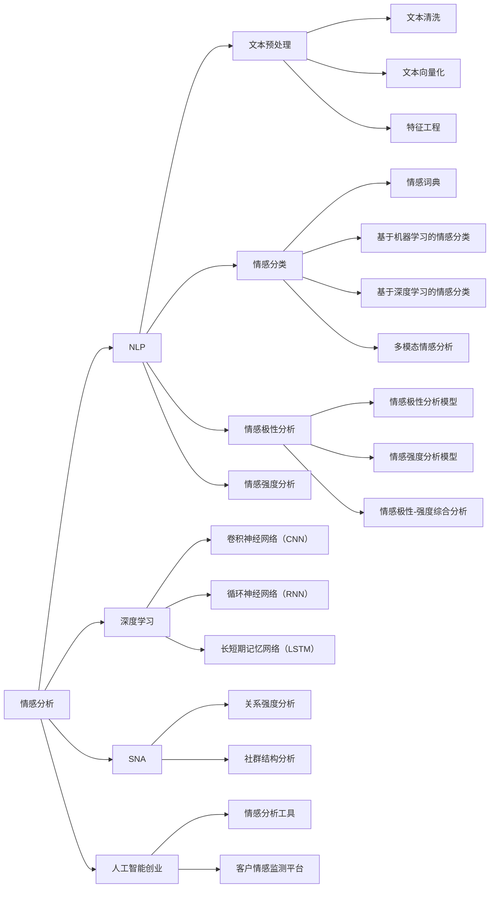

                 

# 数字化情感分析创业：AI驱动的人际关系洞察

> 关键词：情感分析, 深度学习, 人际互动, 自然语言处理, 人工智能创业, 社交网络分析, 用户体验

## 1. 背景介绍

### 1.1 问题由来

数字化时代，数据无处不在，数据的收集和分析已经成为企业经营决策的重要工具。然而，数据量的爆炸式增长也带来了数据处理的挑战，如何从海量的数据中提取出有价值的洞察，成为了企业关注的焦点。其中，情感分析作为自然语言处理(NLP)的重要分支，逐渐成为了商业决策中的关键技术。

情感分析是一种基于自然语言处理和机器学习的方法，旨在从文本数据中识别、提取和分类情感信息。企业通过情感分析，可以更好地理解消费者的情感态度，预测市场趋势，提升客户满意度，优化产品设计，甚至改善企业内部沟通，提升团队协作效率。

在数字化转型过程中，情感分析技术的优势日益凸显，逐渐成为许多企业的数字化战略核心。许多创业公司纷纷涉足情感分析领域，力图通过人工智能(AI)技术提升情感分析的精度和效率，从而获得商业竞争优势。

### 1.2 问题核心关键点

情感分析的核心关键点包括以下几个方面：

1. **数据获取与清洗**：情感分析的第一步是数据收集，需要从社交媒体、客户评论、客服记录等渠道获取文本数据。然而，文本数据往往存在噪音、格式不一致等问题，需要进行清洗和预处理。

2. **情感分类与识别**：情感分析的另一核心是情感分类，即将文本数据分类为正面、负面或中性情感。目前，主流情感分类方法包括基于词典、基于机器学习和基于深度学习等。

3. **模型训练与优化**：情感分析模型需要在大规模训练集上进行训练，以学习情感表达的特征。训练过程需要优化算法如Adam、SGD等，以及正则化、dropout等技术。

4. **场景应用与反馈循环**：情感分析模型在实际应用中需要不断优化，通过业务反馈不断调整模型参数，提高模型的鲁棒性和泛化能力。

5. **数据隐私与安全**：情感分析涉及到大量个人情感信息，如何保护用户隐私，防止数据泄露，是情感分析应用的重要挑战。

### 1.3 问题研究意义

情感分析技术的研究和应用，对于提升企业的数据洞察力，改善用户体验，以及优化企业决策具有重要意义：

1. **提升用户满意度**：通过情感分析，企业可以及时了解用户对产品、服务的情感态度，快速响应用户需求，提升用户满意度和忠诚度。

2. **优化营销策略**：情感分析可以帮助企业识别市场趋势，分析竞争对手的优势和不足，从而制定更有针对性的营销策略。

3. **增强决策支持**：情感分析技术可以为企业的决策提供数据支持，帮助企业更好地理解市场动态，制定科学合理的经营决策。

4. **推动创新与改进**：通过情感分析，企业可以发现产品、服务的缺陷和不足，及时进行调整和改进，提升产品竞争力。

5. **提升内部沟通**：企业可以通过情感分析了解员工对工作环境的情感态度，改善内部沟通，提升团队协作效率。

## 2. 核心概念与联系

### 2.1 核心概念概述

要深入理解情感分析，首先需要了解一些核心概念：

- **情感分析（Sentiment Analysis）**：从文本中识别和提取情感信息的过程。常见的情感分析任务包括情感分类、情感极性分析、情感强度分析等。

- **深度学习（Deep Learning）**：一种基于神经网络的学习方法，通过多层非线性映射学习数据的表示。深度学习在情感分析中发挥了重要作用，如使用卷积神经网络（CNN）和循环神经网络（RNN）等架构。

- **自然语言处理（Natural Language Processing, NLP）**：使计算机能够理解、分析、处理和生成人类语言的技术。情感分析是NLP中的一个重要应用方向。

- **社交网络分析（Social Network Analysis, SNA）**：研究社交网络结构及其属性，如节点间的关系强度、社群结构等。情感分析可以与社交网络分析相结合，更全面地理解人际关系。

- **人工智能创业**：利用AI技术解决实际问题，开拓新的商业机会。情感分析在创业公司中得到了广泛应用，如情感分析工具、客户情感监测平台等。

这些概念之间通过逻辑连接，形成了情感分析的技术框架。通过深入理解这些概念，可以更好地把握情感分析的核心原理和技术方法。

### 2.2 核心概念原理和架构的 Mermaid 流程图



这个图展示了情感分析与深度学习、NLP、SNA以及人工智能创业之间的联系。

- **A: 情感分析**是核心节点，通过深度学习和自然语言处理技术实现。
- **B: 深度学习**提供了模型训练的技术支持，如卷积神经网络（CNN）、循环神经网络（RNN）等。
- **C: NLP**提供了文本预处理、情感分类、极性分析、强度分析等技术支持。
- **D: SNA**提供了社交网络分析的技术支持，与情感分析结合可以更全面地理解人际关系。
- **E: 人工智能创业**是情感分析在实际应用中的体现，如情感分析工具和客户情感监测平台等。

## 3. 核心算法原理 & 具体操作步骤

### 3.1 算法原理概述

情感分析的算法原理主要基于自然语言处理和深度学习技术。其核心思想是通过训练模型，使其能够从文本中识别和提取情感信息，进行情感分类和情感强度分析。

具体来说，情感分析包括以下几个步骤：

1. **数据预处理**：文本清洗、分词、词性标注、去除停用词等。

2. **特征提取**：将文本转换为模型能够处理的数值形式，如词袋模型、TF-IDF等。

3. **模型训练**：使用训练集对模型进行训练，学习情感表达的特征。

4. **情感分类**：将文本分类为正面、负面或中性情感。

5. **情感强度分析**：分析文本的情感强度，如强正面、弱负面等。

6. **模型优化**：使用验证集对模型进行优化，调整模型参数。

7. **模型评估**：在测试集上评估模型性能，如准确率、召回率、F1-score等。

### 3.2 算法步骤详解

以下是情感分析的详细步骤：

1. **数据收集与预处理**：
   - 从社交媒体、客户评论、客服记录等渠道收集文本数据。
   - 清洗文本数据，去除噪音、格式不一致等问题。
   - 分词、词性标注，去除停用词。

2. **特征提取**：
   - 将文本转换为数值形式，如词袋模型、TF-IDF等。
   - 构建文本特征向量。

3. **模型训练**：
   - 选择适当的深度学习模型，如卷积神经网络（CNN）、循环神经网络（RNN）等。
   - 使用训练集对模型进行训练，调整模型参数。
   - 使用优化算法如Adam、SGD等。
   - 使用正则化技术如L2正则、dropout等，避免过拟合。

4. **情感分类与强度分析**：
   - 使用训练好的模型对文本进行情感分类，分类为正面、负面或中性情感。
   - 使用情感强度分析模型，分析文本的情感强度，如强正面、弱负面等。

5. **模型评估**：
   - 在测试集上评估模型性能，计算准确率、召回率、F1-score等指标。
   - 使用混淆矩阵等可视化工具，分析模型分类结果。

6. **模型优化**：
   - 根据模型评估结果，调整模型参数，优化模型性能。
   - 使用交叉验证等技术，防止模型过拟合。

### 3.3 算法优缺点

情感分析的算法具有以下优点：

1. **高精度**：深度学习模型在情感分类和情感强度分析中表现出色，能够准确识别和分类情感信息。

2. **可解释性强**：通过可视化工具，可以深入理解模型决策过程，提供数据支持。

3. **泛化能力强**：深度学习模型可以处理大规模数据，具有较强的泛化能力。

4. **应用广泛**：情感分析技术可以应用于社交媒体分析、客户情感监测、产品评价分析等多个领域。

情感分析的算法也存在一些缺点：

1. **数据依赖性强**：情感分析依赖于高质量的数据，数据收集和预处理工作量大。

2. **模型复杂度高**：深度学习模型训练复杂，计算资源需求高。

3. **情感识别受主观影响**：情感表达具有主观性，情感分类结果受文本语境、表达方式等因素影响。

4. **模型可解释性不足**：深度学习模型通常是"黑盒"系统，难以解释其内部工作机制。

5. **隐私与安全问题**：情感分析涉及大量个人情感信息，如何保护用户隐私，防止数据泄露，是情感分析应用的重要挑战。

### 3.4 算法应用领域

情感分析在多个领域中具有广泛的应用前景：

1. **社交媒体分析**：分析用户在社交媒体上的情感态度，了解市场趋势，优化品牌形象。

2. **客户情感监测**：通过情感分析工具，监测客户对产品、服务的情感态度，提升客户满意度。

3. **产品评价分析**：分析用户对产品的评价，了解产品优缺点，改进产品设计。

4. **市场营销**：分析竞争对手在社交媒体上的情感态度，制定更有针对性的营销策略。

5. **人力资源管理**：分析员工对工作环境的情感态度，改善内部沟通，提升团队协作效率。

6. **舆情监测**：通过情感分析技术，监测公共舆情，预测社会热点，提升政府决策效率。

## 4. 数学模型和公式 & 详细讲解 & 举例说明

### 4.1 数学模型构建

情感分析的数学模型可以基于多种深度学习架构，如卷积神经网络（CNN）、循环神经网络（RNN）、长短期记忆网络（LSTM）等。这里以CNN为例，构建情感分析的数学模型。

假设输入文本为 $X$，输出情感标签为 $Y$，情感分析的数学模型可以表示为：

$$
\hat{Y} = \text{CNN}(X; \theta)
$$

其中 $\theta$ 为模型的可训练参数。

### 4.2 公式推导过程

CNN的情感分析模型包括卷积层、池化层和全连接层等。假设输入文本为 $X$，输出情感标签为 $Y$，情感分析的数学模型可以表示为：

1. **卷积层**：
   $$
   Z_1 = W_1 \ast X + b_1
   $$

   其中 $W_1$ 和 $b_1$ 为卷积核和偏置项。

2. **ReLU激活函数**：
   $$
   Z_2 = \max(0, Z_1)
   $$

3. **池化层**：
   $$
   Z_3 = \text{MaxPool}(\text{ReLU}(Z_1))
   $$

4. **全连接层**：
   $$
   Z_4 = W_2 Z_3 + b_2
   $$

   其中 $W_2$ 和 $b_2$ 为全连接层参数。

5. **Softmax激活函数**：
   $$
   \hat{Y} = \text{Softmax}(Z_4)
   $$

6. **交叉熵损失函数**：
   $$
   L = -\frac{1}{N} \sum_{i=1}^N \sum_{j=1}^C y_{i,j} \log \hat{y}_{i,j}
   $$

   其中 $N$ 为样本数量，$C$ 为情感类别数量，$y_{i,j}$ 为真实标签，$\hat{y}_{i,j}$ 为模型预测值。

### 4.3 案例分析与讲解

以情感分析在客户情感监测中的应用为例，具体说明其工作流程和模型构建方法。

1. **数据收集**：
   - 收集客户对产品、服务的评价、评论等文本数据。
   - 将文本数据进行清洗和预处理，去除噪音、停用词等。

2. **特征提取**：
   - 使用TF-IDF等方法将文本转换为数值形式。
   - 构建文本特征向量，作为CNN的输入。

3. **模型训练**：
   - 使用训练集对CNN模型进行训练，学习情感表达的特征。
   - 使用Adam等优化算法，调整模型参数。
   - 使用L2正则、dropout等技术，避免过拟合。

4. **情感分类**：
   - 使用训练好的CNN模型对文本进行情感分类，分类为正面、负面或中性情感。
   - 根据分类结果，生成情感分析报告。

5. **模型评估**：
   - 在测试集上评估模型性能，计算准确率、召回率、F1-score等指标。
   - 使用混淆矩阵等可视化工具，分析模型分类结果。

6. **模型优化**：
   - 根据模型评估结果，调整模型参数，优化模型性能。
   - 使用交叉验证等技术，防止模型过拟合。

## 5. 项目实践：代码实例和详细解释说明

### 5.1 开发环境搭建

要进行情感分析项目实践，首先需要准备好开发环境。以下是使用Python进行Keras开发的环境配置流程：

1. 安装Anaconda：从官网下载并安装Anaconda，用于创建独立的Python环境。

2. 创建并激活虚拟环境：
```bash
conda create -n keras-env python=3.8 
conda activate keras-env
```

3. 安装Keras：从官网获取Keras的最新版本，并进行安装。
```bash
pip install keras==2.5.0
```

4. 安装TensorFlow：由于Keras依赖TensorFlow，因此需要安装TensorFlow。
```bash
pip install tensorflow
```

5. 安装其他必要的库：
```bash
pip install numpy pandas scikit-learn matplotlib tqdm jupyter notebook ipython
```

完成上述步骤后，即可在`keras-env`环境中开始情感分析项目实践。

### 5.2 源代码详细实现

下面以情感分析在客户情感监测中的应用为例，给出使用Keras进行情感分类的PyTorch代码实现。

首先，定义数据处理函数：

```python
from keras.preprocessing.text import Tokenizer
from keras.preprocessing.sequence import pad_sequences
import numpy as np

def preprocess_text(texts):
    tokenizer = Tokenizer()
    tokenizer.fit_on_texts(texts)
    sequences = tokenizer.texts_to_sequences(texts)
    padded_sequences = pad_sequences(sequences, padding='post', maxlen=100)
    return padded_sequences, tokenizer.word_index
```

然后，定义模型和优化器：

```python
from keras.models import Sequential
from keras.layers import Embedding, Conv1D, GlobalMaxPooling1D, Dense, Dropout

model = Sequential([
    Embedding(input_dim=10000, output_dim=128, input_length=100),
    Conv1D(128, 3, activation='relu'),
    GlobalMaxPooling1D(),
    Dense(64, activation='relu'),
    Dropout(0.5),
    Dense(3, activation='softmax')
])
model.compile(loss='categorical_crossentropy', optimizer='adam', metrics=['accuracy'])
```

接着，定义训练和评估函数：

```python
from keras.utils import to_categorical

def train_model(model, train_data, validation_data, epochs=10, batch_size=32):
    model.fit(train_data[0], to_categorical(train_data[1]), validation_data=(validation_data[0], to_categorical(validation_data[1])), epochs=epochs, batch_size=batch_size, verbose=1)

def evaluate_model(model, test_data, batch_size=32):
    model.evaluate(test_data[0], to_categorical(test_data[1]), batch_size=batch_size, verbose=1)
```

最后，启动训练流程并在测试集上评估：

```python
from keras.datasets import imdb

(train_data, train_labels), (test_data, test_labels) = imdb.load_data(num_words=10000)
train_data = np.array([np.append(word_idx, [np.zeros(100 - len(word_idx))]) for word_idx in train_data])
test_data = np.array([np.append(word_idx, [np.zeros(100 - len(word_idx))]) for word_idx in test_data])
train_data, test_data = preprocess_text([str(x) for x in train_data]), preprocess_text([str(x) for x in test_data])

train_model(model, train_data, test_data, epochs=10, batch_size=32)
evaluate_model(model, test_data, batch_size=32)
```

以上就是使用Keras进行情感分类的完整代码实现。可以看到，Keras封装了模型的定义和训练过程，使得情感分析的实现更加简洁高效。

### 5.3 代码解读与分析

让我们再详细解读一下关键代码的实现细节：

**preprocess_text函数**：
- 定义了文本预处理函数，包括分词、向量化和填充。

**模型定义**：
- 使用Sequential模型定义了一个简单的CNN结构，包括嵌入层、卷积层、池化层、全连接层和Dropout层。

**训练函数train_model**：
- 使用fit方法对模型进行训练，计算损失函数和准确率。

**评估函数evaluate_model**：
- 使用evaluate方法对模型在测试集上的性能进行评估，输出损失函数和准确率。

**模型训练与评估**：
- 使用Keras的load_data方法加载IMDB数据集，分为训练集和测试集。
- 对文本数据进行预处理，包括分词、向量化和填充。
- 使用训练函数对模型进行训练，设置训练轮数和批次大小。
- 使用评估函数对模型在测试集上的性能进行评估。

## 6. 实际应用场景

### 6.1 智能客服系统

智能客服系统是情感分析的重要应用场景之一。通过情感分析，智能客服系统可以自动识别用户情感，及时回应用户需求，提升客户满意度。

1. **用户情感识别**：通过情感分析技术，智能客服系统可以实时监测用户对话中的情感倾向，如生气、不满等。

2. **自动化回复**：根据用户情感识别结果，智能客服系统可以自动匹配合适的回复，如安抚、道歉、解决问题等。

3. **人工介入**：对于复杂或特殊情况，智能客服系统可以自动将问题转接给人工客服，确保客户得到及时处理。

### 6.2 客户情感监测

客户情感监测是情感分析在企业中的重要应用。通过情感分析，企业可以及时了解客户对产品、服务的情感态度，提升客户满意度。

1. **情感分析报告**：通过情感分析技术，生成客户情感报告，分析客户对产品、服务的正面、负面情感。

2. **产品改进**：根据情感报告，企业可以及时发现产品问题，进行改进和优化。

3. **市场营销**：通过情感分析，企业可以了解市场趋势，优化营销策略，提升品牌形象。

### 6.3 社交媒体分析

社交媒体是情感分析的重要数据来源。通过情感分析技术，企业可以实时监测社交媒体上的情感趋势，了解用户对品牌、产品的情感态度。

1. **情感趋势分析**：通过情感分析技术，生成社交媒体情感报告，分析情感趋势和热点话题。

2. **品牌管理**：根据情感报告，企业可以及时调整品牌策略，优化品牌形象。

3. **竞争对手分析**：通过情感分析，企业可以了解竞争对手的情感趋势，制定更有针对性的市场策略。

## 7. 工具和资源推荐

### 7.1 学习资源推荐

为了帮助开发者系统掌握情感分析的理论基础和实践技巧，这里推荐一些优质的学习资源：

1. **《深度学习与自然语言处理》**：清华大学出版社，提供情感分析的基本概念和技术方法。

2. **CS224N《自然语言处理与深度学习》课程**：斯坦福大学开设的NLP明星课程，涵盖情感分析的基本理论和方法。

3. **《TensorFlow实战深度学习》**：中国人民大学出版社，介绍了Keras等深度学习框架的应用。

4. **Kaggle情感分析比赛**：Kaggle平台上的情感分析比赛，提供大量情感分析的数据集和算法实现。

5. **Transformers库官方文档**：HuggingFace开发的NLP工具库，提供了情感分析的预训练模型和微调样例。

通过对这些资源的学习实践，相信你一定能够快速掌握情感分析的精髓，并用于解决实际的NLP问题。

### 7.2 开发工具推荐

高效的开发离不开优秀的工具支持。以下是几款用于情感分析开发的常用工具：

1. **Jupyter Notebook**：交互式的Python编程环境，支持代码编写、数据分析、可视化等。

2. **TensorBoard**：TensorFlow配套的可视化工具，可以实时监测模型训练状态，提供丰富的图表呈现方式。

3. **Weights & Biases**：模型训练的实验跟踪工具，可以记录和可视化模型训练过程中的各项指标。

4. **NLTK**：Python的自然语言处理工具包，提供了丰富的NLP工具和数据集。

5. **SpaCy**：Python的自然语言处理库，提供了高效的文本处理和情感分析功能。

合理利用这些工具，可以显著提升情感分析的开发效率，加快创新迭代的步伐。

### 7.3 相关论文推荐

情感分析技术的不断发展，得益于学界的持续研究。以下是几篇奠基性的相关论文，推荐阅读：

1. **《使用卷积神经网络进行情感分析》**：提出了卷积神经网络在情感分析中的应用，是情感分析领域的重要里程碑。

2. **《基于LSTM的情感分析》**：提出使用长短期记忆网络（LSTM）进行情感分析，提升了模型精度和泛化能力。

3. **《基于预训练语言模型的情感分析》**：提出使用预训练语言模型进行情感分析，提升了模型精度和泛化能力。

4. **《情感分析的跨领域迁移学习》**：提出使用迁移学习技术，提升情感分析在不同领域的适应性。

5. **《深度学习在情感分析中的应用》**：总结了深度学习在情感分析中的多种架构和应用。

这些论文代表了情感分析技术的发展脉络。通过学习这些前沿成果，可以帮助研究者把握学科前进方向，激发更多的创新灵感。

## 8. 总结：未来发展趋势与挑战

### 8.1 研究成果总结

情感分析技术在NLP领域中具有重要的研究价值和应用前景。其研究成果包括以下几个方面：

1. **深度学习模型**：卷积神经网络（CNN）、循环神经网络（RNN）、长短期记忆网络（LSTM）等深度学习模型在情感分析中表现出色。

2. **情感词典和向量空间模型**：基于词典和向量空间模型的方法在情感分析中仍具有重要应用。

3. **预训练语言模型**：使用预训练语言模型进行情感分析，可以提升模型的精度和泛化能力。

4. **跨领域迁移学习**：通过迁移学习技术，提升情感分析在不同领域的适应性。

5. **多模态情感分析**：融合视觉、语音等多模态信息，提升情感分析的准确性和泛化能力。

### 8.2 未来发展趋势

展望未来，情感分析技术将呈现以下几个发展趋势：

1. **多模态情感分析**：融合视觉、语音等多模态信息，提升情感分析的准确性和泛化能力。

2. **跨领域迁移学习**：通过迁移学习技术，提升情感分析在不同领域的适应性。

3. **情感生成**：通过生成模型，生成更加真实自然的情感表达，提升情感分析的应用场景。

4. **情感推理**：引入因果推理和博弈论工具，提高情感分析的鲁棒性和可信度。

5. **情感交互**：通过情感交互技术，提升人机交互的自然性和情感响应能力。

6. **情感伦理**：引入伦理导向的评估指标，过滤和惩罚有害的情感输出，确保情感分析技术的可信度。

以上趋势凸显了情感分析技术的多样性和发展潜力，未来情感分析技术将会在更广泛的场景中发挥作用，推动人工智能技术的普及和应用。

### 8.3 面临的挑战

尽管情感分析技术已经取得了瞩目成就，但在迈向更加智能化、普适化应用的过程中，它仍面临诸多挑战：

1. **数据依赖性强**：情感分析依赖于高质量的数据，数据收集和预处理工作量大。

2. **模型复杂度高**：深度学习模型训练复杂，计算资源需求高。

3. **情感识别受主观影响**：情感表达具有主观性，情感分类结果受文本语境、表达方式等因素影响。

4. **模型可解释性不足**：深度学习模型通常是"黑盒"系统，难以解释其内部工作机制。

5. **隐私与安全问题**：情感分析涉及大量个人情感信息，如何保护用户隐私，防止数据泄露，是情感分析应用的重要挑战。

6. **鲁棒性和泛化性**：情感分析模型在处理新数据时容易过拟合，泛化性能有待提升。

7. **跨领域适应性**：不同领域的情感表达方式不同，情感分析模型需要具备更强的跨领域适应性。

8. **计算资源需求高**：情感分析模型需要大量的计算资源进行训练和推理，计算资源需求高。

正视情感分析面临的这些挑战，积极应对并寻求突破，将使其在实际应用中发挥更大的作用。相信随着学界和产业界的共同努力，这些挑战终将一一被克服，情感分析技术必将在构建人机协同的智能系统中扮演越来越重要的角色。

### 8.4 研究展望

未来，情感分析技术的研究方向包括：

1. **多模态情感分析**：融合视觉、语音等多模态信息，提升情感分析的准确性和泛化能力。

2. **情感推理**：引入因果推理和博弈论工具，提高情感分析的鲁棒性和可信度。

3. **情感生成**：通过生成模型，生成更加真实自然的情感表达，提升情感分析的应用场景。

4. **情感交互**：通过情感交互技术，提升人机交互的自然性和情感响应能力。

5. **情感伦理**：引入伦理导向的评估指标，过滤和惩罚有害的情感输出，确保情感分析技术的可信度。

6. **跨领域迁移学习**：通过迁移学习技术，提升情感分析在不同领域的适应性。

以上研究方向将推动情感分析技术向更加智能化、普适化应用迈进，为人工智能技术的发展注入新的活力。

## 9. 附录：常见问题与解答

**Q1：情感分析模型如何选择？**

A: 情感分析模型可以根据具体需求进行选择。例如，基于词典的方法适用于大规模文本数据集，但精度较低；基于深度学习的方法精度较高，但计算资源需求高。可以根据数据规模和计算资源来选择合适的模型。

**Q2：情感分析数据依赖性强，如何获取高质量数据？**

A: 获取高质量的情感分析数据是关键。可以从社交媒体、客户评论、客服记录等渠道获取文本数据，但需要进行清洗和预处理。可以采用爬虫技术从公开数据集中获取情感分析数据。同时，可以与第三方数据提供商合作获取更丰富的数据资源。

**Q3：情感分析模型如何防止过拟合？**

A: 防止情感分析模型过拟合的方法包括：使用正则化技术如L2正则、dropout等；使用数据增强技术如回译、近义替换等；使用验证集进行模型评估和参数调整。

**Q4：情感分析模型的可解释性如何提升？**

A: 提升情感分析模型的可解释性可以从模型架构和后处理技术入手。例如，使用可解释的深度学习模型架构，如LIME、SHAP等；在模型输出后进行解释，如基于文本特征的解释方法等。

**Q5：情感分析在实际应用中需要注意哪些问题？**

A: 情感分析在实际应用中需要注意数据隐私和安全问题，避免数据泄露和滥用。同时，需要确保模型输出解释合理、可信，避免有害输出。还需要考虑模型的计算资源需求和应用场景的适应性，确保情感分析技术在实际应用中的效果和可靠性。

---

作者：禅与计算机程序设计艺术 / Zen and the Art of Computer Programming

