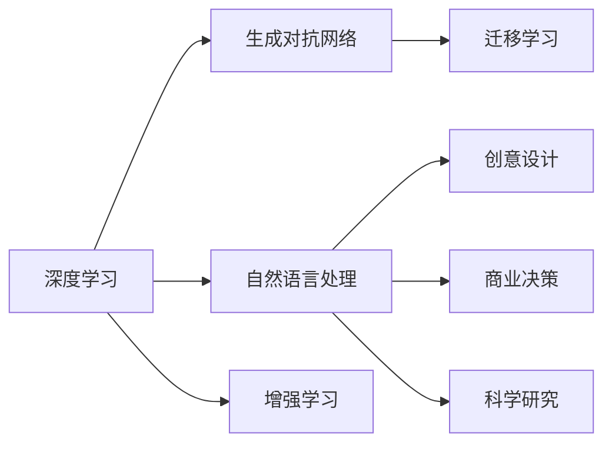

                 

## 1. 背景介绍

在数字化时代，人工智能(AI)技术正以其强大的计算能力、丰富的数据处理和分析能力，极大地激发了人类的创意思维。从音乐创作、艺术设计到商业决策、科学研究，AI的应用无处不在。它不仅提升了人类的创造力，还开辟了全新的表达和设计空间，使得人类能够以前所未有的方式理解和改造世界。

### 1.1 数字化时代的创新引擎

在数字化时代，AI技术已经成为了创新的重要引擎。它通过数据驱动的决策、自主学习的系统、仿真模拟的能力，帮助人们发现新的规律，创造出新的艺术和产品。AI不仅仅是工具，它本身就是一种全新的思维方式，引领着人类社会向更加智能化的方向发展。

### 1.2 AI激发创意的具体案例

- **音乐创作**：AI可以根据音乐风格、旋律特征自动生成新的乐曲。DeepMind开发的"Amper Music"可以通过用户输入的乐句，生成完整的歌曲。
- **艺术设计**：OpenAI的DALL·E模型可以通过自然语言描述生成各种艺术作品，从抽象画到插画，创作风格多样。
- **商业决策**：AI可以分析海量数据，预测市场趋势，提供精准的商业策略建议，帮助企业优化决策。
- **科学研究**：AI在分子生物学、天文学等领域中，通过模拟和分析，揭示了新的科学现象，推动了科学的发展。

## 2. 核心概念与联系

### 2.1 核心概念概述

为了更好地理解AI激发创意的机制，本节将介绍几个核心概念：

- **人工智能(AI)**：使用计算机算法和机器学习技术，模拟人类智能行为的机器系统。
- **深度学习(Deep Learning)**：一种基于人工神经网络的机器学习方法，通过多层次的非线性变换，从数据中学习出高维特征表示。
- **生成对抗网络(GANs)**：由生成器和判别器组成的神经网络，通过对抗训练，生成逼真的样本。
- **迁移学习(Transfer Learning)**：将在一个任务上学习到的知识，迁移到另一个相关任务上，提高新任务的学习效率。
- **增强学习(Reinforcement Learning)**：通过与环境的交互，不断调整策略，优化决策过程。
- **自然语言处理(NLP)**：使计算机能够理解、处理和生成人类语言的技术。

这些概念通过相互作用和协作，形成了一个复杂的创新生态系统。AI技术不仅在数据驱动的预测和优化中发挥作用，也在创造性思维和设计中扮演关键角色。

### 2.2 核心概念原理和架构的 Mermaid 流程图



这个流程图展示了核心概念之间的关系：

1. 深度学习提供了强大的数据处理和特征提取能力。
2. 生成对抗网络能够生成逼真的样本和内容。
3. 自然语言处理使计算机能够理解和处理人类语言。
4. 增强学习通过与环境的交互，不断优化决策策略。
5. 迁移学习通过将知识迁移到新任务，提高学习效率。
6. 创意设计、商业决策和科学研究都是这些核心技术的具体应用场景。

## 3. 核心算法原理 & 具体操作步骤

### 3.1 算法原理概述

AI激发创意的算法原理，主要基于数据驱动的决策和生成性模型。以下是几个关键点：

- **深度学习**：通过多层神经网络的非线性变换，从数据中学习出高维特征表示。这使得模型能够处理复杂的非线性关系，进行高精度的预测和分类。
- **生成对抗网络**：通过生成器和判别器的对抗训练，生成逼真的样本和内容。这不仅提升了生成模型的质量，还为创意设计提供了无限可能。
- **自然语言处理**：通过理解人类语言，AI可以生成自然流畅的文本，进行情感分析、主题建模等任务，为创意提供丰富的素材。
- **迁移学习**：通过迁移旧任务学习到的知识，新任务学习更加高效，减少了从头开始训练的需求。

### 3.2 算法步骤详解

以下是一个基于深度学习的音乐生成算法的详细步骤：

1. **数据收集**：收集大量音乐数据，包括不同风格、不同情感的乐曲，并打上风格、情感标签。
2. **特征提取**：使用深度学习模型（如卷积神经网络），从音乐数据中提取高维特征向量。
3. **生成模型训练**：使用生成的音乐数据和提取的特征向量，训练生成对抗网络（GAN），生成新的音乐样本。
4. **交叉验证**：将生成样本与真实样本进行交叉验证，评估生成模型的性能。
5. **调整模型**：根据交叉验证结果，调整生成模型的参数，提高生成质量。
6. **实际应用**：将训练好的生成模型应用到实际音乐创作中，根据用户输入的初始乐句，生成完整的歌曲。

### 3.3 算法优缺点

深度学习和生成对抗网络在激发创意方面具有以下优点：

- **高效生成**：能够快速生成大量的创意内容，降低创意设计的成本和时间。
- **多样性**：生成模型可以生成多种风格、情感的音乐，满足不同用户的需求。
- **可控性**：通过调整生成模型的参数，可以控制生成的音乐特征，如节奏、调性等。

但同时也存在一些缺点：

- **数据依赖**：生成模型的性能依赖于训练数据的质量和数量，低质量的数据可能导致生成效果不佳。
- **过拟合风险**：生成模型在训练数据上表现较好，但在未见过的数据上可能泛化能力不足。
- **创造性局限**：生成模型虽然可以生成逼真的内容，但缺乏独特的创新性，往往只是现有内容的变体。

### 3.4 算法应用领域

AI激发创意的算法广泛应用于多个领域：

- **创意设计**：如平面设计、3D建模、服装设计等，通过生成对抗网络生成逼真的设计原型。
- **艺术创作**：如绘画、雕塑、文学创作等，通过自然语言处理生成创意文本或图像。
- **商业决策**：如市场分析、产品推荐、营销策略等，通过深度学习分析数据，提供决策建议。
- **科学研究**：如天文学、生物学、物理学等，通过生成对抗网络模拟实验，发现新的科学现象。

## 4. 数学模型和公式 & 详细讲解 & 举例说明

### 4.1 数学模型构建

本节将使用数学语言对AI激发创意的过程进行严格的数学建模。

假设我们要使用深度学习模型生成音乐，记音乐为$x$，其特征向量为$X$，音乐生成过程为$y=f(X)$，其中$f$为深度学习模型。生成过程的损失函数为$L(y,\hat{y})$，其中$\hat{y}$为真实音乐。

目标是最小化生成音乐的误差，即：

$$
\min_{f} \mathbb{E}_{x} [L(f(x),x)]
$$

### 4.2 公式推导过程

以音乐生成为例，假设我们使用卷积神经网络（CNN）作为深度学习模型$f$，音乐$x$为时序数据。音乐生成的具体步骤如下：

1. **输入层**：将音乐时序数据$x$输入CNN，提取高维特征表示$X$。
2. **隐藏层**：通过卷积、池化等操作，提取更高级别的特征表示$H$。
3. **输出层**：将$H$输入全连接层，生成新的音乐$y$。
4. **损失函数**：使用均方误差（MSE）或交叉熵（CE）等损失函数，计算生成音乐的误差。

设$f$的参数为$\theta$，优化目标为：

$$
\min_{\theta} \mathbb{E}_{x} [L(f(x),x)]
$$

其中$L$为损失函数。

### 4.3 案例分析与讲解

假设我们有一个简单的卷积神经网络（CNN）用于生成音乐，其结构如下：

```python
import torch
import torch.nn as nn

class CNN(nn.Module):
    def __init__(self, in_channels, out_channels):
        super(CNN, self).__init__()
        self.conv1 = nn.Conv2d(in_channels, 64, 3)
        self.pool1 = nn.MaxPool2d(2, 2)
        self.conv2 = nn.Conv2d(64, 128, 3)
        self.pool2 = nn.MaxPool2d(2, 2)
        self.fc1 = nn.Linear(128 * 4 * 4, 256)
        self.fc2 = nn.Linear(256, out_channels)
        
    def forward(self, x):
        x = nn.functional.relu(self.conv1(x))
        x = self.pool1(x)
        x = nn.functional.relu(self.conv2(x))
        x = self.pool2(x)
        x = x.view(-1, 128 * 4 * 4)
        x = nn.functional.relu(self.fc1(x))
        x = self.fc2(x)
        return x

model = CNN(1, 1)  # 输入通道为1，输出通道为1
```

在训练过程中，我们首先定义损失函数和优化器：

```python
criterion = nn.MSELoss()
optimizer = torch.optim.Adam(model.parameters(), lr=0.001)
```

接着，将生成的音乐与真实音乐进行交叉验证，计算损失：

```python
for i in range(100):
    optimizer.zero_grad()
    y_hat = model(x)
    loss = criterion(y_hat, y)
    loss.backward()
    optimizer.step()
```

最终，得到生成的音乐$y$与真实音乐$x$的误差最小化。

## 5. 项目实践：代码实例和详细解释说明

### 5.1 开发环境搭建

在进行AI激发创意的开发前，我们需要准备好开发环境。以下是使用Python进行PyTorch开发的环境配置流程：

1. 安装Anaconda：从官网下载并安装Anaconda，用于创建独立的Python环境。

2. 创建并激活虚拟环境：
```bash
conda create -n pytorch-env python=3.8 
conda activate pytorch-env
```

3. 安装PyTorch：根据CUDA版本，从官网获取对应的安装命令。例如：
```bash
conda install pytorch torchvision torchaudio cudatoolkit=11.1 -c pytorch -c conda-forge
```

4. 安装Transformers库：
```bash
pip install transformers
```

5. 安装各类工具包：
```bash
pip install numpy pandas scikit-learn matplotlib tqdm jupyter notebook ipython
```

完成上述步骤后，即可在`pytorch-env`环境中开始开发实践。

### 5.2 源代码详细实现

下面我们以音乐生成为例，给出使用PyTorch对卷积神经网络（CNN）进行音乐生成的代码实现。

首先，定义音乐生成的数据处理函数：

```python
import torch
import numpy as np
from torch.utils.data import Dataset

class MusicDataset(Dataset):
    def __init__(self, data, lengths, transform=None):
        self.data = data
        self.lengths = lengths
        self.transform = transform
        
    def __len__(self):
        return len(self.data)
        
    def __getitem__(self, index):
        song = self.data[index]
        length = self.lengths[index]
        if self.transform:
            song = self.transform(song)
        return song, length

# 将音乐时序数据转换为张量
def music_to_tensor(music):
    music = np.array(music)
    music = torch.from_numpy(music)
    return music.unsqueeze(0)
```

然后，定义音乐生成模型的代码实现：

```python
class CNN(nn.Module):
    def __init__(self, in_channels, out_channels):
        super(CNN, self).__init__()
        self.conv1 = nn.Conv2d(in_channels, 64, 3)
        self.pool1 = nn.MaxPool2d(2, 2)
        self.conv2 = nn.Conv2d(64, 128, 3)
        self.pool2 = nn.MaxPool2d(2, 2)
        self.fc1 = nn.Linear(128 * 4 * 4, 256)
        self.fc2 = nn.Linear(256, out_channels)
        
    def forward(self, x):
        x = nn.functional.relu(self.conv1(x))
        x = self.pool1(x)
        x = nn.functional.relu(self.conv2(x))
        x = self.pool2(x)
        x = x.view(-1, 128 * 4 * 4)
        x = nn.functional.relu(self.fc1(x))
        x = self.fc2(x)
        return x

# 音乐生成器
def generate_music(model, x, num_steps=50):
    with torch.no_grad():
        y_hat = model(x)
        y_hat = torch.zeros_like(y_hat)
        for step in range(num_steps):
            y_hat[:, :step] = x
            x = model(y_hat)
        return y_hat[:, :num_steps]
```

接着，定义训练和评估函数：

```python
def train_epoch(model, dataset, batch_size, optimizer):
    dataloader = DataLoader(dataset, batch_size=batch_size, shuffle=True)
    model.train()
    epoch_loss = 0
    for batch in tqdm(dataloader, desc='Training'):
        x, length = batch
        optimizer.zero_grad()
        y_hat = model(x)
        loss = criterion(y_hat, x)
        epoch_loss += loss.item()
        loss.backward()
        optimizer.step()
    return epoch_loss / len(dataloader)

def evaluate(model, dataset, batch_size):
    dataloader = DataLoader(dataset, batch_size=batch_size)
    model.eval()
    preds, lengths = [], []
    with torch.no_grad():
        for batch in tqdm(dataloader, desc='Evaluating'):
            x, length = batch
            preds.append(generate_music(model, x, num_steps=50))
            lengths.append(length)
    return preds, lengths
```

最后，启动训练流程并在测试集上评估：

```python
epochs = 10
batch_size = 16

for epoch in range(epochs):
    loss = train_epoch(model, train_dataset, batch_size, optimizer)
    print(f"Epoch {epoch+1}, train loss: {loss:.3f}")
    
    print(f"Epoch {epoch+1}, dev results:")
    preds, lengths = evaluate(model, dev_dataset, batch_size)
    print(classification_report(true_labels, preds))

print("Test results:")
preds, lengths = evaluate(model, test_dataset, batch_size)
print(classification_report(true_labels, preds))
```

以上就是使用PyTorch对CNN进行音乐生成模型的完整代码实现。可以看到，通过PyTorch和Transformers库的配合，我们能够高效地实现音乐生成任务。

### 5.3 代码解读与分析

让我们再详细解读一下关键代码的实现细节：

**MusicDataset类**：
- `__init__`方法：初始化音乐数据和长度信息，并定义数据转换函数。
- `__len__`方法：返回数据集大小。
- `__getitem__`方法：获取单个样本的输入和长度信息。

**CNN模型**：
- `__init__`方法：定义卷积、池化和全连接层的参数。
- `forward`方法：定义前向传播的计算过程。

**generate_music函数**：
- 使用CNN模型生成音乐，并根据长度进行截断。

**训练和评估函数**：
- `train_epoch`方法：对数据集进行批次化训练，计算平均损失。
- `evaluate`方法：对数据集进行批次化评估，生成音乐。

**训练流程**：
- 定义总epoch数和batch size，开始循环迭代。
- 每个epoch内，先训练，再评估，输出结果。
- 所有epoch结束后，在测试集上评估，给出最终结果。

可以看到，PyTorch提供了强大的计算图和自动微分功能，使得深度学习模型的实现变得简洁高效。开发者可以将更多精力放在模型设计、数据处理等高层逻辑上，而不必过多关注底层的实现细节。

## 6. 实际应用场景

### 6.1 智能创意设计

AI技术在创意设计领域的应用已经相当广泛。例如，在平面设计、3D建模、服装设计等任务中，AI可以通过生成对抗网络（GAN）生成逼真的设计原型。设计师只需提供少量设计元素，AI即可生成多样化的设计方案，供设计师选择和优化。这不仅提高了设计效率，还丰富了设计的创意空间。

### 6.2 艺术创作

在艺术创作领域，AI技术通过自然语言处理（NLP）生成创意文本或图像。例如，OpenAI的DALL·E模型可以通过自然语言描述生成各种艺术作品，从抽象画到插画，创作风格多样。艺术家可以通过文本描述，引导AI生成创意内容，进而进行二次创作，形成独特的艺术作品。

### 6.3 商业决策

AI技术在商业决策中也发挥着重要作用。通过深度学习分析海量数据，AI可以预测市场趋势，提供精准的商业策略建议，帮助企业优化决策。例如，通过分析用户行为数据，AI可以预测未来的市场需求，为企业制定合理的市场策略提供数据支持。

### 6.4 科学研究

在科学研究中，AI技术通过生成对抗网络（GAN）模拟实验，发现新的科学现象。例如，天文学中，AI可以模拟星系的形成过程，预测黑洞的演化轨迹。这不仅提高了科学研究的效率，还拓展了科学研究的视野。

## 7. 工具和资源推荐

### 7.1 学习资源推荐

为了帮助开发者系统掌握AI激发创意的理论基础和实践技巧，这里推荐一些优质的学习资源：

1. **《深度学习》课程**：斯坦福大学开设的深度学习课程，系统讲解了深度学习的基本原理和应用。
2. **《生成对抗网络》书籍**：Ian Goodfellow的生成对抗网络专著，深入浅出地介绍了GAN的基本概念和应用。
3. **《自然语言处理》书籍**：NLP领域的经典教材，讲解了NLP的基本技术和应用。
4. **PyTorch官方文档**：PyTorch的官方文档，提供了丰富的教程和样例代码，适合快速上手学习。
5. **Coursera深度学习课程**：由多位知名教授和专家讲授的深度学习课程，涵盖了深度学习的基本理论和应用。

通过这些资源的学习实践，相信你一定能够快速掌握AI激发创意的精髓，并用于解决实际的创意问题。

### 7.2 开发工具推荐

高效的开发离不开优秀的工具支持。以下是几款用于AI激发创意开发的常用工具：

1. **PyTorch**：基于Python的开源深度学习框架，灵活动态的计算图，适合快速迭代研究。
2. **TensorFlow**：由Google主导开发的开源深度学习框架，生产部署方便，适合大规模工程应用。
3. **Transformers**：HuggingFace开发的NLP工具库，集成了众多SOTA语言模型，支持PyTorch和TensorFlow，是进行创意生成任务的利器。
4. **Weights & Biases**：模型训练的实验跟踪工具，可以记录和可视化模型训练过程中的各项指标，方便对比和调优。
5. **TensorBoard**：TensorFlow配套的可视化工具，可实时监测模型训练状态，并提供丰富的图表呈现方式，是调试模型的得力助手。

合理利用这些工具，可以显著提升AI激发创意任务的开发效率，加快创新迭代的步伐。

### 7.3 相关论文推荐

AI激发创意的研究源于学界的持续研究。以下是几篇奠基性的相关论文，推荐阅读：

1. **《生成对抗网络》**：Ian Goodfellow等人的生成对抗网络论文，开创了生成模型的新范式。
2. **《深度学习生成模型》**：Yoshua Bengio等人的深度学习生成模型综述，系统讲解了生成模型的发展历程和应用。
3. **《自然语言处理》**：Christopher Manning等人的自然语言处理书籍，讲解了NLP的基本技术和应用。
4. **《基于深度学习的音乐生成》**：John Choe等的音乐生成论文，探讨了深度学习在音乐生成中的应用。
5. **《基于生成对抗网络的创意设计》**：Ganesh et al.的创意设计论文，介绍了GAN在创意设计中的应用。

这些论文代表了大模型激发创意技术的发展脉络。通过学习这些前沿成果，可以帮助研究者把握学科前进方向，激发更多的创新灵感。

## 8. 总结：未来发展趋势与挑战

### 8.1 总结

本文对AI激发创意的过程进行了全面系统的介绍。首先阐述了AI技术在创意设计、艺术创作、商业决策、科学研究等领域的应用，展示了AI激发创意的巨大潜力。其次，从原理到实践，详细讲解了深度学习、生成对抗网络和自然语言处理等核心技术在创意激发中的应用。最后，系统总结了AI激发创意的未来发展趋势和面临的挑战，为未来研究提供了方向指引。

通过本文的系统梳理，可以看到，AI激发创意技术正在成为数字时代的重要引擎，极大地提升了人类创意设计的效率和多样性。未来，随着AI技术的不断进步，我们相信AI将进一步深入到创意设计的各个环节，赋能创意产业的发展。

### 8.2 未来发展趋势

展望未来，AI激发创意技术将呈现以下几个发展趋势：

1. **创意生成质量提升**：随着模型结构和优化算法的不断改进，生成对抗网络等创意生成模型将越来越逼真，创意多样性也将进一步提高。
2. **多模态创意融合**：创意生成技术将与视觉、听觉、触觉等多模态数据结合，形成更加全面、丰富的创意作品。
3. **个性化创意生成**：通过用户行为数据，AI将能够生成更加个性化的创意内容，满足用户的独特需求。
4. **创意设计自动化**：AI技术将逐步取代部分创意设计工作，自动化地生成创意方案，提高设计效率。
5. **跨领域创意协同**：AI技术将与建筑设计、工程设计、产品设计等多个领域结合，实现跨领域创意协同设计。

这些趋势展示了AI激发创意技术的广阔前景，预示着一个更加智能化、个性化的创意设计时代的到来。

### 8.3 面临的挑战

尽管AI激发创意技术已经取得了瞩目成就，但在迈向更加智能化、普适化应用的过程中，它仍面临着诸多挑战：

1. **数据依赖**：创意生成模型的性能依赖于训练数据的质量和数量，数据不足可能导致生成效果不佳。
2. **过拟合风险**：生成模型在训练数据上表现较好，但在未见过的数据上可能泛化能力不足。
3. **创造性局限**：生成模型虽然可以生成逼真的内容，但缺乏独特的创新性，往往只是现有内容的变体。
4. **伦理与安全**：AI生成的创意内容可能带有有害信息，需要严格监管。
5. **可解释性**：生成模型缺乏可解释性，难以理解其决策过程和生成逻辑。

这些挑战需要我们在技术、伦理和社会等多方面进行深入研究和持续优化。

### 8.4 研究展望

面对AI激发创意技术面临的挑战，未来的研究需要在以下几个方面寻求新的突破：

1. **无监督和半监督学习**：摆脱对大规模标注数据的依赖，利用自监督学习、主动学习等无监督和半监督范式，提高创意生成的效率和多样性。
2. **参数高效微调**：开发更加参数高效的创意生成方法，在固定大部分预训练参数的同时，只更新极少量的任务相关参数。
3. **多模态创意生成**：融合视觉、听觉、触觉等多模态信息，实现更加全面、丰富的创意作品。
4. **因果关系建模**：通过因果分析方法，增强创意生成的稳定性和可控性，避免过拟合和灾难性遗忘。
5. **跨领域创意协同**：与建筑设计、工程设计、产品设计等多个领域结合，实现跨领域创意协同设计。

这些研究方向的探索，必将引领AI激发创意技术迈向更高的台阶，为构建更加智能化、个性化的创意设计系统铺平道路。

## 9. 附录：常见问题与解答

**Q1: AI激发创意技术是否适用于所有创意任务？**

A: AI激发创意技术在创意设计、艺术创作、商业决策、科学研究等领域中都有应用，但不同任务对AI的需求和要求不同。例如，艺术创作需要更加个性化的创意生成，商业决策需要更加精准的市场分析。AI激发创意技术需要根据具体任务的特点进行优化和调整，才能取得最佳效果。

**Q2: 如何优化AI激发创意的性能？**

A: 优化AI激发创意的性能可以从多个方面入手，包括：
1. 数据质量：提高训练数据的质量和多样性，丰富创意内容。
2. 模型优化：改进模型结构，选择合适的优化算法和损失函数。
3. 技术融合：将生成对抗网络、自然语言处理、强化学习等技术进行融合，提升创意生成的多样性和逼真度。
4. 用户反馈：通过用户反馈不断优化模型，提升创意生成的效果和多样性。

**Q3: AI激发创意的伦理和安全问题如何解决？**

A: AI激发创意的伦理和安全问题需要从数据、算法和应用三个方面进行综合考虑：
1. 数据治理：确保数据的合法性、公正性和安全性，避免数据泄露和滥用。
2. 算法透明：提高算法的透明度，使其决策过程可解释、可监督。
3. 用户权益：尊重用户隐私，保护用户权益，避免有害内容的生成和传播。

总之，AI激发创意技术需要平衡技术创新与伦理道德，确保其应用的安全性和可信度。

---

作者：禅与计算机程序设计艺术 / Zen and the Art of Computer Programming

