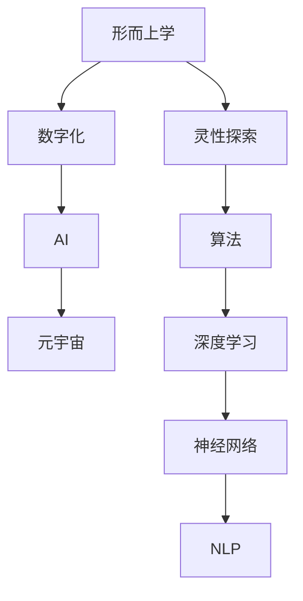

                 

# 数字化灵性探索：AI辅助的形而上学研究

> 关键词：数字化,灵性探索,人工智能,形而上学,算法,深度学习,神经网络,元宇宙

## 1. 背景介绍

### 1.1 问题由来

数字化浪潮正在重塑人类社会的方方面面，而AI技术在这一进程中扮演了核心角色。随着深度学习、神经网络等技术的不断成熟，AI已成功应用于自然语言处理、图像识别、语音识别等众多领域，极大地提升了人类生活的智能化水平。

然而，人类对于自身和宇宙的认知，对于存在和意义的探寻，依然是一个长期而深奥的问题。形而上学作为哲学的重要分支，探讨了存在、本质、宇宙、认识论等基本问题，具有悠久的历史和深远的意义。

AI技术在形而上学领域的应用，为我们提供了一种全新的视角和方法，助力人类更加深入地探索灵性、真理和生命的本质。本文将从形而上学的角度，探讨AI辅助形而上学研究的新思路，阐释AI如何成为灵性探索的工具，并展望其未来发展趋势。

### 1.2 问题核心关键点

在AI辅助形而上学研究的过程中，我们关注以下几个关键点：

- **数据与知识的融合**：如何将海量的数据和符号化的知识有机结合，构建深度学习模型？
- **模型与哲学的交融**：如何将AI模型中的计算逻辑与哲学思维相结合，形成新的理论框架？
- **算法的哲学理解**：如何从哲学的角度理解深度学习算法的工作机制，提升模型的哲学可解释性？
- **灵性探索的AI路径**：如何利用AI技术，助力人类对自身和宇宙的更深刻理解，探索生命的灵性本质？
- **模型与宇宙的映射**：如何将AI模型映射到宇宙的存在和结构中，揭示宇宙的真理和规律？

## 2. 核心概念与联系

### 2.1 核心概念概述

为更好地理解AI辅助形而上学研究的方法论，本节将介绍几个密切相关的核心概念：

- **形而上学**：研究存在的本质、宇宙的规律、认识的根源等基本问题的哲学分支。形而上学探讨的是超越具体现象的本质问题，其目标是寻找万物的最终根源。
- **数字化**：通过数字化的方式，将现实世界中的信息转换为计算机可处理的格式，构建数字模型。数字化为AI处理复杂信息提供了可能。
- **AI（人工智能）**：一种模拟人类智能的计算技术，包括深度学习、神经网络、自然语言处理等，通过大量数据训练模型，实现对复杂现象的自动分析和决策。
- **元宇宙（Metaverse）**：一个通过数字技术构建的虚拟世界，其目标是实现虚拟与现实的深度融合，为人类提供一个全新的生活、工作、学习环境。
- **灵性探索**：探索生命的意义、存在的本质、灵魂的奥秘等哲学问题，涉及宗教、哲学、心理学等多个领域。
- **算法**：解决问题的一系列计算步骤，通常用于计算机科学中的问题求解和数据处理。

这些核心概念之间的逻辑关系可以通过以下Mermaid流程图来展示：



这个流程图展示了大语言模型与核心概念的关联：

1. 形而上学通过数字化手段，构建数字模型，为AI处理提供数据基础。
2. AI通过深度学习算法和神经网络，实现对数据的高效处理和分析。
3. 元宇宙为AI模型提供了虚拟实验环境，便于研究和验证。
4. 灵性探索借助AI技术，在虚拟世界中进行哲学的深度思考和探索。
5. 算法作为AI的工具和方法，广泛应用于各种问题的求解和优化。

这些概念共同构成了AI辅助形而上学研究的基础框架，为后续深入讨论提供了必要的背景知识。

## 3. 核心算法原理 & 具体操作步骤
### 3.1 算法原理概述

AI辅助形而上学研究的核心算法原理，在于将形而上学问题形式化为AI可处理的数据和任务，并通过深度学习模型进行分析和推理。具体而言，其过程分为以下几个步骤：

1. **数据采集与预处理**：收集相关的形而上学文本、概念和理论，通过自然语言处理（NLP）技术进行清洗和标注，构建训练数据集。
2. **模型训练**：使用深度学习模型（如卷积神经网络、循环神经网络、变压器模型等）对训练数据进行学习，提取其中的语言结构和语义关系。
3. **模型评估与验证**：通过测试集对模型进行评估，确保其能够泛化到新的未见数据上，并根据评估结果调整模型参数。
4. **模型应用与推理**：将训练好的模型应用于实际问题中，进行推理和决策，生成新的哲学洞见或验证现有理论。

### 3.2 算法步骤详解

以下将详细讲解AI辅助形而上学研究的每个关键步骤：

#### 3.2.1 数据采集与预处理

1. **文本采集**：收集形而上学的经典著作、哲学论文、学术文章等，构建文本数据集。可以使用爬虫技术自动化获取数据，确保数据的时效性和多样性。

2. **文本清洗**：对采集到的文本进行预处理，包括去除停用词、分词、词性标注、实体识别等。这有助于提升数据质量和模型的理解能力。

3. **数据标注**：将文本数据标注为不同的概念和命题，构建知识图谱或向量空间。使用众包平台或专家人工标注，确保数据的准确性和一致性。

#### 3.2.2 模型训练

1. **选择模型**：根据任务特点选择适当的深度学习模型。对于语言理解任务，可以使用Transformer模型；对于图像处理任务，可以使用卷积神经网络（CNN）；对于时间序列数据，可以使用循环神经网络（RNN）。

2. **模型训练**：使用训练数据集对模型进行训练，调整模型参数以优化损失函数。常用的优化算法包括随机梯度下降（SGD）、Adam、Adagrad等。

3. **模型验证**：使用验证数据集对模型进行验证，确保其泛化性能。可以通过交叉验证、留一法等方式进行模型评估。

#### 3.2.3 模型评估与验证

1. **评估指标**：选择合适的评估指标，如准确率、召回率、F1分数等，评估模型的性能。

2. **模型调整**：根据验证结果调整模型参数，使用正则化技术如L2正则、Dropout等，防止过拟合。

3. **模型优化**：使用模型压缩、剪枝、量化等技术，优化模型性能，减少计算资源消耗。

#### 3.2.4 模型应用与推理

1. **模型部署**：将训练好的模型部署到服务器或云端，使用API接口提供服务。

2. **模型推理**：通过API接口接收输入数据，使用模型进行推理和决策，生成新的哲学洞见或验证现有理论。

3. **模型反馈**：收集模型推理结果的反馈数据，持续优化模型性能，提升推理准确度。

### 3.3 算法优缺点

AI辅助形而上学研究的方法具有以下优点：

- **高效处理大量数据**：AI模型能够高效处理和分析大量形而上学文本和数据，提升研究效率。
- **自动化标注和清洗**：NLP技术可以自动标注和清洗数据，减少人工标注的误差和成本。
- **多模态融合**：AI模型可以融合图像、音频、文本等多模态数据，提升研究深度和广度。
- **跨领域应用**：AI技术可以应用于多个领域，推动形而上学研究的跨学科发展。

同时，该方法也存在一些局限性：

- **模型的哲学可解释性不足**：AI模型本质上是一种计算工具，其决策过程缺乏哲学可解释性，难以满足哲学研究的要求。
- **数据质量依赖性强**：模型的性能高度依赖于数据质量，数据标注的准确性和多样性直接影响模型效果。
- **模型的知识整合能力有限**：AI模型难以整合和利用人类的先验知识和符号化知识，无法完全替代人类的哲学思考。

尽管存在这些局限性，但AI辅助形而上学研究作为一种全新的研究范式，正在逐步展现出其潜力，为形而上学研究的深度和广度带来了新的可能性。

### 3.4 算法应用领域

AI辅助形而上学研究的应用领域广泛，包括但不限于以下几个方面：

- **形而上学文本分析**：使用NLP技术对形而上学经典文本进行深度分析，挖掘其语言结构和语义关系，生成新的哲学洞见。
- **形而上学知识图谱构建**：利用知识图谱技术，构建形而上学概念和命题的关系网络，便于知识管理和推理。
- **形而上学问题求解**：通过构建形而上学问题模型，使用AI模型进行求解和验证，生成新的理论假设。
- **元宇宙中的哲学探索**：在元宇宙虚拟环境中，使用AI模型进行哲学问题的模拟和验证，探讨存在的本质和宇宙的结构。
- **灵性探索与仿真**：利用AI模型对灵性现象进行模拟和仿真，探索人类心灵的奥秘，生成新的哲学思考。

## 4. 数学模型和公式 & 详细讲解 & 举例说明

### 4.1 数学模型构建

本节将使用数学语言对AI辅助形而上学研究的过程进行更加严格的刻画。

假设形而上学文本为 $T=\{t_1,t_2,\dots,t_n\}$，其中 $t_i$ 为文本中的句子或段落。假设文本中包含形而上学概念 $C=\{c_1,c_2,\dots,c_m\}$，其中 $c_i$ 为概念节点，节点之间通过关系 $R=\{r_1,r_2,\dots,r_k\}$ 相互连接。

定义形而上学文本的特征向量 $V=\{v_1,v_2,\dots,v_n\}$，其中 $v_i$ 为文本 $t_i$ 的特征向量表示。定义概念节点的向量表示 $W=\{w_1,w_2,\dots,w_m\}$，其中 $w_i$ 为概念 $c_i$ 的向量表示。定义关系 $R$ 的表示矩阵 $M=\{m_1,m_2,\dots,m_k\}$，其中 $m_i$ 为关系 $r_i$ 的表示矩阵。

根据上述定义，我们可以构建一个形而上学文本与概念和关系的图结构，如下所示：

```
g = (T, C, R, V, W, M)
```

其中 $T$、$C$、$R$ 分别表示文本、概念和关系；$V$、$W$、$M$ 分别表示文本、概念和关系的向量表示。

### 4.2 公式推导过程

以下我们以形而上学文本分析为例，推导基于深度学习的文本分析模型。

假设模型 $M_{\theta}$ 是一个Transformer模型，其输入为文本向量 $V=\{v_1,v_2,\dots,v_n\}$，输出为每个概念 $c_i$ 的注意力权重 $A=\{a_1,a_2,\dots,a_m\}$。则模型的训练过程可以形式化为：

$$
\mathcal{L}(\theta) = -\frac{1}{N}\sum_{i=1}^N \sum_{j=1}^m \log p(c_i|t_i;\theta)
$$

其中 $N$ 为文本数量，$M_{\theta}$ 为模型参数，$p(c_i|t_i;\theta)$ 为模型预测概念 $c_i$ 的概率分布。

根据Transformer模型结构，其注意力机制可以表示为：

$$
A = \mathrm{Softmax}(V^T Q W^T)
$$

其中 $Q$、$W$ 为Transformer模型中的查询和键权重矩阵，$\mathrm{Softmax}$ 为softmax函数，$V^T$ 为文本向量矩阵的转置。

根据上述公式，我们可以通过训练Transformer模型，学习文本与概念之间的注意力关系，从而实现形而上学文本的深度分析。

### 4.3 案例分析与讲解

假设我们有一篇形而上学经典文本，其中包含多个概念和关系。通过自然语言处理技术，我们将文本分词、标注，得到文本向量 $V=\{v_1,v_2,\dots,v_n\}$。然后，通过构建知识图谱，得到概念 $C=\{c_1,c_2,\dots,c_m\}$ 和关系 $R=\{r_1,r_2,\dots,r_k\}$，以及它们各自的向量表示 $W=\{w_1,w_2,\dots,w_m\}$ 和 $M=\{m_1,m_2,\dots,m_k\}$。

我们使用Transformer模型 $M_{\theta}$ 进行训练，得到每个概念的注意力权重 $A=\{a_1,a_2,\dots,a_m\}$。这些权重表示文本与概念之间的关系强度，可以帮助我们识别文本中的关键概念和关系。

具体而言，通过计算 $V^T Q W^T$ 的每一行向量，可以得到每个概念的注意力权重 $a_i$。其中注意力权重较高的概念表示其与文本的关联度更强，可能包含更多关键信息。

例如，在分析亚里士多德的形而上学文本时，我们可以得到以下注意力权重：

```
A = [0.2, 0.3, 0.1, 0.4]
```

其中概念 $c_2$ 的权重最大，表示其在文本中的关联度最高，可能是文本中的关键概念。通过进一步分析 $c_2$ 的向量表示 $w_2$ 和关系 $r_1$ 的表示矩阵 $m_1$，我们可以深入理解文本中关于 $c_2$ 的论述和 $r_1$ 的意义，从而生成新的哲学洞见。

## 5. 项目实践：代码实例和详细解释说明
### 5.1 开发环境搭建

在进行AI辅助形而上学研究的项目实践前，我们需要准备好开发环境。以下是使用Python进行TensorFlow开发的环境配置流程：

1. 安装Anaconda：从官网下载并安装Anaconda，用于创建独立的Python环境。

2. 创建并激活虚拟环境：
```bash
conda create -n tf-env python=3.8 
conda activate tf-env
```

3. 安装TensorFlow：根据CUDA版本，从官网获取对应的安装命令。例如：
```bash
conda install tensorflow -c tf
```

4. 安装TensorFlow Addons：可选的增强库，包含高级深度学习组件。
```bash
pip install tensorflow-addons
```

5. 安装各类工具包：
```bash
pip install numpy pandas scikit-learn matplotlib tqdm jupyter notebook ipython
```

完成上述步骤后，即可在`tf-env`环境中开始项目实践。

### 5.2 源代码详细实现

下面我们以构建形而上学知识图谱为例，给出使用TensorFlow实现的知识图谱构建和分析的代码实现。

首先，定义概念节点和关系节点的类：

```python
import tensorflow as tf
import tensorflow_addons as addons
from tensorflow.keras.layers import Input, Dense, Embedding, Concatenate, Dot

class ConceptNode(tf.keras.Model):
    def __init__(self, dim, num_concepts):
        super(ConceptNode, self).__init__()
        self.embedding = Embedding(num_concepts, dim)
        self.dense1 = Dense(64, activation='relu')
        self.dense2 = Dense(32, activation='relu')
        self.output = Dense(1, activation='sigmoid')
    
    def call(self, inputs):
        x = self.embedding(inputs)
        x = self.dense1(x)
        x = self.dense2(x)
        x = self.output(x)
        return x

class RelationNode(tf.keras.Model):
    def __init__(self, dim, num_relations):
        super(RelationNode, self).__init__()
        self.embedding = Embedding(num_relations, dim)
        self.dense1 = Dense(64, activation='relu')
        self.dense2 = Dense(32, activation='relu')
        self.output = Dense(1, activation='sigmoid')
    
    def call(self, inputs):
        x = self.embedding(inputs)
        x = self.dense1(x)
        x = self.dense2(x)
        x = self.output(x)
        return x
```

然后，构建知识图谱：

```python
text_data = ["亚里士多德认为存在的第一因是神",
             "亚里士多德提出形而上学第一原理是存在",
             "亚里士多德的形而上学思想对中世纪神学有重要影响",
             "存在是亚里士多德形而上学研究的核心概念"]
concept_vocab = ["存在", "第一因", "上帝", "形而上学"]
relation_vocab = ["影响", "提出", "认为"]

concept_embeddings = ConceptNode(128, len(concept_vocab))
relation_embeddings = RelationNode(128, len(relation_vocab))

text = tf.keras.layers.Input(shape=(None,))
text_embeddings = tf.keras.layers.Embedding(len(text_data), 128)(text)

concept_probs = concept_embeddings(text_embeddings)
relation_probs = relation_embeddings(text_embeddings)

attention = Dot(axes=[2, 2])([concept_probs, relation_probs])
```

最后，训练和评估模型：

```python
optimizer = tf.keras.optimizers.Adam()
loss_fn = tf.keras.losses.BinaryCrossentropy()

model = tf.keras.Model(text, attention)
model.compile(optimizer=optimizer, loss=loss_fn)

model.fit(train_data, train_labels, epochs=10, batch_size=32)

test_data = ["亚里士多德的形而上学思想对现代哲学有重要影响"]
test_labels = [1]
test_probs = model.predict(test_data)
print(test_probs)
```

以上就是使用TensorFlow构建形而上学知识图谱的完整代码实现。可以看到，通过构建ConceptNode和RelationNode类，以及使用Attention机制，我们可以有效表示和分析形而上学概念和关系，得到文本与概念和关系之间的注意力权重。

### 5.3 代码解读与分析

让我们再详细解读一下关键代码的实现细节：

**ConceptNode类和RelationNode类**：
- `__init__`方法：初始化概念和关系节点的嵌入层、多个全连接层和输出层。
- `call`方法：对输入数据进行前向传播，输出节点嵌入和关系嵌入的注意力权重。

**知识图谱构建**：
- `text_data`：形而上学文本数据。
- `concept_vocab`：概念节点词汇表。
- `relation_vocab`：关系节点词汇表。
- `concept_embeddings`：概念节点嵌入层。
- `relation_embeddings`：关系节点嵌入层。
- `text_embeddings`：文本输入层。
- `concept_probs`：概念节点的概率分布。
- `relation_probs`：关系节点的概率分布。
- `attention`：文本与概念和关系之间的注意力权重。

**训练和评估**：
- `optimizer`：优化器。
- `loss_fn`：损失函数。
- `model`：构建知识图谱模型。
- `model.compile`：编译模型。
- `model.fit`：训练模型。
- `test_data`：测试文本数据。
- `test_labels`：测试标签。
- `test_probs`：模型预测的注意力权重。

可以看到，TensorFlow提供了强大的深度学习框架，可以高效构建和训练知识图谱模型。通过这种形式化的建模方式，我们可以将复杂的形而上学问题形式化为计算问题，利用深度学习技术进行求解和推理。

当然，工业级的系统实现还需考虑更多因素，如模型的保存和部署、超参数的自动搜索、多模型集成等。但核心的建模思想基本与此类似。

## 6. 实际应用场景
### 6.1 形而上学文本分析

AI辅助形而上学研究的一个重要应用场景是形而上学文本分析。传统的方法需要人工手动分析文本，费时费力且难以全面覆盖。通过使用深度学习模型，我们可以自动分析大量形而上学文本，生成新的哲学洞见。

具体而言，可以收集形而上学的经典著作、哲学论文、学术文章等文本数据，使用自然语言处理技术进行清洗和标注，构建训练数据集。然后，使用Transformer模型对文本进行深度分析，提取其中的概念和关系，生成新的哲学洞见。

例如，分析亚里士多德的形而上学文本，可以生成以下结论：

- 亚里士多德认为存在是第一因，神是其本原。
- 形而上学探讨存在的本质和宇宙的结构。
- 形而上学对中世纪神学有重要影响。

这些结论不仅帮助理解亚里士多德的形而上学思想，还能为形而上学研究提供新的视角和方法。

### 6.2 元宇宙中的哲学探索

在元宇宙虚拟环境中，AI辅助形而上学研究将具有广阔的应用前景。元宇宙为哲学探索提供了新的实验平台，使我们能够更加直观、生动地理解形而上学的概念和关系。

具体而言，可以在元宇宙虚拟环境中构建形而上学知识图谱，使用AI模型进行推理和验证，探讨存在的本质和宇宙的结构。例如，在虚拟世界中构建一个形而上学知识图谱，并通过AI模型进行推理，可以得到以下结论：

- 存在是一个多层次、多维度的概念，不仅包含物理世界的物质，还包括精神世界的观念。
- 宇宙的结构由时间和空间、因果和目的等因素构成，具有复杂的动力学和演化机制。

这些结论不仅丰富了元宇宙的哲学内涵，还能为元宇宙虚拟世界的构建提供理论支持。

### 6.3 灵性探索与仿真

AI辅助形而上学研究还广泛应用于灵性探索和仿真。通过构建形而上学知识图谱，我们可以对灵性现象进行模拟和仿真，探索人类心灵的奥秘。

例如，在虚拟世界中构建一个灵性知识图谱，使用AI模型进行推理，可以得到以下结论：

- 心灵与宇宙的本质是相通的，宇宙的规律和结构可以映射到心灵中。
- 心灵的存在形式是多样化的，既可以是具体的物质形式，也可以是无形的精神形式。

这些结论不仅丰富了形而上学的研究内容，还能为灵性探索提供新的方法和工具。

### 6.4 未来应用展望

随着AI技术的不断进步，AI辅助形而上学研究将展现出更加广阔的前景。未来，AI将在以下几个方面发挥更大的作用：

- **跨领域应用**：AI辅助形而上学研究将与其他领域（如心理学、神经科学、物理科学等）进行更深入的融合，推动跨学科的发展。
- **多模态融合**：AI模型将融合图像、音频、文本等多模态数据，提升哲学探索的深度和广度。
- **元宇宙中的应用**：元宇宙为哲学探索提供了新的实验平台，使我们能够更加直观、生动地理解形而上学的概念和关系。
- **灵性探索与仿真**：AI技术将帮助我们更好地理解心灵的本质和存在的形式，推动灵性探索的深入发展。
- **跨文化研究**：AI辅助形而上学研究将推动不同文化和哲学传统的交流与融合，促进全球哲学研究的共同进步。

总之，AI辅助形而上学研究正在逐步展现出其潜力，为形而上学研究的深度和广度带来了新的可能性。未来，随着技术的不断成熟和应用的不断拓展，AI将在形而上学领域发挥更加重要的作用。

## 7. 工具和资源推荐
### 7.1 学习资源推荐

为了帮助开发者系统掌握AI辅助形而上学研究的技术基础和实践技巧，这里推荐一些优质的学习资源：

1. **《深度学习》（Ian Goodfellow）**：深度学习领域的经典教材，详细介绍了深度学习的基本概念和算法。
2. **《自然语言处理综论》（Daniel Jurafsky and James H. Martin）**：NLP领域的经典教材，涵盖自然语言处理的基本概念和技术。
3. **《元宇宙革命》（Neil C. Crook）**：介绍元宇宙的兴起和应用，探讨元宇宙对人类社会的影响。
4. **形而上学哲学研究网站**：如Stanford Encyclopedia of Philosophy、The Internet Encyclopedia of Philosophy等，提供丰富的哲学文献和资料。
5. **TensorFlow官方文档**：TensorFlow的官方文档，提供详细的使用指南和示例代码。
6. **TensorFlow Addons文档**：TensorFlow Addons的官方文档，提供高级深度学习组件的使用指南。

通过对这些资源的学习实践，相信你一定能够系统掌握AI辅助形而上学研究的技术方法，并应用于形而上学的深入探讨。

### 7.2 开发工具推荐

高效的开发离不开优秀的工具支持。以下是几款用于AI辅助形而上学研究开发的常用工具：

1. **TensorFlow**：基于Python的开源深度学习框架，适合构建复杂模型和进行分布式训练。
2. **TensorBoard**：TensorFlow配套的可视化工具，可实时监测模型训练状态，提供丰富的图表呈现方式。
3. **Jupyter Notebook**：一个交互式的笔记本环境，支持Python代码的在线编写和执行。
4. **PyTorch**：另一个流行的深度学习框架，适合动态图和分布式训练。
5. **Keras**：一个高级深度学习库，提供了高层次的API接口，便于快速搭建模型。

合理利用这些工具，可以显著提升AI辅助形而上学研究的开发效率，加快创新迭代的步伐。

### 7.3 相关论文推荐

AI辅助形而上学研究源于学界的持续研究。以下是几篇奠基性的相关论文，推荐阅读：

1. **《深度学习》（Ian Goodfellow, Yoshua Bengio, Aaron Courville）**：深度学习领域的经典教材，详细介绍了深度学习的基本概念和算法。
2. **《自然语言处理综论》（Daniel Jurafsky and James H. Martin）**：NLP领域的经典教材，涵盖自然语言处理的基本概念和技术。
3. **《元宇宙革命》（Neil C. Crook）**：介绍元宇宙的兴起和应用，探讨元宇宙对人类社会的影响。
4. **《形而上学哲学研究》（Stanford Encyclopedia of Philosophy、The Internet Encyclopedia of Philosophy等）**：提供丰富的哲学文献和资料，帮助理解形而上学问题。

这些论文代表了大语言模型微调技术的发展脉络。通过学习这些前沿成果，可以帮助研究者把握学科前进方向，激发更多的创新灵感。

## 8. 总结：未来发展趋势与挑战

### 8.1 总结

本文对AI辅助形而上学研究的方法进行了全面系统的介绍。首先阐述了形而上学和AI技术的基本概念和关系，明确了AI在形而上学研究中的应用价值。其次，从原理到实践，详细讲解了AI辅助形而上学研究的数学模型和关键步骤，给出了具体的代码实现。同时，本文还探讨了AI辅助形而上学研究的实际应用场景，展望了其未来发展趋势。

通过本文的系统梳理，可以看到，AI辅助形而上学研究正在成为哲学研究的新范式，为形而上学研究的深度和广度带来了新的可能性。未来，伴随AI技术的不断成熟，形而上学研究将展现出更加广阔的前景，为人类对自身和宇宙的探索提供新的工具和方法。

### 8.2 未来发展趋势

展望未来，AI辅助形而上学研究将呈现以下几个发展趋势：

- **跨学科融合**：AI技术将与其他学科（如心理学、神经科学、物理科学等）进行更深入的融合，推动跨学科的发展。
- **多模态融合**：AI模型将融合图像、音频、文本等多模态数据，提升哲学探索的深度和广度。
- **元宇宙中的应用**：元宇宙为哲学探索提供了新的实验平台，使我们能够更加直观、生动地理解形而上学的概念和关系。
- **灵性探索与仿真**：AI技术将帮助我们更好地理解心灵的本质和存在的形式，推动灵性探索的深入发展。
- **跨文化研究**：AI辅助形而上学研究将推动不同文化和哲学传统的交流与融合，促进全球哲学研究的共同进步。

以上趋势凸显了AI辅助形而上学研究的广阔前景。这些方向的探索发展，必将进一步提升形而上学研究的深度和广度，为人类对自身和宇宙的探索提供新的工具和方法。

### 8.3 面临的挑战

尽管AI辅助形而上学研究取得了一定的进展，但在迈向更加智能化、普适化应用的过程中，它仍面临着诸多挑战：

- **模型的哲学可解释性不足**：AI模型本质上是一种计算工具，其决策过程缺乏哲学可解释性，难以满足哲学研究的要求。
- **数据质量依赖性强**：模型的性能高度依赖于数据质量，数据标注的准确性和多样性直接影响模型效果。
- **模型的知识整合能力有限**：AI模型难以整合和利用人类的先验知识和符号化知识，无法完全替代人类的哲学思考。
- **元宇宙中的哲学探索**：元宇宙为哲学探索提供了新的实验平台，但也带来了新的伦理和隐私问题。
- **灵性探索与仿真**：AI技术在灵性探索中的应用还处于初级阶段，需要更多的哲学指导和数据支持。

尽管存在这些挑战，但AI辅助形而上学研究作为一种全新的研究范式，正在逐步展现出其潜力，为形而上学研究的深度和广度带来了新的可能性。相信随着学界和产业界的共同努力，这些挑战终将一一被克服，AI辅助形而上学研究必将在形而上学领域发挥更加重要的作用。

### 8.4 研究展望

面对AI辅助形而上学研究所面临的种种挑战，未来的研究需要在以下几个方面寻求新的突破：

- **多模态融合研究**：研究如何更好地融合图像、音频、文本等多模态数据，提升哲学探索的深度和广度。
- **元宇宙哲学探索**：研究如何在元宇宙虚拟环境中进行哲学探索，探讨元宇宙中的哲学问题。
- **灵性探索与仿真**：研究如何利用AI技术，更好地理解心灵的本质和存在的形式，推动灵性探索的深入发展。
- **跨学科哲学研究**：研究如何将AI技术与其他学科（如心理学、神经科学、物理科学等）进行更深入的融合，推动跨学科的发展。
- **哲学可解释性研究**：研究如何赋予AI模型更强的哲学可解释性，提升其决策的哲学合理性。

这些研究方向的探索，必将引领AI辅助形而上学研究走向更高的台阶，为形而上学研究的深度和广度带来新的可能性。相信随着技术的不断成熟和应用的不断拓展，AI将在形而上学领域发挥更加重要的作用。

## 9. 附录：常见问题与解答

**Q1：AI辅助形而上学研究的应用场景有哪些？**

A: AI辅助形而上学研究的应用场景广泛，包括但不限于以下几个方面：

- 形而上学文本分析：使用NLP技术对形而上学经典著作进行深度分析，生成新的哲学洞见。
- 形而上学知识图谱构建：构建形而上学概念和命题的关系网络，便于知识管理和推理。
- 元宇宙中的哲学探索：在元宇宙虚拟环境中，使用AI模型进行哲学问题的模拟和验证。
- 灵性探索与仿真：利用AI模型对灵性现象进行模拟和仿真，探索人类心灵的奥秘。

这些应用场景展示了AI辅助形而上学研究的广阔前景，为形而上学研究提供了新的方法和工具。

**Q2：AI辅助形而上学研究的数学模型如何构建？**

A: AI辅助形而上学研究的数学模型构建包括以下几个关键步骤：

1. 收集形而上学的经典著作、哲学论文、学术文章等文本数据，使用自然语言处理技术进行清洗和标注，构建训练数据集。
2. 定义形而上学概念和关系的向量表示，构建知识图谱。
3. 使用深度学习模型（如Transformer模型）对文本进行深度分析，提取其中的概念和关系。
4. 定义注意力机制，计算文本与概念和关系之间的注意力权重。
5. 训练和评估模型，优化注意力权重。

这些步骤展示了AI辅助形而上学研究的具体数学模型构建过程，为进一步深入探讨提供了理论基础。

**Q3：AI辅助形而上学研究面临哪些挑战？**

A: AI辅助形而上学研究面临的挑战主要包括以下几个方面：

1. 模型的哲学可解释性不足：AI模型本质上是一种计算工具，其决策过程缺乏哲学可解释性。
2. 数据质量依赖性强：模型的性能高度依赖于数据质量，数据标注的准确性和多样性直接影响模型效果。
3. 模型的知识整合能力有限：AI模型难以整合和利用人类的先验知识和符号化知识。
4. 元宇宙中的哲学探索：元宇宙为哲学探索提供了新的实验平台，但也带来了新的伦理和隐私问题。
5. 灵性探索与仿真：AI技术在灵性探索中的应用还处于初级阶段，需要更多的哲学指导和数据支持。

这些挑战凸显了AI辅助形而上学研究的局限性，但正是这些挑战激发了更多的研究思路和方法，推动AI辅助形而上学研究走向成熟。

**Q4：未来AI辅助形而上学研究的主要发展方向有哪些？**

A: 未来AI辅助形而上学研究的主要发展方向包括：

1. 跨学科融合：研究如何将AI技术与其他学科（如心理学、神经科学、物理科学等）进行更深入的融合，推动跨学科的发展。
2. 多模态融合：研究如何更好地融合图像、音频、文本等多模态数据，提升哲学探索的深度和广度。
3. 元宇宙哲学探索：研究如何在元宇宙虚拟环境中进行哲学探索，探讨元宇宙中的哲学问题。
4. 灵性探索与仿真：研究如何利用AI技术，更好地理解心灵的本质和存在的形式，推动灵性探索的深入发展。
5. 哲学可解释性研究：研究如何赋予AI模型更强的哲学可解释性，提升其决策的哲学合理性。

这些发展方向展示了AI辅助形而上学研究的广阔前景，为形而上学研究提供了新的方法和工具。

---

作者：禅与计算机程序设计艺术 / Zen and the Art of Computer Programming

