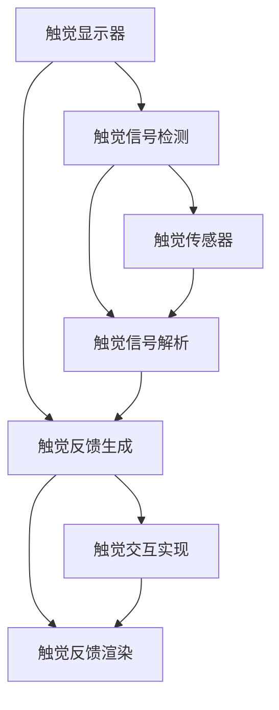

                 

# 数字化触觉模拟创业：虚拟世界的真实触感

在数字化浪潮席卷全球的今天，触觉模拟技术成为了前沿科技的热点。通过虚拟现实(VR)、增强现实(AR)等技术的结合，我们可以创造一个触觉可交互的虚拟世界，让用户在数字环境中感受到真实的触感。这不仅为游戏、训练、医疗等领域带来了革命性变化，也开创了新的创业机会。本文将深入探讨数字化触觉模拟的原理、算法、实践案例及未来展望，为创业者和技术爱好者提供全面的技术指引。

## 1. 背景介绍

### 1.1 问题由来

触觉模拟技术，即通过技术手段让虚拟世界中的物体和环境具备触觉反馈，使用户能够通过触摸和交互感受到物体的质地、温度、重量等真实属性。这一技术能够极大地提升虚拟环境的沉浸感和体验度，对游戏、医疗、训练、工业仿真等领域具有深远影响。

尽管当前触觉模拟技术已有所突破，但触觉反馈的精度和实时性仍存在较大差距，这限制了其广泛应用。因此，如何高效生成触觉反馈，实现成本可控、效果逼真的触觉模拟，成为数字化创业领域的一个前沿课题。

### 1.2 问题核心关键点

触觉模拟的核心在于两个关键问题：一是如何生成精确的触觉反馈，二是如何在硬件设备上实现实时响应的触觉交互。当前主要的技术手段包括：

1. **触觉反馈生成**：包括触觉显示器、触觉手套、触觉服等硬件设备，以及触觉信号的生成算法。
2. **触觉交互实现**：涉及触觉传感器的检测与反馈，以及触觉信号的处理与解析。

这两个问题紧密相关，需要通过软硬件协同设计来实现理想的触觉模拟效果。

### 1.3 问题研究意义

触觉模拟技术的成功应用，对于提升用户体验、推动多模态人机交互技术的发展具有重要意义：

1. **增强用户体验**：通过触觉反馈，用户能够更直观地与虚拟环境互动，提升游戏、训练等活动的沉浸感。
2. **推动工业仿真**：在复杂系统中，触觉模拟可以用于模拟危险或难以实现的实验，提升安全性。
3. **医疗训练**：触觉反馈可以用于模拟手术、急救等高难度操作，提高医疗人员的操作技能。
4. **游戏娱乐**：触觉模拟带来新奇的互动体验，拓宽了游戏产业的发展空间。

通过本节的介绍，读者可以清晰地了解触觉模拟技术的研究背景及其应用前景，从而对后续章节的内容有一个全面把握。

## 2. 核心概念与联系

### 2.1 核心概念概述

触觉模拟涉及多个关键概念和技术，以下将逐一介绍：

- **触觉显示器(Tactile Display)**：利用力反馈技术，在屏幕上生成触觉反馈。
- **触觉手套(Tactile Gloves)**：穿戴在用户手上，通过传感器捕捉用户触觉反应，并驱动机械装置生成触觉反馈。
- **触觉服(Tactile Garments)**：用于全身触觉反馈，通过穿戴式传感器和机械装置，模拟真实物体的触感。
- **触觉信号生成**：通过算法生成触觉反馈信号，用于触觉设备的驱动和控制。
- **触觉传感器**：用于检测用户触觉反应，生成触觉反馈。

这些概念之间通过软硬件协同工作，共同实现了触觉模拟的效果。

### 2.2 核心概念原理和架构的 Mermaid 流程图



该流程图展示了触觉模拟的核心流程：触觉显示器生成触觉反馈，触觉传感器检测触觉信号，并解析生成触觉反馈信号，最终通过触觉交互实现触觉渲染。

### 2.3 核心概念之间的联系

触觉模拟涉及触觉设备的设计和触觉信号的生成与解析，需要通过软硬件的协同工作实现。触觉显示器、触觉手套、触觉服等硬件设备，结合触觉传感器和触觉信号生成算法，构成了完整的触觉模拟系统。

## 3. 核心算法原理 & 具体操作步骤

### 3.1 算法原理概述

触觉模拟的算法原理主要涉及触觉信号的生成和触觉反馈的渲染。以触觉手套为例，其工作原理如下：

1. **触觉信号生成**：用户通过触觉手套与虚拟环境互动，触觉传感器捕捉手套的变形和位置信息。
2. **触觉信号解析**：将传感器数据转换为触觉信号，描述物体表面的触感属性。
3. **触觉反馈渲染**：根据触觉信号，触觉显示器生成触觉反馈，模拟物体的触感。

这一过程通过软硬件协同实现，需要精确的信号生成和解析算法，以及高效的触觉反馈渲染技术。

### 3.2 算法步骤详解

以下是触觉手套触觉信号生成和触觉反馈渲染的详细步骤：

1. **触觉信号生成**：
   - 将触觉手套的变形信息采集为传感器数据。
   - 利用FEM(Finite Element Method)模型对传感器数据进行解析，得到触觉信号。
   - 触觉信号包括物体的硬度、弹性、粘性等属性，用于后续的触觉反馈渲染。

2. **触觉反馈渲染**：
   - 根据触觉信号，设计触觉反馈的力反馈曲线。
   - 触觉显示器通过力反馈技术，生成触觉反馈。
   - 触觉反馈的强度、振动频率等参数，需要与触觉信号相匹配，以达到逼真的触感效果。

### 3.3 算法优缺点

触觉模拟的算法具有以下优点：

- **真实感强**：通过软硬件结合，生成逼真的触觉反馈，显著提升用户体验。
- **应用广泛**：适用于游戏、训练、医疗等多个领域，具有广阔的市场前景。

但同时也存在一些缺点：

- **成本高**：高级的触觉设备如触觉服、触觉手套，成本较高，制约了技术的普及。
- **精度有限**：当前的触觉反馈技术在精度和实时性方面仍有较大提升空间。

### 3.4 算法应用领域

触觉模拟技术已在多个领域得到了应用，包括：

- **游戏娱乐**：在虚拟游戏中，触觉手套可以带来新奇的交互体验。
- **训练模拟**：在飞行训练、外科手术训练等场景，触觉反馈可以提升训练效果。
- **医疗健康**：通过触觉反馈，医生可以更直观地进行诊断和治疗操作。
- **工业仿真**：在危险或昂贵的操作中，触觉模拟可以替代真实实验，提高安全性。

## 4. 数学模型和公式 & 详细讲解 & 举例说明

### 4.1 数学模型构建

触觉模拟的数学模型主要涉及触觉信号的生成和触觉反馈的渲染。以触觉手套为例，其数学模型构建如下：

设触觉手套的变形量为 $u$，传感器采集的数据为 $x$，触觉信号为 $s$，触觉反馈的力反馈曲线为 $f$。触觉模拟的数学模型可以表示为：

$$
s = f(x)
$$

其中，$f$ 为触觉信号生成函数，$x$ 为传感器采集的数据。

### 4.2 公式推导过程

以触觉手套为例，其触觉信号生成函数的推导如下：

1. **传感器数据采集**：触觉手套的变形量为 $u$，传感器采集的数据为 $x$，关系可以表示为：

$$
x = h(u)
$$

其中 $h$ 为传感器数据采集函数，$u$ 为变形量。

2. **触觉信号生成**：将传感器数据 $x$ 转换为触觉信号 $s$，关系可以表示为：

$$
s = g(x)
$$

其中 $g$ 为触觉信号生成函数。

3. **触觉反馈渲染**：根据触觉信号 $s$，生成触觉反馈 $f$，关系可以表示为：

$$
f = p(s)
$$

其中 $p$ 为触觉反馈渲染函数。

### 4.3 案例分析与讲解

以虚拟现实游戏中的触觉模拟为例，触觉手套通过传感器捕捉用户的手部变形数据，利用FEM模型解析生成触觉信号，然后将触觉信号转换为触觉反馈，驱动触觉显示器输出力反馈。

## 5. 项目实践：代码实例和详细解释说明

### 5.1 开发环境搭建

以下是触觉模拟项目的开发环境搭建步骤：

1. **硬件准备**：触觉手套、力反馈显示器等触觉设备。
2. **软件准备**：Python编程语言，触觉模拟框架如Vivideo、Oculus Touch等。
3. **环境搭建**：安装所需的开发库和工具，如PyTorch、NumPy、OpenCV等。

### 5.2 源代码详细实现

以下是一个触觉模拟项目的示例代码：

```python
import numpy as np
import pyvivideo as viv

# 定义触觉信号生成函数
def generate_tactile_signal(x):
    # 解析传感器数据
    u = parse_sensor_data(x)
    # 生成触觉信号
    s = g(u)
    return s

# 定义触觉反馈渲染函数
def render_tactile_feedback(s):
    # 生成触觉反馈
    f = p(s)
    # 驱动触觉显示器输出力反馈
    display_tactile_feedback(f)

# 主函数
def main():
    # 初始化触觉设备
    viv.initialize_vivideo()
    # 获取传感器数据
    x = viv.get_sensor_data()
    # 生成触觉信号
    s = generate_tactile_signal(x)
    # 渲染触觉反馈
    render_tactile_feedback(s)

if __name__ == '__main__':
    main()
```

### 5.3 代码解读与分析

- **生成触觉信号**：将传感器数据解析为变形量 $u$，再生成触觉信号 $s$。
- **渲染触觉反馈**：根据触觉信号生成触觉反馈 $f$，并驱动触觉显示器输出力反馈。

### 5.4 运行结果展示

运行代码后，触觉手套将通过传感器捕捉用户的手部变形数据，并生成触觉信号和触觉反馈。用户可以通过触觉反馈感受到虚拟环境中物体的质地和温度。

## 6. 实际应用场景

### 6.1 游戏娱乐

在游戏领域，触觉模拟可以极大地提升用户体验。例如，在《生化危机》系列游戏中，玩家可以通过触觉手套感受逼真的枪械震动，提升游戏的沉浸感。触觉模拟技术也在《半条命2》等游戏中得到应用，带来更加真实的手部互动体验。

### 6.2 训练模拟

在训练领域，触觉模拟可以用于模拟危险或昂贵的操作。例如，在飞行训练中，触觉手套可以模拟飞机控制器的震动反馈，提升飞行员的操作技能。在医疗领域，触觉反馈可以用于模拟手术操作，提高医生的操作精度。

### 6.3 医疗健康

在医疗健康领域，触觉反馈可以用于辅助诊断和治疗。例如，在手术模拟中，医生可以通过触觉反馈感受到手术器械的力度和反馈，提升手术的准确性和安全性。在康复训练中，触觉反馈可以用于模拟关节的振动反馈，帮助患者恢复肌肉力量。

### 6.4 工业仿真

在工业仿真领域，触觉模拟可以用于替代真实实验，降低实验成本，提升安全性。例如，在汽车制造中，触觉模拟可以用于模拟汽车的碰撞测试，提前发现潜在的安全隐患。在核电站维护中，触觉反馈可以用于模拟核电站内部的操作，提高维护效率。

## 7. 工具和资源推荐

### 7.1 学习资源推荐

1. **《触觉模拟技术》系列博文**：深度介绍触觉模拟的原理、算法和应用案例，适合技术入门。
2. **Oculus Touch官方文档**：详细讲解Oculus Touch设备的安装和使用，适合硬件开发。
3. **Vivideo官方文档**：提供触觉模拟框架的使用教程和案例，适合软件开发。
4. **《触觉模拟的现状与展望》论文**：全面分析当前触觉模拟技术的现状和未来趋势，适合学术研究。
5. **《触觉反馈生成与渲染》书籍**：深入讲解触觉反馈的生成和渲染技术，适合技术深入。

### 7.2 开发工具推荐

1. **PyTorch**：深度学习框架，支持高效的数学计算和模型训练，适合算法开发。
2. **NumPy**：科学计算库，提供高效的数组操作和数学运算，适合数据处理。
3. **OpenCV**：计算机视觉库，提供丰富的图像处理和传感器数据解析功能，适合硬件开发。
4. **PyVivideo**：触觉模拟框架，支持触觉信号的生成和渲染，适合软件开发。

### 7.3 相关论文推荐

1. **《触觉显示器中的力反馈控制》**：研究触觉显示器的力反馈控制方法，提升触觉反馈的逼真度。
2. **《触觉手套中的传感器数据解析》**：研究触觉手套的传感器数据解析方法，提高触觉信号的准确性。
3. **《触觉反馈的生成与渲染技术》**：研究触觉反馈的生成和渲染方法，提高触觉反馈的实时性和精度。

## 8. 总结：未来发展趋势与挑战

### 8.1 研究成果总结

本文深入探讨了数字化触觉模拟的原理、算法和应用，通过硬件和软件的协同设计，实现了逼真的触觉反馈。触觉模拟技术在游戏、训练、医疗等多个领域展现了广阔的应用前景。

### 8.2 未来发展趋势

未来，触觉模拟技术将在以下几个方面进一步发展：

1. **精度提升**：通过更先进的传感器和解析算法，触觉信号的精度将进一步提升，触觉反馈将更加逼真。
2. **成本降低**：随着技术的成熟和市场的扩大，触觉设备的成本将逐步降低，触觉模拟将更广泛地应用于各领域。
3. **多模态融合**：触觉模拟将与视觉、听觉等多模态信息融合，提升用户交互的丰富性和逼真度。
4. **实时化增强**：通过更高效的算法和硬件优化，触觉反馈将实现实时响应，提升用户的互动体验。
5. **跨平台兼容**：触觉模拟技术将支持更多平台和设备，提供更广泛的触觉交互体验。

### 8.3 面临的挑战

尽管触觉模拟技术取得了一定的进展，但在实际应用中仍面临一些挑战：

1. **成本高**：高级触觉设备如触觉服、触觉手套，成本较高，制约了技术的普及。
2. **精度有限**：当前触觉反馈技术在精度和实时性方面仍有较大提升空间。
3. **硬件兼容**：不同平台和设备的兼容性问题，增加了触觉模拟的复杂度。
4. **用户体验**：触觉反馈的复杂度和设计，需要考虑用户的舒适度和适应性。

### 8.4 研究展望

面对上述挑战，未来的研究需要从以下几个方面进行突破：

1. **低成本硬件设计**：通过优化硬件设计，降低触觉设备的成本，提高市场接受度。
2. **高精度算法优化**：开发更高效的触觉信号解析和触觉反馈渲染算法，提升触觉模拟的精度和实时性。
3. **多模态融合技术**：研究触觉、视觉、听觉等多模态信息的融合技术，提升用户体验。
4. **智能触觉系统**：开发智能触觉系统，通过机器学习等技术，动态调整触觉反馈的强度和频率，提升交互的自然性和逼真度。
5. **人机交互设计**：研究人机交互设计，提升触觉设备的使用舒适度和适应性，减少用户的不适感。

通过这些研究方向的探索和突破，触觉模拟技术将迈向更高的台阶，为数字化触觉交互带来新的突破，推动更多领域的创新应用。

## 9. 附录：常见问题与解答

**Q1：触觉模拟技术是否适用于所有场景？**

A: 触觉模拟技术适用于大部分需要触觉反馈的场景，如游戏、训练、医疗等。但对于一些特定的场景，如军事模拟、危险作业等，仍需要结合其他感官反馈，实现多模态信息融合。

**Q2：触觉手套的精度如何提升？**

A: 提高触觉手套的精度需要从多个方面进行改进：
1. **传感器优化**：采用更高级的传感器，如力敏传感器、应变片等，提升数据的精确度。
2. **算法优化**：开发更高效的触觉信号解析算法，减少解析误差。
3. **模型优化**：通过机器学习等技术，动态调整触觉反馈的强度和频率，提高触觉模拟的逼真度。

**Q3：如何降低触觉设备的成本？**

A: 降低触觉设备的成本可以从以下几个方面入手：
1. **材料选择**：采用价格低廉但性能稳定的材料，降低设备成本。
2. **批量生产**：通过规模化生产，降低单位成本。
3. **技术改进**：通过技术改进，提高设备的可靠性和耐用性，减少维护成本。

**Q4：触觉设备如何与虚拟现实设备集成？**

A: 触觉设备与虚拟现实设备的集成可以通过以下步骤实现：
1. **硬件连接**：将触觉设备通过接口与虚拟现实设备连接，实现数据传输。
2. **数据同步**：通过同步技术，实现触觉设备与虚拟环境的同步响应，提升用户体验。
3. **系统优化**：通过优化系统和算法，提升触觉设备的响应速度和精度，确保流畅的交互体验。

通过这些问题的解答，读者可以更全面地了解触觉模拟技术的应用和优化方向，为后续的实践和创新奠定基础。

---

作者：禅与计算机程序设计艺术 / Zen and the Art of Computer Programming

