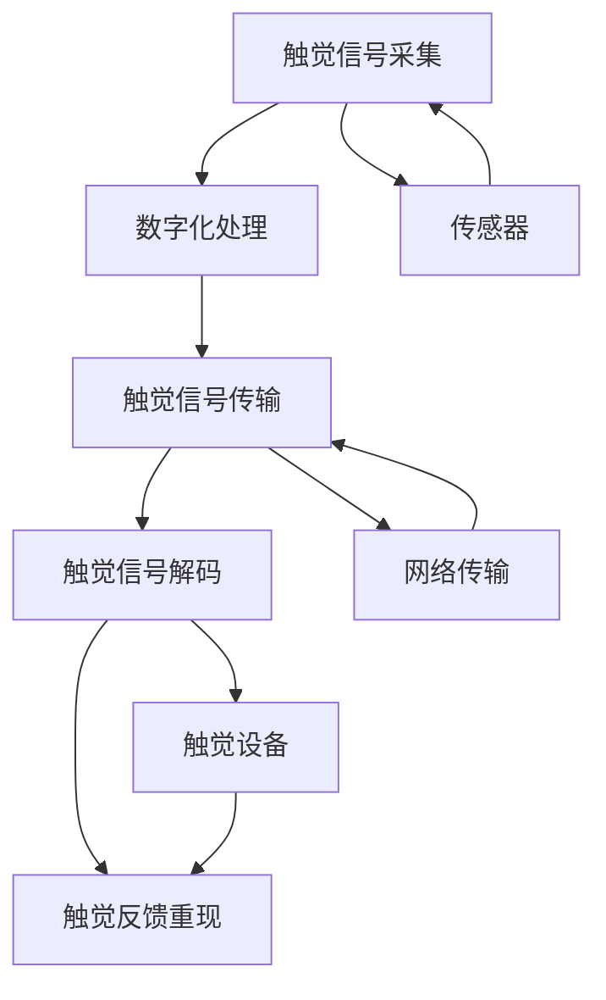

                 

# 数字化触觉通讯创业：远程情感传递的新方式

> 关键词：数字化触觉通讯, 远程情感传递, 触觉反馈, 人机交互, 人机协同, 心理影响, 应用场景, 技术挑战, 创新趋势, 创业机会

## 1. 背景介绍

### 1.1 问题由来

随着信息技术的飞速发展，人类社会的交流方式已从传统的文字和语音，逐步拓展到图像和视频，甚至包括触觉等感官体验。触觉作为一种重要的交互手段，对增强人与人之间的情感联结具有不可替代的作用。然而，由于物理空间限制，触觉的远程传递一直是一个难题。传统的手段如邮件、电话、视频会议虽然可以传递语言和视觉信息，但缺乏触觉反馈，难以充分表达人类的情感和复杂意图。

数字化触觉通讯的兴起，为这一问题提供了新的解决方案。通过数字化触觉技术，人们可以在虚拟环境中模拟真实的触觉体验，使远距离沟通更加直观、生动。这种技术在医疗、教育、游戏、虚拟现实（VR）等多个领域展现出巨大的潜力，成为数字化时代的新潮流。

### 1.2 问题核心关键点

数字化触觉通讯的核心关键点在于：
1. **触觉信号采集与传输**：如何准确、实时地采集用户的触觉信号，并通过网络进行稳定传输。
2. **触觉信号解码与重现**：如何在接收端准确解码触觉信号，并驱动相应的触觉设备，模拟真实的触觉反馈。
3. **用户体验设计**：如何通过触觉反馈增强用户情感体验，实现更自然、直观的人机交互。
4. **安全性与隐私保护**：如何确保触觉通讯过程中的数据安全和用户隐私不被泄露。
5. **标准与规范化**：制定触觉通讯的标准和协议，确保不同设备和平台之间的兼容性。

## 2. 核心概念与联系

### 2.1 核心概念概述

数字化触觉通讯涉及多个核心概念，主要包括：

- **触觉信号**：指用户在物理空间中的触觉反应，如压力、温度、振动等。
- **数字化触觉**：通过传感器将触觉信号转换为数字信号，并传输到远程设备进行处理和重现。
- **触觉反馈**：远程设备接收到数字化触觉信号后，驱动触觉设备（如振动器、气泵等）重现触觉反馈。
- **触觉通讯协议**：定义触觉信号采集、传输和解码的标准和协议，确保不同设备间互通。
- **触觉用户体验**：通过触觉反馈，增强用户的沉浸感和情感体验，提升人机交互的自然度。
- **隐私与安全**：确保触觉通讯过程中的数据安全和用户隐私不被侵犯。

这些概念通过数字信号的采集、传输、解码和重现，共同构建了数字化触觉通讯的基础框架，使其成为未来人机交互的重要手段。

### 2.2 核心概念原理和架构的 Mermaid 流程图



这个流程图展示了触觉通讯的基本流程：
- **触觉信号采集**：通过传感器（如力传感器、温度传感器等）采集用户的触觉信号。
- **数字化处理**：将触觉信号转换为数字信号，并进行编码。
- **触觉信号传输**：通过网络将数字化触觉信号传输到接收端。
- **触觉信号解码**：在接收端解码数字化触觉信号，还原为触觉信号。
- **触觉反馈重现**：驱动触觉设备重现触觉反馈，使用户感受到真实的触觉体验。

## 3. 核心算法原理 & 具体操作步骤

### 3.1 算法原理概述

数字化触觉通讯的核心算法主要涉及信号采集、传输和解码三个部分。

- **触觉信号采集**：通过传感器（如压电传感器、热敏电阻、振动传感器等）采集用户的触觉信号，并将其转换为电信号。
- **触觉信号传输**：将数字化后的触觉信号通过网络传输到接收端。传输过程中可能面临信号衰减、噪音干扰等问题，需要采用诸如压缩、纠错等技术手段进行优化。
- **触觉信号解码**：在接收端解码数字化触觉信号，还原为触觉信号。解码算法通常涉及信号处理、数字信号处理等领域。

### 3.2 算法步骤详解

以下是数字化触觉通讯的详细步骤：

1. **触觉信号采集**：
   - **传感器选择**：根据具体应用场景选择合适的传感器，如力传感器、热敏电阻、振动传感器等。
   - **信号采集**：通过传感器采集用户的触觉信号，并将其转换为电信号。
   - **数据预处理**：对采集的信号进行滤波、放大等预处理，提高信号质量。

2. **数字化处理**：
   - **信号编码**：将预处理后的信号进行数字化编码，如使用脉冲宽度调制（PWM）等。
   - **信号压缩**：对数字化信号进行压缩，降低传输带宽。

3. **触觉信号传输**：
   - **网络传输**：通过互联网或专用网络将数字化信号传输到接收端。
   - **信号纠错**：采用纠错编码技术，如循环冗余校验（CRC），提高信号传输的可靠性。

4. **触觉信号解码**：
   - **信号解码**：在接收端对接收到的数字化信号进行解码，还原为触觉信号。
   - **信号放大**：对解码后的信号进行放大，确保触觉设备的响应效果。

5. **触觉反馈重现**：
   - **驱动触觉设备**：通过控制电路驱动触觉设备，如振动器、气泵等，重现触觉反馈。
   - **用户体验设计**：根据应用场景设计合适的触觉反馈，提升用户体验。

### 3.3 算法优缺点

数字化触觉通讯的优点包括：
- **情感表达增强**：通过触觉反馈，增强情感表达，提升用户情感体验。
- **自然度提升**：触觉反馈使互动更加自然，降低语言障碍。
- **应用场景广泛**：在医疗、教育、游戏等多个领域有广泛应用。

缺点包括：
- **设备成本高**：需要高性能传感器和触觉设备，初期投入较大。
- **技术复杂**：涉及信号采集、传输和解码等多个环节，技术难度较高。
- **安全与隐私问题**：触觉通讯涉及个人隐私数据，数据安全和隐私保护需要重点考虑。

### 3.4 算法应用领域

数字化触觉通讯已在多个领域得到应用，包括：

- **医疗**：通过触觉反馈，为患者提供实时手术指导，提升手术精准度。
- **教育**：在远程教学中，通过触觉反馈增强互动，提升学习效果。
- **游戏**：在虚拟现实游戏中，通过触觉反馈提升沉浸感，实现更真实的体验。
- **虚拟现实**：在VR环境中，通过触觉反馈增强沉浸感，提升用户体验。
- **远程协作**：在远程办公和协作中，通过触觉反馈增强团队协作。

## 4. 数学模型和公式 & 详细讲解 & 举例说明

### 4.1 数学模型构建

数字化触觉通讯的数学模型主要涉及信号处理和网络传输两个部分。

- **信号处理模型**：描述传感器采集、信号编码和放大等过程。
- **网络传输模型**：描述信号的数字化、压缩、传输和纠错等过程。

### 4.2 公式推导过程

以下是数字化触觉通讯的核心公式推导过程：

1. **触觉信号采集**：
   - 设触觉信号为 $s(t)$，传感器输出的电信号为 $v(t)$。假设传感器为线性器件，则有：
   $$
   v(t) = g(s(t))
   $$
   其中 $g$ 为传感器传递函数。

2. **数字化处理**：
   - 设数字化后的信号为 $d(t)$，采用脉冲宽度调制（PWM）编码，则有：
   $$
   d(t) = \sum_{n} p_n \delta(t-nT)
   $$
   其中 $p_n$ 为脉冲幅值，$T$ 为脉冲宽度。

3. **触觉信号传输**：
   - 设传输信道为 $h(t)$，接收端信号为 $r(t)$，则有：
   $$
   r(t) = h(t) * d(t) + n(t)
   $$
   其中 $*$ 为卷积运算，$n(t)$ 为信道噪声。

4. **触觉信号解码**：
   - 设解码后的信号为 $\hat{d}(t)$，通过滤波器 $F(t)$ 进行解码，则有：
   $$
   \hat{d}(t) = F(t) * r(t)
   $$

### 4.3 案例分析与讲解

以远程医疗手术为例，分析数字化触觉通讯的应用。

- **触觉信号采集**：手术器械上的力传感器采集手术过程中力度的变化，转换为电信号。
- **数字化处理**：将电信号进行数字化编码，压缩后通过网络传输到远程控制台。
- **触觉信号传输**：数字化信号在网络中传输，采用纠错编码技术确保信号的可靠性。
- **触觉信号解码**：远程控制台解码接收到的信号，还原为触觉信号。
- **触觉反馈重现**：手术控制台驱动触觉反馈设备，如振动反馈器，实时反馈手术力度，提升手术精准度。

## 5. 项目实践：代码实例和详细解释说明

### 5.1 开发环境搭建

要实现数字化触觉通讯，需要搭建一个完整的开发环境，包括传感器硬件、软件开发平台和网络传输环境。

1. **硬件平台**：选择合适的传感器和触觉设备，搭建实验台。
2. **软件开发平台**：选择适合的开发语言和框架，如Python、MATLAB等，搭建软件开发环境。
3. **网络传输环境**：搭建稳定的网络传输环境，确保信号传输的可靠性和实时性。

### 5.2 源代码详细实现

以下是一个简单的数字化触觉通讯系统的Python代码实现：

```python
import numpy as np
import scipy.signal as sps
import pyaudio

# 触觉信号采集
def read_signal():
    # 从传感器读取触觉信号
    # 返回模拟电压信号
    pass

# 数字化处理
def digitize_signal(signal):
    # 将模拟信号进行数字化编码
    # 返回数字化信号
    pass

# 信号传输
def transmit_signal(signal):
    # 将数字化信号通过网络传输
    pass

# 信号解码
def decode_signal(signal):
    # 解码接收到的信号
    # 返回还原后的触觉信号
    pass

# 触觉反馈重现
def provide_feedback(signal):
    # 驱动触觉设备重现触觉反馈
    pass

# 主函数
if __name__ == "__main__":
    signal = read_signal()
    digital_signal = digitize_signal(signal)
    transmit_signal(digital_signal)
    recovered_signal = decode_signal(signal)
    feedback = provide_feedback(recovered_signal)
```

### 5.3 代码解读与分析

该代码实现了一个基本的数字化触觉通讯系统，包含信号采集、数字化处理、信号传输、信号解码和触觉反馈重现五个部分。

- **read_signal** 函数：从传感器读取触觉信号，返回模拟电压信号。
- **digitize_signal** 函数：将模拟信号进行数字化编码，返回数字化信号。
- **transmit_signal** 函数：将数字化信号通过网络传输。
- **decode_signal** 函数：解码接收到的信号，返回还原后的触觉信号。
- **provide_feedback** 函数：驱动触觉设备重现触觉反馈。

### 5.4 运行结果展示

运行上述代码后，可以观察到以下结果：

- **触觉信号采集**：从传感器读取的模拟电压信号。
- **数字化处理**：经过数字化编码后的数字化信号。
- **信号传输**：通过网络传输后的数字化信号。
- **信号解码**：解码接收到的信号，得到还原后的触觉信号。
- **触觉反馈重现**：触觉设备根据还原后的触觉信号，重现触觉反馈。

## 6. 实际应用场景

### 6.1 医疗

在远程手术中，数字化触觉通讯可以显著提升手术的精准度。通过触觉反馈，手术医生可以实时感受到手术器械的力度变化，精确控制手术过程。

- **应用案例**：远程微创手术。医生通过手术控制台操作，远程控制台实时接收触觉反馈，指导手术操作。
- **优势**：提高手术精准度，减少误操作，提升手术安全性。

### 6.2 教育

在远程教育中，数字化触觉通讯可以增强师生互动，提升教学效果。

- **应用案例**：虚拟实验课程。学生通过触觉设备操作虚拟实验器材，教师实时接收触觉反馈，提供指导。
- **优势**：提高实验操作的真实感，提升学生学习兴趣和效果。

### 6.3 游戏

在虚拟现实游戏中，数字化触觉通讯可以增强沉浸感，提供更真实的体验。

- **应用案例**：虚拟现实训练模拟器。玩家通过触觉设备操作虚拟训练设备，教练实时接收触觉反馈，指导训练。
- **优势**：提高训练效果，增强训练的真实感，提升游戏体验。

### 6.4 虚拟现实

在虚拟现实中，数字化触觉通讯可以增强沉浸感，提供更真实的环境。

- **应用案例**：虚拟现实会议系统。参与者通过触觉设备与虚拟环境互动，增强沉浸感。
- **优势**：提高会议体验，增强参与感，提升远程协作效率。

## 7. 工具和资源推荐

### 7.1 学习资源推荐

为了帮助开发者掌握数字化触觉通讯技术，以下是一些推荐的资源：

1. **《数字信号处理》**：经典的数字信号处理教材，介绍了信号采集、处理和传输的基本原理和方法。
2. **《计算机网络》**：介绍网络传输的基本原理和技术，包括网络协议、传输层和应用层等。
3. **《深度学习与触觉智能》**：介绍深度学习在触觉智能中的应用，包括传感器数据处理和触觉反馈重现等。
4. **Hugging Face官方文档**：提供丰富的触觉通讯相关模型和工具，适合初学者和进阶开发者。
5. **开源项目GitHub**：提供大量触觉通讯相关的开源项目和代码示例，便于学习和实践。

### 7.2 开发工具推荐

以下是一些常用的触觉通讯开发工具：

1. **PyAudio**：Python库，用于音频信号的录制和播放，适合触觉反馈的实现。
2. **MATLAB**：数学计算和信号处理的强大工具，适合触觉信号的采集和处理。
3. **OpenCV**：计算机视觉库，适合触觉信号的采集和处理。
4. **Wi-Fi模块**：用于构建触觉通讯的网络传输环境。

### 7.3 相关论文推荐

以下是一些触觉通讯相关的经典论文，推荐阅读：

1. **《基于力触觉反馈的虚拟现实交互系统》**：介绍力触觉反馈在虚拟现实中的应用。
2. **《远程手术触觉通讯系统》**：介绍触觉通讯在远程手术中的应用。
3. **《人机交互中的触觉反馈设计》**：介绍触觉反馈在人机交互中的应用。

## 8. 总结：未来发展趋势与挑战

### 8.1 研究成果总结

数字化触觉通讯技术已经在多个领域取得了显著进展，提升了人机交互的自然性和情感体验。但目前仍面临一些挑战：

1. **设备成本高**：高性能传感器和触觉设备价格较高，需要大规模部署。
2. **技术复杂**：信号采集、传输和解码涉及多个环节，技术难度较大。
3. **数据安全与隐私**：触觉通讯涉及个人隐私数据，数据安全和隐私保护需要重点考虑。

### 8.2 未来发展趋势

未来数字化触觉通讯技术将呈现以下几个趋势：

1. **设备小型化**：未来设备将进一步小型化、便携化，降低成本，提高应用普及度。
2. **技术智能化**：通过AI技术，提高信号处理和触觉反馈的智能程度，增强用户体验。
3. **网络优化**：未来网络传输将进一步优化，提高传输速度和稳定性，支持实时应用。
4. **标准规范化**：制定数字化触觉通讯的标准和协议，提高设备间的互操作性。
5. **应用多样化**：未来将在更多领域得到应用，如医疗、教育、游戏等，带来新的应用场景。

### 8.3 面临的挑战

数字化触觉通讯技术的发展仍面临以下挑战：

1. **设备成本**：高性能传感器和触觉设备价格较高，需要降低成本。
2. **技术复杂性**：涉及信号处理、网络传输等多个环节，技术难度较大。
3. **数据安全**：触觉通讯涉及个人隐私数据，数据安全和隐私保护需要重点考虑。
4. **用户体验**：触觉反馈需要与具体应用场景结合，设计合适的反馈方式，提升用户体验。
5. **标准化**：需要制定数字化触觉通讯的标准和协议，提高设备间的互操作性。

### 8.4 研究展望

未来数字化触觉通讯技术需要从以下几个方面进行研究：

1. **设备优化**：通过创新设计和材料科学，降低设备成本，提高设备性能。
2. **算法优化**：通过AI技术，提高信号处理和触觉反馈的智能程度，增强用户体验。
3. **网络优化**：通过网络优化技术，提高传输速度和稳定性，支持实时应用。
4. **标准化**：制定数字化触觉通讯的标准和协议，提高设备间的互操作性。
5. **应用推广**：在更多领域推广数字化触觉通讯技术，带来新的应用场景。

## 9. 附录：常见问题与解答

**Q1: 数字化触觉通讯的主要优点是什么？**

A: 数字化触觉通讯的主要优点包括：
- 增强情感表达：通过触觉反馈，增强情感表达，提升用户情感体验。
- 自然度提升：触觉反馈使互动更加自然，降低语言障碍。
- 应用场景广泛：在医疗、教育、游戏等多个领域有广泛应用。

**Q2: 数字化触觉通讯的主要缺点是什么？**

A: 数字化触觉通讯的主要缺点包括：
- 设备成本高：需要高性能传感器和触觉设备，初期投入较大。
- 技术复杂：涉及信号采集、传输和解码等多个环节，技术难度较高。
- 安全与隐私问题：触觉通讯涉及个人隐私数据，数据安全和隐私保护需要重点考虑。

**Q3: 如何提高数字化触觉通讯的性能？**

A: 提高数字化触觉通讯性能可以从以下几个方面入手：
- 优化传感器和触觉设备：通过创新设计和材料科学，降低设备成本，提高设备性能。
- 改进信号处理算法：通过AI技术，提高信号处理和触觉反馈的智能程度，增强用户体验。
- 优化网络传输：通过网络优化技术，提高传输速度和稳定性，支持实时应用。
- 制定标准化协议：制定数字化触觉通讯的标准和协议，提高设备间的互操作性。

**Q4: 数字化触觉通讯在哪些领域有应用？**

A: 数字化触觉通讯在以下几个领域有应用：
- 医疗：通过触觉反馈，为患者提供实时手术指导，提升手术精准度。
- 教育：在远程教学中，通过触觉反馈增强互动，提升学习效果。
- 游戏：在虚拟现实游戏中，通过触觉反馈提升沉浸感，实现更真实的体验。
- 虚拟现实：在虚拟现实中，通过触觉反馈增强沉浸感，提供更真实的环境。

**Q5: 如何保证数字化触觉通讯的数据安全？**

A: 保证数字化触觉通讯的数据安全可以从以下几个方面入手：
- 加密传输数据：通过加密技术，确保传输数据的安全性。
- 本地存储数据：在本地存储数据，减少数据泄露风险。
- 访问控制：采用访问控制技术，限制数据的访问权限。
- 数据匿名化：对数据进行匿名化处理，减少隐私泄露风险。

---

作者：禅与计算机程序设计艺术 / Zen and the Art of Computer Programming

