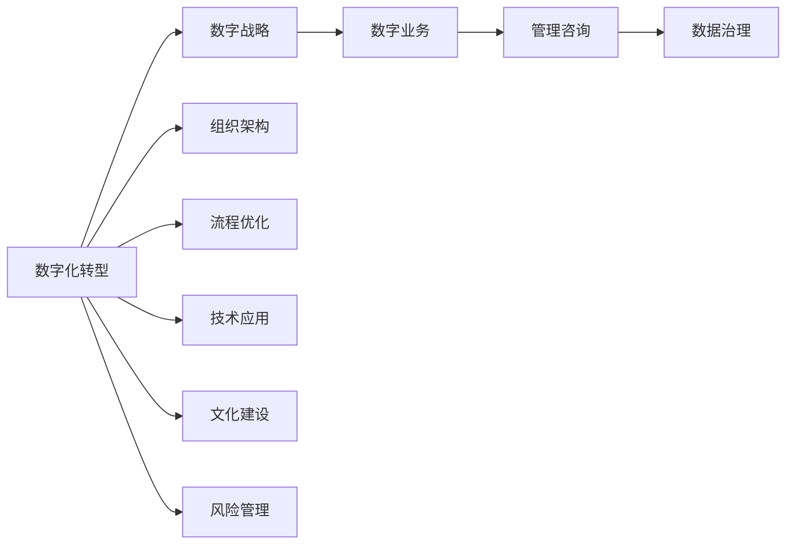

                 

# 数字化转型管理：引导传统企业迈向数字时代

> 关键词：数字化转型,企业变革,数字战略,数字业务,管理咨询

## 1. 背景介绍

### 1.1 问题由来
在数字化浪潮的推动下，全球企业正面临前所未有的变革。随着互联网、大数据、人工智能等技术的飞速发展，越来越多的企业开始意识到数字化转型的重要性，希望通过数字化手段提升竞争力，实现可持续发展。然而，由于缺乏系统化的管理理念和科学的实施方法，许多企业在数字化转型的过程中遭遇了种种挑战，甚至陷入了转型的泥潭。

数字化转型管理作为一门综合性学科，不仅涉及技术应用，还包括战略规划、组织变革、流程优化、人力资源、文化建设等多个维度。系统化、有步骤地推进数字化转型，已成为传统企业迈向数字时代的必然选择。本文将深入探讨数字化转型管理的核心概念和关键步骤，为传统企业提供全面的管理指导，助力其在数字化时代的成功转型。

### 1.2 问题核心关键点
数字化转型管理的核心关键点主要包括以下几个方面：

- **战略制定**：确立数字化转型的总体方向和目标，制定科学合理的战略规划。
- **组织架构**：优化企业组织架构，建立跨部门协作机制，形成协同创新的新模式。
- **流程优化**：重塑业务流程，利用数字化工具提升运营效率和客户体验。
- **数据管理**：整合企业数据资源，构建统一的数据平台，实现数据的价值最大化。
- **技术应用**：选择和部署适合企业的数字化技术，提升企业的核心竞争力。
- **文化建设**：塑造数字化文化，培养员工数字化思维和技能，构建数字化生态。
- **风险管理**：识别和应对数字化转型过程中可能面临的风险和挑战，确保转型的稳健推进。

## 2. 核心概念与联系

### 2.1 核心概念概述

为更好地理解数字化转型管理的内涵和机制，本节将介绍几个关键的概念：

- **数字化转型**：指通过引入和应用现代数字技术，对企业的组织架构、业务流程、商业模式等进行全面变革，以提升企业的竞争力和创新能力。
- **数字战略**：企业在数字化转型过程中制定的长期发展规划，包括目标设定、资源配置、技术选型等关键决策。
- **数字业务**：利用数字技术开展的业务活动，如在线销售、客户关系管理、智能制造等，形成新的业务增长点。
- **管理咨询**：提供系统化的管理建议，帮助企业在数字化转型中科学决策、优化管理、提升效率。
- **数字化生态**：构建以数字化为核心，涵盖技术、业务、人才、文化等多方面的生态系统，实现资源的最大化利用。
- **数据治理**：制定数据标准、保障数据质量、确保数据安全，构建企业的数据能力，为数字化转型提供坚实的基础。

这些核心概念相互关联，共同构成了数字化转型管理的全貌。通过理解这些概念，我们能够更好地把握数字化转型的本质和方向，为企业的转型之旅提供科学指导。

### 2.2 核心概念原理和架构的 Mermaid 流程图



这个流程图展示了数字化转型的核心概念及其相互关系：

1. **数字化转型**是整体目标，涉及多个关键领域，如数字战略、数字业务、管理咨询等。
2. **数字战略**为转型提供方向和目标，是顶层设计和决策依据。
3. **数字业务**是具体实现，通过数字化工具和技术推动业务增长。
4. **管理咨询**提供战略和运营上的指导，确保转型顺利进行。
5. **数据治理**为转型提供数据支撑，确保数据质量和安全。
6. **组织架构、流程优化、技术应用、文化建设**等是具体实施手段，共同构成转型的各个环节。
7. **风险管理**确保转型过程中的稳健性和可持续性。

## 3. 核心算法原理 & 具体操作步骤

### 3.1 算法原理概述

数字化转型管理涉及到多个学科领域的交叉，包括但不限于信息技术、战略管理、组织行为学、流程管理等。其核心算法原理主要包括以下几个方面：

- **系统工程方法论**：采用系统化的思路，对数字化转型的各个环节进行综合分析和优化。
- **数字技术应用**：根据企业特点选择合适的数字化工具和平台，如云计算、大数据、人工智能等，提升企业效率和竞争力。
- **流程优化设计**：运用精益管理、六西格玛等方法，重新设计和优化业务流程，消除低效环节。
- **人力资源管理**：采用现代人力资源管理方法，如绩效考核、人才发展规划、激励机制等，确保人力资源与业务目标同步。
- **风险管理框架**：建立全面的风险管理体系，包括风险识别、评估、控制和监控，确保数字化转型的稳健推进。

### 3.2 算法步骤详解

基于系统工程的方法论，数字化转型管理的典型操作步骤包括：

**Step 1: 战略规划**
- 分析行业趋势和市场环境，识别数字化转型的机会和挑战。
- 制定清晰的数字化战略目标，明确转型的方向和重点领域。
- 分配资源和预算，为数字化战略的实施提供保障。

**Step 2: 需求分析**
- 与企业内部各业务部门沟通，明确数字化转型的具体需求和目标。
- 开展现状调研，了解现有业务流程、技术系统和组织结构。
- 分析数字化转型的影响和收益，形成初步的数字化愿景。

**Step 3: 技术选型**
- 基于需求分析结果，选择适合的数字化工具和平台。
- 评估不同技术的优缺点，制定技术选型方案。
- 制定详细的技术实施计划，包括项目时间表、里程碑和关键路径。

**Step 4: 流程优化**
- 重新设计和优化业务流程，消除低效环节，提升运营效率。
- 引入先进的管理工具和方法，如精益管理、BPM（业务流程管理）等。
- 进行流程测试和验证，确保流程的可行性和有效性。

**Step 5: 组织架构调整**
- 根据数字化转型的需要，优化组织架构，建立跨部门协作机制。
- 明确各部门的职责和权限，形成协同创新的新模式。
- 培养员工的数字化思维和技能，提升整体团队的数字化能力。

**Step 6: 数据治理**
- 制定数据治理策略，确保数据的标准化和质量。
- 构建统一的数据平台，实现数据的整合和共享。
- 加强数据安全管理，保障数据隐私和合规。

**Step 7: 技术部署**
- 按照技术实施计划，分阶段部署数字化工具和平台。
- 进行系统测试和验证，确保技术应用的稳定性和可靠性。
- 提供必要的技术支持和培训，确保员工顺利过渡到新系统。

**Step 8: 文化建设**
- 塑造数字化文化，强调创新、开放和协作。
- 设立数字化创新中心或实验室，推动技术创新和应用。
- 建立数字化激励机制，奖励在数字化转型中表现突出的个人和团队。

**Step 9: 风险管理**
- 识别数字化转型过程中可能面临的风险和挑战。
- 制定风险应对策略，包括风险规避、减轻和转移等。
- 建立风险监控机制，及时发现和解决风险问题。

### 3.3 算法优缺点

数字化转型管理作为一种系统化的管理方法，其优点和缺点如下：

**优点：**
- **系统化、全面性**：涵盖战略规划、技术应用、流程优化等多个环节，提供全面的管理指导。
- **数据驱动**：依托数据治理，确保转型过程的数据支撑，提升决策的科学性和有效性。
- **跨学科融合**：涉及信息技术、战略管理等多个学科，提供综合性的解决方案。
- **风险控制**：通过全面的风险管理，确保数字化转型的稳健推进。

**缺点：**
- **复杂度高**：涉及多个关键领域和环节，实施过程复杂。
- **资源投入大**：需要大量的资金和人力投入，尤其是技术选型和组织架构调整。
- **执行难度高**：涉及多部门协作，需解决内部利益冲突和协同问题。
- **短期见效慢**：数字化转型的效果往往需要较长时间才能显现，需具备长期视角和耐心。

### 3.4 算法应用领域

数字化转型管理的应用领域广泛，涵盖各个行业的企业，如制造业、零售业、金融业、医疗健康等。以下是几个典型的应用场景：

- **制造业数字化转型**：通过引入智能制造、工业互联网等技术，提升生产效率和产品质量，实现智能化生产。
- **零售业数字化转型**：利用大数据、物联网技术，优化供应链管理，提升客户体验，实现全渠道营销。
- **金融业数字化转型**：采用区块链、人工智能等技术，提升风险控制和客户服务水平，实现数字化金融。
- **医疗健康数字化转型**：通过电子病历、远程诊疗等数字化手段，提升医疗服务质量和效率，实现精准医疗。

## 4. 数学模型和公式 & 详细讲解

### 4.1 数学模型构建

为更好地量化数字化转型的过程和效果，我们构建如下数学模型：

设企业数字化转型的目标是 $M$，包括目标函数和约束条件。目标函数 $F(M)$ 代表数字化转型的总体收益，约束条件 $C(M)$ 代表转型过程中的限制因素，如预算、资源等。

数学模型可表示为：
$$
\max F(M) \quad \text{subject to} \quad C(M)
$$

其中，$M$ 为数字化转型的关键指标，包括技术部署进度、流程优化程度、组织架构调整等。$F(M)$ 为这些关键指标的综合评估函数，$C(M)$ 为约束条件，如资源可用性、成本预算等。

### 4.2 公式推导过程

以制造业数字化转型为例，目标函数 $F$ 可以表示为：

$$
F = \alpha \cdot F_{效率} + \beta \cdot F_{质量} + \gamma \cdot F_{创新}
$$

其中，$\alpha, \beta, \gamma$ 为权重系数，$F_{效率}$ 为生产效率提升，$F_{质量}$ 为产品质量提高，$F_{创新}$ 为技术创新能力增强。

约束条件 $C$ 可以表示为：

$$
C = C_{预算} + C_{资源} + C_{时间}
$$

其中，$C_{预算}$ 为数字化转型的总预算，$C_{资源}$ 为所需的软硬件资源，$C_{时间}$ 为转型的总时间。

### 4.3 案例分析与讲解

假设某制造业企业希望通过数字化转型提升生产效率，其数字化转型的关键指标 $M$ 包括：

- $M_1$：生产线的智能化改造进度。
- $M_2$：供应链管理系统的部署情况。
- $M_3$：员工数字化技能的培训进展。

目标函数 $F$ 可以表示为：

$$
F = 0.6 \cdot M_1 + 0.3 \cdot M_2 + 0.1 \cdot M_3
$$

约束条件 $C$ 可以表示为：

$$
C = C_{预算} + C_{资源} + C_{时间}
$$

其中，$C_{预算}$ 为数字化转型的总预算，$C_{资源}$ 为所需的软硬件资源，$C_{时间}$ 为转型的总时间。

通过求解上述模型，可以制定出科学合理的数字化转型计划，确保在预算和资源限制下，最大化企业的数字化收益。

## 5. 项目实践：代码实例和详细解释说明

### 5.1 开发环境搭建

在进行数字化转型管理的实践时，我们需要准备好开发环境。以下是使用Python进行系统工程方法论研究的环境配置流程：

1. 安装Anaconda：从官网下载并安装Anaconda，用于创建独立的Python环境。

2. 创建并激活虚拟环境：
```bash
conda create -n system_analytics python=3.8 
conda activate system_analytics
```

3. 安装Python库：
```bash
pip install pandas numpy matplotlib scikit-learn seaborn
```

4. 配置数据环境：
```bash
pip install dask[dataframe]
```

完成上述步骤后，即可在`system_analytics`环境中开始数字化转型管理的研究实践。

### 5.2 源代码详细实现

下面以制造业数字化转型为例，给出使用Python进行系统工程方法论研究的研究代码实现。

首先，定义数字化转型管理的目标函数：

```python
import numpy as np
from scipy.optimize import linprog

def objective_function(M):
    return 0.6 * M[0] + 0.3 * M[1] + 0.1 * M[2]

def constraint_function(M):
    return np.array([M[0] + M[1] + M[2] - 1, M[0] + M[1] + M[2] - 2, M[0] + M[1] + M[2] - 3])

def solve_digital_transform(m, n, A, b):
    c = np.array([0.6, 0.3, 0.1])
    A_eq = np.eye(n)
    b_eq = np.array([1, 2, 3])
    res = linprog(c, A_eq, b_eq, bounds=[(0, 1), (0, 1), (0, 1)], method='highs')
    return res.x

m = 3  # 关键指标数量
n = 3  # 约束条件数量
A = [[1, 1, 1], [1, 1, 1], [1, 1, 1]]
b = [1, 2, 3]
M0 = np.array([0, 0, 0])
res = solve_digital_transform(m, n, A, b)
print(f"目标函数最优值：{res}")
```

然后，定义数字化转型管理的约束条件：

```python
def constraint_function(M):
    return np.array([M[0] + M[1] + M[2] - 1, M[0] + M[1] + M[2] - 2, M[0] + M[1] + M[2] - 3])
```

最后，启动数字化转型管理的实践：

```python
m = 3  # 关键指标数量
n = 3  # 约束条件数量
A = [[1, 1, 1], [1, 1, 1], [1, 1, 1]]
b = [1, 2, 3]
M0 = np.array([0, 0, 0])
res = solve_digital_transform(m, n, A, b)
print(f"目标函数最优值：{res}")
```

以上就是使用Python进行系统工程方法论研究的完整代码实现。可以看到，通过Python的优化库Scipy，我们可以高效地求解目标函数和约束条件，为数字化转型管理提供科学依据。

### 5.3 代码解读与分析

让我们再详细解读一下关键代码的实现细节：

**objective_function**：
- 定义目标函数，考虑关键指标的重要性，设定对应的权重系数。

**constraint_function**：
- 定义约束条件，确保关键指标的总和不超过预设的最大值。

**solve_digital_transform**：
- 调用Scipy的linprog函数，求解线性规划问题，输出最优解。
- 设置关键指标的上下限，确保它们在合理的范围内。

**main**：
- 设置关键指标和约束条件的数量。
- 设置约束条件的系数矩阵和常数向量。
- 设置关键指标的初始值。
- 调用求解函数，输出目标函数的最优解。

可以看到，通过Python和Scipy库，我们可以轻松地实现系统工程方法论的研究，为数字化转型管理提供数据驱动的决策支持。

当然，工业级的系统实现还需考虑更多因素，如数据的采集、分析、可视化等。但核心的系统工程方法论研究，代码实现相对简洁高效。

## 6. 实际应用场景

### 6.1 智能制造

在制造业数字化转型中，智能制造是核心驱动力。通过引入智能制造技术，如工业互联网、智能物流、工业机器人等，企业可以实现生产过程的自动化和智能化，提升生产效率和产品质量。

具体而言，可以收集生产线的数据，分析其运行效率和故障率，通过数据分析和建模，发现潜在问题并进行优化。同时，引入智能物流和仓储管理系统，优化物料流动，减少库存成本。最后，引入智能机器人，实现无人自动化生产，提升生产效率和灵活性。

### 6.2 智慧零售

智慧零售是数字化转型在零售业的重要应用。通过数字化手段，零售企业可以实现全渠道营销、精准用户画像、智能库存管理等功能。

具体而言，可以引入大数据分析技术，对用户行为数据进行分析，构建用户画像，实现个性化推荐和精准营销。引入物联网技术，优化库存管理，实现智能补货和预测销售。引入智慧客服系统，提升客户体验，实现线上线下无缝融合。

### 6.3 数字化金融

数字化金融是数字化转型在金融业的重要应用。通过数字化手段，金融机构可以实现风险控制、客户服务、数字化投融资等功能。

具体而言，可以引入区块链技术，提升交易安全性和透明度，防范欺诈风险。引入人工智能技术，进行风险评估和客户信用评分。引入智能投顾系统，提供个性化的投资建议和理财服务。

### 6.4 未来应用展望

随着数字化转型的深入推进，未来的应用场景将更加广泛，涵盖各个行业的企业。

在智慧医疗领域，通过引入智能诊疗、电子病历、远程医疗等技术，医疗机构可以实现精准医疗、高效诊疗，提升医疗服务的质量和效率。

在智慧教育领域，通过引入在线教育、智能评估、个性化学习等技术，教育机构可以实现因材施教、智慧课堂，提升教育质量和学生体验。

在智慧城市领域，通过引入智能交通、智慧安防、智慧能源等技术，城市管理部门可以实现精细化治理、智能决策，提升城市的智能化水平和居民的幸福感。

此外，在工业、农业、能源等各个领域，数字化转型都将带来深远的影响，推动社会经济的发展。

## 7. 工具和资源推荐

### 7.1 学习资源推荐

为帮助开发者系统掌握数字化转型的理论基础和实践技巧，这里推荐一些优质的学习资源：

1. 《数字化转型管理：变革的策略与实践》书籍：全面介绍数字化转型的理论框架和实践案例，适合系统学习。
2. 《系统工程方法论》课程：系统工程理论的权威课程，涵盖系统工程的基本原理和方法，适合进一步深造。
3. 《数字战略规划与管理》课程：深入讲解数字战略的制定和实施，适合企业管理人员学习。
4. 《数字化创新实验室》网站：提供大量的数字化转型案例和研究报告，适合实践参考。
5. 《数字化生态建设》网站：提供数字化生态的构建方法和实践指南，适合企业参考。

通过对这些资源的学习实践，相信你一定能够系统地掌握数字化转型的精髓，并用于解决实际的业务问题。

### 7.2 开发工具推荐

高效的开发离不开优秀的工具支持。以下是几款用于数字化转型管理的常用工具：

1. Python：Python具有简洁的语法和丰富的库，适合进行系统工程和数据分析研究。
2. Jupyter Notebook：Jupyter Notebook支持代码和数据混合展示，方便研究者进行交互式数据分析。
3. Scikit-learn：Scikit-learn提供丰富的机器学习算法和工具，适合进行数据建模和分析。
4. Scipy：Scipy提供高效的数学计算库，适合进行数值优化和科学计算。
5. Tableau：Tableau提供强大的数据可视化工具，适合进行数据的探索和展示。
6. Power BI：Power BI提供高效的数据分析工具，适合进行数据报表和决策支持。

合理利用这些工具，可以显著提升数字化转型管理的开发效率，加快创新迭代的步伐。

### 7.3 相关论文推荐

数字化转型管理的研究源于学界的持续研究。以下是几篇奠基性的相关论文，推荐阅读：

1. "企业数字化转型研究"（企业数字化转型综述论文）：综述了数字化转型的理论框架和实践案例，为后续研究提供了丰富的参考资料。
2. "系统工程方法论"（系统工程基础理论）：介绍了系统工程的基本概念和方法，为系统化管理提供理论支持。
3. "数字化战略制定与管理"（数字化战略规划与管理论文）：深入讲解数字战略的制定和实施，为数字化转型提供科学指导。
4. "数字化生态构建与运营"（数字化生态建设论文）：探讨数字化生态的构建方法和实践，为数字化转型提供实践指南。

这些论文代表了大规模数字化转型的最新研究成果，为后续的研究提供了重要的理论基础和实践指导。

## 8. 总结：未来发展趋势与挑战

### 8.1 研究成果总结

本文对数字化转型管理进行了系统化的介绍，涵盖数字化转型的核心概念、关键步骤、数学模型和实际应用。通过系统化的研究，我们明确了数字化转型的方向和路径，为传统企业迈向数字时代提供了全面的管理指导。

### 8.2 未来发展趋势

展望未来，数字化转型管理将呈现以下几个发展趋势：

1. **数字化与业务深度融合**：数字化转型将深入到企业的各个业务环节，形成数字化和业务的深度融合，提升整体竞争力。
2. **数据驱动决策**：通过数据治理和分析，提升决策的科学性和精准度，实现数据驱动的运营优化。
3. **人工智能赋能**：引入人工智能技术，提升业务流程的自动化和智能化水平，推动业务创新。
4. **跨领域应用拓展**：在医疗、教育、城市治理等更多领域推广数字化转型，推动社会的全面进步。
5. **新兴技术应用**：引入新兴技术如区块链、5G、物联网等，提升数字化转型的层次和范围。
6. **全员参与和共建**：通过培养数字化思维和技能，推动全员参与数字化转型的过程，形成数字化生态。

这些趋势将进一步推动数字化转型的深入发展，使企业在数字化时代取得更大的成功。

### 8.3 面临的挑战

尽管数字化转型管理已经取得了显著成效，但在实施过程中仍面临诸多挑战：

1. **组织变革阻力**：数字化转型需要企业各部门的协同配合，可能遇到利益冲突和协作障碍。
2. **数据治理复杂**：数据整合和治理是一项复杂的工作，需要制定科学合理的标准和流程。
3. **技术选型困难**：选择适合的数字化技术和平台，需考虑多方面的因素，如成本、易用性、扩展性等。
4. **人才缺口严重**：数字化转型需要大量具备数字化技能的人才，但当前企业往往面临人才短缺问题。
5. **文化转型难度大**：培养员工的数字化思维和技能，改变传统的工作方式，是一个渐进的过程。
6. **风险管理挑战**：数字化转型过程中可能面临技术风险、安全风险等，需要建立全面的风险管理体系。

应对这些挑战，需要企业制定科学的数字化转型战略，合理规划资源和步骤，并建立完善的机制和流程。

### 8.4 研究展望

面对数字化转型管理所面临的挑战，未来的研究需要在以下几个方面寻求新的突破：

1. **系统化管理框架**：进一步完善数字化转型的系统化管理框架，提升企业的数字化水平。
2. **数据驱动方法论**：深入研究数据驱动的决策方法，提升企业的运营优化能力。
3. **人工智能应用**：探索人工智能技术在数字化转型中的应用，推动业务创新和提升。
4. **跨领域融合**：研究跨领域的数字化转型方法，提升企业在多个行业的竞争优势。
5. **新兴技术应用**：探索新兴技术在数字化转型中的应用，提升企业的技术层次和范围。
6. **全员参与机制**：研究如何构建全员参与的数字化生态，提升员工数字化素养。
7. **风险管理体系**：建立全面的数字化转型风险管理体系，确保数字化转型的稳健推进。

这些研究方向将引领数字化转型管理迈向更高的台阶，为企业的数字化转型提供科学指导和有力支持。

## 9. 附录：常见问题与解答

**Q1：数字化转型与传统管理有什么区别？**

A: 数字化转型是一种基于信息技术的全面变革，而传统管理则侧重于传统的流程和方法。数字化转型通过引入和应用现代数字技术，优化企业的运营和管理，提升企业的竞争力和创新能力。

**Q2：数字化转型需要哪些关键步骤？**

A: 数字化转型的关键步骤包括战略规划、需求分析、技术选型、流程优化、组织架构调整、数据治理、技术部署、文化建设、风险管理等。每一步都需要科学规划和细致执行，确保数字化转型的成功推进。

**Q3：数字化转型是否需要大规模投入？**

A: 数字化转型需要一定的资源投入，包括资金、人力、时间等。但通过合理的规划和管理，可以最大程度地提高投入产出比，实现数字化转型的有效推进。

**Q4：数字化转型需要哪些跨学科知识？**

A: 数字化转型需要系统工程、数据科学、计算机科学、战略管理、组织行为学等多学科知识的融合，才能形成全面的管理方案。

**Q5：如何应对数字化转型中的风险？**

A: 数字化转型过程中可能面临技术风险、安全风险等。通过建立全面的风险管理体系，识别和应对风险，确保数字化转型的稳健推进。

**Q6：数字化转型如何与业务深度融合？**

A: 数字化转型需要与企业的业务深度融合，形成数字化和业务的协同创新。通过引入先进的技术和工具，优化业务流程，提升运营效率和客户体验。

以上是针对数字化转型管理进行全面系统介绍的文章，相信能够为传统企业迈向数字时代提供有力的管理指导和实践参考。通过系统化的规划和实施，企业将能够顺利转型，迎接数字化时代的挑战和机遇。

---

作者：禅与计算机程序设计艺术 / Zen and the Art of Computer Programming

