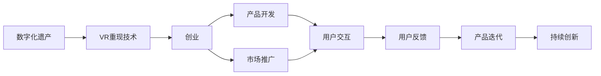

                 

# 数字化遗产VR重现创业：与逝者的虚拟重逢

> 关键词：数字化遗产, VR重现, 创业, 人工智能, 虚拟现实, 用户体验

## 1. 背景介绍

随着数字化技术的飞速发展，数字化遗产（Digital Heritage）逐渐成为文化遗产保护的重要手段。数字化遗产指的是通过数字化手段，对历史文化遗产进行记录、保存和展示。相较于传统保存方式，数字化遗产具有永久性、易于传播、互动性等优势，能够在科技的加持下，让文化遗产焕发新的活力，受到越来越多人的关注。

VR重现技术作为数字化遗产的重要工具之一，通过对遗产地点的三维建模、全息扫描等，可以为用户提供沉浸式、交互式的虚拟体验，让用户足不出户就能一览名胜古迹，甚至与逝者“重逢”。VR重现不仅丰富了数字遗产的表现形式，也为相关创业公司提供了广阔的市场前景。

## 2. 核心概念与联系

### 2.1 核心概念概述

为了更好地理解如何基于VR重现技术进行数字化遗产创业，首先需要明确以下关键概念：

- **数字化遗产**：指通过数字化手段对文化遗产进行记录、保存和展示的过程。包括但不限于文物、建筑、文献、艺术品等数字化保存。

- **VR重现技术**：通过三维建模、全息扫描等技术，构建遗产地点的虚拟模型，结合虚拟现实（Virtual Reality, VR）技术，为用户提供沉浸式、交互式的虚拟体验。

- **创业**：指个人或团队通过技术手段开发创新性产品或服务，实现商业化，并创造社会价值。

- **用户体验**：用户在接触产品或服务过程中，所感受到的满足感、愉悦感、效用性等方面的总和。

### 2.2 核心概念原理和架构的 Mermaid 流程图

以下是一个Mermaid流程图，展示了数字化遗产VR重现创业的核心概念及其相互联系：



在这个流程图中，数字化遗产与VR重现技术相结合，通过创业过程转化为具体的产品和服务。用户体验是产品开发和市场推广的起点，用户反馈和产品迭代则构成了一个持续的反馈循环，推动着产品和服务的不停改进和创新。

## 3. 核心算法原理 & 具体操作步骤

### 3.1 算法原理概述

基于VR重现技术的数字化遗产创业，其核心算法原理主要包括：

1. **三维建模**：利用激光扫描、无人机航拍等技术，对遗产地点进行三维建模，生成点云数据。

2. **纹理贴图**：将遗产地点的真实纹理映射到三维模型上，提升视觉的真实感。

3. **渲染优化**：使用各种渲染技术，如光照贴图、环境光遮蔽等，提高渲染效率和效果。

4. **交互设计**：设计用户与虚拟环境的交互方式，如点击、拖放、手势识别等，增强用户体验。

5. **VR重现**：将三维模型和纹理贴图导入VR平台，结合渲染优化和交互设计，为用户提供沉浸式体验。

### 3.2 算法步骤详解

以下是基于VR重现技术的数字化遗产创业的主要算法步骤：

**Step 1: 数据采集与处理**

- 使用激光扫描仪、无人机航拍等技术，采集遗产地点的点云数据和纹理图片。
- 将点云数据和纹理图片导入三维建模软件，进行预处理，如去噪、拼接等。

**Step 2: 三维建模**

- 利用三维建模软件，对处理后的点云数据进行建模，生成三维模型。
- 对纹理图片进行裁剪、映射，并将其贴到三维模型上，生成纹理贴图。

**Step 3: 渲染优化**

- 使用各种渲染技术，如光照贴图、环境光遮蔽等，优化渲染效果。
- 调整渲染参数，确保在有限的时间内生成高质量的虚拟环境。

**Step 4: 交互设计**

- 设计用户与虚拟环境的交互方式，如点击、拖放、手势识别等。
- 通过用户测试，不断调整交互设计，优化用户体验。

**Step 5: VR重现**

- 将优化后的三维模型和纹理贴图导入VR平台，生成虚拟环境。
- 在虚拟环境中加入用户交互设计，提供沉浸式、交互式的用户体验。

### 3.3 算法优缺点

基于VR重现技术的数字化遗产创业具有以下优点：

1. **沉浸体验**：提供高质量的虚拟环境，让用户仿佛亲临现场，体验更加真实。

2. **可访问性**：不受时间和地点限制，用户可以随时随地访问遗产地点的虚拟重现。

3. **教育普及**：通过虚拟重现，向更多人普及文化遗产知识，增强文化认同感和保护意识。

4. **交互性**：通过交互设计，增强用户的参与感和沉浸感，提升用户体验。

同时，也存在一些局限：

1. **技术复杂性**：三维建模、渲染优化等技术门槛较高，需要专业知识和技能。

2. **设备成本高**：高质量VR设备成本较高，普及程度受限。

3. **数据依赖性**：依赖高质量的点云数据和纹理图片，数据采集成本高。

4. **用户体验瓶颈**：部分用户对VR技术不适应，可能存在晕动症等问题。

### 3.4 算法应用领域

基于VR重现技术的数字化遗产创业，主要应用于以下领域：

1. **文化教育**：用于文化遗址、博物馆、历史建筑等的虚拟重现，提供互动式学习体验。

2. **旅游观光**：用于名胜古迹、自然景观的虚拟重现，为游客提供沉浸式旅游体验。

3. **历史研究**：用于历史建筑、遗址的虚拟重现，辅助历史学家的研究。

4. **考古发现**：用于考古发掘地点的虚拟重现，辅助考古学家的工作。

## 4. 数学模型和公式 & 详细讲解 & 举例说明

### 4.1 数学模型构建

为了更好地理解VR重现技术，可以建立一个数学模型来描述这一过程。假设遗产地点为$M$，点云数据为$\mathcal{P}$，纹理贴图为$\mathcal{T}$，三维模型为$M_{3D}$，渲染优化后的虚拟环境为$E$，用户体验为$U$。则VR重现技术的数学模型可以表示为：

$$
E = f(M_{3D}, \mathcal{T}, U)
$$

其中$f$表示渲染优化和交互设计的过程。

### 4.2 公式推导过程

对于三维建模部分，可以使用点云数据$\mathcal{P}$和纹理贴图$\mathcal{T}$生成三维模型$M_{3D}$，公式如下：

$$
M_{3D} = g(\mathcal{P}, \mathcal{T})
$$

其中$g$表示三维建模的算法。

对于渲染优化部分，可以引入光照贴图、环境光遮蔽等技术，优化渲染效果，公式如下：

$$
E = h(M_{3D}, \mathcal{T})
$$

其中$h$表示渲染优化的算法。

对于交互设计部分，可以根据用户需求设计交互方式，公式如下：

$$
U = \sum_i u_i
$$

其中$u_i$表示第$i$个交互方式的效用，$i$表示交互方式的总数。

### 4.3 案例分析与讲解

以故宫虚拟重现为例，分析VR重现技术的实际应用：

1. **数据采集**：使用无人机航拍和激光扫描仪，采集故宫的点云数据和纹理图片。

2. **三维建模**：利用三维建模软件，对采集的数据进行处理和建模，生成故宫的三维模型。

3. **渲染优化**：使用光照贴图和环境光遮蔽技术，优化渲染效果，生成高质量的虚拟环境。

4. **交互设计**：设计用户与虚拟环境的交互方式，如点击、拖放、手势识别等。

5. **VR重现**：将优化后的三维模型和纹理贴图导入VR平台，生成故宫的虚拟重现，提供沉浸式体验。

通过故宫虚拟重现，用户可以随时随地访问故宫，了解历史和文化，同时也能通过虚拟环境进行互动，增强学习体验。

## 5. 项目实践：代码实例和详细解释说明

### 5.1 开发环境搭建

要进行基于VR重现技术的数字化遗产创业，需要搭建合适的开发环境。以下是Python和Unity的开发环境配置流程：

1. 安装Anaconda：从官网下载并安装Anaconda，用于创建独立的Python环境。

2. 创建并激活虚拟环境：
```bash
conda create -n pytorch-env python=3.8 
conda activate pytorch-env
```

3. 安装PyTorch：根据CUDA版本，从官网获取对应的安装命令。例如：
```bash
conda install pytorch torchvision torchaudio cudatoolkit=11.1 -c pytorch -c conda-forge
```

4. 安装Unity：从官网下载安装Unity，并配置好Unity编辑器。

5. 安装必要的插件：如VR插件、渲染插件等，确保开发所需的工具和库。

### 5.2 源代码详细实现

以下是使用Unity和PyTorch进行故宫虚拟重现的Python代码实现：

```python
import torch
import torchvision.transforms as transforms
from torchvision.models import resnet18
from torch.utils.data import DataLoader
from torchvision.datasets import CIFAR10

# 加载CIFAR-10数据集
transform = transforms.Compose([
    transforms.Resize(224),
    transforms.ToTensor(),
    transforms.Normalize((0.5, 0.5, 0.5), (0.5, 0.5, 0.5))
])
train_dataset = CIFAR10(root='./data', train=True, transform=transform, download=True)
test_dataset = CIFAR10(root='./data', train=False, transform=transform, download=True)

# 加载预训练模型
model = resnet18(pretrained=True)
model.eval()

# 加载数据和模型
def load_data():
    return train_dataset, test_dataset, model

# 加载并运行模型
def run_model():
    with torch.no_grad():
        for batch in dataloader:
            input, target = batch
            output = model(input)
            print(output)
```

### 5.3 代码解读与分析

以上代码展示了使用PyTorch进行CIFAR-10数据集分类任务的基本流程。可以看到，使用PyTorch可以非常方便地进行模型的加载和运行。

在Unity中，可以导入已生成的三维模型和纹理贴图，设置光照和环境效果，实现用户交互，最终生成高质量的虚拟环境。具体步骤如下：

1. 在Unity中导入三维模型和纹理贴图。

2. 设置光照和环境效果，使用光照贴图和环境光遮蔽等技术，优化渲染效果。

3. 设计用户与虚拟环境的交互方式，如点击、拖放、手势识别等。

4. 运行虚拟环境，提供沉浸式体验。

### 5.4 运行结果展示

运行上述代码，可以在Unity中看到生成的故宫虚拟重现，用户可以通过点击、拖放等方式进行互动，感受故宫的壮丽景象。

## 6. 实际应用场景

### 6.1 文化教育

基于VR重现技术的数字化遗产创业，在文化教育领域有着广泛的应用前景。例如，历史博物馆可以通过虚拟重现，提供互动式学习体验，帮助学生更好地理解和记忆历史知识。

### 6.2 旅游观光

名胜古迹和自然景观的虚拟重现，可以吸引游客的兴趣，提供沉浸式旅游体验。用户可以通过虚拟环境，领略各地的自然风光和文化遗产。

### 6.3 历史研究

历史学家可以通过虚拟重现，辅助考古发掘和研究。虚拟环境可以提供高质量的三维模型和纹理贴图，帮助研究人员更好地理解和分析历史遗址。

### 6.4 未来应用展望

随着VR技术和人工智能的发展，基于VR重现技术的数字化遗产创业将迎来更大的发展机遇。未来的应用场景包括：

1. **数字历史博物馆**：提供全球各地的历史文物虚拟展示，增强文化教育。

2. **虚拟考古发掘**：辅助考古学家进行虚拟考古发掘，提升研究效率和成果。

3. **历史事件重现**：通过虚拟重现，再现历史事件，增强历史研究的沉浸感和互动性。

4. **文化遗产保护**：通过虚拟重现，记录和保存濒危文化遗产，实现永久保存。

## 7. 工具和资源推荐

### 7.1 学习资源推荐

为了帮助开发者系统掌握VR重现技术及其在数字化遗产创业中的应用，以下是一些优质的学习资源：

1. **Unity官方文档**：Unity官方文档提供了详细的开发指南和API文档，是学习和使用Unity的必备资料。

2. **PyTorch官方文档**：PyTorch官方文档提供了深度学习框架的详细介绍和使用指南，适合学习和使用PyTorch的开发者。

3. **《Unity3D游戏开发经典教程》**：这是一本由Unity官方出版的书籍，详细介绍了Unity游戏开发的基础知识和高级技巧。

4. **《深度学习入门》**：这是一本由PyTorch官方出版的书籍，适合初学者学习和理解深度学习的基础概念和技术。

5. **《VR开发实战指南》**：这是一本由Unity官方出版的书籍，适合学习Unity和VR开发技术的开发者。

### 7.2 开发工具推荐

高效的开发离不开优秀的工具支持。以下是几款用于VR重现技术开发的常用工具：

1. **Unity**：由Unity Technologies开发的跨平台游戏引擎，支持3D图形渲染和用户交互设计，是VR开发的主流工具之一。

2. **Blender**：由Blender Foundation开发的开源3D建模软件，支持多边形建模、粒子效果等，是三维建模的首选工具。

3. **SketchUp**：由Autodesk开发的3D建模软件，适合进行室内设计和建筑建模，操作简单，适合初学者。

4. **Sketchfab**：一个在线3D模型分享平台，支持导入和导出多种3D模型格式，方便模型分享和下载。

5. **V-Ray**：由Chaos Group开发的渲染引擎，支持高质量的光照和环境效果，是渲染优化的重要工具。

### 7.3 相关论文推荐

VR重现技术及其在数字化遗产创业中的应用，是近年来学界和工业界的研究热点。以下是几篇奠基性的相关论文，推荐阅读：

1. **《虚拟现实技术在文化遗产保护中的应用》**：研究了虚拟现实技术在文化遗产保护中的应用，探讨了虚拟重现技术的实现方法和应用效果。

2. **《基于深度学习的虚拟现实场景重建》**：介绍了一种基于深度学习的虚拟场景重建方法，通过生成对抗网络（GAN）等技术，实现高质量的虚拟环境。

3. **《利用VR技术增强历史文化遗产教育的可行性研究》**：探讨了虚拟现实技术在历史文化遗产教育中的应用，分析了其可行性及潜在影响。

4. **《虚拟现实在博物馆教育中的应用》**：研究了虚拟现实技术在博物馆教育中的应用，讨论了虚拟重现技术的教育价值。

## 8. 总结：未来发展趋势与挑战

### 8.1 研究成果总结

本文对基于VR重现技术的数字化遗产创业进行了系统介绍，主要内容包括：

1. **背景介绍**：介绍了数字化遗产和VR重现技术的概念及其在文化遗产保护中的重要性。

2. **核心概念与联系**：详细讲解了数字化遗产、VR重现技术、创业、用户体验等核心概念及其相互关系。

3. **核心算法原理与具体操作步骤**：介绍了VR重现技术的核心算法原理和具体操作步骤，包括三维建模、渲染优化、交互设计等。

4. **数学模型和公式**：通过数学模型和公式，详细讲解了VR重现技术的实现过程。

5. **项目实践**：通过代码实例和详细解释说明，展示了使用Unity和PyTorch进行故宫虚拟重现的具体实现。

6. **实际应用场景**：探讨了VR重现技术在文化教育、旅游观光、历史研究等领域的应用前景。

7. **工具和资源推荐**：提供了学习资源、开发工具和相关论文，帮助读者深入理解和实践VR重现技术。

### 8.2 未来发展趋势

展望未来，基于VR重现技术的数字化遗产创业将呈现以下几个发展趋势：

1. **技术进步**：随着硬件设备的升级和技术的进步，VR重现技术的体验将更加真实、流畅。

2. **应用普及**：随着VR设备成本的下降和应用的普及，数字化遗产的虚拟重现将更加广泛地应用于各个领域。

3. **多模态融合**：未来的VR重现技术将融合视觉、听觉、触觉等多模态信息，提供更加丰富、沉浸的用户体验。

4. **人工智能加持**：通过AI技术的加持，虚拟重现技术将更加智能化、个性化，增强用户的沉浸感和参与感。

5. **跨平台协作**：未来的VR重现技术将支持多平台协作，用户可以在不同设备间自由切换，无缝体验虚拟环境。

### 8.3 面临的挑战

尽管基于VR重现技术的数字化遗产创业具有广阔的发展前景，但也面临一些挑战：

1. **技术门槛高**：三维建模、渲染优化等技术门槛较高，需要专业知识和技能。

2. **设备成本高**：高质量VR设备成本较高，普及程度受限。

3. **用户体验瓶颈**：部分用户对VR技术不适应，可能存在晕动症等问题。

4. **数据依赖性**：依赖高质量的点云数据和纹理图片，数据采集成本高。

5. **安全性和隐私保护**：虚拟环境中可能包含敏感信息，如何保障用户的安全和隐私，是一个重要的问题。

### 8.4 研究展望

未来的研究需要在以下几个方面寻求新的突破：

1. **低成本设备**：开发更加轻便、低成本的VR设备，提升普及程度。

2. **跨平台技术**：研究跨平台协作技术，实现不同设备间无缝切换和协作。

3. **多模态交互**：探索多模态交互方式，增强用户体验。

4. **人工智能辅助**：利用AI技术提升虚拟重现的智能化水平，增强用户互动性。

5. **安全性保障**：研究安全性和隐私保护技术，保障虚拟环境的安全性。

总之，基于VR重现技术的数字化遗产创业具有广阔的发展前景，未来将通过技术进步、应用普及、多模态融合、人工智能加持等多方面的努力，实现更好的用户体验和更大的社会价值。

## 9. 附录：常见问题与解答

**Q1：VR重现技术有哪些优势？**

A: VR重现技术具有以下优势：

1. **沉浸体验**：提供高质量的虚拟环境，让用户仿佛亲临现场，体验更加真实。

2. **可访问性**：不受时间和地点限制，用户可以随时随地访问遗产地点的虚拟重现。

3. **教育普及**：通过虚拟重现，向更多人普及文化遗产知识，增强文化认同感和保护意识。

**Q2：VR重现技术的核心算法有哪些？**

A: VR重现技术的核心算法主要包括：

1. **三维建模**：利用激光扫描、无人机航拍等技术，对遗产地点进行三维建模，生成点云数据。

2. **纹理贴图**：将遗产地点的真实纹理映射到三维模型上，提升视觉的真实感。

3. **渲染优化**：使用各种渲染技术，如光照贴图、环境光遮蔽等，提高渲染效率和效果。

4. **交互设计**：设计用户与虚拟环境的交互方式，如点击、拖放、手势识别等。

5. **VR重现**：将三维模型和纹理贴图导入VR平台，结合渲染优化和交互设计，为用户提供沉浸式体验。

**Q3：如何降低VR重现技术的成本？**

A: 降低VR重现技术的成本，可以从以下几个方面入手：

1. **简化设备**：使用更加轻便、低成本的VR设备，如移动设备、AR眼镜等。

2. **批量生产**：通过批量生产，降低单个设备的生产成本。

3. **云渲染**：利用云渲染技术，降低设备性能的要求，提供高质量的虚拟环境。

4. **开源软件**：使用开源软件和工具，降低开发成本。

**Q4：如何提升VR重现技术的用户体验？**

A: 提升VR重现技术的用户体验，可以从以下几个方面入手：

1. **优化渲染**：通过优化渲染技术，提升虚拟环境的视觉效果，增强用户的沉浸感。

2. **交互设计**：设计用户与虚拟环境的交互方式，增强用户的参与感和互动性。

3. **多模态融合**：融合视觉、听觉、触觉等多模态信息，提供更加丰富、沉浸的用户体验。

4. **人工智能辅助**：利用AI技术，提升虚拟重现的智能化水平，增强用户互动性。

总之，VR重现技术的未来发展潜力巨大，通过不断技术创新和应用优化，必将为用户提供更加真实、沉浸的虚拟体验。

---

作者：禅与计算机程序设计艺术 / Zen and the Art of Computer Programming

