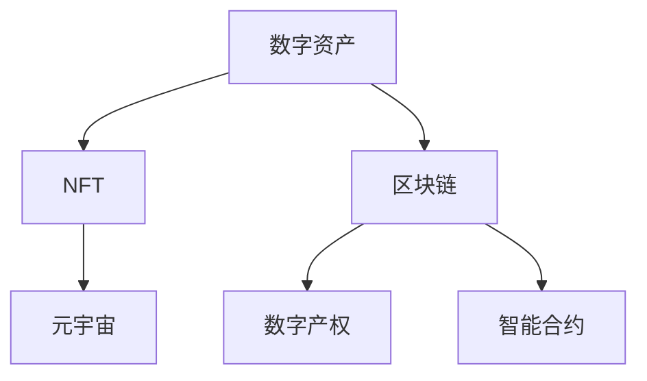

                 

# 数字化遗产收藏创业：数字资产收藏的未来模式

> 关键词：数字资产收藏, NFT, 区块链, 元宇宙, 数字产权, 数字遗产, 数字考古, 数字艺术, 智能合约

## 1. 背景介绍

### 1.1 问题由来

数字化遗产收藏已经成为一种新兴的收藏品市场，受到越来越多人的关注。数字资产，尤其是基于区块链的数字资产（NFTs），为虚拟物品的拥有和交易提供了新的可能性。然而，现有的数字化遗产收藏模式仍存在诸多问题，如版权归属不明确、交易成本高昂、数据安全保障不足等。这阻碍了数字化遗产收藏行业的健康发展。

### 1.2 问题核心关键点

数字化遗产收藏的核心在于如何确保数字资产的合法性和真实性，同时降低交易成本，提高市场透明度。其中，数字版权归属、交易平台安全性、智能合约应用是三个重要环节。数字化遗产收藏创业的难点在于如何整合这些关键技术，构建可信赖、高效、安全的数字资产交易平台。

## 2. 核心概念与联系

### 2.1 核心概念概述

为了更好地理解数字化遗产收藏创业，本节将介绍几个关键概念：

- **数字资产（Digital Assets）**：以电子形式存在的所有权和价值载体，包括但不限于NFTs（非同质化代币）、虚拟现实物品、数字艺术品等。
- **NFT（Non-Fungible Tokens）**：一种不可替代的数字资产，每个NFT都具有唯一的数字签名，代表着对特定物品的所有权。
- **区块链（Blockchain）**：一种分布式账本技术，确保交易数据的不可篡改性和透明性，为数字资产的交易和所有权证明提供了技术基础。
- **元宇宙（Metaverse）**：一个虚拟的、持续的三维数字环境，用户可以实时交互，体验沉浸式数字生活。
- **数字产权（Digital Property Rights）**：与物理资产相对应的权利，如数字作品的版权、数字资产的所有权等。
- **智能合约（Smart Contracts）**：自动执行、具备合约功能的代码，可以在区块链上实现自动化的资产管理和服务提供。

这些核心概念之间的逻辑关系可以通过以下Mermaid流程图来展示：



这个流程图展示了数字资产从生成、确权、交易到元宇宙应用的整个过程：

1. 数字资产基于NFT在区块链上进行确权，确保其唯一性和不可篡改性。
2. 区块链提供了分布式账本，保证数据的安全性和透明性。
3. 数字产权在区块链上得到了明确的界定和保护。
4. 智能合约在区块链上自动化执行，提供了便捷的交易和管理方式。
5. 元宇宙为数字资产提供了沉浸式的展示和交互平台。

## 3. 核心算法原理 & 具体操作步骤
### 3.1 算法原理概述

数字化遗产收藏创业的算法原理主要包括以下几个方面：

- **数字资产确权**：通过区块链技术，利用NFT对数字资产进行唯一性标识，确保其所有权和版权归属。
- **智能合约自动化**：利用智能合约实现数字资产的自动交易和分配，降低交易成本，提高效率。
- **数据安全保护**：采用加密技术和分布式共识机制，确保交易数据的安全性和隐私性。
- **元宇宙交互**：利用虚拟现实技术和区块链平台，提供沉浸式的数字资产展示和互动体验。

### 3.2 算法步骤详解

基于上述原理，数字化遗产收藏创业的技术流程可以总结如下：

**Step 1: 区块链平台搭建**
- 选择适合的区块链平台，如以太坊、Binance Smart Chain等，搭建数字资产交易和确权的区块链网络。
- 部署智能合约，确保交易的自动执行和数据的安全存储。

**Step 2: NFT发行与确权**
- 创建NFT项目，并发行对应数量的NFTs。
- 确保每个NFT的唯一性和版权归属，将其信息存储在区块链上。

**Step 3: 智能合约设计**
- 设计智能合约，自动执行数字资产的转移和分配。
- 确保合约逻辑透明、公正，保护买卖双方的权益。

**Step 4: 数据安全保护**
- 采用加密技术保护数字资产和交易记录。
- 利用分布式共识机制，确保数据的不可篡改性。

**Step 5: 元宇宙平台接入**
- 开发虚拟现实展示平台，与区块链平台无缝对接。
- 提供沉浸式体验，让用户可以交互和体验数字资产。

**Step 6: 市场运营与维护**
- 建立线上交易平台，提供便捷的交易服务。
- 监控市场动态，维护交易安全和数据安全。

### 3.3 算法优缺点

基于区块链技术的数字化遗产收藏创业具有以下优点：

- **安全性高**：区块链的去中心化特性确保了交易数据的不可篡改性和透明性。
- **交易便捷**：智能合约的自动化执行简化了交易流程，降低了交易成本。
- **版权保护**：NFT的独特性和区块链的不可篡改性确保了数字资产的版权归属。

然而，也存在以下局限性：

- **技术复杂**：涉及区块链、NFT、智能合约、元宇宙等多项技术，技术门槛较高。
- **市场接受度**：数字化遗产收藏仍是一个新兴市场，用户接受度和信任度有待提升。
- **法律和监管**：数字资产的法律和监管环境尚不完善，面临诸多不确定性。

### 3.4 算法应用领域

数字化遗产收藏创业可以应用于多个领域，包括：

- **数字艺术品交易**：如数字画作、数字雕塑等艺术品通过NFT在区块链上进行交易。
- **虚拟现实旅游**：数字化的景点、建筑和城市景观，通过元宇宙平台进行展示和体验。
- **数字考古挖掘**：历史文物、古文献等数字化文物通过NFT和区块链进行确权和交易。
- **虚拟游戏资产交易**：游戏中的虚拟物品、装备等通过NFT在区块链上进行交易。
- **数字身份认证**：数字身份信息通过NFT进行确权和验证，用于身份认证和隐私保护。

## 4. 数学模型和公式 & 详细讲解  
### 4.1 数学模型构建

基于区块链的数字资产交易模型可以概括为以下几个部分：

- **数字资产确权模型**：描述NFT的唯一性和版权归属。
- **智能合约执行模型**：定义交易的自动执行逻辑。
- **数据安全保护模型**：确保交易数据的安全性和隐私性。
- **元宇宙交互模型**：描述虚拟现实展示平台的功能和用户交互方式。

### 4.2 公式推导过程

以数字资产确权模型为例，推导NFT的唯一性标识：

- 假设每个NFT的标识为id，其所有者为owner，版权归属为rights。
- 数字资产确权公式为：
  $$
  F_{NFT}(id, owner, rights) = \sum_{i=1}^n (id_i \times owner_i \times rights_i)
  $$
  其中，$n$为数字资产的唯一性标识数量，$(id_i, owner_i, rights_i)$为每个标识的具体信息。

### 4.3 案例分析与讲解

假设某数字艺术家的作品通过NFT在区块链上进行确权和交易。艺术家首先创建NFT，并在区块链上发布该作品的信息：作品名称、作者、版权声明等。通过智能合约，确保该NFT只能由艺术家和授权买家进行交易。每当有交易发生，智能合约自动更新所有权信息，并在区块链上记录交易日志。

## 5. 项目实践：代码实例和详细解释说明
### 5.1 开发环境搭建

在进行数字化遗产收藏创业的实践前，我们需要准备好开发环境。以下是使用Python进行Solidity开发的区块链开发环境配置流程：

1. 安装Node.js和npm，安装Solidity编译器。
2. 使用Truffle框架搭建开发环境，连接以太坊测试网或本地测试链。
3. 安装OpenSSL工具，生成和存储私钥和公钥。
4. 使用Remix IDE，进行智能合约的编写、编译和部署。

完成上述步骤后，即可在Truffle环境中进行数字化遗产收藏创业的开发。

### 5.2 源代码详细实现

以下是一个简单的数字化遗产收藏创业的智能合约示例：

```solidity
// SPDX-License-Identifier: MIT
pragma solidity ^0.8.0;

contract DigitalAsset {
    address private owner;
    string private name;
    string private artist;
    bool private isSold;
    mapping(string => bool) private rights;
    
    constructor(string memory _name, address _owner) {
        owner = _owner;
        name = _name;
        artist = msg.sender;
        isSold = false;
        // 初始化版权信息
        rights["Copy"] = false;
        rights["Use"] = false;
        rights["Display"] = false;
    }
    
    function setRight(string memory _right, bool _status) public {
        require(!isSold, "Digital asset is already sold.");
        require(!rights[_right], "Right already exists.");
        rights[_right] = _status;
    }
    
    function sell() public {
        require(!isSold, "Digital asset is already sold.");
        owner = msg.sender;
        isSold = true;
        emit DigitalAssetSold(name, owner);
    }
    
    function buy() public payable {
        require(!isSold, "Digital asset is already sold.");
        owner = msg.sender;
        isSold = true;
        emit DigitalAssetBought(name, owner);
    }
    
    event DigitalAssetSold(string memory _name, address _buyer);
    event DigitalAssetBought(string memory _name, address _buyer);
}
```

以上代码实现了数字资产的确权和交易逻辑：

- 创建合约时，设定所有者、名称和艺术家信息。
- 版权信息存储在键值对中，通过`setRight`函数进行管理。
- 通过`sell`函数将数字资产出售，更新所有者信息，并触发相应事件。
- 通过`buy`函数购买数字资产，更新所有者信息，并触发相应事件。

### 5.3 代码解读与分析

让我们再详细解读一下关键代码的实现细节：

- `constructor`函数：在合约创建时，设定所有者、名称和艺术家信息，并初始化版权信息。
- `setRight`函数：管理版权信息，通过`_right`参数和`_status`参数，记录和更新每个版权的状态。
- `sell`和`buy`函数：分别用于出售和购买数字资产，更新所有者信息，并触发相应的事件日志。
- 事件日志：通过`emit`语句，记录数字资产的出售和购买事件，方便追踪和管理。

### 5.4 运行结果展示

在Truffle环境中运行上述智能合约，可以通过以下命令：

```bash
$ truffle develop
> deploy(DigitalAsset)
Contract deployed at 0x...
```

在本地测试链上部署合约后，可以在Remix IDE中查看智能合约的交互逻辑，验证数字资产的确权和交易功能。

## 6. 实际应用场景
### 6.1 数字艺术品交易

数字艺术品通过区块链上的NFT进行确权和交易，使得艺术品的版权、所有权等信息透明、不可篡改。数字艺术家可以通过智能合约设定版权归属和交易规则，确保自己的权益不受侵害。数字艺术品交易平台通过智能合约自动执行交易，降低了交易成本，提高了交易效率。

### 6.2 虚拟现实旅游

数字化文物和景观通过元宇宙平台进行展示和体验，用户可以通过虚拟现实设备进入数字化的历史场景，进行互动和探索。数字资产通过NFT进行确权和交易，确保了数字资产的合法性和安全性。

### 6.3 数字考古挖掘

历史文物、古文献等数字化文物通过区块链进行确权和交易，确保了数字文物的版权归属和信息完整性。考古学家和收藏家可以通过智能合约管理数字文物的展示和交易，推动文物的数字化保护和传播。

### 6.4 未来应用展望

随着区块链、NFT、智能合约等技术的不断成熟，数字化遗产收藏行业将迎来更加广阔的发展空间。未来的数字化遗产收藏将更加多样化、个性化，涵盖更多的领域和应用场景。

在艺术收藏领域，数字艺术品和数字文物的展示和交易将更加便捷和透明。在虚拟现实技术的发展下，元宇宙平台将提供更加沉浸式的数字化体验。在文物保护和传播方面，数字化的文物将得到更广泛的应用和保护。

## 7. 工具和资源推荐
### 7.1 学习资源推荐

为了帮助开发者系统掌握数字化遗产收藏创业的理论基础和实践技巧，这里推荐一些优质的学习资源：

1. 《区块链技术与应用》系列博文：由区块链技术专家撰写，详细介绍了区块链的基本原理、应用场景和开发实践。
2. 《智能合约设计与开发》课程：由知名大学开设，系统讲解了智能合约的开发、测试和部署流程。
3. 《元宇宙技术与应用》书籍：全面介绍了元宇宙的原理、技术栈和应用案例，帮助开发者理解元宇宙的实现机制。
4. NFT平台官方文档：如Opensea、Rarible等NFT平台的开发文档，提供了丰富的API和示例代码，帮助开发者快速上手开发。
5. 《数字资产与区块链》书籍：介绍数字资产的概念、法律和监管环境，帮助开发者理解数字化遗产收藏的法律和合规要求。

通过对这些资源的学习实践，相信你一定能够快速掌握数字化遗产收藏创业的理论基础和实践技巧，并用于解决实际的数字化遗产收藏问题。

### 7.2 开发工具推荐

高效的开发离不开优秀的工具支持。以下是几款用于数字化遗产收藏创业开发的常用工具：

1. Truffle框架：基于Solidity的开发框架，提供智能合约的开发、测试和部署工具，易于上手和使用。
2. Remix IDE：基于Web的智能合约开发环境，支持Solidity和Vyper语言，提供了丰富的开发和调试功能。
3. MetaMask浏览器扩展：支持以太坊和BSC链，提供私钥管理、交易确认等功能，方便开发者进行交互和测试。
4. OpenSSL工具：生成和管理私钥和公钥，确保数字资产的安全性。
5. Solidity编译器和测试工具：如Solc、Truffle Tester等，帮助开发者编译和测试智能合约代码。

合理利用这些工具，可以显著提升数字化遗产收藏创业的开发效率，加快创新迭代的步伐。

### 7.3 相关论文推荐

数字化遗产收藏创业涉及的技术领域广泛，以下是几篇奠基性的相关论文，推荐阅读：

1. Satoshi Nakamoto. Bitcoin: A Peer-to-Peer Electronic Cash System. 2008.
2. Vitalik Buterin. A Next-Generation Smart Contract and Database Platform. 2013.
3. Manolis Kalliadasis. NFTs: The next generation of digital assets. 2021.
4. Yuval Tal. The Metaverse. 2020.
5. Joseph Poon. Programmable Blockchain: Smart Contracts and Decentralized Applications. 2016.
6. Antonio Robustelli. Solidity & How to Develop Smart Contracts on the Ethereum Virtual Machine. 2016.

这些论文代表了大规模数字化遗产收藏创业的技术发展脉络。通过学习这些前沿成果，可以帮助研究者把握学科前进方向，激发更多的创新灵感。

## 8. 总结：未来发展趋势与挑战
### 8.1 总结

本文对数字化遗产收藏创业进行了全面系统的介绍。首先阐述了数字化遗产收藏创业的背景和意义，明确了数字化遗产收藏创业的核心技术和关键环节。其次，从原理到实践，详细讲解了数字化遗产收藏创业的数学模型和关键步骤，给出了数字化遗产收藏创业的完整代码实例。同时，本文还广泛探讨了数字化遗产收藏在艺术收藏、虚拟现实旅游、数字考古等领域的实际应用，展示了数字化遗产收藏创业的广阔前景。此外，本文精选了数字化遗产收藏创业的学习资源、开发工具和相关论文，力求为读者提供全方位的技术指引。

通过本文的系统梳理，可以看到，数字化遗产收藏创业是一项技术密集型的事业，需要整合区块链、NFT、智能合约、元宇宙等多项前沿技术，才能实现数字资产的合法化、透明化和自动化交易。数字化遗产收藏创业的成功不仅依赖于技术的成熟和稳定，还需要不断优化商业模式，提升用户体验，构建健康的市场生态。相信随着区块链、NFT、智能合约等技术的不断成熟，数字化遗产收藏创业必将在文化艺术、虚拟现实、文物保护等领域大放异彩，为数字时代带来新的机遇和挑战。

### 8.2 未来发展趋势

展望未来，数字化遗产收藏创业将呈现以下几个发展趋势：

1. **技术融合加速**：区块链、NFT、智能合约、元宇宙等技术将深度融合，形成更加复杂的数字化遗产收藏生态。
2. **市场规模扩大**：数字化遗产收藏行业将吸引更多投资者和消费者，成为数字经济的重要组成部分。
3. **应用场景多元化**：数字化遗产收藏将覆盖更多的领域和行业，推动数字资产在各个垂直领域的落地应用。
4. **法律和合规规范**：数字化遗产收藏的法律和合规环境将逐渐完善，保障数字资产的合法权益和市场健康发展。
5. **用户体验提升**：通过元宇宙技术，提供沉浸式数字化体验，提升用户的参与感和满意度。
6. **数据安全和隐私保护**：采用先进的数据加密和隐私保护技术，确保数字资产的安全性和隐私性。

以上趋势凸显了数字化遗产收藏创业的广阔前景。这些方向的探索发展，必将进一步提升数字化遗产收藏的技术水平和市场规模，推动数字化遗产收藏行业的健康发展。

### 8.3 面临的挑战

尽管数字化遗产收藏创业已经取得了一定的进展，但在迈向更加智能化、普适化应用的过程中，仍面临诸多挑战：

1. **技术门槛高**：涉及区块链、NFT、智能合约等多项前沿技术，技术门槛较高。
2. **市场接受度低**：数字化遗产收藏仍是一个新兴市场，用户接受度和信任度有待提升。
3. **法律和监管不确定**：数字资产的法律和监管环境尚不完善，面临诸多不确定性。
4. **数据安全和隐私保护**：数字资产的存储和交易过程中，存在数据泄露和隐私保护的挑战。
5. **成本和效率问题**：数字资产的交易成本和智能合约的执行效率有待优化。

### 8.4 研究展望

面对数字化遗产收藏创业所面临的种种挑战，未来的研究需要在以下几个方面寻求新的突破：

1. **技术优化**：开发更加高效、安全、便捷的数字化遗产收藏技术，降低技术门槛，提高用户体验。
2. **市场推广**：加强市场教育，提升用户对数字化遗产收藏的认知和信任，扩大市场规模。
3. **法律和监管**：推动数字资产的法律和监管环境完善，保障数字资产的合法权益和市场健康发展。
4. **数据保护**：采用先进的数据加密和隐私保护技术，确保数字资产的安全性和隐私性。
5. **效率提升**：优化智能合约的执行效率，降低交易成本，提高数字化遗产收藏的市场竞争力。

这些研究方向的探索，必将引领数字化遗产收藏创业向更加成熟和健康的发展方向迈进，为数字经济带来新的增长点。

## 9. 附录：常见问题与解答

**Q1：数字化遗产收藏创业如何确保数字资产的合法性和真实性？**

A: 数字化遗产收藏创业通过区块链技术和NFT确保数字资产的合法性和真实性。每个NFT具有唯一的数字签名和版权归属信息，存储在区块链上，确保其不可篡改性和透明性。通过智能合约，可以实现自动化的确权和交易，确保所有操作记录在案，便于追踪和验证。

**Q2：数字化遗产收藏创业的智能合约如何实现自动交易？**

A: 智能合约通过自动执行交易规则，实现数字资产的自动化交易。合约代码中定义了交易的逻辑和条件，如所有权转移、价格和手续费等。当用户发起交易请求时，智能合约自动检查条件，如果满足则执行交易操作，并在区块链上记录交易记录。智能合约的自动化执行简化了交易流程，降低了交易成本。

**Q3：数字化遗产收藏创业是否需要构建元宇宙平台？**

A: 元宇宙平台可以为数字化遗产收藏提供沉浸式的展示和互动体验，提升用户的参与感和满意度。然而，构建元宇宙平台需要大量的技术投入和资金支持，不是必须的。数字化遗产收藏创业可以根据自身需求，选择是否引入元宇宙技术。

**Q4：数字化遗产收藏创业面临的法律和合规问题有哪些？**

A: 数字化遗产收藏创业需要考虑数字资产的版权归属、所有权保护、交易合法性等多个法律和合规问题。每个国家对数字资产的法律和监管环境不同，需要在全球范围内进行合规性评估。数字化遗产收藏创业需要制定和遵守相关的法律法规，确保数字资产的合法性和交易的透明性。

**Q5：数字化遗产收藏创业如何保护用户隐私？**

A: 数字化遗产收藏创业需要采用先进的数据加密和隐私保护技术，确保用户数据的安全性和隐私性。可以使用零知识证明、多方安全计算等技术，实现数据加密和隐私保护。同时，在智能合约和元宇宙平台中，需要明确用户的隐私权和数据保护措施，确保用户隐私不被侵犯。

---

作者：禅与计算机程序设计艺术 / Zen and the Art of Computer Programming

