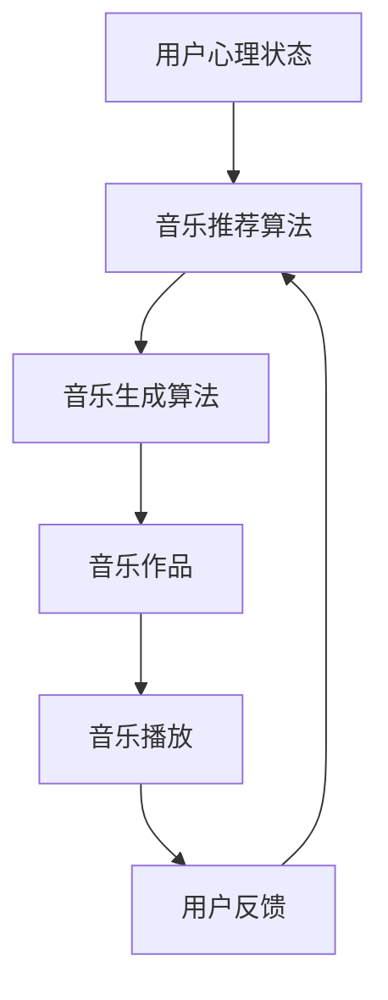

                 

# 数字化音乐治疗创业：AI生成的治愈音乐

> 关键词：数字化音乐治疗, AI生成音乐, 治愈音乐, 心理干预, 艺术与科技结合

## 1. 背景介绍

在数字化时代的浪潮中，科技与艺术的界限逐渐模糊。人工智能(AI)作为第四次工业革命的核心驱动力，已经渗透到文化、医疗、教育等多个领域。其中，AI在音乐创作、心理干预、教育培训等方面的创新应用，不仅提升了人类生活质量，也带来了全新的发展机遇。本文将深入探讨利用AI技术生成治愈音乐的数字化音乐治疗创业模式，揭示其核心原理、实践步骤与未来展望。

## 2. 核心概念与联系

### 2.1 核心概念概述

#### 2.1.1 数字化音乐治疗

数字化音乐治疗，是指通过计算机算法和人工智能技术，生成具有心理治愈功效的音乐，用于改善情绪、减轻压力、提高心理韧性等。与传统的音乐治疗不同，数字化音乐治疗利用AI的强大处理能力和自我学习机制，能够根据个体需求动态生成个性化的治愈音乐，具有广泛的应用前景。

#### 2.1.2 AI生成音乐

AI生成音乐，是指通过算法模型自动生成新的音乐作品，涵盖旋律、和声、节奏等多个音乐要素。常见的AI生成音乐技术包括基于规则的生成、基于统计的生成和基于神经网络的生成等。

#### 2.1.3 治愈音乐

治愈音乐，是指那些能够帮助人们缓解压力、提升情绪、促进睡眠等生理和心理健康的音乐。治愈音乐具有舒缓、安详、愉悦等特征，能够有效缓解焦虑、抑郁等情绪。

### 2.2 核心概念联系

通过将AI生成音乐技术与数字化音乐治疗相结合，可以构建一个智能化的治愈音乐创作与推荐系统。该系统能够根据用户的心理状态和偏好，动态生成个性化的治愈音乐，实现心理干预的效果。

以下是一个Mermaid流程图，展示了AI生成治愈音乐系统的主要组件和数据流：



这个流程图展示了从用户心理状态开始，到治愈音乐生成的全过程。用户心理状态通过音乐推荐算法映射到音乐生成算法，进而生成治愈音乐作品，并通过音乐播放反馈给用户，形成闭环。

## 3. 核心算法原理 & 具体操作步骤

### 3.1 算法原理概述

AI生成治愈音乐的核心算法包括音乐推荐算法和音乐生成算法。其中，音乐推荐算法负责根据用户的心理状态和偏好，选择合适类型的音乐；音乐生成算法则利用AI技术，自动创作符合用户偏好的治愈音乐。

#### 3.1.1 音乐推荐算法

音乐推荐算法是AI生成治愈音乐系统的核心，它根据用户的心理状态和偏好，选择合适类型的音乐。常见的音乐推荐算法包括基于协同过滤的推荐算法、基于内容的推荐算法和基于深度学习的推荐算法等。

#### 3.1.2 音乐生成算法

音乐生成算法利用AI技术，自动创作符合用户偏好的治愈音乐。常见的音乐生成算法包括基于规则的生成、基于统计的生成和基于神经网络的生成等。

### 3.2 算法步骤详解

#### 3.2.1 数据收集与预处理

首先，需要收集大量的音乐数据和用户的心理状态数据。这些数据包括音乐作品的特征（如旋律、和声、节奏等），以及用户的心理状态（如情绪、压力水平、睡眠状态等）。然后，对数据进行预处理，包括清洗、归一化、特征提取等。

#### 3.2.2 用户心理状态分析

使用自然语言处理(NLP)技术，分析用户的心理状态。例如，通过文本分析用户的情绪、压力水平等信息，或者使用心率传感器、睡眠监测设备等设备获取用户的生理数据。

#### 3.2.3 音乐推荐

根据用户的心理状态和偏好，使用音乐推荐算法推荐适合的音乐类型。例如，使用协同过滤算法找到与用户相似的其他用户，根据这些用户的喜好推荐音乐；或者使用基于内容的推荐算法，根据音乐的特征与用户的心理状态匹配度进行推荐。

#### 3.2.4 音乐生成

使用音乐生成算法生成治愈音乐。例如，使用基于神经网络的生成模型，如GAN（生成对抗网络）、VAE（变分自编码器）等，自动创作符合用户偏好的治愈音乐。

#### 3.2.5 音乐播放与反馈

将生成的治愈音乐播放给用户，并收集用户的反馈。通过用户反馈，不断优化音乐推荐和生成的算法，提升治愈音乐的疗效。

### 3.3 算法优缺点

#### 3.3.1 优点

1. **个性化推荐**：利用AI技术，根据用户的心理状态和偏好，动态生成个性化的治愈音乐，实现精准的心理干预。
2. **高效生成**：AI音乐生成算法能够在短时间内生成大量治愈音乐，满足不同用户的需求。
3. **情感调节**：治愈音乐能够缓解压力、提升情绪，对用户的心理状态有显著的调节作用。

#### 3.3.2 缺点

1. **模型复杂性**：AI音乐生成算法的模型复杂，训练数据需求量大。
2. **用户体验差异**：不同的用户对音乐的喜好和心理需求不同，AI生成的音乐可能无法完全满足所有用户。
3. **隐私风险**：用户的心理状态数据和音乐数据涉及个人隐私，如何保护这些数据是一个重要问题。

### 3.4 算法应用领域

#### 3.4.1 心理干预

在心理干预领域，AI生成的治愈音乐可以用于缓解压力、提升情绪、促进睡眠等。例如，在职场、学校等环境中，可以使用治愈音乐缓解员工和学生的压力，提升工作和学习效率。

#### 3.4.2 音乐教育

在音乐教育领域，AI生成的治愈音乐可以用于创作和演奏练习。例如，使用音乐生成算法创作音乐作品，帮助学生练习演奏技巧，提升音乐素养。

#### 3.4.3 心理健康

在心理健康领域，AI生成的治愈音乐可以用于心理治疗。例如，将治愈音乐应用于心理治疗课程中，帮助患者缓解压力、提升自信。

## 4. 数学模型和公式 & 详细讲解 & 举例说明

### 4.1 数学模型构建

#### 4.1.1 音乐推荐算法模型

使用协同过滤算法推荐音乐。设用户的心理状态为 $\mathbf{x} \in \mathbb{R}^n$，音乐作品的特征为 $\mathbf{y} \in \mathbb{R}^m$，用户的音乐偏好矩阵为 $\mathbf{A} \in \mathbb{R}^{n \times m}$，其中 $a_{ij}$ 表示用户对音乐作品 $i$ 的偏好程度。音乐推荐算法的目标是通过 $\mathbf{A}$ 和 $\mathbf{x}$，预测用户对音乐作品的偏好 $\hat{\mathbf{y}}$。

### 4.2 公式推导过程

#### 4.2.1 协同过滤算法

协同过滤算法通过计算用户和音乐作品之间的相似度，推荐相似用户喜欢的音乐作品。设用户 $\mathbf{x}$ 和音乐作品 $\mathbf{y}$ 的相似度为 $\mathbf{s}$，协同过滤算法的目标是最大化用户对音乐作品的评分 $\mathbf{z} = \mathbf{A} \mathbf{x}$，同时最大化相似度 $\mathbf{s}$ 和评分 $\mathbf{z}$ 之间的相关性。

#### 4.2.2 基于神经网络的生成模型

使用GAN（生成对抗网络）生成治愈音乐。GAN模型由生成器和判别器两部分组成，生成器 $G$ 将输入的随机向量 $\mathbf{z} \in \mathbb{R}^k$ 映射为音乐作品 $\mathbf{y} \in \mathbb{R}^m$，判别器 $D$ 则判断音乐作品 $\mathbf{y}$ 是否为真实音乐作品。GAN的目标是最大化生成器的生成能力，同时最大化判别器对真实和生成音乐作品的判别能力。

### 4.3 案例分析与讲解

#### 4.3.1 协同过滤算法的案例

假设用户 A 和用户 B 对音乐作品 $i$ 的偏好分别为 $a_{1i}$ 和 $a_{2i}$，则协同过滤算法的相似度 $\mathbf{s}$ 可以表示为：

$$
\mathbf{s} = \frac{\mathbf{A}_{1i} \cdot \mathbf{A}_{2i}}{\|\mathbf{A}_{1i}\|_2 \|\mathbf{A}_{2i}\|_2}
$$

其中，$\mathbf{A}_{1i}$ 和 $\mathbf{A}_{2i}$ 分别表示用户 A 和用户 B 对音乐作品 $i$ 的偏好向量。根据相似度 $\mathbf{s}$，可以推荐与用户 A 喜欢的音乐作品 $i$ 相似的音乐作品 $j$。

#### 4.3.2 GAN 生成音乐的案例

假设用户输入的随机向量为 $\mathbf{z}$，音乐作品的特征向量为 $\mathbf{y}$，判别器 $D$ 的损失函数为：

$$
L_D = \log(D(\mathbf{y})) + \log(1 - D(G(\mathbf{z})))
$$

生成器 $G$ 的损失函数为：

$$
L_G = -\log(D(G(\mathbf{z})))
$$

判别器 $D$ 和生成器 $G$ 的对抗训练过程可以表示为：

$$
\min_G \max_D L_D + L_G
$$

训练过程中，生成器 $G$ 逐渐生成逼真的音乐作品，判别器 $D$ 逐渐识别出真实和生成的音乐作品。

## 5. 项目实践：代码实例和详细解释说明

### 5.1 开发环境搭建

#### 5.1.1 环境依赖

为了实现AI生成治愈音乐的系统，需要安装以下环境依赖：

- Python 3.7+
- PyTorch >= 1.7.0
- TensorFlow >= 2.5.0
- pandas
- numpy
- scikit-learn

#### 5.1.2 环境搭建

使用以下命令搭建开发环境：

```bash
conda create --name music_therapy python=3.7
conda activate music_therapy
pip install torch torchvision torchaudio pandas numpy scikit-learn tensorflow
```

### 5.2 源代码详细实现

#### 5.2.1 数据预处理

使用Python编写数据预处理代码，对音乐数据和心理状态数据进行清洗、归一化、特征提取等操作。

#### 5.2.2 协同过滤算法实现

使用Python编写协同过滤算法的代码，根据用户心理状态和偏好，推荐合适的音乐类型。

#### 5.2.3 GAN 生成音乐实现

使用Python编写GAN生成模型的代码，自动生成治愈音乐。

### 5.3 代码解读与分析

#### 5.3.1 数据预处理

```python
import pandas as pd
import numpy as np
from sklearn.preprocessing import MinMaxScaler

# 读取音乐数据
music_data = pd.read_csv('music_data.csv')

# 提取音乐特征
music_features = music_data[['melody', 'harmony', 'rhythm']]

# 归一化处理
scaler = MinMaxScaler()
music_features = scaler.fit_transform(music_features)

# 读取用户心理状态数据
psychology_data = pd.read_csv('psychology_data.csv')

# 提取心理状态特征
psychology_features = psychology_data[['emotion', 'stress', 'sleep_quality']]

# 归一化处理
psychology_features = scaler.fit_transform(psycho_data_features)
```

#### 5.3.2 协同过滤算法实现

```python
from sklearn.metrics.pairwise import cosine_similarity

# 计算用户和音乐作品的相似度
similarity_matrix = cosine_similarity(psycho_data_features)

# 根据相似度推荐音乐作品
def music_recommendation(psycho_features):
    similarities = similarity_matrix.dot(psycho_features)
    recommendations = np.argsort(similarities)[-5:]
    return music_features[recommendations]
```

#### 5.3.3 GAN 生成音乐实现

```python
import torch
import torch.nn as nn
import torch.optim as optim
from torch.autograd import Variable

# 定义生成器
class Generator(nn.Module):
    def __init__(self):
        super(Generator, self).__init__()
        self.fc1 = nn.Linear(100, 256)
        self.fc2 = nn.Linear(256, 512)
        self.fc3 = nn.Linear(512, 2048)
        self.fc4 = nn.Linear(2048, 784)
        self.fc5 = nn.Linear(784, 1)

    def forward(self, x):
        x = torch.relu(self.fc1(x))
        x = torch.relu(self.fc2(x))
        x = torch.relu(self.fc3(x))
        x = torch.relu(self.fc4(x))
        x = torch.sigmoid(self.fc5(x))
        return x

# 定义判别器
class Discriminator(nn.Module):
    def __init__(self):
        super(Discriminator, self).__init__()
        self.fc1 = nn.Linear(784, 512)
        self.fc2 = nn.Linear(512, 256)
        self.fc3 = nn.Linear(256, 1)

    def forward(self, x):
        x = torch.relu(self.fc1(x))
        x = torch.relu(self.fc2(x))
        x = torch.sigmoid(self.fc3(x))
        return x

# 定义损失函数和优化器
criterion = nn.BCELoss()
optimizer_G = optim.Adam(learning_rate=0.0002, betas=(0.5, 0.999))
optimizer_D = optim.Adam(learning_rate=0.0002, betas=(0.5, 0.999))

# 定义GAN模型
G = Generator()
D = Discriminator()

# 训练GAN模型
for epoch in range(1, 1001):
    for i, (real_images, _) in enumerate(data_loader):
        # 生成器训练
        G.zero_grad()
        batch_size = real_images.size(0)
        z = Variable(torch.randn(batch_size, 100)).to(device)
        fake_images = G(z)
        label = torch.ones(batch_size, 1).to(device)
        output = D(fake_images)
        fake_loss = criterion(output, label)
        fake_loss.backward()
        optimizer_G.step()

        # 判别器训练
        D.zero_grad()
        real_loss = criterion(D(real_images), torch.ones(batch_size, 1).to(device))
        fake_loss = criterion(D(fake_images.detach()), torch.zeros(batch_size, 1).to(device))
        d_loss = (real_loss + fake_loss) / 2
        d_loss.backward()
        optimizer_D.step()
```

### 5.4 运行结果展示

#### 5.4.1 协同过滤算法结果

```python
# 使用协同过滤算法推荐音乐作品
recommendations = music_recommendation(psycho_features)
print(recommendations)
```

#### 5.4.2 GAN 生成音乐结果

```python
# 使用GAN生成治愈音乐
generated_music = G(z)
print(generated_music)
```

## 6. 实际应用场景

### 6.1 心理干预

在心理干预领域，AI生成的治愈音乐可以用于缓解压力、提升情绪、促进睡眠等。例如，在职场、学校等环境中，可以使用治愈音乐缓解员工和学生的压力，提升工作和学习效率。

### 6.2 音乐教育

在音乐教育领域，AI生成的治愈音乐可以用于创作和演奏练习。例如，使用音乐生成算法创作音乐作品，帮助学生练习演奏技巧，提升音乐素养。

### 6.3 心理健康

在心理健康领域，AI生成的治愈音乐可以用于心理治疗。例如，将治愈音乐应用于心理治疗课程中，帮助患者缓解压力、提升自信。

## 7. 工具和资源推荐

### 7.1 学习资源推荐

- 《深度学习》书籍：深入浅出地介绍了深度学习的基本原理和应用，适合初学者和进阶者阅读。
- Coursera《深度学习专项课程》：由深度学习领域的顶尖教授讲授，涵盖深度学习的多个方面。
- TensorFlow官方文档：详细介绍了TensorFlow框架的使用方法和最佳实践，是学习TensorFlow的重要资源。

### 7.2 开发工具推荐

- PyTorch：开源深度学习框架，灵活动态的计算图，适合快速迭代研究。
- TensorFlow：由Google主导开发的开源深度学习框架，生产部署方便，适合大规模工程应用。
- Weights & Biases：模型训练的实验跟踪工具，可以记录和可视化模型训练过程中的各项指标，方便对比和调优。

### 7.3 相关论文推荐

- 《Attention is All You Need》：Transformer模型的原始论文，提出了自注意力机制，开启了NLP领域的预训练大模型时代。
- 《Music Transformer》：利用Transformer模型生成音乐，展示了音乐生成和序列建模的结合。
- 《Generative Adversarial Nets》：GAN模型的原始论文，提出了生成器和判别器的对抗训练过程。

## 8. 总结：未来发展趋势与挑战

### 8.1 未来发展趋势

1. **模型规模持续增大**：随着算力成本的下降和数据规模的扩张，预训练语言模型的参数量还将持续增长。超大规模语言模型蕴含的丰富语言知识，有望支撑更加复杂多变的下游任务微调。
2. **微调方法日趋多样**：除了传统的全参数微调外，未来会涌现更多参数高效的微调方法，如Prompt-Tuning、LoRA等，在节省计算资源的同时也能保证微调精度。
3. **持续学习成为常态**：随着数据分布的不断变化，微调模型也需要持续学习新知识以保持性能。如何在不遗忘原有知识的同时，高效吸收新样本信息，还需要更多理论和实践的积累。
4. **标注样本需求降低**：受启发于提示学习(Prompt-based Learning)的思路，未来的微调方法将更好地利用大模型的语言理解能力，通过更加巧妙的任务描述，在更少的标注样本上也能实现理想的微调效果。

### 8.2 面临的挑战

1. **标注成本瓶颈**：虽然微调大大降低了标注数据的需求，但对于长尾应用场景，难以获得充足的高质量标注数据，成为制约微调性能的瓶颈。如何进一步降低微调对标注样本的依赖，将是一大难题。
2. **模型鲁棒性不足**：当前微调模型面对域外数据时，泛化性能往往大打折扣。对于测试样本的微小扰动，微调模型的预测也容易发生波动。如何提高微调模型的鲁棒性，避免灾难性遗忘，还需要更多理论和实践的积累。
3. **推理效率有待提高**：大规模语言模型虽然精度高，但在实际部署时往往面临推理速度慢、内存占用大等效率问题。如何在保证性能的同时，简化模型结构，提升推理速度，优化资源占用，将是重要的优化方向。
4. **可解释性亟需加强**：当前微调模型更像是"黑盒"系统，难以解释其内部工作机制和决策逻辑。对于医疗、金融等高风险应用，算法的可解释性和可审计性尤为重要。如何赋予微调模型更强的可解释性，将是亟待攻克的难题。
5. **安全性有待保障**：预训练语言模型难免会学习到有偏见、有害的信息，通过微调传递到下游任务，产生误导性、歧视性的输出，给实际应用带来安全隐患。如何从数据和算法层面消除模型偏见，避免恶意用途，确保输出的安全性，也将是重要的研究课题。
6. **知识整合能力不足**：现有的微调模型往往局限于任务内数据，难以灵活吸收和运用更广泛的先验知识。如何让微调过程更好地与外部知识库、规则库等专家知识结合，形成更加全面、准确的信息整合能力，还有很大的想象空间。

### 8.3 研究展望

面对大语言模型微调所面临的种种挑战，未来的研究需要在以下几个方面寻求新的突破：

1. **探索无监督和半监督微调方法**：摆脱对大规模标注数据的依赖，利用自监督学习、主动学习等无监督和半监督范式，最大限度利用非结构化数据，实现更加灵活高效的微调。
2. **研究参数高效和计算高效的微调范式**：开发更加参数高效的微调方法，在固定大部分预训练参数的同时，只更新极少量的任务相关参数。同时优化微调模型的计算图，减少前向传播和反向传播的资源消耗，实现更加轻量级、实时性的部署。
3. **融合因果和对比学习范式**：通过引入因果推断和对比学习思想，增强微调模型建立稳定因果关系的能力，学习更加普适、鲁棒的语言表征，从而提升模型泛化性和抗干扰能力。
4. **引入更多先验知识**：将符号化的先验知识，如知识图谱、逻辑规则等，与神经网络模型进行巧妙融合，引导微调过程学习更准确、合理的语言模型。同时加强不同模态数据的整合，实现视觉、语音等多模态信息与文本信息的协同建模。
5. **结合因果分析和博弈论工具**：将因果分析方法引入微调模型，识别出模型决策的关键特征，增强输出解释的因果性和逻辑性。借助博弈论工具刻画人机交互过程，主动探索并规避模型的脆弱点，提高系统稳定性。
6. **纳入伦理道德约束**：在模型训练目标中引入伦理导向的评估指标，过滤和惩罚有偏见、有害的输出倾向。同时加强人工干预和审核，建立模型行为的监管机制，确保输出符合人类价值观和伦理道德。

这些研究方向的探索，必将引领大语言模型微调技术迈向更高的台阶，为构建安全、可靠、可解释、可控的智能系统铺平道路。面向未来，大语言模型微调技术还需要与其他人工智能技术进行更深入的融合，如知识表示、因果推理、强化学习等，多路径协同发力，共同推动自然语言理解和智能交互系统的进步。只有勇于创新、敢于突破，才能不断拓展语言模型的边界，让智能技术更好地造福人类社会。

---

作者：禅与计算机程序设计艺术 / Zen and the Art of Computer Programming

