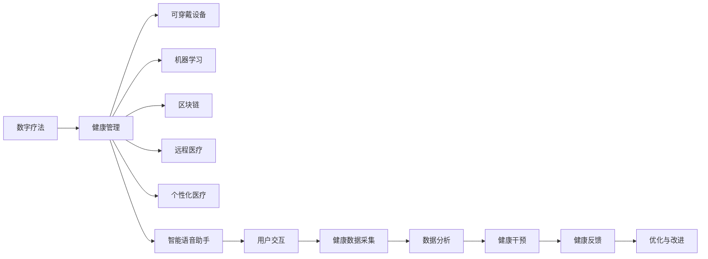

                 

# 数字疗法创业：科技驱动的健康管理

## 1. 背景介绍

### 1.1 问题由来

在数字化飞速发展的今天，健康管理领域也在经历深刻的变革。传统的医疗健康服务模式存在诸多局限，如资源分布不均、信息共享不畅、个性化服务不足等。随着人工智能、大数据、区块链等前沿科技的广泛应用，数字疗法(Digital Therapeutics)成为解决这些问题的突破口。数字疗法以科技为驱动，提供智能化的健康管理和个性化医疗服务，助力构建高效、安全、普惠的医疗健康生态系统。

### 1.2 问题核心关键点

数字疗法创业的核心在于如何高效整合前沿科技资源，构建可规模化部署的健康管理解决方案，满足不同用户群体的多样化健康需求。当前数字疗法创业的关键点主要包括：

- 数据驱动的个性化健康方案设计：利用大数据、机器学习等技术，根据用户健康数据个性化定制健康管理方案。
- 智能健康监测：通过可穿戴设备、传感器等技术，实时监测用户健康状态，提供预警和干预建议。
- 远程医疗服务：借助视频通话、智能语音助手等技术，实现医生与患者的远程互动，提高医疗服务的可及性和便捷性。
- 区块链数据安全保障：利用区块链技术，确保健康数据的安全性和隐私性，建立可信的医疗健康生态。
- 跨界融合创新：与各类健康服务机构合作，提供综合性的健康管理解决方案，如运动、饮食、心理健康等。

## 2. 核心概念与联系

### 2.1 核心概念概述

为更好地理解数字疗法创业，本节将介绍几个密切相关的核心概念：

- **数字疗法**：通过使用数字技术（如人工智能、物联网、区块链等）为用户提供健康管理和个性化医疗服务的新型医疗模式。
- **健康管理**：结合医学知识、数据科学和信息技术，对个体或群体的健康状况进行监测、评估、预测和干预的过程。
- **可穿戴设备**：如智能手表、健康监测眼镜等，用于实时采集用户的生理参数、运动数据等，辅助健康管理。
- **机器学习**：通过数据训练模型，实现健康状态的自动分析和健康干预建议。
- **区块链**：一种分布式账本技术，用于确保数据的安全性、不可篡改性和隐私性。
- **远程医疗**：利用互联网和通信技术，实现医生与患者的远程交流和诊疗，提升医疗服务的可及性。
- **个性化医疗**：根据患者的具体健康状况和需求，量身定制个性化的治疗方案和管理策略。
- **智能语音助手**：如Amazon Alexa、Google Assistant等，通过语音交互提供健康建议、信息查询等服务。

这些核心概念之间通过数字化健康管理平台进行联系，形成一个整体的健康管理生态系统。

### 2.2 核心概念原理和架构的 Mermaid 流程图(Mermaid 流程节点中不要有括号、逗号等特殊字符)



这个流程图展示了数字疗法与健康管理系统的关系：

1. 数字疗法通过整合各类数字技术，为用户提供健康管理服务。
2. 健康管理平台包含可穿戴设备、机器学习、区块链、远程医疗、个性化医疗、智能语音助手等多个模块。
3. 用户通过可穿戴设备实时采集健康数据，智能语音助手提供交互服务，用户数据通过区块链技术保障安全。
4. 机器学习对用户健康数据进行自动分析，生成健康干预建议，并通过远程医疗系统进行远程诊疗。
5. 用户根据干预效果反馈，健康管理平台不断优化与改进，形成良性循环。

## 3. 核心算法原理 & 具体操作步骤
### 3.1 算法原理概述

数字疗法创业的核心算法原理基于机器学习和人工智能技术，结合大数据和区块链技术，构建了一个完整的健康管理系统。其核心流程如下：

1. **数据采集与预处理**：通过可穿戴设备和传感器实时采集用户健康数据，包括生理参数、运动数据、行为习惯等。
2. **数据分析与建模**：利用机器学习算法对采集到的健康数据进行自动分析，建立用户健康状态模型，生成健康管理方案。
3. **智能健康监测**：通过智能算法对用户健康数据进行实时监测，识别异常状态并及时预警。
4. **个性化健康方案**：根据用户健康数据和健康模型，生成个性化的健康管理方案，如饮食、运动、心理健康等。
5. **远程医疗服务**：通过远程医疗平台，实现医生与用户的实时互动，提供诊断、咨询等服务。
6. **区块链数据安全**：利用区块链技术，确保用户健康数据的安全性和隐私性，防止数据泄露和滥用。
7. **跨界融合创新**：与各类健康服务机构合作，提供综合性的健康管理解决方案。

### 3.2 算法步骤详解

#### 3.2.1 数据采集与预处理

1. **设备选择与配置**：选择适合的可穿戴设备，如智能手表、健康监测眼镜等，并进行设备校准和数据同步配置。
2. **数据采集**：通过可穿戴设备实时采集用户的生理参数（如心率、血压、血糖等）、运动数据（如步数、活动时长、睡眠质量等）、行为数据（如饮食记录、睡眠质量、心理健康等）。
3. **数据清洗与预处理**：对采集到的数据进行清洗、去噪、归一化等预处理，确保数据的质量和一致性。

#### 3.2.2 数据分析与建模

1. **特征工程**：从采集到的数据中提取有意义的特征，如心率变化趋势、睡眠质量、运动强度等。
2. **模型训练**：利用机器学习算法（如决策树、随机森林、神经网络等）对用户健康数据进行建模，生成健康状态预测模型。
3. **健康管理方案生成**：根据健康模型预测用户健康状态，生成个性化的健康管理方案。

#### 3.2.3 智能健康监测

1. **异常检测**：利用智能算法（如时间序列分析、异常检测算法）对用户健康数据进行实时监测，识别异常状态（如心率过高、睡眠质量差等）。
2. **预警与干预**：根据异常检测结果，及时向用户发出预警，并提供相应的健康干预建议。

#### 3.2.4 个性化健康方案

1. **饮食建议生成**：根据用户的健康状态和饮食偏好，生成个性化的饮食建议，如营养均衡、低脂低糖等。
2. **运动建议生成**：根据用户的健康状态和运动习惯，生成个性化的运动建议，如有氧运动、力量训练等。
3. **心理健康建议生成**：根据用户的心理健康状态，生成个性化的心理健康建议，如冥想、放松训练等。

#### 3.2.5 远程医疗服务

1. **远程诊疗平台搭建**：搭建一个集视频通话、语音助手、智能问答为一体的远程诊疗平台，实现医生与用户的实时互动。
2. **远程咨询**：用户可以通过视频通话或语音助手向医生咨询健康问题，获取专业的医疗建议。
3. **远程诊断**：医生通过远程诊疗平台对用户进行健康评估，必要时进行远程诊断。

#### 3.2.6 区块链数据安全

1. **数据加密与存储**：利用区块链技术对用户健康数据进行加密存储，确保数据的安全性和隐私性。
2. **数据访问控制**：通过区块链技术实现数据访问控制，确保只有授权用户和医生能够访问健康数据。

#### 3.2.7 跨界融合创新

1. **健康服务整合**：与医院、健身房、餐饮公司等健康服务机构合作，提供综合性的健康管理服务。
2. **数据共享与协作**：与各类健康服务机构共享用户健康数据，实现数据协作与信息共享。

### 3.3 算法优缺点

数字疗法的算法具有以下优点：

- **数据驱动**：利用大数据和机器学习技术，提供精准的健康管理方案，提高健康管理的科学性和有效性。
- **实时监测**：通过智能算法实时监测用户健康状态，实现健康预警和及时干预。
- **个性化服务**：根据用户具体健康状况和需求，生成个性化的健康管理方案，提高用户体验。
- **跨界融合**：与各类健康服务机构合作，提供综合性的健康管理服务，拓宽健康管理的边界。

同时，数字疗法的算法也存在一些缺点：

- **数据隐私**：采集用户健康数据时，需要注意数据隐私保护，防止数据泄露和滥用。
- **算法复杂度**：机器学习和智能算法需要复杂的模型训练和优化，对技术要求较高。
- **设备依赖**：可穿戴设备等硬件的依赖增加了成本和复杂性，且设备可能存在故障问题。
- **用户接受度**：用户对于可穿戴设备和数据分析的接受度不同，需要加强用户体验设计和宣传推广。

### 3.4 算法应用领域

数字疗法在多个领域得到了广泛应用，以下是几个典型应用场景：

- **智能健康监测**：应用于心血管健康、糖尿病、心理健康等领域的健康监测与预警。
- **远程医疗服务**：应用于偏远地区和行动不便人群的远程诊疗和咨询。
- **个性化健康方案**：应用于运动健身、饮食管理、心理健康等领域，提供个性化健康建议。
- **慢性病管理**：应用于高血压、糖尿病等慢性病的长期管理和健康干预。
- **心理健康管理**：应用于心理疾病早期识别、心理辅导和治疗。

## 4. 数学模型和公式 & 详细讲解 & 举例说明
### 4.1 数学模型构建

数字疗法创业的数学模型构建主要基于机器学习和人工智能技术，利用大数据和智能算法实现健康管理的自动化和个性化。

记用户健康数据为 $D=\{x_i\}_{i=1}^N$，其中 $x_i$ 为第 $i$ 个样本的健康数据。假设健康状态模型为 $f(\theta)$，其中 $\theta$ 为模型参数。则健康管理模型的目标是最小化健康数据与模型预测之间的误差：

$$
\min_{\theta} \sum_{i=1}^N \|x_i - f(\theta)\|^2
$$

其中 $\|\cdot\|$ 表示范数，用于衡量样本与模型预测之间的差异。

### 4.2 公式推导过程

以下以心血管健康监测为例，推导健康状态模型的数学公式。

假设用户的心率、血压、血糖等生理参数数据 $x_i=(x_{i1}, x_{i2}, x_{i3}, \ldots, x_{in})$，其中 $x_{ik}$ 表示第 $i$ 个用户在时间 $k$ 的生理参数。设 $y_i$ 为第 $i$ 个用户的心血管健康状态，$y_i \in \{1, 0\}$，$1$ 表示健康状态良好，$0$ 表示存在健康风险。

根据健康数据 $D$，我们利用机器学习算法训练得到心血管健康状态模型 $f(\theta)$：

$$
f(\theta) = \sigma(\mathbf{W} \mathbf{x} + b)
$$

其中 $\mathbf{W}$ 为模型权重矩阵，$\mathbf{x}$ 为输入的生理参数向量，$b$ 为偏置项，$\sigma$ 为激活函数（如sigmoid函数）。

通过训练得到模型参数 $\theta$ 后，利用模型预测用户的心血管健康状态，生成健康干预建议。

### 4.3 案例分析与讲解

假设某用户在一个月内的心率、血压、血糖数据如下：

| 时间 | 心率 | 血压 | 血糖 |
| --- | --- | --- | --- |
| 1 | 70 | 120 | 5.2 |
| 2 | 75 | 120 | 5.6 |
| 3 | 80 | 122 | 5.4 |
| 4 | 75 | 126 | 5.8 |
| 5 | 70 | 124 | 6.0 |
| 6 | 65 | 120 | 5.5 |
| 7 | 70 | 122 | 5.5 |
| 8 | 68 | 120 | 5.3 |

通过采集到的数据，利用机器学习算法建立用户的心血管健康状态模型，并进行健康状态预测。设模型参数 $\theta$ 已训练得到，我们可以计算用户在时间 $k$ 的心血管健康状态概率 $P(y_k=1|x_k)$：

$$
P(y_k=1|x_k) = \sigma(\mathbf{W} \mathbf{x}_k + b)
$$

其中 $\mathbf{W}$ 和 $b$ 为模型参数。通过预测结果 $y_k$，生成个性化的健康管理建议，如调整饮食、增加运动等。

## 5. 项目实践：代码实例和详细解释说明
### 5.1 开发环境搭建

在进行数字疗法项目开发前，我们需要准备好开发环境。以下是使用Python进行PyTorch开发的环境配置流程：

1. 安装Anaconda：从官网下载并安装Anaconda，用于创建独立的Python环境。

2. 创建并激活虚拟环境：
```bash
conda create -n pytorch-env python=3.8 
conda activate pytorch-env
```

3. 安装PyTorch：根据CUDA版本，从官网获取对应的安装命令。例如：
```bash
conda install pytorch torchvision torchaudio cudatoolkit=11.1 -c pytorch -c conda-forge
```

4. 安装各类工具包：
```bash
pip install numpy pandas scikit-learn matplotlib tqdm jupyter notebook ipython
```

完成上述步骤后，即可在`pytorch-env`环境中开始开发实践。

### 5.2 源代码详细实现

下面我们以心血管健康监测为例，给出使用PyTorch进行模型训练和预测的PyTorch代码实现。

首先，定义心血管健康监测的数据处理函数：

```python
from torch.utils.data import Dataset
import torch
import numpy as np

class CardiovascularDataset(Dataset):
    def __init__(self, data, labels):
        self.data = data
        self.labels = labels
        
    def __len__(self):
        return len(self.data)
    
    def __getitem__(self, item):
        x = self.data[item]
        y = self.labels[item]
        return x, y

# 数据预处理函数
def normalize(data):
    mean = np.mean(data, axis=0)
    std = np.std(data, axis=0)
    return (data - mean) / std
```

然后，定义模型和优化器：

```python
from torch import nn, optim
from torch.nn import functional as F

# 定义神经网络模型
class CardiovascularModel(nn.Module):
    def __init__(self, input_size, hidden_size, output_size):
        super(CardiovascularModel, self).__init__()
        self.hidden_size = hidden_size
        self.fc1 = nn.Linear(input_size, hidden_size)
        self.fc2 = nn.Linear(hidden_size, hidden_size)
        self.fc3 = nn.Linear(hidden_size, output_size)
        
    def forward(self, x):
        x = F.relu(self.fc1(x))
        x = F.relu(self.fc2(x))
        x = self.fc3(x)
        return x

# 定义优化器和损失函数
model = CardiovascularModel(input_size=3, hidden_size=32, output_size=1)
optimizer = optim.Adam(model.parameters(), lr=0.001)
loss_fn = nn.BCEWithLogitsLoss()
```

接着，定义训练和评估函数：

```python
def train_model(model, train_dataset, optimizer, epochs):
    for epoch in range(epochs):
        model.train()
        for i, (x, y) in enumerate(train_dataset):
            x = x.to(device)
            y = y.to(device)
            optimizer.zero_grad()
            output = model(x)
            loss = loss_fn(output, y)
            loss.backward()
            optimizer.step()
            if (i+1) % 100 == 0:
                print(f'Epoch {epoch+1}, step {i+1}, loss: {loss.item():.4f}')

def evaluate_model(model, test_dataset):
    model.eval()
    correct = 0
    total = 0
    with torch.no_grad():
        for x, y in test_dataset:
            x = x.to(device)
            y = y.to(device)
            output = model(x)
            _, predicted = torch.max(output, 1)
            total += y.size(0)
            correct += (predicted == y).sum().item()
    print(f'Accuracy: {(100 * correct / total):.2f}%')
```

最后，启动训练流程并在测试集上评估：

```python
train_dataset = CardiovascularDataset(cardiovascular_data, cardiovascular_labels)
test_dataset = CardiovascularDataset(cardiovascular_test_data, cardiovascular_test_labels)
device = torch.device('cuda' if torch.cuda.is_available() else 'cpu')
train_model(model, train_dataset, optimizer, epochs=100)
evaluate_model(model, test_dataset)
```

以上就是使用PyTorch进行心血管健康监测模型训练的完整代码实现。可以看到，使用PyTorch搭建神经网络模型，进行模型训练和评估，代码实现相对简洁高效。

### 5.3 代码解读与分析

让我们再详细解读一下关键代码的实现细节：

**CardiovascularDataset类**：
- `__init__`方法：初始化数据和标签。
- `__len__`方法：返回数据集的样本数量。
- `__getitem__`方法：返回单个样本的特征和标签。

**normalize函数**：
- 对数据进行归一化处理，使得数据的均值为0，方差为1。

**CardiovascularModel类**：
- 定义一个简单的神经网络模型，包含三个全连接层，每个全连接层后接ReLU激活函数。
- 模型输入为心率、血压、血糖三个生理参数，输出为心血管健康状态的预测结果。

**train_model函数**：
- 在训练过程中，前向传播计算损失函数，并反向传播更新模型参数。
- 每100步输出一次损失函数值，用于监控训练效果。

**evaluate_model函数**：
- 在测试过程中，前向传播计算模型输出，并与真实标签对比，计算准确率。
- 使用`torch.no_grad()`无梯度模式，避免对模型参数的更新。

**训练流程**：
- 定义总的epoch数和批量大小，开始循环迭代
- 每个epoch内，在训练集上训练，输出损失值
- 在测试集上评估，输出模型准确率

可以看到，PyTorch配合TensorFlow等深度学习框架，使得心血管健康监测模型的开发变得简单高效。开发者可以将更多精力放在模型优化、数据处理等高层逻辑上，而不必过多关注底层的实现细节。

当然，工业级的系统实现还需考虑更多因素，如模型的保存和部署、超参数的自动搜索、更灵活的任务适配层等。但核心的数字疗法范式基本与此类似。

## 6. 实际应用场景
### 6.1 智能健康监测

智能健康监测是数字疗法创业的主要应用场景之一。通过可穿戴设备实时监测用户生理参数，及时发现健康异常并发出预警，实现个性化健康管理。

具体应用包括：
- **心血管健康监测**：实时监测心率、血压、血糖等生理参数，预测心血管健康风险。
- **睡眠质量监测**：通过智能手表监测睡眠深度、时长等，生成睡眠质量报告。
- **运动健康监测**：实时监测运动数据（如步数、活动时长、心率等），提供运动建议和健康预警。

### 6.2 远程医疗服务

远程医疗服务是数字疗法的另一个重要应用场景，通过智能语音助手、视频通话等技术，实现医生与患者的远程互动，提供医疗咨询和诊疗服务。

具体应用包括：
- **家庭医生服务**：用户通过智能语音助手咨询健康问题，获取医生建议。
- **远程诊断**：医生通过视频通话对患者进行远程诊断，提供专业的诊疗服务。
- **医疗咨询**：用户通过远程医疗平台咨询专家医生，获取专业意见。

### 6.3 个性化健康方案

个性化健康方案是数字疗法的核心应用之一，通过机器学习和数据分析，生成个性化的健康管理建议，满足不同用户群体的多样化需求。

具体应用包括：
- **饮食管理**：根据用户的健康数据和饮食偏好，生成个性化的饮食建议，如营养均衡、低脂低糖等。
- **运动管理**：根据用户的健康数据和运动习惯，生成个性化的运动建议，如有氧运动、力量训练等。
- **心理健康管理**：根据用户的心理健康状态，生成个性化的心理健康建议，如冥想、放松训练等。

### 6.4 未来应用展望

随着数字疗法的不断发展和应用，未来的健康管理将更加智能化、个性化。

- **跨领域融合**：数字疗法将与物联网、AIoT等技术进一步融合，构建更全面的健康生态系统。
- **医疗数据共享**：通过区块链技术，实现医疗数据的安全共享和协作，提高健康管理的协同效应。
- **精准医疗**：利用人工智能和大数据，实现精准的健康预测和个性化诊疗。
- **智能诊疗**：通过AI辅助诊断和干预，提高医疗服务的效率和质量。

## 7. 工具和资源推荐
### 7.1 学习资源推荐

为了帮助开发者系统掌握数字疗法创业的理论基础和实践技巧，这里推荐一些优质的学习资源：

1. 《Deep Learning for Healthcare》课程：斯坦福大学开设的深度学习医疗课程，涵盖机器学习、深度学习在医疗健康中的应用。

2. 《Hands-On Machine Learning for Healthcare》书籍：详细介绍了机器学习和深度学习在医疗健康领域的实际应用，包括健康监测、诊断、预测等。

3. 《Blockchain Basics for Healthcare》课程：提供区块链技术的入门学习，讲解区块链在医疗健康领域的应用。

4. 《Digital Therapeutics: Innovations in Health IT》书籍：介绍数字疗法创业的最新技术和应用案例，涵盖智能健康监测、远程医疗、个性化健康方案等多个方面。

5. 《Precision Medicine: Principles and Applications》书籍：讲解精准医疗的基本原理和应用，提供丰富的案例和实用工具。

通过对这些资源的学习实践，相信你一定能够快速掌握数字疗法创业的精髓，并用于解决实际的NLP问题。
###  7.2 开发工具推荐

高效的开发离不开优秀的工具支持。以下是几款用于数字疗法项目开发的常用工具：

1. PyTorch：基于Python的开源深度学习框架，灵活动态的计算图，适合快速迭代研究。大部分预训练语言模型都有PyTorch版本的实现。

2. TensorFlow：由Google主导开发的开源深度学习框架，生产部署方便，适合大规模工程应用。同样有丰富的预训练语言模型资源。

3. HuggingFace Transformers库：提供预训练语言模型的封装和微调接口，极大提升了NLP任务的开发效率。

4. Weights & Biases：模型训练的实验跟踪工具，可以记录和可视化模型训练过程中的各项指标，方便对比和调优。

5. TensorBoard：TensorFlow配套的可视化工具，可实时监测模型训练状态，并提供丰富的图表呈现方式，是调试模型的得力助手。

6. Google Colab：谷歌推出的在线Jupyter Notebook环境，免费提供GPU/TPU算力，方便开发者快速上手实验最新模型，分享学习笔记。

合理利用这些工具，可以显著提升数字疗法项目开发的效率，加快创新迭代的步伐。

### 7.3 相关论文推荐

数字疗法在多个领域得到了广泛研究。以下是几篇奠基性的相关论文，推荐阅读：

1. 《Deep Learning for Personalized Healthcare》论文：介绍深度学习在个性化健康管理中的应用，提出多种健康监测和干预方法。

2. 《Health Analytics and Wearable Devices》论文：讨论可穿戴设备在健康监测中的应用，提供多模态健康数据融合的解决方案。

3. 《Blockchain in Healthcare: A Review》论文：全面回顾区块链技术在医疗健康领域的应用，包括数据安全、隐私保护等方面。

4. 《Machine Learning and Artificial Intelligence in Digital Therapeutics》论文：阐述机器学习和人工智能在数字疗法中的应用，提供多个实际案例。

5. 《Precision Medicine and Personalized Therapeutics》论文：探讨精准医疗的基本原理和应用，提供多种个性化诊疗方法。

这些论文代表了大健康领域的研究进展，通过学习这些前沿成果，可以帮助研究者把握学科前进方向，激发更多的创新灵感。

## 8. 总结：未来发展趋势与挑战
### 8.1 总结

本文对数字疗法创业进行了全面系统的介绍。首先阐述了数字疗法创业的背景和核心关键点，明确了数字疗法在健康管理中的独特价值。其次，从原理到实践，详细讲解了数字疗法的核心算法原理和具体操作步骤，给出了数字疗法项目开发的完整代码实例。同时，本文还探讨了数字疗法的实际应用场景，展示了其广阔的前景。最后，提供了相关的学习资源、开发工具和学术论文，力求为读者提供全方位的技术指引。

通过本文的系统梳理，可以看到，数字疗法创业以科技为驱动，提供智能化的健康管理和个性化医疗服务，具备广泛的适用性和发展潜力。随着数字疗法技术的不断进步，其在健康管理中的应用将更加广泛和深入。

### 8.2 未来发展趋势

展望未来，数字疗法创业将呈现以下几个发展趋势：

1. **数据驱动**：大数据和人工智能技术的应用将越来越广泛，数字疗法将更加依赖于数据的驱动和支持。
2. **智能监测**：智能可穿戴设备将更普及，实时监测和预警功能将进一步提升。
3. **远程医疗**：远程医疗服务将更加便捷和普及，医疗资源的分布不均问题将得到缓解。
4. **个性化服务**：通过个性化健康方案，提供更加精准和个性化的健康管理服务。
5. **跨界融合**：数字疗法将与物联网、AIoT等技术进一步融合，构建更全面的健康生态系统。
6. **精准医疗**：通过人工智能和大数据，实现精准的健康预测和个性化诊疗。

### 8.3 面临的挑战

尽管数字疗法创业已经取得了显著进展，但在迈向更加智能化、普惠化应用的过程中，仍面临诸多挑战：

1. **数据隐私**：用户健康数据的安全性和隐私保护仍是一个重要问题，需要进一步加强数据加密和安全控制。
2. **算法复杂度**：机器学习和智能算法需要复杂的模型训练和优化，对技术要求较高，需要更多的研究投入。
3. **设备依赖**：可穿戴设备等硬件的依赖增加了成本和复杂性，需要更多的技术突破和创新。
4. **用户接受度**：用户对于可穿戴设备和数据分析的接受度不同，需要加强用户体验设计和宣传推广。
5. **伦理和法律**：数字疗法涉及大量的健康数据，需要遵守相关的伦理和法律规定，确保数据使用的合法性和合规性。

### 8.4 研究展望

面对数字疗法创业所面临的挑战，未来的研究需要在以下几个方面寻求新的突破：

1. **数据隐私保护**：利用先进的数据加密技术和隐私保护方法，确保用户健康数据的安全性和隐私性。
2. **模型优化**：开发更加高效、轻量级的模型算法，降低计算资源消耗，提升模型推理速度。
3. **跨界融合**：探索更多跨领域的技术融合，如AIoT、区块链等，提升数字疗法的综合性能。
4. **用户体验设计**：通过增强用户体验设计和宣传推广，提升用户对数字疗法的接受度和信任度。
5. **伦理和法律研究**：加强数字疗法相关伦理和法律研究，确保数据使用的合法性和合规性。

这些研究方向的探索，必将引领数字疗法创业走向更高的台阶，为构建安全、可靠、可解释、可控的智能系统铺平道路。面向未来，数字疗法创业需要从技术、伦理、法律等多个维度协同发力，才能真正实现人工智能技术在健康管理领域的落地应用。总之，数字疗法创业正处于蓬勃发展期，其应用前景广阔，有望深刻影响未来的医疗健康生态系统。

## 9. 附录：常见问题与解答

**Q1：数字疗法与传统医疗有何不同？**

A: 数字疗法与传统医疗的主要区别在于其数据驱动和智能化特性。传统医疗主要依赖医生的经验诊断，而数字疗法通过大数据和人工智能技术，提供精准的健康管理方案和个性化医疗服务。数字疗法能够实时监测用户健康状态，及时预警并干预，提升医疗服务的可及性和便捷性。

**Q2：如何确保用户数据的安全性和隐私性？**

A: 确保用户数据的安全性和隐私性，主要通过以下措施：
1. **数据加密**：对用户健康数据进行加密存储，防止数据泄露和篡改。
2. **访问控制**：通过区块链技术实现数据访问控制，确保只有授权用户和医生能够访问健康数据。
3. **隐私保护**：采用差分隐私等技术，保护用户隐私，防止数据泄露。

**Q3：数字疗法的算法复杂度较高，如何降低成本？**

A: 降低算法复杂度的主要策略包括：
1. **模型压缩**：利用模型压缩技术，如剪枝、量化等，减小模型尺寸，提高推理速度。
2. **轻量级模型**：开发轻量级模型算法，如MobileNet、EfficientNet等，适应移动设备等资源受限场景。
3. **联邦学习**：采用联邦学习技术，将模型在本地设备上训练，仅传输模型参数和梯度，降低通信成本。

**Q4：如何提升用户对数字疗法的接受度？**

A: 提升用户对数字疗法的接受度，主要通过以下措施：
1. **用户体验设计**：设计简洁、易用的界面，提升用户操作体验。
2. **宣传推广**：通过社交媒体、线上活动等方式，宣传数字疗法的优势和应用场景，增加用户认知。
3. **用户反馈**：收集用户反馈，不断优化和改进产品功能，提升用户满意度。

**Q5：数字疗法创业面临的法律和伦理挑战？**

A: 数字疗法创业面临的法律和伦理挑战主要包括：
1. **数据隐私**：需要遵守相关的隐私保护法规，如GDPR、CCPA等，确保用户数据的安全性和隐私性。
2. **伦理审查**：需要经过伦理审查和审批，确保数字疗法的科学性和伦理性。
3. **合规性**：需要遵守医疗行业的相关法规和标准，确保数字疗法的合规性。

---

作者：禅与计算机程序设计艺术 / Zen and the Art of Computer Programming

