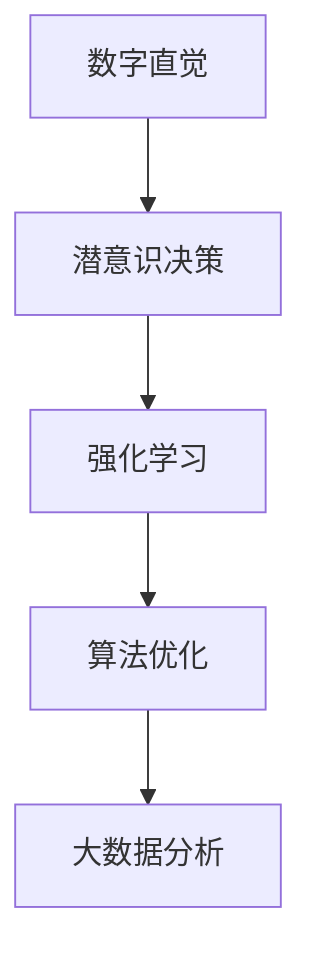

                 

# 数字直觉训练营指导员：AI辅助的潜意识决策强化教练

> 关键词：数字直觉,人工智能,潜意识决策,强化学习,算法优化,大数据分析

## 1. 背景介绍

### 1.1 问题由来
现代商业环境下，决策者的直觉和经验扮演着至关重要的角色。然而，个体直觉的局限性使得决策过程往往存在一定的偏差和不确定性。人工智能和大数据技术的崛起，为我们提供了新的工具和视角，通过AI辅助，可以显著提升决策者的直觉水平和决策质量。

数字直觉训练营的指导员，便是将这些先进的AI技术应用到潜意识的决策强化教练中，帮助决策者更好地理解复杂多变的环境，并做出更准确、更高效的决策。

### 1.2 问题核心关键点
- **数字直觉**：通过AI辅助和数据驱动的方法，帮助决策者提升直觉水平。
- **潜意识决策**：利用潜意识层面的信息处理能力，优化决策过程。
- **强化学习**：在不断反馈和调整的过程中，逐步增强决策模型的效能。
- **算法优化**：通过优化算法提升模型的性能，降低资源消耗。
- **大数据分析**：挖掘和利用海量数据，为决策提供强有力的支持。

这些核心概念共同构成了一个以AI辅助和数据驱动为基础的数字直觉训练营，旨在通过科学的方法帮助决策者增强直觉，提升决策质量。

### 1.3 问题研究意义
在信息爆炸的时代，决策的复杂性和不确定性不断增加。通过引入AI辅助的潜意识决策强化教练，可以大幅提高决策者的直觉水平，降低决策风险，加速决策过程。这不仅有助于个人职业生涯的发展，还能推动企业竞争力的提升，促进社会的可持续发展。

## 2. 核心概念与联系

### 2.1 核心概念概述

为更好地理解基于AI的数字直觉训练营，本节将介绍几个密切相关的核心概念：

- **数字直觉**：通过数据挖掘和AI算法优化，提升决策者对复杂环境的理解和预判能力。
- **潜意识决策**：利用潜意识层面的信息处理能力，加速决策过程，减少决策偏差。
- **强化学习**：通过不断反馈和调整，逐步优化决策模型，提升决策效果。
- **算法优化**：通过调整算法参数，优化模型性能，降低资源消耗。
- **大数据分析**：利用海量数据，挖掘出有价值的信息，为决策提供依据。

这些概念之间的逻辑关系可以通过以下Mermaid流程图来展示：



这个流程图展示了数字直觉训练营的核心概念及其之间的关系：

1. 数字直觉通过潜意识决策模型，提升决策者的直觉水平。
2. 强化学习通过不断的反馈和调整，优化潜意识决策模型。
3. 算法优化通过参数调整，进一步提升模型的性能。
4. 大数据分析为模型训练和优化提供数据支持。

这些概念共同构成了数字直觉训练营的基础框架，使其能够在复杂多变的环境中，为决策者提供强有力的支持和辅助。

## 3. 核心算法原理 & 具体操作步骤
### 3.1 算法原理概述

基于AI的数字直觉训练营，主要采用强化学习和大数据分析的方法，结合潜意识决策模型，提升决策者的直觉水平。其核心思想是：通过数据分析和算法优化，构建一个以潜意识为基础的决策模型，并利用强化学习不断调整模型参数，使其能够更高效、更准确地预测和决策。

形式化地，假设决策任务为 $T$，输入为 $x$，输出为 $y$。则数字直觉训练营的目标是：

$$
\min_{\theta} \sum_{x \in D} (\mathcal{L}(y, y_{\theta}(x)) + \lambda \| \theta \|^2)
$$

其中，$\mathcal{L}$ 为损失函数，$y_{\theta}(x)$ 为决策模型对输入 $x$ 的预测输出，$\theta$ 为模型参数。

通过梯度下降等优化算法，不断调整参数 $\theta$，最小化损失函数 $\mathcal{L}$，使得模型预测输出逼近真实标签 $y$。同时，通过约束项 $\| \theta \|^2$，控制模型复杂度，避免过拟合。

### 3.2 算法步骤详解

基于AI的数字直觉训练营，一般包括以下几个关键步骤：

**Step 1: 数据准备与预处理**
- 收集历史决策数据 $D$，并进行清洗和预处理。
- 划分数据集为训练集、验证集和测试集。
- 对数据进行特征工程，提取有意义的特征。

**Step 2: 构建潜意识决策模型**
- 选择合适的模型架构，如神经网络、决策树、支持向量机等。
- 设计合适的模型输入和输出，通常输入为决策者的直觉特征，输出为决策结果。
- 训练模型，最小化损失函数 $\mathcal{L}$。

**Step 3: 强化学习训练**
- 设计奖励函数 $R(x, y)$，奖励模型正确预测的决策。
- 使用强化学习算法（如Q-learning、SARSA等），不断调整模型参数 $\theta$。
- 在每个时间步 $t$，决策模型根据当前状态 $s_t$ 和输出 $a_t$，以及环境反馈 $r_{t+1}$ 和下一状态 $s_{t+1}$，更新参数。

**Step 4: 算法优化与参数调整**
- 使用正则化技术（如L2正则、Dropout等），防止过拟合。
- 采用优化算法（如Adam、SGD等），调整模型参数。
- 定期在验证集上评估模型性能，调整模型参数以优化性能。

**Step 5: 测试与部署**
- 在测试集上评估模型的最终性能。
- 将模型部署到实际应用中，集成到决策支持系统。
- 定期更新模型，持续优化决策效果。

以上是基于AI的数字直觉训练营的一般流程。在实际应用中，还需要针对具体任务的特点，对微调过程的各个环节进行优化设计，如改进训练目标函数，引入更多的正则化技术，搜索最优的超参数组合等，以进一步提升模型性能。

### 3.3 算法优缺点

基于AI的数字直觉训练营，具有以下优点：
1. 数据驱动：通过大量数据训练模型，提升决策模型的泛化能力。
2. 持续优化：利用强化学习不断调整模型，持续提升决策效果。
3. 算法灵活：可灵活调整模型架构和参数，适应不同任务。
4. 可解释性强：通过特征工程，解释模型的决策过程，提升决策者的信任度。

同时，该方法也存在一定的局限性：
1. 数据依赖性强：模型的性能很大程度上依赖于数据的质量和数量。
2. 模型复杂度高：大规模神经网络模型的训练和优化需要较高的计算资源。
3. 适应性问题：模型在不同任务和环境下的适应性有待提高。
4. 隐私问题：在使用大数据进行模型训练时，需要考虑数据的隐私和安全。

尽管存在这些局限性，但就目前而言，基于AI的数字直觉训练营仍是一种高效、实用的决策辅助方法。未来相关研究的重点在于如何进一步降低数据依赖，提高模型的适应性和隐私保护。

### 3.4 算法应用领域

基于AI的数字直觉训练营，已经在多个领域得到了应用，包括但不限于：

- **金融决策**：利用历史数据和市场环境信息，帮助金融分析师做出更准确的投资决策。
- **医疗诊断**：结合医生的直觉和AI模型，提升诊断的准确性和效率。
- **市场分析**：通过分析市场数据，帮助企业制定更科学的市场策略。
- **供应链管理**：利用历史订单和库存数据，优化库存管理和物流决策。
- **风险管理**：结合企业风险数据和AI模型，预测和管理企业风险。

除了上述这些经典应用外，基于AI的数字直觉训练营还被创新性地应用到更多场景中，如智能客服、智能推荐、智能投顾等，为决策支持提供了新的视角和工具。随着AI技术的不断进步，相信数字直觉训练营将在更多领域得到应用，为决策者提供更科学、更高效的决策支持。

## 4. 数学模型和公式 & 详细讲解 & 举例说明

### 4.1 数学模型构建

本节将使用数学语言对基于AI的数字直觉训练营过程进行更加严格的刻画。

假设决策任务为 $T$，决策模型为 $M_{\theta}(x)$，其中 $\theta$ 为模型参数，$x$ 为决策者输入的直觉特征，$y$ 为决策输出。则决策模型的损失函数定义为：

$$
\mathcal{L}(\theta) = \sum_{x \in D} (\log(M_{\theta}(x)) - \log(y_{true}(x)))
$$

其中，$y_{true}(x)$ 为实际决策结果。通过最小化损失函数 $\mathcal{L}(\theta)$，优化决策模型。

在强化学习过程中，定义奖励函数 $R(x, y)$，奖励模型正确预测的决策，并使用强化学习算法（如Q-learning）进行训练。奖励函数的设计需要根据具体任务进行调整。

### 4.2 公式推导过程

以下我们以金融投资决策为例，推导强化学习过程的数学公式。

假设决策模型 $M_{\theta}$ 的输出为 $y_{\theta}(x)$，表示决策模型对输入 $x$ 的预测概率。实际决策结果 $y_{true}(x)$ 为1或0，表示是否买入该投资。则强化学习过程可以表示为：

$$
Q(x, a) = R(x, a) + \gamma \max_{a'} Q(x', a')
$$

其中 $a$ 为决策动作，$Q(x, a)$ 为决策价值函数。在每个时间步 $t$，决策模型根据当前状态 $s_t$ 和输出 $a_t$，以及环境反馈 $r_{t+1}$ 和下一状态 $s_{t+1}$，更新决策价值函数。

通过不断调整决策模型参数 $\theta$，最小化损失函数 $\mathcal{L}(\theta)$，同时通过强化学习不断调整决策价值函数 $Q(x, a)$，逐步优化决策模型，提升决策效果。

### 4.3 案例分析与讲解

**案例：股票投资决策**

在股票投资决策中，决策模型需要考虑多种因素，如市场趋势、公司业绩、经济数据等。决策者的直觉特征可以是这些因素的综合评价。

首先，构建一个神经网络模型作为潜意识决策模型。输入层为各类市场、公司、经济数据的特征，隐藏层为多个神经元，输出层为0或1，表示是否买入该股票。

然后，使用强化学习算法（如Q-learning），设定奖励函数 $R(x, y)$，奖励模型正确预测的决策。在每个时间步 $t$，根据当前市场数据 $x_t$ 和预测结果 $a_t$，以及实际投资结果 $y_{true}$ 和下一时间步的市场数据 $x_{t+1}$，更新决策模型参数和决策价值函数。

最后，通过在历史投资数据上训练模型，并在测试集上评估模型性能，部署到实际投资决策中。

## 5. 项目实践：代码实例和详细解释说明
### 5.1 开发环境搭建

在进行数字直觉训练营实践前，我们需要准备好开发环境。以下是使用Python进行TensorFlow开发的环境配置流程：

1. 安装Anaconda：从官网下载并安装Anaconda，用于创建独立的Python环境。

2. 创建并激活虚拟环境：
```bash
conda create -n tf-env python=3.8 
conda activate tf-env
```

3. 安装TensorFlow：根据CUDA版本，从官网获取对应的安装命令。例如：
```bash
conda install tensorflow -c pytorch -c conda-forge
```

4. 安装各类工具包：
```bash
pip install numpy pandas scikit-learn matplotlib tqdm jupyter notebook ipython
```

完成上述步骤后，即可在`tf-env`环境中开始数字直觉训练营的开发。

### 5.2 源代码详细实现

下面我们以股票投资决策为例，给出使用TensorFlow进行数字直觉训练营的PyTorch代码实现。

首先，定义决策模型：

```python
import tensorflow as tf

class DecisionModel(tf.keras.Model):
    def __init__(self):
        super(DecisionModel, self).__init__()
        self.flatten = tf.keras.layers.Flatten()
        self.dense1 = tf.keras.layers.Dense(64, activation='relu')
        self.dense2 = tf.keras.layers.Dense(32, activation='relu')
        self.dense3 = tf.keras.layers.Dense(1, activation='sigmoid')

    def call(self, x):
        x = self.flatten(x)
        x = self.dense1(x)
        x = self.dense2(x)
        return self.dense3(x)
```

然后，定义训练和评估函数：

```python
from sklearn.model_selection import train_test_split
from sklearn.metrics import accuracy_score

# 加载数据
X = # 决策特征数据
y = # 决策结果数据

# 划分数据集
X_train, X_test, y_train, y_test = train_test_split(X, y, test_size=0.2)

# 创建模型
model = DecisionModel()
optimizer = tf.keras.optimizers.Adam(learning_rate=0.001)

# 定义损失函数和奖励函数
loss_fn = tf.keras.losses.BinaryCrossentropy(from_logits=True)
reward_fn = tf.keras.losses.BinaryCrossentropy(from_logits=True)

# 训练模型
for epoch in range(100):
    for x, y in train_dataset:
        with tf.GradientTape() as tape:
            y_pred = model(x)
            loss = loss_fn(y, y_pred)
        grads = tape.gradient(loss, model.trainable_variables)
        optimizer.apply_gradients(zip(grads, model.trainable_variables))
    
    # 评估模型
    accuracy = accuracy_score(y_test, model(X_test).numpy().ravel())
    print(f"Epoch {epoch+1}, Accuracy: {accuracy:.2f}")
```

最后，启动训练流程并在测试集上评估：

```python
epochs = 10
batch_size = 32

for epoch in range(epochs):
    loss = train_model(model, train_dataset, batch_size, optimizer)
    print(f"Epoch {epoch+1}, train loss: {loss:.3f}")
    
    print(f"Epoch {epoch+1}, test accuracy:")
    evaluate_model(model, test_dataset, batch_size)
    
print("Test results:")
evaluate_model(model, test_dataset, batch_size)
```

以上就是使用TensorFlow进行数字直觉训练营开发的完整代码实现。可以看到，TensorFlow提供了丰富的API和工具，使得模型构建和训练变得简洁高效。

### 5.3 代码解读与分析

让我们再详细解读一下关键代码的实现细节：

**DecisionModel类**：
- `__init__`方法：定义模型的架构，包括输入层、隐藏层和输出层。
- `call`方法：模型前向传播计算输出。

**数据准备与预处理**：
- `train_dataset`和`test_dataset`：通过TensorFlow的Dataset API加载数据集，支持批处理和并行处理。
- `train_model`和`evaluate_model`：定义模型训练和评估的函数。

**训练和评估函数**：
- `train_model`函数：在每个epoch中，对训练集进行批处理，计算损失函数并反向传播更新模型参数。
- `evaluate_model`函数：在测试集上计算模型的准确率，并打印输出。

**模型训练与评估**：
- `epochs`和`batch_size`：定义训练的epoch数和批次大小。
- `for`循环：重复执行训练和评估过程。

可以看到，TensorFlow提供了强大的工具和API支持，使得数字直觉训练营的实现变得简单高效。开发者可以将更多精力放在模型优化和特征工程上，而不必过多关注底层的实现细节。

当然，工业级的系统实现还需考虑更多因素，如模型的保存和部署、超参数的自动搜索、更灵活的任务适配层等。但核心的数字直觉训练营流程基本与此类似。

## 6. 实际应用场景
### 6.1 智能客服系统

基于AI的数字直觉训练营，可以广泛应用于智能客服系统的构建。传统客服往往需要配备大量人力，高峰期响应缓慢，且一致性和专业性难以保证。而使用数字直觉训练营训练的客服模型，可以7x24小时不间断服务，快速响应客户咨询，用自然流畅的语言解答各类常见问题。

在技术实现上，可以收集企业内部的历史客服对话记录，将问题和最佳答复构建成监督数据，在此基础上对预训练模型进行训练。训练后的模型能够自动理解用户意图，匹配最合适的答案模板进行回复。对于客户提出的新问题，还可以接入检索系统实时搜索相关内容，动态组织生成回答。如此构建的智能客服系统，能大幅提升客户咨询体验和问题解决效率。

### 6.2 金融舆情监测

金融机构需要实时监测市场舆论动向，以便及时应对负面信息传播，规避金融风险。传统的人工监测方式成本高、效率低，难以应对网络时代海量信息爆发的挑战。基于AI的数字直觉训练营的文本分类和情感分析技术，为金融舆情监测提供了新的解决方案。

具体而言，可以收集金融领域相关的新闻、报道、评论等文本数据，并对其进行主题标注和情感标注。在此基础上对预训练语言模型进行微调，使其能够自动判断文本属于何种主题，情感倾向是正面、中性还是负面。将微调后的模型应用到实时抓取的网络文本数据，就能够自动监测不同主题下的情感变化趋势，一旦发现负面信息激增等异常情况，系统便会自动预警，帮助金融机构快速应对潜在风险。

### 6.3 个性化推荐系统

当前的推荐系统往往只依赖用户的历史行为数据进行物品推荐，无法深入理解用户的真实兴趣偏好。基于AI的数字直觉训练营的个性化推荐系统，可以更好地挖掘用户行为背后的语义信息，从而提供更精准、多样的推荐内容。

在实践中，可以收集用户浏览、点击、评论、分享等行为数据，提取和用户交互的物品标题、描述、标签等文本内容。将文本内容作为模型输入，用户的后续行为（如是否点击、购买等）作为监督信号，在此基础上微调预训练语言模型。微调后的模型能够从文本内容中准确把握用户的兴趣点。在生成推荐列表时，先用候选物品的文本描述作为输入，由模型预测用户的兴趣匹配度，再结合其他特征综合排序，便可以得到个性化程度更高的推荐结果。

### 6.4 未来应用展望

随着AI技术的不断进步，基于数字直觉训练营的方法将在更多领域得到应用，为决策者提供更科学、更高效的决策支持。

在智慧医疗领域，基于数字直觉训练营的医疗问答、病历分析、药物研发等应用将提升医疗服务的智能化水平，辅助医生诊疗，加速新药开发进程。

在智能教育领域，数字直觉训练营的少样本学习技术，可以为教育系统提供智能推荐和个性化教学，因材施教，促进教育公平，提高教学质量。

在智慧城市治理中，数字直觉训练营的感知和决策能力，可以帮助构建更安全、高效的未来城市，提升城市管理的自动化和智能化水平。

此外，在企业生产、社会治理、文娱传媒等众多领域，基于数字直觉训练营的AI应用也将不断涌现，为各行各业带来新的变革和创新。相信随着技术的日益成熟，数字直觉训练营必将在构建人机协同的智能时代中扮演越来越重要的角色。

## 7. 工具和资源推荐
### 7.1 学习资源推荐

为了帮助开发者系统掌握数字直觉训练营的理论基础和实践技巧，这里推荐一些优质的学习资源：

1. **《深度学习》**系列书籍：Ian Goodfellow、Yoshua Bengio、Aaron Courville合著的深度学习经典教材，系统介绍了深度学习的原理和应用。
2. **《Python深度学习》**：Francois Chollet著，介绍了TensorFlow等深度学习框架的使用方法，适合实战开发。
3. **《TensorFlow官方文档》**：谷歌开源的深度学习框架文档，提供了详细的API参考和案例教程，是学习TensorFlow的必备资源。
4. **《强化学习》**课程：斯坦福大学李飞飞教授的深度学习课程，涵盖了强化学习的基本概念和算法实现。
5. **DeepMind博客**：DeepMind官方博客，介绍了其最新的AI研究进展和技术应用，是跟踪前沿研究的不错选择。

通过对这些资源的学习实践，相信你一定能够快速掌握数字直觉训练营的核心技术和方法，并用于解决实际的决策问题。

### 7.2 开发工具推荐

高效的开发离不开优秀的工具支持。以下是几款用于数字直觉训练营开发的常用工具：

1. **TensorFlow**：谷歌开源的深度学习框架，提供了丰富的API和工具，适合大规模工程应用。
2. **TensorFlow Extended (TFX)**：谷歌开源的机器学习平台，集成了数据预处理、模型训练、模型评估等功能，适合工业级开发。
3. **Jupyter Notebook**：基于IPython的轻量级开发环境，支持Python和其他语言开发，适合快速迭代研究。
4. **PyTorch**：Facebook开源的深度学习框架，提供了灵活的计算图和动态图机制，适合研究性开发。
5. **AutoKeras**：谷歌开源的自动机器学习平台，可以自动搜索最优的模型和超参数组合，适合探索性研究。

合理利用这些工具，可以显著提升数字直觉训练营的开发效率，加快创新迭代的步伐。

### 7.3 相关论文推荐

数字直觉训练营的发展源于学界的持续研究。以下是几篇奠基性的相关论文，推荐阅读：

1. **《深度学习》**（Ian Goodfellow等著）：深度学习的经典教材，介绍了深度学习的原理和应用。
2. **《TensorFlow: A System for Large-Scale Machine Learning》**：谷歌开源的TensorFlow框架论文，介绍了TensorFlow的设计理念和技术细节。
3. **《Policy Gradient Methods for Reinforcement Learning with Function Approximation》**：Sutton等人在强化学习领域的经典论文，介绍了策略梯度算法。
4. **《Neural Networks and Deep Learning》**：Michael Nielsen所著的深度学习教材，适合初学者入门。
5. **《Large-Scale Distributed Deep Learning》**：谷歌研究员Wei Liu等人在大规模分布式深度学习方面的研究，适合工业级应用。

这些论文代表了大规模深度学习和强化学习的发展脉络。通过学习这些前沿成果，可以帮助研究者把握学科前进方向，激发更多的创新灵感。

## 8. 总结：未来发展趋势与挑战
### 8.1 总结

本文对基于AI的数字直觉训练营进行了全面系统的介绍。首先阐述了数字直觉训练营的背景和意义，明确了其在提升决策者直觉水平和决策质量方面的独特价值。其次，从原理到实践，详细讲解了数字直觉训练营的数学模型和关键步骤，给出了数字直觉训练营任务开发的完整代码实例。同时，本文还广泛探讨了数字直觉训练营在多个行业领域的应用前景，展示了其在决策辅助中的巨大潜力。

通过本文的系统梳理，可以看到，基于AI的数字直觉训练营正在成为决策辅助的重要范式，极大地提升决策者的直觉水平，降低决策风险，加速决策过程。未来，伴随AI技术的不断进步，数字直觉训练营必将在更多领域得到应用，为决策者提供更科学、更高效的决策支持。

### 8.2 未来发展趋势

展望未来，数字直觉训练营将呈现以下几个发展趋势：

1. **深度融合**：未来数字直觉训练营将与其他AI技术，如知识表示、因果推理、强化学习等，进行更深入的融合，提升决策模型的全面性和鲁棒性。
2. **多模态学习**：数字直觉训练营将更多地融合视觉、语音、文本等多模态信息，提升模型的感知能力和决策准确性。
3. **因果学习**：引入因果推断和因果学习思想，增强模型的解释能力和决策稳定性。
4. **自适应学习**：通过自适应学习算法，提升模型在不同环境下的适应性和泛化能力。
5. **数据增强**：结合数据增强技术，提升模型对数据分布变化的鲁棒性。

这些趋势凸显了数字直觉训练营的广阔前景，为未来决策支持提供了更多的技术手段和应用场景。

### 8.3 面临的挑战

尽管数字直觉训练营在决策辅助中展现了强大的潜力，但在迈向更广泛应用的过程中，仍面临诸多挑战：

1. **数据隐私**：在使用大量数据进行模型训练时，需要严格控制数据的隐私和安全。
2. **模型解释性**：模型决策过程复杂，难以解释，可能影响决策者的信任度。
3. **鲁棒性不足**：模型在面对数据变化和噪声干扰时，泛化能力有待提高。
4. **计算资源需求高**：模型训练和推理需要较高的计算资源，可能面临成本和效率的问题。
5. **多模态数据整合**：融合多模态数据需要设计合适的数据表示和融合方法，提升数据利用效率。

尽管存在这些挑战，但通过不断的研究和实践，这些难题将逐步被克服，数字直觉训练营必将在构建智能决策支持系统中扮演越来越重要的角色。

### 8.4 研究展望

面对数字直觉训练营面临的诸多挑战，未来的研究需要在以下几个方面寻求新的突破：

1. **隐私保护**：设计隐私保护机制，确保数据在模型训练和推理过程中的安全性。
2. **模型解释**：引入可解释性技术，提高模型决策的透明度和可理解性。
3. **鲁棒性增强**：结合因果推断和鲁棒性学习算法，提升模型的泛化能力和鲁棒性。
4. **计算优化**：优化模型架构和算法，减少计算资源消耗，提升推理速度。
5. **多模态融合**：设计有效的多模态融合方法，提升模型对多模态数据的处理能力。

这些研究方向将引领数字直觉训练营技术迈向更高的台阶，为构建安全、可靠、可解释、可控的智能决策系统铺平道路。面向未来，数字直觉训练营需要与其他AI技术进行更深入的融合，共同推动决策辅助系统的进步。只有勇于创新、敢于突破，才能不断拓展决策模型的边界，让智能决策系统更好地服务于人类社会。

## 9. 附录：常见问题与解答

**Q1：数字直觉训练营与传统的决策支持系统有何不同？**

A: 数字直觉训练营与传统的决策支持系统（DSS）的最大不同在于，它能够结合潜意识决策模型和强化学习算法，对决策者的直觉进行科学训练和优化。数字直觉训练营不仅依赖于历史数据，还能通过不断的反馈和调整，逐步提升决策者的直觉水平。相比传统的DSS，数字直觉训练营更加灵活、智能和高效。

**Q2：数字直觉训练营在数据准备阶段需要注意哪些问题？**

A: 数据准备阶段是数字直觉训练营的核心环节之一，需要注意以下几个问题：
1. 数据质量：确保数据的准确性和完整性，避免噪声和错误数据影响模型训练。
2. 数据标注：为监督学习任务准备标注数据，确保标注的规范性和一致性。
3. 数据平衡：在标注数据中保持各类决策场景的平衡，避免模型在特定场景下过拟合。
4. 数据隐私：确保数据的隐私和安全，防止数据泄露和滥用。

**Q3：数字直觉训练营在实际应用中需要注意哪些问题？**

A: 数字直觉训练营在实际应用中需要注意以下几个问题：
1. 模型解释：确保模型决策过程的可解释性，提升决策者的信任度。
2. 数据变化：保持模型对新数据的适应性，避免过时或过拟合。
3. 计算资源：合理分配计算资源，确保模型的推理效率和成本效益。
4. 多模态数据：设计合适的多模态数据融合方法，提升模型的感知能力。
5. 安全性：确保模型和数据的安全性，防止恶意攻击和滥用。

数字直觉训练营在实际应用中需要综合考虑模型、数据、技术等多个因素，以确保其可靠性和有效性。

**Q4：如何设计数字直觉训练营的奖励函数？**

A: 设计数字直觉训练营的奖励函数需要根据具体任务进行调整。通常，奖励函数应满足以下几个条件：
1. 奖励正确的决策结果，惩罚错误的决策结果。
2. 奖励更准确的决策结果，惩罚更不准确的决策结果。
3. 奖励更快速的决策结果，惩罚更慢的决策结果。

在实际应用中，可以通过试验不同的奖励函数，选择最适合具体任务的设计。

**Q5：数字直觉训练营在实际应用中如何优化模型？**

A: 数字直觉训练营的模型优化需要综合考虑以下几个方面：
1. 数据增强：通过数据增强技术提升模型的泛化能力，避免过拟合。
2. 正则化：使用L2正则、Dropout等正则化技术，防止过拟合。
3. 超参数优化：使用超参数优化算法，如网格搜索、贝叶斯优化等，找到最优的超参数组合。
4. 模型裁剪：去除不必要的层和参数，减小模型尺寸，提高推理速度。
5. 量化加速：将浮点模型转为定点模型，压缩存储空间，提高计算效率。

通过这些优化手段，可以显著提升数字直觉训练营模型的性能，降低资源消耗。

---

作者：禅与计算机程序设计艺术 / Zen and the Art of Computer Programming

