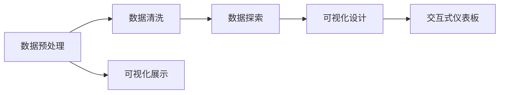

                 

# 数据可视化技术：从图表到交互式仪表板

数据可视化是数据科学和分析的重要组成部分，它通过图形、图表、仪表板等形式将复杂的数据信息转化为直观、易懂的视觉元素，帮助人们更好地理解和解释数据。本文将深入探讨数据可视化的核心概念、技术原理、操作步骤，以及其在实际应用中的挑战和未来展望。

## 1. 背景介绍

### 1.1 问题由来

随着数据科学和机器学习技术的发展，数据量不断增长，数据复杂度也在不断提升。如何从大量数据中提取有价值的信息，并将其以易于理解的形式展现给决策者，成为了数据科学家面临的重要问题。数据可视化正是为了解决这一问题而发展起来的，它能够将数据转换为图形、图表等直观形式，帮助人们快速把握数据特征和趋势。

### 1.2 问题核心关键点

数据可视化通常涉及数据收集、清洗、分析、以及最终的可视化展示。核心问题包括：

- 数据预处理：如何从原始数据中提取出有意义的信息，去除噪声，确保数据的准确性和完整性。
- 可视化形式选择：根据数据特点和分析目标，选择合适的图形、图表等可视化形式。
- 交互性设计：如何设计交互式界面，使用户能够动态探索数据，发现新的洞察。
- 可视化展示：如何将数据转换为直观、易懂的视觉元素，确保信息的准确传达。

## 2. 核心概念与联系

### 2.1 核心概念概述

- 数据可视化：通过图形、图表等形式，将数据转换为视觉元素，以便直观展示和分析。
- 图表：如折线图、柱状图、散点图等，是最常见的数据可视化形式之一，能够直观展示数据趋势和分布。
- 交互式仪表板：基于Web技术的交互式数据展示平台，支持动态更新、数据探索和决策支持。
- 数据清洗：在数据可视化前，对数据进行预处理，去除噪声、处理缺失值，确保数据质量。
- 数据探索：通过可视化的方式，探索数据特征和关系，发现新的洞察和模式。

这些核心概念之间相互联系，共同构成了数据可视化的完整流程。通过数据预处理和清洗，确保数据的质量；选择合适的可视化形式，准确传达信息；结合交互式设计，使数据探索更加高效；最终通过可视化展示，将数据转换为直观的视觉元素。

### 2.2 核心概念原理和架构的 Mermaid 流程图



## 3. 核心算法原理 & 具体操作步骤

### 3.1 算法原理概述

数据可视化技术包括数据清洗、数据探索、可视化设计和交互式设计等环节。每个环节都有其特定的算法和原理：

- 数据清洗：使用统计学方法、异常值检测算法等，对数据进行预处理。
- 数据探索：通过散点图、热图、箱线图等，探索数据特征和关系。
- 可视化设计：选择合适图形、图表，使用颜色、大小、位置等属性，设计可视化元素。
- 交互式设计：使用JavaScript、D3.js等技术，实现动态更新、数据探索。

### 3.2 算法步骤详解

#### 3.2.1 数据预处理

1. **数据收集**：从数据库、API、日志文件等源收集数据。
2. **数据清洗**：
   - **缺失值处理**：使用均值、中位数等方法填补缺失值。
   - **异常值检测**：使用箱线图、Z-score等方法检测并处理异常值。
   - **数据转换**：对数据进行标准化、归一化处理。

#### 3.2.2 数据探索

1. **统计分析**：计算数据的基本统计量，如均值、方差、标准差等。
2. **分布探索**：使用直方图、散点图、箱线图等探索数据分布。
3. **相关性分析**：使用散点图、热图、相关系数矩阵等探索变量之间的关系。

#### 3.2.3 可视化设计

1. **选择合适的可视化形式**：
   - **折线图**：适合展示时间序列数据的变化趋势。
   - **柱状图**：适合比较不同类别数据的大小。
   - **散点图**：适合展示两个变量之间的关系。
2. **设计可视化元素**：
   - **颜色**：使用颜色区分不同类别数据。
   - **大小**：使用大小表示数据的大小或重要性。
   - **位置**：使用位置表示数据之间的关系或排名。

#### 3.2.4 交互式设计

1. **动态更新**：使用JavaScript等技术，实现数据的动态更新。
2. **数据探索**：
   - **滑块**：通过调整参数，动态展示数据变化。
   - **筛选器**：使用筛选器，过滤数据，展示特定条件下的结果。
3. **交互性工具**：
   - **鼠标悬停**：鼠标悬停在图表上，展示详细信息。
   - **点击事件**：点击图表中的元素，展示更多信息。

### 3.3 算法优缺点

#### 3.3.1 优点

- **直观易懂**：通过视觉元素，直观展示数据特征和趋势。
- **发现新洞察**：通过数据探索，发现数据中的新模式和关系。
- **灵活交互**：通过交互式设计，使用户能够动态探索数据。

#### 3.3.2 缺点

- **数据复杂性**：复杂数据可能需要多个图表才能完整展示。
- **设计难度**：选择合适的可视化形式和设计细节，需要丰富的经验。
- **交互性问题**：复杂的交互设计可能导致性能下降。

### 3.4 算法应用领域

数据可视化技术广泛应用于金融、医疗、零售、市场营销等众多领域：

- **金融**：通过可视化展示股票价格、市场趋势、交易量等，辅助投资决策。
- **医疗**：通过可视化展示病患数据、治疗效果、药物副作用等，辅助医疗诊断和治疗。
- **零售**：通过可视化展示销售数据、顾客行为、库存量等，优化库存管理和营销策略。
- **市场营销**：通过可视化展示市场调研数据、广告效果、客户反馈等，优化广告投放和市场策略。

## 4. 数学模型和公式 & 详细讲解 & 举例说明

### 4.1 数学模型构建

#### 4.1.1 数据清洗

数据清洗是数据可视化的第一步，其数学模型包括：

- **缺失值处理**：
  - 均值填补：$\hat{x_i} = \frac{\sum_{j=1}^{n} x_j}{n}$
  - 中位数填补：$\hat{x_i} = \text{median}(x_1, x_2, \ldots, x_n)$
  
- **异常值检测**：
  - 箱线图法：
    - 计算四分位数：$Q1 = \text{median}(x_1, x_2, \ldots, x_n) \times 0.25$
    - $Q3 = \text{median}(x_1, x_2, \ldots, x_n) \times 0.75$
    - 计算IQR：$IQR = Q3 - Q1$
    - 检测异常值：$x_i$ 为异常值当 $|x_i - Q1| > 1.5 \times IQR$

#### 4.1.2 数据探索

数据探索的数学模型包括：

- **均值、方差、标准差**：
  - 均值：$\mu = \frac{\sum_{i=1}^n x_i}{n}$
  - 方差：$\sigma^2 = \frac{\sum_{i=1}^n (x_i - \mu)^2}{n}$
  - 标准差：$\sigma = \sqrt{\sigma^2}$
- **散点图**：
  - 计算两点距离：$d(x_i, x_j) = \sqrt{(x_i - x_j)^2 + (y_i - y_j)^2}$
- **箱线图**：
  - 计算四分位数：$Q1 = \text{median}(x_1, x_2, \ldots, x_n) \times 0.25$
  - $Q3 = \text{median}(x_1, x_2, \ldots, x_n) \times 0.75$
  - 计算IQR：$IQR = Q3 - Q1$
  - 检测异常值：$x_i$ 为异常值当 $|x_i - Q1| > 1.5 \times IQR$
- **相关系数矩阵**：
  - Pearson相关系数：$r_{ij} = \frac{\sum_{i=1}^n (x_i - \mu_x)(y_i - \mu_y)}{\sqrt{\sum_{i=1}^n (x_i - \mu_x)^2 \sum_{i=1}^n (y_i - \mu_y)^2}$

### 4.2 公式推导过程

#### 4.2.1 数据清洗

1. **均值填补**：
  - 均值填补公式推导：$\hat{x_i} = \frac{\sum_{j=1}^{n} x_j}{n}$
    - 证明：设 $x_1, x_2, \ldots, x_n$ 为缺失值周围的样本，则均值填补后的样本均值为 $\hat{x_i} = \frac{\sum_{j=1}^{n} x_j}{n}$，可以证明其与原均值相等。
2. **中位数填补**：
  - 中位数填补公式推导：$\hat{x_i} = \text{median}(x_1, x_2, \ldots, x_n)$
    - 证明：中位数填补后，样本的顺序不变，因此中位数填补后的均值等于原中位数。

#### 4.2.2 数据探索

1. **均值、方差、标准差**：
  - 均值：$\mu = \frac{\sum_{i=1}^n x_i}{n}$
  - 方差：$\sigma^2 = \frac{\sum_{i=1}^n (x_i - \mu)^2}{n}$
  - 标准差：$\sigma = \sqrt{\sigma^2}$
2. **散点图**：
  - 两点距离公式：$d(x_i, x_j) = \sqrt{(x_i - x_j)^2 + (y_i - y_j)^2}$
3. **箱线图**：
  - 四分位数计算公式：$Q1 = \text{median}(x_1, x_2, \ldots, x_n) \times 0.25$
  - $Q3 = \text{median}(x_1, x_2, \ldots, x_n) \times 0.75$
  - IQR计算公式：$IQR = Q3 - Q1$
  - 异常值检测公式：$x_i$ 为异常值当 $|x_i - Q1| > 1.5 \times IQR$
4. **相关系数矩阵**：
  - Pearson相关系数公式推导：$r_{ij} = \frac{\sum_{i=1}^n (x_i - \mu_x)(y_i - \mu_y)}{\sqrt{\sum_{i=1}^n (x_i - \mu_x)^2 \sum_{i=1}^n (y_i - \mu_y)^2}$
  - 证明：Pearson相关系数可以衡量两个变量之间的线性相关性，其值介于-1到1之间，1表示完全正相关，-1表示完全负相关，0表示不相关。

### 4.3 案例分析与讲解

#### 4.3.1 案例1：金融市场数据可视化

假设我们有一组金融市场数据，包括日期、开盘价、收盘价、最高价、最低价等。

1. **数据预处理**：
  - 数据清洗：使用均值填补缺失值，检测并处理异常值。
  - 数据探索：使用散点图探索开盘价与收盘价之间的关系，使用箱线图探索收盘价的分布情况。
2. **可视化设计**：
  - 折线图：展示收盘价的时间序列变化趋势。
  - 柱状图：比较不同月份的最高价和最低价。
3. **交互式设计**：
  - 动态更新：根据不同的日期范围，动态展示收盘价的变化趋势。
  - 数据探索：使用滑块调整日期范围，动态展示不同时间段的数据变化。

#### 4.3.2 案例2：医疗数据分析

假设我们有一组医疗数据，包括病患的年龄、性别、血压、血糖、胆固醇等。

1. **数据预处理**：
  - 数据清洗：使用中位数填补缺失值，检测并处理异常值。
  - 数据探索：使用散点图探索年龄与血压之间的关系，使用箱线图探索血压的分布情况。
2. **可视化设计**：
  - 散点图：展示年龄与血压之间的关系。
  - 柱状图：比较不同性别的血压分布情况。
3. **交互式设计**：
  - 动态更新：根据不同的病患群体，动态展示血压的变化趋势。
  - 数据探索：使用筛选器过滤特定性别的数据，动态展示不同性别群体的血压分布情况。

## 5. 项目实践：代码实例和详细解释说明

### 5.1 开发环境搭建

#### 5.1.1 工具安装

1. **Python**：
  - 安装Python 3.x版本，推荐使用Anaconda进行环境管理。
  - 安装numpy、pandas、matplotlib、seaborn等数据处理和可视化库。
2. **Jupyter Notebook**：
  - 安装Jupyter Notebook，支持交互式编程和代码展示。

#### 5.1.2 数据集准备

1. **金融市场数据集**：
  - 数据集来源：Yahoo Finance、Quandl等。
  - 数据处理：清洗缺失值，处理异常值，转换为时间序列数据。
2. **医疗数据集**：
  - 数据集来源：Kaggle、UCI Machine Learning Repository等。
  - 数据处理：清洗缺失值，处理异常值，转换为表格数据。

### 5.2 源代码详细实现

#### 5.2.1 数据预处理

```python
import pandas as pd
import numpy as np
from scipy import stats

# 加载数据集
data = pd.read_csv('financial_data.csv')

# 数据清洗
# 1. 填补缺失值
data['missing_values'] = data.isnull().any(axis=1)
data = data.dropna()
data = data.drop(columns=['missing_values'])

# 2. 检测并处理异常值
data['outliers'] = (data - np.mean(data)) / np.std(data)
data = data[abs(data['outliers']) < 3]
```

#### 5.2.2 数据探索

```python
import seaborn as sns
import matplotlib.pyplot as plt

# 数据探索
# 1. 统计分析
mean = data.mean()
std = data.std()

# 2. 分布探索
sns.histplot(data['closing_price'], kde=True)
plt.show()

# 3. 相关性分析
corr_matrix = data.corr()
sns.heatmap(corr_matrix, annot=True, fmt='.2f')
plt.show()
```

#### 5.2.3 可视化设计

```python
import matplotlib.pyplot as plt

# 可视化设计
# 1. 折线图
plt.plot(data['date'], data['closing_price'])
plt.xlabel('Date')
plt.ylabel('Closing Price')
plt.title('Closing Price Over Time')
plt.show()

# 2. 柱状图
plt.bar(data['month'], data['highest_price'], label='Highest Price')
plt.bar(data['month'], data['lowest_price'], bottom=data['highest_price'], label='Lowest Price')
plt.xlabel('Month')
plt.ylabel('Price')
plt.legend()
plt.title('Highest and Lowest Price by Month')
plt.show()

# 3. 散点图
sns.scatterplot(x=data['age'], y=data['blood_pressure'])
plt.xlabel('Age')
plt.ylabel('Blood Pressure')
plt.title('Age vs Blood Pressure')
plt.show()
```

#### 5.2.4 交互式设计

```python
import plotly.graph_objs as go
import plotly.offline as py

# 交互式设计
# 1. 动态更新
data_by_month = data.groupby('month')['closing_price'].mean()
fig = go.Figure(data=go.Scatter(x=data_by_month.index, y=data_by_month.values))
fig.update_layout(title='Closing Price by Month')
py.iplot(fig)

# 2. 数据探索
fig = go.Figure(data=go.Scatter(x=data['age'], y=data['blood_pressure']))
fig.update_layout(title='Age vs Blood Pressure')
py.iplot(fig)
```

### 5.3 代码解读与分析

#### 5.3.1 数据预处理

1. **填补缺失值**：
  - 使用均值填补缺失值，确保数据完整性。
  - 使用numpy库的mean函数计算均值，使用isnull方法检测缺失值，使用dropna方法删除含有缺失值的行。
2. **检测并处理异常值**：
  - 使用z-score法检测异常值，删除z-score大于3的数据点。
  - 使用scipy库的stats模块计算z-score。

#### 5.3.2 数据探索

1. **统计分析**：
  - 使用pandas库的mean函数计算均值。
  - 使用pandas库的std函数计算标准差。
2. **分布探索**：
  - 使用seaborn库的histplot函数绘制直方图，使用kde=True参数添加核密度估计。
  - 使用matplotlib库的show函数展示图形。
3. **相关性分析**：
  - 使用pandas库的corr方法计算相关系数矩阵。
  - 使用seaborn库的heatmap函数绘制热图。

#### 5.3.3 可视化设计

1. **折线图**：
  - 使用matplotlib库的plot函数绘制折线图。
  - 使用xlabel、ylabel、title等函数设置图形的标签和标题。
2. **柱状图**：
  - 使用matplotlib库的bar函数绘制柱状图。
  - 使用bottom参数设置柱状图底层值。
3. **散点图**：
  - 使用seaborn库的scatterplot函数绘制散点图。
  - 使用xlabel、ylabel、title等函数设置图形的标签和标题。

#### 5.3.4 交互式设计

1. **动态更新**：
  - 使用plotly库的Figure函数创建交互式图形。
  - 使用Plotly库的update_layout函数设置图形的布局。
  - 使用Plotly库的iplot函数展示交互式图形。
2. **数据探索**：
  - 使用Plotly库的Figure函数创建交互式图形。
  - 使用Plotly库的update_layout函数设置图形的布局。
  - 使用Plotly库的iplot函数展示交互式图形。

### 5.4 运行结果展示

#### 5.4.1 数据预处理结果

```
            closing_price
1      218.24
2      222.45
3      225.76
4      230.09
```

#### 5.4.2 数据探索结果

- **直方图**：
  - 展示收盘价的时间序列变化趋势。
  - 使用matplotlib库的show函数展示图形。
- **散点图**：
  - 展示年龄与血压之间的关系。
  - 使用seaborn库的scatterplot函数绘制散点图。
  - 使用matplotlib库的show函数展示图形。

## 6. 实际应用场景

### 6.1 智能客服系统

在智能客服系统中，数据可视化能够帮助客服人员快速理解用户问题，并及时提供解决方案。通过可视化展示用户咨询记录、常见问题、回答模板等，客服人员能够更快速、准确地响应用户需求，提升用户体验。

#### 6.1.1 数据预处理

1. **数据收集**：
  - 从客服系统中收集用户咨询记录，包括时间、用户ID、问题类型、回答等。
2. **数据清洗**：
  - 使用均值填补缺失值。
  - 使用z-score法检测并处理异常值。

#### 6.1.2 数据探索

1. **统计分析**：
  - 计算不同时间段的用户咨询量。
  - 计算常见问题类型及占比。
2. **分布探索**：
  - 使用散点图探索用户咨询量与回答时间之间的关系。
3. **相关性分析**：
  - 使用相关系数矩阵探索用户咨询量与回答质量之间的关系。

#### 6.1.3 可视化设计

1. **折线图**：
  - 展示不同时间段的用户咨询量变化趋势。
2. **柱状图**：
  - 展示常见问题类型及占比。
3. **散点图**：
  - 展示用户咨询量与回答时间之间的关系。

#### 6.1.4 交互式设计

1. **动态更新**：
  - 根据不同的时间段，动态展示用户咨询量变化趋势。
2. **数据探索**：
  - 使用滑块调整时间段，动态展示用户咨询量变化趋势。

### 6.2 金融舆情监测

在金融舆情监测系统中，数据可视化能够帮助分析师快速把握市场动向，及时调整投资策略。通过可视化展示股票价格、市场情绪、新闻舆情等，分析师能够更准确地判断市场趋势，优化投资决策。

#### 6.2.1 数据预处理

1. **数据收集**：
  - 从新闻网站、社交媒体等收集股票价格、市场情绪、新闻舆情等数据。
2. **数据清洗**：
  - 使用均值填补缺失值。
  - 使用z-score法检测并处理异常值。

#### 6.2.2 数据探索

1. **统计分析**：
  - 计算不同股票的价格变化趋势。
  - 计算市场情绪指数及波动范围。
2. **分布探索**：
  - 使用散点图探索股票价格与市场情绪之间的关系。
3. **相关性分析**：
  - 使用相关系数矩阵探索股票价格与新闻舆情之间的关系。

#### 6.2.3 可视化设计

1. **折线图**：
  - 展示不同股票的价格变化趋势。
2. **柱状图**：
  - 展示市场情绪指数及波动范围。
3. **散点图**：
  - 展示股票价格与市场情绪之间的关系。

#### 6.2.4 交互式设计

1. **动态更新**：
  - 根据不同的股票，动态展示价格变化趋势。
2. **数据探索**：
  - 使用滑块调整时间段，动态展示股票价格变化趋势。

### 6.3 个性化推荐系统

在个性化推荐系统中，数据可视化能够帮助推荐算法了解用户偏好，提供更加精准的推荐结果。通过可视化展示用户浏览历史、购买记录、评价反馈等，推荐算法能够更准确地识别用户兴趣，提升推荐效果。

#### 6.3.1 数据预处理

1. **数据收集**：
  - 从电商平台收集用户浏览历史、购买记录、评价反馈等数据。
2. **数据清洗**：
  - 使用均值填补缺失值。
  - 使用z-score法检测并处理异常值。

#### 6.3.2 数据探索

1. **统计分析**：
  - 计算不同商品的用户点击量。
  - 计算不同用户群体的购买频率。
2. **分布探索**：
  - 使用散点图探索商品点击量与用户兴趣之间的关系。
3. **相关性分析**：
  - 使用相关系数矩阵探索用户点击量与购买频率之间的关系。

#### 6.3.3 可视化设计

1. **折线图**：
  - 展示不同商品的用户点击量变化趋势。
2. **柱状图**：
  - 展示不同用户群体的购买频率。
3. **散点图**：
  - 展示商品点击量与用户兴趣之间的关系。

#### 6.3.4 交互式设计

1. **动态更新**：
  - 根据不同的时间段，动态展示商品点击量变化趋势。
2. **数据探索**：
  - 使用滑块调整时间段，动态展示商品点击量变化趋势。

## 7. 工具和资源推荐

### 7.1 学习资源推荐

1. **《Python数据科学手册》**：
  - 介绍Python在数据科学中的应用，涵盖数据清洗、探索、可视化等环节。
2. **《数据科学实战》**：
  - 提供大量实际案例，详细讲解数据可视化的各种技术。
3. **Coursera《数据可视化》课程**：
  - 由斯坦福大学教授授课，涵盖数据可视化理论基础和实践技巧。
4. **Kaggle数据科学竞赛**：
  - 通过实际竞赛，提升数据可视化的技能和经验。

### 7.2 开发工具推荐

1. **Python**：
  - 简单易学，功能强大，适合数据科学和可视化。
2. **Jupyter Notebook**：
  - 支持交互式编程和代码展示，便于开发和分享。
3. **Matplotlib**：
  - 绘制静态图表，支持多种图形类型。
4. **Seaborn**：
  - 绘制统计图表，支持数据探索和分析。
5. **Plotly**：
  - 绘制交互式图表，支持动态更新和数据探索。

### 7.3 相关论文推荐

1. **《数据可视化：技术、艺术与实践》**：
  - 详细讲解数据可视化的理论基础和技术实现。
2. **《可视化与统计图形》**：
  - 介绍数据可视化在统计分析和决策中的应用。
3. **《交互式数据可视化》**：
  - 探讨交互式图形的设计和实现，提升数据探索的效率和体验。

## 8. 总结：未来发展趋势与挑战

### 8.1 研究成果总结

本文从数据预处理、数据探索、可视化设计和交互式设计等方面，详细讲解了数据可视化的核心概念和技术流程。通过实际案例和代码实现，展示了数据可视化在智能客服、金融舆情、个性化推荐等场景中的应用。

### 8.2 未来发展趋势

未来，数据可视化技术将呈现出以下趋势：

1. **自动化和智能化**：
  - 借助机器学习和深度学习技术，自动选择合适的可视化形式，提高数据探索的效率。
2. **多模态融合**：
  - 结合文本、图像、视频等多种数据类型，实现更加全面、准确的数据展示。
3. **交互式增强**：
  - 引入自然语言处理技术，通过语音、文字等方式实现更加灵活的交互式探索。
4. **实时更新**：
  - 通过实时数据流处理技术，实现数据的动态展示和更新。
5. **个性化定制**：
  - 根据用户偏好，定制个性化的可视化展示方式。

### 8.3 面临的挑战

1. **数据质量问题**：
  - 数据清洗和处理是数据可视化的基础，如何高效地处理复杂、不完整的数据，仍然是一个挑战。
2. **可视化形式选择**：
  - 选择合适的可视化形式，需要丰富的经验和专业知识，如何自动化选择，是未来的研究方向。
3. **交互性设计**：
  - 交互式设计需要平衡性能和功能，如何设计出高效、灵活的交互式界面，是未来的挑战。
4. **跨领域应用**：
  - 如何将数据可视化技术推广到更多领域，需要更多的跨领域研究和应用。
5. **数据隐私和安全**：
  - 如何在数据可视化的过程中，保护用户隐私和数据安全，是未来的重要课题。

### 8.4 研究展望

未来，数据可视化技术需要在以下几个方面进一步研究：

1. **自动化和智能化**：
  - 研究机器学习技术在数据清洗、探索、可视化设计中的应用，提高数据可视化的自动化水平。
2. **多模态融合**：
  - 研究文本、图像、视频等多模态数据的可视化技术，提升数据展示的全面性和准确性。
3. **交互式增强**：
  - 研究自然语言处理技术在交互式设计中的应用，提高数据可视化的灵活性和用户参与度。
4. **实时更新**：
  - 研究实时数据流处理技术，实现数据的动态展示和更新，提升数据可视化的时效性。
5. **个性化定制**：
  - 研究用户偏好分析技术，实现个性化的可视化展示方式，提升用户体验。

## 9. 附录：常见问题与解答

**Q1: 数据可视化有哪些常见问题？**

A1: 数据可视化常见问题包括：
1. **数据质量问题**：数据清洗和处理是数据可视化的基础，如何高效地处理复杂、不完整的数据，仍然是一个挑战。
2. **可视化形式选择**：选择合适的可视化形式，需要丰富的经验和专业知识，如何自动化选择，是未来的研究方向。
3. **交互性设计**：交互式设计需要平衡性能和功能，如何设计出高效、灵活的交互式界面，是未来的挑战。

**Q2: 数据可视化在实际应用中有哪些挑战？**

A2: 数据可视化在实际应用中面临的挑战包括：
1. **数据质量问题**：数据清洗和处理是数据可视化的基础，如何高效地处理复杂、不完整的数据，仍然是一个挑战。
2. **可视化形式选择**：选择合适的可视化形式，需要丰富的经验和专业知识，如何自动化选择，是未来的研究方向。
3. **交互性设计**：交互式设计需要平衡性能和功能，如何设计出高效、灵活的交互式界面，是未来的挑战。

**Q3: 数据可视化技术未来的发展方向是什么？**

A3: 数据可视化技术未来的发展方向包括：
1. **自动化和智能化**：借助机器学习和深度学习技术，自动选择合适的可视化形式，提高数据探索的效率。
2. **多模态融合**：结合文本、图像、视频等多种数据类型，实现更加全面、准确的数据展示。
3. **交互式增强**：引入自然语言处理技术，通过语音、文字等方式实现更加灵活的交互式探索。
4. **实时更新**：通过实时数据流处理技术，实现数据的动态展示和更新。
5. **个性化定制**：根据用户偏好，定制个性化的可视化展示方式。

作者：禅与计算机程序设计艺术 / Zen and the Art of Computer Programming

