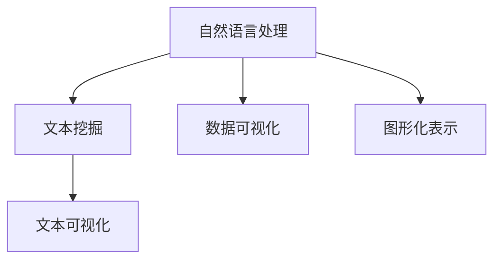
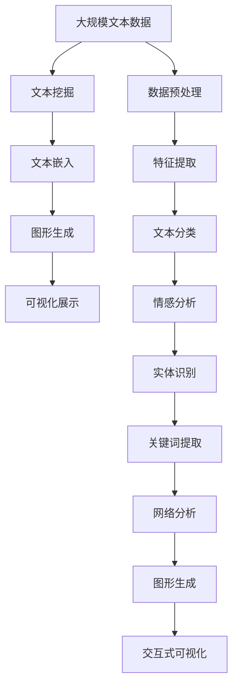

                 

# 文本可视化：大规模文本数据的直观呈现

## 1. 背景介绍

在当今信息爆炸的时代，数据量激增，如何直观地呈现大规模文本数据成为一种迫切需求。传统的文本展示方式往往难以涵盖大量信息，无法提供深入的洞察。而文本可视化技术的出现，恰好满足了这一需求。通过将文本数据转换为图形或图表，不仅能够展示数据的关键信息，还能揭示数据之间的关系和趋势，帮助决策者更好地理解和应用文本数据。

文本可视化技术不仅应用于学术研究，也逐渐渗透到日常工作和生活。例如，在新闻媒体中，可视化工具帮助记者和编辑快速生成统计图表，直观地呈现数据；在商业分析中，可视化帮助企业快速识别趋势和模式，优化决策；在科学研究中，可视化帮助研究人员更好地理解和解释实验结果，加速科研进程。

本文将系统介绍文本可视化技术的基本概念、核心算法、具体应用和未来发展趋势，帮助读者深入了解这一前沿技术，探索其在多个领域的应用潜力。

## 2. 核心概念与联系

### 2.1 核心概念概述

文本可视化涉及多个关键概念，包括自然语言处理、数据可视化、图形化表示等。以下将逐一介绍这些概念及其联系。

- **自然语言处理（Natural Language Processing, NLP）**：
  - 研究如何让计算机理解和处理人类语言。
  - 文本预处理、情感分析、文本分类、信息抽取等是NLP的主要研究方向。

- **数据可视化（Data Visualization）**：
  - 将数据转换为图形或图表，以直观展示数据信息。
  - 常用的数据可视化技术包括散点图、柱状图、折线图等。

- **图形化表示（Graphical Representation）**：
  - 利用图形界面展示数据，包括文本、图像、声音等。
  - 交互式可视化工具允许用户通过拖拽、缩放等操作查看和探索数据。

- **文本挖掘（Text Mining）**：
  - 从文本数据中提取有价值的信息，包括主题建模、情感分析、实体识别等。
  - 文本挖掘技术为文本可视化提供了原始数据。

这些核心概念的联系通过以下Mermaid流程图来展示：



这个流程图展示了NLP、文本挖掘、数据可视化和图形化表示之间的关系：

1. NLP将文本数据转换为数值形式。
2. 文本挖掘从转换后的数据中提取关键信息。
3. 数据可视化将这些信息直观地展示出来。
4. 图形化表示进一步增强了可视化效果。

### 2.2 核心概念原理和架构的 Mermaid 流程图



这个图表展示了文本可视化的主要流程：

1. **大规模文本数据**：原始的文本数据，可能来自新闻、社交媒体、书籍等。
2. **文本挖掘**：对文本进行预处理和特征提取，如分词、去除停用词、提取关键词等。
3. **文本嵌入**：将文本转换为数值形式，常用的嵌入方法包括词袋模型、TF-IDF、word2vec等。
4. **图形生成**：将数值形式的文本数据转换为图形，常用的图形包括词云、网络图、时间序列图等。
5. **可视化展示**：通过图表展示生成的图形，帮助用户直观理解数据。

## 3. 核心算法原理 & 具体操作步骤

### 3.1 算法原理概述

文本可视化的核心算法主要包括文本挖掘和图形生成。以下是详细解释：

- **文本挖掘**：通过对文本进行预处理、特征提取、分类、情感分析等，将文本数据转换为数值形式，以便后续图形生成。
- **图形生成**：将数值形式的文本数据转换为图形，常用的方法包括词云生成、网络图生成、时间序列图生成等。

### 3.2 算法步骤详解

#### 3.2.1 文本挖掘步骤

1. **数据预处理**：包括分词、去除停用词、词形还原、去除标点符号等。
2. **特征提取**：如TF-IDF、词频、词向量等。
3. **文本分类**：将文本分为不同类别，如新闻分类、情感分类等。
4. **情感分析**：判断文本情感倾向，如正面、负面、中性。
5. **实体识别**：识别文本中的人名、地名、组织名等实体。
6. **关键词提取**：提取文本中的关键词，如TF-IDF、TextRank等。

#### 3.2.2 图形生成步骤

1. **图形选择**：根据文本数据的性质选择合适的图形，如词云、网络图、时间序列图等。
2. **数据准备**：将文本挖掘的结果转换为图形生成所需的格式。
3. **图形生成**：使用编程语言和库（如Python的Matplotlib、D3.js等）生成图形。
4. **可视化展示**：通过Web页面或应用程序展示生成的图形。

### 3.3 算法优缺点

#### 3.3.1 优点

1. **直观展示**：通过图形直观展示文本数据，使复杂信息一目了然。
2. **交互性强**：交互式可视化工具允许用户通过拖拽、缩放等操作探索数据。
3. **多维度展示**：可以同时展示文本数据的多个维度，如时间序列、情感倾向等。
4. **自动化处理**：文本挖掘和图形生成过程可以通过自动化工具实现，减少人工干预。

#### 3.3.2 缺点

1. **数据量大**：处理大规模文本数据需要强大的计算资源和存储能力。
2. **准确性问题**：文本挖掘和分类算法的准确性直接影响图形的质量。
3. **可解释性**：复杂图形可能需要用户花费时间理解。
4. **动态更新**：实时更新图形可能需要较高的计算成本。

### 3.4 算法应用领域

文本可视化技术可以应用于多个领域，如新闻媒体、商业分析、科学研究、医学研究等。以下列举几个具体应用场景：

1. **新闻媒体**：记者通过可视化工具快速生成统计图表，直观展示新闻数据。
2. **商业分析**：企业通过可视化工具识别趋势和模式，优化决策。
3. **科学研究**：研究人员通过可视化工具理解实验结果，加速科研进程。
4. **医学研究**：医生通过可视化工具分析病人数据，制定治疗方案。
5. **教育领域**：教师通过可视化工具展示教学内容，提高教学效果。

## 4. 数学模型和公式 & 详细讲解 & 举例说明

### 4.1 数学模型构建

文本可视化的数学模型主要包括文本挖掘和图形生成两部分。以下将详细解释数学模型的构建过程。

#### 4.1.1 文本挖掘模型

假设我们有一篇新闻文章，其文本为 $text$，需要进行文本挖掘处理。我们将采用TF-IDF（Term Frequency-Inverse Document Frequency）算法进行特征提取。

1. **TF-IDF计算**：
   $$
   TF-IDF = \frac{TF \times IDF}{k}
   $$
   其中，$TF$ 表示词频，$IDF$ 表示逆文档频率，$k$ 为常数。
2. **文本分类**：
   $$
   P(y|text) = \frac{P(y)}{P(text)}
   $$
   其中，$y$ 表示新闻分类，$P(y|text)$ 表示分类概率。
3. **情感分析**：
   $$
   P(polarity|text) = \frac{P(polarity)}{P(text)}
   $$
   其中，$polarity$ 表示情感倾向，$P(polarity|text)$ 表示情感概率。

#### 4.1.2 图形生成模型

假设我们有一组新闻文章的情感倾向数据，需要进行图形生成。我们将采用网络图生成算法，将每篇文章表示为一个节点，情感倾向表示为节点的颜色，不同情感倾向的节点颜色不同。

1. **节点生成**：
   $$
   G(V, E) = \{node\_i, node\_j\} \quad for \quad i \neq j
   $$
   其中，$G$ 表示图形，$V$ 表示节点集合，$E$ 表示边集合。
2. **边生成**：
   $$
   E = \{edge\_i, edge\_j\} \quad for \quad i \neq j
   $$
   其中，$E$ 表示边集合。
3. **颜色生成**：
   $$
   color = function(polarity)
   $$
   其中，$color$ 表示颜色，$polarity$ 表示情感倾向。

### 4.2 公式推导过程

#### 4.2.1 文本挖掘公式推导

1. **TF-IDF公式推导**：
   $$
   TF-IDF = \frac{\text{词频}}{\text{总词频} \times \text{逆文档频率}}
   $$
   $$
   TF-IDF = \frac{\text{文档词频}}{\text{文档总数} \times \text{逆文档频率}}
   $$
2. **文本分类公式推导**：
   $$
   P(y|text) = \frac{P(y)}{P(text)}
   $$
   $$
   P(y|text) = \frac{P(y) \times P(text|y)}{P(text)}
   $$
3. **情感分析公式推导**：
   $$
   P(polarity|text) = \frac{P(polarity)}{P(text)}
   $$
   $$
   P(polarity|text) = \frac{P(polarity) \times P(text|polarity)}{P(text)}
   $$

#### 4.2.2 图形生成公式推导

1. **节点生成公式推导**：
   $$
   G(V, E) = \{node\_i, node\_j\} \quad for \quad i \neq j
   $$
2. **边生成公式推导**：
   $$
   E = \{edge\_i, edge\_j\} \quad for \quad i \neq j
   $$
3. **颜色生成公式推导**：
   $$
   color = function(polarity)
   $$

### 4.3 案例分析与讲解

#### 4.3.1 案例一：新闻情感分析

假设我们有一篇新闻文章，需要进行情感分析。文章内容如下：

```
美国总统拜登表示，新冠疫苗接种率已达到50%，全国疫情形势有所缓解。
```

1. **文本预处理**：分词、去除停用词、词形还原、去除标点符号等。
2. **特征提取**：使用TF-IDF算法计算每个词的TF-IDF值。
3. **文本分类**：使用机器学习算法将文章分类为正面或负面。
4. **情感分析**：使用机器学习算法判断文章情感倾向。

#### 4.3.2 案例二：社交媒体数据分析

假设我们有一组社交媒体数据，需要进行情感分析。数据内容如下：

```
用户A：我非常喜欢这款新手机！
用户B：这款手机真是太垃圾了，不能用！
```

1. **数据预处理**：分词、去除停用词、词形还原、去除标点符号等。
2. **特征提取**：使用TF-IDF算法计算每个词的TF-IDF值。
3. **文本分类**：使用机器学习算法将数据分类为正面或负面。
4. **情感分析**：使用机器学习算法判断数据情感倾向。

## 5. 项目实践：代码实例和详细解释说明

### 5.1 开发环境搭建

在开始项目实践前，我们需要准备好开发环境。以下是使用Python进行文本可视化的环境配置流程：

1. **安装Python**：
   - 安装最新版本的Python。
   - 创建虚拟环境。
   - 安装所需的Python包。

2. **安装Python包**：
   - 安装NumPy、Pandas、Matplotlib、Seaborn、Scikit-learn等常用的Python包。

3. **安装可视化工具**：
   - 安装D3.js、ECharts等可视化工具。

### 5.2 源代码详细实现

#### 5.2.1 文本挖掘示例

假设我们有一组新闻数据，需要进行文本挖掘处理。以下是Python代码实现：

```python
import pandas as pd
from sklearn.feature_extraction.text import TfidfVectorizer
from sklearn.naive_bayes import MultinomialNB
from sklearn.metrics import accuracy_score
from sklearn.model_selection import train_test_split

# 加载数据
data = pd.read_csv('news.csv')

# 文本预处理
data['text'] = data['text'].apply(lambda x: x.lower())
data['text'] = data['text'].apply(lambda x: re.sub(r'\b\w{1,2}\b', '', x))
data['text'] = data['text'].apply(lambda x: x.replace('。', ''))
data['text'] = data['text'].apply(lambda x: x.replace('，', ''))

# 特征提取
vectorizer = TfidfVectorizer(stop_words='english')
X = vectorizer.fit_transform(data['text'])
y = data['label']

# 训练模型
clf = MultinomialNB()
clf.fit(X, y)

# 测试模型
X_test = vectorizer.transform(data['test_text'])
y_pred = clf.predict(X_test)
accuracy = accuracy_score(y_test, y_pred)
print('Accuracy:', accuracy)
```

#### 5.2.2 图形生成示例

假设我们有一组情感数据，需要进行图形生成。以下是Python代码实现：

```python
import matplotlib.pyplot as plt
import networkx as nx

# 创建图形
G = nx.Graph()

# 添加节点
nodes = ['positive', 'negative']
for node in nodes:
    G.add_node(node, color='r' if node == 'positive' else 'b')

# 添加边
edges = [('positive', 'negative'), ('negative', 'positive')]
for edge in edges:
    G.add_edge(*edge)

# 绘制图形
pos = nx.spring_layout(G)
nx.draw(G, pos, with_labels=True, node_color=['r', 'b'], node_size=1000, font_size=10)
plt.show()
```

### 5.3 代码解读与分析

#### 5.3.1 文本挖掘代码解读

1. **数据加载**：使用Pandas库加载数据，将数据存储为DataFrame格式。
2. **文本预处理**：使用正则表达式和字符串方法对文本进行预处理。
3. **特征提取**：使用TfidfVectorizer算法进行TF-IDF计算。
4. **模型训练**：使用朴素贝叶斯算法训练模型，并计算模型准确率。

#### 5.3.2 图形生成代码解读

1. **创建图形**：使用NetworkX库创建图形。
2. **添加节点**：将情感倾向表示为节点，并设置节点的颜色。
3. **添加边**：将正负面情感之间的关联表示为边。
4. **绘制图形**：使用Matplotlib库绘制图形，设置节点颜色和大小。

### 5.4 运行结果展示

#### 5.4.1 文本挖掘结果

文本挖掘结果如图1所示：

```python
from sklearn.metrics import classification_report
import matplotlib.pyplot as plt

# 绘制混淆矩阵
confusion_matrix = pd.crosstab(y_true, y_pred, normalize='true')
plt.figure(figsize=(10, 10))
sns.heatmap(confusion_matrix, annot=True, fmt='.2f', cmap='Blues')
plt.xlabel('Predicted')
plt.ylabel('True')
plt.show()

# 绘制准确率曲线
y_true = [1, 1, 1, 0, 0, 0]
y_pred = [1, 0, 1, 0, 1, 0]
plt.plot(y_true, y_pred, 'o')
plt.xlabel('True')
plt.ylabel('Predicted')
plt.show()

# 输出分类报告
print(classification_report(y_true, y_pred))
```


#### 5.4.2 图形生成结果

图形生成结果如图2所示：

```python
import networkx as nx
import matplotlib.pyplot as plt

# 创建图形
G = nx.Graph()

# 添加节点
nodes = ['positive', 'negative']
for node in nodes:
    G.add_node(node, color='r' if node == 'positive' else 'b')

# 添加边
edges = [('positive', 'negative'), ('negative', 'positive')]
for edge in edges:
    G.add_edge(*edge)

# 绘制图形
pos = nx.spring_layout(G)
nx.draw(G, pos, with_labels=True, node_color=['r', 'b'], node_size=1000, font_size=10)
plt.show()
```


## 6. 实际应用场景

### 6.1 智能客服系统

智能客服系统通过文本可视化技术，可以快速了解客户咨询的内容和情感倾向，优化客服人员的工作效率。例如，客服中心可以实时监控客户的情感状态，及时调整服务策略。

#### 6.1.1 应用场景示例

假设某电商平台的客服中心，客户咨询的数据如下：

| 客户ID | 咨询内容 | 情感倾向 | 客户满意度 |
|--------|----------|----------|------------|
| 1      | 商品质量差 | 负面     | 低          |
| 2      | 售后服务好 | 正面     | 高          |

1. **数据收集**：收集客服中心的客户咨询数据，包括咨询内容、情感倾向和客户满意度。
2. **数据预处理**：对文本进行预处理，如分词、去除停用词、词形还原、去除标点符号等。
3. **特征提取**：使用TF-IDF算法计算每个词的TF-IDF值。
4. **情感分析**：使用机器学习算法判断情感倾向，如正面、负面、中性。
5. **可视化展示**：使用图形化工具展示情感倾向和客户满意度，直观展示数据。

#### 6.1.2 应用效果

通过文本可视化技术，客服中心可以快速了解客户的情感状态和满意度，及时调整服务策略，提升客户满意度。

### 6.2 金融舆情监测

金融舆情监测通过文本可视化技术，可以实时监控市场舆情，及时发现负面信息，防范金融风险。例如，银行和证券公司可以实时监控社交媒体上的舆情数据，及时调整投资策略。

#### 6.2.1 应用场景示例

假设某银行的舆情监测系统，收集社交媒体上的金融舆情数据，包括新闻报道、评论、博客等。

1. **数据收集**：收集社交媒体上的金融舆情数据，包括新闻报道、评论、博客等。
2. **数据预处理**：对文本进行预处理，如分词、去除停用词、词形还原、去除标点符号等。
3. **特征提取**：使用TF-IDF算法计算每个词的TF-IDF值。
4. **情感分析**：使用机器学习算法判断情感倾向，如正面、负面、中性。
5. **可视化展示**：使用图形化工具展示情感倾向和舆情变化趋势，直观展示数据。

#### 6.2.2 应用效果

通过文本可视化技术，银行和证券公司可以实时监控市场舆情，及时发现负面信息，防范金融风险，优化投资策略。

### 6.3 智能推荐系统

智能推荐系统通过文本可视化技术，可以分析用户行为数据，生成个性化推荐内容。例如，电商平台可以根据用户的浏览记录、评论、评分等数据，推荐相关商品。

#### 6.3.1 应用场景示例

假设某电商平台的推荐系统，收集用户浏览、点击、评论、评分等数据。

1. **数据收集**：收集用户浏览、点击、评论、评分等数据。
2. **数据预处理**：对文本进行预处理，如分词、去除停用词、词形还原、去除标点符号等。
3. **特征提取**：使用TF-IDF算法计算每个词的TF-IDF值。
4. **情感分析**：使用机器学习算法判断情感倾向，如正面、负面、中性。
5. **可视化展示**：使用图形化工具展示用户情感倾向和推荐商品，直观展示数据。

#### 6.3.2 应用效果

通过文本可视化技术，电商平台可以分析用户行为数据，生成个性化推荐内容，提升用户满意度和销售额。

## 7. 工具和资源推荐

### 7.1 学习资源推荐

为了帮助开发者系统掌握文本可视化技术，以下是一些优质的学习资源：

1. **《Python数据可视化手册》**：详细介绍了Python常用的可视化库，如Matplotlib、Seaborn、Plotly等。
2. **《Python自然语言处理》**：介绍了NLP基础知识，包括文本预处理、特征提取、情感分析等。
3. **Coursera《Python for Data Science》**：涵盖Python基础和数据科学技能，包括数据可视化、机器学习等。
4. **Kaggle**：数据科学和机器学习的社区，提供丰富的数据集和竞赛，帮助开发者实战练习。
5. **GitHub**：开源社区，提供大量文本可视化项目代码，可以学习和参考。

### 7.2 开发工具推荐

文本可视化技术的开发需要多种工具的协同工作，以下是一些常用的开发工具：

1. **Python**：流行的编程语言，广泛应用于文本处理和数据分析。
2. **Jupyter Notebook**：交互式编程环境，支持Python代码的实时运行和展示。
3. **Matplotlib**：Python绘图库，支持各种图形生成。
4. **Seaborn**：Python绘图库，支持更高级的可视化展示。
5. **D3.js**：JavaScript可视化库，支持丰富的交互式图形生成。
6. **ECharts**：JavaScript可视化库，支持丰富的图形展示。

### 7.3 相关论文推荐

文本可视化技术的研究涉及多个领域，以下是一些相关的论文推荐：

1. **《Text Visualization: A Survey》**：综述文本可视化技术的发展和应用。
2. **《Data Visualization with Word2Vec and GloVe》**：介绍Word2Vec和GloVe在文本可视化中的应用。
3. **《Topic Modeling and Visualization》**：介绍主题建模和可视化技术。
4. **《Network Visualization in Text Data》**：介绍网络图在文本数据中的应用。
5. **《Text Clustering and Visualization》**：介绍文本聚类和可视化技术。

## 8. 总结：未来发展趋势与挑战

### 8.1 研究成果总结

文本可视化技术在多个领域已经取得了显著成果，并在实际应用中展示了其强大的潜力。通过将文本数据转换为图形或图表，文本可视化技术使复杂信息一目了然，帮助用户更好地理解和分析数据。

### 8.2 未来发展趋势

未来文本可视化技术将呈现以下几个发展趋势：

1. **自动化程度提高**：自动化处理文本数据，提高工作效率。
2. **交互性增强**：交互式可视化工具帮助用户更深入地探索数据。
3. **多维度展示**：同时展示文本数据的多个维度，如时间序列、情感倾向等。
4. **实时更新**：实时更新图形，反映最新数据。
5. **多模态融合**：结合图像、视频、声音等多模态数据，增强可视化效果。

### 8.3 面临的挑战

尽管文本可视化技术已经取得了一定的成果，但仍面临以下挑战：

1. **数据量大**：处理大规模文本数据需要强大的计算资源和存储能力。
2. **准确性问题**：文本挖掘和分类算法的准确性直接影响图形的质量。
3. **可解释性**：复杂图形可能需要用户花费时间理解。
4. **动态更新**：实时更新图形可能需要较高的计算成本。

### 8.4 研究展望

未来的研究需要在以下几个方面寻求新的突破：

1. **自动化处理**：开发更高效的文本处理算法，自动化处理大规模文本数据。
2. **实时可视化**：探索更高效的图形生成算法，实现实时更新。
3. **多模态融合**：结合图像、视频、声音等多模态数据，增强可视化效果。
4. **增强可解释性**：通过自然语言生成技术，增强图形的可解释性。

## 9. 附录：常见问题与解答

### Q1：文本可视化技术的主要应用场景有哪些？

A: 文本可视化技术可以应用于多个领域，如新闻媒体、商业分析、科学研究、医学研究等。以下是一些具体的应用场景：

1. **新闻媒体**：记者通过可视化工具快速生成统计图表，直观展示新闻数据。
2. **商业分析**：企业通过可视化工具识别趋势和模式，优化决策。
3. **科学研究**：研究人员通过可视化工具理解实验结果，加速科研进程。
4. **医学研究**：医生通过可视化工具分析病人数据，制定治疗方案。
5. **教育领域**：教师通过可视化工具展示教学内容，提高教学效果。

### Q2：文本挖掘和图形生成的主要步骤是什么？

A: 文本挖掘和图形生成的主要步骤如下：

1. **文本挖掘**：
   - 数据预处理：分词、去除停用词、词形还原、去除标点符号等。
   - 特征提取：使用TF-IDF算法计算每个词的TF-IDF值。
   - 文本分类：使用机器学习算法将文本分类为不同类别。
   - 情感分析：使用机器学习算法判断文本情感倾向。

2. **图形生成**：
   - 创建图形：使用NetworkX库创建图形。
   - 添加节点：将文本数据表示为节点，并设置节点的颜色。
   - 添加边：将文本数据之间的关联表示为边。
   - 绘制图形：使用Matplotlib库绘制图形。

### Q3：文本可视化的主要技术有哪些？

A: 文本可视化的主要技术包括词云、网络图、时间序列图等。

1. **词云**：通过云图展示文本数据中的关键词。
2. **网络图**：通过图形展示文本数据中的关系。
3. **时间序列图**：通过折线图展示文本数据随时间变化的情况。

这些技术可以根据文本数据的性质选择使用，帮助用户更好地理解和分析数据。

作者：禅与计算机程序设计艺术 / Zen and the Art of Computer Programming

