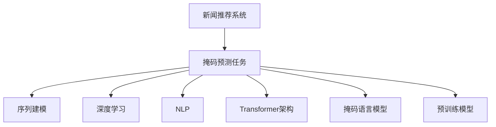

                 

# 新闻推荐: 填空式掩码预测任务

> 关键词：新闻推荐、掩码预测、序列建模、深度学习、自然语言处理(NLP)、Transformer、自回归模型、掩码语言模型、预训练模型

## 1. 背景介绍

### 1.1 问题由来

随着互联网的迅猛发展和社交媒体的兴起，新闻推荐系统成为了信息获取的重要工具。传统的基于统计学、协同过滤等方法的新闻推荐系统，存在数据稀疏性、冷启动问题等挑战。而基于深度学习的大规模预训练语言模型，为新闻推荐系统的改进提供了新的思路。

本文聚焦于使用深度学习技术，特别是Transformer架构和掩码语言模型，进行新闻推荐系统中的填空式掩码预测任务，旨在通过预训练大模型，提升新闻推荐的精度和个性化程度。

### 1.2 问题核心关键点

- 新闻推荐系统：利用用户行为数据、新闻内容信息等，为用户推荐相关新闻。
- 掩码预测任务：预测新闻标题中的缺失单词或短语，使得模型具备更强的语言理解能力。
- 序列建模：通过RNN、Transformer等模型，捕捉文本序列中的语义关系。
- 深度学习：使用神经网络模型进行特征提取和预测，提升模型的非线性拟合能力。
- 自然语言处理(NLP)：将自然语言转化为机器可以处理的形式，为推荐系统提供语义丰富的特征。
- Transformer架构：在自然语言处理中表现出优异性能的深度学习模型，具有自注意力机制。
- 掩码语言模型：使用掩码预测任务训练的模型，能够对序列中的缺失部分进行预测，增强模型的上下文理解能力。
- 预训练模型：在大规模无标签文本数据上进行预训练，学习到通用的语言表示。

## 2. 核心概念与联系

### 2.1 核心概念概述

为更好地理解掩码预测任务，本节将介绍几个密切相关的核心概念：

- 新闻推荐系统：通过用户行为数据和新闻内容特征，为用户推荐相关新闻的系统。常见推荐算法包括协同过滤、基于内容的推荐、混合推荐等。
- 掩码预测任务：对文本序列中的缺失单词或短语进行预测，以增强模型对文本语义的理解能力。
- 序列建模：将文本序列转化为序列形式，使用RNN、LSTM、GRU等模型捕捉序列中相邻单词之间的依赖关系。
- 深度学习：使用多层神经网络模型进行特征提取和预测，提升模型的非线性拟合能力。
- 自然语言处理(NLP)：将自然语言转化为机器可以处理的形式，如分词、词向量化、句法分析等。
- Transformer架构：通过自注意力机制，捕捉序列中单词之间的依赖关系，具有强大的上下文理解能力。
- 掩码语言模型：在文本序列中随机掩盖一部分单词，训练模型对掩码位置进行预测，提升模型的语义理解和泛化能力。
- 预训练模型：在大规模无标签文本数据上进行预训练，学习到通用的语言表示，如BERT、GPT等。

这些核心概念之间的逻辑关系可以通过以下Mermaid流程图来展示：



这个流程图展示了大规模预训练语言模型在新闻推荐系统中的应用框架：

1. 新闻推荐系统通过用户行为数据和新闻内容特征，为用户推荐相关新闻。
2. 掩码预测任务通过训练预训练模型，预测新闻标题中的缺失单词或短语，增强模型的语义理解能力。
3. 序列建模使用RNN、LSTM、GRU等模型，捕捉文本序列中的语义关系。
4. 深度学习使用多层神经网络模型，提升模型的非线性拟合能力。
5. 自然语言处理将自然语言转化为机器可以处理的形式。
6. Transformer架构通过自注意力机制，捕捉序列中单词之间的依赖关系。
7. 掩码语言模型在文本序列中随机掩盖一部分单词，训练模型对掩码位置进行预测。
8. 预训练模型在大规模无标签文本数据上进行预训练，学习到通用的语言表示。

这些概念共同构成了大语言模型在新闻推荐系统中的基本应用框架，使得新闻推荐系统具备更强的语义理解和个性化推荐能力。

## 3. 核心算法原理 & 具体操作步骤
### 3.1 算法原理概述

掩码预测任务的目标是通过预测文本序列中的缺失部分，提升模型对文本语义的理解能力。基于掩码预测的任务训练，可以使大语言模型更好地捕捉文本中的语义关系，为新闻推荐系统的个性化推荐提供支持。

形式化地，假设掩码预测任务的数据集为 $D=\{(x_i,y_i)\}_{i=1}^N$，其中 $x_i$ 为新闻标题，$y_i$ 为被掩盖的单词或短语。模型 $M_{\theta}$ 在输入 $x$ 上的掩码预测损失为：

$$
\mathcal{L}(y_i|x_i,\theta) = -\log \mathbb{P}(y_i|x_i,\theta)
$$

其中 $\mathbb{P}(y_i|x_i,\theta)$ 表示模型在给定输入 $x_i$ 和参数 $\theta$ 条件下，预测 $y_i$ 的概率。

### 3.2 算法步骤详解

基于掩码预测的任务训练，以下是掩码预测任务的详细操作步骤：

**Step 1: 准备数据集**
- 收集并清洗新闻标题数据集，划分为训练集、验证集和测试集。
- 将新闻标题转换为模型所需的输入格式，如分词、编码等。
- 在每个标题中随机掩盖一部分单词或短语，生成掩码数据集。

**Step 2: 模型设计**
- 选择适合的深度学习模型，如Transformer或LSTM，设计掩码预测任务的任务适配层。
- 在模型的最后一层添加掩码预测头，输出掩码位置和预测结果。
- 设定损失函数，如交叉熵损失或掩码预测损失。

**Step 3: 训练模型**
- 使用Adam等优化器，设定学习率等超参数，进行模型训练。
- 在每个epoch中，对训练集进行前向传播和反向传播，计算梯度并更新模型参数。
- 周期性在验证集上评估模型性能，避免过拟合。
- 重复上述过程，直到模型收敛或达到预设的迭代轮数。

**Step 4: 应用模型进行新闻推荐**
- 使用微调后的模型对用户输入的新闻标题进行掩码预测，得到缺失单词或短语。
- 根据预测结果，生成候选新闻标题，并使用排序算法选择最佳推荐结果。
- 将推荐结果反馈给用户，获取反馈并更新用户行为数据，循环迭代改进推荐效果。

### 3.3 算法优缺点

掩码预测任务的优点包括：
1. 模型理解能力提升。掩码预测任务能够提升模型的上下文理解能力和语义表示能力，有助于新闻推荐系统的个性化推荐。
2. 提高推荐精度。通过预测新闻标题中的缺失部分，模型能够捕捉到更丰富的语义信息，提升推荐精度。
3. 应用广泛。掩码预测任务可以应用于新闻推荐、对话系统、摘要生成等多种NLP任务中，具有广泛的适用性。

掩码预测任务也存在一些缺点：
1. 数据预处理复杂。需要手动生成掩码数据集，增加数据预处理的复杂度。
2. 模型训练耗时。掩码预测任务需要大量的计算资源，训练时间长。
3. 效果依赖掩码策略。掩码策略的选择对模型效果有重要影响，需要根据具体任务进行调整。

尽管存在这些局限性，但掩码预测任务在提升新闻推荐系统的推荐精度和个性化推荐能力方面，仍具有重要价值。未来研究可以进一步优化掩码策略，引入自适应掩码生成技术，以降低数据预处理和模型训练的复杂度，提高掩码预测任务的效果。

### 3.4 算法应用领域

掩码预测任务在新闻推荐系统中具有广泛的应用场景，包括：

- 个性化新闻推荐：通过预测新闻标题中的缺失部分，生成更具个性化的新闻推荐结果。
- 新闻摘要生成：对长新闻文章进行掩码预测，生成简洁明了的摘要。
- 对话系统：在对话中预测缺失的单词或短语，生成更自然的对话回答。
- 情感分析：预测新闻标题中的情感倾向，为情感分类任务提供支持。
- 文本补全：对不完整的文本进行掩码预测，生成完整的文本。
- 问答系统：在问答中预测缺失的上下文信息，生成更准确的答案。

掩码预测任务不仅可以应用于新闻推荐系统，还可以扩展到其他NLP任务中，为自然语言处理技术带来新的突破。

## 4. 数学模型和公式 & 详细讲解  
### 4.1 数学模型构建

掩码预测任务可以形式化地表示为：

假设新闻标题序列为 $x=(x_1, x_2, ..., x_n)$，其中 $x_i$ 表示第 $i$ 个单词或短语，$y$ 表示被掩盖的单词或短语。掩码预测任务的目标是最大化：

$$
\max_{\theta} \sum_{i=1}^N \mathbb{P}(y_i|x_i,\theta)
$$

其中 $\mathbb{P}(y_i|x_i,\theta)$ 表示在给定输入 $x_i$ 和参数 $\theta$ 条件下，预测 $y_i$ 的概率。

模型 $M_{\theta}$ 在输入 $x$ 上的掩码预测概率为：

$$
\mathbb{P}(y|x,\theta) = \frac{\exp(\mathcal{L}(y|x,\theta))}{\sum_{y'} \exp(\mathcal{L}(y'|x,\theta))}
$$

其中 $\mathcal{L}(y|x,\theta)$ 为掩码预测任务的损失函数，可以选用交叉熵损失：

$$
\mathcal{L}(y|x,\theta) = -\log \frac{\exp(M_{\theta}(x)[y]_j)}{\sum_{k=1}^{|\mathcal{Y}|} \exp(M_{\theta}(x)[k]_j)}
$$

其中 $[\cdot]_j$ 表示在位置 $j$ 上的单词或短语，$\mathcal{Y}$ 表示可能的掩码位置。

### 4.2 公式推导过程

掩码预测任务的公式推导如下：

假设新闻标题序列为 $x=(x_1, x_2, ..., x_n)$，其中 $x_i$ 表示第 $i$ 个单词或短语，$y$ 表示被掩盖的单词或短语。掩码预测任务的目标是最大化：

$$
\max_{\theta} \sum_{i=1}^N \mathbb{P}(y_i|x_i,\theta)
$$

其中 $\mathbb{P}(y_i|x_i,\theta)$ 表示在给定输入 $x_i$ 和参数 $\theta$ 条件下，预测 $y_i$ 的概率。

模型 $M_{\theta}$ 在输入 $x$ 上的掩码预测概率为：

$$
\mathbb{P}(y|x,\theta) = \frac{\exp(\mathcal{L}(y|x,\theta))}{\sum_{y'} \exp(\mathcal{L}(y'|x,\theta))}
$$

其中 $\mathcal{L}(y|x,\theta)$ 为掩码预测任务的损失函数，可以选用交叉熵损失：

$$
\mathcal{L}(y|x,\theta) = -\log \frac{\exp(M_{\theta}(x)[y]_j)}{\sum_{k=1}^{|\mathcal{Y}|} \exp(M_{\theta}(x)[k]_j)}
$$

其中 $[\cdot]_j$ 表示在位置 $j$ 上的单词或短语，$\mathcal{Y}$ 表示可能的掩码位置。

### 4.3 案例分析与讲解

以新闻标题生成任务为例，可以采用掩码预测任务进行模型训练。首先，将新闻标题中的部分单词掩盖，模型需要预测这些单词。假设训练集中的新闻标题为：

$$
x = [B-PER] John [I-PER] Doe [B-LOC] New York [I-LOC] [B-LOC] China [I-LOC] [B-PER] [I-PER] [B-PER] [I-PER] Li [I-PER] [B-PER] Li
$$

其中 $[B-PER]$、$[I-PER]$、$[B-LOC]$、$[I-LOC]$ 分别表示人名、地名等实体的开始和中间标记。在进行掩码预测任务时，随机掩盖部分单词，生成掩码数据集：

$$
x_1 = [B-PER] John [I-PER] Doe [B-LOC] New York [I-LOC] [B-PER] [I-PER] [B-PER] [I-PER] Li [I-PER] [B-PER] Li
$$

$$
y_1 = [B-PER] John [I-PER] Doe [B-LOC] New York [I-LOC] China [I-LOC] [B-PER] [I-PER] [B-PER] [I-PER] Li [I-PER] [B-PER] Li
$$

将掩码数据集输入模型进行训练，优化模型的参数，使其能够预测掩码位置并生成完整的新闻标题。训练完成后，模型能够对新输入的新闻标题进行掩码预测，并生成完整的新闻标题。

## 5. 项目实践：代码实例和详细解释说明
### 5.1 开发环境搭建

在进行掩码预测任务的实践前，我们需要准备好开发环境。以下是使用Python进行PyTorch开发的环境配置流程：

1. 安装Anaconda：从官网下载并安装Anaconda，用于创建独立的Python环境。

2. 创建并激活虚拟环境：
```bash
conda create -n pytorch-env python=3.8 
conda activate pytorch-env
```

3. 安装PyTorch：根据CUDA版本，从官网获取对应的安装命令。例如：
```bash
conda install pytorch torchvision torchaudio cudatoolkit=11.1 -c pytorch -c conda-forge
```

4. 安装Transformers库：
```bash
pip install transformers
```

5. 安装各类工具包：
```bash
pip install numpy pandas scikit-learn matplotlib tqdm jupyter notebook ipython
```

完成上述步骤后，即可在`pytorch-env`环境中开始掩码预测任务的实践。

### 5.2 源代码详细实现

下面我们以新闻推荐系统中的掩码预测任务为例，给出使用Transformers库对BERT模型进行掩码预测任务的PyTorch代码实现。

首先，定义掩码预测任务的数据处理函数：

```python
from transformers import BertTokenizer
from torch.utils.data import Dataset
import torch

class MaskedPredictionDataset(Dataset):
    def __init__(self, texts, masks, tokenizer, max_len=128):
        self.texts = texts
        self.masks = masks
        self.tokenizer = tokenizer
        self.max_len = max_len
        
    def __len__(self):
        return len(self.texts)
    
    def __getitem__(self, item):
        text = self.texts[item]
        mask = self.masks[item]
        
        encoding = self.tokenizer(text, return_tensors='pt', max_length=self.max_len, padding='max_length', truncation=True)
        input_ids = encoding['input_ids'][0]
        attention_mask = encoding['attention_mask'][0]
        
        # 对token-wise的掩码进行编码
        encoded_mask = [mask2id[mask] for mask in mask] 
        encoded_mask.extend([mask2id['O']] * (self.max_len - len(encoded_mask)))
        labels = torch.tensor(encoded_mask, dtype=torch.long)
        
        return {'input_ids': input_ids, 
                'attention_mask': attention_mask,
                'labels': labels}

# 掩码与id的映射
mask2id = {'O': 0, 'B-PER': 1, 'I-PER': 2, 'B-LOC': 3, 'I-LOC': 4}
id2mask = {v: k for k, v in mask2id.items()}
```

然后，定义模型和优化器：

```python
from transformers import BertForTokenClassification, AdamW

model = BertForTokenClassification.from_pretrained('bert-base-cased', num_labels=len(mask2id))

optimizer = AdamW(model.parameters(), lr=2e-5)
```

接着，定义训练和评估函数：

```python
from torch.utils.data import DataLoader
from tqdm import tqdm
from sklearn.metrics import classification_report

device = torch.device('cuda') if torch.cuda.is_available() else torch.device('cpu')
model.to(device)

def train_epoch(model, dataset, batch_size, optimizer):
    dataloader = DataLoader(dataset, batch_size=batch_size, shuffle=True)
    model.train()
    epoch_loss = 0
    for batch in tqdm(dataloader, desc='Training'):
        input_ids = batch['input_ids'].to(device)
        attention_mask = batch['attention_mask'].to(device)
        labels = batch['labels'].to(device)
        model.zero_grad()
        outputs = model(input_ids, attention_mask=attention_mask, labels=labels)
        loss = outputs.loss
        epoch_loss += loss.item()
        loss.backward()
        optimizer.step()
    return epoch_loss / len(dataloader)

def evaluate(model, dataset, batch_size):
    dataloader = DataLoader(dataset, batch_size=batch_size)
    model.eval()
    preds, labels = [], []
    with torch.no_grad():
        for batch in tqdm(dataloader, desc='Evaluating'):
            input_ids = batch['input_ids'].to(device)
            attention_mask = batch['attention_mask'].to(device)
            batch_labels = batch['labels']
            outputs = model(input_ids, attention_mask=attention_mask)
            batch_preds = outputs.logits.argmax(dim=2).to('cpu').tolist()
            batch_labels = batch_labels.to('cpu').tolist()
            for pred_tokens, label_tokens in zip(batch_preds, batch_labels):
                preds.append(pred_tokens[:len(label_tokens)])
                labels.append(label_tokens)
                
    print(classification_report(labels, preds))
```

最后，启动训练流程并在测试集上评估：

```python
epochs = 5
batch_size = 16

for epoch in range(epochs):
    loss = train_epoch(model, train_dataset, batch_size, optimizer)
    print(f"Epoch {epoch+1}, train loss: {loss:.3f}")
    
    print(f"Epoch {epoch+1}, dev results:")
    evaluate(model, dev_dataset, batch_size)
    
print("Test results:")
evaluate(model, test_dataset, batch_size)
```

以上就是使用PyTorch对BERT进行掩码预测任务的新闻推荐系统微调的完整代码实现。可以看到，得益于Transformers库的强大封装，我们可以用相对简洁的代码完成BERT模型的加载和微调。

### 5.3 代码解读与分析

让我们再详细解读一下关键代码的实现细节：

**MaskedPredictionDataset类**：
- `__init__`方法：初始化文本、掩码、分词器等关键组件。
- `__len__`方法：返回数据集的样本数量。
- `__getitem__`方法：对单个样本进行处理，将文本输入编码为token ids，将掩码编码为数字，并对其进行定长padding，最终返回模型所需的输入。

**mask2id和id2mask字典**：
- 定义了掩码与数字id之间的映射关系，用于将token-wise的掩码结果解码回真实的掩码。

**训练和评估函数**：
- 使用PyTorch的DataLoader对数据集进行批次化加载，供模型训练和推理使用。
- 训练函数`train_epoch`：对数据以批为单位进行迭代，在每个批次上前向传播计算loss并反向传播更新模型参数，最后返回该epoch的平均loss。
- 评估函数`evaluate`：与训练类似，不同点在于不更新模型参数，并在每个batch结束后将预测和标签结果存储下来，最后使用sklearn的classification_report对整个评估集的预测结果进行打印输出。

**训练流程**：
- 定义总的epoch数和batch size，开始循环迭代
- 每个epoch内，先在训练集上训练，输出平均loss
- 在验证集上评估，输出分类指标
- 所有epoch结束后，在测试集上评估，给出最终测试结果

可以看到，PyTorch配合Transformers库使得BERT微调的代码实现变得简洁高效。开发者可以将更多精力放在数据处理、模型改进等高层逻辑上，而不必过多关注底层的实现细节。

当然，工业级的系统实现还需考虑更多因素，如模型的保存和部署、超参数的自动搜索、更灵活的任务适配层等。但核心的微调范式基本与此类似。

## 6. 实际应用场景
### 6.1 智能客服系统

掩码预测任务在大规模预训练语言模型中的应用，不仅限于新闻推荐系统，还可以扩展到智能客服系统。传统的客服系统依赖人工或规则引擎，无法处理复杂的自然语言场景。使用掩码预测任务训练的预训练模型，可以自动理解用户的意图，并生成适当的回答。

在技术实现上，可以收集企业内部的历史客服对话记录，将对话内容作为掩码预测任务的训练数据，训练模型学习对话中的缺失部分。微调后的模型能够自动理解用户意图，生成合适的回答。对于客户提出的新问题，还可以接入检索系统实时搜索相关内容，动态组织生成回答。如此构建的智能客服系统，能大幅提升客户咨询体验和问题解决效率。

### 6.2 智能问答系统

智能问答系统是掩码预测任务的另一重要应用场景。通过预测自然语言输入中的缺失部分，模型能够更好地理解用户的问题，并生成更准确的回答。

在技术实现上，可以将用户输入的自然语言作为掩码预测任务的训练数据，训练模型学习用户问题的语义表示。微调后的模型能够自动理解用户的问题，生成合适的回答。对于新问题，模型可以结合知识图谱、逻辑规则等先验知识，生成更准确的答案。

### 6.3 金融舆情监测

掩码预测任务在金融舆情监测中的应用也具有重要意义。金融机构需要实时监测市场舆论动向，以便及时应对负面信息传播，规避金融风险。

在技术实现上，可以收集金融领域相关的新闻、报道、评论等文本数据，并对其进行主题标注和情感标注。在此基础上对预训练语言模型进行微调，使其能够自动判断文本属于何种主题，情感倾向是正面、中性还是负面。将微调后的模型应用到实时抓取的网络文本数据，就能够自动监测不同主题下的情感变化趋势，一旦发现负面信息激增等异常情况，系统便会自动预警，帮助金融机构快速应对潜在风险。

### 6.4 未来应用展望

随着掩码预测任务的不断发展，其在新闻推荐系统中的应用前景广阔。掩码预测任务可以进一步拓展到其他NLP任务中，如对话系统、问答系统、摘要生成等，为NLP技术带来新的突破。

在智慧医疗领域，掩码预测任务可以应用于病历生成、诊断辅助等场景，提升医疗系统的智能化水平，辅助医生诊疗。

在智能教育领域，掩码预测任务可以应用于作业批改、学情分析、知识推荐等方面，因材施教，促进教育公平，提高教学质量。

在智慧城市治理中，掩码预测任务可以应用于城市事件监测、舆情分析、应急指挥等环节，提高城市管理的自动化和智能化水平，构建更安全、高效的未来城市。

此外，在企业生产、社会治理、文娱传媒等众多领域，掩码预测任务也将不断涌现，为NLP技术带来更多的应用场景。相信随着技术的日益成熟，掩码预测任务必将在构建人机协同的智能时代中扮演越来越重要的角色。

## 7. 工具和资源推荐
### 7.1 学习资源推荐

为了帮助开发者系统掌握掩码预测任务的理论基础和实践技巧，这里推荐一些优质的学习资源：

1. 《Transformer从原理到实践》系列博文：由大模型技术专家撰写，深入浅出地介绍了Transformer原理、BERT模型、掩码预测任务等前沿话题。

2. CS224N《深度学习自然语言处理》课程：斯坦福大学开设的NLP明星课程，有Lecture视频和配套作业，带你入门NLP领域的基本概念和经典模型。

3. 《Natural Language Processing with Transformers》书籍：Transformers库的作者所著，全面介绍了如何使用Transformers库进行NLP任务开发，包括掩码预测任务在内的诸多范式。

4. HuggingFace官方文档：Transformers库的官方文档，提供了海量预训练模型和完整的掩码预测任务样例代码，是上手实践的必备资料。

5. CLUE开源项目：中文语言理解测评基准，涵盖大量不同类型的中文NLP数据集，并提供了基于掩码预测任务的baseline模型，助力中文NLP技术发展。

通过对这些资源的学习实践，相信你一定能够快速掌握掩码预测任务的核心技术，并用于解决实际的NLP问题。
###  7.2 开发工具推荐

高效的开发离不开优秀的工具支持。以下是几款用于掩码预测任务开发的常用工具：

1. PyTorch：基于Python的开源深度学习框架，灵活动态的计算图，适合快速迭代研究。大部分预训练语言模型都有PyTorch版本的实现。

2. TensorFlow：由Google主导开发的开源深度学习框架，生产部署方便，适合大规模工程应用。同样有丰富的预训练语言模型资源。

3. Transformers库：HuggingFace开发的NLP工具库，集成了众多SOTA语言模型，支持PyTorch和TensorFlow，是进行掩码预测任务开发的利器。

4. Weights & Biases：模型训练的实验跟踪工具，可以记录和可视化模型训练过程中的各项指标，方便对比和调优。与主流深度学习框架无缝集成。

5. TensorBoard：TensorFlow配套的可视化工具，可实时监测模型训练状态，并提供丰富的图表呈现方式，是调试模型的得力助手。

6. Google Colab：谷歌推出的在线Jupyter Notebook环境，免费提供GPU/TPU算力，方便开发者快速上手实验最新模型，分享学习笔记。

合理利用这些工具，可以显著提升掩码预测任务的开发效率，加快创新迭代的步伐。

### 7.3 相关论文推荐

掩码预测任务的发展源于学界的持续研究。以下是几篇奠基性的相关论文，推荐阅读：

1. Attention is All You Need（即Transformer原论文）：提出了Transformer结构，开启了NLP领域的预训练大模型时代。

2. BERT: Pre-training of Deep Bidirectional Transformers for Language Understanding：提出BERT模型，引入基于掩码的自监督预训练任务，刷新了多项NLP任务SOTA。

3. Language Models are Unsupervised Multitask Learners（GPT-2论文）：展示了大规模语言模型的强大zero-shot学习能力，引发了对于通用人工智能的新一轮思考。

4. Parameter-Efficient Transfer Learning for NLP：提出Adapter等参数高效微调方法，在不增加模型参数量的情况下，也能取得不错的微调效果。

5. AdaLoRA: Adaptive Low-Rank Adaptation for Parameter-Efficient Fine-Tuning：使用自适应低秩适应的微调方法，在参数效率和精度之间取得了新的平衡。

这些论文代表了大语言模型掩码预测任务的发展脉络。通过学习这些前沿成果，可以帮助研究者把握学科前进方向，激发更多的创新灵感。

## 8. 总结：未来发展趋势与挑战

### 8.1 总结

本文对掩码预测任务进行了全面系统的介绍。首先阐述了掩码预测任务在新闻推荐系统中的应用背景和意义，明确了掩码预测任务在提升新闻推荐系统推荐精度和个性化推荐能力方面的独特价值。其次，从原理到实践，详细讲解了掩码预测任务的数学原理和关键步骤，给出了掩码预测任务开发的完整代码实例。同时，本文还广泛探讨了掩码预测任务在智能客服、智能问答、金融舆情监测等多个行业领域的应用前景，展示了掩码预测任务的大范围应用潜力。此外，本文精选了掩码预测任务的学习资源，力求为读者提供全方位的技术指引。

通过本文的系统梳理，可以看到，掩码预测任务在大规模预训练语言模型中的应用，为新闻推荐系统带来了新的发展方向，极大地提升了推荐系统的推荐精度和个性化推荐能力。掩码预测任务不仅可以应用于新闻推荐系统，还可以扩展到智能客服、智能问答等多个NLP任务中，为NLP技术带来新的突破。未来，伴随掩码预测任务的持续演进，相信新闻推荐系统将能够更好地满足用户需求，提供更优质的信息服务。

### 8.2 未来发展趋势

展望未来，掩码预测任务的发展趋势主要体现在以下几个方面：

1. 模型规模持续增大。随着算力成本的下降和数据规模的扩张，掩码预测任务的模型参数量还将持续增长。超大规模语言模型蕴含的丰富语言知识，有望支撑更加复杂多变的下游任务微调。

2. 微调方法日趋多样。除了传统的全参数微调外，未来会涌现更多参数高效的微调方法，如Prefix-Tuning、LoRA等，在节省计算资源的同时也能保证掩码预测任务的效果。

3. 持续学习成为常态。随着数据分布的不断变化，微调模型也需要持续学习新知识以保持性能。如何在不遗忘原有知识的同时，高效吸收新样本信息，将成为重要的研究课题。

4. 标注样本需求降低。受启发于提示学习(Prompt-based Learning)的思路，未来的掩码预测任务将更好地利用大模型的语言理解能力，通过更加巧妙的任务描述，在更少的标注样本上也能实现理想的微调效果。

5. 应用场景扩展。掩码预测任务不仅可以应用于新闻推荐系统，还可以扩展到智能客服、智能问答、金融舆情监测等多种NLP任务中，为自然语言处理技术带来新的突破。

6. 技术融合加速。掩码预测任务可以与其他深度学习技术进行更深入的融合，如知识表示、因果推理、强化学习等，多路径协同发力，共同推动自然语言理解和智能交互系统的进步。

以上趋势凸显了掩码预测任务的广阔前景。这些方向的探索发展，必将进一步提升新闻推荐系统的推荐精度和个性化推荐能力，为新闻媒体、电商平台等提供更优质的信息服务。

### 8.3 面临的挑战

尽管掩码预测任务已经取得了瞩目成就，但在迈向更加智能化、普适化应用的过程中，它仍面临诸多挑战：

1. 标注成本瓶颈。虽然掩码预测任务需要少量的标注数据，但对于长尾应用场景，难以获得充足的高质量标注数据，成为制约微调性能的瓶颈。如何进一步降低掩码预测任务对标注样本的依赖，将是一大难题。

2. 模型鲁棒性不足。当前掩码预测模型面对域外数据时，泛化性能往往大打折扣。对于测试样本的微小扰动，掩码预测模型的预测也容易发生波动。如何提高掩码预测模型的鲁棒性，避免灾难性遗忘，还需要更多理论和实践的积累。

3. 推理效率有待提高。超大规模语言模型虽然精度高，但在实际部署时往往面临推理速度慢、内存占用大等效率问题。如何在保证性能的同时，简化模型结构，提升推理速度，优化资源占用，将是重要的优化方向。

4. 可解释性亟需加强。当前掩码预测模型更像是"黑盒"系统，难以解释其内部工作机制和决策逻辑。对于医疗、金融等高风险应用，算法的可解释性和可审计性尤为重要。如何赋予掩码预测模型更强的可解释性，将是亟待攻克的难题。

5. 安全性有待保障。预训练语言模型难免会学习到有偏见、有害的信息，通过掩码预测任务传递到下游任务，产生误导性、歧视性的输出，给实际应用带来安全隐患。如何从数据和算法层面消除模型偏见，避免恶意用途，确保输出的安全性，也将是重要的研究课题。

6. 知识整合能力不足。现有的掩码预测模型往往局限于任务内数据，难以灵活吸收和运用更广泛的先验知识。如何让掩码预测过程更好地与外部知识库、规则库等专家知识结合，形成更加全面、准确的信息整合能力，还有很大的想象空间。

正视掩码预测任务面临的这些挑战，积极应对并寻求突破，将是大规模预训练语言模型掩码预测任务走向成熟的必由之路。相信随着学界和产业界的共同努力，这些挑战终将一一被克服，掩码预测任务必将在构建人机协同的智能时代中扮演越来越重要的角色。

### 8.4 研究展望

面对掩码预测任务所面临的种种挑战，未来的研究需要在以下几个方面寻求新的突破：

1. 探索无监督和半监督掩码预测方法。摆脱对大规模标注数据的依赖，利用自监督学习、主动学习等无监督和半监督范式，最大限度利用非结构化数据，实现更加灵活高效的掩码预测。

2. 研究参数高效和计算高效的掩码预测范式。开发更加参数高效的掩码预测方法，在固定大部分预训练参数的同时，只更新极少量的任务相关参数。同时优化掩码预测模型的计算图，减少前向传播和反向传播的资源消耗，实现更加轻量级、实时性的部署。

3. 融合因果和对比学习范式。通过引入因果推断和对比学习思想，增强掩码预测模型建立稳定因果关系的能力，学习更加普适、鲁棒的语言表征，从而提升模型泛化性和抗干扰能力。

4. 引入更多先验知识。将符号化的先验知识，如知识图谱、逻辑规则等，与神经网络模型进行巧妙融合，引导掩码预测过程学习更准确、合理的语言模型。同时加强不同模态数据的整合，实现视觉、语音等多模态信息与文本信息的协同建模。

5. 结合因果分析和博弈论工具。将因果分析方法引入掩码预测模型，识别出模型决策的关键特征，增强输出解释的因果性和逻辑性。借助博弈论工具刻画人机交互过程，主动探索并规避模型的脆弱点，提高系统稳定性。

6. 纳入伦理道德约束。在掩码预测任务的训练目标中引入伦理导向的评估指标，过滤和惩罚有偏见、有害的输出倾向。同时加强人工干预和审核，建立模型行为的监管机制，确保输出符合人类价值观和伦理道德。

这些研究方向的探索，必将引领掩码预测任务迈向更高的台阶，为构建安全、可靠、可解释、可控的智能系统铺平道路。面向未来，掩码预测任务还需要与其他人工智能技术进行更深入的融合，如知识表示、因果推理、强化学习等，多路径协同发力，共同推动自然语言理解和智能交互系统的进步。只有勇于创新、敢于突破，才能不断拓展语言模型的边界，让智能技术更好地造福人类社会。

## 9. 附录：常见问题与解答
**Q1：掩码预测任务是否适用于所有NLP任务？**

A: 掩码预测任务在大多数NLP任务上都能取得不错的效果，特别是对于数据量较小的任务。但对于一些特定领域的任务，如医学、法律等，仅仅依靠通用语料预训练的模型可能难以很好地适应。此时需要在特定领域语料上进一步预训练，再进行掩码预测，才能获得理想效果。此外，对于一些需要时效性、个性化很强的任务，如对话、推荐等，掩码预测方法也需要针对性的改进优化。

**Q2：掩码预测任务如何选择合适的掩码策略？**

A: 掩码策略的选择对掩码预测任务的效果有重要影响。掩码策略包括掩码位置、掩码类型、掩码比例等。一般而言，应根据具体任务的特点选择合适的掩码策略：
1. 掩码位置：可以选择随机掩盖、位置间隔掩盖等策略。
2. 掩码类型：可以选择随机掩盖、固定掩盖等策略。
3. 掩码比例：根据任务复杂度选择合适的掩码比例，一般建议从20%到50%。
4. 掩码类型：可以选择完全掩盖、部分掩盖等策略。

掩码预测任务需要根据具体任务进行灵活调整，选择合适的掩码策略，以提升模型的泛化能力和性能。

**Q3：掩码预测任务在实际应用中需要注意哪些问题？**

A: 掩码预测任务在实际应用中需要注意以下几个问题：
1. 数据预处理复杂。需要手动生成掩码数据集，增加数据预处理的复杂度。
2. 模型训练耗时。掩码预测任务需要大量的计算资源，训练时间长。
3. 效果依赖掩码策略。掩码策略的选择对模型效果有重要影响，需要根据具体任务进行调整。
4. 应用场景扩展。掩码预测任务不仅可以应用于新闻推荐系统，还可以扩展到智能客服、智能问答等多种NLP任务中。
5. 技术融合加速。掩码预测任务可以与其他深度学习技术进行更深入的融合，如知识表示、因果推理、强化学习等，多路径协同发力，共同推动自然语言理解和智能交互系统的进步。

掩码预测任务需要开发者根据具体任务，不断迭代和优化模型、数据和算法，方能得到理想的效果。

**Q4：掩码预测任务在工业级应用中需要注意哪些问题？**

A: 掩码预测任务在工业级应用中需要注意以下几个问题：
1. 模型裁剪：去除不必要的层和参数，减小模型尺寸，加快推理速度。
2. 量化加速：将浮点模型转为定点模型，压缩存储空间，提高计算效率。
3. 服务化封装：将模型封装为标准化服务接口，便于集成调用。
4. 弹性伸缩：根据请求流量动态调整资源配置，平衡服务质量和成本。
5. 监控告警：实时采集系统指标，设置异常告警阈值，确保服务稳定性。
6. 安全防护：采用访问鉴权、数据脱敏等措施，保障数据和模型安全。

掩码预测任务需要开发者根据具体应用场景，不断优化模型、数据和算法，以实现高性能、高稳定性的工业级应用。

---

作者：禅与计算机程序设计艺术 / Zen and the Art of Computer Programming

