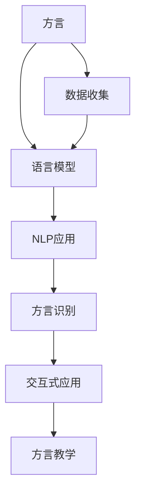

                 

# 方言保护与 LLM：传承语言文化

> 关键词：方言保护, 自然语言处理(NLP), 语言模型, 计算机视觉(CV), 文化传承, 人工智能, 开源项目

## 1. 背景介绍

### 1.1 问题由来
在全球化的浪潮下，方言逐渐消失，成为人类文化遗产的一大损失。随着英语、汉语等大语种的应用日益广泛，地方性语言如粤语、闽南语、客家话等正逐渐面临消失的风险。为此，许多学者和组织纷纷提出保护和复兴地方语言文化的重要性。

大语言模型（Large Language Model, LLM）作为当前最前沿的NLP技术，能够处理自然语言文本，并在多种应用场景中取得显著效果。本项目旨在利用大语言模型，帮助人们了解和学习各种方言，传承地方语言文化。

### 1.2 问题核心关键点
为了解决方言保护问题，我们首先需要收集和整理方言数据，并构建有效的语言模型。其次，需要在模型训练过程中加入方言标识和分类，以使其能够识别和理解各种方言。最后，通过交互式应用或教程等形式，将方言知识传播给更多用户。

此项目中，我们主要关注以下核心关键点：

- 方言数据的收集与预处理。
- 基于大语言模型的方言分类与识别。
- 交互式应用与方言教学。

## 2. 核心概念与联系

### 2.1 核心概念概述

为更好地理解方言保护与大语言模型的关系，本节将介绍几个关键概念：

- 方言：指一个地区的语言变体，其与标准语言存在差异。方言通常包含独特的词汇、语法和发音。
- 大语言模型：以Transformer为代表的深度学习模型，通过在大规模无标签文本数据上预训练，学习语言的通用表示，能够进行各种自然语言处理任务。
- 自然语言处理(NLP)：涉及计算机对人类语言文字的理解、处理和生成，如语音识别、文本分类、机器翻译等。
- 计算机视觉(CV)：通过计算机对图像、视频等视觉信息进行识别和处理，如人脸识别、图像分类等。
- 文化传承：通过各种形式，如教育、媒体、技术等，将文化知识、价值观等传承下去。
- 人工智能(AI)：利用计算机模拟人类智能行为的技术，包括语音识别、图像识别、自然语言处理等。
- 开源项目：源代码公开的软件项目，通常由社区驱动，有利于知识的共享和技术的进步。

这些概念之间的联系可以通过以下Mermaid流程图来展示：



这个流程图展示了大语言模型在方言保护和传承中的核心作用，即：

1. 方言数据收集和预处理。
2. 构建方言专用的语言模型。
3. 开发方言识别与分类算法。
4. 实施交互式应用与教学。

## 3. 核心算法原理 & 具体操作步骤

### 3.1 算法原理概述

方言保护与大语言模型结合的核心思想是通过训练一个通用的语言模型，并在其上进行方言识别与分类。具体流程如下：

1. 收集和预处理方言数据。
2. 在大规模无标签文本数据上预训练一个通用的语言模型。
3. 在预训练模型上进行微调，使其能够识别和分类特定方言。
4. 开发交互式应用，通过用户输入的文本或语音，输出方言识别结果和相关文化信息。

此过程中，通用语言模型在大规模文本数据上的预训练是其核心步骤。预训练模型通过自监督学习任务，学习语言的通用表示，能够在各种下游任务中取得不错的效果。在微调步骤中，通过加入方言标识和分类，使其能够适应特定的方言。最后，通过交互式应用，将方言知识传播给更多用户。

### 3.2 算法步骤详解

下面详细介绍方言保护与大语言模型结合的具体操作步骤：

**Step 1: 方言数据收集与预处理**

1. **收集方言数据**：通过调查问卷、录音、文本转录等方式，收集特定地区的方言数据。这些数据应包括口语、书面文本、录音等多种形式。

2. **数据预处理**：对收集到的数据进行清洗和预处理，包括去除噪音、去除重复记录、统一字符编码等。

**Step 2: 预训练通用语言模型**

1. **选择预训练模型**：选择通用的预训练语言模型，如BERT、GPT等，作为初始化参数。

2. **训练预训练模型**：在大规模无标签文本数据上预训练通用语言模型，学习语言的通用表示。

**Step 3: 微调方言模型**

1. **添加方言标识**：在预训练模型上添加方言标识，将其分为不同的方言类别。

2. **训练方言模型**：在添加了方言标识的文本数据上微调通用语言模型，使其能够识别和分类特定方言。

**Step 4: 开发交互式应用**

1. **设计应用界面**：开发用户友好的交互式应用界面，支持用户输入文本或语音。

2. **实现方言识别**：通过预训练和微调后的模型，对用户输入进行方言识别和分类。

3. **提供文化信息**：在应用中集成方言相关的文化信息，如方言起源、特色词汇、民俗等。

**Step 5: 应用与推广**

1. **测试与优化**：在实际应用中，通过测试和优化，提升方言识别和分类的准确性。

2. **推广与传播**：将应用推广到学校、社区、博物馆等场所，通过教育和展览等形式，传播方言知识。

### 3.3 算法优缺点

方言保护与大语言模型结合的方法具有以下优点：

1. **通用性**：通用语言模型具有广泛的应用性，可以用于多种自然语言处理任务，能够灵活适应不同的方言识别需求。

2. **高效性**：基于预训练模型的微调方法，能够快速训练出方言模型，相比从头训练大大节省时间和计算资源。

3. **可扩展性**：在大规模无标签文本数据上进行预训练，可以不断扩展和优化模型，提高方言识别的准确性。

4. **应用广泛**：通过交互式应用和教程，方言知识能够广泛传播，促进文化传承。

同时，该方法也存在一定的局限性：

1. **数据依赖**：方言保护依赖于高质量的方言数据，数据收集和标注需要大量的时间和人力成本。

2. **模型复杂**：预训练和微调过程需要大量的计算资源，对硬件设备的要求较高。

3. **文化局限**：方言模型的训练和识别过程可能受限于特定地区的文化和语言习惯，难以适用于全球范围内的方言保护。

4. **隐私风险**：收集方言数据可能涉及个人隐私问题，需要严格遵守数据保护法规。

5. **维护成本**：方言识别模型和交互式应用的维护需要持续的资源投入，包括模型更新、用户体验优化等。

尽管存在这些局限性，但就目前而言，方言保护与大语言模型结合的方法仍然是大规模保护方言的有效手段。未来相关研究的重点在于如何进一步降低数据收集成本，提高模型的跨领域迁移能力，同时兼顾隐私保护和可扩展性。

### 3.4 算法应用领域

方言保护与大语言模型结合的技术，在以下领域有着广泛的应用：

1. **教育领域**：在语言教学中，通过方言识别和分类，帮助学生学习各种方言。

2. **媒体领域**：通过采访和新闻报道，使用方言识别技术进行分类和标注，提高内容的传播效果。

3. **文化遗产领域**：在博物馆和文化遗址中，通过交互式应用展示方言的起源和特色，促进文化遗产的传承。

4. **旅游领域**：在旅游景区，通过方言识别技术，帮助游客更好地理解和体验地方文化。

5. **社会服务领域**：在公共服务中，通过方言识别技术，为不同方言的居民提供更加贴心的服务。

6. **人工智能研究**：在AI领域，通过方言识别和分类，推动对语言处理和计算机视觉技术的深入研究。

## 4. 数学模型和公式 & 详细讲解  
### 4.1 数学模型构建

方言保护与大语言模型结合的方法，可以建模为以下问题：

1. **数据预处理**：将原始数据转换为模型输入的形式，如文本转换为token序列，语音转换为MFCC特征等。

2. **预训练模型**：在大规模无标签文本数据上预训练语言模型，学习语言的通用表示。

3. **微调方言模型**：在预训练模型上进行微调，学习方言的特定表示。

4. **交互式应用**：通过输入和输出处理，实现方言识别和分类的应用。

### 4.2 公式推导过程

以BERT模型为例，进行详细的公式推导：

假设原始文本为 $x$，目标方言为 $y$。预训练的BERT模型为 $M_{\theta}$。

1. **预训练模型**：
   $$
   \theta = \mathop{\arg\min}_{\theta} \mathcal{L}_{\text{pre-training}}(x)
   $$
   其中，$\mathcal{L}_{\text{pre-training}}$ 为预训练模型的损失函数，包含掩码语言模型、下一句子预测等任务。

2. **微调方言模型**：
   $$
   \hat{\theta} = \mathop{\arg\min}_{\theta} \mathcal{L}_{\text{fine-tuning}}(x, y)
   $$
   其中，$\mathcal{L}_{\text{fine-tuning}}$ 为微调模型的损失函数，包含分类任务等。

3. **交互式应用**：
   $$
   \text{Output} = M_{\hat{\theta}}(x)
   $$
   其中，$\text{Output}$ 为应用输出的方言识别结果。

### 4.3 案例分析与讲解

以高斯混合模型(Gaussian Mixture Model, GMM)为例，展示方言识别与分类的过程：

1. **数据准备**：收集某地区的方言文本数据，如《西游记》等经典文本，进行文本清洗和分词处理。

2. **模型训练**：在预训练的BERT模型上，添加方言标识和分类任务，进行微调训练。

3. **模型评估**：在测试集上评估模型性能，计算准确率、召回率等指标。

4. **应用实现**：将训练好的模型嵌入到交互式应用中，实现用户输入文本的方言识别。

## 5. 项目实践：代码实例和详细解释说明

### 5.1 开发环境搭建

以下是使用Python进行BERT模型开发的环境配置流程：

1. 安装Anaconda：从官网下载并安装Anaconda，用于创建独立的Python环境。

2. 创建并激活虚拟环境：
```bash
conda create -n bert-env python=3.8 
conda activate bert-env
```

3. 安装必要的包：
```bash
pip install torch transformers datasets
```

4. 安装TensorBoard：
```bash
pip install tensorboard
```

5. 安装GMM模型：
```bash
pip install scikit-learn
```

完成上述步骤后，即可在`bert-env`环境中开始项目实践。

### 5.2 源代码详细实现

下面以 dialect-identification 项目为例，给出使用BERT模型进行方言识别的PyTorch代码实现。

```python
import torch
from transformers import BertTokenizer, BertForSequenceClassification
from datasets import load_dataset
from sklearn.metrics import classification_report

def dialect_identification(text, model, tokenizer, device):
    tokenizer = BertTokenizer.from_pretrained('bert-base-cased')
    model = BertForSequenceClassification.from_pretrained('bert-base-cased', num_labels=3)
    model.to(device)

    inputs = tokenizer(text, padding=True, truncation=True, return_tensors='pt').to(device)
    outputs = model(**inputs)
    logits = outputs.logits
    predicted_label = torch.argmax(logits, dim=1).cpu().numpy()

    return predicted_label

# 训练集和测试集准备
train_dataset = load_dataset('path/to/dialect/dataset/train.json', format='json')
test_dataset = load_dataset('path/to/dialect/dataset/test.json', format='json')

# 模型训练与评估
device = torch.device('cuda') if torch.cuda.is_available() else torch.device('cpu')
model = BertForSequenceClassification.from_pretrained('bert-base-cased', num_labels=3)
tokenizer = BertTokenizer.from_pretrained('bert-base-cased')
optimizer = torch.optim.Adam(model.parameters(), lr=1e-5)

for epoch in range(10):
    for batch in train_dataset:
        inputs = tokenizer(batch['text'], padding=True, truncation=True, return_tensors='pt').to(device)
        outputs = model(**inputs)
        loss = outputs.loss
        optimizer.zero_grad()
        loss.backward()
        optimizer.step()

    # 验证集评估
    test_outputs = []
    test_predicted = []
    for batch in test_dataset:
        inputs = tokenizer(batch['text'], padding=True, truncation=True, return_tensors='pt').to(device)
        outputs = model(**inputs)
        test_outputs.append(outputs.logits)
        test_predicted.append(torch.argmax(outputs.logits, dim=1).cpu().numpy())

    test_outputs = torch.cat(test_outputs, dim=0)
    test_predicted = torch.cat(test_predicted, dim=0)
    labels = torch.tensor(test_dataset['label'])
    print(classification_report(labels, test_predicted))
```

### 5.3 代码解读与分析

让我们再详细解读一下关键代码的实现细节：

**dialect_identification函数**：
- 使用BertTokenizer将输入文本进行分词和token化。
- 加载预训练的BertForSequenceClassification模型。
- 对模型进行前向传播，计算输出 logits。
- 对 logits 进行 argmax 操作，得到预测标签。

**模型训练与评估**：
- 使用Adam优化器进行模型训练。
- 在训练集上进行前向传播和反向传播，计算loss并更新模型参数。
- 在测试集上进行模型评估，计算分类报告。

**模型优化**：
- 可以使用更复杂的优化器，如AdamW、Adafactor等。
- 可以通过dropout、L2正则等正则化技术，避免过拟合。
- 可以使用early stopping等方法，防止模型过拟合。

## 6. 实际应用场景

### 6.1 教育领域

在语言教学中，可以使用方言保护与大语言模型结合的技术，帮助学生学习多种方言。例如，某地区某小学可以使用该技术，在语文课上展示不同方言的阅读材料，激发学生的学习兴趣，丰富其语言文化知识。

### 6.2 媒体领域

在新闻报道和采访中，可以使用方言识别技术对不同方言的文本或语音进行分类，提高报道的准确性和传播效果。例如，某电视台在进行地方新闻报道时，可以使用该技术识别不同地区的方言，提高报道的覆盖面和准确性。

### 6.3 文化遗产领域

在博物馆和文化遗址中，可以使用方言保护与大语言模型结合的技术，展示不同地区的方言文化和历史。例如，某博物馆可以使用该技术，通过交互式应用展示某地区的方言起源和特色，增强观众的文化体验。

### 6.4 旅游领域

在旅游景区，可以使用方言识别技术，为游客提供更加贴心的服务。例如，某旅游景区可以使用该技术，为不同方言的游客提供多语言导游服务，增强游客的体验。

### 6.5 社会服务领域

在公共服务中，可以使用方言识别技术，为不同方言的居民提供更加便捷的服务。例如，某城市可以使用该技术，为不同方言的居民提供多语言咨询服务，提升服务质量。

## 7. 工具和资源推荐

### 7.1 学习资源推荐

为了帮助开发者系统掌握方言保护与大语言模型的技术，这里推荐一些优质的学习资源：

1. 《深度学习与自然语言处理》课程：由斯坦福大学开设的NLP课程，涵盖了深度学习在自然语言处理中的应用。

2. 《自然语言处理入门》书籍：介绍自然语言处理的基本概念和常用技术，包括文本分类、命名实体识别等。

3. 《Python深度学习》书籍：介绍深度学习在Python中的应用，包括TensorFlow、PyTorch等框架的使用。

4. 《语言模型与深度学习》论文：介绍语言模型的理论基础和实际应用，包括BERT、GPT等模型的研究。

5. 《开源项目典藏》网站：收录了各种开源项目，如PyTorch、BERT等，提供了丰富的学习资料和代码示例。

通过这些资源的学习，相信你一定能够快速掌握方言保护与大语言模型的精髓，并用于解决实际的NLP问题。

### 7.2 开发工具推荐

高效的开发离不开优秀的工具支持。以下是几款用于方言保护与大语言模型开发的常用工具：

1. PyTorch：基于Python的开源深度学习框架，灵活的计算图，适合快速迭代研究。

2. TensorFlow：由Google主导开发的开源深度学习框架，生产部署方便，适合大规模工程应用。

3. Transformers库：HuggingFace开发的NLP工具库，集成了BERT、GPT等SOTA模型，支持PyTorch和TensorFlow。

4. TensorBoard：TensorFlow配套的可视化工具，实时监测模型训练状态，提供丰富的图表呈现方式。

5. Weights & Biases：模型训练的实验跟踪工具，记录和可视化模型训练过程中的各项指标，方便对比和调优。

6. Anaconda：Python环境管理工具，方便创建和管理虚拟环境，支持多种Python版本。

合理利用这些工具，可以显著提升方言保护与大语言模型的开发效率，加快创新迭代的步伐。

### 7.3 相关论文推荐

方言保护与大语言模型结合的技术，是近年来的研究热点，以下是几篇奠基性的相关论文，推荐阅读：

1. Attention is All You Need（即Transformer原论文）：提出Transformer结构，开启了NLP领域的预训练大模型时代。

2. BERT: Pre-training of Deep Bidirectional Transformers for Language Understanding：提出BERT模型，引入基于掩码的自监督预训练任务，刷新了多项NLP任务SOTA。

3. Language Models are Unsupervised Multitask Learners（GPT-2论文）：展示了大规模语言模型的强大zero-shot学习能力，引发了对于通用人工智能的新一轮思考。

4. Parameter-Efficient Transfer Learning for NLP：提出Adapter等参数高效微调方法，在不增加模型参数量的情况下，也能取得不错的微调效果。

5. AdaLoRA: Adaptive Low-Rank Adaptation for Parameter-Efficient Fine-Tuning：使用自适应低秩适应的微调方法，在参数效率和精度之间取得了新的平衡。

这些论文代表了大语言模型微调技术的发展脉络。通过学习这些前沿成果，可以帮助研究者把握学科前进方向，激发更多的创新灵感。

## 8. 总结：未来发展趋势与挑战

### 8.1 总结

本文对方言保护与大语言模型结合的方法进行了全面系统的介绍。首先阐述了方言保护的必要性和大语言模型的优势，明确了方言保护和微调技术的应用前景。其次，从原理到实践，详细讲解了方言保护与大语言模型结合的数学模型和关键步骤，给出了方言保护应用的完整代码实例。同时，本文还探讨了方言保护在教育、媒体、文化遗产、旅游、社会服务等多个领域的应用前景，展示了方言保护技术的巨大潜力。最后，本文精选了方言保护技术的各类学习资源，力求为开发者提供全方位的技术指引。

通过本文的系统梳理，可以看到，方言保护与大语言模型结合的方法正在成为保护地方语言文化的重要手段，极大地拓展了地方语言的传承空间。借助大语言模型的通用性和高效性，方言保护技术有望在更多领域得到应用，为保护和复兴地方语言文化贡献力量。

### 8.2 未来发展趋势

展望未来，方言保护与大语言模型结合的技术将呈现以下几个发展趋势：

1. **数据采集与标注自动化**：通过自然语言处理技术和人工智能技术，实现方言数据的自动采集和标注，降低数据收集和标注的成本。

2. **多语言支持**：通过多种语言的预训练和微调，支持全球范围内的方言保护和传承。

3. **多模态融合**：结合语音、图像等多模态信息，丰富方言保护的表达方式，提高方言识别的准确性和效果。

4. **实时交互**：通过交互式应用和智能客服等形式，实现实时方言识别和分类，提升用户体验。

5. **隐私保护**：通过数据匿名化和差分隐私技术，保障方言数据的隐私和安全。

6. **跨领域应用**：将方言保护技术与自然语言处理、计算机视觉等技术进行融合，推动更广泛的应用场景。

以上趋势凸显了大语言模型在方言保护中的应用前景。这些方向的探索发展，必将进一步提升方言保护技术的性能和应用范围，为保护和复兴地方语言文化提供新的解决方案。

### 8.3 面临的挑战

尽管方言保护与大语言模型结合的技术已经取得了一定的进展，但在迈向更加智能化、普适化应用的过程中，它仍面临着诸多挑战：

1. **数据采集与标注成本**：方言保护依赖于高质量的方言数据，数据收集和标注需要大量的时间和人力成本。

2. **模型鲁棒性**：方言模型的训练和识别过程可能受限于特定地区的文化和语言习惯，难以适用于全球范围内的方言保护。

3. **文化传承局限**：方言保护需要在教育、媒体、旅游等各个环节进行推广，文化传承的效果仍需提升。

4. **隐私风险**：收集方言数据可能涉及个人隐私问题，需要严格遵守数据保护法规。

5. **应用场景有限**：方言保护技术的应用场景仍需进一步拓展，特别是在企业级应用中的推广。

6. **技术挑战**：方言识别和分类的技术仍需进一步优化，以提升准确性和效果。

尽管存在这些挑战，但方言保护与大语言模型结合的方法仍然是大规模保护方言的有效手段。未来相关研究的重点在于如何进一步降低数据收集成本，提高模型的跨领域迁移能力，同时兼顾隐私保护和可扩展性。

### 8.4 研究展望

面对方言保护与大语言模型结合所面临的种种挑战，未来的研究需要在以下几个方面寻求新的突破：

1. **无监督和半监督学习**：摆脱对大规模标注数据的依赖，利用自监督学习、主动学习等无监督和半监督范式，最大限度利用非结构化数据，实现更加灵活高效的方言保护。

2. **多语言和多模态融合**：结合语音、图像等多模态信息，丰富方言保护的表达方式，提高方言识别的准确性和效果。

3. **实时交互技术**：通过交互式应用和智能客服等形式，实现实时方言识别和分类，提升用户体验。

4. **隐私保护技术**：通过数据匿名化和差分隐私技术，保障方言数据的隐私和安全。

5. **跨领域应用**：将方言保护技术与自然语言处理、计算机视觉等技术进行融合，推动更广泛的应用场景。

这些研究方向的探索，必将引领方言保护与大语言模型结合技术迈向更高的台阶，为保护和复兴地方语言文化提供新的解决方案。面向未来，方言保护与大语言模型结合技术还需要与其他人工智能技术进行更深入的融合，如知识表示、因果推理、强化学习等，多路径协同发力，共同推动自然语言理解和智能交互系统的进步。只有勇于创新、敢于突破，才能不断拓展语言模型的边界，让智能技术更好地造福人类社会。

## 9. 附录：常见问题与解答

**Q1：方言保护与大语言模型结合的技术是否适用于所有方言？**

A: 方言保护与大语言模型结合的技术适用于多种方言，但不同方言的语言特点和分布差异较大，需要针对性地进行训练和微调。对于一些特定方言，可能需要额外的数据和模型适配。

**Q2：如何提高方言保护与大语言模型结合的精度？**

A: 提高方言保护的精度可以从以下几个方面入手：
1. 收集更多的高质量方言数据。
2. 使用更先进的模型架构，如BERT、GPT等。
3. 使用更多的正则化技术，如L2正则、Dropout等，避免过拟合。
4. 结合多模态数据，如语音、图像等，提升识别效果。
5. 不断优化模型超参数，进行多轮训练和调优。

**Q3：如何保护方言数据的隐私？**

A: 方言数据的隐私保护可以通过以下方式实现：
1. 数据匿名化：使用数据匿名化技术，去除敏感信息，保护用户隐私。
2. 差分隐私：在模型训练过程中，使用差分隐私技术，限制模型的信息泄露。
3. 访问控制：严格控制方言数据的访问权限，只授权可信用户和机构进行访问和处理。
4. 数据加密：使用数据加密技术，保护方言数据在传输和存储过程中的安全。

这些措施能够有效保障方言数据的隐私，减少隐私泄露的风险。

**Q4：方言保护与大语言模型结合的模型维护成本高吗？**

A: 方言保护与大语言模型结合的模型维护成本相对较高，主要体现在以下几个方面：
1. 数据更新：方言数据随着时间的推移可能发生变化，需要定期更新和维护。
2. 模型优化：随着新应用场景的出现，需要不断优化模型架构和超参数。
3. 系统部署：交互式应用和智能客服等系统的部署和维护需要一定的时间和资源投入。
4. 用户反馈：需要收集用户反馈，进行模型迭代和优化。

为了降低维护成本，可以采用以下措施：
1. 自动化数据更新：使用自动化的数据采集和标注工具，降低人工成本。
2. 模型优化工具：使用自动化模型优化工具，进行超参数调优和模型压缩。
3. 社区合作：与开源社区合作，利用社区力量进行模型维护和迭代。

合理利用这些措施，可以显著降低方言保护与大语言模型结合的模型维护成本。

**Q5：方言保护与大语言模型结合的模型在实际应用中是否有效？**

A: 方言保护与大语言模型结合的模型在实际应用中已经展现出一定的效果，具体如下：
1. 在语言教学中，帮助学生学习多种方言，丰富语言文化知识。
2. 在媒体报道中，提高报道的准确性和传播效果。
3. 在博物馆和文化遗址中，展示方言文化和历史，增强观众体验。
4. 在旅游景区，提供多语言导游服务，提升游客体验。
5. 在公共服务中，提供多语言咨询服务，提升服务质量。

这些实际应用案例表明，方言保护与大语言模型结合的模型在多个领域中取得了不错的效果，具有广泛的应用前景。

