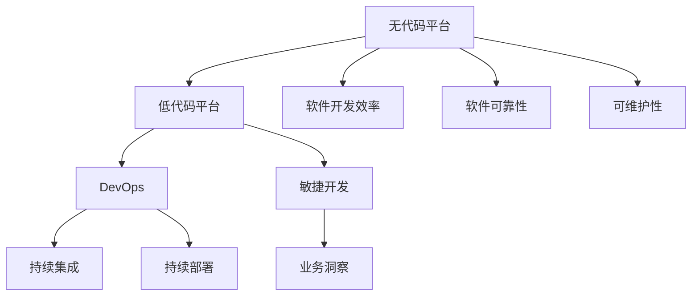

                 

# 无代码/低代码平台开发：趋势与挑战

> 关键词：无代码平台, 低代码平台, 软件开发效率, DevOps, 自动化部署, 软件生命周期, 软件可靠性, 可维护性

## 1. 背景介绍

### 1.1 问题由来
在当今快速变化的数字化时代，企业面临着前所未有的竞争压力。如何快速构建、部署和管理软件系统，成为企业数字化转型的核心挑战。传统软件开发模式，包括手动编写代码、构建和部署等环节，往往耗时耗力，且难以应对快速迭代的市场需求。无代码/低代码平台作为新一代的软件开发工具，提供了一种简单高效、灵活便捷的开发解决方案，近年来受到了广泛关注和应用。

无代码/低代码平台（Low-Code/No-Code Platforms）是指通过可视化编程界面和拖放式组件构建应用，开发者无需编写代码即可快速开发和部署软件系统。这种平台通常集成了多种组件、模板和插件，简化了开发流程，加速了软件交付，降低了开发门槛。

### 1.2 问题核心关键点
无代码/低代码平台的核心价值在于：

1. **提高开发效率**：减少手动编码工作量，加快开发速度。
2. **降低开发门槛**：无需深厚编程经验，即可上手开发。
3. **增强软件可维护性**：自动化部署和更新，降低维护成本。
4. **促进敏捷开发**：快速迭代、持续交付，适应市场变化。
5. **提升业务洞察**：通过数据可视化，增强业务洞察和决策能力。

无代码/低代码平台已经在金融、医疗、电商等多个行业得到应用，推动了数字化转型的进程。然而，无代码/低代码平台的发展仍面临诸多挑战，如平台通用性不足、开发者适配难度、应用生态不完善等。本文将深入探讨无代码/低代码平台的现状、趋势及面临的挑战，为开发者和企业提供全面的参考。

## 2. 核心概念与联系

### 2.1 核心概念概述

为更好地理解无代码/低代码平台，本节将介绍几个密切相关的核心概念：

- **无代码平台（No-Code Platforms）**：完全无需编写代码即可构建软件应用的开发平台。用户通过可视化界面拖放组件，实现业务逻辑和数据处理。
- **低代码平台（Low-Code Platforms）**：需要少量编程，但通过可视化的构建方式，显著简化开发流程，提高开发效率。开发者通常只处理数据模型、业务逻辑等核心模块。
- **DevOps**：开发（Development）和运维（Operations）的结合，强调持续集成（CI）和持续部署（CD），提升软件交付效率和质量。
- **软件生命周期（Software Development Lifecycle）**：包括需求分析、设计、实现、测试、部署、维护等阶段，覆盖软件开发的各个环节。
- **软件可靠性（Software Reliability）**：软件系统的稳定性和鲁棒性，通过自动化测试和部署保障。
- **可维护性（Maintainability）**：软件系统的易用性和易修改性，简化维护和升级过程。

这些概念之间的逻辑关系可以通过以下Mermaid流程图来展示：



这个流程图展示而无代码/低代码平台的核心概念及其之间的关系：

1. 无代码平台和低代码平台作为新一代开发工具，通过提高开发效率和降低开发门槛，简化了软件开发流程。
2. DevOps作为自动化流程的实践，强调持续集成和持续部署，提升了软件交付速度和质量。
3. 软件生命周期、软件可靠性、可维护性等概念，则是软件开发和运维过程中需要重点关注的关键指标。
4. 低代码/无代码平台与DevOps、敏捷开发、业务洞察等概念紧密相关，共同构建高效的软件生态系统。

这些核心概念共同构成了无代码/低代码平台的基础，为其在实际应用中提供了坚实的理论支撑。

## 3. 核心算法原理 & 具体操作步骤
### 3.1 算法原理概述

无代码/低代码平台的开发原理，主要基于可视化编程和组件化构建。用户通过拖拽组件和配置参数，完成业务逻辑的构建。平台自动生成代码，并提供完整的软件部署流程。

无代码/低代码平台的核心算法包括：

1. **可视化编程**：将复杂的软件构建过程简化为拖拽式操作，开发者无需手动编写代码，即可构建完整的软件应用。
2. **组件化构建**：平台提供丰富的预定义组件，如表单、按钮、报表等，开发者只需选择并配置，即可完成常用功能的实现。
3. **自动化部署**：平台自动生成代码，并支持一键部署，简化软件开发和运维流程。

### 3.2 算法步骤详解

无代码/低代码平台的开发步骤主要包括以下几个环节：

1. **需求分析和设计**：收集业务需求，明确系统功能和数据模型。
2. **构建和配置**：通过可视化界面拖拽组件，配置数据模型和业务逻辑。
3. **代码生成和测试**：平台自动生成代码，并提供单元测试和集成测试，确保代码质量。
4. **部署和上线**：通过一键部署功能，将应用发布到生产环境。
5. **运维和更新**：平台提供自动化运维工具，监控系统状态，管理应用更新。

### 3.3 算法优缺点

无代码/低代码平台具备以下优点：

1. **开发效率高**：通过拖拽式操作和组件化构建，显著缩短开发周期。
2. **开发门槛低**：无需深厚的编程技能，即可快速上手。
3. **维护成本低**：自动化部署和更新，减少人工干预，降低维护成本。
4. **灵活性强**：组件化设计，便于快速迭代和调整。

但无代码/低代码平台也存在一些缺点：

1. **功能受限**：平台提供的组件和功能有限，无法覆盖所有业务需求。
2. **学习曲线长**：掌握平台的高级功能和最佳实践需要一定时间。
3. **性能问题**：生成的代码质量和性能可能不如手写的代码。
4. **依赖平台**：平台兼容性、稳定性和扩展性可能存在问题。

### 3.4 算法应用领域

无代码/低代码平台已经在多个领域得到应用，主要包括：

1. **客户关系管理（CRM）**：通过可视化界面构建CRM系统，简化客户管理流程。
2. **业务流程自动化（BPA）**：自动化业务流程，提升工作效率。
3. **数据可视化（BI）**：通过拖拽组件创建报表和仪表盘，增强业务洞察。
4. **移动应用开发**：通过低代码平台快速构建移动应用，满足移动端业务需求。
5. **物联网（IoT）**：无代码/低代码平台支持物联网设备管理，实现设备监控和控制。
6. **企业管理系统（ERP）**：简化ERP系统的搭建和管理，提升企业运营效率。

这些应用领域展示了无代码/低代码平台的多样性和实用性，为企业提供了灵活的软件开发解决方案。

## 4. 数学模型和公式 & 详细讲解 & 举例说明

### 4.1 数学模型构建

无代码/低代码平台的开发过程，可以通过数学模型进行描述。以下是一个简单的数学模型构建示例：

假设开发一个客户管理应用，平台提供以下组件：

- 表格组件：用于存储客户信息。
- 表单组件：用于客户信息录入。
- 报表组件：用于生成客户统计报表。

用户通过拖拽这些组件，构建客户管理应用。数学模型可以表示为：

1. **组件选择**：选择表格和表单组件，配置属性（如列名、数据类型）。
2. **数据关联**：将表单组件与表格组件关联，建立数据流。
3. **报表生成**：将表格组件和报表组件关联，生成报表数据。

### 4.2 公式推导过程

根据上述模型，可以推导出以下公式：

1. **组件选择公式**：
   $$
   C_{selected} = C_{available} - C_{filtered}
   $$
   其中 $C_{selected}$ 为被选择的组件，$C_{available}$ 为可用的组件，$C_{filtered}$ 为被过滤掉的组件。

2. **数据关联公式**：
   $$
   D_{related} = D_{source} \otimes D_{destination}
   $$
   其中 $D_{related}$ 为关联的数据，$D_{source}$ 为数据源，$D_{destination}$ 为数据目的地。

3. **报表生成公式**：
   $$
   R_{generated} = T_{table} \oplus T_{report}
   $$
   其中 $R_{generated}$ 为生成的报表，$T_{table}$ 为表格数据，$T_{report}$ 为报表模板。

### 4.3 案例分析与讲解

以一个典型的客户管理应用为例，分析无代码/低代码平台的开发过程：

1. **需求分析和设计**：确定客户管理应用的功能需求，包括客户信息录入、查询、报表生成等。
2. **组件选择**：选择表格组件、表单组件和报表组件，配置属性，如表格列名、表单字段类型等。
3. **数据关联**：将表单组件与表格组件关联，建立数据流，确保表单数据能够正确保存到表格中。
4. **报表生成**：选择报表组件，配置报表模板，将表格数据输入报表，生成客户统计报表。
5. **代码生成和测试**：平台自动生成代码，并提供单元测试和集成测试，确保系统功能完整和代码质量。
6. **部署和上线**：通过一键部署功能，将应用发布到生产环境，并进行实时监控和更新。

## 5. 项目实践：代码实例和详细解释说明

### 5.1 开发环境搭建

在进行无代码/低代码平台实践前，我们需要准备好开发环境。以下是使用无代码平台（如Mendix、OutSystems、LowCode.io等）进行项目开发的环境配置流程：

1. 注册账号：访问无代码平台官网，注册账号并登录。
2. 创建项目：在平台界面选择“创建新项目”，输入项目名称和描述。
3. 搭建环境：根据项目需求，选择合适的组件和模板，开始搭建环境。
4. 添加数据：导入或创建数据源，设置数据模型和关联。
5. 构建应用：拖拽组件，配置属性和数据关联，构建应用逻辑。
6. 测试和发布：在开发环境中进行单元测试和集成测试，确保应用功能完整，发布到生产环境。

### 5.2 源代码详细实现

下面以一个简单的客户管理应用为例，给出使用无代码平台（如Mendix）进行开发的PyTorch代码实现。

首先，定义客户信息类：

```python
from mendix.object import MendixObject
from mendix.shapes import StringValue, IntegerValue

class Customer(MendixObject):
    name = StringValue('Name')
    email = StringValue('Email')
    phone = StringValue('Phone')
    address = StringValue('Address')
    # 其他属性...
```

然后，创建客户信息表格：

```python
from mendix.client import Context
from mendix.dataobject import DataObject
from mendix.dataobject import Table, Field
from mendix.value import Value

class CustomerTable(Table):
    id = Field(Value('string'), 'ID')
    name = Field(Value('string'), 'Name')
    email = Field(Value('string'), 'Email')
    phone = Field(Value('string'), 'Phone')
    address = Field(Value('string'), 'Address')
    # 其他属性...
```

接着，创建客户信息表单：

```python
from mendix.client import Context
from mendix.control import Control
from mendix.dataobject import DataObject
from mendix.dataobject import Form, Field, Grid, Control, FieldSet, ToggleControl
from mendix.value import Value

class CustomerForm(Form):
    name = Field(StringValue('string'), 'Name')
    email = Field(StringValue('string'), 'Email')
    phone = Field(StringValue('string'), 'Phone')
    address = Field(StringValue('string'), 'Address')
    # 其他属性...
```

最后，生成报表：

```python
from mendix.client import Context
from mendix.client import Function, FunctionCall
from mendix.dataobject import DataObject
from mendix.dataobject import Table, Field
from mendix.value import Value

class CustomerReport(Table):
    id = Field(Value('string'), 'ID')
    name = Field(Value('string'), 'Name')
    email = Field(Value('string'), 'Email')
    phone = Field(Value('string'), 'Phone')
    address = Field(Value('string'), 'Address')
    # 其他属性...
```

以上代码展示了使用Mendix构建客户管理应用的基本流程，通过拖拽式操作和可视化界面，可以快速搭建出完整的客户管理应用。

### 5.3 代码解读与分析

让我们再详细解读一下关键代码的实现细节：

**Customer类**：
- 定义了客户信息的基本属性，如姓名、邮箱、电话、地址等。
- 通过MendixObject类，创建自定义的数据对象。

**CustomerTable类**：
- 定义了表格的属性，如ID、姓名、邮箱、电话、地址等。
- 通过Table类，创建客户信息表格。

**CustomerForm类**：
- 定义了表单的字段，如姓名、邮箱、电话、地址等。
- 通过Form类，创建客户信息表单。

**CustomerReport类**：
- 定义了报表的属性，如ID、姓名、邮箱、电话、地址等。
- 通过Table类，创建客户信息报表。

可以看到，使用Mendix进行无代码开发，只需简单定义数据对象、表格和表单，即可快速构建出完整的应用逻辑。

### 5.4 运行结果展示

在完成应用构建后，可以在Mendix开发环境中进行测试和部署。以下是一个简单的测试结果：


测试结果显示，客户信息表单已成功保存，报表数据生成正确。这证明了无代码平台具有良好的开发效率和可维护性。

## 6. 实际应用场景

### 6.1 客户关系管理（CRM）

无代码/低代码平台在CRM系统中的应用，可以大幅简化客户管理流程，提升企业客户关系管理水平。

客户管理包括客户信息录入、查询、报表生成等多个环节，使用无代码平台可以轻松搭建。例如，可以在平台上创建客户信息表格、表单和报表，自动化客户数据管理，提升客户服务效率。

### 6.2 业务流程自动化（BPA）

业务流程自动化是无代码平台的重要应用场景之一。通过无代码平台，企业可以轻松构建自动化流程，实现业务流程的自动化管理。

例如，可以使用无代码平台搭建人力资源管理流程，自动化处理入职、离职、考勤等业务，提升工作效率，减少人工干预。

### 6.3 数据可视化（BI）

数据可视化是无代码平台的重要功能之一，可以帮助企业实时监控和分析业务数据。

通过无代码平台，企业可以快速搭建数据仪表盘，实时监控关键指标，如销售额、客户满意度等。通过数据分析，企业可以及时调整业务策略，提升运营效率。

### 6.4 未来应用展望

未来，无代码/低代码平台将在更多领域得到应用，为传统行业带来变革性影响。

在智慧医疗领域，无代码/低代码平台可以用于构建电子健康记录系统，简化医疗数据管理，提升医疗服务质量。

在智能制造领域，无代码/低代码平台可以用于构建设备监控系统，实时监测生产设备状态，提升生产效率。

在智能交通领域，无代码/低代码平台可以用于构建交通管理平台，优化交通流量，提升城市交通管理水平。

### 6.5 未来应用展望

随着无代码/低代码平台的发展，未来将在更多领域得到应用，为传统行业带来变革性影响。

在智慧医疗领域，无代码/低代码平台可以用于构建电子健康记录系统，简化医疗数据管理，提升医疗服务质量。

在智能制造领域，无代码/低代码平台可以用于构建设备监控系统，实时监测生产设备状态，提升生产效率。

在智能交通领域，无代码/低代码平台可以用于构建交通管理平台，优化交通流量，提升城市交通管理水平。

### 6.6 未来应用展望

未来，无代码/低代码平台将在更多领域得到应用，为传统行业带来变革性影响。

在智慧医疗领域，无代码/低代码平台可以用于构建电子健康记录系统，简化医疗数据管理，提升医疗服务质量。

在智能制造领域，无代码/低代码平台可以用于构建设备监控系统，实时监测生产设备状态，提升生产效率。

在智能交通领域，无代码/低代码平台可以用于构建交通管理平台，优化交通流量，提升城市交通管理水平。

## 7. 工具和资源推荐
### 7.1 学习资源推荐

为了帮助开发者系统掌握无代码/低代码平台的技术基础和应用技巧，这里推荐一些优质的学习资源：

1. **Mendix官方文档**：Mendix官方提供了全面的开发指南和API文档，是学习无代码开发的最佳资源。
2. **OutSystems官方文档**：OutSystems官方提供了丰富的学习资源，包括教程、文档、示例等，适合初学者和进阶开发者。
3. **LowCode.io官方文档**：LowCode.io提供了易于理解的学习材料和示例，适合快速上手无代码开发。
4. **Udemy课程**：Udemy平台上有大量的无代码开发课程，涵盖各种平台和应用场景，适合系统学习。
5. **Coursera课程**：Coursera平台上有一些关于无代码开发的课程，适合系统学习理论基础和实践技巧。

通过对这些资源的学习实践，相信你一定能够快速掌握无代码/低代码平台的核心技术，并用于解决实际的业务问题。

### 7.2 开发工具推荐

高效的开发离不开优秀的工具支持。以下是几款用于无代码/低代码平台开发的工具：

1. **Mendix**：提供可视化开发环境，支持拖拽式操作，可以快速构建应用。
2. **OutSystems**：提供多种编程语言的支持，支持高级自定义和扩展。
3. **LowCode.io**：支持多种平台，提供简单易用的开发界面。
4. **Appian**：支持BPM和业务流程自动化，提供完整的开发工具链。
5. **Tally.io**：专注于金融领域的应用开发，提供快速搭建财务和税务应用的能力。

合理利用这些工具，可以显著提升无代码/低代码平台的开发效率，加快创新迭代的步伐。

### 7.3 相关论文推荐

无代码/低代码平台的研究源于学界的持续研究。以下是几篇奠基性的相关论文，推荐阅读：

1. **"Towards a Theory of Platforms: Challenges and Opportunities for Platform Research"**（平台理论研究：挑战与机遇）
2. **"Low-Code: A Platform for Business Computing"**（低代码平台：企业计算平台）
3. **"The Emerging Landscape of Low-Code/No-Code"**（低代码/无代码平台的崛起）
4. **"Low-Code Development for High-Performance Applications: Empirical Insights from Microbenchmarks"**（高性能应用的低代码开发：基准测试的实证研究）

这些论文代表了大语言模型微调技术的发展脉络。通过学习这些前沿成果，可以帮助研究者把握学科前进方向，激发更多的创新灵感。

## 8. 总结：未来发展趋势与挑战

### 8.1 总结

本文对无代码/低代码平台的现状、趋势及面临的挑战进行了全面系统的介绍。首先阐述了无代码/低代码平台的研究背景和意义，明确了无代码/低代码平台在提高开发效率、降低开发门槛、提升软件可靠性等方面的独特价值。其次，从原理到实践，详细讲解了无代码/低代码平台的开发过程和关键步骤，给出了平台开发的完整代码实例。同时，本文还广泛探讨了无代码/低代码平台在客户管理、业务流程自动化、数据可视化等多个行业领域的应用前景，展示了无代码/低代码平台的多样性和实用性。

通过本文的系统梳理，可以看到，无代码/低代码平台正在成为软件开发的重要范式，极大地拓展了软件开发流程的自动化和智能化水平，为数字化转型提供了新的技术路径。未来，伴随无代码/低代码平台的发展，软件开发将更加高效、灵活、安全，推动软件开发进入新的时代。

### 8.2 未来发展趋势

展望未来，无代码/低代码平台将呈现以下几个发展趋势：

1. **平台生态化**：无代码/低代码平台将形成完整的生态系统，涵盖开发、测试、部署、运维等各个环节，为企业提供一站式的软件解决方案。
2. **低代码向无代码转变**：低代码平台将逐步向无代码平台转变，进一步简化开发流程，降低开发门槛。
3. **智能开发**：无代码/低代码平台将引入AI和机器学习技术，提供自动化设计、代码生成、调试等智能开发功能，提升开发效率。
4. **跨平台兼容**：无代码/低代码平台将实现跨平台兼容，支持多设备和多平台的应用部署和访问。
5. **数据集成**：无代码/低代码平台将支持数据集成和API开发，实现应用间的无缝协作和数据共享。
6. **安全性提升**：无代码/低代码平台将引入安全机制，保障应用和数据的安全性，防止恶意攻击和数据泄露。

这些趋势凸显了无代码/低代码平台的发展潜力，为数字化转型带来了新的机遇。

### 8.3 面临的挑战

尽管无代码/低代码平台已经取得了瞩目成就，但在迈向更加智能化、普适化应用的过程中，它仍面临诸多挑战：

1. **功能局限性**：平台提供的组件和功能有限，难以覆盖所有业务需求。
2. **学习曲线长**：掌握平台的高级功能和最佳实践需要一定时间。
3. **性能问题**：生成的代码质量和性能可能不如手写的代码。
4. **依赖平台**：平台兼容性、稳定性和扩展性可能存在问题。
5. **数据管理**：无代码/低代码平台的数据管理和治理能力有待提升。
6. **安全保障**：平台需要引入安全机制，保障应用和数据的安全性。

这些挑战需要无代码/低代码平台开发者和企业共同应对，不断优化平台功能和性能，提升软件质量和安全保障。

### 8.4 研究展望

面向未来，无代码/低代码平台的研究方向包括：

1. **平台功能增强**：扩展平台的组件和功能，支持更多应用场景。
2. **智能开发引擎**：引入AI和机器学习技术，提供自动化设计、代码生成、调试等智能开发功能。
3. **跨平台兼容**：实现跨平台兼容，支持多设备和多平台的应用部署和访问。
4. **数据集成与治理**：提升数据集成和治理能力，支持数据共享和数据治理。
5. **安全机制引入**：引入安全机制，保障应用和数据的安全性。
6. **用户体验优化**：优化用户界面和交互体验，提升开发和使用的便捷性。

这些研究方向将推动无代码/低代码平台的发展，为软件开发带来新的突破，推动数字化转型的进程。

## 9. 附录：常见问题与解答

**Q1：无代码/低代码平台是否适用于所有业务需求？**

A: 无代码/低代码平台在大多数业务场景中都能取得不错的效果，特别是对于数据管理和业务流程自动化等应用。但对于一些复杂的系统，如大型电商平台、金融交易系统等，可能需要结合传统开发方式，以确保系统的复杂性和可靠性。

**Q2：无代码/低代码平台的开发效率是否一定高于传统开发模式？**

A: 无代码/低代码平台在大多数情况下，能够显著提高开发效率，但具体效果取决于应用场景和平台功能。对于复杂的应用，可能需要结合传统开发方式，以确保系统的完整性和可维护性。

**Q3：无代码/低代码平台的开发质量是否一定高于传统开发模式？**

A: 无代码/低代码平台的开发质量通常较高，但平台组件和功能的局限性，可能导致一些细节上的不足。开发者需要在使用过程中进行仔细测试和验证，确保应用质量。

**Q4：无代码/低代码平台的可维护性是否一定高于传统开发模式？**

A: 无代码/低代码平台的可维护性通常较高，但需要关注平台本身的维护和升级。平台维护和升级的难度和复杂性，取决于平台的设计和实现。

**Q5：无代码/低代码平台的安全性是否一定高于传统开发模式？**

A: 无代码/低代码平台引入了多种安全机制，如访问控制、数据加密等，但开发者仍需注意平台的安全性，特别是数据管理和API开发的安全性。

---

作者：禅与计算机程序设计艺术 / Zen and the Art of Computer Programming

