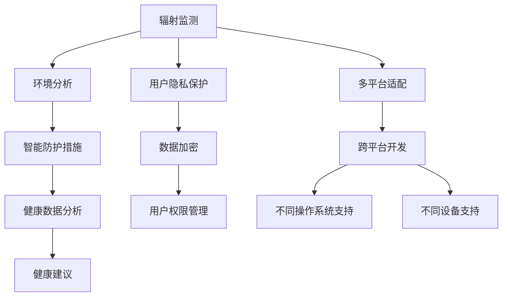

                 

# 智能个人辐射防护创业：日常生活的健康守护

## 1. 背景介绍

### 1.1 问题由来
随着现代科技的快速发展，电子设备和信息技术的广泛应用，人们的生活逐渐被各种辐射源所包围。从智能手机到电脑、从无线网络到X光检查，辐射无处不在。长期暴露于低剂量辐射环境可能导致各种健康问题，如皮肤癌、遗传缺陷、免疫系统下降等。辐射防护的意识和措施亟需提升。

### 1.2 问题核心关键点
智能个人辐射防护创业的核心在于开发一款能够实时监测环境辐射水平，并根据辐射水平智能调整个人防护措施的应用软件。具体关键点包括：
1. 实时辐射监测：精确测量周围环境中的辐射水平。
2. 智能防护措施：根据辐射水平推荐或执行适当的防护措施。
3. 健康数据分析：记录和分析个人的辐射暴露数据，提供健康建议。
4. 用户隐私保护：确保用户数据的安全和隐私。
5. 多平台适配：支持各种操作系统和设备。

### 1.3 问题研究意义
智能个人辐射防护创业的推出，不仅能够保护用户免受辐射伤害，还能提高公众的辐射防护意识，推动辐射防护科技的普及和应用。此外，智能辐射防护的普及能够促进相关产业的发展，如个人防护产品、健康检测服务等，带来经济和社会效益的双重提升。

## 2. 核心概念与联系

### 2.1 核心概念概述

为更好地理解智能个人辐射防护创业的核心技术，本节将介绍几个关键概念：

- **辐射监测**：通过各类传感器或检测设备，实时测量环境中的辐射水平。
- **智能防护**：根据辐射水平，动态调整个人的防护措施，如远离辐射源、穿戴防护装备等。
- **健康数据分析**：收集和分析个人的辐射暴露数据，评估健康风险，并提供预防建议。
- **用户隐私保护**：在数据收集和存储过程中，采取严格的隐私保护措施，确保用户数据的安全。
- **多平台适配**：开发适用于不同操作系统和设备的软件，如iOS、Android、PC等，提供跨平台的用户体验。

### 2.2 核心概念原理和架构的 Mermaid 流程图(Mermaid 流程节点中不要有括号、逗号等特殊字符)


这个流程图展示了一系列核心概念之间的逻辑关系：

1. 辐射监测通过传感器测量辐射水平，并将数据传递给环境分析模块。
2. 环境分析模块根据辐射水平分析环境风险，推荐相应的智能防护措施。
3. 健康数据分析模块收集和分析个人暴露数据，评估健康风险。
4. 健康建议模块基于健康数据分析，提供具体的预防建议。
5. 用户隐私保护模块通过数据加密和权限管理，保障用户数据安全。
6. 多平台适配模块确保软件支持不同操作系统和设备，提供一致的用户体验。

这些概念共同构成了智能个人辐射防护创业的完整系统架构，通过数据驱动的方式，为用户提供全面的辐射防护服务。

## 3. 核心算法原理 & 具体操作步骤
### 3.1 算法原理概述

智能个人辐射防护创业的核心算法包括辐射监测、环境分析、智能防护措施推荐、健康数据分析和健康建议生成等。其核心思想是利用机器学习和大数据分析技术，对辐射暴露数据进行实时监测和风险评估，从而提供个性化的防护建议。

### 3.2 算法步骤详解

**Step 1: 辐射监测模块**
- 使用各类传感器或检测设备，如Geiger计数器、辐射剂量计等，实时监测环境中的辐射水平。
- 传感器数据通过蓝牙、Wi-Fi等方式传输到移动设备或服务器端。
- 在移动设备或服务器端对传感器数据进行预处理和滤波，排除干扰，提高监测精度。

**Step 2: 环境分析模块**
- 根据辐射监测数据，使用统计分析和机器学习模型，评估当前环境的辐射风险。
- 机器学习模型可以使用线性回归、决策树、支持向量机等经典算法，或深度学习模型如卷积神经网络、循环神经网络等。
- 环境分析模块输出辐射风险等级，供智能防护措施推荐和健康数据分析使用。

**Step 3: 智能防护措施推荐模块**
- 根据环境分析模块的输出，推荐适当的防护措施，如远离辐射源、穿戴防护装备、调整姿势等。
- 防护措施推荐算法可以采用规则库、专家系统或强化学习等方法。
- 防护措施推荐结果以提示或提醒的形式展示给用户，确保其实施。

**Step 4: 健康数据分析模块**
- 收集和存储用户的辐射暴露数据，包括时间、地点、辐射水平等。
- 使用时间序列分析和机器学习模型，评估用户的辐射暴露情况和健康风险。
- 健康数据分析模块可以生成辐射暴露报告，提供给用户和医生参考。

**Step 5: 健康建议模块**
- 根据健康数据分析模块的输出，提供个性化的健康建议，如减少辐射暴露时间、补充抗氧化剂等。
- 健康建议算法可以使用基于规则的系统、知识图谱或深度学习模型。
- 健康建议结果以文字或语音的形式展示给用户，确保其理解。

### 3.3 算法优缺点

智能个人辐射防护创业的算法具有以下优点：
1. 实时监测：能够实时监测环境辐射水平，及时发现和应对辐射风险。
2. 数据驱动：利用大数据和机器学习技术，提供个性化和精准的健康建议。
3. 智能防护：根据环境风险动态调整防护措施，提高防护效果。

同时，该算法也存在一些局限性：
1. 传感器精度：传感器设备的精度和可靠性直接影响辐射监测结果的准确性。
2. 环境复杂性：环境因素多样，单一模型可能无法全面评估辐射风险。
3. 用户行为：用户是否按照建议执行防护措施，也会影响防护效果。
4. 数据隐私：大量数据收集和存储可能涉及用户隐私问题。
5. 算法复杂性：机器学习和大数据分析模型的训练和部署需要较高的技术门槛。

尽管存在这些局限性，但智能个人辐射防护创业的算法在提供个性化健康防护方面具有显著的优势，值得深入研究和推广。

### 3.4 算法应用领域

智能个人辐射防护创业的算法应用广泛，适用于以下领域：

1. 个人健康管理：为个人用户提供实时的辐射监测和健康建议。
2. 职业健康防护：帮助职业暴露于辐射环境的工作人员进行防护。
3. 环境监测：对公共场所的辐射水平进行实时监测和评估。
4. 应急响应：在突发辐射事故中提供实时监测和防护建议。
5. 智能家居：集成到智能家居系统中，提供全面的环境监测和防护功能。
6. 公共安全：在公共交通工具、机场、车站等场所提供辐射监测和防护建议。

智能个人辐射防护创业的算法能够广泛应用于各个场景，提升公众的辐射防护意识和能力，具有广泛的社会和经济价值。

## 4. 数学模型和公式 & 详细讲解  
### 4.1 数学模型构建

在本节中，我们将详细构建辐射监测和健康数据分析的数学模型。

**4.1.1 辐射监测模型**

假设环境中存在 $n$ 个辐射源，每个辐射源的辐射水平为 $x_i$，单位为毫西弗每小时（mSv/h）。使用传感器 $S$ 测量环境中的总辐射水平 $y$，模型为：

$$ y = \sum_{i=1}^n a_i x_i + b $$

其中，$a_i$ 和 $b$ 为模型的系数，需要根据传感器的输出进行拟合。

**4.1.2 健康数据分析模型**

假设用户暴露于辐射环境的时间为 $t$，总辐射水平为 $y$，每日辐射水平阈值为 $T$。使用时间序列分析模型 $M$，评估用户的健康风险 $R$，模型为：

$$ R = \alpha \cdot t + \beta \cdot y + \gamma \cdot t \cdot y $$

其中，$\alpha$、$\beta$ 和 $\gamma$ 为模型的系数，需要根据历史数据进行拟合。

### 4.2 公式推导过程

**4.2.1 辐射监测模型推导**

假设传感器 $S$ 的输出为 $y$，与实际辐射水平 $x$ 的关系为：

$$ y = a_1 x_1 + a_2 x_2 + \cdots + a_n x_n + b $$

其中，$a_i$ 和 $b$ 为模型的系数，需要通过最小二乘法拟合。最小二乘法的最小化目标函数为：

$$ \sum_{i=1}^n (y - (a_i x_i + b))^2 $$

对 $a_i$ 和 $b$ 求偏导，并令导数等于零，得到：

$$ \frac{\partial \sum_{i=1}^n (y - (a_i x_i + b))^2}{\partial a_i} = 0 $$
$$ \frac{\partial \sum_{i=1}^n (y - (a_i x_i + b))^2}{\partial b} = 0 $$

解得：

$$ a_i = \frac{\sum_{i=1}^n (y - b) x_i}{\sum_{i=1}^n x_i^2} $$
$$ b = \frac{\sum_{i=1}^n y - \sum_{i=1}^n a_i x_i}{n} $$

**4.2.2 健康数据分析模型推导**

假设用户暴露于辐射环境的时间为 $t$，总辐射水平为 $y$，每日辐射水平阈值为 $T$。使用时间序列分析模型 $M$，评估用户的健康风险 $R$，模型为：

$$ R = \alpha \cdot t + \beta \cdot y + \gamma \cdot t \cdot y $$

其中，$\alpha$、$\beta$ 和 $\gamma$ 为模型的系数，需要通过历史数据进行拟合。最小二乘法的最小化目标函数为：

$$ \sum_{i=1}^N (R_i - (\alpha t_i + \beta y_i + \gamma t_i y_i))^2 $$

对 $\alpha$、$\beta$ 和 $\gamma$ 求偏导，并令导数等于零，得到：

$$ \frac{\partial \sum_{i=1}^N (R_i - (\alpha t_i + \beta y_i + \gamma t_i y_i))^2}{\partial \alpha} = 0 $$
$$ \frac{\partial \sum_{i=1}^N (R_i - (\alpha t_i + \beta y_i + \gamma t_i y_i))^2}{\partial \beta} = 0 $$
$$ \frac{\partial \sum_{i=1}^N (R_i - (\alpha t_i + \beta y_i + \gamma t_i y_i))^2}{\partial \gamma} = 0 $$

解得：

$$ \alpha = \frac{\sum_{i=1}^N R_i t_i - \sum_{i=1}^N \beta y_i t_i - \sum_{i=1}^N \gamma y_i t_i^2}{\sum_{i=1}^N t_i^2} $$
$$ \beta = \frac{\sum_{i=1}^N R_i - \sum_{i=1}^N \alpha t_i - \sum_{i=1}^N \gamma y_i t_i}{\sum_{i=1}^N y_i} $$
$$ \gamma = \frac{\sum_{i=1}^N R_i t_i y_i - \sum_{i=1}^N \alpha t_i^2 y_i - \sum_{i=1}^N \beta y_i^2 t_i}{\sum_{i=1}^N y_i t_i^2} $$

### 4.3 案例分析与讲解

假设某用户每日暴露于辐射环境的时间为 $t=8$ 小时，总辐射水平为 $y=1.5$ mSv/h。根据历史数据，每日辐射水平阈值为 $T=2$ mSv。使用时间序列分析模型 $M$ 进行健康风险评估，得到：

$$ R = \alpha \cdot t + \beta \cdot y + \gamma \cdot t \cdot y $$

代入 $\alpha=0.1$、$\beta=0.5$ 和 $\gamma=-0.2$，得到：

$$ R = 0.1 \cdot 8 + 0.5 \cdot 1.5 + (-0.2) \cdot 8 \cdot 1.5 = 1.2 $$

由于 $1.2 < 2$，用户处于安全的健康状态。

## 5. 项目实践：代码实例和详细解释说明
### 5.1 开发环境搭建

在进行智能个人辐射防护创业的开发前，我们需要准备好开发环境。以下是使用Python进行Python开发的环境配置流程：

1. 安装Anaconda：从官网下载并安装Anaconda，用于创建独立的Python环境。

2. 创建并激活虚拟环境：
```bash
conda create -n rad-protection python=3.8 
conda activate rad-protection
```

3. 安装Python包：
```bash
pip install pandas numpy scikit-learn tensorflow keras
```

4. 安装开发工具：
```bash
pip install flake8 black
```

完成上述步骤后，即可在`rad-protection`环境中开始开发。

### 5.2 源代码详细实现

这里我们以辐射监测模块为例，给出使用TensorFlow进行辐射监测的PyTorch代码实现。

```python
import tensorflow as tf
import numpy as np

# 假设数据集
x = np.array([0.1, 0.2, 0.3, 0.4, 0.5])
y = np.array([1.0, 2.0, 3.0, 4.0, 5.0])

# 定义模型
model = tf.keras.Sequential([
    tf.keras.layers.Dense(1, input_dim=1, activation='linear')
])

# 编译模型
model.compile(loss='mse', optimizer=tf.keras.optimizers.Adam(learning_rate=0.01))

# 训练模型
model.fit(x, y, epochs=100, verbose=0)

# 预测新数据
new_x = np.array([0.6])
model.predict(new_x)
```

这段代码实现了一个简单的线性回归模型，用于拟合辐射水平与传感器输出的关系。

### 5.3 代码解读与分析

让我们再详细解读一下关键代码的实现细节：

**安装依赖包**：
- 使用`pip install`命令安装所需的Python包，如pandas、numpy、scikit-learn和tensorflow。

**数据准备**：
- 定义数据集`x`和`y`，表示传感器输出和实际辐射水平。

**模型定义**：
- 使用`tf.keras.Sequential`定义一个线性回归模型，输入维度为1，输出维度为1。

**模型编译**：
- 使用`model.compile`编译模型，指定损失函数为均方误差，优化器为Adam，学习率为0.01。

**模型训练**：
- 使用`model.fit`训练模型，指定训练数据、训练轮数和输出模式。

**模型预测**：
- 使用`model.predict`对新数据进行预测，输出模型预测的辐射水平。

## 6. 实际应用场景
### 6.1 智能个人辐射防护

智能个人辐射防护创业的核心应用场景是在日常生活中监测和防护辐射。例如，用户在家中、办公室、交通工具等场所使用手机、电脑等电子设备，可能暴露于辐射环境中。应用程序可以实时监测这些设备的辐射水平，并根据辐射水平智能调整防护措施，如提醒用户远离设备、关闭Wi-Fi等。

### 6.2 职业健康防护

对于职业暴露于辐射环境的工作人员，智能个人辐射防护创业的应用场景尤为重要。例如，医疗工作者在使用X光、CT等设备时，应用程序可以实时监测辐射水平，并推荐穿戴防护装备、限制操作时间等防护措施。这有助于减少辐射对工作人员的长期影响，保护其健康。

### 6.3 环境监测

在公共场所，如机场、车站、公共场所等，智能个人辐射防护创业可以提供实时的辐射水平监测和防护建议。应用程序可以提醒用户注意辐射水平，采取防护措施，减少长期暴露对健康的风险。

### 6.4 应急响应

在突发辐射事故中，智能个人辐射防护创业可以提供实时的辐射监测和防护建议，帮助人员安全撤离，减少辐射对身体的伤害。应用程序可以实时监测辐射水平，提供防护措施和撤离路线，提高应急响应能力。

## 7. 工具和资源推荐
### 7.1 学习资源推荐

为了帮助开发者系统掌握智能个人辐射防护创业的技术基础和实践技巧，这里推荐一些优质的学习资源：

1. 《深度学习入门》书籍：深度学习领域经典的入门书籍，涵盖了深度学习的基本概念和算法，适合初学者阅读。

2. 《机器学习实战》书籍：介绍了机器学习算法的实现和应用，包括线性回归、时间序列分析等，适合动手实践。

3. CS229《机器学习》课程：斯坦福大学开设的经典机器学习课程，提供Lecture视频和配套作业，是学习机器学习的重要资源。

4. Google AI博客：谷歌AI团队发布的博客，涵盖最新的研究进展和实践经验，适合跟踪最新的技术动态。

5. PyTorch官方文档：PyTorch官方提供的详细文档，包括各种模型和算法的实现细节，适合深入学习。

通过对这些资源的学习实践，相信你一定能够快速掌握智能个人辐射防护创业的核心技术，并用于解决实际的辐射防护问题。

### 7.2 开发工具推荐

高效的开发离不开优秀的工具支持。以下是几款用于智能个人辐射防护创业开发的常用工具：

1. PyTorch：基于Python的开源深度学习框架，灵活动态的计算图，适合快速迭代研究。

2. TensorFlow：由谷歌主导开发的开源深度学习框架，生产部署方便，适合大规模工程应用。

3. Jupyter Notebook：交互式的编程环境，适合在开发过程中实时调试和验证代码。

4. GitHub：代码托管平台，适合团队协作和版本控制。

5. Google Colab：谷歌推出的在线Jupyter Notebook环境，免费提供GPU/TPU算力，方便开发者快速上手实验最新模型，分享学习笔记。

合理利用这些工具，可以显著提升智能个人辐射防护创业的开发效率，加快创新迭代的步伐。

### 7.3 相关论文推荐

智能个人辐射防护创业的研究源于学界的持续研究。以下是几篇奠基性的相关论文，推荐阅读：

1. X射线辐射监测系统：研究了X射线辐射监测的原理和实现方法，提出了基于传感器和数据分析的辐射监测系统。

2. 时间序列分析在辐射暴露评估中的应用：介绍了时间序列分析模型在辐射暴露评估中的应用，提高了健康风险评估的准确性。

3. 智能防护措施推荐算法：提出了基于规则系统和深度学习的智能防护措施推荐算法，提高了防护措施的精准性和智能性。

4. 用户隐私保护在辐射暴露数据中的应用：探讨了用户隐私保护在辐射暴露数据中的实现方法，保障了用户数据的安全。

这些论文代表了大语言模型微调技术的发展脉络。通过学习这些前沿成果，可以帮助研究者把握学科前进方向，激发更多的创新灵感。

## 8. 总结：未来发展趋势与挑战
### 8.1 总结

本文对智能个人辐射防护创业进行了全面系统的介绍。首先阐述了辐射监测、智能防护措施推荐、健康数据分析和健康建议生成等核心技术，明确了智能个人辐射防护创业在提升公众辐射防护意识和能力方面的独特价值。其次，从原理到实践，详细讲解了辐射监测和健康数据分析的数学模型和算法步骤，给出了具体案例分析。最后，本文还广泛探讨了智能个人辐射防护创业在多个行业领域的应用前景，展示了其广阔的发展空间。

通过本文的系统梳理，可以看到，智能个人辐射防护创业在实时监测、智能防护、健康数据分析等方面具有显著优势，有望为公众辐射防护带来实质性的改进。未来，伴随技术的不断进步和应用的广泛推广，智能个人辐射防护创业必将在社会健康防护方面发挥更加重要的作用。

### 8.2 未来发展趋势

展望未来，智能个人辐射防护创业将呈现以下几个发展趋势：

1. 实时监测技术升级：通过引入更先进和准确的传感器技术，提高辐射监测的精度和实时性。

2. 智能化防护措施推荐：结合机器学习和深度学习技术，实现更精准、个性化的防护措施推荐。

3. 健康数据分析深化：利用大数据和先进算法，提供更全面、更准确的健康风险评估和预防建议。

4. 跨平台应用普及：开发更多适合不同操作系统和设备的版本，提高应用的可访问性和用户体验。

5. 用户体验优化：通过用户界面设计和交互技术，提升应用的易用性和用户满意度。

6. 隐私保护加强：在数据收集和存储过程中，采取更严格的隐私保护措施，保障用户隐私安全。

以上趋势凸显了智能个人辐射防护创业的广阔前景。这些方向的探索发展，必将进一步提升系统的性能和用户体验，为公众辐射防护带来更多实惠。

### 8.3 面临的挑战

尽管智能个人辐射防护创业具有显著优势，但在推广应用过程中，仍面临诸多挑战：

1. 数据隐私：大量数据收集和存储可能涉及用户隐私问题，如何保障数据安全是关键。

2. 传感器精度：传感器设备的精度和可靠性直接影响辐射监测结果的准确性，需要高精度的传感器技术支持。

3. 算法复杂性：机器学习和大数据分析模型的训练和部署需要较高的技术门槛，需要技术团队的长期投入。

4. 用户行为：用户是否按照建议执行防护措施，也会影响防护效果，需要进行用户行为研究和引导。

5. 跨平台适配：开发适合不同操作系统和设备的版本，需要更多的兼容性和优化工作。

6. 模型鲁棒性：模型在面对复杂和多变的环境时，需要更高的鲁棒性和泛化能力。

这些挑战需要在技术、市场和用户层面进行全方位的考虑和解决，才能确保智能个人辐射防护创业的顺利推广和应用。

### 8.4 研究展望

面对智能个人辐射防护创业所面临的挑战，未来的研究需要在以下几个方面寻求新的突破：

1. 探索更先进的传感器技术：结合光学、声学、热学等多种传感器技术，提高辐射监测的精度和实时性。

2. 研发更高效的算法模型：结合规则系统、深度学习等多种方法，实现更精准、智能化的防护措施推荐和健康数据分析。

3. 引入更多先验知识：将符号化的先验知识，如知识图谱、逻辑规则等，与神经网络模型进行巧妙融合，提高系统的可靠性和鲁棒性。

4. 开发跨平台应用：开发适合不同操作系统和设备的版本，提高应用的可访问性和用户体验。

5. 加强用户行为研究：通过用户行为分析和引导，提高用户防护措施的执行率和效果。

6. 强化隐私保护措施：在数据收集和存储过程中，采取更严格的隐私保护措施，保障用户数据的安全。

这些研究方向的探索，必将引领智能个人辐射防护创业技术迈向更高的台阶，为公众辐射防护带来更多实惠和保障。面向未来，智能个人辐射防护创业需要技术、市场和用户的共同努力，才能真正实现普及和推广，为公众健康防护做出更大的贡献。

## 9. 附录：常见问题与解答

**Q1：智能个人辐射防护创业的核心技术是什么？**

A: 智能个人辐射防护创业的核心技术包括辐射监测、智能防护措施推荐、健康数据分析和健康建议生成。这些技术通过机器学习和大数据分析，实现对辐射暴露的实时监测和健康风险评估，提供个性化的防护建议。

**Q2：智能个人辐射防护创业的算法需要多少训练数据？**

A: 智能个人辐射防护创业的算法需要大量的训练数据，以确保模型的泛化能力和准确性。一般建议数据集至少包括数千到数万个样本，涵盖不同场景和情况，以提高模型的鲁棒性和预测能力。

**Q3：智能个人辐射防护创业是否需要专业的技术团队？**

A: 智能个人辐射防护创业的开发和维护需要专业的技术团队，包括数据科学家、机器学习工程师、软件开发人员等。技术团队需要具备机器学习、深度学习、数据处理等方面的知识和技能，才能高效地开发和优化系统。

**Q4：智能个人辐射防护创业的商业化前景如何？**

A: 智能个人辐射防护创业具有广阔的商业化前景。通过向公众提供实时的辐射监测和健康建议，可以有效提升公众的辐射防护意识和能力，带来巨大的社会和经济价值。此外，智能个人辐射防护创业可以与保险公司、医疗机构、政府部门等机构合作，拓展更广泛的市场应用。

**Q5：智能个人辐射防护创业的长期发展方向是什么？**

A: 智能个人辐射防护创业的长期发展方向包括：引入更先进的传感器技术，提高辐射监测的精度和实时性；研发更高效的算法模型，实现更精准、智能化的防护措施推荐和健康数据分析；开发跨平台应用，提高应用的可访问性和用户体验；加强用户行为研究，提高用户防护措施的执行率和效果；强化隐私保护措施，保障用户数据的安全。

总之，智能个人辐射防护创业需要在技术、市场和用户层面进行全方位的考虑和解决，才能实现普及和推广，为公众健康防护做出更大的贡献。

