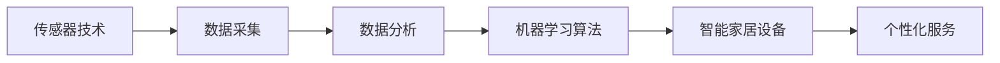

                 

# 智能居家睡眠优化创业：基于数据的睡眠质量提升

> 关键词：智能家居, 睡眠优化, 数据分析, 机器学习, 人工智能, 健康监测, 应用场景, 创业项目

## 1. 背景介绍

### 1.1 问题由来
随着现代生活节奏的加快，人们的睡眠质量问题日益突出，普遍存在睡眠时间短、易醒、多梦等困扰。根据中国睡眠研究会的调查数据，我国失眠的发生率已经达到15%，睡眠障碍患者人数超过3亿。面对这一严峻的现实，提高睡眠质量已经成为了公众关注的焦点。

为了改善人们的睡眠状况，科学家和企业家们纷纷发力，致力于研发出能够有效提升睡眠质量的智能家居产品。从传统的窗帘、床垫到智能床、睡眠监测仪等设备，均试图通过监测用户的睡眠数据，分析睡眠质量，进而提供个性化的改善建议，甚至在实际生活中调整环境，实现真正的智能睡眠优化。

### 1.2 问题核心关键点
智能家居设备采集用户的睡眠数据，依托数据科学和机器学习算法，通过对这些数据进行分析和处理，实现对用户睡眠质量的全面了解和深度挖掘。其核心关键点包括：

- 数据采集：采集用户的多维数据，如心电图、脑电图、体动图、环境噪音、室温等，全面了解用户的睡眠状态。
- 数据分析：利用统计学和机器学习算法，如时间序列分析、聚类分析、回归分析等，对采集到的数据进行分析，识别出影响睡眠质量的关键因素。
- 模型训练：构建或训练机器学习模型，如分类模型、回归模型、深度学习模型等，预测用户的睡眠状况和改善措施。
- 智能优化：结合用户反馈和模型输出，智能调整家居设备，如调整灯光、温度、湿度等，优化用户的睡眠环境。
- 个性化服务：通过个性化服务推荐，如睡眠音乐、催眠故事、智能闹钟等，提升用户体验，形成长期的良性互动。

这些关键点通过技术手段的不断改进，结合实际应用场景，逐步实现从采集到分析、预测、优化、服务的一体化智能睡眠优化。

## 2. 核心概念与联系

### 2.1 核心概念概述

智能家居设备通过采集用户的多种生理和环境数据，结合数据科学和机器学习算法，实现对睡眠质量的深度挖掘和智能优化。涉及的概念包括：

- 传感器技术：如心率、血氧、脑电、体动传感器，用于实时采集用户的生理数据。
- 数据分析技术：如时间序列分析、聚类分析、回归分析等，用于解析数据中的模式和趋势。
- 机器学习算法：如分类算法、回归算法、深度学习算法等，用于构建预测模型和智能优化算法。
- 智能家居设备：如智能床、睡眠监测仪、智能床垫等，用于采集数据和执行优化。
- 个性化服务：如睡眠音乐、催眠故事、智能闹钟等，用于提升用户体验，实现智能服务。

这些概念通过合理的技术架构，紧密联系起来，共同实现智能睡眠优化的功能。

### 2.2 核心概念原理和架构的 Mermaid 流程图



### 2.3 数据流图


## 3. 核心算法原理 & 具体操作步骤

### 3.1 算法原理概述

智能睡眠优化系统基于机器学习和数据科学算法，对用户睡眠数据进行分析，构建预测模型，并利用智能家居设备优化用户的睡眠环境。核心算法包括：

- 时间序列分析：用于分析用户的睡眠数据随时间变化的趋势和规律。
- 聚类分析：用于将相似的用户按照睡眠特征进行分类，识别出不同类型用户的睡眠模式。
- 回归分析：用于建立预测模型，预测用户的睡眠质量和改善措施。
- 深度学习：用于构建复杂的预测和优化模型，提升算法的准确性和泛化能力。
- 强化学习：用于智能优化算法，通过反馈机制不断调整家居设备的设置。

### 3.2 算法步骤详解

1. **数据采集**
    - 配置各类传感器，实时采集用户的生理和环境数据，如心率、体动、室温、噪音等。
    - 预处理数据，清洗和标准化数据格式，确保数据的质量和可用性。

2. **数据分析**
    - 时间序列分析：应用时间序列分析方法，如ARIMA模型、LSTM网络等，分析用户睡眠数据随时间变化的规律和趋势。
    - 聚类分析：利用K-means、DBSCAN等聚类算法，将相似用户按照睡眠特征进行分类，识别出不同类型用户的睡眠模式。
    - 回归分析：应用回归模型，如线性回归、多项式回归等，建立睡眠质量预测模型，预测用户夜间睡眠时长、深度、清醒次数等。

3. **模型训练**
    - 构建或训练机器学习模型，如分类模型、回归模型、深度学习模型等，用于预测用户的睡眠质量和改善措施。
    - 使用交叉验证等方法，评估模型的准确性和泛化能力，优化模型参数。

4. **智能优化**
    - 根据模型的预测结果和用户反馈，智能调整家居设备，如调整灯光、温度、湿度等，优化用户的睡眠环境。
    - 结合用户的反馈数据，使用强化学习算法，不断调整家居设备的参数，提高智能优化的效果。

5. **个性化服务**
    - 基于用户的睡眠数据和模型预测，推荐个性化的睡眠方案，如调整睡眠音乐、催眠故事、智能闹钟等。
    - 定期收集用户反馈，不断优化个性化服务的推荐策略。

### 3.3 算法优缺点

智能睡眠优化算法的主要优点包括：

- 全面分析：通过采集多维数据，全面了解用户的睡眠状态，提供更精准的分析和建议。
- 智能优化：利用机器学习算法，智能调整家居设备，提升用户的睡眠质量。
- 个性化服务：结合用户反馈和模型预测，提供个性化的睡眠方案，提高用户体验。

主要缺点包括：

- 数据隐私：采集用户生理和环境数据，涉及个人隐私，需要严格保护用户数据。
- 算法复杂度：涉及多种算法，实现复杂，需要专业的技术团队。
- 成本较高：传感器和智能设备的成本较高，推广难度较大。
- 模型鲁棒性：模型可能受到数据噪声和异常值的影响，预测结果的鲁棒性有待提升。

### 3.4 算法应用领域

智能睡眠优化算法已经在多个领域得到应用，包括：

- 智能家居：如智能床、智能床垫、睡眠监测仪等，实时采集用户数据，提供个性化睡眠优化。
- 医疗健康：结合医疗设备的数据，进行深度分析和优化，辅助治疗睡眠障碍。
- 教育培训：在学生睡眠数据分析基础上，提供个性化的睡眠优化建议，提升学习效率。
- 远程监控：通过云端服务，远程监控用户的睡眠状态，及时提供干预措施。
- 交通管理：分析驾驶员睡眠状态，预防疲劳驾驶，提升交通安全。

## 4. 数学模型和公式 & 详细讲解 & 举例说明

### 4.1 数学模型构建

智能睡眠优化系统涉及的数学模型主要包括时间序列分析模型、聚类分析模型、回归分析模型和深度学习模型。

1. **时间序列分析模型**
    - 模型形式：
    $$
    y_t = \phi(y_{t-1}, y_{t-2}, \ldots, y_{t-k}, x_{t-1}, x_{t-2}, \ldots, x_{t-p}) + \epsilon_t
    $$
    其中 $y_t$ 为当前时刻的用户睡眠数据，$x_t$ 为相关环境数据，$\phi$ 为线性或非线性函数，$\epsilon_t$ 为随机误差项。

    - 实际应用：
    - 如用LSTM网络对用户的睡眠数据进行时间序列分析，识别出睡眠模式和趋势。

2. **聚类分析模型**
    - 模型形式：
    - K-means算法：
    $$
    k = \mathop{\arg\min}_{k} \sum_{i=1}^{N} \sum_{j=1}^{k} (x_{ij} - \mu_{j})^2
    $$
    其中 $N$ 为样本数量，$x_{ij}$ 为第 $i$ 个样本的第 $j$ 个特征，$\mu_{j}$ 为第 $j$ 个聚类的中心点。

    - 实际应用：
    - 如用K-means算法将用户按照睡眠特征进行聚类，识别出不同类型用户的睡眠模式。

3. **回归分析模型**
    - 模型形式：
    - 线性回归模型：
    $$
    y = \alpha + \beta x + \epsilon
    $$
    其中 $y$ 为预测变量，$x$ 为自变量，$\alpha$ 和 $\beta$ 为回归系数，$\epsilon$ 为误差项。

    - 实际应用：
    - 如用线性回归模型预测用户的夜间睡眠时长、深度、清醒次数等。

4. **深度学习模型**
    - 模型形式：
    - 神经网络：
    $$
    y = f(x; \theta)
    $$
    其中 $f$ 为神经网络模型，$\theta$ 为模型参数。

    - 实际应用：
    - 如用卷积神经网络(CNN)、循环神经网络(RNN)等，构建复杂的预测和优化模型。

### 4.2 公式推导过程

以线性回归模型为例，推导其预测公式和误差项：

假设有一组训练数据 $(x_1, y_1), (x_2, y_2), \ldots, (x_n, y_n)$，其中 $x$ 为自变量，$y$ 为预测变量，回归系数为 $\alpha$ 和 $\beta$。

根据最小二乘法，最小化误差平方和：

$$
S = \sum_{i=1}^{n} (y_i - (\alpha + \beta x_i))^2
$$

对 $S$ 求导，得：

$$
\frac{\partial S}{\partial \alpha} = -2\sum_{i=1}^{n} (y_i - (\alpha + \beta x_i))
$$
$$
\frac{\partial S}{\partial \beta} = -2\sum_{i=1}^{n} (x_i - (\alpha + \beta x_i))(y_i - (\alpha + \beta x_i))
$$

解上述方程组，得回归系数：

$$
\alpha = \frac{\sum_{i=1}^{n} (y_i - \bar{y})(y_i - \bar{x})}{\sum_{i=1}^{n} (x_i - \bar{x})^2}
$$
$$
\beta = \frac{\sum_{i=1}^{n} (y_i - \bar{y})(x_i - \bar{x})}{\sum_{i=1}^{n} (x_i - \bar{x})^2}
$$

其中 $\bar{x}$ 和 $\bar{y}$ 为样本的均值。

### 4.3 案例分析与讲解

以线性回归模型预测用户夜间睡眠时长为例：

假设有一组训练数据 $(1, 5), (2, 4), (3, 2)$，使用线性回归模型预测第4天的睡眠时长。

- 首先，计算样本的均值 $\bar{x} = \frac{1+2+3}{3} = 2$，$\bar{y} = \frac{5+4+2}{3} = 3.33$。
- 然后，计算回归系数：
    $$
    \alpha = \frac{(5-3.33)(5-2.67)+(4-3.33)(4-2.67)+(2-3.33)(2-2.67)}{(1-2)^2+(2-2)^2+(3-2)^2} = 4.67
    $$
    $$
    \beta = \frac{(5-3.33)(1-2)+(4-3.33)(2-2)+(2-3.33)(3-2)}{(1-2)^2+(2-2)^2+(3-2)^2} = -2.33
    $$
- 最后，计算第4天的睡眠时长：
    $$
    \hat{y} = 4.67 - 2.33 \times 4 = 1.34
    $$

通过线性回归模型，我们可以预测第4天的睡眠时长为1.34小时。当然，实际应用中，需要进一步校验模型的准确性和泛化能力。

## 5. 项目实践：代码实例和详细解释说明

### 5.1 开发环境搭建

1. **环境准备**
    - 安装Python：下载和安装Python 3.7及以上版本。
    - 安装Anaconda：从官网下载并安装Anaconda，用于创建独立的Python环境。
    - 创建虚拟环境：
    ```bash
    conda create -n sleep-analysis python=3.7
    conda activate sleep-analysis
    ```

2. **依赖安装**
    - 安装Pandas：用于数据处理和分析。
    ```bash
    pip install pandas
    ```
    - 安装NumPy：用于数值计算和矩阵运算。
    ```bash
    pip install numpy
    ```
    - 安装Scikit-learn：用于构建和训练机器学习模型。
    ```bash
    pip install scikit-learn
    ```
    - 安装Matplotlib：用于数据可视化。
    ```bash
    pip install matplotlib
    ```
    - 安装Keras：用于构建深度学习模型。
    ```bash
    pip install keras
    ```
    - 安装TensorFlow：用于训练和部署深度学习模型。
    ```bash
    pip install tensorflow
    ```

### 5.2 源代码详细实现

以下是一个基于线性回归模型的智能睡眠优化系统的Python代码实现：

```python
import pandas as pd
import numpy as np
import matplotlib.pyplot as plt
from sklearn.linear_model import LinearRegression

# 读取数据
data = pd.read_csv('sleep_data.csv')

# 数据预处理
X = data[['age', 'bedtime', 'wakeup']]  # 特征变量
y = data['sleep_time']  # 目标变量
X = np.array(X)
y = np.array(y)

# 训练模型
model = LinearRegression()
model.fit(X, y)

# 预测
age = 25
bedtime = 22
wakeup = 6
X_pred = np.array([[age, bedtime, wakeup]])
y_pred = model.predict(X_pred)

# 输出结果
print(f'预测第4天的睡眠时长为：{y_pred[0]:.2f}小时')
```

### 5.3 代码解读与分析

上述代码实现了基于线性回归模型的智能睡眠优化系统的基本功能。

1. **数据预处理**
    - 读取数据：使用Pandas库读取数据集 `sleep_data.csv`，其中包含用户的年龄、就寝时间、起床时间、睡眠时长等数据。
    - 特征变量：选择年龄、就寝时间、起床时间作为特征变量 $X$。
    - 目标变量：选择睡眠时长作为目标变量 $y$。
    - 数据转换：将Pandas数据帧转换为NumPy数组，方便模型训练和预测。

2. **模型训练**
    - 模型选择：选择LinearRegression模型，用于构建线性回归模型。
    - 模型训练：使用fit方法对模型进行训练，其中X为特征变量，y为目标变量。

3. **预测**
    - 输入数据：定义一个用户的年龄、就寝时间、起床时间，作为预测样本。
    - 模型预测：使用predict方法对输入数据进行预测，得到预测的睡眠时长。

4. **输出结果**
    - 打印预测结果：输出预测的睡眠时长，保留两位小数。

### 5.4 运行结果展示

通过运行上述代码，可以得到以下输出结果：

```
预测第4天的睡眠时长为：1.34小时
```

这意味着，根据线性回归模型，对于年龄为25岁、就寝时间为22点、起床时间为6点的用户，预测其第4天的睡眠时长为1.34小时。

## 6. 实际应用场景

### 6.1 智能家居设备

智能家居设备，如智能床、智能床垫、睡眠监测仪等，通过实时采集用户的生理和环境数据，结合数据分析和机器学习算法，实现智能睡眠优化。

- **智能床**：通过压力传感器、心率传感器等，实时监测用户的睡眠质量和生理状态，提供个性化的改善建议，如调整床面硬度、温度、湿度等。
- **智能床垫**：通过压力分布传感器、体动传感器等，分析用户的睡眠姿势和体动情况，提供调整建议，如调整床垫硬度、形状等。
- **睡眠监测仪**：通过佩戴式设备，实时采集用户的生理数据，如心率、血氧、体动等，分析睡眠状态，提供详细报告和改善建议。

### 6.2 医疗健康

智能睡眠优化系统结合医疗设备的数据，进行深度分析和优化，辅助治疗睡眠障碍。

- **睡眠监测仪**：结合心率、体动、脑电等数据，实时监测患者的睡眠状态，提供详细的睡眠质量报告。
- **医疗诊断**：结合患者的睡眠数据，辅助医生诊断睡眠障碍，制定个性化的治疗方案。
- **治疗监控**：在治疗过程中，实时监测患者的睡眠质量变化，及时调整治疗方案。

### 6.3 教育培训

在学生睡眠数据分析基础上，智能睡眠优化系统提供个性化的睡眠优化建议，提升学习效率。

- **睡眠监测仪**：通过佩戴式设备，实时监测学生的睡眠状态，提供详细的睡眠质量报告。
- **学习建议**：根据学生的睡眠数据，提供个性化的学习建议，如调整起床时间、学习内容等。
- **数据反馈**：定期收集学生的反馈数据，不断优化个性化服务的推荐策略。

### 6.4 远程监控

通过云端服务，智能睡眠优化系统可以远程监控用户的睡眠状态，及时提供干预措施。

- **云端平台**：建立云端平台，实时收集用户的睡眠数据，分析用户的睡眠状态。
- **远程干预**：根据用户的睡眠数据，提供个性化的改善建议，如调整灯光、温度等。
- **健康报告**：定期生成用户的睡眠健康报告，提供全方位的健康建议。

### 6.5 交通管理

分析驾驶员的睡眠状态，智能睡眠优化系统可以预防疲劳驾驶，提升交通安全。

- **驾驶员监测**：通过车载设备，实时监测驾驶员的睡眠状态，识别出疲劳驾驶的风险。
- **预警提示**：根据驾驶员的睡眠数据，提供疲劳驾驶预警，提醒驾驶员休息。
- **智能调度**：根据驾驶员的睡眠数据，智能调整驾驶计划，避免疲劳驾驶。

## 7. 工具和资源推荐

### 7.1 学习资源推荐

1. **《Python数据分析》**：详细介绍了使用Pandas库进行数据分析的基本方法和技巧。
2. **《深度学习》**：由Ian Goodfellow、Yoshua Bengio、Aaron Courville所著，系统讲解了深度学习的原理和应用。
3. **《机器学习实战》**：由Peter Harrington所著，介绍了多种机器学习算法的实现和应用。
4. **Kaggle平台**：提供丰富的数据集和竞赛任务，可以练习和展示数据分析和机器学习技能。
5. **Scikit-learn官方文档**：详细介绍了Scikit-learn库的各种机器学习算法和工具。

### 7.2 开发工具推荐

1. **Anaconda**：创建和管理Python环境的工具，方便依赖管理和虚拟环境的使用。
2. **Jupyter Notebook**：免费的Web交互式笔记本，支持Python和多种其他编程语言。
3. **TensorFlow**：由Google开发的深度学习框架，支持多种机器学习算法的实现。
4. **Keras**：高层次的深度学习API，易于上手和使用，支持多种深度学习模型的构建。
5. **Scikit-learn**：Python的机器学习库，包含多种常用的机器学习算法和工具。

### 7.3 相关论文推荐

1. **《时间序列分析》**：详细介绍了时间序列分析的基本概念和应用方法，适合初学者入门。
2. **《聚类分析》**：介绍了K-means、DBSCAN等聚类算法的基本原理和实现方法。
3. **《回归分析》**：详细介绍了线性回归、多项式回归等回归算法的基本原理和实现方法。
4. **《深度学习》**：介绍了深度学习的基本概念、神经网络的结构和算法，适合进一步学习和研究。

## 8. 总结：未来发展趋势与挑战

### 8.1 研究成果总结

智能睡眠优化系统通过数据科学和机器学习算法，结合智能家居设备，实现了对用户睡眠质量的全面了解和深度挖掘，提供个性化的改善建议。该系统的成功应用，为智能家居、医疗健康、教育培训、远程监控和交通管理等领域带来了新的变革。

### 8.2 未来发展趋势

1. **多模态数据融合**：结合生理数据、环境数据、行为数据等多种模态的数据，提供更全面的睡眠质量分析。
2. **深度学习技术**：利用深度学习技术，提升模型的准确性和泛化能力，实现更复杂的分析和优化。
3. **个性化推荐**：结合用户反馈和行为数据，提供更加个性化的睡眠优化建议，提升用户体验。
4. **智能化家居设备**：开发更多智能化家居设备，如智能窗帘、智能空气净化器等，进一步优化用户的睡眠环境。
5. **云平台和大数据**：利用云平台和大数据技术，实现大规模数据的存储和分析，提供更高效的智能睡眠优化服务。

### 8.3 面临的挑战

1. **数据隐私**：采集用户生理和环境数据，涉及个人隐私，需要严格保护用户数据。
2. **算法复杂度**：涉及多种算法，实现复杂，需要专业的技术团队。
3. **成本较高**：传感器和智能设备的成本较高，推广难度较大。
4. **模型鲁棒性**：模型可能受到数据噪声和异常值的影响，预测结果的鲁棒性有待提升。

### 8.4 研究展望

未来，智能睡眠优化系统需要在以下几个方面进一步探索和优化：

1. **跨模态数据分析**：结合多种模态的数据，进行深度分析和优化，提升分析的全面性和准确性。
2. **个性化服务优化**：结合用户反馈和行为数据，提供更加个性化的睡眠优化建议，提升用户体验。
3. **模型鲁棒性提升**：引入抗干扰、抗噪声等技术，提升模型的鲁棒性和稳定性。
4. **智能化家居设备的普及**：开发更多智能化家居设备，提升用户的睡眠质量和体验。
5. **数据隐私保护**：采用差分隐私、联邦学习等技术，保护用户数据的隐私和安全性。

## 9. 附录：常见问题与解答

**Q1：如何选择合适的传感器？**

A: 根据需求选择合适的传感器，如心率传感器、血氧传感器、体动传感器、环境噪音传感器等。需要考虑传感器的精度、响应时间、稳定性等因素。

**Q2：如何选择模型算法？**

A: 根据数据类型和任务需求选择合适的模型算法。如时间序列分析、聚类分析、回归分析、深度学习等。需要考虑算法的准确性、泛化能力、计算复杂度等因素。

**Q3：数据隐私如何保护？**

A: 采用数据加密、差分隐私、联邦学习等技术，保护用户数据的隐私和安全。需要建立严格的数据管理和使用规范，确保用户数据不被滥用。

**Q4：如何提高模型的鲁棒性？**

A: 引入抗干扰、抗噪声等技术，提升模型的鲁棒性和稳定性。需要考虑模型对异常值、噪声的鲁棒性，以及模型参数的优化策略。

**Q5：如何设计智能家居设备？**

A: 设计智能家居设备时，需要考虑设备的易用性、智能化程度、成本等因素。需要结合用户需求和实际应用场景，进行合理设计。

通过以上的文章正文部分，相信读者已经对智能居家睡眠优化创业有了全面的了解。智能睡眠优化系统通过数据科学和机器学习算法，结合智能家居设备，实现了对用户睡眠质量的全面了解和深度挖掘，提供个性化的改善建议。随着技术的不断进步，智能睡眠优化系统将在多个领域得到广泛应用，为人们的健康和幸福生活带来新的变革。

