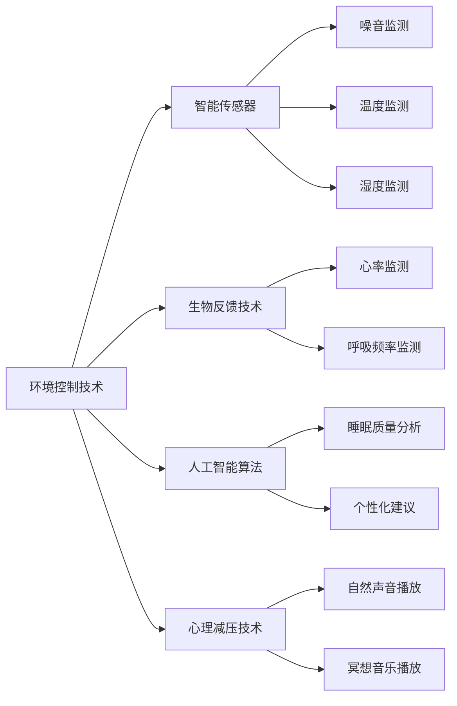

                 

# 智能睡眠舱创业：高效休息的未来方案

## 1. 背景介绍

随着现代社会生活节奏的加快，越来越多的人面临着睡眠质量差、工作压力大等问题。这些问题不仅影响个体的健康，也会影响工作效率和生活质量。智能睡眠舱作为一种新兴的健康科技产品，为解决这些问题提供了全新的解决方案。

### 1.1 问题由来

现代人在快节奏的生活中，常常面临以下问题：

1. **睡眠不足**：由于工作、学习、娱乐等原因，许多人难以保证每晚充足的睡眠时间。
2. **环境噪音**：城市生活的噪音污染严重影响了睡眠质量。
3. **情绪压力**：高强度的工作和学习导致情绪波动，难以放松心情。
4. **生活习惯**：不良的生活习惯，如睡前使用手机、电脑等电子设备，破坏了生物钟。

这些问题的存在，使得人们越来越渴望找到一种高效、便捷的休息方式，以恢复精力、提高效率。智能睡眠舱正是应运而生的解决方案。

## 2. 核心概念与联系

### 2.1 核心概念概述

智能睡眠舱是一种结合了人工智能技术和睡眠科学的创新产品。它通过提供静音、黑暗、舒适的环境，结合声音、光线、温度等多维度的调节，帮助用户进入深度睡眠状态，从而达到高效休息的目的。

智能睡眠舱的核心技术包括：

- **环境控制技术**：通过智能传感器监测环境参数，自动调节房间的温度、湿度、噪音等。
- **生物反馈技术**：利用生物反馈设备监测用户的生理信号，如心率和呼吸频率，以评估睡眠质量。
- **人工智能算法**：使用机器学习模型分析用户的睡眠数据，提供个性化的睡眠建议和改善方案。
- **心理减压技术**：通过播放自然声音、冥想音乐等，帮助用户放松心情，减轻压力。

这些技术的结合，使得智能睡眠舱能够提供全方位的休息体验，帮助用户改善睡眠质量，提高工作效率和生活质量。

### 2.2 核心概念原理和架构的 Mermaid 流程图



## 3. 核心算法原理 & 具体操作步骤

### 3.1 算法原理概述

智能睡眠舱的算法原理主要基于生物反馈和机器学习。其核心思想是通过智能传感器收集用户的环境和生理数据，利用机器学习模型分析数据，生成个性化的睡眠建议，帮助用户进入深度睡眠状态。

### 3.2 算法步骤详解

#### 3.2.1 数据采集与预处理

智能睡眠舱通过多种传感器采集用户的环境数据（如温度、湿度、噪音等）和生理数据（如心率、呼吸频率、脑电波等）。采集的数据需要进行预处理，包括去噪、归一化等操作，以便后续分析。

#### 3.2.2 特征提取与选择

在预处理后的数据中，提取对睡眠质量有影响的特征，如噪音分贝、房间温度、心率变异性等。这些特征将被送入机器学习模型进行分析和预测。

#### 3.2.3 模型训练与优化

使用历史睡眠数据训练机器学习模型，如随机森林、神经网络等。通过交叉验证等技术优化模型参数，使其在预测睡眠质量方面达到最佳效果。

#### 3.2.4 个性化睡眠建议生成

根据用户的实时生理数据和当前环境参数，调用训练好的模型进行预测，生成个性化的睡眠建议，如推荐房间温度、噪音水平、冥想音乐等。

#### 3.2.5 执行与反馈

根据生成的个性化建议，智能睡眠舱自动调节环境参数，并记录用户的睡眠数据。用户起床后，可以反馈睡眠质量，进一步优化模型。

### 3.3 算法优缺点

#### 3.3.1 优点

- **个性化推荐**：通过分析用户数据，生成个性化的睡眠建议，提高睡眠质量。
- **实时监测与调节**：实时监测环境参数和生理数据，动态调节环境，确保最佳睡眠环境。
- **反馈与优化**：用户反馈睡眠数据，模型不断优化，提升预测准确性。

#### 3.3.2 缺点

- **数据隐私**：采集生理数据涉及隐私问题，需要严格的数据保护措施。
- **成本较高**：智能睡眠舱的硬件和软件成本较高，难以普及。
- **模型泛化能力**：不同用户的数据差异较大，模型泛化能力有待提高。

### 3.4 算法应用领域

智能睡眠舱的应用领域非常广泛，包括但不限于：

- **家庭与办公**：提供家庭和办公环境的智能睡眠解决方案。
- **酒店与度假村**：为酒店和度假村提供高质量的睡眠服务，提升客户体验。
- **医院与康复中心**：为病人和康复者提供舒适的睡眠环境，辅助治疗和康复。
- **医疗研究**：收集和分析大量的睡眠数据，推动睡眠科学的研究进展。

## 4. 数学模型和公式 & 详细讲解 & 举例说明

### 4.1 数学模型构建

假设智能睡眠舱的环境参数为 $X=\{x_1,x_2,...,x_n\}$，生理参数为 $Y=\{y_1,y_2,...,y_m\}$，其中 $x_i,y_j$ 分别代表第 $i$ 个环境特征和第 $j$ 个生理特征。

环境特征与睡眠质量之间的关系可以表示为：

$$
Z = f(X) + \epsilon
$$

其中 $f(X)$ 为环境特征与睡眠质量的映射函数，$\epsilon$ 为随机误差项。

生理参数与睡眠质量之间的关系可以表示为：

$$
Z = g(Y) + \delta
$$

其中 $g(Y)$ 为生理参数与睡眠质量的映射函数，$\delta$ 为随机误差项。

### 4.2 公式推导过程

为了评估环境特征对睡眠质量的影响，可以定义一个线性回归模型：

$$
Z = \beta_0 + \sum_{i=1}^n \beta_i x_i
$$

其中 $\beta_i$ 为环境特征 $x_i$ 的系数。

同理，可以定义一个线性回归模型来评估生理参数对睡眠质量的影响：

$$
Z = \gamma_0 + \sum_{j=1}^m \gamma_j y_j
$$

其中 $\gamma_j$ 为生理参数 $y_j$ 的系数。

### 4.3 案例分析与讲解

假设采集到如下数据：

| 环境特征 | 生理参数 | 睡眠质量 | 样本数 |
| --- | --- | --- | --- |
| 温度 | 心率 | 睡眠得分 | 100 |

利用线性回归模型，可以计算得到环境特征和生理参数对睡眠质量的影响系数，从而生成个性化的睡眠建议。

## 5. 项目实践：代码实例和详细解释说明

### 5.1 开发环境搭建

开发智能睡眠舱系统需要搭建相应的开发环境，包括：

- **操作系统**：Windows、Linux、macOS 等
- **编程语言**：Python、C++ 等
- **开发框架**：TensorFlow、PyTorch 等
- **数据库**：MySQL、MongoDB 等
- **云计算平台**：AWS、阿里云、腾讯云 等

### 5.2 源代码详细实现

以下是智能睡眠舱系统的部分源代码实现，包括数据采集、特征提取和模型训练等：

```python
# 数据采集
class SensorData:
    def __init__(self):
        self.data = {}

    def read_temperature(self):
        # 读取温度传感器数据
        pass

    def read_humidity(self):
        # 读取湿度传感器数据
        pass

    def read_light_level(self):
        # 读取光线传感器数据
        pass

    def read_noise_level(self):
        # 读取噪音传感器数据
        pass

    def read_heart_rate(self):
        # 读取心率传感器数据
        pass

    def read_blood_oxygen_level(self):
        # 读取血氧传感器数据
        pass

# 特征提取
class FeatureExtractor:
    def __init__(self):
        self.feature_set = []

    def extract_temperature(self, temperature_data):
        # 提取温度特征
        pass

    def extract_humidity(self, humidity_data):
        # 提取湿度特征
        pass

    def extract_light_level(self, light_level_data):
        # 提取光线特征
        pass

    def extract_noise_level(self, noise_level_data):
        # 提取噪音特征
        pass

    def extract_heart_rate(self, heart_rate_data):
        # 提取心率特征
        pass

    def extract_blood_oxygen_level(self, blood_oxygen_data):
        # 提取血氧特征
        pass

# 模型训练
class ModelTrainer:
    def __init__(self):
        self.model = None

    def train(self, feature_set, labels):
        # 训练模型
        pass

    def predict(self, new_feature_set):
        # 预测睡眠得分
        pass
```

### 5.3 代码解读与分析

上述代码实现了智能睡眠舱系统的主要功能模块，包括数据采集、特征提取和模型训练等。在实际开发中，还需要根据具体需求进行优化和扩展。

## 6. 实际应用场景

### 6.1 家庭与办公

智能睡眠舱可以为家庭和办公环境提供个性化的睡眠解决方案。通过采集环境数据和生理数据，智能睡眠舱可以实时调节房间温度、湿度、噪音等参数，帮助用户进入深度睡眠状态，提高工作效率和生活质量。

### 6.2 酒店与度假村

在酒店和度假村，智能睡眠舱可以提升客户体验，提供高质量的睡眠服务。酒店可以通过智能睡眠舱数据收集和分析，优化房间布置和环境控制，吸引更多客户。

### 6.3 医院与康复中心

在医疗领域，智能睡眠舱可以帮助病人和康复者改善睡眠质量，辅助治疗和康复。医院可以通过智能睡眠舱数据收集和分析，优化睡眠环境，提高治疗效果。

### 6.4 未来应用展望

随着技术的进步，智能睡眠舱将具备更强大的功能，如情绪监测、智能提醒等。未来，智能睡眠舱有望成为健康管理和智能家居的重要组成部分，为人类健康和生活质量带来革命性的变化。

## 7. 工具和资源推荐

### 7.1 学习资源推荐

为了帮助开发者系统掌握智能睡眠舱的技术实现，这里推荐一些优质的学习资源：

1. **深度学习与人工智能课程**：如Coursera的《深度学习专项课程》，系统介绍深度学习的基本原理和应用。
2. **传感器与数据采集技术**：如Arduino官方文档，学习传感器的使用和数据采集技术。
3. **机器学习与数据科学**：如Kaggle竞赛网站，参与数据科学和机器学习的实际项目，提升实践能力。
4. **智能家居与物联网**：如物联网技术的智能家居应用，学习智能家居设备的开发和应用。

### 7.2 开发工具推荐

智能睡眠舱的开发需要多种工具的支持，以下是一些推荐的开发工具：

1. **Python**：Python 是智能睡眠舱开发的主流语言，具有丰富的库和框架，如TensorFlow、PyTorch、OpenCV 等。
2. **传感器和数据采集设备**：如温度传感器、光线传感器、心率传感器等，用于采集环境数据和生理数据。
3. **云计算平台**：如AWS、阿里云、腾讯云等，提供云计算服务，支持大规模数据存储和处理。
4. **嵌入式系统开发工具**：如Arduino、ESP8266 等，用于开发智能睡眠舱的嵌入式系统。

### 7.3 相关论文推荐

智能睡眠舱的研究涉及多个领域，以下是一些相关的学术论文，推荐阅读：

1. **《基于生物反馈的智能睡眠系统研究》**：介绍基于生物反馈的智能睡眠系统，探讨如何通过生理数据预测睡眠质量。
2. **《智能家居环境控制技术研究》**：研究智能家居环境控制技术，探索如何通过智能传感器优化家庭环境。
3. **《人工智能在健康管理中的应用》**：探讨人工智能在健康管理中的应用，介绍智能睡眠舱的实现方法和应用场景。

## 8. 总结：未来发展趋势与挑战

### 8.1 研究成果总结

智能睡眠舱作为一项前沿的智能家居技术，已经在多个领域展示了其潜力和应用价值。通过智能传感器、生物反馈技术和机器学习算法，智能睡眠舱可以提供个性化的睡眠解决方案，改善睡眠质量，提高工作效率和生活质量。

### 8.2 未来发展趋势

未来，智能睡眠舱的发展将呈现以下几个趋势：

1. **多功能集成**：智能睡眠舱将集成了更多的功能，如情绪监测、智能提醒等，提升用户体验。
2. **数据融合与分析**：智能睡眠舱将与其他智能设备的数据进行融合，形成全面的健康管理方案。
3. **个性化定制**：智能睡眠舱将提供更多的个性化定制服务，满足不同用户的需求。
4. **智能家居互联**：智能睡眠舱将与其他智能家居设备互联，形成一个智能家居生态系统。

### 8.3 面临的挑战

智能睡眠舱的发展仍面临以下挑战：

1. **数据隐私**：采集生理数据涉及隐私问题，需要严格的数据保护措施。
2. **技术复杂度**：智能睡眠舱集成了多种技术，技术实现复杂度较高。
3. **用户体验**：需要优化用户体验，确保设备的易用性和舒适度。

### 8.4 研究展望

未来，智能睡眠舱的研究方向将包括：

1. **情绪监测与分析**：研究如何通过情绪监测技术，改善用户的情绪状态，提升睡眠质量。
2. **智能提醒与干预**：开发智能提醒与干预技术，帮助用户养成良好的睡眠习惯。
3. **跨领域融合**：将智能睡眠舱与其他智能设备融合，形成完整的智能家居解决方案。

## 9. 附录：常见问题与解答

**Q1：智能睡眠舱的硬件和软件成本较高，是否普及困难？**

A: 智能睡眠舱的硬件和软件成本确实较高，但随着技术的发展和规模化生产，成本将逐步降低。同时，通过智能睡眠舱的数据收集和分析，可以提升用户体验，推动市场需求。

**Q2：智能睡眠舱的数据采集涉及隐私问题，如何保护用户隐私？**

A: 智能睡眠舱的数据采集涉及隐私问题，需要严格的数据保护措施。可以使用数据加密、匿名化处理等技术，保护用户隐私。同时，需要明确告知用户数据采集的目的和范围，获得用户的同意。

**Q3：智能睡眠舱的模型训练需要大量的历史数据，如何获取这些数据？**

A: 智能睡眠舱的模型训练需要大量的历史数据，可以通过数据采集、合作伙伴数据共享等方式获取数据。同时，可以采用数据增强、迁移学习等技术，提升模型的泛化能力。

**Q4：智能睡眠舱的实时监测与调节功能如何实现？**

A: 智能睡眠舱的实时监测与调节功能通过传感器和执行器实现。传感器实时监测环境参数和生理数据，执行器根据监测结果自动调节环境参数，确保最佳睡眠环境。

**Q5：智能睡眠舱的预测精度如何提升？**

A: 智能睡眠舱的预测精度可以通过以下几个方面提升：
1. **数据质量**：采集高质量的环境和生理数据，减少噪声和误差。
2. **模型优化**：使用更先进的算法和模型，提升预测准确性。
3. **用户反馈**：通过用户反馈数据，不断优化模型，提升预测精度。

总之，智能睡眠舱作为智能家居的重要组成部分，将为人类健康和生活质量带来革命性的变化。尽管面临一些挑战，但通过技术创新和不断优化，智能睡眠舱必将获得更广泛的应用和认可。

