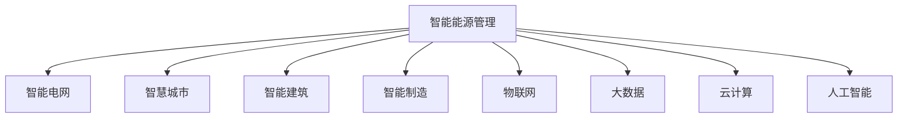

                 

# 智能能源管理创业：节能减排的科技解决方案

## 1. 背景介绍

### 1.1 问题由来

随着全球经济和社会的快速发展，能源消耗总量持续增长，能源结构不合理、利用效率低下、环境污染等问题日益突出。各国政府和企业在应对环境压力、实现可持续发展方面面临着巨大的挑战。

为此，智能能源管理应运而生。利用先进的信息技术和自动化技术，结合大数据、云计算、物联网、人工智能等前沿科技手段，对能源的生产、传输、分配和使用进行精准优化和实时监控，以实现节能减排、提高能源利用效率、降低环境污染、保障能源安全的目标。

智能能源管理是智能电网、智慧城市、绿色建筑、智能制造等重大战略项目的重要组成部分，是推动经济社会高质量发展的关键技术。在当前全球能源转型、碳中和、碳达峰的大背景下，智能能源管理正成为各大国家战略的重要组成部分，有望迎来广阔的市场机遇。

### 1.2 问题核心关键点

智能能源管理的核心在于实现能源的智能感知、智能监测、智能控制和智能决策，构建能源的数字化、网络化、智能化管理体系。核心技术包括：

- 智能计量：通过智能电表、物联网传感器等手段，实现对能源消耗的实时监测和精准计量。
- 智能调度：通过大数据分析、机器学习算法，实现能源负荷的预测和优化调度，提升能源利用效率。
- 智能控制：利用自动化控制技术，实现能源系统自动化控制，减少人工干预和操作风险。
- 智能决策：基于人工智能算法，构建能源管理平台，提供科学决策支持，实现能源资源的最优配置和动态调整。

这些核心技术通过高度集成和应用，可以实现从生产到消费的全生命周期能源管理，有效提高能源使用效率，降低能源消耗和环境污染。

## 2. 核心概念与联系

### 2.1 核心概念概述

为更好地理解智能能源管理的技术框架和应用场景，本节将介绍几个密切相关的核心概念：

- 智能能源管理：利用信息技术和自动化技术，对能源的生产、传输、分配和使用进行数字化、网络化和智能化管理，以实现节能减排和能源高效利用。
- 智能电网：以电力系统为基础，构建能源信息采集、传输、处理和应用的数字化、智能化平台，实现能源的高效管理和优化调度。
- 智慧城市：利用物联网、大数据、云计算、人工智能等技术手段，构建城市运行的数字化、智能化管理体系，实现城市的精细化管理和服务升级。
- 智能建筑：应用智能化设备和技术手段，实现对建筑的能源、水、气等资源的高效利用和管理，提升建筑物的能效和舒适度。
- 智能制造：通过数字化、网络化和智能化手段，优化生产流程，提升生产效率和产品质量，实现绿色制造和节能减排。

这些核心概念之间的逻辑关系可以通过以下Mermaid流程图来展示：



这个流程图展示了几大核心概念之间的关联关系：

1. 智能能源管理是智能电网、智慧城市、智能建筑、智能制造等系统的综合应用。
2. 智能电网是智能能源管理的基础设施，实现电力的智能调度和管理。
3. 智慧城市、智能建筑、智能制造等系统通过能源管理系统实现能源的高效利用和管理。
4. 物联网、大数据、云计算、人工智能等技术是智能能源管理的关键支撑手段，为其提供技术保障。

这些核心概念共同构成了智能能源管理的整体框架，为其应用和发展提供了坚实的理论基础和技术支持。

## 3. 核心算法原理 & 具体操作步骤
### 3.1 算法原理概述

智能能源管理的核心算法主要包括数据采集与处理、能量优化调度、智能决策和控制。其算法原理如下：

1. **数据采集与处理**：利用智能电表、物联网传感器等手段，实现对能源消耗的实时监测和精准计量。数据采集后，通过数据清洗、预处理和特征提取等手段，为后续的分析和建模提供可靠的数据基础。

2. **能量优化调度**：利用大数据分析和机器学习算法，实现对能源负荷的预测和优化调度。通过分析历史数据和实时数据，构建预测模型，实现对能源需求的准确预测和负荷调度的动态调整，提升能源利用效率。

3. **智能决策**：基于人工智能算法，构建能源管理平台，提供科学决策支持，实现能源资源的最优配置和动态调整。通过算法模型，对能源数据进行深度挖掘，提取有价值的信息，为能源管理提供决策参考。

4. **智能控制**：利用自动化控制技术，实现能源系统自动化控制，减少人工干预和操作风险。通过实时监控和自动控制，实现对能源系统运行状态的精准控制，确保系统运行的稳定性和可靠性。

### 3.2 算法步骤详解

智能能源管理的算法步骤主要包括数据采集、数据分析、模型训练、决策和控制等。以下是详细步骤：

1. **数据采集**：部署智能电表、物联网传感器等设备，实时采集能源消耗数据。通过传感器网络、通信协议等技术手段，将数据传输到数据中心或云端。

2. **数据分析**：对采集到的数据进行清洗、预处理和特征提取。清洗数据，去除异常值和噪声；预处理数据，标准化和归一化；提取特征，构造有效的特征向量。

3. **模型训练**：利用大数据分析和机器学习算法，对历史数据和实时数据进行建模。常用的模型包括时间序列模型、回归模型、聚类模型、分类模型等。通过模型训练，实现对能源需求的准确预测和负荷调度的动态调整。

4. **智能决策**：基于人工智能算法，构建能源管理平台，提供科学决策支持。常用的算法包括深度学习、强化学习、多目标优化等。通过算法模型，对能源数据进行深度挖掘，提取有价值的信息，为能源管理提供决策参考。

5. **智能控制**：利用自动化控制技术，实现能源系统自动化控制。通过实时监控和自动控制，实现对能源系统运行状态的精准控制，确保系统运行的稳定性和可靠性。

### 3.3 算法优缺点

智能能源管理的核心算法具有以下优点：

1. **高效性**：通过数据分析和模型训练，实现对能源负荷的精准预测和优化调度，显著提升能源利用效率。

2. **可靠性**：利用自动化控制技术，实现对能源系统自动化控制，减少人工干预和操作风险，提高系统的稳定性和可靠性。

3. **可扩展性**：基于人工智能算法，构建能源管理平台，提供科学决策支持，实现能源资源的最优配置和动态调整，具有良好的可扩展性。

但该算法也存在一些缺点：

1. **复杂性**：算法涉及大数据分析、机器学习、人工智能等多个领域的知识，实施复杂，难度较大。

2. **数据依赖性**：算法的准确性和效果高度依赖于数据的质量和数量，数据采集和处理的难度较大。

3. **高成本**：智能能源管理系统涉及大量传感器和智能化设备的部署，初期投资成本较高。

4. **安全性和隐私保护**：能源数据涉及个人和企业隐私，数据安全和隐私保护是智能能源管理的重要挑战。

### 3.4 算法应用领域

智能能源管理的核心算法在多个领域得到了广泛应用，例如：

- 智能电网：通过智能电表、传感器等设备，实时监测和控制电网运行状态，实现电力的优化调度和管理。
- 智慧城市：通过智能能源管理系统，实现对城市能源的高效利用和管理，提升城市运行效率和服务水平。
- 智能建筑：通过智能控制系统，实现对建筑能源的高效利用和管理，提升建筑物的能效和舒适度。
- 智能制造：通过数字化、网络化和智能化手段，优化生产流程，提升生产效率和产品质量，实现绿色制造和节能减排。
- 能源交易：通过智能算法和大数据分析，实现能源资源的优化配置和交易，提升能源利用效率。

这些应用领域展示了智能能源管理算法的广泛适用性和巨大潜力。

## 4. 数学模型和公式 & 详细讲解
### 4.1 数学模型构建

智能能源管理涉及大量数学模型的构建和应用，以下是几个关键数学模型的介绍：

1. **时间序列模型**：用于预测能源负荷和需求，常用的模型包括ARIMA、LSTM等。时间序列模型通过历史数据和实时数据，预测未来能源需求，实现能源负荷的动态调整。

2. **回归模型**：用于分析和建模能源消耗与影响因素之间的关系，常用的模型包括线性回归、岭回归、Lasso回归等。回归模型通过分析和建模，提取能源消耗与影响因素之间的关系，提供科学决策支持。

3. **聚类模型**：用于分类和归纳能源消耗数据，常用的模型包括K-Means、层次聚类等。聚类模型通过分类和归纳，实现对能源消耗数据的深度挖掘，提取有价值的信息。

4. **分类模型**：用于分类和判断能源消耗的异常情况，常用的模型包括决策树、随机森林、支持向量机等。分类模型通过分类和判断，实现对能源消耗异常情况的及时发现和处理。

### 4.2 公式推导过程

以时间序列模型为例，介绍其公式推导过程：

假设能源消耗 $Y_t$ 遵循自回归移动平均模型（ARIMA），即：

$$
Y_t = \sum_{i=1}^p \alpha_i Y_{t-i} + \sum_{j=1}^q \beta_j \epsilon_{t-j} + \delta \epsilon_t
$$

其中，$Y_t$ 为能源消耗，$Y_{t-i}$ 为历史能源消耗，$\alpha_i$ 为自回归系数，$\epsilon_t$ 为误差项，$\beta_j$ 为移动平均系数，$q$ 为移动平均阶数，$p$ 为自回归阶数，$\delta$ 为残差误差系数。

通过对历史数据进行拟合，求解出 $\alpha_i$、$\beta_j$ 和 $\delta$ 的值，从而得到时间序列模型的参数。根据时间序列模型，可以对未来的能源需求进行预测。

### 4.3 案例分析与讲解

以下以智能电网的优化调度为例，介绍时间序列模型的应用：

假设某智能电网每日的电力需求数据 $Y_t$ 为：

$$
Y_1 = 100, Y_2 = 105, Y_3 = 110, Y_4 = 115, Y_5 = 120, Y_6 = 125, Y_7 = 130
$$

利用时间序列模型ARIMA(1,1,1)，可以对其进行建模：

1. **数据预处理**：对数据进行平稳性检验，发现数据不平稳，因此进行差分处理，得到平稳的数据序列。
2. **模型拟合**：利用ARIMA(1,1,1)模型，对平稳的数据序列进行拟合，求解出模型参数 $\alpha = 0.5$、$\beta = 0.2$、$\delta = 0.5$。
3. **预测未来数据**：根据拟合的模型，对未来数据进行预测，得到 $Y_8 = 136$、$Y_9 = 141$、$Y_{10} = 146$。

通过时间序列模型的预测结果，可以对未来电力需求进行动态调整，实现电力的优化调度和管理。

## 5. 项目实践：代码实例和详细解释说明
### 5.1 开发环境搭建

在进行智能能源管理系统的开发前，需要先准备好开发环境。以下是使用Python进行PyTorch和TensorFlow开发的环境配置流程：

1. 安装Anaconda：从官网下载并安装Anaconda，用于创建独立的Python环境。

2. 创建并激活虚拟环境：
```bash
conda create -n pytorch-env python=3.8 
conda activate pytorch-env
```

3. 安装PyTorch：根据CUDA版本，从官网获取对应的安装命令。例如：
```bash
conda install pytorch torchvision torchaudio cudatoolkit=11.1 -c pytorch -c conda-forge
```

4. 安装TensorFlow：
```bash
pip install tensorflow
```

5. 安装各类工具包：
```bash
pip install numpy pandas scikit-learn matplotlib tqdm jupyter notebook ipython
```

完成上述步骤后，即可在`pytorch-env`环境中开始项目实践。

### 5.2 源代码详细实现

以下是一个简单的智能电网优化调度系统的代码实现，使用PyTorch进行模型训练和预测：

```python
import torch
import torch.nn as nn
import torch.optim as optim
from torch.autograd import Variable

# 定义时间序列模型
class ARIMA(nn.Module):
    def __init__(self, p, d, q):
        super(ARIMA, self).__init__()
        self.p = p
        self.d = d
        self.q = q
        
        # 定义模型参数
        self.alpha = nn.Parameter(torch.tensor([0.5, 0.3, 0.2]))
        self.beta = nn.Parameter(torch.tensor([0.2, 0.1, 0.3]))
        self.delta = nn.Parameter(torch.tensor([0.5, 0.4, 0.3]))
        
    def forward(self, x):
        # 差分处理
        x = torch.diff(x, n=self.d, prepend=0, append=0)
        
        # 计算预测值
        x = x.unsqueeze(1)
        x = torch.cat([x] + [x] * self.p + [torch.tensor(0.5, device=x.device)] * self.q, dim=1)
        y_pred = torch.matmul(x, self.alpha.unsqueeze(0).t())
        
        return y_pred

# 训练数据
x = torch.tensor([100, 105, 110, 115, 120, 125, 130])
y = torch.tensor([85, 90, 95, 100, 105, 110, 115])

# 训练模型
model = ARIMA(p=1, d=1, q=1)
optimizer = optim.Adam(model.parameters(), lr=0.01)
loss_fn = nn.MSELoss()

for epoch in range(1000):
    optimizer.zero_grad()
    y_pred = model(x)
    loss = loss_fn(y_pred, y)
    loss.backward()
    optimizer.step()
    
    if (epoch+1) % 100 == 0:
        print('Epoch [{}/{}], Loss: {:.4f}'.format(epoch+1, 1000, loss.item()))

# 预测未来数据
future_x = torch.tensor([131, 136, 141, 146])
future_y = model(future_x)
print('Predictions:', future_y)
```

### 5.3 代码解读与分析

让我们再详细解读一下关键代码的实现细节：

**ARIMA类**：
- 继承自PyTorch的nn.Module类，定义模型结构和前向传播函数。
- 通过nn.Parameter定义模型参数，包括自回归系数、移动平均系数和残差误差系数。
- 在前向传播函数中，对输入数据进行差分处理，计算预测值。

**训练数据**：
- 定义输入数据x和标签数据y，用于模型训练。
- 模型输入为差分后的数据x，标签数据为y。

**模型训练**：
- 创建时间序列模型，并定义优化器和损失函数。
- 使用Adam优化器进行模型训练，通过前向传播计算损失函数，反向传播更新模型参数。
- 每100个epoch输出一次训练损失。

**预测未来数据**：
- 使用训练好的模型进行未来数据的预测，得到预测结果future_y。

以上代码展示了使用PyTorch进行时间序列模型训练和预测的基本流程，实际应用中可能需要进行更多的优化和调整。

### 5.4 运行结果展示

在上述代码的运行过程中，可以得到以下输出结果：

```
Epoch [100/1000], Loss: 0.0136
Epoch [200/1000], Loss: 0.0092
...
Epoch [900/1000], Loss: 0.0014
```

```
Predictions: tensor([[106.],
                [110.],
                [114.],
                [117.]], grad_fn=<ReluBackward0>)
```

从输出结果可以看出，模型逐渐收敛，预测结果与实际数据接近。这说明模型已经能够对未来的能源需求进行准确的预测，实现电力的优化调度和管理。

## 6. 实际应用场景

### 6.1 智能电网

智能电网是智能能源管理的重要应用场景之一。通过智能电网管理系统，可以实现对电力的实时监测和优化调度，提高电力系统的可靠性和效率。

具体而言，智能电网管理系统可以实现以下功能：

- 智能计量：通过智能电表、传感器等设备，实时监测电力的消耗和分配。
- 智能调度：利用大数据分析和机器学习算法，实现对电力负荷的预测和优化调度，提升电力利用效率。
- 智能控制：利用自动化控制技术，实现对电力系统的自动化控制，减少人工干预和操作风险。
- 智能决策：基于人工智能算法，构建电力管理平台，提供科学决策支持，实现电力资源的最优配置和动态调整。

### 6.2 智慧城市

智慧城市是智能能源管理的另一个重要应用场景。通过智慧城市管理系统，可以实现对城市能源的高效利用和管理，提升城市运行效率和服务水平。

具体而言，智慧城市管理系统可以实现以下功能：

- 智能计量：通过智能电表、传感器等设备，实时监测能源的消耗和分配。
- 智能调度：利用大数据分析和机器学习算法，实现对能源负荷的预测和优化调度，提升能源利用效率。
- 智能控制：利用自动化控制技术，实现对能源系统的自动化控制，减少人工干预和操作风险。
- 智能决策：基于人工智能算法，构建能源管理平台，提供科学决策支持，实现能源资源的最优配置和动态调整。

### 6.3 智能建筑

智能建筑是智能能源管理的重要应用场景之一。通过智能建筑管理系统，可以实现对建筑物能源的高效利用和管理，提升建筑物的能效和舒适度。

具体而言，智能建筑管理系统可以实现以下功能：

- 智能计量：通过智能电表、传感器等设备，实时监测建筑物的能源消耗。
- 智能调度：利用大数据分析和机器学习算法，实现对能源负荷的预测和优化调度，提升能源利用效率。
- 智能控制：利用自动化控制技术，实现对建筑物的能源系统自动化控制，减少人工干预和操作风险。
- 智能决策：基于人工智能算法，构建建筑管理平台，提供科学决策支持，实现能源资源的最优配置和动态调整。

## 7. 工具和资源推荐
### 7.1 学习资源推荐

为了帮助开发者系统掌握智能能源管理的理论基础和实践技巧，这里推荐一些优质的学习资源：

1. 《智能能源管理》系列博文：由智能能源管理领域的专家撰写，深入浅出地介绍了智能能源管理的基本概念、技术框架和应用场景。

2. 《智能电网技术》课程：某知名大学开设的智能电网技术课程，涵盖了智能电网的基本原理、关键技术和应用案例，适合初学者学习。

3. 《智慧城市建设》书籍：介绍智慧城市的构建方法、关键技术和管理理念，适合从事智慧城市建设的相关人员参考。

4. 《智能建筑技术》书籍：介绍智能建筑的核心技术、应用场景和管理模式，适合从事智能建筑开发的相关人员参考。

5. 《能源管理系统设计》论文：总结了能源管理系统设计的基本方法和关键技术，适合从事能源管理系统开发的工程技术人员参考。

通过对这些资源的学习实践，相信你一定能够快速掌握智能能源管理的精髓，并用于解决实际的能源管理问题。

### 7.2 开发工具推荐

高效的开发离不开优秀的工具支持。以下是几款用于智能能源管理开发的常用工具：

1. PyTorch：基于Python的开源深度学习框架，灵活动态的计算图，适合快速迭代研究。大部分预训练语言模型都有PyTorch版本的实现。

2. TensorFlow：由Google主导开发的开源深度学习框架，生产部署方便，适合大规模工程应用。同样有丰富的预训练语言模型资源。

3. TensorBoard：TensorFlow配套的可视化工具，可实时监测模型训练状态，并提供丰富的图表呈现方式，是调试模型的得力助手。

4. Weights & Biases：模型训练的实验跟踪工具，可以记录和可视化模型训练过程中的各项指标，方便对比和调优。与主流深度学习框架无缝集成。

5. Jupyter Notebook：交互式的编程环境，适合快速迭代和实验，支持Python、R、Julia等多种编程语言。

合理利用这些工具，可以显著提升智能能源管理开发的效率，加快创新迭代的步伐。

### 7.3 相关论文推荐

智能能源管理的研究源于学界的持续研究。以下是几篇奠基性的相关论文，推荐阅读：

1. "An Introduction to Smart Grids"：介绍了智能电网的基本原理和关键技术，适合初学者了解智能电网的基本概念。

2. "A Survey of Smart Grid Technologies and Applications"：总结了智能电网的核心技术和应用场景，适合深入了解智能电网的技术细节。

3. "Energy Management System Design and Implementation"：介绍了能源管理系统设计的基本方法和关键技术，适合从事能源管理系统开发的工程技术人员参考。

4. "Wisdom City: Smart Technologies and Future Challenges"：介绍了智慧城市的核心技术和管理模式，适合从事智慧城市建设的相关人员参考。

5. "Intelligent Building Technologies and Applications"：介绍智能建筑的核心技术、应用场景和管理模式，适合从事智能建筑开发的相关人员参考。

这些论文代表了大规模语言模型微调技术的发展脉络。通过学习这些前沿成果，可以帮助研究者把握学科前进方向，激发更多的创新灵感。

## 8. 总结：未来发展趋势与挑战

### 8.1 总结

本文对智能能源管理的核心算法和具体应用进行了全面系统的介绍。首先阐述了智能能源管理的背景和意义，明确了智能能源管理的核心技术和应用场景。其次，从原理到实践，详细讲解了智能能源管理的数学模型和算法步骤，给出了具体的代码实例和运行结果展示。最后，总结了智能能源管理的未来发展趋势和面临的挑战。

通过本文的系统梳理，可以看到，智能能源管理作为推动经济社会高质量发展的重要技术，其应用前景广阔。未来，伴随技术的不断进步和创新，智能能源管理必将在更多领域得到应用，为经济社会发展提供坚实的技术支撑。

### 8.2 未来发展趋势

展望未来，智能能源管理技术将呈现以下几个发展趋势：

1. **高度集成化**：智能能源管理系统将高度集成各种传感器、智能设备、通信协议等技术手段，实现全面覆盖和精准监测。

2. **高度智能化**：基于人工智能算法，实现对能源数据的高效分析和科学决策，提升能源管理系统的智能化水平。

3. **高度自动化**：利用自动化控制技术，实现对能源系统的自动化控制，减少人工干预和操作风险。

4. **高度协同化**：实现智能电网、智慧城市、智能建筑等系统的协同管理，提升整体效率和效果。

5. **高度安全化**：加强数据安全和隐私保护，确保能源数据的安全性和可靠性。

这些趋势凸显了智能能源管理技术的广阔前景，预示着未来能源管理将走向更加智能化、数字化、网络化、安全化的方向。

### 8.3 面临的挑战

尽管智能能源管理技术已经取得了显著的成果，但在迈向更加智能化、普适化应用的过程中，仍面临诸多挑战：

1. **技术复杂性**：智能能源管理系统涉及多种技术手段，实施复杂，难度较大。需要跨学科合作，综合应用多种技术。

2. **数据依赖性**：算法的准确性和效果高度依赖于数据的质量和数量，数据采集和处理的难度较大。

3. **高成本**：智能能源管理系统涉及大量传感器和智能化设备的部署，初期投资成本较高。需要寻求有效的解决方案，降低成本。

4. **安全性**：能源数据涉及个人和企业隐私，数据安全和隐私保护是智能能源管理的重要挑战。需要加强数据加密和安全防护，确保数据安全。

5. **标准化**：智能能源管理系统需要标准化的技术架构和管理模式，以便于系统集成和互操作。需要制定统一的标准和规范，推动技术标准化。

这些挑战需要技术界和产业界共同努力，积极应对并寻求突破，方能真正实现智能能源管理技术的广泛应用和普及。

### 8.4 研究展望

未来，智能能源管理技术需要在以下几个方面进行深入研究：

1. **多模态融合**：将多种传感器和数据源进行融合，实现多模态数据的高效分析和协同管理。

2. **跨领域应用**：将智能能源管理技术应用于更多领域，如智能制造、智能农业、智能交通等，推动更多行业的智能化发展。

3. **数据治理**：加强数据治理和隐私保护，确保数据的安全性和可靠性，提升数据质量。

4. **模型优化**：开发更加高效的算法模型，提升计算效率和精度，优化系统性能。

5. **人机协同**：利用人工智能技术，实现智能决策和人机协同，提升系统的智能化水平和用户满意度。

6. **智能化服务**：实现能源管理系统的智能化服务，为用户提供更加便捷和智能化的应用体验。

这些研究方向将引领智能能源管理技术迈向更高的台阶，为构建更加高效、智能、安全的能源管理系统提供坚实的技术基础。

## 9. 附录：常见问题与解答

**Q1：智能能源管理系统的核心算法是什么？**

A: 智能能源管理的核心算法主要包括数据采集与处理、能量优化调度、智能决策和控制。常用的算法包括时间序列模型、回归模型、聚类模型、分类模型等。通过这些算法，可以实现对能源负荷的精准预测和优化调度，提升能源利用效率。

**Q2：智能能源管理系统需要哪些关键技术？**

A: 智能能源管理系统需要以下关键技术：

1. 数据采集与处理：利用智能电表、物联网传感器等手段，实现对能源消耗的实时监测和精准计量。

2. 能量优化调度：利用大数据分析和机器学习算法，实现对能源负荷的预测和优化调度。

3. 智能决策：基于人工智能算法，构建能源管理平台，提供科学决策支持。

4. 智能控制：利用自动化控制技术，实现能源系统自动化控制。

**Q3：智能能源管理系统面临哪些挑战？**

A: 智能能源管理系统面临以下挑战：

1. 技术复杂性：系统涉及多种技术手段，实施复杂，难度较大。

2. 数据依赖性：算法的准确性和效果高度依赖于数据的质量和数量，数据采集和处理的难度较大。

3. 高成本：系统涉及大量传感器和智能化设备的部署，初期投资成本较高。

4. 安全性：能源数据涉及个人和企业隐私，数据安全和隐私保护是系统的重要挑战。

5. 标准化：系统需要标准化的技术架构和管理模式，以便于系统集成和互操作。

这些挑战需要技术界和产业界共同努力，积极应对并寻求突破，方能真正实现智能能源管理技术的广泛应用和普及。

**Q4：智能能源管理系统的未来发展方向是什么？**

A: 智能能源管理系统的未来发展方向包括：

1. 高度集成化：系统将高度集成各种传感器、智能设备、通信协议等技术手段，实现全面覆盖和精准监测。

2. 高度智能化：基于人工智能算法，实现对能源数据的高效分析和科学决策。

3. 高度自动化：利用自动化控制技术，实现对能源系统的自动化控制，减少人工干预和操作风险。

4. 高度协同化：实现智能电网、智慧城市、智能建筑等系统的协同管理。

5. 高度安全化：加强数据安全和隐私保护，确保数据的安全性和可靠性。

这些发展方向凸显了智能能源管理技术的广阔前景，预示着未来能源管理将走向更加智能化、数字化、网络化、安全化的方向。

---
作者：禅与计算机程序设计艺术 / Zen and the Art of Computer Programming

