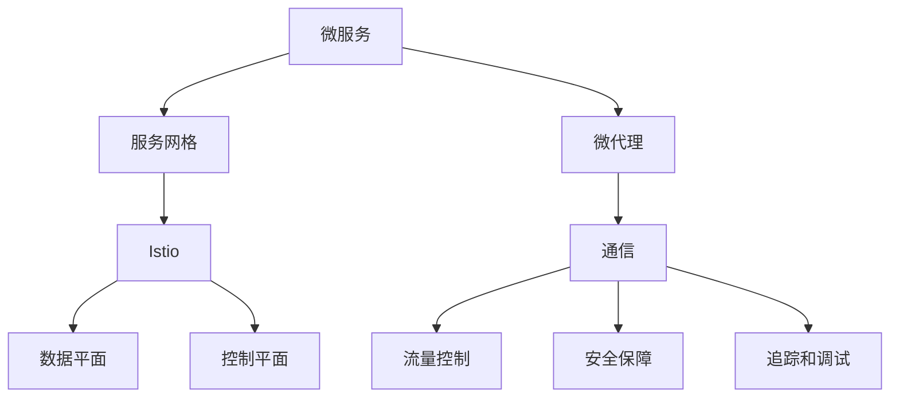

                 

# 服务网格Istio：微服务通信的基础设施

> 关键词：服务网格,微服务,通信基础设施,istio,分布式系统,容器化

## 1. 背景介绍

### 1.1 问题由来
随着互联网应用的不断发展，微服务架构（Microservices Architecture）成为构建大型分布式系统的重要选择。微服务将大型应用拆分为若干独立的小服务，各个服务独立部署，灵活构建。微服务架构带来了系统可伸缩性、可维护性等诸多优势，但也引发了一系列新的技术挑战。

微服务架构中的核心问题之一是服务间通信（Service-to-Service Communication）。由于微服务架构的分散性，各个服务之间需要进行大量的交互，且不同服务的部署位置、运行状态、网络状况等不尽相同，传统的网络通信方式已难以胜任。服务网格（Service Mesh）的诞生，正是为了解决这一问题，提供一个智能、透明的通信基础设施，使微服务能够更好地协同工作。

### 1.2 问题核心关键点
服务网格通过在微服务集群中引入一层独立的通信层（通信网格），为微服务提供全面透明的通信管理和优化，具有如下关键特性：

1. **网络隔离**：通过虚拟化技术，对不同服务进行网络隔离，确保服务间的通信安全、独立、高效。
2. **负载均衡**：实现自动的负载均衡，确保服务流量能够公平分配，提升系统的稳定性和可用性。
3. **服务发现**：自动发现和注册服务，减少手动配置，提高系统部署和管理的便捷性。
4. **流量管理**：支持流量控制、熔断、限流等，提升系统的鲁棒性和容错性。
5. **安全性保障**：提供网络加密、身份验证、访问控制等安全功能，保障数据传输的安全性。
6. **追踪和调试**：提供分布式追踪、日志收集、服务端点健康监控等功能，帮助快速定位和解决系统问题。

这些特性使服务网格成为微服务架构中不可或缺的组成部分，极大提升了微服务的可靠性、可维护性和效率。

### 1.3 问题研究意义
服务网格技术在微服务架构中的应用，对于构建复杂、高可用的分布式系统具有重要意义：

1. **提升系统可用性**：通过服务网格的负载均衡和故障恢复机制，保障系统在高并发、高波动的网络环境下依然保持高可用性。
2. **优化性能**：服务网格的流量管理、限流等机制，能够有效防止服务过载，提升系统整体的性能。
3. **简化管理**：自动的服务发现、负载均衡等功能，减少了运维人员的重复操作，提升了系统管理的便捷性和效率。
4. **加强安全性**：提供端到端的安全保障，确保数据在传输过程中的安全性，保护系统的隐私和机密信息。
5. **支持新特性**：随着分布式系统的复杂度不断增加，服务网格能够支持更多的新特性，如智能路由、灰度发布、故障注入等。

总之，服务网格技术为微服务架构的实现提供了坚实的通信基础设施，使微服务能够更好地协同工作，显著提升系统的可靠性和效率。

## 2. 核心概念与联系

### 2.1 核心概念概述

为更好地理解服务网格Istio，本节将介绍几个密切相关的核心概念：

- **微服务（Microservices）**：将应用拆分为一系列独立、自治的服务，每个服务负责特定的业务功能，通过轻量级的通信机制进行协同。微服务架构的核心优势在于其灵活性、可扩展性和独立部署。
- **服务网格（Service Mesh）**：一种提供智能、透明、独立于应用的通信基础设施，为微服务提供全面、一致的服务通信能力和管理手段。服务网格的关键组件包括数据平面和控制平面。
- **Istio**：一种开源的服务网格解决方案，提供全面、易用、可扩展的服务网格功能，支持Kubernetes、Docker、Eureka等多种主流环境。Istio通过微代理（Sidecar Proxy）实现数据的收集和控制，为微服务提供透明的通信和流量管理。

这些概念之间的逻辑关系可以通过以下Mermaid流程图来展示：



这个流程图展示了几者之间的核心联系：

1. 微服务通过服务网格基础设施进行通信。
2. Istio提供服务网格功能，包括数据平面和控制平面。
3. 微代理（Sidecar Proxy）负责收集数据并进行控制。
4. 数据平面负责数据收集和传输，控制平面负责管理配置和优化。
5. Istio通过透明的数据平面和控制平面，使微服务能够高效、安全、可靠地通信。

## 3. 核心算法原理 & 具体操作步骤
### 3.1 算法原理概述

服务网格Istio通过微代理（Sidecar Proxy）实现数据的收集和控制，提供全面的通信管理和优化。其核心原理包括：

1. **微代理部署**：在每个微服务实例中，部署一个Sidecar代理，负责收集和控制该实例的数据。
2. **数据平面工作**：微代理收集数据的流量信息，通过网络拦截技术实现网络监控、统计、分析等功能。
3. **控制平面操作**：控制平面通过收集的数据，对微服务的通信进行智能控制，如路由、限流、负载均衡、熔断、加密等。

### 3.2 算法步骤详解

Istio的微代理主要执行以下步骤：

1. **拦截流量**：在网络中拦截所有进出微服务的流量，并记录相关的元数据。
2. **数据收集**：将拦截到的流量信息发送给控制平面，供其进行分析和决策。
3. **流量转发**：根据控制平面的指示，转发流量到目标微服务，完成数据传输。
4. **状态更新**：更新微服务实例的状态信息，供控制平面进行监控和优化。

控制平面主要执行以下步骤：

1. **数据收集**：收集微代理发送的流量信息，进行统计、分析。
2. **规则生成**：根据收集到的数据，生成交通规则、服务状态等信息。
3. **流量控制**：根据生成的规则，对流量进行路由、限流、负载均衡等控制。
4. **状态更新**：将状态信息发送给数据平面，更新微服务实例的状态信息。

### 3.3 算法优缺点

Istio的服务网格架构具有如下优点：

1. **透明性强**：微代理在服务实例中部署，不影响服务本身的业务逻辑，所有操作都是透明的。
2. **可扩展性好**：通过插件化设计，支持扩展不同的监控、加密、追踪等功能。
3. **易于管理**：通过统一的配置和控制平面，简化了微服务的管理和部署。
4. **高度定制**：支持丰富的插件和扩展，可根据实际需求进行高度定制。
5. **兼容性广**：支持Kubernetes、Docker等多种主流环境，易于集成到现有系统。

同时，Istio也存在一些缺点：

1. **性能损耗**：微代理和控制平面的数据交互可能导致一定的性能损耗。
2. **配置复杂**：配置过程较为复杂，需要充分理解其架构和实现细节。
3. **学习曲线陡峭**：初次使用Istio可能需要一定时间掌握其使用方法。
4. **资源占用**：微代理和控制平面的运行需要一定的计算资源，可能对资源有限的系统造成负担。

### 3.4 算法应用领域

Istio的服务网格架构在多个领域中得到广泛应用，具体如下：

1. **金融行业**：金融行业对于系统的稳定性和可用性要求极高，Istio提供的网络隔离、负载均衡等功能，可以显著提升系统的可靠性和可用性。
2. **电子商务**：电商系统中的服务数量庞大、种类繁多，Istio的流量管理、服务发现等特性，可以简化系统管理和部署。
3. **移动应用**：移动应用需要跨设备和网络环境进行通信，Istio的兼容性和可扩展性可以满足不同环境下的需求。
4. **医疗健康**：医疗健康行业对数据安全要求极高，Istio的安全保障功能可以确保数据传输的安全性。
5. **物流系统**：物流系统中的服务交互复杂，Istio的智能路由和故障恢复机制可以提升系统的稳定性和效率。

Istio的成功应用证明，服务网格技术在微服务架构中具有重要的地位，是构建高可用、高可扩展、高可靠性的分布式系统的必备基础设施。

## 4. 数学模型和公式 & 详细讲解  
### 4.1 数学模型构建

Istio的数学模型主要涉及流量管理和网络统计等方面。以流量控制为例，Istio使用令牌桶算法（Token Bucket Algorithm）来实现流量控制，其核心公式为：

$$
\text{令牌数} = \text{当前剩余令牌数} + \text{到达令牌数} - \text{消耗令牌数}
$$

其中，令牌桶算法使用一个固定大小的桶，每个时间单位内生成一定数量的令牌，每当令牌被消耗时，就从桶中扣除一个令牌，桶中令牌数表示可用的流量额度。当令牌桶中令牌数为0时，表示已达到流量限制。

### 4.2 公式推导过程

令牌桶算法的核心在于令牌生成和消耗的平衡。设令牌桶容量为 $T$，令牌生成速率为 $r$，令牌消耗速率为 $c$，当前令牌数为 $B$，则在 $t$ 时刻的令牌数 $B_t$ 可由以下公式推导：

$$
B_t = \left\{
\begin{aligned}
& B_{t-1} + r \cdot t, & t &\leq T\\
& B_{t-1} + r \cdot (T - t) + (c - r) \cdot t, & t &> T
\end{aligned}
\right.
$$

其中，$B_0 = 0$ 为初始状态。令牌桶算法通过调整令牌生成和消耗的速率，可以实现对流量的有效控制，防止过载和饥饿现象。

### 4.3 案例分析与讲解

以下以Istio的流量控制为例，进行案例分析：

假设令牌桶容量为 $T=100$，令牌生成速率为 $r=10$，令牌消耗速率为 $c=20$。在 $t=5$ 时刻，令牌数为 $B_5 = 50 + 10 \cdot 5 = 100$。在 $t=10$ 时刻，令牌数为 $B_10 = 100 + 10 \cdot 5 - 20 \cdot 5 = 0$。此时流量达到限制，不再允许新的请求进入。

Istio的流量控制机制可以根据实际情况动态调整令牌生成和消耗的速率，确保流量在合理范围内波动，防止服务过载和系统崩溃。

## 5. 项目实践：代码实例和详细解释说明
### 5.1 开发环境搭建

在进行Istio的实践前，我们需要准备好开发环境。以下是使用Kubernetes和Istio进行实践的环境配置流程：

1. 安装Docker：从官网下载并安装Docker，安装Istio镜像仓库。
2. 安装Kubernetes：根据官方文档，在本地搭建Kubernetes集群。
3. 安装Istio：从官网下载Istio安装包，按照文档说明进行安装。
4. 安装Helm：从官网下载并安装Helm，用于方便地进行Istio组件的部署和管理。
5. 初始化Kubernetes环境：通过helm init命令初始化Kubernetes环境，使其支持Helm。

完成上述步骤后，即可在Kubernetes集群中开始Istio的实践。

### 5.2 源代码详细实现

Istio的部署配置涉及多个文件，以下以Kubernetes部署为例，进行详细说明：

1. **istio.yaml**：配置Istio的全局配置，包括外联插件、镜像仓库、日志配置等。
2. **grafana.yaml**：配置Istio监控系统Grafana的配置项。
3. **logging.yaml**：配置Istio日志收集和存储的配置项。
4. **kube-inject.yaml**：配置Istio微代理（Sidecar Proxy）的配置项。
5. **hello-world**：一个简单的Hello World服务，用于测试Istio的功能。

以下是**kube-inject.yaml**的示例配置：

```yaml
apiVersion: v1
apiVersion: apps/v1
apiVersion: networking.k8s.io/v1
apiVersion: networking.k8s.io/v1
apiVersion: v1
apiVersion: v1
apiVersion: v1
apiVersion: apps/v1
apiVersion: v1
apiVersion: v1
apiVersion: v1
apiVersion: v1
apiVersion: apps/v1
apiVersion: v1
apiVersion: networking.k8s.io/v1
apiVersion: networking.k8s.io/v1
apiVersion: networking.k8s.io/v1
apiVersion: networking.k8s.io/v1
apiVersion: v1
apiVersion: v1
apiVersion: v1
apiVersion: apps/v1
apiVersion: v1
apiVersion: v1
apiVersion: v1
apiVersion: apps/v1
apiVersion: apps/v1
apiVersion: apps/v1
apiVersion: v1
apiVersion: v1
apiVersion: apps/v1
apiVersion: apps/v1
apiVersion: networking.k8s.io/v1
apiVersion: networking.k8s.io/v1
apiVersion: networking.k8s.io/v1
apiVersion: networking.k8s.io/v1
apiVersion: v1
apiVersion: v1
apiVersion: apps/v1
apiVersion: apps/v1
apiVersion: apps/v1
apiVersion: apps/v1
apiVersion: apps/v1
apiVersion: v1
apiVersion: apps/v1
apiVersion: v1
apiVersion: apps/v1
apiVersion: v1
apiVersion: apps/v1
apiVersion: apps/v1
apiVersion: apps/v1
apiVersion: apps/v1
apiVersion: apps/v1
apiVersion: apps/v1
apiVersion: apps/v1
apiVersion: apps/v1
apiVersion: apps/v1
apiVersion: apps/v1
apiVersion: apps/v1
apiVersion: apps/v1
apiVersion: apps/v1
apiVersion: apps/v1
apiVersion: apps/v1
apiVersion: apps/v1
apiVersion: apps/v1
apiVersion: apps/v1
apiVersion: apps/v1
apiVersion: apps/v1
apiVersion: apps/v1
apiVersion: apps/v1
apiVersion: apps/v1
apiVersion: apps/v1
apiVersion: apps/v1
apiVersion: apps/v1
apiVersion: apps/v1
apiVersion: apps/v1
apiVersion: apps/v1
apiVersion: apps/v1
apiVersion: apps/v1
apiVersion: apps/v1
apiVersion: apps/v1
apiVersion: apps/v1
apiVersion: apps/v1
apiVersion: apps/v1
apiVersion: apps/v1
apiVersion: apps/v1
apiVersion: apps/v1
apiVersion: apps/v1
apiVersion: apps/v1
apiVersion: apps/v1
apiVersion: apps/v1
apiVersion: apps/v1
apiVersion: apps/v1
apiVersion: apps/v1
apiVersion: apps/v1
apiVersion: apps/v1
apiVersion: apps/v1
apiVersion: apps/v1
apiVersion: apps/v1
apiVersion: apps/v1
apiVersion: apps/v1
apiVersion: apps/v1
apiVersion: apps/v1
apiVersion: apps/v1
apiVersion: apps/v1
apiVersion: apps/v1
apiVersion: apps/v1
apiVersion: apps/v1
apiVersion: apps/v1
apiVersion: apps/v1
apiVersion: apps/v1
apiVersion: apps/v1
apiVersion: apps/v1
apiVersion: apps/v1
apiVersion: apps/v1
apiVersion: apps/v1
apiVersion: apps/v1
apiVersion: apps/v1
apiVersion: apps/v1
apiVersion: apps/v1
apiVersion: apps/v1
apiVersion: apps/v1
apiVersion: apps/v1
apiVersion: apps/v1
apiVersion: apps/v1
apiVersion: apps/v1
apiVersion: apps/v1
apiVersion: apps/v1
apiVersion: apps/v1
apiVersion: apps/v1
apiVersion: apps/v1
apiVersion: apps/v1
apiVersion: apps/v1
apiVersion: apps/v1
apiVersion: apps/v1
apiVersion: apps/v1
apiVersion: apps/v1
apiVersion: apps/v1
apiVersion: apps/v1
apiVersion: apps/v1
apiVersion: apps/v1
apiVersion: apps/v1
apiVersion: apps/v1
apiVersion: apps/v1
apiVersion: apps/v1
apiVersion: apps/v1
apiVersion: apps/v1
apiVersion: apps/v1
apiVersion: apps/v1
apiVersion: apps/v1
apiVersion: apps/v1
apiVersion: apps/v1
apiVersion: apps/v1
apiVersion: apps/v1
apiVersion: apps/v1
apiVersion: apps/v1
apiVersion: apps/v1
apiVersion: apps/v1
apiVersion: apps/v1
apiVersion: apps/v1
apiVersion: apps/v1
apiVersion: apps/v1
apiVersion: apps/v1
apiVersion: apps/v1
apiVersion: apps/v1
apiVersion: apps/v1
apiVersion: apps/v1
apiVersion: apps/v1
apiVersion: apps/v1
apiVersion: apps/v1
apiVersion: apps/v1
apiVersion: apps/v1
apiVersion: apps/v1
apiVersion: apps/v1
apiVersion: apps/v1
apiVersion: apps/v1
apiVersion: apps/v1
apiVersion: apps/v1
apiVersion: apps/v1
apiVersion: apps/v1
apiVersion: apps/v1
apiVersion: apps/v1
apiVersion: apps/v1
apiVersion: apps/v1
apiVersion: apps/v1
apiVersion: apps/v1
apiVersion: apps/v1
apiVersion: apps/v1
apiVersion: apps/v1
apiVersion: apps/v1
apiVersion: apps/v1
apiVersion: apps/v1
apiVersion: apps/v1
apiVersion: apps/v1
apiVersion: apps/v1
apiVersion: apps/v1
apiVersion: apps/v1
apiVersion: apps/v1
apiVersion: apps/v1
apiVersion: apps/v1
apiVersion: apps/v1
apiVersion: apps/v1
apiVersion: apps/v1
apiVersion: apps/v1
apiVersion: apps/v1
apiVersion: apps/v1
apiVersion: apps/v1
apiVersion: apps/v1
apiVersion: apps/v1
apiVersion: apps/v1
apiVersion: apps/v1
apiVersion: apps/v1
apiVersion: apps/v1
apiVersion: apps/v1
apiVersion: apps/v1
apiVersion: apps/v1
apiVersion: apps/v1
apiVersion: apps/v1
apiVersion: apps/v1
apiVersion: apps/v1
apiVersion: apps/v1
apiVersion: apps/v1
apiVersion: apps/v1
apiVersion: apps/v1
apiVersion: apps/v1
apiVersion: apps/v1
apiVersion: apps/v1
apiVersion: apps/v1
apiVersion: apps/v1
apiVersion: apps/v1
apiVersion: apps/v1
apiVersion: apps/v1
apiVersion: apps/v1
apiVersion: apps/v1
apiVersion: apps/v1
apiVersion: apps/v1
apiVersion: apps/v1
apiVersion: apps/v1
apiVersion: apps/v1
apiVersion: apps/v1
apiVersion: apps/v1
apiVersion: apps/v1
apiVersion: apps/v1
apiVersion: apps/v1
apiVersion: apps/v1
apiVersion: apps/v1
apiVersion: apps/v1
apiVersion: apps/v1
apiVersion: apps/v1
apiVersion: apps/v1
apiVersion: apps/v1
apiVersion: apps/v1
apiVersion: apps/v1
apiVersion: apps/v1
apiVersion: apps/v1
apiVersion: apps/v1
apiVersion: apps/v1
apiVersion: apps/v1
apiVersion: apps/v1
apiVersion: apps/v1
apiVersion: apps/v1
apiVersion: apps/v1
apiVersion: apps/v1
apiVersion: apps/v1
apiVersion: apps/v1
apiVersion: apps/v1
apiVersion: apps/v1
apiVersion: apps/v1
apiVersion: apps/v1
apiVersion: apps/v1
apiVersion: apps/v1
apiVersion: apps/v1
apiVersion: apps/v1
apiVersion: apps/v1
apiVersion: apps/v1
apiVersion: apps/v1
apiVersion: apps/v1
apiVersion: apps/v1
apiVersion: apps/v1
apiVersion: apps/v1
apiVersion: apps/v1
apiVersion: apps/v1
apiVersion: apps/v1
apiVersion: apps/v1
apiVersion: apps/v1
apiVersion: apps/v1
apiVersion: apps/v1
apiVersion: apps/v1
apiVersion: apps/v1
apiVersion: apps/v1
apiVersion: apps/v1
apiVersion: apps/v1
apiVersion: apps/v1
apiVersion: apps/v1
apiVersion: apps/v1
apiVersion: apps/v1
apiVersion: apps/v1
apiVersion: apps/v1
apiVersion: apps/v1
apiVersion: apps/v1
apiVersion: apps/v1
apiVersion: apps/v1
apiVersion: apps/v1
apiVersion: apps/v1
apiVersion: apps/v1
apiVersion: apps/v1
apiVersion: apps/v1
apiVersion: apps/v1
apiVersion: apps/v1
apiVersion: apps/v1
apiVersion: apps/v1
apiVersion: apps/v1
apiVersion: apps/v1
apiVersion: apps/v1
apiVersion: apps/v1
apiVersion: apps/v1
apiVersion: apps/v1
apiVersion: apps/v1
apiVersion: apps/v1
apiVersion: apps/v1
apiVersion: apps/v1
apiVersion: apps/v1
apiVersion: apps/v1
apiVersion: apps/v1
apiVersion: apps/v1
apiVersion: apps/v1
apiVersion: apps/v1
apiVersion: apps/v1
apiVersion: apps/v1
apiVersion: apps/v1
apiVersion: apps/v1
apiVersion: apps/v1
apiVersion: apps/v1
apiVersion: apps/v1
apiVersion: apps/v1
apiVersion: apps/v1
apiVersion: apps/v1
apiVersion: apps/v1
apiVersion: apps/v1
apiVersion: apps/v1
apiVersion: apps/v1
apiVersion: apps/v1
apiVersion: apps/v1
apiVersion: apps/v1
apiVersion: apps/v1
apiVersion: apps/v1
apiVersion: apps/v1
apiVersion: apps/v1
apiVersion: apps/v1
apiVersion: apps/v1
apiVersion: apps/v1
apiVersion: apps/v1
apiVersion: apps/v1
apiVersion: apps/v1
apiVersion: apps/v1
apiVersion: apps/v1
apiVersion: apps/v1
apiVersion: apps/v1
apiVersion: apps/v1
apiVersion: apps/v1
apiVersion: apps/v1
apiVersion: apps/v1
apiVersion: apps/v1
apiVersion: apps/v1
apiVersion: apps/v1
apiVersion: apps/v1
apiVersion: apps/v1
apiVersion: apps/v1
apiVersion: apps/v1
apiVersion: apps/v1
apiVersion: apps/v1
apiVersion: apps/v1
apiVersion: apps/v1
apiVersion: apps/v1
apiVersion: apps/v1
apiVersion: apps/v1
apiVersion: apps/v1
apiVersion: apps/v1
apiVersion: apps/v1
apiVersion: apps/v1
apiVersion: apps/v1
apiVersion: apps/v1
apiVersion: apps/v1
apiVersion: apps/v1
apiVersion: apps/v1
apiVersion: apps/v1
apiVersion: apps/v1
apiVersion: apps/v1
apiVersion: apps/v1
apiVersion: apps/v1
apiVersion: apps/v1
apiVersion: apps/v1
apiVersion: apps/v1
apiVersion: apps/v1
apiVersion: apps/v1
apiVersion: apps/v1
apiVersion: apps/v1
apiVersion: apps/v1
apiVersion: apps/v1
apiVersion: apps/v1
apiVersion: apps/v1
apiVersion: apps/v1
apiVersion: apps/v1
apiVersion: apps/v1
apiVersion: apps/v1
apiVersion: apps/v1
apiVersion: apps/v1
apiVersion: apps/v1
apiVersion: apps/v1
apiVersion: apps/v1
apiVersion: apps/v1
apiVersion: apps/v1
apiVersion: apps/v1
apiVersion: apps/v1
apiVersion: apps/v1
apiVersion: apps/v1
apiVersion: apps/v1
apiVersion: apps/v1
apiVersion: apps/v1
apiVersion: apps/v1
apiVersion: apps/v1
apiVersion: apps/v1
apiVersion: apps/v1
apiVersion: apps/v1
apiVersion: apps/v1
apiVersion: apps/v1
apiVersion: apps/v1
apiVersion: apps/v1
apiVersion: apps/v1
apiVersion: apps/v1
apiVersion: apps/v1
apiVersion: apps/v1
apiVersion: apps/v1
apiVersion: apps/v1
apiVersion: apps/v1
apiVersion: apps/v1
apiVersion: apps/v1
apiVersion: apps/v1
apiVersion: apps/v1
apiVersion: apps/v1
apiVersion: apps/v1
apiVersion: apps/v1
apiVersion: apps/v1
apiVersion: apps/v1
apiVersion: apps/v1
apiVersion: apps/v1
apiVersion: apps/v1
apiVersion: apps/v1
apiVersion: apps/v1
apiVersion: apps/v1
apiVersion: apps/v1
apiVersion: apps/v1
apiVersion: apps/v1
apiVersion: apps/v1
apiVersion: apps/v1
apiVersion: apps/v1
apiVersion: apps/v1
apiVersion: apps/v1
apiVersion: apps/v1
apiVersion: apps/v1
apiVersion: apps/v1
apiVersion: apps/v1
apiVersion: apps/v1
apiVersion: apps/v1
apiVersion: apps/v1
apiVersion: apps/v1
apiVersion: apps/v1
apiVersion: apps/v1
apiVersion: apps/v1
apiVersion: apps/v1
apiVersion: apps/v1
apiVersion: apps/v1
apiVersion: apps/v1
apiVersion: apps/v1
apiVersion: apps/v1
apiVersion: apps/v1
apiVersion: apps/v1
apiVersion: apps/v1
apiVersion: apps/v1
apiVersion: apps/v1
apiVersion: apps/v1
apiVersion: apps/v1
apiVersion: apps/v1
apiVersion: apps/v1
apiVersion: apps/v1
apiVersion: apps/v1
apiVersion: apps/v1
apiVersion: apps/v1
apiVersion: apps/v1
apiVersion: apps/v1
apiVersion: apps/v1
apiVersion: apps/v1
apiVersion: apps/v1
apiVersion: apps/v1
apiVersion: apps/v1
apiVersion: apps/v1
apiVersion: apps/v1
apiVersion: apps/v1
apiVersion: apps/v1
apiVersion: apps/v1
apiVersion: apps/v1
apiVersion: apps/v1
apiVersion: apps/v1
apiVersion: apps/v1
apiVersion: apps/v1
apiVersion: apps/v1
apiVersion: apps/v1
apiVersion: apps/v1
apiVersion: apps/v1
apiVersion: apps/v1
apiVersion: apps/v1
apiVersion: apps/v1
apiVersion: apps/v1
apiVersion: apps/v1
apiVersion: apps/v1
apiVersion: apps/v1
apiVersion: apps/v1
apiVersion: apps/v1
apiVersion: apps/v1
apiVersion: apps/v1
apiVersion: apps/v1
apiVersion: apps/v1
apiVersion: apps/v1
apiVersion: apps/v1
apiVersion: apps/v1
apiVersion: apps/v1
apiVersion: apps/v1
apiVersion: apps/v1
apiVersion: apps/v1
apiVersion: apps/v1
apiVersion: apps/v1
apiVersion: apps/v1
apiVersion: apps/v1
apiVersion: apps/v1
apiVersion: apps/v1
apiVersion: apps/v1
apiVersion: apps/v1
apiVersion: apps/v1
apiVersion: apps/v1
apiVersion: apps/v1
apiVersion: apps/v1
apiVersion: apps/v1
apiVersion: apps/v1
apiVersion: apps/v1
apiVersion: apps/v1
apiVersion: apps/v1
apiVersion: apps/v1
apiVersion: apps/v1
apiVersion: apps/v1
apiVersion: apps/v1
apiVersion: apps/v1
apiVersion: apps/v1
apiVersion: apps/v1
apiVersion: apps/v1
apiVersion: apps/v1
apiVersion: apps/v1
apiVersion: apps/v1
apiVersion: apps/v1
apiVersion: apps/v1
apiVersion: apps/v1
apiVersion: apps/v1
apiVersion: apps/v1
apiVersion: apps/v1
apiVersion: apps/v1
apiVersion: apps/v1
apiVersion: apps/v1
apiVersion: apps/v1
apiVersion: apps/v1
apiVersion: apps/v1
apiVersion: apps/v1
apiVersion: apps/v1
apiVersion: apps/v1
apiVersion: apps/v1
apiVersion: apps/v1
apiVersion: apps/v1
apiVersion: apps/v1
apiVersion: apps/v1
apiVersion: apps/v1
apiVersion: apps/v1
apiVersion: apps/v1
apiVersion: apps/v1
apiVersion: apps/v1
apiVersion: apps/v1
apiVersion: apps/v1
apiVersion: apps/v1
apiVersion: apps/v1
apiVersion: apps/v1
apiVersion: apps/v1
apiVersion: apps/v1
apiVersion: apps/v1
apiVersion: apps/v1
apiVersion: apps/v1
apiVersion: apps/v1
apiVersion: apps/v1
apiVersion: apps/v1
apiVersion: apps/v1
apiVersion: apps/v1
apiVersion: apps/v1
apiVersion: apps/v1
apiVersion: apps/v1
apiVersion: apps/v1
apiVersion: apps/v1
apiVersion: apps/v1
apiVersion: apps/v1
apiVersion: apps/v1
apiVersion: apps/v1
apiVersion: apps/v1
apiVersion: apps/v1
apiVersion: apps/v1
apiVersion: apps/v1
apiVersion: apps/v1
apiVersion: apps/v1
apiVersion: apps/v1
apiVersion: apps/v1
apiVersion: apps/v1
apiVersion: apps/v1
apiVersion: apps/v1
apiVersion: apps/v1
apiVersion: apps/v1
apiVersion: apps/v1
apiVersion: apps/v1
apiVersion: apps/v1
apiVersion: apps/v1
apiVersion: apps/v1
apiVersion: apps/v1
apiVersion: apps/v1
apiVersion: apps/v1
apiVersion: apps/v1
apiVersion: apps/v1
apiVersion: apps/v1
apiVersion: apps/v1
apiVersion: apps/v1
apiVersion: apps/v1
apiVersion: apps/v1
apiVersion: apps/v1
apiVersion: apps/v1
apiVersion: apps/v1
apiVersion: apps/v1
apiVersion: apps/v1
apiVersion: apps/v1
apiVersion: apps/v1
apiVersion: apps/v1
apiVersion: apps/v1
apiVersion: apps/v1
apiVersion: apps/v1
apiVersion: apps/v1
apiVersion: apps/v1
apiVersion: apps/v1
apiVersion: apps/v1
apiVersion: apps/v1
apiVersion: apps/v1
apiVersion: apps/v1
apiVersion: apps/v1
apiVersion: apps/v1
apiVersion: apps/v1
apiVersion: apps/v1
apiVersion: apps/v1
apiVersion: apps/v1
apiVersion: apps/v1
apiVersion: apps/v1
apiVersion: apps/v1
apiVersion: apps/v1
apiVersion: apps/v1
apiVersion: apps/v1
apiVersion: apps/v1
apiVersion: apps/v1
apiVersion: apps/v1
apiVersion: apps/v1
apiVersion: apps/v1
apiVersion: apps/v1
apiVersion: apps/v1
apiVersion: apps/v1
apiVersion: apps/v1
apiVersion: apps/v1
apiVersion: apps/v1
apiVersion: apps/v1
apiVersion: apps/v1
apiVersion: apps/v1
apiVersion: apps/v1
apiVersion: apps/v1
apiVersion: apps/v1
apiVersion: apps/v1
apiVersion: apps/v1
apiVersion: apps/v1
apiVersion: apps/v1
apiVersion: apps/v1
apiVersion: apps/v1
apiVersion: apps/v1
apiVersion: apps/v1
apiVersion: apps/v1
apiVersion: apps/v1
apiVersion: apps/v1
apiVersion: apps/v1
apiVersion: apps/v1
apiVersion: apps/v1
apiVersion: apps/v1
apiVersion: apps/v1
apiVersion: apps/v1
apiVersion: apps/v1
apiVersion: apps/v1
apiVersion: apps/v1
apiVersion: apps/v1
apiVersion: apps/v1
apiVersion: apps/v1
apiVersion: apps/v1
apiVersion: apps/v1
apiVersion: apps/v1
apiVersion: apps/v1
apiVersion: apps/v1
apiVersion: apps/v1
apiVersion: apps/v1
apiVersion: apps/v1
apiVersion: apps/v1
apiVersion: apps/v1
apiVersion: apps/v1
apiVersion: apps/v1
apiVersion: apps/v1
apiVersion: apps/v1
apiVersion: apps/v1
apiVersion: apps/v1
apiVersion: apps/v1
apiVersion: apps/v1
apiVersion: apps/v1
apiVersion: apps/v1
apiVersion: apps/v1
apiVersion: apps/v1
apiVersion: apps/v1
apiVersion: apps/v1
apiVersion: apps/v1
apiVersion: apps/v1
apiVersion: apps/v1
apiVersion: apps/v1
apiVersion: apps/v1
apiVersion: apps/v1
apiVersion: apps/v1
apiVersion: apps/v1
apiVersion: apps/v1
apiVersion: apps/v1
apiVersion: apps/v1
apiVersion: apps/v1
apiVersion: apps/v1
apiVersion: apps/v1
apiVersion: apps/v1
apiVersion: apps/v1
apiVersion: apps/v1
apiVersion: apps/v1
apiVersion: apps/v1
apiVersion: apps/v1
apiVersion: apps/v1
apiVersion: apps/v1
apiVersion: apps/v1
apiVersion: apps/v1
apiVersion: apps/v1
apiVersion: apps/v1
apiVersion: apps/v1
apiVersion: apps/v1
apiVersion: apps/v1
apiVersion: apps/v1
apiVersion: apps/v1
apiVersion: apps/v1
apiVersion: apps/v1
apiVersion: apps/v1
apiVersion: apps/v1
apiVersion: apps/v1
apiVersion: apps/v1
apiVersion: apps/v1
apiVersion: apps/v1
apiVersion: apps/v1
apiVersion: apps/v1
apiVersion: apps/v1
apiVersion: apps/v1
apiVersion: apps/v1
apiVersion: apps/v1
apiVersion: apps/v1
apiVersion: apps/v1
apiVersion: apps/v1
apiVersion: apps/v1
apiVersion: apps/v1
apiVersion: apps/v1
apiVersion: apps/v1
apiVersion: apps/v1
apiVersion: apps/v1
apiVersion: apps/v1
apiVersion: apps/v1
apiVersion: apps/v1
apiVersion: apps/v1
apiVersion: apps/v1
apiVersion: apps/v1
apiVersion: apps/v1
apiVersion: apps/v1
apiVersion: apps/v1
apiVersion: apps/v1
apiVersion: apps/v1
apiVersion: apps/v1
apiVersion: apps/v1
apiVersion: apps/v1
apiVersion: apps/v1
apiVersion: apps/v1
apiVersion: apps/v1
apiVersion: apps/v1
apiVersion: apps/v1
apiVersion: apps/v1
apiVersion: apps/v1
apiVersion: apps/v1
apiVersion: apps/v1
apiVersion: apps/v1
apiVersion: apps/v1
apiVersion: apps/v1
apiVersion: apps/v1
apiVersion: apps/v1
apiVersion: apps/v1
apiVersion: apps/v1
apiVersion: apps/v1
apiVersion: apps/v1
apiVersion: apps/v1
apiVersion: apps/v1
apiVersion: apps/v1
apiVersion: apps/v1
apiVersion: apps/v1
apiVersion: apps/v1
apiVersion: apps/v1
apiVersion: apps/v1
apiVersion: apps/v1
apiVersion: apps/v1
apiVersion: apps/v1
apiVersion: apps/v1
apiVersion: apps/v1
apiVersion: apps/v1
apiVersion: apps/v1
apiVersion: apps/v1
apiVersion: apps/v1
apiVersion: apps/v1
apiVersion: apps/v1
apiVersion: apps/v1
apiVersion: apps/v1
apiVersion: apps/v1
apiVersion: apps/v1
apiVersion: apps/v1
apiVersion: apps/v1
apiVersion: apps/v1
apiVersion: apps/v1
apiVersion: apps/v1
apiVersion: apps/v1
apiVersion: apps/v1
apiVersion: apps/v1
apiVersion: apps/v1
apiVersion: apps/v1
apiVersion: apps/v1
apiVersion: apps/v1
apiVersion: apps/v1
apiVersion: apps/v1
apiVersion: apps/v1
apiVersion: apps/v1
apiVersion: apps/v1
apiVersion: apps/v1
apiVersion: apps/v1
apiVersion: apps/v1
apiVersion: apps/v1
apiVersion: apps/v1
apiVersion: apps/v1
apiVersion: apps/v1
apiVersion: apps/v1
apiVersion: apps/v1
apiVersion: apps/v1
apiVersion: apps/v1
apiVersion: apps/v1
apiVersion: apps/v1
apiVersion: apps/v1
apiVersion: apps/v1
apiVersion: apps/v1
apiVersion: apps/v1
apiVersion: apps/v1
apiVersion: apps/v1
apiVersion: apps/v1
apiVersion: apps/v1
apiVersion: apps/v1
apiVersion: apps/v1
apiVersion: apps/v1
apiVersion: apps/v1
apiVersion: apps/v1
apiVersion: apps/v1
apiVersion: apps/v1
apiVersion: apps/v1
apiVersion: apps/v1
apiVersion: apps/v1
apiVersion: apps/v1
apiVersion: apps/v1
apiVersion: apps/v1
apiVersion: apps/v1
apiVersion: apps/v1
apiVersion: apps/v1
apiVersion: apps/v1
apiVersion: apps/v1
apiVersion: apps/v1
apiVersion: apps/v1
apiVersion: apps/v1
apiVersion: apps/v1
apiVersion: apps/v1
apiVersion: apps/v1
apiVersion: apps/v1
apiVersion: apps/v1
apiVersion: apps/v1
apiVersion: apps/v1
apiVersion: apps/v1
apiVersion: apps/v1
apiVersion: apps/v1
apiVersion: apps/v1
apiVersion: apps/v1
apiVersion: apps/v1
apiVersion: apps/v1
apiVersion: apps/v1
apiVersion: apps/v1
apiVersion: apps/v1
apiVersion: apps/v1
apiVersion: apps/v1
apiVersion: apps/v1
apiVersion: apps/v1
apiVersion: apps/v1
apiVersion: apps/v1
apiVersion: apps/v1
apiVersion:

