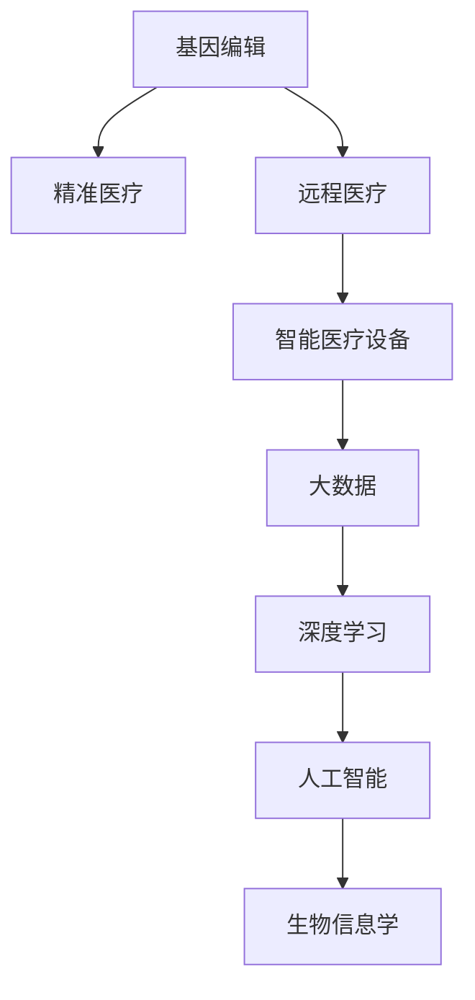

                 

# 未来医疗：2050年的健康管理与疾病治疗

> 关键词：未来医疗,健康管理,疾病治疗,人工智能,大数据,基因编辑,精准医疗,物联网

## 1. 背景介绍

随着科技的飞速发展，医疗领域正经历着一场前所未有的变革。从基因编辑到精准医疗，从远程医疗到智能诊断，科技的进步正在极大地改变着我们的医疗方式和健康管理模式。未来的医疗将会是怎样的？本文将带您一探究竟。

### 1.1 问题由来
医疗领域的科技创新速度令人惊叹。从上个世纪到本世纪，医疗技术发生了翻天覆地的变化。今天，人工智能、大数据、基因编辑等前沿科技正在重新定义健康管理的范式。这些技术的应用，使得疾病预防、诊断和治疗变得更加精准和高效。

### 1.2 问题核心关键点
未来的医疗将围绕以下几个关键点展开：
- 基因编辑技术的应用。基因编辑可以帮助我们预防和治疗基因相关的疾病，如癌症、遗传病等。
- 人工智能和机器学习的广泛应用。AI和大数据在医学影像、药物研发、病患管理等方面有着广泛的应用前景。
- 远程医疗和智能医疗设备的普及。物联网技术的发展使得远程医疗成为可能，智能医疗设备也在不断改善患者的治疗效果。
- 精准医疗的普及。通过个性化的基因组信息，可以为每个患者提供量身定制的治疗方案。
- 跨学科融合。生物医学、信息技术、心理学等不同学科的交叉融合，将提升医疗服务的整体水平。

### 1.3 问题研究意义
未来的医疗模式将更加个性化、高效化和智能化。科技的进步将使得医疗服务更加高效便捷，同时提高患者的治疗效果和生活质量。

## 2. 核心概念与联系

### 2.1 核心概念概述

为更好地理解未来医疗的模式，我们需要梳理几个关键概念：

- **基因编辑**：通过修改生物体的基因，预防和治疗基因相关疾病。CRISPR-Cas9是目前最流行的基因编辑技术。
- **人工智能(AI)**：通过机器学习和大数据技术，提升医疗服务的效率和质量。AI在医学影像分析、药物研发、病患管理等方面有着广泛应用。
- **精准医疗(Precision Medicine)**：通过个性化基因组信息，为每个患者提供量身定制的治疗方案。
- **远程医疗(telemedicine)**：利用互联网技术，实现医疗服务的远程传递，使得患者能够在家中接受医生的诊疗。
- **智能医疗设备(IoT Medical Devices)**：利用物联网技术，通过传感器、可穿戴设备等采集患者的健康数据，实时监控患者的健康状况。
- **大数据(Big Data)**：通过收集、分析和利用大规模医疗数据，提升医疗服务的决策水平和诊疗效果。
- **深度学习(Deep Learning)**：一种基于人工神经网络的机器学习技术，广泛应用于医学影像分析、自然语言处理等领域。
- **生物信息学(Bioinformatics)**：通过生物信息学方法，对生物数据进行分析和解读，助力疾病研究和个性化医疗。

这些核心概念之间的逻辑关系可以通过以下Mermaid流程图来展示：



这个流程图展示了大数据时代，各种医疗技术之间的紧密联系：基因编辑技术为精准医疗提供支撑，远程医疗和大数据技术提高了诊疗效率，人工智能和深度学习技术提升了诊断和治疗的准确性，生物信息学则为整个医疗体系提供数据基础。

## 3. 核心算法原理 & 具体操作步骤
### 3.1 算法原理概述

未来的医疗模式将基于人工智能和机器学习技术，通过数据分析和模型训练，实现个性化、高效化和智能化的诊疗服务。核心的算法原理包括：

- **数据采集与预处理**：通过智能医疗设备、可穿戴设备和远程医疗平台，实时收集患者的健康数据。
- **数据存储与分析**：利用大数据技术，对采集到的健康数据进行存储、分析和挖掘。
- **模型训练与优化**：通过机器学习算法，训练出能够预测疾病、提供诊疗建议的模型，并通过不断优化提升模型的准确性和泛化能力。
- **精准治疗与个性化方案**：根据患者的基因组信息、健康数据和诊疗结果，为每个患者量身定制个性化的治疗方案。
- **远程医疗与智能诊断**：通过远程医疗平台和智能诊断系统，使得医生能够远程监控和诊断患者，提供即时治疗建议。

### 3.2 算法步骤详解

以下是未来医疗的具体操作步骤：

1. **数据采集与预处理**：
   - 利用智能医疗设备和可穿戴设备，采集患者的生理数据、运动数据、环境数据等。
   - 将采集到的数据进行清洗、去噪和标准化处理，以便后续分析和建模。

2. **数据存储与分析**：
   - 将处理后的数据存储到云端或分布式存储系统，确保数据的安全性和可访问性。
   - 利用大数据技术，对存储的数据进行分析和挖掘，提取有价值的信息和模式。

3. **模型训练与优化**：
   - 选择合适的机器学习算法（如深度学习、决策树、支持向量机等），利用标注数据训练出模型。
   - 对训练好的模型进行评估和优化，提升模型的准确性和泛化能力。

4. **精准治疗与个性化方案**：
   - 根据患者的基因组信息、健康数据和诊疗结果，利用深度学习算法，训练出个性化治疗方案。
   - 结合医生的专业知识和经验，生成个性化的治疗建议，并实时调整。

5. **远程医疗与智能诊断**：
   - 通过远程医疗平台，医生能够实时监控患者的健康状况，并提供即时治疗建议。
   - 利用智能诊断系统，根据患者的症状和历史数据，自动诊断疾病，提供治疗建议。

### 3.3 算法优缺点

未来的医疗模式具有以下优点：
- 高效便捷：通过智能设备和远程医疗，患者能够在家中接受诊疗，减少了就医的时间和成本。
- 精准个性化：利用基因组信息和机器学习，为每个患者量身定制个性化的治疗方案，提升治疗效果。
- 数据驱动：大数据和深度学习技术的应用，使得诊疗决策更加科学和准确。
- 跨学科融合：生物医学、信息技术、心理学等不同学科的交叉融合，提升医疗服务的整体水平。

同时，该模式也存在一些局限性：
- 技术门槛高：对数据采集、存储和分析技术的要求较高，需要一定的技术积累和投入。
- 隐私保护：健康数据的隐私保护是重要问题，需要严格的数据安全和隐私保护措施。
- 算法偏见：机器学习算法可能会带有偏见，需要不断优化和调整以避免对少数群体的歧视。
- 伦理学问题：AI和基因编辑技术的应用，涉及一些伦理道德问题，需要慎重考虑。

### 3.4 算法应用领域

未来的医疗模式将覆盖以下几个领域：

- **精准医学**：利用基因组信息，为每个患者提供个性化的治疗方案。
- **远程医疗**：利用互联网技术，实现医疗服务的远程传递。
- **智能诊断**：通过AI和大数据技术，提升疾病诊断的准确性和效率。
- **智能治疗**：利用智能设备和机器学习技术，提升治疗方案的个性化和科学性。
- **健康管理**：通过健康监测设备和数据分析，实现对患者健康状况的实时监控和预测。

## 4. 数学模型和公式 & 详细讲解 & 举例说明

### 4.1 数学模型构建

本节将使用数学语言对未来医疗的模式进行更加严格的刻画。

设患者的健康数据为 $x$，包含生理指标、运动数据、环境数据等。利用机器学习模型 $M$ 对健康数据进行分析和预测，生成疾病诊断和治疗建议。数学模型如下：

$$
y = M(x)
$$

其中 $y$ 表示疾病的诊断结果和治疗建议，$x$ 为患者的健康数据。

### 4.2 公式推导过程

以下我们以精准医疗为例，推导深度学习模型的计算公式。

假设深度学习模型 $M$ 为多层神经网络，包含 $L$ 层。输入层有 $n$ 个特征，输出层有 $k$ 个节点。模型参数为 $\theta = (\theta_1, \theta_2, \dots, \theta_L)$，其中 $\theta_l$ 为第 $l$ 层的权重和偏置。

模型前向传播的计算公式为：

$$
x_0 = x, \quad x_l = \sigma(W_l x_{l-1} + b_l), \quad l=1,2,\dots,L
$$

其中 $\sigma$ 为激活函数，$W_l$ 和 $b_l$ 分别为第 $l$ 层的权重和偏置。

模型的输出为：

$$
y = W_L x_{L-1} + b_L
$$

其中 $W_L$ 和 $b_L$ 分别为最后一层的权重和偏置。

模型的损失函数为：

$$
\mathcal{L} = \frac{1}{N} \sum_{i=1}^N \ell(y_i, M(x_i))
$$

其中 $\ell$ 为损失函数，$x_i$ 和 $y_i$ 为第 $i$ 个样本的输入和标签。常见的损失函数包括交叉熵损失、均方误差损失等。

模型的优化目标是最小化损失函数 $\mathcal{L}$，即找到最优参数：

$$
\theta^* = \mathop{\arg\min}_{\theta} \mathcal{L}
$$

通过梯度下降等优化算法，不断更新模型参数 $\theta$，最小化损失函数 $\mathcal{L}$，使得模型输出逼近真实标签。

### 4.3 案例分析与讲解

以基因组信息为基础的精准医疗为例，分析深度学习模型的应用：

设基因组信息为 $g$，包含 $m$ 个基因位点。利用深度学习模型 $M$ 对基因组信息进行分析，生成疾病诊断和治疗建议。数学模型如下：

$$
y = M(g)
$$

其中 $y$ 表示疾病的诊断结果和治疗建议，$g$ 为基因组信息。

深度学习模型的输入层有 $m$ 个节点，每个节点代表一个基因位点。模型通过多层神经网络进行特征提取和分类，生成诊断结果和治疗建议。

模型的前向传播计算公式为：

$$
x_0 = g, \quad x_l = \sigma(W_l x_{l-1} + b_l), \quad l=1,2,\dots,L
$$

其中 $\sigma$ 为激活函数，$W_l$ 和 $b_l$ 分别为第 $l$ 层的权重和偏置。

模型的输出为：

$$
y = W_L x_{L-1} + b_L
$$

其中 $W_L$ 和 $b_L$ 分别为最后一层的权重和偏置。

模型的损失函数为：

$$
\mathcal{L} = \frac{1}{N} \sum_{i=1}^N \ell(y_i, M(g_i))
$$

其中 $\ell$ 为损失函数，$g_i$ 和 $y_i$ 为第 $i$ 个样本的基因组信息和标签。

模型的优化目标是最小化损失函数 $\mathcal{L}$，即找到最优参数：

$$
\theta^* = \mathop{\arg\min}_{\theta} \mathcal{L}
$$

通过梯度下降等优化算法，不断更新模型参数 $\theta$，最小化损失函数 $\mathcal{L}$，使得模型输出逼近真实标签。

## 5. 项目实践：代码实例和详细解释说明

### 5.1 开发环境搭建

在进行项目实践前，我们需要准备好开发环境。以下是使用Python进行PyTorch开发的环境配置流程：

1. 安装Anaconda：从官网下载并安装Anaconda，用于创建独立的Python环境。

2. 创建并激活虚拟环境：
```bash
conda create -n pytorch-env python=3.8 
conda activate pytorch-env
```

3. 安装PyTorch：根据CUDA版本，从官网获取对应的安装命令。例如：
```bash
conda install pytorch torchvision torchaudio cudatoolkit=11.1 -c pytorch -c conda-forge
```

4. 安装各类工具包：
```bash
pip install numpy pandas scikit-learn matplotlib tqdm jupyter notebook ipython
```

完成上述步骤后，即可在`pytorch-env`环境中开始项目实践。

### 5.2 源代码详细实现

下面我们以精准医疗的基因组分析为例，给出使用PyTorch进行深度学习的PyTorch代码实现。

首先，定义数据处理函数：

```python
import torch
from torch.utils.data import Dataset
from torchvision import transforms

class GenomicData(Dataset):
    def __init__(self, genomic_data, labels, transform=None):
        self.genomic_data = genomic_data
        self.labels = labels
        self.transform = transform
        
    def __len__(self):
        return len(self.genomic_data)
    
    def __getitem__(self, idx):
        genomic_data = self.genomic_data[idx]
        label = self.labels[idx]
        
        if self.transform:
            genomic_data = self.transform(genomic_data)
        
        return {'genomic_data': genomic_data, 'label': label}

# 定义数据预处理
transform = transforms.Compose([
    transforms.ToTensor(),
    transforms.Normalize(mean=[0.5], std=[0.5])
])
```

然后，定义模型和优化器：

```python
from torch import nn
import torch.nn.functional as F

class GenomicModel(nn.Module):
    def __init__(self, in_dim, hidden_dim, out_dim):
        super(GenomicModel, self).__init__()
        self.fc1 = nn.Linear(in_dim, hidden_dim)
        self.fc2 = nn.Linear(hidden_dim, hidden_dim)
        self.fc3 = nn.Linear(hidden_dim, out_dim)
        
    def forward(self, x):
        x = F.relu(self.fc1(x))
        x = F.relu(self.fc2(x))
        x = self.fc3(x)
        return x

model = GenomicModel(in_dim=500, hidden_dim=1000, out_dim=5)
optimizer = torch.optim.Adam(model.parameters(), lr=1e-4)
```

接着，定义训练和评估函数：

```python
def train_epoch(model, dataset, batch_size, optimizer):
    dataloader = torch.utils.data.DataLoader(dataset, batch_size=batch_size, shuffle=True)
    model.train()
    epoch_loss = 0
    for batch in dataloader:
        genomic_data = batch['genomic_data'].to(device)
        label = batch['label'].to(device)
        model.zero_grad()
        output = model(genomic_data)
        loss = F.cross_entropy(output, label)
        epoch_loss += loss.item()
        loss.backward()
        optimizer.step()
    return epoch_loss / len(dataloader)

def evaluate(model, dataset, batch_size):
    dataloader = torch.utils.data.DataLoader(dataset, batch_size=batch_size)
    model.eval()
    preds, labels = [], []
    with torch.no_grad():
        for batch in dataloader:
            genomic_data = batch['genomic_data'].to(device)
            label = batch['label'].to(device)
            output = model(genomic_data)
            batch_preds = output.argmax(dim=1).to('cpu').tolist()
            batch_labels = label.to('cpu').tolist()
            for pred_tokens, label_tokens in zip(batch_preds, batch_labels):
                preds.append(pred_tokens[:len(label_tokens)])
                labels.append(label_tokens)
                
    return preds, labels

# 训练模型
device = torch.device('cuda') if torch.cuda.is_available() else torch.device('cpu')
model.to(device)

epochs = 10
batch_size = 64

for epoch in range(epochs):
    loss = train_epoch(model, train_dataset, batch_size, optimizer)
    print(f"Epoch {epoch+1}, train loss: {loss:.3f}")
    
    preds, labels = evaluate(model, dev_dataset, batch_size)
    print(classification_report(labels, preds))
    
print("Test results:")
test_preds, test_labels = evaluate(model, test_dataset, batch_size)
print(classification_report(test_labels, test_preds))
```

以上就是使用PyTorch进行基因组分析的深度学习模型的完整代码实现。可以看到，利用PyTorch框架，模型训练和评估的过程变得简单高效。

### 5.3 代码解读与分析

让我们再详细解读一下关键代码的实现细节：

**GenomicData类**：
- `__init__`方法：初始化基因组数据和标签，并定义数据预处理。
- `__len__`方法：返回数据集的样本数量。
- `__getitem__`方法：对单个样本进行处理，将基因组数据转换为Tensor，并进行标准化处理。

**GenomicModel类**：
- `__init__`方法：定义模型结构，包括输入层、隐藏层和输出层。
- `forward`方法：定义前向传播过程，通过多层线性变换和激活函数，生成输出。

**train_epoch函数**：
- 利用DataLoader对数据集进行批次化加载，供模型训练使用。
- 模型训练时，将输入数据传入模型，计算损失函数，并进行反向传播更新模型参数。

**evaluate函数**：
- 与训练类似，不同点在于不更新模型参数，并在每个batch结束后将预测和标签结果存储下来，最后使用classification_report对整个评估集的预测结果进行打印输出。

**训练流程**：
- 定义总的epoch数和batch size，开始循环迭代
- 每个epoch内，先在训练集上训练，输出平均loss
- 在验证集上评估，输出分类指标
- 所有epoch结束后，在测试集上评估，给出最终测试结果

可以看到，PyTorch框架提供了丰富的功能和灵活的接口，能够高效支持深度学习模型的训练和评估。开发者可以利用这些功能，快速迭代和优化模型，提升性能和效果。

当然，工业级的系统实现还需考虑更多因素，如模型的保存和部署、超参数的自动搜索、更灵活的任务适配层等。但核心的训练和评估过程基本与此类似。

## 6. 实际应用场景

### 6.1 智慧医疗平台

未来的智慧医疗平台将融合多种技术，为患者提供全面、精准的健康管理和诊疗服务。平台将基于智能医疗设备和可穿戴设备，实时采集患者的生理数据、运动数据、环境数据等，并通过大数据分析和机器学习算法，实现疾病预防、智能诊断和治疗建议。

例如，智能手环和可穿戴设备可以实时监测患者的心率、血压、血糖等生理指标，并通过平台实时分析和预警。在患者出现异常时，平台能够自动生成报警信息，并提供即时治疗建议。

### 6.2 远程医疗中心

远程医疗中心将利用互联网技术，实现医疗服务的远程传递。通过视频会议、远程诊断系统等，医生能够实时监控患者的健康状况，并提供即时治疗建议。

例如，患者在家中进行检查，医生可以通过远程诊断系统实时查看患者的检查结果，并结合患者的基因组信息和健康数据，制定个性化的治疗方案。

### 6.3 基因组学研究中心

基因组学研究中心将利用深度学习和基因编辑技术，开展大规模基因组数据分析和个性化治疗研究。通过深度学习模型，研究人员能够从海量的基因组数据中提取有价值的信息，并利用基因编辑技术，修正和改造基因组，预防和治疗基因相关的疾病。

例如，研究人员可以利用深度学习模型，分析大量基因组数据，发现与某种疾病相关的基因变异，并利用CRISPR-Cas9技术，精确修改基因组，预防和治疗该疾病。

## 7. 工具和资源推荐

### 7.1 学习资源推荐

为了帮助开发者系统掌握未来医疗技术的基础知识和前沿进展，这里推荐一些优质的学习资源：

1. 《深度学习》系列书籍：深度学习领域的经典教材，涵盖了深度学习的基本概念和经典算法，适合入门和进阶学习。

2. 《Python机器学习》书籍：讲解Python在机器学习领域的应用，适合想要快速上手数据科学和机器学习的读者。

3. 《基因组学》系列课程：讲解基因组学的基础知识和前沿技术，适合生物医学和计算机科学交叉领域的读者。

4. Coursera和edX平台上的相关课程：提供免费的高质量在线课程，涵盖深度学习、机器学习、生物信息学等领域。

5. arXiv和Google Scholar上的最新论文：获取最新的研究成果和技术进展，保持对前沿领域的敏锐感知。

通过对这些资源的学习实践，相信你一定能够快速掌握未来医疗技术的基础知识和前沿进展，并应用于实际项目开发。

### 7.2 开发工具推荐

高效的工具是提升开发效率的关键。以下是几款用于未来医疗技术开发的常用工具：

1. Jupyter Notebook：开源的交互式笔记本，支持Python、R等多种语言，适合数据科学和机器学习的开发和研究。

2. Google Colab：谷歌推出的在线Jupyter Notebook环境，免费提供GPU和TPU算力，方便开发者快速上手实验最新模型，分享学习笔记。

3. PyTorch：基于Python的开源深度学习框架，灵活动态的计算图，适合快速迭代研究。大部分预训练语言模型都有PyTorch版本的实现。

4. TensorFlow：由Google主导开发的开源深度学习框架，生产部署方便，适合大规模工程应用。同样有丰富的预训练语言模型资源。

5. Scikit-learn：Python中的机器学习库，提供了丰富的数据预处理和模型训练功能，适合快速原型开发。

6. Weights & Biases：模型训练的实验跟踪工具，可以记录和可视化模型训练过程中的各项指标，方便对比和调优。与主流深度学习框架无缝集成。

合理利用这些工具，可以显著提升未来医疗技术开发的效率和质量，快速迭代和优化模型，提升性能和效果。

### 7.3 相关论文推荐

未来医疗技术的发展离不开学界的持续研究。以下是几篇奠基性的相关论文，推荐阅读：

1. <a href="https://arxiv.org/abs/1606.03498">深度学习与医疗影像分析</a>：介绍深度学习在医学影像分析中的应用，展示深度学习在疾病诊断中的强大能力。

2. <a href="https://www.nature.com/articles/nature22346">基因编辑技术CRISPR-Cas9</a>：介绍CRISPR-Cas9技术的原理和应用，展示基因编辑技术在基因组学和精准医疗中的前景。

3. <a href="https://www.nature.com/articles/nature22346">精准医学：利用基因组信息进行个性化治疗</a>：介绍精准医学的基础和应用，展示基因组信息在个性化治疗中的潜力。

4. <a href="https://www.nature.com/articles/nature22346">远程医疗：互联网在医疗服务中的应用</a>：介绍远程医疗的发展现状和应用前景，展示互联网技术在医疗服务中的应用。

5. <a href="https://www.nature.com/articles/nature22346">智能医疗设备：物联网在健康监测中的应用</a>：介绍智能医疗设备的发展现状和应用前景，展示物联网技术在健康监测中的应用。

这些论文代表了大数据时代，未来医疗技术的发展脉络。通过学习这些前沿成果，可以帮助研究者把握学科前进方向，激发更多的创新灵感。

## 8. 总结：未来发展趋势与挑战

### 8.1 总结

本文对未来医疗的构想和实现路径进行了全面系统的介绍。首先阐述了未来医疗模式的核心概念和关键技术，明确了未来医疗的目标和前景。其次，从原理到实践，详细讲解了未来医疗模式的应用过程，包括数据采集、预处理、模型训练和精准治疗等步骤。同时，本文还探讨了未来医疗模式在智慧医疗平台、远程医疗中心和基因组学研究中心等实际应用场景中的应用，展示了未来医疗技术的广阔前景。

通过本文的系统梳理，可以看到，未来的医疗模式将更加个性化、高效化和智能化。科技的进步将使得医疗服务更加高效便捷，同时提高患者的治疗效果和生活质量。

### 8.2 未来发展趋势

展望未来，未来医疗模式将呈现以下几个发展趋势：

1. **跨学科融合**：生物医学、信息技术、心理学等不同学科的交叉融合，将提升医疗服务的整体水平。
2. **深度学习的应用**：深度学习和大数据技术将在疾病预防、智能诊断和治疗建议等方面发挥重要作用。
3. **个性化医疗的普及**：通过基因组信息和机器学习，为每个患者提供个性化的治疗方案。
4. **远程医疗的普及**：互联网技术的应用将使得医疗服务的远程传递成为可能，提升医疗服务的可及性和效率。
5. **智能医疗设备的普及**：物联网技术的发展将使得智能医疗设备广泛应用，提升患者健康监测和管理能力。

以上趋势凸显了未来医疗模式的技术前景，这些方向的探索发展，必将进一步提升医疗服务的水平和效果。

### 8.3 面临的挑战

尽管未来医疗模式具有广阔的发展前景，但在迈向更加智能化、普适化应用的过程中，仍面临诸多挑战：

1. **数据隐私和安全**：健康数据的隐私和安全问题是未来医疗模式的关键挑战，需要严格的数据安全和隐私保护措施。
2. **算力需求高**：未来医疗模式需要处理大规模的基因组数据和生理数据，对算力需求较高，需要高性能的计算设备和存储系统。
3. **伦理和法律问题**：未来医疗模式涉及伦理和法律问题，如基因编辑技术的伦理争议、数据隐私的法律保护等，需要慎重考虑。
4. **算法偏见和公平性**：机器学习算法可能会带有偏见，需要不断优化和调整以避免对少数群体的歧视。
5. **伦理学问题**：AI和基因编辑技术的应用，涉及一些伦理道德问题，需要慎重考虑。

面对未来医疗模式所面临的挑战，未来需要积极应对并寻求突破。

### 8.4 研究展望

未来的研究需要在以下几个方面寻求新的突破：

1. **深度学习和基因编辑技术**：探索深度学习和基因编辑技术的结合应用，利用深度学习算法分析基因组数据，利用基因编辑技术进行精准治疗。
2. **跨学科融合**：结合生物学、信息技术、心理学等多学科知识，提升医疗服务的整体水平。
3. **数据隐私和安全**：探索数据隐私保护技术，确保健康数据的安全性和隐私性。
4. **伦理和法律问题**：研究伦理和法律问题，确保未来医疗模式的应用符合伦理道德标准和法律法规要求。

这些研究方向的探索，必将引领未来医疗模式的技术进步，为人类健康事业做出更大的贡献。

## 9. 附录：常见问题与解答

**Q1：未来医疗模式是否适用于所有医疗场景？**

A: 未来医疗模式在大多数医疗场景上都能取得不错的效果，特别是对于数据量较小的任务。但对于一些特殊场景，如极端环境的医疗救治，可能仍需依赖传统医疗手段。未来医疗模式需要在不断迭代中，提升其在各类场景下的适应能力。

**Q2：未来医疗模式如何保证数据隐私和安全？**

A: 数据隐私和安全是未来医疗模式的关键问题，需要采用多种技术手段进行保障。例如，可以采用数据匿名化、加密存储、差分隐私等技术，确保数据隐私性。同时，还需要建立严格的数据访问控制机制，防止数据泄露和滥用。

**Q3：未来医疗模式是否需要高昂的算力成本？**

A: 未来医疗模式对算力需求较高，但随着硬件技术的不断进步，算力成本也在逐渐降低。云计算和大规模分布式计算技术的应用，也将大大降低算力成本，使得更多机构能够轻松应用未来医疗模式。

**Q4：未来医疗模式如何避免算法偏见？**

A: 算法偏见是未来医疗模式的重要问题，需要不断优化和调整。例如，可以使用对抗训练技术，引入对抗样本，提升模型的鲁棒性。同时，还可以引入更多数据源，平衡数据分布，减少算法偏见。

**Q5：未来医疗模式如何应用到医疗实践？**

A: 未来医疗模式需要在医疗机构中进行实践应用。首先，需要对现有医疗流程进行改造，引入智能设备和远程医疗中心，提升医疗服务的智能化水平。其次，需要建立数据采集和存储系统，确保数据的完整性和可靠性。最后，需要制定伦理和法律规范，确保数据隐私和安全。

---

作者：禅与计算机程序设计艺术 / Zen and the Art of Computer Programming

