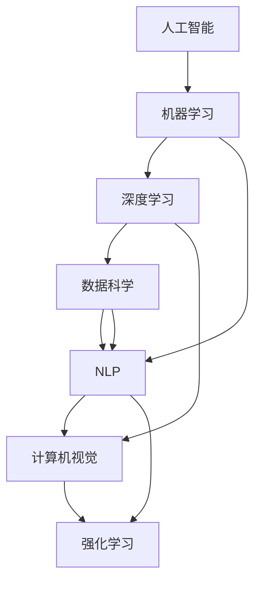

                 

# 未来工作：技能需求与培养

> 关键词：未来工作, 技能需求, 人工智能, 技术趋势, 职业发展, 持续学习

## 1. 背景介绍

### 1.1 问题由来
随着科技的飞速发展，特别是人工智能(AI)和机器学习(ML)技术的快速普及，未来的工作场景正在发生深刻变化。如何适应这些变化，培养未来的必备技能，成为摆在每个人面前的重要课题。本文旨在探讨未来工作的技能需求和培养方法，希望能为读者提供一些有益的见解和建议。

### 1.2 问题核心关键点
- **AI与ML**：人工智能和机器学习正在改变各行各业的工作方式，从数据分析到医疗诊断，从自动驾驶到金融风险控制，AI和ML技术无处不在。
- **技能升级**：随着AI和ML技术的广泛应用，许多传统职业正在消失或转型，需要人们掌握新的技能以适应新的工作环境。
- **终身学习**：未来工作不仅要求高水平的初始技能，更需要持续学习和自我提升，以保持技能的与时俱进。
- **跨学科融合**：未来工作需要更多跨学科的知识和技能，如AI与心理学、经济学等领域的结合，以应对复杂多变的问题。

## 2. 核心概念与联系

### 2.1 核心概念概述

为了更好地理解未来工作的技能需求和培养方法，我们首先介绍几个核心概念：

- **人工智能(AI)**：通过模拟人类智能，实现数据处理、决策制定、自动化任务等功能。
- **机器学习(ML)**：利用数据训练模型，使其具备预测、分类、聚类等能力，是实现AI的核心技术。
- **深度学习(Deep Learning)**：一种特殊的ML方法，使用多层神经网络处理复杂数据。
- **数据科学**：涵盖数据收集、清洗、分析、可视化等步骤，是AI和ML应用的基础。
- **自然语言处理(NLP)**：使计算机能够理解、解释和生成人类语言的技术。
- **计算机视觉(CV)**：使计算机能够“看”和“理解”图像和视频的技术。
- **强化学习(RL)**：通过试错训练模型，使其能够基于环境反馈做出决策。

这些核心概念之间的关系可以简单总结如下：



## 3. 核心算法原理 & 具体操作步骤

### 3.1 算法原理概述

未来工作的核心算法和操作步骤主要围绕AI和ML技术的原理和实践展开。其基本思路是：

1. **数据准备**：收集和处理与未来工作相关的数据，包括文本、图像、时间序列等。
2. **模型训练**：使用机器学习算法训练模型，使其能够从数据中学习到有用的知识和模式。
3. **模型评估**：通过评估指标（如准确率、召回率、F1分数等）测试模型的性能。
4. **模型部署**：将训练好的模型部署到实际应用中，进行实时或批量处理。

### 3.2 算法步骤详解

以下详细介绍未来工作技能培养的具体操作步骤：

**Step 1: 数据准备**
- 确定未来工作所需的数据类型和格式，如结构化数据（SQL数据库）、非结构化数据（文本、图像、音频）等。
- 收集相关数据集，并进行清洗和预处理，去除噪声和缺失值。
- 采用数据增强技术，如数据扩充、回译、合成数据等，提高数据集的多样性。

**Step 2: 模型选择**
- 根据未来工作的具体需求，选择合适的AI和ML算法，如分类、聚类、回归、强化学习等。
- 对于复杂问题，可以使用深度学习算法，如CNN、RNN、Transformer等。
- 考虑模型的可解释性、计算效率和资源需求，选择合适的模型结构和参数。

**Step 3: 模型训练**
- 划分数据集为训练集、验证集和测试集。
- 选择合适的优化器（如SGD、Adam等）和损失函数，定义评估指标。
- 在训练集上进行模型训练，不断调整模型参数以最小化损失函数。
- 在验证集上评估模型性能，防止过拟合。
- 在测试集上评估最终模型性能。

**Step 4: 模型评估**
- 使用交叉验证等技术评估模型的泛化能力。
- 根据未来工作的实际需求，选择合适的评估指标（如ROC曲线、精确度-召回率曲线等）。
- 进行模型调参，如调整超参数、增加正则化等，以提高模型性能。

**Step 5: 模型部署**
- 将训练好的模型保存为模型文件，以便在实际应用中加载和使用。
- 编写模型服务接口，使模型能够通过API接受请求，并返回预测结果。
- 进行模型监控和调优，确保模型在实际环境中的稳定性和高效性。

### 3.3 算法优缺点

未来工作的AI和ML技能培养方法有以下优点：

1. **高效性**：AI和ML技能能快速处理大量数据，发现数据中的模式和规律。
2. **可扩展性**：AI和ML技术能够轻松应对数据量增长和技术变化，保持技能的前沿性。
3. **灵活性**：AI和ML方法可以根据具体问题定制解决方案，满足个性化需求。

同时，这些技能也存在一些缺点：

1. **数据依赖**：AI和ML技能高度依赖数据质量，数据偏差可能导致模型性能下降。
2. **技术门槛**：AI和ML技术需要较深的理论基础和实践经验，入门难度较大。
3. **伦理风险**：AI和ML模型可能带来隐私、歧视等问题，需要谨慎使用。
4. **维护成本**：AI和ML模型需要持续维护和更新，以保持其有效性和准确性。

## 4. 数学模型和公式 & 详细讲解 & 举例说明

### 4.1 数学模型构建

为了更好地理解未来工作的技能需求和培养方法，我们引入一些基础的数学模型：

- **线性回归模型**：$y = \theta_0 + \theta_1x_1 + \theta_2x_2 + \ldots + \theta_nx_n$，用于建立输入变量和输出变量之间的关系。
- **逻辑回归模型**：$P(y=1|x) = \sigma(\theta_0 + \theta_1x_1 + \theta_2x_2 + \ldots + \theta_nx_n)$，用于分类任务，输出概率值。
- **卷积神经网络(CNN)**：$h_{l+1} = \max(0, W_l \ast h_l + b_l)$，用于图像处理任务。
- **循环神经网络(RNN)**：$h_{t+1} = \tanh(W_l \ast [h_t, x_t] + b_l)$，用于序列数据处理任务。
- **Transformer模型**：$y = \sum_i (\alpha_i x_i)$，用于自然语言处理任务。

### 4.2 公式推导过程

以下详细介绍这些数学模型的公式推导过程：

**线性回归**：
$$
\begin{align*}
\min_{\theta} & \frac{1}{2m}\sum_{i=1}^m (y_i - \theta_0 - \theta_1x_{i1} - \ldots - \theta_nx_{in})^2 \\
\Rightarrow & \min_{\theta} \frac{1}{2m}\sum_{i=1}^m (y_i - \hat{y_i})^2 \\
\Rightarrow & \nabla_{\theta} \frac{1}{2m}\sum_{i=1}^m (y_i - \hat{y_i})^2 = 0 \\
\Rightarrow & \nabla_{\theta} (\frac{1}{m} \sum_{i=1}^m (y_i - \hat{y_i})) = 0 \\
\Rightarrow & \frac{1}{m} \sum_{i=1}^m (y_i - \hat{y_i}) \nabla_{\theta_i} = 0 \\
\Rightarrow & \frac{1}{m} (y_i - \hat{y_i}) x_{i1}, \ldots, \frac{1}{m} (y_i - \hat{y_i}) x_{in} = 0 \\
\Rightarrow & \theta = (X^TX)^{-1}X^Ty
\end{align*}
$$

**逻辑回归**：
$$
\begin{align*}
\min_{\theta} & -\frac{1}{m} \sum_{i=1}^m [y_i\log \hat{y_i} + (1-y_i)\log(1-\hat{y_i})] \\
\Rightarrow & \nabla_{\theta} (-\frac{1}{m} \sum_{i=1}^m [y_i\log \hat{y_i} + (1-y_i)\log(1-\hat{y_i})]) = 0 \\
\Rightarrow & \nabla_{\theta} (\frac{1}{m} \sum_{i=1}^m [y_i\log \hat{y_i} + (1-y_i)\log(1-\hat{y_i})]) = 0 \\
\Rightarrow & \nabla_{\theta} (\frac{1}{m} \sum_{i=1}^m (y_i\log \hat{y_i} + (1-y_i)\log(1-\hat{y_i}))) = 0 \\
\Rightarrow & \nabla_{\theta} (\frac{1}{m} \sum_{i=1}^m y_i(\log \hat{y_i} - \log(1-\hat{y_i}))) = 0 \\
\Rightarrow & \frac{1}{m} \sum_{i=1}^m (\hat{y_i} - y_i)\nabla_{\theta_i} = 0 \\
\Rightarrow & \frac{1}{m} \sum_{i=1}^m (\hat{y_i} - y_i) x_{i1}, \ldots, \frac{1}{m} (\hat{y_i} - y_i) x_{in} = 0 \\
\Rightarrow & \theta = (X^TX)^{-1}X^Ty
\end{align*}
$$

**卷积神经网络**：
$$
\begin{align*}
h_{l+1} &= \max(0, W_l \ast h_l + b_l) \\
\Rightarrow & h_{l+1} = \max(0, \sum_{i=1}^m W_{li} h_{li-1} + b_l) \\
\Rightarrow & h_{l+1} = \max(0, \sum_{i=1}^m \sum_{j=1}^n W_{li,j} h_{li-1,j-1} + b_l) \\
\Rightarrow & h_{l+1} = \max(0, \sum_{i=1}^m \sum_{j=1}^n W_{li,j} \sigma(h_{li-1,j-1})) + b_l
\end{align*}
$$

**循环神经网络**：
$$
\begin{align*}
h_{t+1} &= \tanh(W_l \ast [h_t, x_t] + b_l) \\
\Rightarrow & h_{t+1} = \tanh(W_l \ast [h_{t-1}, x_t] + b_l) \\
\Rightarrow & h_{t+1} = \tanh(W_l \ast [h_{t-1}, x_t] + b_l) \\
\Rightarrow & h_{t+1} = \tanh(W_l \ast [h_{t-1}, x_t] + b_l)
\end{align*}
$$

**Transformer模型**：
$$
\begin{align*}
y &= \sum_i (\alpha_i x_i) \\
\Rightarrow & y = \sum_i \frac{e^{u_i^Tx_i}}{\sum_k e^{u_k^Tx_k}} x_i \\
\Rightarrow & y = \sum_i \frac{e^{q_i^Th_i}}{\sum_k e^{q_k^Th_k}} x_i \\
\Rightarrow & y = \sum_i \frac{e^{q_i^Th_i}}{\sum_k e^{q_k^Th_k}} x_i \\
\Rightarrow & y = \sum_i \frac{e^{q_i^Th_i}}{\sum_k e^{q_k^Th_k}} x_i
\end{align*}
$$

### 4.3 案例分析与讲解

以自然语言处理(NLP)为例，使用Transformer模型进行情感分析：

1. **数据准备**：收集电影评论数据，将评论分为正面和负面两类。
2. **模型训练**：使用BERT模型作为初始化参数，对评论进行编码，输出情感概率分布。
3. **模型评估**：在测试集上评估模型精度、召回率、F1分数等指标。
4. **模型部署**：将训练好的模型保存为模型文件，通过API接口接受新评论并返回情感分析结果。

## 5. 项目实践：代码实例和详细解释说明

### 5.1 开发环境搭建

为了进行未来工作的技能培养，首先需要搭建一个合适的开发环境：

1. 安装Python：从官网下载并安装最新版本的Python。
2. 安装必要的包：使用pip安装NumPy、Pandas、Scikit-learn等常用库。
3. 安装Jupyter Notebook：用于编写和运行Python代码。
4. 安装Git：使用Git进行代码版本控制。

### 5.2 源代码详细实现

以下以图像分类任务为例，使用卷积神经网络(CNN)进行项目实践：

```python
from tensorflow.keras.datasets import mnist
from tensorflow.keras.models import Sequential
from tensorflow.keras.layers import Conv2D, MaxPooling2D, Flatten, Dense

# 加载MNIST数据集
(x_train, y_train), (x_test, y_test) = mnist.load_data()

# 数据预处理
x_train = x_train.reshape(-1, 28, 28, 1)
x_test = x_test.reshape(-1, 28, 28, 1)
x_train = x_train / 255.0
x_test = x_test / 255.0

# 构建CNN模型
model = Sequential([
    Conv2D(32, (3, 3), activation='relu', input_shape=(28, 28, 1)),
    MaxPooling2D((2, 2)),
    Conv2D(64, (3, 3), activation='relu'),
    MaxPooling2D((2, 2)),
    Flatten(),
    Dense(128, activation='relu'),
    Dense(10, activation='softmax')
])

# 编译模型
model.compile(optimizer='adam', loss='sparse_categorical_crossentropy', metrics=['accuracy'])

# 训练模型
model.fit(x_train, y_train, epochs=10, validation_data=(x_test, y_test))

# 评估模型
test_loss, test_acc = model.evaluate(x_test, y_test)
print('Test accuracy:', test_acc)
```

### 5.3 代码解读与分析

上述代码实现了卷积神经网络(CNN)的图像分类任务。主要步骤如下：

1. **数据加载**：使用Keras的mnist数据集加载手写数字图片。
2. **数据预处理**：将图像数据归一化到[0, 1]区间，并进行reshape操作，使其符合CNN模型的输入要求。
3. **模型构建**：使用Keras的Sequential模型定义CNN结构，包括卷积层、池化层、全连接层等。
4. **模型编译**：设置优化器、损失函数和评估指标。
5. **模型训练**：使用fit方法对模型进行训练，并在验证集上评估模型性能。
6. **模型评估**：使用evaluate方法评估模型在测试集上的准确率。

## 6. 实际应用场景

### 6.1 智能客服系统

智能客服系统是未来工作中重要的应用场景之一。通过AI和ML技术，智能客服系统可以自动处理大量的客户咨询，提高客服效率和质量。具体实现步骤如下：

1. **数据收集**：收集企业历史客服对话记录，标注问题和答案。
2. **模型训练**：使用对话模型对问题-答案对进行训练，输出最佳回答。
3. **模型部署**：将训练好的模型集成到客服系统中，自动解答客户咨询。
4. **持续学习**：不断收集新对话记录，更新模型参数，提升系统性能。

### 6.2 金融舆情监测

金融舆情监测是未来工作中另一个重要的应用场景。通过AI和ML技术，金融舆情监测系统可以实时监测市场舆情，识别潜在风险。具体实现步骤如下：

1. **数据收集**：收集金融新闻、评论、社交媒体等数据。
2. **模型训练**：使用情感分析模型对文本进行分类，识别情感倾向。
3. **模型部署**：将训练好的模型集成到舆情监测系统中，实时分析舆情数据。
4. **风险预警**：根据情感分析结果，发出风险预警信号，帮助金融机构及时应对风险。

### 6.3 个性化推荐系统

个性化推荐系统是未来工作中重要的应用场景之一。通过AI和ML技术，推荐系统可以根据用户行为和偏好，推荐合适的商品或内容。具体实现步骤如下：

1. **数据收集**：收集用户浏览、购买、评分等行为数据。
2. **模型训练**：使用协同过滤、深度学习等方法对用户行为进行建模，推荐相似物品。
3. **模型部署**：将训练好的模型集成到推荐系统中，实时推荐商品或内容。
4. **反馈循环**：根据用户反馈，更新模型参数，提升推荐效果。

## 7. 工具和资源推荐

### 7.1 学习资源推荐

为了更好地掌握未来工作的技能，以下是一些推荐的资源：

1. **《Python深度学习》（书籍）**：深入浅出地介绍了深度学习的基本概念和实现方法，适合初学者和进阶者阅读。
2. **Coursera AI课程**：由斯坦福大学等名校开设，涵盖深度学习、自然语言处理、计算机视觉等多个方向，适合全面学习AI知识。
3. **Kaggle数据竞赛**：通过实际数据集进行项目实践，提升数据分析和机器学习技能。
4. **GitHub开源项目**：通过参与开源项目，学习最新技术和代码实践，积累项目经验。
5. **NIPS和ICML论文**：阅读前沿论文，了解最新研究成果和技术进展。

### 7.2 开发工具推荐

为了提高开发效率，以下是一些推荐的开发工具：

1. **PyTorch**：开源深度学习框架，灵活高效，适合快速迭代。
2. **TensorFlow**：Google开源的深度学习框架，生产部署方便，适合大规模工程应用。
3. **Jupyter Notebook**：交互式代码编辑器，方便进行项目开发和数据探索。
4. **Git**：版本控制系统，方便进行代码管理和版本控制。
5. **Docker**：容器化技术，方便部署和管理模型。

### 7.3 相关论文推荐

以下是一些未来工作技能培养的推荐论文：

1. **《深度学习》（书籍）**：Ian Goodfellow等著，深入介绍深度学习的基本概念和方法。
2. **《机器学习》（书籍）**：Tom Mitchell著，系统介绍机器学习的基本原理和应用。
3. **《自然语言处理综述》（论文）**：Yann LeCun等著，综述自然语言处理的发展历程和技术进展。
4. **《计算机视觉：模型、学习、推理》（书籍）**：Simon J.D. Prince著，系统介绍计算机视觉的原理和方法。
5. **《强化学习》（书籍）**：Richard S. Sutton和Andrew G. Barto著，系统介绍强化学习的理论和方法。

## 8. 总结：未来发展趋势与挑战

### 8.1 研究成果总结

本文详细介绍了未来工作的技能需求和培养方法，涵盖了数据准备、模型训练、模型评估和模型部署等关键步骤。通过分析实际应用场景，展示了AI和ML技术在智能客服、金融舆情监测、个性化推荐等领域的广泛应用。

### 8.2 未来发展趋势

未来工作的技能需求和培养将呈现以下趋势：

1. **跨学科融合**：AI和ML技术将与心理学、经济学等学科融合，提升系统的综合能力。
2. **持续学习**：终身学习将成为未来工作的重要特征，需要不断更新知识和技能。
3. **模型可解释性**：AI和ML模型的可解释性将越来越重要，需要开发更多易于理解和解释的模型。
4. **伦理和安全**：AI和ML模型的伦理和安全问题将受到更多关注，需要制定相应的规范和标准。
5. **多模态融合**：未来的工作将涉及多种数据模态，AI和ML技术需要支持跨模态信息的整合和理解。

### 8.3 面临的挑战

未来工作的技能需求和培养也面临诸多挑战：

1. **数据隐私和安全**：AI和ML模型的训练和使用涉及大量敏感数据，需要严格保护隐私和安全。
2. **模型鲁棒性**：AI和ML模型在实际应用中可能受到噪声和异常影响，需要提升鲁棒性。
3. **技术门槛**：AI和ML技术需要较深的理论基础和实践经验，难以普及。
4. **伦理和法律**：AI和ML技术可能带来伦理和法律问题，需要制定相应的规范和标准。
5. **资源限制**：AI和ML模型的训练和推理需要大量计算资源，难以在资源有限的环境中应用。

### 8.4 研究展望

未来工作的技能需求和培养还需要在多个方面进行深入研究：

1. **高效学习算法**：开发更高效的机器学习算法，降低计算成本，提升训练速度。
2. **模型压缩和优化**：研究模型压缩和优化技术，提升模型效率和可部署性。
3. **跨模态信息融合**：开发跨模态融合技术，支持不同类型数据的信息整合和理解。
4. **模型可解释性**：开发可解释的AI和ML模型，提升模型的透明性和可信度。
5. **伦理和安全**：制定AI和ML技术的伦理和安全标准，确保技术的健康发展。

## 9. 附录：常见问题与解答

### Q1: 未来工作需要掌握哪些关键技能？

A: 未来工作需要掌握的关键技能包括：

1. **数据处理和分析**：能够处理和分析大数据集，提取有用信息。
2. **机器学习算法**：熟悉各种机器学习算法，如线性回归、逻辑回归、卷积神经网络等。
3. **模型训练和优化**：能够构建和训练AI和ML模型，优化模型性能。
4. **模型部署和维护**：将模型部署到实际应用中，并进行持续维护和优化。
5. **跨学科知识**：具备跨学科的知识，如心理学、经济学等，以应对复杂问题。

### Q2: 未来工作如何持续学习？

A: 未来工作持续学习可以通过以下方法实现：

1. **在线课程和资源**：参加在线课程和访问开源资源，学习新知识。
2. **项目实践**：通过实际项目进行实践，积累经验。
3. **社区交流**：参与技术社区和开源项目，交流学习心得。
4. **阅读论文和书籍**：阅读前沿论文和经典书籍，了解最新进展和技术。

### Q3: 未来工作面临哪些伦理和安全问题？

A: 未来工作面临的伦理和安全问题包括：

1. **数据隐私**：保护用户数据隐私，避免数据泄露和滥用。
2. **模型偏见**：避免模型偏见和歧视，确保模型公平公正。
3. **安全性**：确保系统的安全性和可靠性，防止攻击和漏洞。
4. **透明度**：提升系统的透明度和可解释性，增强用户信任。

### Q4: 未来工作如何提高模型鲁棒性？

A: 提高模型鲁棒性可以通过以下方法实现：

1. **数据增强**：使用数据增强技术，增加数据多样性。
2. **正则化**：使用正则化技术，避免过拟合。
3. **对抗训练**：使用对抗样本训练模型，提升鲁棒性。
4. **模型压缩**：压缩模型，减少过拟合风险。

### Q5: 未来工作如何提升模型可解释性？

A: 提升模型可解释性可以通过以下方法实现：

1. **可视化技术**：使用可视化技术，展示模型的内部结构和决策过程。
2. **局部解释**：对特定输入进行局部解释，解释模型的推理过程。
3. **可解释模型**：开发可解释的模型，如LIME、SHAP等。

---

作者：禅与计算机程序设计艺术 / Zen and the Art of Computer Programming

