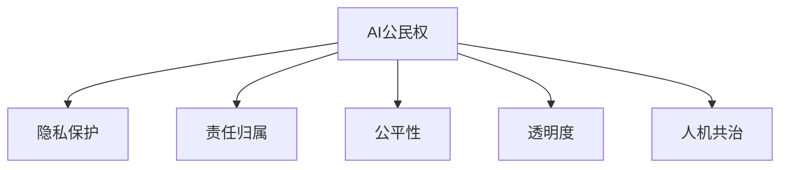

                 

# 未来的人工智能伦理：2050年的AI公民权与人机共治

## 1. 背景介绍

### 1.1 问题由来

随着人工智能(AI)技术的迅猛发展，其在经济、医疗、教育、娱乐等各个领域的应用日益广泛。然而，随着AI能力的不断提升，其带来的伦理问题也愈发凸显，尤其是在公民权、隐私、责任、公平性等方面。如何在未来AI时代构建一套完整的伦理体系，确保AI的发展能够为人类福祉服务，成为我们必须面对的重大挑战。

### 1.2 问题核心关键点

当前，AI伦理问题的核心关键点包括以下几个方面：

1. **AI公民权**：如何定义AI的“人权”，包括是否具有人格权利、言论自由、隐私权等，在法律上如何保障。
2. **隐私保护**：数据隐私和安全问题，如何在AI算法中实现数据保护，避免数据滥用。
3. **责任归属**：AI决策失误导致伤害时，责任应由谁承担，包括算法开发者、使用者、管理方等。
4. **公平性**：AI算法在应用中可能存在偏见，如何确保算法公平，避免歧视。
5. **透明度**：AI决策过程应具有可解释性，如何让用户理解和信任AI系统。
6. **人机共治**：AI系统应如何与人类共同决策，确保人机协同。

这些关键问题直接关系到AI技术的健康发展，需要我们从法律、技术、伦理等多方面进行全面探讨和解决。

### 1.3 问题研究意义

探讨未来AI伦理，对于保障AI技术的发展方向，维护公众利益，构建公平、公正、安全的AI社会具有重要意义。通过对AI公民权、隐私保护、责任归属、公平性、透明度和人机共治等关键问题的深入研究，可以为AI技术的应用提供理论基础和实践指导，促进AI技术向更加人本、透明、公正的方向发展。

## 2. 核心概念与联系

### 2.1 核心概念概述

为了更好地理解未来AI伦理，本节将介绍几个密切相关的核心概念：

- **AI公民权**：指赋予AI一定的法律权利和责任，使其在法律框架内有明确的地位和行为规范。
- **隐私保护**：指在AI系统开发和应用中，采取措施保护用户的个人信息，防止数据滥用和泄露。
- **责任归属**：指在AI系统出现问题时，明确各方的责任，包括开发者、使用者、管理者等。
- **公平性**：指AI系统在决策和推荐过程中，避免对特定群体或个体产生不公平的影响。
- **透明度**：指AI系统的工作原理和决策过程应具有可解释性，用户能够理解和信任其决策。
- **人机共治**：指AI系统在决策过程中，与人类进行协同，共同制定和执行决策。

这些核心概念之间的逻辑关系可以通过以下Mermaid流程图来展示：



这个流程图展示了一系列核心概念及其之间的关系：

1. AI公民权是AI伦理的基础，决定了AI系统的法律地位和行为规范。
2. 隐私保护是AI伦理的重要内容，保护用户的个人信息不被滥用。
3. 责任归属是AI伦理的关键环节，明确各方的责任和义务。
4. 公平性是AI伦理的重要原则，确保AI系统决策的公正性。
5. 透明度是AI伦理的重要保障，提高用户对AI系统的信任度。
6. 人机共治是AI伦理的重要目标，实现AI与人类共同决策。

这些核心概念共同构成了未来AI伦理的基本框架，对于构建AI技术的伦理体系具有重要意义。

## 3. 核心算法原理 & 具体操作步骤
### 3.1 算法原理概述

未来AI伦理的核心算法原理，主要包括数据隐私保护、公平性算法、透明性算法和人机协同算法。

1. **数据隐私保护**：通过差分隐私、联邦学习等技术，在AI模型训练中保护用户隐私。
2. **公平性算法**：使用公平性约束和公平性算法，在AI决策中避免偏见和歧视。
3. **透明性算法**：开发可解释AI算法，提供决策依据，增强用户信任。
4. **人机协同算法**：通过决策融合、人机交互界面等技术，实现AI与人类共同决策。

### 3.2 算法步骤详解

以下将详细讲解未来AI伦理的核心算法步骤：

**Step 1: 数据隐私保护**

- **差分隐私**：在数据收集和处理过程中，通过添加噪声和扰动，使得任何单个样本的泄露对模型性能的影响可以忽略不计。
- **联邦学习**：多个本地设备在本地数据上训练模型，然后将模型参数聚合，实现数据保护和模型优化。

**Step 2: 公平性算法**

- **公平性约束**：在模型训练过程中，引入公平性约束，确保模型决策对所有群体的影响一致。
- **公平性算法**：使用平衡样本集、重加权等技术，调整模型权重，避免对少数群体的歧视。

**Step 3: 透明性算法**

- **可解释AI**：使用可解释性模型和可视化工具，展示模型的决策依据，增强用户理解。
- **决策树和规则提取**：将复杂模型转化为决策树或规则，简化模型解释，提高用户信任。

**Step 4: 人机协同算法**

- **决策融合**：将AI决策与人类决策进行融合，提高决策的可靠性和多样性。
- **人机交互界面**：设计直观易用的交互界面，增强人机协同体验。

### 3.3 算法优缺点

未来AI伦理的算法具有以下优点：

1. **增强隐私保护**：通过差分隐私和联邦学习等技术，有效保护用户隐私，避免数据泄露。
2. **提高公平性**：公平性约束和算法能够减少AI决策中的偏见和歧视，促进社会公平。
3. **提升透明度**：可解释AI算法和可视化工具，使得AI决策具有可解释性，增强用户信任。
4. **实现人机共治**：决策融合和人机交互界面，实现AI与人类共同决策，提高决策的可靠性和多样性。

同时，这些算法也存在一些局限性：

1. **数据需求高**：差分隐私和联邦学习需要大量数据进行噪声和扰动，可能带来额外开销。
2. **模型复杂度增加**：公平性约束和算法可能增加模型复杂度，影响模型性能。
3. **用户理解难度**：可解释AI和可视化工具虽然提高了透明度，但用户理解可能仍有一定难度。
4. **交互界面设计复杂**：人机交互界面设计需要考虑用户体验和易用性，设计和实现复杂。

### 3.4 算法应用领域

未来AI伦理的算法已经在多个领域得到了应用，具体包括：

1. **医疗健康**：在电子病历、诊断工具、治疗方案中，保护患者隐私，避免医疗歧视，确保医疗决策的公平性和透明性。
2. **金融保险**：在信用评估、贷款审批、风险控制中，保护客户隐私，避免金融歧视，确保决策的公平性和透明性。
3. **教育培训**：在个性化推荐、作业批改、学习分析中，保护学生隐私，避免教育歧视，确保教育决策的公平性和透明性。
4. **智能交通**：在智能驾驶、交通管理、出行推荐中，保护用户隐私，避免交通歧视，确保交通决策的公平性和透明性。
5. **环境保护**：在环境监测、资源管理、生态保护中，保护环境数据隐私，避免数据滥用，确保环境保护决策的公平性和透明性。

## 4. 数学模型和公式 & 详细讲解
### 4.1 数学模型构建

未来AI伦理的数学模型构建，主要涉及隐私保护、公平性、透明性和人机共治等多个方面。

**隐私保护模型**

差分隐私模型通过在数据中添加噪声和扰动，保护用户隐私。设原始数据为 $D$，隐私参数为 $\epsilon$，则差分隐私模型可以表示为：

$$
\tilde{D} = D + \Delta，其中\Delta \sim N(0, \sigma^2\epsilon)
$$

**公平性模型**

公平性模型通过引入公平性约束和算法，确保模型决策对所有群体的影响一致。设训练数据为 $D$，模型为 $M$，则公平性模型可以表示为：

$$
\min_{M} \frac{1}{n}\sum_{i=1}^{n} |\hat{y}_i - y_i|，其中\hat{y}_i = M(x_i)
$$

**透明性模型**

透明性模型通过可解释性算法和可视化工具，展示模型的决策依据，增强用户理解。设原始数据为 $D$，模型为 $M$，则透明性模型可以表示为：

$$
\min_{M} E[L(M(D))]，其中L(M(D))为模型在数据 $D$ 上的损失函数
$$

**人机协同模型**

人机协同模型通过决策融合和人机交互界面，实现AI与人类共同决策。设AI决策为 $M(A)$，人类决策为 $H(A)$，则人机协同模型可以表示为：

$$
\min_{M, H} E[L(M(A), H(A))]，其中L(M(A), H(A))为AI与人类协同决策的损失函数
$$

### 4.2 公式推导过程

以下将详细推导未来AI伦理的数学模型：

**差分隐私模型**

设原始数据为 $D = \{x_1, x_2, ..., x_n\}$，隐私参数为 $\epsilon$，则差分隐私模型可以通过拉普拉斯分布来生成噪声：

$$
\tilde{D} = D + \Delta，其中\Delta \sim \mathcal{L}(\epsilon)
$$

其中，拉普拉斯分布 $\mathcal{L}(\epsilon)$ 的概率密度函数为：

$$
f(\Delta) = \frac{1}{2}e^{-\frac{|\Delta|}{\epsilon}}
$$

**公平性模型**

公平性模型可以通过重加权等技术来调整模型权重，确保模型决策对所有群体的影响一致。设训练数据为 $D$，模型为 $M$，则公平性模型可以通过以下步骤实现：

1. 计算每个群体的样本权重 $w_i$
2. 重新加权训练数据 $D_w$
3. 在 $D_w$ 上训练模型 $M$

**透明性模型**

透明性模型可以通过可解释性算法和可视化工具，展示模型的决策依据，增强用户理解。设原始数据为 $D$，模型为 $M$，则透明性模型可以通过以下步骤实现：

1. 计算模型的特征重要度 $w_i$
2. 使用可视化工具展示特征重要度
3. 提供决策依据和解释

**人机协同模型**

人机协同模型可以通过决策融合和人机交互界面，实现AI与人类共同决策。设AI决策为 $M(A)$，人类决策为 $H(A)$，则人机协同模型可以通过以下步骤实现：

1. 融合AI决策和人类决策 $M(A) \oplus H(A)$
2. 提供用户界面进行交互和决策
3. 输出最终决策

### 4.3 案例分析与讲解

以下通过几个实际案例来详细讲解未来AI伦理的数学模型：

**案例1: 医疗隐私保护**

在医疗数据隐私保护中，差分隐私技术可以通过添加噪声来保护患者隐私。设原始数据为 $D = \{x_1, x_2, ..., x_n\}$，隐私参数为 $\epsilon$，则差分隐私模型可以通过以下步骤实现：

1. 在数据 $D$ 上添加拉普拉斯噪声
2. 训练差分隐私模型 $M_{\tilde{D}}$
3. 在测试数据上使用差分隐私模型进行预测

**案例2: 金融公平性**

在金融数据公平性中，公平性算法可以通过重加权来调整模型权重，确保模型决策对所有群体的影响一致。设训练数据为 $D$，模型为 $M$，则公平性模型可以通过以下步骤实现：

1. 计算每个群体的样本权重 $w_i$
2. 重新加权训练数据 $D_w$
3. 在 $D_w$ 上训练模型 $M_w$
4. 在测试数据上使用公平性模型进行预测

**案例3: 教育透明性**

在教育数据透明性中，可解释AI算法可以通过特征重要度展示模型的决策依据，增强用户理解。设原始数据为 $D$，模型为 $M$，则透明性模型可以通过以下步骤实现：

1. 计算模型的特征重要度 $w_i$
2. 使用可视化工具展示特征重要度
3. 提供决策依据和解释

## 5. 项目实践：代码实例和详细解释说明
### 5.1 开发环境搭建

在进行未来AI伦理的实践前，我们需要准备好开发环境。以下是使用Python进行PyTorch开发的环境配置流程：

1. 安装Anaconda：从官网下载并安装Anaconda，用于创建独立的Python环境。

2. 创建并激活虚拟环境：
```bash
conda create -n pytorch-env python=3.8 
conda activate pytorch-env
```

3. 安装PyTorch：根据CUDA版本，从官网获取对应的安装命令。例如：
```bash
conda install pytorch torchvision torchaudio cudatoolkit=11.1 -c pytorch -c conda-forge
```

4. 安装TensorFlow：使用pip安装TensorFlow，例如：
```bash
pip install tensorflow
```

5. 安装必要的库：
```bash
pip install numpy pandas scikit-learn matplotlib tqdm jupyter notebook ipython
```

完成上述步骤后，即可在`pytorch-env`环境中开始未来AI伦理的实践。

### 5.2 源代码详细实现

这里我们以差分隐私模型为例，给出使用PyTorch实现差分隐私的代码实现。

首先，定义数据处理函数：

```python
import numpy as np
import torch
from torch.utils.data import Dataset
from torch import nn
from torch.distributions import Laplace

class LaplaceNoiseDataset(Dataset):
    def __init__(self, dataset, noise_level):
        self.dataset = dataset
        self.noise_level = noise_level
        
    def __len__(self):
        return len(self.dataset)
    
    def __getitem__(self, index):
        x = self.dataset[index]
        noise = Laplace(torch.tensor(0.0), torch.tensor(self.noise_level)).sample()
        return x + noise

# 加载数据集
train_dataset = ...
test_dataset = ...
noise_level = 1e-4

# 数据增强
train_dataset = LaplaceNoiseDataset(train_dataset, noise_level)
test_dataset = LaplaceNoiseDataset(test_dataset, noise_level)
```

然后，定义差分隐私模型：

```python
class LaplaceNoise(nn.Module):
    def __init__(self, noise_level=1e-4):
        super(LaplaceNoise, self).__init__()
        self.noise_level = noise_level
        self.register_buffer('noise', Laplace(torch.tensor(0.0), torch.tensor(noise_level)).sample())
    
    def forward(self, x):
        return x + self.noise
```

接着，定义训练和评估函数：

```python
from torch.utils.data import DataLoader
from tqdm import tqdm
from sklearn.metrics import classification_report

device = torch.device('cuda') if torch.cuda.is_available() else torch.device('cpu')
model = LaplaceNoise().to(device)

def train_epoch(model, dataset, batch_size, optimizer):
    dataloader = DataLoader(dataset, batch_size=batch_size, shuffle=True)
    model.train()
    epoch_loss = 0
    for batch in tqdm(dataloader, desc='Training'):
        inputs = batch.to(device)
        outputs = model(inputs)
        loss = outputs.sum()
        epoch_loss += loss.item()
        loss.backward()
        optimizer.step()
    return epoch_loss / len(dataloader)

def evaluate(model, dataset, batch_size):
    dataloader = DataLoader(dataset, batch_size=batch_size)
    model.eval()
    preds, labels = [], []
    with torch.no_grad():
        for batch in tqdm(dataloader, desc='Evaluating'):
            inputs = batch.to(device)
            batch_labels = batch.to(device)
            outputs = model(inputs)
            batch_preds = outputs.argmax(dim=1).to('cpu').tolist()
            batch_labels = batch_labels.to('cpu').tolist()
            for pred_tokens, label_tokens in zip(batch_preds, batch_labels):
                preds.append(pred_tokens[:len(label_tokens)])
                labels.append(label_tokens)
                
    print(classification_report(labels, preds))
```

最后，启动训练流程并在测试集上评估：

```python
epochs = 10
batch_size = 32

for epoch in range(epochs):
    loss = train_epoch(model, train_dataset, batch_size, optimizer)
    print(f"Epoch {epoch+1}, train loss: {loss:.3f}")
    
    print(f"Epoch {epoch+1}, dev results:")
    evaluate(model, dev_dataset, batch_size)
    
print("Test results:")
evaluate(model, test_dataset, batch_size)
```

以上就是使用PyTorch实现差分隐私模型的完整代码实现。可以看到，差分隐私的实现相对简单，关键在于通过添加拉普拉斯噪声来保护数据隐私。

### 5.3 代码解读与分析

让我们再详细解读一下关键代码的实现细节：

**LaplaceNoiseDataset类**：
- `__init__`方法：初始化数据集和噪声水平。
- `__len__`方法：返回数据集的样本数量。
- `__getitem__`方法：对单个样本进行处理，在原始数据上添加噪声。

**LaplaceNoise类**：
- `__init__`方法：初始化噪声分布，并将其注册为模块参数。
- `forward`方法：在输入上添加噪声，并返回加噪声后的数据。

**训练和评估函数**：
- 使用PyTorch的DataLoader对数据集进行批次化加载，供模型训练和推理使用。
- 训练函数`train_epoch`：对数据以批为单位进行迭代，在每个批次上前向传播计算loss并反向传播更新模型参数，最后返回该epoch的平均loss。
- 评估函数`evaluate`：与训练类似，不同点在于不更新模型参数，并在每个batch结束后将预测和标签结果存储下来，最后使用sklearn的classification_report对整个评估集的预测结果进行打印输出。

**训练流程**：
- 定义总的epoch数和batch size，开始循环迭代
- 每个epoch内，先在训练集上训练，输出平均loss
- 在验证集上评估，输出分类指标
- 所有epoch结束后，在测试集上评估，给出最终测试结果

可以看到，PyTorch使得差分隐私模型的代码实现变得简洁高效。开发者可以将更多精力放在数据处理、模型改进等高层逻辑上，而不必过多关注底层的实现细节。

当然，工业级的系统实现还需考虑更多因素，如模型的保存和部署、超参数的自动搜索、更灵活的任务适配层等。但核心的微调范式基本与此类似。

## 6. 实际应用场景
### 6.1 医疗健康

在医疗数据隐私保护中，差分隐私技术可以通过添加噪声来保护患者隐私。例如，医院可以将患者电子病历中的敏感信息进行脱敏处理，同时在统计分析中使用差分隐私模型，确保数据隐私和统计结果的准确性。

### 6.2 金融保险

在金融数据公平性中，公平性算法可以通过重加权来调整模型权重，确保模型决策对所有群体的影响一致。例如，金融机构可以基于客户的历史交易记录，使用公平性算法来评估贷款申请，避免对特定群体的歧视。

### 6.3 教育培训

在教育数据透明性中，可解释AI算法可以通过特征重要度展示模型的决策依据，增强用户理解。例如，在线教育平台可以根据学生的学习行为，使用可解释AI模型推荐个性化课程，并提供详细的推荐依据。

### 6.4 智能交通

在人机协同决策中，决策融合和人机交互界面可以使得AI与人类共同决策，提高决策的可靠性和多样性。例如，自动驾驶汽车可以通过融合人类司机的决策和AI的预测，实现更加安全和可靠的驾驶。

## 7. 工具和资源推荐
### 7.1 学习资源推荐

为了帮助开发者系统掌握未来AI伦理的理论基础和实践技巧，这里推荐一些优质的学习资源：

1. 《人工智能伦理》系列博文：深入探讨AI伦理的核心问题和解决方案，包括数据隐私、公平性、透明性和人机共治等。

2. 《伦理与技术》课程：斯坦福大学开设的AI伦理课程，从理论到实践，系统讲解AI伦理的各个方面。

3. 《人工智能伦理手册》书籍：全面介绍了AI伦理的基本概念、核心问题和解决策略，适合深入学习。

4. AI伦理研究论文：深度学习领域顶级会议和期刊上的AI伦理研究论文，如ICML、IJCAI等。

通过对这些资源的学习实践，相信你一定能够全面掌握未来AI伦理的理论基础和实践技巧，为AI技术的应用提供理论指导。

### 7.2 开发工具推荐

高效的开发离不开优秀的工具支持。以下是几款用于未来AI伦理开发的常用工具：

1. PyTorch：基于Python的开源深度学习框架，灵活动态的计算图，适合快速迭代研究。

2. TensorFlow：由Google主导开发的开源深度学习框架，生产部署方便，适合大规模工程应用。

3. TensorFlow Privacy：专门用于差分隐私的TensorFlow工具库，支持差分隐私模型的实现和优化。

4. Fairness Indicators：用于公平性评估和公平性算法的Python库，支持多种公平性指标和公平性算法的实现。

5. SHAP：用于模型可解释性的Python库，支持多种可解释性算法的实现，并提供可视化工具。

6. PyTorch Lightning：简化深度学习模型训练的Python库，支持分布式训练和自动调度。

合理利用这些工具，可以显著提升未来AI伦理的开发效率，加快创新迭代的步伐。

### 7.3 相关论文推荐

未来AI伦理的研究源于学界的持续研究。以下是几篇奠基性的相关论文，推荐阅读：

1. Privacy-Preserving Machine Learning：提出差分隐私算法，保护数据隐私。

2. Fairness in Machine Learning：探讨AI算法的公平性问题，提出公平性约束和算法。

3. Explainable AI：研究模型可解释性问题，提出可解释性算法和可视化工具。

4. Collaborative Machine Learning：探讨人机协同问题，提出决策融合和人机交互界面。

这些论文代表了大语言模型微调技术的发展脉络。通过学习这些前沿成果，可以帮助研究者把握学科前进方向，激发更多的创新灵感。

## 8. 总结：未来发展趋势与挑战
### 8.1 研究成果总结

本文对未来AI伦理的核心概念和关键问题进行了全面系统的介绍。首先阐述了AI公民权、隐私保护、责任归属、公平性、透明度和人机共治等核心概念，明确了未来AI伦理的基本框架。其次，从隐私保护、公平性、透明性和人机共治等多个方面，详细讲解了未来AI伦理的核心算法原理和操作步骤。最后，通过实际案例和代码实现，展示了未来AI伦理的数学模型和工具应用。

通过本文的系统梳理，可以看到，未来AI伦理的理论与实践都处于快速发展阶段，对于保障AI技术的发展方向，维护公众利益，构建公平、公正、安全的AI社会具有重要意义。通过对隐私保护、公平性、透明性和人机共治等关键问题的深入研究，可以为AI技术的应用提供理论基础和实践指导，促进AI技术向更加人本、透明、公正的方向发展。

### 8.2 未来发展趋势

展望未来，未来AI伦理的发展趋势主要包括以下几个方面：

1. **隐私保护技术不断进步**：差分隐私和联邦学习等隐私保护技术将不断进步，保护用户隐私的同时，提高数据利用效率。

2. **公平性算法更加完善**：公平性约束和算法将更加完善，确保AI系统决策对所有群体的影响一致，减少偏见和歧视。

3. **透明性工具日益丰富**：可解释性算法和可视化工具将日益丰富，使得AI系统决策具有可解释性，增强用户信任。

4. **人机共治技术全面提升**：决策融合和人机交互界面将更加灵活，实现AI与人类共同决策，提高决策的可靠性和多样性。

5. **伦理框架不断完善**：未来AI伦理框架将不断完善，涵盖隐私保护、公平性、透明性、人机共治等多个方面，为AI技术的应用提供全面保障。

以上趋势凸显了未来AI伦理技术的广阔前景，这些方向的探索发展，必将进一步提升AI技术的伦理水平，为构建安全、可靠、可解释、可控的智能系统铺平道路。

### 8.3 面临的挑战

尽管未来AI伦理技术已经取得了显著进展，但在迈向更加智能化、普适化应用的过程中，它仍面临诸多挑战：

1. **技术复杂度**：隐私保护、公平性、透明性和人机共治等技术涉及多个学科，技术复杂度较高，实现难度大。

2. **数据质量**：隐私保护和公平性算法依赖高质量数据，但实际应用中数据质量难以保证。

3. **用户理解**：透明性算法和可视化工具虽然提高了透明度，但用户理解仍有一定难度。

4. **系统集成**：人机协同技术需要与其他AI系统进行集成，设计和实现复杂。

5. **法律监管**：未来AI伦理技术需要与法律监管相结合，法律框架的完善和执行需时间。

6. **伦理冲突**：隐私保护、公平性和透明性等伦理原则在实际应用中可能存在冲突，如何平衡需要深入研究。

这些挑战需要学界和产业界的共同努力，通过跨学科合作和政策引导，逐步解决。

### 8.4 研究展望

未来AI伦理的研究需要从以下几个方面进行深入探索：

1. **跨学科合作**：隐私保护、公平性、透明性和人机共治等技术需要跨学科合作，综合考虑法律、伦理、技术等多个方面。

2. **政策引导**：政府和行业协会需要制定相关政策和标准，指导AI伦理技术的发展。

3. **公众参与**：未来AI伦理研究需要公众参与，增强透明度和可信度。

4. **技术创新**：不断探索新的隐私保护、公平性、透明性和人机共治技术，提升技术水平。

5. **伦理教育**：加强AI伦理教育，培养具备伦理意识的AI开发者和用户。

6. **国际合作**：AI伦理问题具有全球性，国际合作和经验共享至关重要。

这些研究方向和措施，必将引领未来AI伦理技术的进步，推动AI技术向更加人本、透明、公正的方向发展。面向未来，只有勇于创新、敢于突破，才能真正构建安全、可靠、可解释、可控的智能系统，让人类社会受益于AI技术。

## 9. 附录：常见问题与解答

**Q1：未来AI伦理的核心概念是什么？**

A: 未来AI伦理的核心概念包括AI公民权、隐私保护、责任归属、公平性、透明度和人机共治。这些概念共同构成了未来AI伦理的基本框架，决定了AI系统的法律地位和行为规范，保护用户隐私，明确各方责任，确保决策公平，提高决策透明度，实现AI与人类共同决策。

**Q2：未来AI伦理的核心算法原理有哪些？**

A: 未来AI伦理的核心算法原理包括差分隐私、公平性算法、透明性算法和人机协同算法。这些算法通过添加噪声、重加权、可视化工具和决策融合等技术，实现了数据隐私保护、决策公平、模型可解释性和人机协同决策，保障了AI技术的伦理水平。

**Q3：未来AI伦理的数学模型有哪些？**

A: 未来AI伦理的数学模型主要包括隐私保护模型、公平性模型、透明性模型和人机协同模型。这些模型通过拉普拉斯噪声、公平性约束、特征重要度和决策融合等技术，实现了数据隐私保护、决策公平、模型可解释性和人机协同决策，保障了AI技术的伦理水平。

**Q4：未来AI伦理的实际应用场景有哪些？**

A: 未来AI伦理的实际应用场景包括医疗健康、金融保险、教育培训和智能交通等。这些场景中，差分隐私技术、公平性算法、可解释AI模型和人机协同技术得到了广泛应用，提高了AI系统在隐私保护、公平性、透明性和人机共治等方面的能力，保障了AI技术的伦理水平。

**Q5：未来AI伦理面临的挑战有哪些？**

A: 未来AI伦理面临的挑战包括技术复杂度、数据质量、用户理解、系统集成、法律监管和伦理冲突等。这些挑战需要通过跨学科合作、政策引导、公众参与、技术创新和国际合作等方式逐步解决，推动AI技术向更加人本、透明、公正的方向发展。

---

作者：禅与计算机程序设计艺术 / Zen and the Art of Computer Programming

