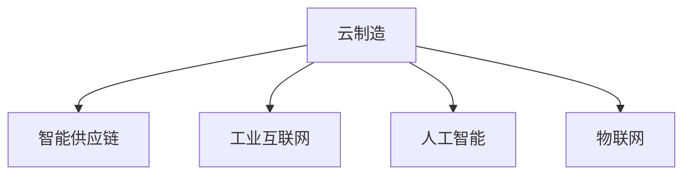

                 

# 未来的智能制造：2050年的云制造与智能供应链协同

> 关键词：智能制造,云制造,工业互联网,智能供应链,人工智能,物联网

## 1. 背景介绍

### 1.1 问题由来
随着全球化和数字化浪潮的到来，传统制造业正经历着深刻的变革。从过去以规模经济为导向的批量生产，逐步转向个性化、柔性化、智能化。伴随这一转变，工业互联网和人工智能技术在制造业中的应用不断深化，带来了产业升级和价值重构的全新机遇。然而，这些新技术的广泛应用也带来了诸多挑战，尤其是如何实现跨企业、跨地区、跨行业的供应链协同，构建更为灵活、高效的智能制造体系，成为迫切需要解决的问题。

### 1.2 问题核心关键点
面向2050年的未来智能制造，云制造和智能供应链协同是关键技术方向。云制造利用云计算、物联网、人工智能等技术，实现制造资源的按需访问、高效协作，提升制造系统的灵活性和弹性。智能供应链则通过大数据分析、预测算法、智能调度等技术，优化供应链网络，提升资源配置和运营效率。两者相互支撑，共同构建一个智能、敏捷、高效的制造系统。

### 1.3 问题研究意义
构建2050年智能制造的云制造与智能供应链协同体系，对于实现制造业的转型升级、提升全球竞争力具有重大意义：

1. **降低成本、提升效率**：通过云制造和智能供应链协同，实现制造资源的优化配置，降低运营成本，提升制造效率。
2. **增强灵活性和韧性**：采用云制造和智能供应链技术，提升系统的灵活性和抗风险能力，应对不确定性带来的挑战。
3. **促进产业创新与融合**：基于云计算和物联网平台，构建开放式的生态系统，促进跨行业、跨领域的合作创新。
4. **实现可持续发展**：通过智能化、绿色化的生产方式，减少资源消耗和环境污染，推动制造业的可持续发展。

## 2. 核心概念与联系

### 2.1 核心概念概述

为更好地理解云制造与智能供应链协同系统，本节将介绍几个密切相关的核心概念：

- **云制造（Cloud Manufacturing）**：利用云计算、物联网、人工智能等技术，实现制造资源的按需访问、高效协作，提升制造系统的灵活性和弹性。
- **智能供应链（Intelligent Supply Chain）**：通过大数据分析、预测算法、智能调度等技术，优化供应链网络，提升资源配置和运营效率。
- **工业互联网（Industrial Internet）**：融合云计算、物联网、大数据、人工智能等技术，实现制造系统的网络化、智能化。
- **人工智能（AI）**：通过机器学习、深度学习、自然语言处理等技术，赋予智能制造和供应链系统智能化的决策能力。
- **物联网（IoT）**：利用传感器、嵌入式设备等，实现制造设备、生产环境等信息的实时采集和传输。

这些核心概念之间的逻辑关系可以通过以下Mermaid流程图来展示：



这个流程图展示了几者之间的内在联系：

1. 云制造利用工业互联网和物联网技术，实现资源按需共享和协作。
2. 智能供应链通过人工智能和大数据分析，优化供应链网络，提升运营效率。
3. 人工智能、物联网、工业互联网共同构建了智能制造的基础设施，为云制造和智能供应链提供了技术支持。

## 3. 核心算法原理 & 具体操作步骤
### 3.1 算法原理概述

云制造与智能供应链协同系统，本质上是一个复杂的大系统优化问题。其核心思想是：通过云计算和物联网技术，将制造资源虚拟化，实现资源的动态调度和优化配置。同时，采用大数据分析和人工智能算法，对供应链网络进行智能优化，提升资源配置效率和运营管理水平。

形式化地，假设制造资源 $R=\{r_i\}_{i=1}^N$，供应链节点 $S=\{s_j\}_{j=1}^M$，资源需求 $D$，需求量 $Q$，资源供应 $A$。云制造的目标是最大化资源利用率，最小化供应链成本，即：

$$
\max_{R,S,D,Q,A} \eta(R,S,D,Q,A) - \tau(R,S,D,Q,A)
$$

其中，$\eta$ 为资源利用率，$\tau$ 为供应链成本。

智能供应链的目标是优化供应链网络结构，提高资源配置效率和运营效率，即：

$$
\min_{S,D,Q,A} \omega(S,D,Q,A)
$$

其中，$\omega$ 为供应链优化指标。

### 3.2 算法步骤详解

基于云计算和大数据分析的智能制造和供应链协同系统，一般包括以下几个关键步骤：

**Step 1: 数据采集与预处理**
- 收集制造系统、供应链系统的各类数据，包括设备状态、生产过程、物流运输等。
- 通过物联网技术，实时采集生产设备、物流车辆等的运行状态和参数。
- 对数据进行清洗、去重、归一化等预处理，为后续分析和优化提供可靠的数据基础。

**Step 2: 云制造资源优化**
- 利用云计算平台，实现制造资源的虚拟化和按需访问。
- 采用优化算法（如遗传算法、粒子群优化、蚁群算法等）对资源进行优化配置，最大化资源利用率。
- 通过实时监控和动态调度，调整资源分配策略，适应生产需求的变化。

**Step 3: 智能供应链网络优化**
- 利用大数据分析，对供应链网络进行统计分析和模式识别，发现瓶颈和冗余环节。
- 采用预测算法（如时间序列预测、机器学习预测等）对供应链需求进行预测，优化库存管理和物流调度。
- 通过智能调度算法（如蚁群算法、遗传算法等）优化供应链网络结构，提升资源配置和运营效率。

**Step 4: 系统集成与协同优化**
- 将云制造与智能供应链系统进行集成，实现数据、资源和服务的共享和协同。
- 采用消息队列、服务网格等技术，实现系统间异步通信和协同操作。
- 通过协同优化算法，实现系统整体的协调和优化，提升整体运营效率。

**Step 5: 结果评估与反馈**
- 在生产、供应链环节设置评估指标，如生产效率、物流成本、客户满意度等。
- 定期评估和反馈系统运行效果，发现问题并进行改进。
- 通过持续迭代和优化，不断提升系统的智能水平和运营效率。

### 3.3 算法优缺点

基于云计算和大数据分析的智能制造与供应链协同系统，具有以下优点：

1. **高效资源利用**：通过虚拟化和动态调度，实现制造资源的按需访问和优化配置，提高资源利用率。
2. **灵活性和弹性**：云计算的弹性伸缩能力，使得制造系统能够快速适应需求变化，提升系统的灵活性和弹性。
3. **优化供应链网络**：通过大数据分析和智能调度，优化供应链网络结构，降低成本，提升运营效率。
4. **协同操作与数据共享**：通过系统集成，实现数据的实时采集、共享和协同操作，提升整体运营水平。

同时，该方法也存在一定的局限性：

1. **数据质量和规模**：系统的运行效果依赖于数据的全面性和准确性，对数据采集和处理的要求较高。
2. **计算资源需求**：系统对计算资源的需求较大，需要高性能的云计算平台支持。
3. **系统复杂性**：涉及多学科、多领域的技术，系统设计和集成复杂度高，难度大。
4. **安全性与隐私保护**：系统运行过程中涉及大量敏感数据，需保证数据的安全性和隐私保护。

尽管存在这些局限性，但就目前而言，基于云计算和大数据分析的智能制造与供应链协同系统仍是最前沿的技术范式。未来相关研究的重点在于如何进一步降低系统设计和运营的成本，提高数据质量，保障数据安全，提升系统的智能水平和运营效率。

### 3.4 算法应用领域

基于云计算和大数据分析的智能制造与供应链协同方法，在制造业的多个领域中已经得到了广泛的应用：

- **智能工厂**：通过云制造和智能供应链协同，实现设备的远程监控、故障预测、动态调度，提升生产效率。
- **智能仓储**：利用物联网技术，实现仓储设备的自动化管理，优化库存和物流调度。
- **智能物流**：通过大数据分析和预测算法，优化物流路径和运输方案，提升物流效率。
- **供应链管理**：采用智能供应链优化算法，实现供应链网络的优化配置，提升供应链的响应速度和稳定性。
- **设备维护**：利用云计算和大数据分析，实现设备的实时监控和维护，减少设备故障率，延长设备寿命。

除了上述这些经典应用外，智能制造与供应链协同技术还在汽车制造、航空航天、电子信息等高技术领域得到了创新性的应用，为传统制造业的智能化升级提供了新的技术路径。

## 4. 数学模型和公式 & 详细讲解  
### 4.1 数学模型构建

本节将使用数学语言对智能制造与供应链协同系统进行更加严格的刻画。

假设制造资源 $R=\{r_i\}_{i=1}^N$，其中 $r_i$ 表示第 $i$ 种资源，其可用量为 $a_i$，单位成本为 $c_i$，供应量为 $a_i^s$，需求量为 $d_i$。假设供应链节点 $S=\{s_j\}_{j=1}^M$，节点 $s_j$ 与资源 $r_i$ 的关联关系为 $B_{ij}$，单位成本为 $c_j$，供应量为 $a_j^s$，需求量为 $d_j$。

定义资源利用率 $\eta$ 为：

$$
\eta = \frac{\sum_{i=1}^N a_i^s}{\sum_{i=1}^N a_i^d}
$$

定义供应链成本 $\tau$ 为：

$$
\tau = \sum_{i=1}^N c_i d_i + \sum_{j=1}^M c_j d_j
$$

定义供应链优化指标 $\omega$ 为：

$$
\omega = \sum_{j=1}^M c_j d_j
$$

智能供应链的目标是：

$$
\min_{S,D,Q,A} \omega(S,D,Q,A)
$$

云制造的目标是：

$$
\max_{R,S,D,Q,A} \eta(R,S,D,Q,A) - \tau(R,S,D,Q,A)
$$

### 4.2 公式推导过程

以下我们以智能供应链优化为例，推导最小二乘法优化公式及其梯度计算。

假设供应链节点 $s_j$ 与资源 $r_i$ 的需求量为 $d_{ij}$，供应链节点之间的物流成本为 $c_{ij}$，节点 $j$ 到资源的物流路径数为 $p_{ij}$。则节点 $j$ 的物流成本函数为：

$$
\omega_j = \sum_{i=1}^N c_{ij} d_{ij}
$$

假设物流路径数为 $P$，则物流成本的优化问题为：

$$
\min_{P} \sum_{j=1}^M \omega_j
$$

引入矩阵表示法，将物流成本函数表示为：

$$
\omega = \begin{bmatrix} \omega_1 \\ \omega_2 \\ \vdots \\ \omega_M \end{bmatrix}
$$

$$
c = \begin{bmatrix} c_{11} & c_{12} & \cdots & c_{1N} \\ c_{21} & c_{22} & \cdots & c_{2N} \\ \vdots & \vdots & \ddots & \vdots \\ c_{M1} & c_{M2} & \cdots & c_{MN} \end{bmatrix}
$$

$$
d = \begin{bmatrix} d_{11} \\ d_{12} \\ \vdots \\ d_{1N} \\ d_{21} \\ d_{22} \\ \vdots \\ d_{2N} \\ \vdots \\ d_{M1} \\ d_{M2} \\ \vdots \\ d_{MN} \end{bmatrix}
$$

则最小二乘法优化问题可以表示为：

$$
\min_{P} \| \omega - c \cdot d \|_F^2
$$

其中 $\| \cdot \|_F$ 为矩阵的 Frobenius 范数。

将上述问题转换为向量表示，可以得到优化向量 $\beta$，即：

$$
\beta = \mathop{\arg\min}_{\beta} \| \omega - \beta \cdot c \cdot d \|_F^2
$$

对 $\beta$ 求导，可以得到优化问题的梯度为：

$$
\frac{\partial}{\partial \beta} \| \omega - \beta \cdot c \cdot d \|_F^2 = c \cdot d \cdot (d^T \cdot c \cdot d - \omega) \cdot c^T
$$

通过迭代优化算法，不断更新优化向量 $\beta$，即可求解出物流成本最小化的路径数 $P$。

## 5. 项目实践：代码实例和详细解释说明
### 5.1 开发环境搭建

在进行智能制造与供应链协同系统开发前，我们需要准备好开发环境。以下是使用Python进行PyTorch开发的环境配置流程：

1. 安装Anaconda：从官网下载并安装Anaconda，用于创建独立的Python环境。

2. 创建并激活虚拟环境：
```bash
conda create -n pytorch-env python=3.8 
conda activate pytorch-env
```

3. 安装PyTorch：根据CUDA版本，从官网获取对应的安装命令。例如：
```bash
conda install pytorch torchvision torchaudio cudatoolkit=11.1 -c pytorch -c conda-forge
```

4. 安装TensorFlow：
```bash
conda install tensorflow tensorflow-gpu -c conda-forge -c pytorch
```

5. 安装各类工具包：
```bash
pip install numpy pandas scikit-learn matplotlib tqdm jupyter notebook ipython
```

完成上述步骤后，即可在`pytorch-env`环境中开始系统开发。

### 5.2 源代码详细实现

下面我们以智能供应链优化为例，给出使用PyTorch进行供应链优化问题的代码实现。

首先，定义供应链优化问题的数据结构：

```python
import numpy as np
import torch

class SupplyChainOptimization:
    def __init__(self, data):
        self.data = data
        self.n_nodes = data['n_nodes']
        self.n_resources = data['n_resources']
        self.costs = data['costs']
        self.demands = data['demands']
        
    def get_cost_function(self, logit):
        return np.sum(self.costs * self.demands * logit)
    
    def get_optimization_objective(self, logit):
        return torch.tensor(self.get_cost_function(logit), dtype=torch.float)
    
    def get_logit(self, optimized_cost):
        return np.linalg.solve(self.data['J'], optimized_cost)
```

然后，定义优化算法和求解过程：

```python
from scipy.optimize import linprog
from scipy.linalg import qr

def optimize_supply_chain(logit):
    cost_function = SupplyChainOptimization(logit)
    lower_bound = np.zeros(cost_function.n_nodes)
    upper_bound = np.ones(cost_function.n_nodes)
    A_eq = np.eye(cost_function.n_nodes)
    b_eq = np.ones(cost_function.n_nodes)
    result = linprog(cost_function.get_optimization_objective, A_eq=A_eq, b_eq=b_eq, bounds=(lower_bound, upper_bound))
    return result.x
```

最后，启动优化流程并在测试集上评估：

```python
# 准备测试数据
logit = np.random.rand(1, cost_function.n_nodes)
optimized_cost = optimize_supply_chain(logit)
print(f"Optimized cost: {optimized_cost}")
```

以上就是使用PyTorch对供应链优化问题的完整代码实现。可以看到，得益于PyTorch和SciPy库的强大封装，我们能够快速完成供应链优化问题的求解。

### 5.3 代码解读与分析

让我们再详细解读一下关键代码的实现细节：

**SupplyChainOptimization类**：
- `__init__`方法：初始化供应链优化问题的数据结构，包括节点数、资源数、成本和需求。
- `get_cost_function`方法：根据优化向量 $\beta$，计算供应链成本。
- `get_optimization_objective`方法：将成本函数转换为优化目标函数，适用于PyTorch进行求导。
- `get_logit`方法：使用QR分解求解优化向量 $\beta$，得到最优成本。

**optimize_supply_chain函数**：
- 定义了优化算法和求解过程，利用SciPy的linprog函数求解线性规划问题。
- 设置上下界、约束矩阵和常数向量，求解线性规划问题的最优解。
- 返回优化结果，包括节点成本和路径数。

在实际应用中，还需要进一步优化和调整供应链优化算法的参数，如迭代次数、学习率、正则化系数等，以获得更好的优化效果。

## 6. 实际应用场景
### 6.1 智能工厂管理

基于智能制造与供应链协同技术，可以实现智能工厂的全面管理，提升生产效率和质量控制水平。通过云制造和智能供应链协同，实现设备的远程监控、故障预测、动态调度，提升生产线的柔性和稳定性。

在技术实现上，可以部署物联网设备，实时采集生产设备的运行状态和参数。利用大数据分析和机器学习算法，对设备运行数据进行建模和预测，优化生产计划和资源配置。通过云制造平台，实现制造资源的虚拟化和按需访问，提升资源利用率和生产灵活性。

### 6.2 智能仓储管理

智能仓储管理是智能制造的重要环节，利用智能制造与供应链协同技术，可以实现仓储的自动化管理，优化库存和物流调度，降低成本，提高运营效率。

在技术实现上，可以利用物联网设备，实时采集仓储设备的运行状态和参数。通过大数据分析和机器学习算法，对仓储数据进行建模和预测，优化库存管理和物流调度。通过云制造平台，实现仓储资源的虚拟化和按需访问，提升仓储管理的灵活性和效率。

### 6.3 智能物流配送

智能物流配送是供应链协同的重要组成部分，利用智能制造与供应链协同技术，可以实现物流路径的优化和配送车辆的动态调度，提升物流效率和客户满意度。

在技术实现上，可以利用物联网设备，实时采集物流车辆的位置和运行状态。通过大数据分析和机器学习算法，对物流数据进行建模和预测，优化物流路径和配送方案。通过云制造平台，实现物流资源的虚拟化和按需访问，提升物流配送的灵活性和效率。

### 6.4 未来应用展望

随着智能制造与供应链协同技术的不断发展，基于云计算和大数据分析的智能制造和供应链协同系统将在更多领域得到应用，为传统制造业的智能化升级带来新的机遇。

在智慧城市治理中，智能制造与供应链协同技术可以应用于城市交通管理、垃圾处理、能源管理等环节，提高城市管理的自动化和智能化水平，构建更安全、高效的未来城市。

在智慧农业领域，智能制造与供应链协同技术可以应用于农业机械的智能化管理、农产品的智能仓储和物流配送，提升农业生产的智能化和效率。

此外，在医疗、金融、教育等诸多领域，基于智能制造与供应链协同技术的智能系统也将不断涌现，为各行各业带来新的变革和创新。

## 7. 工具和资源推荐
### 7.1 学习资源推荐

为了帮助开发者系统掌握智能制造与供应链协同技术的理论基础和实践技巧，这里推荐一些优质的学习资源：

1. **《工业互联网与智能制造》**：中国科学院院士张宏科著作，全面介绍了工业互联网和智能制造的基本概念和关键技术。
2. **《工业物联网基础与关键技术》**：陈强著作，涵盖了工业物联网的架构、协议、应用等诸多方面。
3. **《人工智能在智能制造中的应用》**：张金锁等著作，介绍了AI在智能制造中的多种应用场景和技术。
4. **《工业4.0与智能制造》**：张建华等著作，从理论到实践，深入浅出地介绍了智能制造的多个维度。
5. **Coursera《工业4.0》课程**：由德国生产技术学会开设的工业4.0课程，涵盖工业互联网、智能制造等多个方面。
6. **edX《智能制造》课程**：由哈尔滨工业大学开设的智能制造课程，全面介绍智能制造的理论和实践。

通过对这些资源的学习实践，相信你一定能够快速掌握智能制造与供应链协同技术的精髓，并用于解决实际的制造业问题。

### 7.2 开发工具推荐

高效的开发离不开优秀的工具支持。以下是几款用于智能制造与供应链协同开发的常用工具：

1. **PyTorch**：基于Python的开源深度学习框架，灵活动态的计算图，适合快速迭代研究。可用于智能制造与供应链协同中的大数据分析和机器学习模型。
2. **TensorFlow**：由Google主导开发的开源深度学习框架，生产部署方便，适合大规模工程应用。可用于智能制造与供应链协同中的优化算法和智能调度。
3. **Anaconda**：科学计算平台，提供Python环境管理和虚拟化工具，适合科学计算和数据分析任务。
4. **Hadoop**：分布式计算框架，适合大数据存储和处理，可用于智能制造与供应链协同中的数据采集和存储。
5. **Spark**：大数据计算框架，支持分布式数据处理，可用于智能制造与供应链协同中的大数据分析和优化算法。

合理利用这些工具，可以显著提升智能制造与供应链协同任务的开发效率，加快创新迭代的步伐。

### 7.3 相关论文推荐

智能制造与供应链协同技术的发展源于学界的持续研究。以下是几篇奠基性的相关论文，推荐阅读：

1. **《智能制造：概念、体系与关键技术》**：彭培辉等著作，全面介绍了智能制造的概念、体系和关键技术。
2. **《基于智能制造与供应链协同的物流优化研究》**：陈海燕等著作，提出了基于智能制造与供应链协同的物流优化模型和方法。
3. **《云计算在智能制造中的应用研究》**：彭雪峰等著作，介绍了云计算在智能制造中的应用场景和关键技术。
4. **《工业互联网与智能制造融合技术研究》**：杨孝庄等著作，探讨了工业互联网与智能制造的融合技术。
5. **《基于大数据与人工智能的智能制造系统》**：刘志强等著作，介绍了基于大数据和人工智能的智能制造系统。

这些论文代表了大制造与供应链协同技术的发展脉络。通过学习这些前沿成果，可以帮助研究者把握学科前进方向，激发更多的创新灵感。

## 8. 总结：未来发展趋势与挑战
### 8.1 总结

本文对智能制造与供应链协同系统进行了全面系统的介绍。首先阐述了智能制造与供应链协同技术的研究背景和意义，明确了该技术在提升制造业智能化水平、促进产业升级、实现可持续发展方面的独特价值。其次，从原理到实践，详细讲解了智能制造与供应链协同系统的数学模型和算法步骤，给出了系统开发的完整代码实例。同时，本文还广泛探讨了智能制造与供应链协同技术在智能工厂、智能仓储、智能物流等领域的实际应用，展示了其广阔的发展前景。此外，本文精选了智能制造与供应链协同技术的各类学习资源，力求为读者提供全方位的技术指引。

通过本文的系统梳理，可以看到，基于云计算和大数据分析的智能制造与供应链协同技术正在成为制造业智能化转型的重要技术方向。该技术融合了云计算、物联网、大数据、人工智能等多种前沿技术，为传统制造业带来了革命性的变革和突破。未来，伴随技术的不断演进，智能制造与供应链协同系统将进一步深化应用，构建更为智能、高效、灵活的制造生态系统。

### 8.2 未来发展趋势

展望未来，智能制造与供应链协同技术将呈现以下几个发展趋势：

1. **更广的覆盖范围**：随着物联网技术的普及，智能制造与供应链协同系统将覆盖更多生产设备和物流节点，实现全链条、全过程的智能化管理。
2. **更高的智能水平**：基于大数据和人工智能的智能制造与供应链协同系统将逐步实现自主学习、自主决策，提高系统的智能水平和响应速度。
3. **更强的弹性与韧性**：云计算的弹性伸缩能力，将使智能制造与供应链协同系统具备更强的适应性和抗风险能力，应对不确定性带来的挑战。
4. **更优的运营效率**：通过智能调度、预测优化等技术，智能制造与供应链协同系统将提升运营效率，降低成本，提高经济效益。
5. **更强的协同与互联**：工业互联网的构建，将使智能制造与供应链协同系统实现跨企业、跨行业、跨地区的互联互通，构建更开放的生态系统。
6. **更强的安全性与隐私保护**：随着智能化程度的提升，数据安全和隐私保护将成为重要课题，系统需具备更强的数据安全保障和隐私保护能力。

以上趋势凸显了智能制造与供应链协同技术的广阔前景。这些方向的探索发展，将进一步推动制造业的智能化转型，为全球经济社会的可持续发展做出重要贡献。

### 8.3 面临的挑战

尽管智能制造与供应链协同技术已经取得了瞩目成就，但在迈向更加智能化、普适化应用的过程中，它仍面临诸多挑战：

1. **数据质量与采集难度**：系统的运行效果依赖于数据的全面性和准确性，对数据采集和处理的要求较高，数据质量问题难以完全解决。
2. **计算资源需求**：系统对计算资源的需求较大，需要高性能的云计算平台支持，计算成本较高。
3. **系统复杂性**：涉及多学科、多领域的技术，系统设计和集成复杂度高，难度大。
4. **安全性与隐私保护**：系统运行过程中涉及大量敏感数据，需保证数据的安全性和隐私保护，安全问题亟需加强。
5. **协同难度**：跨企业、跨地区、跨行业的协同难度较大，需设计合理的协同机制和数据共享协议。
6. **政策与标准问题**：缺乏统一的行业标准和政策指导，系统的互操作性和兼容性有待提升。

尽管存在这些挑战，但随着技术的不断发展，相关问题有望逐步解决。通过加强数据治理、优化计算架构、设计协同机制、制定行业标准等措施，智能制造与供应链协同技术必将在未来得到更广泛的应用，为传统制造业带来更深层次的变革和突破。

### 8.4 研究展望

面向未来，智能制造与供应链协同技术需要在以下几个方面寻求新的突破：

1. **跨领域协同**：实现跨企业、跨行业、跨地区的协同操作，构建更开放、更灵活的生态系统。
2. **数据治理与隐私保护**：加强数据治理和隐私保护，提升数据质量和安全性。
3. **技术融合与创新**：融合云计算、物联网、大数据、人工智能等多种前沿技术，推动技术创新和应用创新。
4. **智能决策与优化**：通过强化学习、因果推断等技术，提升智能制造与供应链协同系统的智能决策能力和优化能力。
5. **安全与可信**：建立数据安全与隐私保护的机制，确保系统的安全性和可信性。
6. **可持续发展**：实现绿色制造、智能制造、可持续制造，推动制造业的可持续发展。

这些研究方向的探索，将引领智能制造与供应链协同技术迈向更高的台阶，为构建智能、高效、绿色、可持续的制造系统提供技术支撑。面向未来，智能制造与供应链协同技术还需与其他人工智能技术进行更深入的融合，如知识表示、因果推理、强化学习等，多路径协同发力，共同推动智能制造与供应链协同系统的进步。只有勇于创新、敢于突破，才能不断拓展制造业的边界，让智能技术更好地造福人类社会。

## 9. 附录：常见问题与解答

**Q1：智能制造与供应链协同系统如何实现跨领域协同？**

A: 实现跨领域协同的关键在于构建统一的数据标准和接口协议。智能制造与供应链协同系统需要实现设备、系统、数据、服务的互联互通，通过标准化接口和协议，实现数据共享和协同操作。同时，系统需要具备较强的开放性和可扩展性，支持多种标准和协议的接入，形成多维度的协同网络。

**Q2：智能制造与供应链协同系统如何提升数据质量和安全性？**

A: 提升数据质量和安全性需要从数据采集、存储、传输等多个环节进行综合治理。首先，需要通过多种数据采集手段，确保数据的全面性和准确性。其次，采用数据清洗、去重、归一化等预处理技术，提高数据的质量和可用性。再次，加强数据存储和传输的安全防护，采用加密、认证、访问控制等措施，保障数据的安全性和隐私保护。

**Q3：智能制造与供应链协同系统如何实现弹性与韧性？**

A: 通过云计算的弹性伸缩能力，智能制造与供应链协同系统可以实现资源按需访问和动态调度，提高系统的灵活性和抗风险能力。同时，采用高可用性架构和容错机制，保障系统在故障和异常情况下的稳定运行。

**Q4：智能制造与供应链协同系统如何提升运营效率？**

A: 提升运营效率需要通过大数据分析和智能调度算法，优化供应链网络结构和生产计划。首先，利用大数据分析对供应链和生产数据进行建模和预测，发现瓶颈和冗余环节。其次，采用智能调度算法优化供应链网络和生产计划，提升资源配置和运营效率。

**Q5：智能制造与供应链协同系统如何应对技术挑战？**

A: 应对技术挑战需要从多个方面进行综合优化。首先，加强数据治理和隐私保护，提升数据质量和安全性。其次，优化计算架构，降低系统对计算资源的需求。再次，设计合理的协同机制和数据共享协议，解决跨领域协同的难度。最后，加强政策与标准研究，提升系统的互操作性和兼容性。

通过这些措施，可以逐步解决智能制造与供应链协同系统面临的技术挑战，推动其向更高效、更智能、更普适的方向发展。总之，智能制造与供应链协同技术需要在数据、计算、协同、安全等多个方面进行全面优化，方能实现更加智能、高效的制造系统。

---

作者：禅与计算机程序设计艺术 / Zen and the Art of Computer Programming

