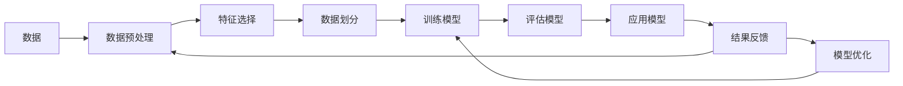

                 

# 机器学习在知识发现中的角色

> 关键词：知识发现, 机器学习, 数据挖掘, 人工智能, 大数据

## 1. 背景介绍

### 1.1 问题由来
随着信息技术的迅猛发展，人类社会产生了前所未有的海量数据。这些数据中蕴含着丰富、有价值的信息，但同时也被淹没在数据海洋中，难以被人们直接发现和利用。为了挖掘这些隐匿的知识，数据科学家和工程师们提出了知识发现(Knowledge Discovery)的概念，希望通过科学的算法和技术手段，从大量数据中提炼出有价值的知识和规律。

知识发现是一门涉及计算机科学、数据科学、人工智能等多个领域的交叉学科，其目标是自动或半自动地从数据中发现有用、新颖、可理解的知识，广泛应用于商业决策、科学研究和金融预测等领域。机器学习作为知识发现的核心技术，扮演着至关重要的角色。

### 1.2 问题核心关键点
知识发现的核心关键点在于，如何自动从大规模数据中挖掘出隐藏在其中的规律和模式。机器学习技术提供了强大的工具和方法，可以高效地处理大量复杂数据，从中提取有用知识。机器学习算法通常分为监督学习、无监督学习和强化学习三大类，广泛应用于分类、聚类、关联规则挖掘、异常检测等多个任务中。

具体而言，机器学习在知识发现中的作用可以概括为以下几点：
1. **自动特征提取**：从原始数据中提取有用特征，为后续分析提供基础。
2. **模式识别与分类**：通过训练模型识别数据中的模式，将数据分为不同的类别。
3. **聚类分析**：对数据进行分组，发现数据中的内在结构。
4. **关联规则挖掘**：发现数据集中的频繁项集和关联规则，辅助商业决策。
5. **异常检测**：识别数据中的异常点，帮助风险控制和故障诊断。

## 2. 核心概念与联系

### 2.1 核心概念概述

为了更好地理解机器学习在知识发现中的应用，本节将介绍几个关键概念：

- **机器学习(Machine Learning)**：通过数据驱动的方式，让机器自动学习规律、做出决策的过程。机器学习广泛应用于数据挖掘、模式识别、自然语言处理等领域。

- **数据挖掘(Data Mining)**：从大规模数据集中自动发现有用信息和知识的过程。数据挖掘的主要目的是发现数据中的模式、规律和关联。

- **知识发现(Knowledge Discovery in Databases, KDD)**：通过数据挖掘和分析，自动从数据中提取有用、新颖、可理解的知识。KDD是数据挖掘的一个重要应用方向，旨在从数据中提取高层次的知识。

- **监督学习(Supervised Learning)**：使用已标注的数据训练模型，用于分类、回归等任务。

- **无监督学习(Unsupervised Learning)**：使用未标注的数据训练模型，用于聚类、关联规则挖掘等任务。

- **强化学习(Reinforcement Learning)**：通过奖励和惩罚机制，让机器自主学习最优策略，应用于游戏、机器人等领域。

这些概念之间的关系可以通过以下Mermaid流程图来展示：



这个流程图展示数据挖掘和机器学习的关键步骤，从数据预处理到模型应用，再到结果反馈和模型优化，形成一个闭环。

## 3. 核心算法原理 & 具体操作步骤

### 3.1 算法原理概述

机器学习在知识发现中，主要通过以下几个关键算法实现：

- **监督学习算法**：如决策树、支持向量机、朴素贝叶斯等，使用标注数据训练模型，识别数据中的模式和规律。
- **无监督学习算法**：如K-means聚类、主成分分析(PCA)、奇异值分解(SVD)等，从未标注数据中发现数据的内在结构和模式。
- **关联规则挖掘算法**：如Apriori、FP-growth等，发现数据集中的频繁项集和关联规则，辅助商业决策。
- **异常检测算法**：如孤立森林、局部异常因子(LOF)等，识别数据中的异常点，帮助风险控制和故障诊断。

这些算法通过不同的学习方式，从数据中提取出有用的知识，支撑知识发现的各个环节。

### 3.2 算法步骤详解

机器学习在知识发现中的应用步骤主要包括：

**Step 1: 数据收集与预处理**
- 收集相关领域的原始数据，如销售数据、传感器数据、社交媒体数据等。
- 对数据进行清洗、去重、规范化等预处理操作，准备数据用于后续分析。

**Step 2: 特征选择与提取**
- 选择与任务相关的特征，构建特征集合。
- 利用统计方法或机器学习算法提取特征，如PCA、LDA、ICA等。

**Step 3: 模型训练与评估**
- 选择合适的机器学习算法，训练模型。
- 使用验证集或交叉验证方法评估模型性能，调整超参数。

**Step 4: 知识发现与提取**
- 应用训练好的模型对新数据进行预测或分类，识别数据中的规律和模式。
- 结合业务知识和专家经验，对结果进行理解和解释。

**Step 5: 模型优化与迭代**
- 根据结果反馈，不断优化模型，提升准确度和泛化能力。
- 使用新的数据进行迭代训练，持续改进模型效果。

### 3.3 算法优缺点

机器学习在知识发现中的应用具有以下优点：
1. **高效处理大规模数据**：机器学习算法能够高效处理海量数据，发现其中的模式和规律。
2. **自动化决策**：机器学习能够自动从数据中提取特征，生成模型，辅助决策。
3. **可扩展性强**：机器学习算法可以随着数据量的增加不断提升效果，适应不断变化的需求。
4. **应用广泛**：机器学习广泛应用于商业、金融、医疗等多个领域，帮助解决实际问题。

同时，机器学习在知识发现中也有一定的局限性：
1. **数据质量依赖性高**：机器学习模型依赖于数据的质量和标注，数据偏差会影响模型效果。
2. **模型解释性不足**：部分机器学习模型如深度学习模型，具有黑盒性质，难以解释其内部决策过程。
3. **过拟合风险**：当数据量较少或特征维度较高时，模型容易过拟合，泛化能力不足。
4. **参数调优复杂**：机器学习模型需要调整大量超参数，调优过程复杂，需要经验和经验。

尽管存在这些局限性，但机器学习作为知识发现的核心技术，已经证明在处理复杂数据、识别模式方面具有不可替代的作用。未来相关研究的重点在于如何进一步提升模型的可解释性、泛化能力和调优效率，同时降低对数据质量的需求。

### 3.4 算法应用领域

机器学习在知识发现中的应用领域非常广泛，以下是几个典型的应用场景：

- **金融领域**：利用机器学习算法对金融数据进行分类、预测、异常检测等，辅助投资决策和风险控制。
- **医疗领域**：通过机器学习算法对医疗数据进行分析，发现疾病模式，辅助诊断和治疗决策。
- **市场营销**：使用机器学习算法对客户数据进行聚类和关联规则挖掘，实现个性化推荐和精准营销。
- **供应链管理**：利用机器学习算法对供应链数据进行分析，优化库存管理、预测需求等。
- **自然语言处理**：通过机器学习算法对文本数据进行分类、摘要、情感分析等，辅助信息检索和知识管理。

这些应用场景展示了机器学习在知识发现中的强大潜力和广泛应用，有助于提升各个行业的决策效率和准确性。

## 4. 数学模型和公式 & 详细讲解 & 举例说明

### 4.1 数学模型构建

机器学习在知识发现中的数学模型构建，通常包括以下几个关键步骤：

- **问题建模**：将实际问题转化为数学模型，如分类问题、回归问题、聚类问题等。
- **特征设计**：选择与问题相关的特征，构建特征向量。
- **模型选择**：选择适合的机器学习算法，如线性回归、决策树、神经网络等。
- **损失函数设计**：定义模型预测与真实标签之间的损失函数，如均方误差、交叉熵等。
- **优化算法设计**：选择优化算法，如梯度下降、随机梯度下降等，最小化损失函数。

以回归问题为例，假设输入为 $x \in \mathbb{R}^n$，输出为 $y \in \mathbb{R}$，回归模型为 $f(x;\theta) = \theta^T \varphi(x)$，其中 $\theta \in \mathbb{R}^m$，$\varphi(x)$ 为特征映射。损失函数为均方误差：

$$
L(y,f(x;\theta)) = \frac{1}{2n}\sum_{i=1}^n (y_i - f(x_i;\theta))^2
$$

优化目标为最小化损失函数：

$$
\min_{\theta} L(y,f(x;\theta))
$$

使用梯度下降算法，更新参数 $\theta$：

$$
\theta \leftarrow \theta - \alpha \nabla_{\theta} L(y,f(x;\theta))
$$

其中 $\alpha$ 为学习率，$\nabla_{\theta} L(y,f(x;\theta))$ 为损失函数对参数 $\theta$ 的梯度，可通过反向传播算法高效计算。

### 4.2 公式推导过程

以下我们以线性回归为例，推导均方误差损失函数的梯度计算过程。

假设回归模型的输入为 $x_i \in \mathbb{R}^n$，输出为 $y_i \in \mathbb{R}$，回归模型的参数为 $\theta = [\theta_0, \theta_1, ..., \theta_n]^T$。均方误差损失函数为：

$$
L(y,f(x;\theta)) = \frac{1}{2n}\sum_{i=1}^n (y_i - f(x_i;\theta))^2
$$

损失函数对参数 $\theta_j$ 的梯度为：

$$
\frac{\partial L(y,f(x;\theta))}{\partial \theta_j} = \frac{1}{n}\sum_{i=1}^n (y_i - f(x_i;\theta))x_{ij}
$$

其中 $f(x_i;\theta) = \theta_0 + \sum_{j=1}^n \theta_j x_{ij}$。

在得到损失函数的梯度后，即可带入梯度下降算法，完成模型的迭代优化。重复上述过程直至收敛，最终得到适应特定问题的最优模型参数 $\theta^*$。

### 4.3 案例分析与讲解

以金融领域的信用评分问题为例，说明机器学习在知识发现中的应用。

假设我们需要构建一个信用评分模型，预测客户是否会违约。原始数据包含客户的个人信息、交易记录等，我们需要从中提取特征，构建特征向量。

**Step 1: 数据收集与预处理**
- 收集客户的个人信息、交易记录、历史评分等数据。
- 对数据进行清洗、去重、规范化等预处理操作，准备数据用于后续分析。

**Step 2: 特征选择与提取**
- 选择与信用评分相关的特征，如年龄、收入、贷款金额等。
- 利用PCA等方法对特征进行降维，减少特征维度。

**Step 3: 模型训练与评估**
- 选择线性回归模型，构建特征向量 $\varphi(x)$。
- 使用交叉验证方法评估模型性能，调整超参数。

**Step 4: 知识发现与提取**
- 应用训练好的模型对新客户数据进行预测，生成信用评分。
- 结合业务知识和专家经验，对结果进行理解和解释。

**Step 5: 模型优化与迭代**
- 根据结果反馈，不断优化模型，提升准确度和泛化能力。
- 使用新的客户数据进行迭代训练，持续改进模型效果。

通过上述步骤，我们构建了信用评分模型，实现了从数据中发现知识，辅助金融机构决策的目标。

## 5. 项目实践：代码实例和详细解释说明

### 5.1 开发环境搭建

在进行机器学习项目实践前，我们需要准备好开发环境。以下是使用Python进行Scikit-learn开发的Python环境配置流程：

1. 安装Anaconda：从官网下载并安装Anaconda，用于创建独立的Python环境。

2. 创建并激活虚拟环境：
```bash
conda create -n ml-env python=3.8 
conda activate ml-env
```

3. 安装Scikit-learn和其他必要的工具包：
```bash
pip install scikit-learn pandas numpy matplotlib scikit-image seaborn jupyter notebook
```

完成上述步骤后，即可在`ml-env`环境中开始项目实践。

### 5.2 源代码详细实现

这里我们以线性回归模型为例，给出使用Scikit-learn库进行信用评分问题微调的Python代码实现。

首先，定义数据处理函数：

```python
import pandas as pd
from sklearn.model_selection import train_test_split

def load_data(filename):
    df = pd.read_csv(filename)
    X = df.drop(['default'], axis=1)
    y = df['default']
    return X, y

def train_test_split_data(X, y, test_size=0.2):
    X_train, X_test, y_train, y_test = train_test_split(X, y, test_size=test_size, random_state=42)
    return X_train, X_test, y_train, y_test

X, y = load_data('creditcard.csv')
X_train, X_test, y_train, y_test = train_test_split_data(X, y)
```

然后，定义模型和优化器：

```python
from sklearn.linear_model import LinearRegression
from sklearn.metrics import mean_squared_error

model = LinearRegression()
```

接着，定义训练和评估函数：

```python
from sklearn.model_selection import cross_val_score
from sklearn.metrics import classification_report

def train_model(model, X_train, y_train):
    model.fit(X_train, y_train)
    return model

def evaluate_model(model, X_test, y_test):
    y_pred = model.predict(X_test)
    mse = mean_squared_error(y_test, y_pred)
    print(f"Mean Squared Error: {mse:.3f}")
    return mse

mse = evaluate_model(model, X_test, y_test)
```

最后，启动训练流程并在测试集上评估：

```python
train_model(model, X_train, y_train)
```

以上就是使用Scikit-learn库对线性回归模型进行信用评分问题微调的完整代码实现。可以看到，得益于Scikit-learn库的强大封装，我们可以用相对简洁的代码完成线性回归模型的构建和微调。

### 5.3 代码解读与分析

让我们再详细解读一下关键代码的实现细节：

**load_data函数**：
- 定义数据加载函数，读取CSV格式的数据文件，将数据转换为Pandas数据框。
- 从数据框中分离特征和标签，并进行标准化处理。

**train_test_split_data函数**：
- 定义数据分割函数，将数据集分为训练集和测试集，并进行交叉验证。
- 返回分割后的训练集、测试集、训练集标签和测试集标签。

**train_model函数**：
- 定义模型训练函数，使用训练集数据训练线性回归模型。
- 返回训练好的模型。

**evaluate_model函数**：
- 定义模型评估函数，使用测试集数据评估模型性能。
- 计算均方误差，并输出结果。

**训练流程**：
- 加载数据，并进行数据分割和标准化。
- 训练线性回归模型。
- 在测试集上评估模型性能，输出均方误差。

可以看到，Scikit-learn库提供了丰富的机器学习算法和工具函数，使得机器学习项目开发变得便捷高效。开发者可以将更多精力放在模型设计和业务逻辑上，而不必过多关注底层实现细节。

当然，工业级的系统实现还需考虑更多因素，如模型的保存和部署、超参数的自动搜索、更灵活的特征工程等。但核心的机器学习流程基本与此类似。

## 6. 实际应用场景

### 6.1 金融领域

在金融领域，机器学习在信用评分、风险管理、投资决策等方面得到了广泛应用。通过机器学习算法，金融机构可以从大量数据中提取有用的特征，构建精确的信用评分模型，帮助评估客户的信用风险，优化贷款决策。

以信用评分问题为例，通过机器学习算法，我们可以从客户的个人信息、交易记录等数据中提取有用特征，构建特征向量。然后使用线性回归、决策树等算法进行模型训练，生成客户的信用评分。在预测新客户信用风险时，模型可以根据历史数据和业务知识，给出信用评分，辅助决策。

### 6.2 医疗领域

在医疗领域，机器学习在疾病预测、治疗方案推荐、个性化医疗等方面也发挥了重要作用。通过机器学习算法，医疗机构可以从患者的医疗记录、基因数据等数据中提取特征，构建预测模型，帮助医生进行疾病诊断和治疗决策。

以疾病预测问题为例，通过机器学习算法，我们可以从患者的医疗记录、基因数据等数据中提取有用特征，构建预测模型。然后使用随机森林、支持向量机等算法进行模型训练，预测患者是否患有某种疾病。在预测新患者病情时，模型可以根据历史数据和专家知识，给出预测结果，辅助医生决策。

### 6.3 市场营销

在市场营销领域，机器学习在客户细分、个性化推荐、广告投放等方面也得到了广泛应用。通过机器学习算法，企业可以从客户的购买记录、行为数据等数据中提取特征，构建模型，帮助制定精准的营销策略。

以客户细分问题为例，通过机器学习算法，我们可以从客户的购买记录、行为数据等数据中提取有用特征，构建聚类模型。然后使用K-means、DBSCAN等算法进行模型训练，对客户进行细分。在制定营销策略时，可以根据客户的细分结果，制定个性化的营销方案，提高营销效果。

### 6.4 未来应用展望

随着机器学习技术的不断发展，其应用领域也将不断扩展，未来可能会出现更多创新的应用场景：

- **智能制造**：通过机器学习算法，优化生产流程、预测设备故障，提升生产效率和质量。
- **智慧城市**：通过机器学习算法，分析城市交通数据、环境数据等，优化城市管理，提高城市运行效率。
- **个性化教育**：通过机器学习算法，分析学生的学习行为、成绩数据等，提供个性化的学习方案，提高教学效果。
- **智能客服**：通过机器学习算法，构建智能客服系统，提高客户服务质量和效率。

未来，随着机器学习技术的不断成熟和普及，其在知识发现中的应用将越来越广泛，对各行各业带来深远的影响。

## 7. 工具和资源推荐

### 7.1 学习资源推荐

为了帮助开发者系统掌握机器学习在知识发现中的应用，这里推荐一些优质的学习资源：

1. 《机器学习》一书（周志华著）：全面介绍了机器学习的理论和算法，是学习机器学习的经典教材。

2. 《Python机器学习》一书（Stefanie Molin等著）：介绍了使用Python进行机器学习项目的开发和实践。

3. Coursera《机器学习》课程（Andrew Ng教授主讲）：由斯坦福大学开设的入门级机器学习课程，涵盖了机器学习的基本概念和算法。

4. Kaggle数据科学竞赛平台：提供了丰富的数据集和竞赛，是学习机器学习项目开发的实践平台。

5. Scikit-learn官方文档：提供了详细的机器学习算法和工具函数的文档，是学习机器学习项目开发的重要参考资料。

通过对这些资源的学习实践，相信你一定能够快速掌握机器学习在知识发现中的应用，并用于解决实际的商业问题。

### 7.2 开发工具推荐

高效的开发离不开优秀的工具支持。以下是几款用于机器学习项目开发的常用工具：

1. Jupyter Notebook：免费的开源工具，支持多种编程语言，非常适合快速迭代研究和数据探索。

2. TensorFlow：由Google主导开发的深度学习框架，生产部署方便，适合大规模工程应用。

3. PyTorch：基于Python的开源深度学习框架，灵活动态的计算图，适合快速迭代研究。

4. Scikit-learn：Python中常用的机器学习库，提供了丰富的算法和工具函数，非常适合数据挖掘和分析任务。

5. Weights & Biases：模型训练的实验跟踪工具，可以记录和可视化模型训练过程中的各项指标，方便对比和调优。

6. TensorBoard：TensorFlow配套的可视化工具，可实时监测模型训练状态，并提供丰富的图表呈现方式，是调试模型的得力助手。

合理利用这些工具，可以显著提升机器学习项目开发效率，加快创新迭代的步伐。

### 7.3 相关论文推荐

机器学习在知识发现中的应用源于学界的持续研究。以下是几篇奠基性的相关论文，推荐阅读：

1. "A Framework of Knowledge Discovery in Databases"（作者：Jian-Yi Chou）：介绍了知识发现的框架和过程，是KDD领域的经典文献。

2. "Induction of Frequent Itemsets in Large Databases"（作者：Rakesh Agrawal, Raghu Ramakrishnan, Daniel S. Kamber）：介绍了Apriori算法，是关联规则挖掘领域的奠基之作。

3. "Anomaly Detection in Financial Transactions"（作者：Ganggang Yin, Qiankun Yang, Yaxiong Xu）：介绍了金融领域中的异常检测问题，展示了机器学习在风险控制中的应用。

4. "Credit Risk Scoring Using Deep Learning"（作者：Rahul Ramesh, Mohit Arora, Rohan Shah）：介绍了使用深度学习进行信用评分的问题，展示了机器学习在金融领域的创新应用。

5. "A Survey on Deep Learning and Its Applications in Healthcare"（作者：Mohamed A. El-Kasrawi, Véronique Barrière）：介绍了深度学习在医疗领域的应用，展示了机器学习在医疗领域的潜力。

这些论文代表了大数据和机器学习在知识发现领域的研究进展，通过学习这些前沿成果，可以帮助研究者把握学科前进方向，激发更多的创新灵感。

## 8. 总结：未来发展趋势与挑战

### 8.1 总结

本文对机器学习在知识发现中的应用进行了全面系统的介绍。首先阐述了知识发现的核心问题，明确了机器学习在其中的核心作用。其次，从原理到实践，详细讲解了机器学习的基本算法和操作步骤，给出了机器学习项目开发的完整代码实例。同时，本文还广泛探讨了机器学习在金融、医疗、市场营销等多个领域的应用前景，展示了机器学习技术的强大潜力和广泛应用。

通过本文的系统梳理，可以看到，机器学习作为知识发现的核心技术，已经证明在处理复杂数据、识别模式方面具有不可替代的作用。未来相关研究的重点在于如何进一步提升模型的可解释性、泛化能力和调优效率，同时降低对数据质量的需求。

### 8.2 未来发展趋势

展望未来，机器学习在知识发现中的应用将呈现以下几个发展趋势：

1. **自动化程度提高**：未来机器学习算法将更加自动化，能够自动进行数据清洗、特征选择、模型训练等步骤，降低对人工干预的依赖。

2. **深度学习普及**：深度学习算法在知识发现中的应用将越来越广泛，特别是在视觉、语音等领域，深度学习算法展示了其独特的优势。

3. **跨模态融合**：未来的知识发现系统将更加注重多模态数据的融合，结合文本、图像、语音等多源数据，提升系统的综合分析能力。

4. **在线学习**：未来的知识发现系统将更加注重在线学习，能够实时更新模型，适应数据分布的变化。

5. **因果推断**：未来的知识发现系统将更加注重因果推断，能够识别数据中的因果关系，帮助做出更加可靠的决策。

6. **伦理道德**：未来的知识发现系统将更加注重伦理道德，避免偏见和歧视，保护数据隐私和安全。

这些趋势将推动机器学习在知识发现中的应用不断深入，为各行各业带来更加精准、可靠、透明的知识发现服务。

### 8.3 面临的挑战

尽管机器学习在知识发现中已经取得了显著进展，但在迈向更加智能化、普适化应用的过程中，它仍面临诸多挑战：

1. **数据质量问题**：机器学习模型的效果依赖于数据质量，数据偏差、噪音等问题会影响模型效果。

2. **模型复杂性**：深度学习模型结构复杂，难以解释，难以调试和优化。

3. **计算资源需求**：深度学习模型计算量大，需要高性能计算资源，对硬件环境要求较高。

4. **模型泛化能力**：深度学习模型容易过拟合，泛化能力不足，难以应对复杂、动态的数据环境。

5. **可解释性问题**：深度学习模型通常具有黑盒性质，难以解释其内部决策过程，影响模型可信度和接受度。

6. **伦理道德问题**：机器学习模型可能学习到有偏见、有害的信息，给社会带来负面影响。

7. **数据隐私问题**：机器学习模型在处理敏感数据时，需要考虑数据隐私和保护问题。

这些挑战是当前机器学习在知识发现应用中亟需解决的问题，只有克服这些挑战，才能推动机器学习技术的进一步发展。

### 8.4 研究展望

面对机器学习在知识发现中面临的挑战，未来的研究需要在以下几个方面寻求新的突破：

1. **数据预处理和清洗**：开发更加高效、鲁棒的数据预处理和清洗技术，提高数据质量。

2. **模型自动化和可解释性**：开发更加自动化、可解释的机器学习算法，提升模型可信度和接受度。

3. **跨模态学习**：开发跨模态数据融合技术，提升多源数据的综合分析能力。

4. **在线学习**：开发更加灵活的在线学习算法，适应数据分布的变化，提高模型的实时性。

5. **因果推断**：开发因果推断技术，识别数据中的因果关系，提升决策的可靠性和透明性。

6. **伦理道德**：开发伦理道德约束机制，避免模型偏见和有害信息，保护数据隐私和安全。

这些研究方向的探索，必将引领机器学习在知识发现中的应用走向新的高度，为构建安全、可靠、透明的知识发现系统铺平道路。面向未来，机器学习技术还需要与其他人工智能技术进行更深入的融合，如知识表示、因果推理、强化学习等，多路径协同发力，共同推动知识发现技术的进步。只有勇于创新、敢于突破，才能不断拓展机器学习在知识发现中的应用边界，让智能技术更好地造福人类社会。

## 9. 附录：常见问题与解答

**Q1：机器学习在知识发现中的优势是什么？**

A: 机器学习在知识发现中的优势主要体现在以下几个方面：
1. **高效处理大规模数据**：机器学习算法能够高效处理海量数据，发现其中的模式和规律。
2. **自动化决策**：机器学习能够自动从数据中提取特征，生成模型，辅助决策。
3. **可扩展性强**：机器学习算法可以随着数据量的增加不断提升效果，适应不断变化的需求。
4. **应用广泛**：机器学习广泛应用于商业、金融、医疗等多个领域，帮助解决实际问题。

**Q2：机器学习在知识发现中如何处理缺失数据？**

A: 机器学习在知识发现中处理缺失数据通常有以下几种方法：
1. **均值填补**：使用数据中其他样本的均值填补缺失数据。
2. **插值法**：使用插值方法填补缺失数据，如线性插值、多项式插值等。
3. **模型预测**：使用机器学习模型预测缺失数据，如KNN、随机森林等。

**Q3：机器学习在知识发现中如何进行特征选择？**

A: 机器学习在知识发现中进行特征选择通常有以下几种方法：
1. **特征重要性排序**：使用特征重要性排序算法，如Lasso回归、随机森林等，选择对模型影响较大的特征。
2. **相关性分析**：使用相关性分析方法，如Pearson相关系数、Spearman相关系数等，选择与目标变量相关性较高的特征。
3. **特征降维**：使用特征降维方法，如PCA、LDA等，减少特征维度，提高模型性能。

**Q4：机器学习在知识发现中如何进行异常检测？**

A: 机器学习在知识发现中进行异常检测通常有以下几种方法：
1. **孤立森林**：使用孤立森林算法，通过构建随机森林，识别异常点。
2. **局部异常因子(LOF)**：使用LOF算法，计算数据点的局部密度，识别异常点。
3. **离群点检测**：使用离群点检测算法，如One-class SVM、DBSCAN等，识别异常点。

**Q5：机器学习在知识发现中如何进行关联规则挖掘？**

A: 机器学习在知识发现中进行关联规则挖掘通常有以下几种方法：
1. **Apriori算法**：使用Apriori算法，通过频繁项集生成关联规则。
2. **FP-growth算法**：使用FP-growth算法，通过关联规则树生成频繁项集。
3. **Wang-Fu算法**：使用Wang-Fu算法，通过逐层剪枝优化频繁项集。

这些方法在知识发现中都有广泛应用，具体选择哪种方法，需要根据数据特性和任务需求进行选择。

---

作者：禅与计算机程序设计艺术 / Zen and the Art of Computer Programming

