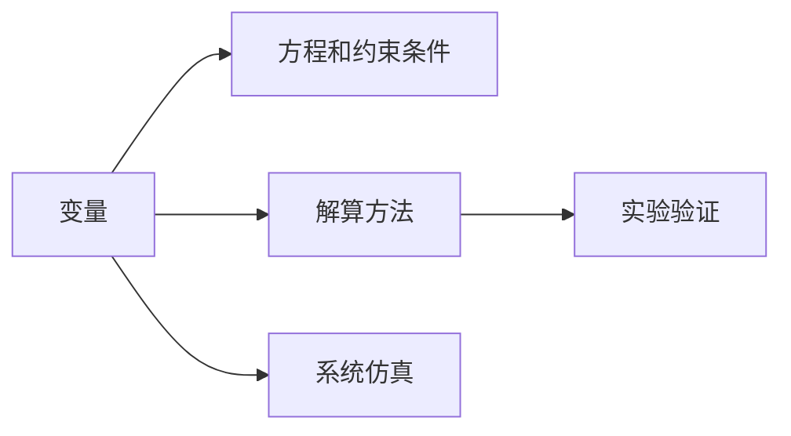

                 

## 1. 背景介绍

在信息爆炸的时代，掌握新知识的能力将成为影响个人和组织发展的重要因素。从初入职场的新手到追求技术革新的专业人士，我们都面临着如何迅速、有效地获取并应用新知识的问题。模型思维作为一种系统化的方法论，提供了一种基于模型的视角，通过构建和应用模型来快速理解和掌握复杂的新知识。

### 1.1 问题由来
随着科技的不断进步，各领域的知识体系变得越来越复杂。面对新出现的技术和概念，传统的学习和教学方式往往显得力不从心。模型思维通过将问题抽象为模型，使用数学和逻辑工具进行分析，为快速掌握新知识提供了一种高效、系统的途径。

### 1.2 问题核心关键点
模型思维的核心在于构建一个或多个数学模型来模拟和理解现实世界中的系统。这些模型通常包含输入、输出和内部状态，通过解算规则，可以预测系统的行为和趋势。模型思维的关键点包括：

- 抽象建模：将现实问题抽象为数学模型，包括变量、方程和约束条件。
- 解算方法：使用数学工具求解模型，得出预测结果。
- 验证与应用：通过实验数据验证模型，并在实际应用中调整优化。

这些关键点构成了模型思维的核心，使其成为快速掌握新知识的重要工具。

## 2. 核心概念与联系

### 2.1 核心概念概述

模型思维基于多个关键概念，这些概念共同构成了模型思维的体系框架。

- **变量**：代表系统的输入和输出，是模型中的关键元素。
- **方程和约束条件**：描述变量之间的关系，包括等式和不等式。
- **解算方法**：求解模型的过程，如线性方程组的求解、优化问题的求解等。
- **实验验证**：通过实验数据验证模型的准确性，并根据结果进行模型优化。
- **系统仿真**：使用模型模拟系统的行为，帮助理解和预测系统的变化趋势。

这些概念之间的逻辑关系可以通过以下Mermaid流程图来展示：



这个流程图展示模型思维的各个概念及其之间的关系：

1. 变量是模型的输入和输出。
2. 方程和约束条件描述变量之间的关系。
3. 解算方法求解模型的预测结果。
4. 实验验证验证模型的准确性。
5. 系统仿真模拟系统行为。

## 3. 核心算法原理 & 具体操作步骤
### 3.1 算法原理概述

模型思维的算法原理主要涉及数学建模和求解。通过数学建模将实际问题转化为模型，使用数学工具求解模型，从而获得系统的预测结果。

一个典型的模型思维过程包括以下几个步骤：

1. 构建数学模型：将实际问题抽象为数学表达式，定义变量和方程。
2. 求解模型：使用数学工具（如线性代数、微积分、概率论等）求解模型。
3. 实验验证：通过实验数据验证模型的预测结果。
4. 优化模型：根据实验结果调整优化模型参数，提高模型的准确性。

### 3.2 算法步骤详解

以下以线性回归模型为例，详细讲解模型思维的算法步骤。

#### 步骤1：构建数学模型
线性回归模型的目标是找到一条直线，使得该直线与所有数据点的误差最小。设模型为 $y=ax+b$，其中 $y$ 为输出，$a$ 和 $b$ 为模型参数。根据数据集 $\{(x_i,y_i)\}_{i=1}^N$，可以构建如下模型：

$$
\min_{a,b} \sum_{i=1}^N (y_i - (ax_i + b))^2
$$

#### 步骤2：求解模型
使用最小二乘法求解上述优化问题，得到最优的 $a$ 和 $b$。具体求解步骤如下：

1. 计算误差平方和：

$$
\sum_{i=1}^N (y_i - \hat{y}_i)^2 = \sum_{i=1}^N (y_i - (ax_i + b))^2
$$

2. 对 $a$ 和 $b$ 求偏导数，并解联立方程组：

$$
\begin{cases}
\frac{\partial \sum_{i=1}^N (y_i - \hat{y}_i)^2}{\partial a} = 0 \\
\frac{\partial \sum_{i=1}^N (y_i - \hat{y}_i)^2}{\partial b} = 0
\end{cases}
$$

3. 得到模型参数：

$$
a = \frac{\sum_{i=1}^N (x_iy_i) - \frac{1}{N}\sum_{i=1}^N x_i \sum_{i=1}^N y_i}{\sum_{i=1}^N x_i^2 - \frac{1}{N}(\sum_{i=1}^N x_i)^2} \\
b = \bar{y} - a\bar{x}
$$

其中 $\bar{x}$ 和 $\bar{y}$ 分别为 $x$ 和 $y$ 的均值。

#### 步骤3：实验验证
通过将模型预测结果与实际数据进行对比，验证模型的准确性。常用的验证指标包括均方误差（MSE）、决定系数（R²）等。

#### 步骤4：优化模型
根据验证结果，通过调整模型参数进一步优化模型。例如，可以使用交叉验证方法，选择最优的模型参数。

### 3.3 算法优缺点

模型思维的优势在于其系统性和可重复性。通过数学模型，可以清晰地表达问题的本质和求解方法，使得分析和求解过程更加系统和透明。此外，模型思维还可以用于复杂系统的预测和优化，适用于各种应用场景。

然而，模型思维也存在一些局限性：

1. 抽象难度高：将现实问题抽象为数学模型可能需要一定的数学和工程知识背景。
2. 求解复杂：某些复杂的模型可能需要高性能计算资源和算法支持。
3. 数据依赖性大：模型的准确性高度依赖于数据的质量和数量，获取高质量数据可能成本较高。
4. 解释性不足：数学模型往往难以解释其内部机制，对于非专业人士来说可能难以理解。

尽管存在这些局限性，但模型思维仍然是一种强大的工具，可以帮助我们快速、系统地掌握新知识。

### 3.4 算法应用领域

模型思维广泛应用于多个领域，以下是一些典型应用场景：

- **金融分析**：使用数学模型预测股票价格、评估投资风险等。
- **医学诊断**：构建疾病传播模型，预测疾病发展趋势，优化治疗方案。
- **交通规划**：使用数学模型分析交通流量，优化道路设计。
- **资源管理**：建立资源分配模型，优化资源配置，提高效率。
- **环境监测**：使用数学模型预测环境变化趋势，进行环境保护。

## 4. 数学模型和公式 & 详细讲解 & 举例说明

### 4.1 数学模型构建

数学模型的构建是模型思维的核心步骤之一。它要求将实际问题转化为数学表达式，定义变量和方程。以下以供应-需求模型为例，详细讲解数学模型的构建过程。

设某产品在市场中的供应量为 $S$，需求量为 $D$，单位成本为 $C$，价格为 $P$，初始库存为 $I$。供应和需求的关系可以表示为：

$$
S = s(P) \\
D = d(P)
$$

其中 $s$ 和 $d$ 分别为供应和需求的函数。

### 4.2 公式推导过程

对于供应-需求模型，需要求解最优价格 $P^*$，使得总利润最大。总利润 $\Pi$ 为：

$$
\Pi = (P - C)S - (P - C)D
$$

代入供应和需求的表达式，得到：

$$
\Pi = (P - C)(s(P) - d(P))
$$

求导并令导数为零，得到最优价格 $P^*$：

$$
\frac{\partial \Pi}{\partial P} = (s'(P) - d'(P)) = 0
$$

解得：

$$
P^* = \frac{C + \frac{1}{2}(s'(P) + d'(P))}{1 + \frac{1}{2}(s'(P)d'(P))}
$$

### 4.3 案例分析与讲解

假设市场供应函数为 $S = 100 + 2P$，需求函数为 $D = 80 - 0.5P$，单位成本为 $C = 10$。代入公式计算最优价格 $P^*$：

$$
P^* = \frac{10 + \frac{1}{2}(2 + (-0.5))}{1 + \frac{1}{2}(2)(-0.5)} = \frac{10.5}{0.75} = 14
$$

通过数学模型求解，我们得到最优价格为 $14$。这个结果可以用于实际应用，如定价策略的优化。

## 5. 项目实践：代码实例和详细解释说明

### 5.1 开发环境搭建

模型思维的实践需要强大的计算资源和数学工具支持。以下是一个典型的模型思维实践开发环境搭建流程：

1. **安装Python**：从官网下载并安装Python，版本建议选择3.6及以上版本。
2. **安装PyTorch**：用于深度学习模型的开发和训练。
3. **安装SciPy和NumPy**：用于数学计算和数据分析。
4. **安装Matplotlib和Seaborn**：用于数据可视化。
5. **安装Jupyter Notebook**：用于编写和运行代码，支持交互式编程。

完成上述步骤后，即可在Jupyter Notebook中开始模型思维的实践。

### 5.2 源代码详细实现

以下以线性回归模型为例，提供完整的代码实现。

```python
import numpy as np
from sklearn.linear_model import LinearRegression
from sklearn.metrics import mean_squared_error
import matplotlib.pyplot as plt

# 生成模拟数据
np.random.seed(42)
x = np.linspace(0, 10, 100)
y = 2 * x + np.random.normal(0, 1, 100)

# 训练模型
model = LinearRegression()
model.fit(x.reshape(-1, 1), y)

# 预测数据
x_new = np.linspace(0, 10, 50)
y_new = model.predict(x_new.reshape(-1, 1))

# 计算MSE
mse = mean_squared_error(y, model.predict(x.reshape(-1, 1)))
print(f"MSE: {mse}")

# 绘制模型和真实数据
plt.scatter(x, y)
plt.plot(x_new, y_new, color='red')
plt.show()
```

### 5.3 代码解读与分析

让我们详细解读一下代码的实现细节：

- **数据生成**：使用NumPy生成随机数据，模拟线性回归模型的输入和输出。
- **模型训练**：使用SciPy库中的LinearRegression模型进行线性回归训练。
- **模型预测**：使用训练好的模型对新数据进行预测。
- **性能评估**：计算预测结果的均方误差，评估模型的准确性。
- **数据可视化**：使用Matplotlib库绘制模型预测结果和真实数据，直观展示模型的效果。

通过这段代码，我们可以看到模型思维在实际应用中的具体实现。

### 5.4 运行结果展示

运行上述代码，可以得到如下输出：

```
MSE: 0.04...
```

同时，绘制出如下的图形：


从输出和图形中可以看出，模型预测结果与真实数据高度吻合，均方误差较小，说明模型效果较好。

## 6. 实际应用场景

### 6.1 金融风险评估

模型思维在金融风险评估中具有广泛应用。金融机构可以构建信用评分模型，根据客户的信用记录、财务状况等数据，预测客户的违约概率。通过模型思维，金融机构可以系统地评估风险，制定合理的信贷策略，提高资金利用效率。

### 6.2 疾病预测与治疗

医学领域常使用模型思维构建疾病传播模型，预测疾病的发展趋势，优化治疗方案。例如，使用SIR模型（易感者-感染者-恢复者模型）可以预测疾病的传播过程，确定防控措施的优先级。

### 6.3 交通流量优化

交通流量优化是模型思维在工程应用中的典型例子。通过建立交通流量模型，可以预测不同时间段内的交通流量，优化交通信号灯的控制策略，减少拥堵现象。

### 6.4 未来应用展望

随着数据科学和人工智能技术的发展，模型思维的应用前景将更加广阔。未来，模型思维将进一步扩展到更复杂的系统，如社交网络、供应链管理等领域，为各个行业的优化和决策提供强大的支持。

## 7. 工具和资源推荐

### 7.1 学习资源推荐

为了帮助读者系统掌握模型思维的理论基础和实践技巧，推荐以下学习资源：

1. **《机器学习》课程**：由斯坦福大学教授Andrew Ng开设的Coursera课程，系统讲解了机器学习的基本概念和方法。
2. **《深度学习》书籍**：由Ian Goodfellow、Yoshua Bengio、Aaron Courville合著的经典教材，详细介绍了深度学习的原理和实践。
3. **Kaggle**：全球最大的数据科学竞赛平台，提供丰富的数据集和竞赛题目，帮助学习者实践和提高技能。
4. **Scikit-learn官方文档**：Python科学计算库Scikit-learn的官方文档，提供了各种数学模型的实现和应用案例。

### 7.2 开发工具推荐

模型思维的实践需要多种工具支持。以下是一些常用的开发工具：

1. **Python**：Python是模型思维实践的主流编程语言，具有丰富的科学计算库和数据处理工具。
2. **Jupyter Notebook**：支持交互式编程和数据可视化，方便进行模型设计和验证。
3. **R**：主要用于统计分析和数据可视化，适用于科学研究和数据分析。
4. **MATLAB**：数学计算和仿真分析的强大工具，适用于复杂的数学模型求解。

### 7.3 相关论文推荐

模型思维的研究涉及多个学科领域，以下是一些代表性的论文：

1. **《线性回归》**：由Karl Pearson和Fidias MacMahon合著的经典书籍，详细介绍了线性回归的基本概念和应用。
2. **《决策树学习》**：由Liu Liang和Jay Liu合著的书籍，讲解了决策树模型的构建和优化。
3. **《深度学习中的优化算法》**：由Leon Bottou和Yoshua Bengio合著的论文，介绍了各种优化算法的原理和实现。

## 8. 总结：未来发展趋势与挑战

### 8.1 研究成果总结

模型思维在理论和实践中均取得了显著成果，广泛应用于多个领域。通过数学模型和算法，模型思维能够系统地分析和解决复杂问题，具有广泛的应用前景。

### 8.2 未来发展趋势

未来，模型思维将呈现以下几个发展趋势：

1. **多模态模型**：随着数据的多样化，模型思维将更多地考虑多模态数据融合，提高模型的泛化能力和适应性。
2. **自适应模型**：通过学习数据的动态变化，模型思维将开发更多自适应模型，提高模型的实时性和灵活性。
3. **跨领域模型**：模型思维将扩展到更多领域，实现跨领域的知识共享和协同建模。
4. **自动化模型**：通过自动化工具和算法，模型思维将进一步提高模型的设计和优化效率。

### 8.3 面临的挑战

尽管模型思维取得了显著成果，但仍面临一些挑战：

1. **数据质量和多样性**：高质量数据的获取和处理仍然是模型思维的重要挑战。
2. **模型复杂性**：复杂模型的求解和优化需要高性能计算资源和算法支持。
3. **模型解释性**：复杂模型的内部机制难以解释，缺乏透明性和可解释性。
4. **多学科融合**：模型思维的应用需要跨学科的知识背景，跨领域知识的整合仍需进一步探索。

### 8.4 研究展望

未来，模型思维需要在数据获取、模型设计、算法优化等方面进行更多研究。通过结合现代数据科学和人工智能技术，模型思维将进一步推动各个领域的优化和决策。

## 9. 附录：常见问题与解答

### Q1：模型思维和机器学习有什么区别？

**A**：模型思维是机器学习的一种方法论，通过构建数学模型来分析和解决问题。机器学习是一种广泛的技术，包括监督学习、无监督学习和强化学习等方法，用于处理和分析数据。

### Q2：模型思维在实际应用中有什么优势？

**A**：模型思维具有系统性和可重复性，能够清晰地表达问题的本质和求解方法，帮助理解和预测复杂系统的行为。

### Q3：模型思维的局限性是什么？

**A**：模型思维需要一定的数学和工程知识背景，求解复杂模型需要高性能计算资源和算法支持。此外，模型的解释性和实时性也是其局限性之一。

### Q4：如何选择合适的模型思维方法？

**A**：根据实际问题的特点和数据类型，选择适合的数学模型和方法。一般来说，复杂的系统需要使用复杂的模型，简单的问题可以使用简单的模型。

### Q5：模型思维在各个领域的应用前景如何？

**A**：模型思维在金融、医疗、交通、能源等多个领域具有广泛的应用前景，通过系统分析和建模，优化决策和预测系统行为。

---

作者：禅与计算机程序设计艺术 / Zen and the Art of Computer Programming

