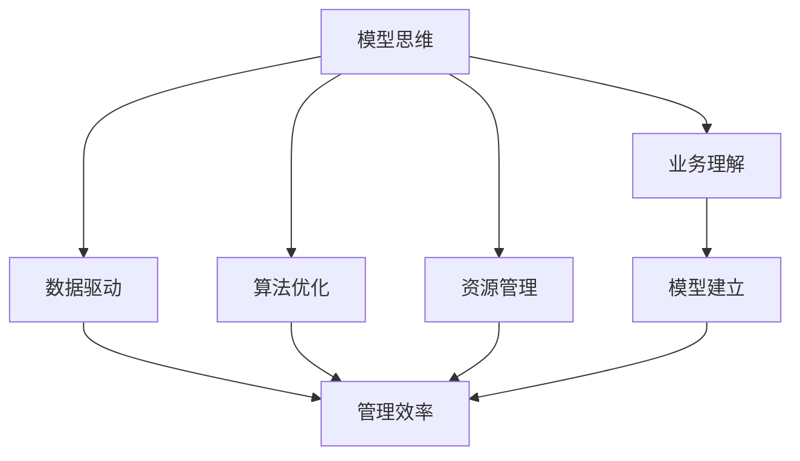

                 

# 模型思维与管理效率的优化

> 关键词：模型思维,管理效率,算法优化,资源管理,数据驱动

## 1. 背景介绍

在当今数据驱动的时代，模型思维成为企业在决策过程中不可或缺的一部分。无论是互联网公司还是传统企业，都在积极采用数据模型来提升管理效率，驱动业务增长。模型思维的核心在于，通过数据和算法来理解业务，优化决策，最终实现企业运营的智能化和高效化。

然而，构建和管理一个有效的模型体系并非易事。模型思维的应用不仅要求数据科学家的技术能力，更需要管理层对数据、算法、业务流程等关键因素的理解和支持。本文章旨在通过系统地介绍模型思维与企业管理的融合，探讨如何通过模型思维优化管理效率，为企业提供实践指南。

## 2. 核心概念与联系

### 2.1 核心概念概述

- **模型思维**：基于数据和算法，通过建立和优化模型来指导决策的思维方式。模型思维强调使用数据驱动的方法来提升决策的准确性和效率。
- **管理效率**：指企业通过优化业务流程、提升决策质量等方式，最大化资源利用率，减少浪费，提高整体运营效率。
- **算法优化**：指通过改进算法，提高模型预测准确性、速度或资源利用效率的过程。
- **资源管理**：指在模型构建和应用过程中，对计算资源、数据资源、人力资源等进行有效配置和利用，以实现最优的模型效果和运营效率。
- **数据驱动**：利用数据来驱动决策和管理，以数据为依据，提升决策的科学性和精确度。

这些概念之间相互联系，共同构成了一个企业模型思维与管理效率优化的框架。模型思维提供了一种基于数据和算法来理解和优化业务的方法，而管理效率则关注如何将这些模型应用到实际业务中，以提高资源利用率和运营效率。

### 2.2 核心概念原理和架构的 Mermaid 流程图



这个流程图展示了模型思维、数据驱动、管理效率、算法优化和资源管理之间的联系。模型思维和数据驱动是模型构建的基础，而管理效率则是模型应用的目标。算法优化和资源管理则是对模型构建和应用过程中各个环节的进一步优化。

## 3. 核心算法原理 & 具体操作步骤

### 3.1 算法原理概述

模型思维与管理效率优化的核心在于，通过构建和应用数据模型，对业务流程和决策进行优化。具体的算法原理包括以下几个方面：

- **数据预处理**：通过清洗、转换和规整数据，使数据适合用于模型构建和应用。
- **特征工程**：从原始数据中提取和构造有意义的特征，提升模型的预测能力。
- **模型选择与训练**：根据业务需求选择合适的模型，并使用标注数据对其进行训练。
- **模型评估与迭代**：通过交叉验证、性能指标等方法评估模型效果，并根据反馈不断优化模型。

### 3.2 算法步骤详解

1. **数据收集与清洗**：
   - 确定业务目标和关键指标。
   - 收集相关数据，包括历史业务数据、市场数据、用户行为数据等。
   - 清洗和预处理数据，去除噪声和异常值，确保数据质量和一致性。

2. **特征工程**：
   - 探索数据，识别和选择关键特征。
   - 构造新特征，如时间序列数据中的移动平均、趋势线等。
   - 进行特征缩放和归一化，提高模型训练效率。

3. **模型选择与训练**：
   - 根据业务需求选择合适的模型，如线性回归、决策树、神经网络等。
   - 使用标注数据对模型进行训练，调整模型参数，优化模型性能。
   - 使用交叉验证等方法评估模型效果，选择最优模型。

4. **模型评估与迭代**：
   - 使用测试集评估模型效果，计算性能指标如准确率、召回率、F1值等。
   - 根据评估结果调整模型参数或选择新的模型，进行迭代优化。
   - 定期更新模型，适应数据分布的变化和新业务需求。

### 3.3 算法优缺点

**优点**：
- 数据驱动的决策过程更加科学和准确。
- 模型可以处理大规模数据，提高运营效率。
- 通过优化算法，提升模型的预测能力和资源利用效率。
- 模型可以根据业务需求灵活调整，适应不同的业务场景。

**缺点**：
- 数据质量和特征选择对模型效果影响较大。
- 模型构建和应用过程中需要大量的计算资源和时间。
- 模型复杂度高，可能需要复杂的算法和较高的技术门槛。
- 模型的解释性和可解释性可能不足，影响管理层对决策的理解和信任。

### 3.4 算法应用领域

模型思维与管理效率优化在多个领域都有广泛的应用，以下是几个典型的应用场景：

- **金融风控**：通过构建信用评分模型、风险评估模型，优化贷款审批流程，提升风险管理效率。
- **零售推荐**：利用用户行为数据，构建推荐模型，提升商品推荐精度和用户满意度。
- **供应链管理**：通过预测模型和优化算法，提升供应链的效率和灵活性，降低成本。
- **客户服务**：通过构建客户行为模型，优化服务流程，提升客户满意度和忠诚度。
- **人力资源管理**：通过员工绩效评估模型和招聘推荐模型，优化人才选拔和培训流程，提高企业人才管理效率。

这些应用场景展示了模型思维在企业管理中的广泛适用性和巨大潜力。

## 4. 数学模型和公式 & 详细讲解 & 举例说明

### 4.1 数学模型构建

模型思维的核心在于数据和算法的结合。在模型构建过程中，需要选择合适的数学模型来描述业务问题。常见的数学模型包括线性回归、逻辑回归、决策树、随机森林、神经网络等。

### 4.2 公式推导过程

以线性回归模型为例，公式推导过程如下：

设样本 $(x_i, y_i)$ 为训练集，其中 $x_i$ 为自变量，$y_i$ 为因变量，$n$ 为样本数。线性回归模型的目标是最小化预测误差，即：

$$
\min_{\beta} \sum_{i=1}^{n} (y_i - \beta_0 - \beta_1 x_i)^2
$$

其中 $\beta_0$ 和 $\beta_1$ 为模型的参数，分别表示截距和斜率。

通过求解上述最小化问题，可以得出最优的参数估计值：

$$
\beta_0 = \frac{\sum_{i=1}^{n} (x_i \cdot y_i) - \frac{\sum_{i=1}^{n} x_i \cdot \sum_{i=1}^{n} y_i}{\sum_{i=1}^{n} x_i^2} \\
\beta_1 = \frac{\sum_{i=1}^{n} y_i^2 - \frac{(\sum_{i=1}^{n} x_i \cdot \sum_{i=1}^{n} y_i)}{\sum_{i=1}^{n} x_i^2} \\
$$

### 4.3 案例分析与讲解

以零售推荐系统为例，假设零售商希望通过用户历史购买数据，预测用户对某商品的购买意向。可以构建如下线性回归模型：

$$
y = \beta_0 + \beta_1 x_1 + \beta_2 x_2 + ... + \beta_k x_k + \epsilon
$$

其中 $x_1, x_2, ..., x_k$ 为用户历史购买数据的特征，$\beta_0, \beta_1, ..., \beta_k$ 为模型参数，$\epsilon$ 为误差项。

通过收集用户历史购买数据，并进行特征工程和模型训练，即可得到预测用户购买意向的线性回归模型。

## 5. 项目实践：代码实例和详细解释说明

### 5.1 开发环境搭建

开发环境搭建是模型构建和应用的基础。以下是使用Python进行模型构建的开发环境配置流程：

1. 安装Anaconda：从官网下载并安装Anaconda，用于创建独立的Python环境。
2. 创建并激活虚拟环境：
```bash
conda create -n myenv python=3.8 
conda activate myenv
```
3. 安装必要的库：
```bash
pip install numpy pandas scikit-learn
```

完成上述步骤后，即可在虚拟环境中开始模型构建实践。

### 5.2 源代码详细实现

以下是一个简单的线性回归模型构建和训练的代码实现：

```python
import numpy as np
from sklearn.linear_model import LinearRegression

# 构建训练集和测试集
X_train = np.array([[1], [2], [3], [4], [5]])
y_train = np.array([2, 4, 6, 8, 10])
X_test = np.array([[6], [7], [8]])

# 训练模型
model = LinearRegression()
model.fit(X_train, y_train)

# 预测
y_pred = model.predict(X_test)

# 输出结果
print(y_pred)
```

### 5.3 代码解读与分析

**线性回归模型**：
- 使用Scikit-Learn库中的`LinearRegression`类，构建线性回归模型。
- `fit`方法用于训练模型，根据训练集数据计算最优的参数。
- `predict`方法用于预测新数据的输出。

**预测结果**：
- 通过模型预测的新数据，可以看到模型对新数据的预测结果。

## 6. 实际应用场景

### 6.1 金融风控

在金融风控中，模型思维的应用可以显著提升风险管理效率。例如，通过构建信用评分模型，银行可以更快速、准确地评估客户的信用风险，从而优化贷款审批流程，降低坏账率。

具体实现如下：
1. 收集客户的财务数据、历史还款记录等。
2. 进行数据清洗和特征工程，构造反映客户信用状况的特征。
3. 选择适当的模型，如逻辑回归或随机森林，进行训练和预测。
4. 根据预测结果，调整审批策略，优化贷款审批流程。

### 6.2 零售推荐

零售商通过模型思维，可以实现个性化推荐，提升用户满意度和销售额。例如，亚马逊使用协同过滤和内容推荐算法，根据用户的历史购买记录和商品评价，推荐用户可能感兴趣的商品。

具体实现如下：
1. 收集用户的购买记录、浏览历史、评价等数据。
2. 进行数据清洗和特征工程，构造反映用户偏好的特征。
3. 选择适当的模型，如协同过滤或神经网络，进行训练和预测。
4. 根据预测结果，推荐用户可能感兴趣的商品，提升用户满意度。

### 6.3 供应链管理

在供应链管理中，模型思维可以优化库存管理和物流规划，降低成本，提高效率。例如，通过预测需求和供应链瓶颈，优化库存水平和物流路线。

具体实现如下：
1. 收集历史订单数据、销售数据、物流数据等。
2. 进行数据清洗和特征工程，构造反映需求和供应链状况的特征。
3. 选择适当的模型，如时间序列分析模型，进行训练和预测。
4. 根据预测结果，调整库存水平和物流路线，优化供应链管理。

### 6.4 未来应用展望

未来，模型思维与管理效率优化将面临更多的挑战和机遇：

1. 数据量的增加和数据类型的多样化将对模型构建和应用提出更高的要求。
2. 模型的解释性和可解释性将成为管理层关注的重点，需要开发更多具有解释能力的模型。
3. 模型构建和应用过程中需要更多的跨部门合作，提升模型的业务适配性。
4. 模型评估和迭代过程将更加自动化和数据驱动，提高模型的效果和灵活性。
5. 实时数据分析和模型预测将成为常态，提升业务的实时响应能力。

## 7. 工具和资源推荐

### 7.1 学习资源推荐

为了帮助开发者系统掌握模型思维与管理效率优化的理论和实践，以下是一些推荐的资源：

1. 《Python数据科学手册》：详细介绍了Python在数据科学中的应用，包括数据预处理、特征工程、模型构建等。
2. 《机器学习实战》：通过实际案例，讲解机器学习模型构建和优化的过程。
3. 《深度学习》课程：斯坦福大学开设的深度学习课程，涵盖深度学习模型构建和应用。
4. Kaggle：数据科学竞赛平台，提供丰富的数据集和模型构建实战经验。
5. Scikit-Learn官方文档：详细介绍Scikit-Learn库的使用，包括数据处理、模型构建、评估等。

### 7.2 开发工具推荐

高效的工具是模型思维与管理效率优化的重要保障。以下是一些推荐的开发工具：

1. Jupyter Notebook：交互式数据科学开发环境，支持Python、R等语言。
2. TensorFlow：由Google开发的深度学习框架，支持多种模型构建和训练。
3. PyTorch：由Facebook开发的深度学习框架，支持动态图和静态图。
4. Tableau：数据可视化工具，支持数据探索和可视化分析。
5. Power BI：商业智能工具，支持数据整合和报表生成。

### 7.3 相关论文推荐

模型思维与管理效率优化的研究涉及多个学科领域，以下是一些推荐的论文：

1. "Introduction to Statistical Learning" by Gareth James et al.：介绍了统计学习的基本概念和模型构建方法。
2. "The Elements of Statistical Learning" by Trevor Hastie et al.：深入讲解了统计学习模型的理论基础和应用方法。
3. "Deep Learning" by Ian Goodfellow et al.：讲解了深度学习模型的构建和优化方法。
4. "Machine Learning Yearning" by Andrew Ng：介绍了机器学习模型的构建和优化实践。
5. "Data Science for Business" by Foster Provost and Tom Fawcett：讲解了数据科学在业务决策中的应用。

## 8. 总结：未来发展趋势与挑战

### 8.1 研究成果总结

模型思维与管理效率优化在数据驱动的业务决策和管理中发挥了重要作用。通过构建和应用数据模型，企业可以实现对业务的深入理解和优化，提高运营效率，降低成本，提升竞争力。

### 8.2 未来发展趋势

未来，模型思维与管理效率优化将呈现以下几个发展趋势：

1. 数据量将进一步增加，数据类型将更加多样化，需要更多的数据驱动决策支持。
2. 模型的解释性和可解释性将成为管理层关注的重点，开发具有解释能力的模型将成为趋势。
3. 模型的自动化构建和优化将更加普及，提高模型的应用效率和灵活性。
4. 实时数据分析和模型预测将成为常态，提升业务的实时响应能力。
5. 模型的跨部门合作和业务适配性将更加重要，提升模型的实际应用效果。

### 8.3 面临的挑战

尽管模型思维与管理效率优化在企业决策和管理中取得了显著成效，但仍面临以下挑战：

1. 数据质量和数据隐私问题仍需进一步解决。
2. 模型的解释性和可解释性不足，难以满足管理层的理解和信任需求。
3. 模型的自动化构建和优化过程中，仍需大量的人工干预和调试。
4. 模型的跨部门合作和业务适配性仍需提升，实现业务流程的协同优化。

### 8.4 研究展望

面对未来发展的趋势和挑战，未来的研究需要在以下几个方面寻求新的突破：

1. 开发更多具有解释性和可解释能力的模型，提升模型的透明度和可信度。
2. 开发更多的自动化构建和优化工具，提高模型的构建效率和优化效果。
3. 结合其他人工智能技术，如自然语言处理、计算机视觉等，实现多模态数据融合和协同优化。
4. 通过跨部门合作，提升模型的业务适配性和实际应用效果，实现业务流程的协同优化。
5. 结合业务需求和模型构建，探索更多数据驱动的决策方法和业务优化策略。

## 9. 附录：常见问题与解答

**Q1: 模型思维在企业管理中具体应用场景有哪些？**

A: 模型思维在企业管理中应用广泛，具体场景包括金融风控、零售推荐、供应链管理、客户服务、人力资源管理等。通过数据驱动的模型，企业可以优化决策过程，提升管理效率，实现业务目标。

**Q2: 模型构建过程中，数据预处理和特征工程的重要性体现在哪里？**

A: 数据预处理和特征工程是模型构建的基础，直接影响模型的准确性和效率。数据预处理可以清洗和规整数据，确保数据质量和一致性；特征工程可以从原始数据中提取和构造有意义的特征，提升模型的预测能力。这两步对模型构建至关重要，决定了后续模型的效果和应用效果。

**Q3: 模型构建和应用过程中，如何确保模型的解释性和可解释性？**

A: 模型的解释性和可解释性可以通过以下方法提升：
1. 选择具有解释性的模型，如线性回归、逻辑回归等。
2. 使用可解释的特征工程方法，如重要性排序、特征贡献度等。
3. 开发可解释的模型评估方法，如LIME、SHAP等。

**Q4: 模型思维在企业管理中的优势和劣势有哪些？**

A: 模型思维的优势包括：
1. 数据驱动的决策过程更加科学和准确。
2. 模型可以处理大规模数据，提高运营效率。
3. 通过优化算法，提升模型的预测能力和资源利用效率。

劣势包括：
1. 数据质量和特征选择对模型效果影响较大。
2. 模型构建和应用过程中需要大量的计算资源和时间。
3. 模型复杂度高，可能需要复杂的算法和较高的技术门槛。

**Q5: 如何提升模型思维与管理效率优化的效果？**

A: 提升模型思维与管理效率优化的效果，可以从以下几个方面入手：
1. 选择合适的模型和算法，根据业务需求进行优化。
2. 进行数据清洗和特征工程，确保数据质量和特征有效性。
3. 结合业务需求和模型构建，探索更多数据驱动的决策方法和业务优化策略。
4. 开发自动化构建和优化工具，提高模型的构建效率和优化效果。
5. 加强跨部门合作，提升模型的业务适配性和实际应用效果。

---

作者：禅与计算机程序设计艺术 / Zen and the Art of Computer Programming

