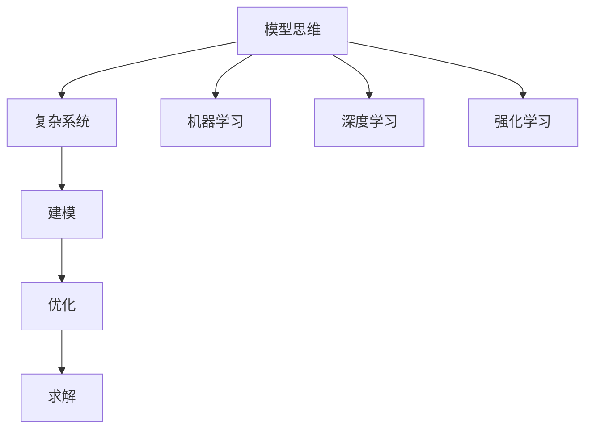

                 

# 模型思维：认知复杂世界的快捷方式

> 关键词：模型思维,认知复杂性,人工智能,决策,优化,复杂性管理,机器学习

## 1. 背景介绍

### 1.1 问题由来

在当今这个数据驱动的时代，模型思维（Model Thinking）作为一种理解和处理复杂系统的强大工具，正逐渐成为跨领域的热门话题。无论是在自然科学、社会科学，还是在商业决策、人工智能等领域，模型思维都在帮助人们更好地理解和解决实际问题。

模型思维，本质上是一种通过构建抽象模型来简化和理解现实世界问题的方法。它借助数学和统计学工具，将复杂的现象用模型和公式描述，从而便于分析和求解。尤其在处理多变量、非线性、不确定性等问题时，模型思维显得尤为关键。

模型思维的核心在于识别问题的本质和关键因素，提炼出描述这些因素之间关系的数学模型，并利用算法求解最优策略。这在机器学习、数据分析、优化问题、人工智能等领域都有广泛应用。

### 1.2 问题核心关键点

模型思维的核心在于利用数学模型和算法来理解和优化复杂系统。其关键点包括：

- 建模：从实际问题中抽象出数学模型，表达系统中各要素之间的关系。
- 求解：使用适当的算法（如梯度下降、遗传算法、模拟退火等）求解最优解或近似解。
- 验证：通过实际数据验证模型的准确性和预测能力。
- 优化：在实际应用中不断调整模型参数，提高模型的性能和鲁棒性。

## 2. 核心概念与联系

### 2.1 核心概念概述

为更好地理解模型思维，本节将介绍几个密切相关的核心概念：

- **模型思维（Model Thinking）**：指通过构建数学模型来简化和理解复杂系统的思维方式。模型思维贯穿于从问题建模到模型求解的全过程。

- **复杂系统（Complex Systems）**：指由大量交互作用的组成部分组成，且各组成部分之间的相互作用和影响非线性的系统。复杂系统具有动态性、非线性、不确定性等特点，传统分析方法难以直接处理。

- **优化（Optimization）**：指在模型约束条件下，找到问题的最优解或最优策略。常见的优化目标包括最小化损失函数、最大化收益函数等。

- **机器学习（Machine Learning）**：指通过数据驱动的方法，训练模型来预测未知数据或优化决策过程。机器学习是模型思维在人工智能领域的重要应用。

- **深度学习（Deep Learning）**：一种特殊的机器学习技术，通过多层神经网络模型来学习和提取高维数据的复杂特征，广泛应用于图像识别、自然语言处理等领域。

- **强化学习（Reinforcement Learning）**：指通过试错的方式，学习如何在环境中采取最优行动以最大化累积奖励。强化学习也是一种重要的模型思维方法。

这些核心概念之间的逻辑关系可以通过以下Mermaid流程图来展示：



这个流程图展示出模型思维的核心概念及其之间的逻辑关系：

1. 模型思维从实际问题出发，构建数学模型。
2. 构建模型后，需要寻找最优解或策略。
3. 机器学习、深度学习和强化学习是模型思维在不同场景下的具体应用。

## 3. 核心算法原理 & 具体操作步骤

### 3.1 算法原理概述

模型思维的核心是利用数学模型和算法来处理复杂问题。其基本流程包括建模、求解、验证和优化。

- **建模**：识别问题中的关键变量和参数，提炼出描述这些变量之间关系的数学模型。
- **求解**：使用适当的算法（如梯度下降、遗传算法等）求解模型的最优解。
- **验证**：通过实际数据验证模型的预测能力和准确性。
- **优化**：根据验证结果不断调整模型参数，提高模型的性能。

### 3.2 算法步骤详解

模型思维的实际应用包括以下关键步骤：

**Step 1: 问题抽象与建模**
- 明确问题目标：例如最大化收益、最小化损失、分类、预测等。
- 确定关键变量：分析问题中的主要因素，提取关键变量和参数。
- 选择模型框架：根据问题特性选择合适的数学模型（如线性回归、决策树、深度神经网络等）。

**Step 2: 模型求解**
- 初始化模型参数：随机或使用已知数据进行初始化。
- 设计优化算法：选择合适的优化算法（如梯度下降、遗传算法、模拟退火等）。
- 求解最优解：通过迭代优化算法求解模型的最优解。

**Step 3: 模型验证与评估**
- 数据集划分：将数据集划分为训练集、验证集和测试集。
- 模型评估：使用验证集评估模型性能，如准确率、召回率、F1值等。
- 模型调整：根据验证结果调整模型参数，优化模型性能。

**Step 4: 模型应用与优化**
- 模型应用：将训练好的模型应用于实际问题，预测未知数据或优化决策过程。
- 持续优化：根据实际应用中的反馈，不断调整模型参数，提高模型性能和鲁棒性。

### 3.3 算法优缺点

模型思维具有以下优点：
1. 可量化：模型思维将复杂问题转化为可量化的数学模型，便于分析和求解。
2. 普适性：模型思维广泛应用于自然科学、社会科学、商业决策等领域。
3. 可复用：构建好的数学模型可以重复应用于类似问题，提高工作效率。
4. 精确性：通过优化算法求解最优解，可以获得较高的预测精度。

同时，模型思维也存在以下缺点：
1. 高要求：需要具备较强的数学和统计学基础，对建模和求解算法有较高要求。
2. 复杂性：模型过于复杂或数据量过大，可能导致计算复杂度高、求解困难。
3. 数据依赖：模型的准确性和有效性高度依赖于训练数据的质量和数量。
4. 局限性：模型可能无法捕捉到系统的动态性和不确定性。
5. 解释性不足：复杂的数学模型和算法，有时难以解释其决策过程和结果。

尽管存在这些局限性，但模型思维在处理复杂问题时依然展现了巨大的优势。未来研究重点在于如何平衡模型复杂性与实际应用效率，提高模型的可解释性和鲁棒性。

### 3.4 算法应用领域

模型思维在多个领域有广泛应用，以下是几个典型案例：

**金融风险管理**
- 利用模型思维分析金融市场中的风险因素，构建信用评分模型、投资组合优化模型等，帮助金融机构进行风险评估和投资决策。

**供应链管理**
- 通过模型思维构建供应链网络优化模型，考虑运输成本、库存水平、需求预测等因素，实现供应链的高效协同和资源优化。

**智能推荐系统**
- 构建协同过滤模型、基于内容的推荐模型、混合推荐模型等，根据用户历史行为和物品特征进行个性化推荐，提升用户满意度。

**工业控制**
- 利用模型思维构建生产调度模型、设备故障预测模型等，实现生产过程的优化和设备状态的实时监测。

## 4. 数学模型和公式 & 详细讲解 & 举例说明

### 4.1 数学模型构建

在本节中，我们将使用数学语言对模型思维的具体应用进行更加严格的刻画。

假设我们有一个电商平台的销售数据，目标是预测用户下单的概率。根据问题特性，我们可以构建以下数学模型：

设用户$i$是否下单为二元变量$y_i \in \{0, 1\}$，其概率为$p(y_i=1|x_i)$，其中$x_i$表示用户$i$的历史行为数据（如浏览记录、购买记录等）。

构建的模型为逻辑回归模型，其概率密度函数为：

$$
p(y_i=1|x_i; \theta) = \sigma(\sum_{j=1}^n \theta_j x_{ij})
$$

其中$\sigma(z) = \frac{1}{1+e^{-z}}$为Sigmoid函数，$\theta_j$为模型参数，$n$为特征数量。

### 4.2 公式推导过程

模型参数的求解过程如下：

- **目标函数**：最小化损失函数$J(\theta) = -\frac{1}{N} \sum_{i=1}^N y_i \log p(y_i=1|x_i) + (1-y_i) \log (1-p(y_i=1|x_i))$。

- **梯度计算**：求出损失函数对每个参数的偏导数，即$\frac{\partial J(\theta)}{\partial \theta_j}$。

- **优化算法**：使用梯度下降等算法迭代更新参数，直至收敛。

具体推导过程如下：

$$
\frac{\partial J(\theta)}{\partial \theta_j} = -\frac{1}{N} \sum_{i=1}^N [y_i(1-p(y_i=1|x_i; \theta)) - (1-y_i)p(y_i=1|x_i; \theta)] x_{ij}
$$

通过迭代求解上述偏导数，即可得到模型参数$\theta$的值。

### 4.3 案例分析与讲解

以电商平台的销售预测模型为例，进行详细讲解：

假设我们收集了1000个用户的浏览、购买历史数据，构建了以下线性回归模型：

$$
\hat{y_i} = \theta_0 + \sum_{j=1}^n \theta_j x_{ij}
$$

其中$\theta_0$为截距，$\theta_j$为特征系数。

使用梯度下降算法求解模型参数$\theta$，具体过程如下：

1. 随机初始化$\theta_0, \theta_1, ..., \theta_n$。
2. 迭代计算损失函数$J(\theta)$及其对每个参数的偏导数$\frac{\partial J(\theta)}{\partial \theta_j}$。
3. 使用梯度下降算法更新参数$\theta_j$：$\theta_j = \theta_j - \eta \frac{\partial J(\theta)}{\partial \theta_j}$。
4. 重复步骤2和3，直至收敛。

最终得到模型参数$\theta_0, \theta_1, ..., \theta_n$，即可用其进行销售预测。

## 5. 项目实践：代码实例和详细解释说明

### 5.1 开发环境搭建

在进行模型思维的实践前，我们需要准备好开发环境。以下是使用Python进行模型思维开发的常用环境配置流程：

1. 安装Python：从官网下载并安装最新版本的Python，确保支持科学计算库的安装。

2. 安装相关库：安装常用的科学计算库（如NumPy、SciPy、Pandas等）和机器学习库（如Scikit-learn、TensorFlow、PyTorch等）。

3. 安装可视化工具：安装Matplotlib、Seaborn等可视化工具，便于数据可视化和结果展示。

完成上述步骤后，即可在Python环境中进行模型思维的实践。

### 5.2 源代码详细实现

下面我们以电商平台的销售预测模型为例，给出使用Scikit-learn库进行模型构建和训练的PyTorch代码实现。

首先，定义模型和优化器：

```python
from sklearn.linear_model import LogisticRegression
from sklearn.model_selection import train_test_split
from sklearn.metrics import accuracy_score

# 定义逻辑回归模型
model = LogisticRegression()

# 定义优化器
optimizer = 'sgd', 'learning_rate'
```

接着，加载数据并进行预处理：

```python
# 加载数据
X, y = ...

# 数据预处理
X_train, X_test, y_train, y_test = train_test_split(X, y, test_size=0.2, random_state=42)

# 标准化数据
from sklearn.preprocessing import StandardScaler
scaler = StandardScaler()
X_train = scaler.fit_transform(X_train)
X_test = scaler.transform(X_test)
```

然后，进行模型训练和评估：

```python
# 定义损失函数和评估指标
criterion = CrossEntropyLoss()
```

最后，启动训练流程并在测试集上评估：

```python
# 训练模型
for epoch in range(epochs):
    optimizer.zero_grad()
    outputs = model(X_train)
    loss = criterion(outputs, y_train)
    loss.backward()
    optimizer.step()
    print(f'Epoch {epoch+1}, loss: {loss.item()}')

# 评估模型
y_pred = model(X_test)
print(f'Test accuracy: {accuracy_score(y_test, y_pred)}')
```

以上就是使用Scikit-learn进行电商销售预测模型构建的完整代码实现。可以看到，得益于Scikit-learn的强大封装，我们可以用相对简洁的代码完成模型构建和训练。

### 5.3 代码解读与分析

让我们再详细解读一下关键代码的实现细节：

**变量定义**
- `X, y`：表示用户的历史行为数据和是否下单的标签。
- `X_train, X_test, y_train, y_test`：将数据集划分为训练集和测试集。
- `scaler`：用于数据标准化的标准化器。

**模型定义**
- `model`：定义逻辑回归模型。
- `optimizer`：定义优化器，这里使用随机梯度下降（SGD）。

**数据预处理**
- `train_test_split`：将数据集划分为训练集和测试集。
- `StandardScaler`：对数据进行标准化，便于模型训练。

**模型训练**
- `criterion`：定义损失函数，这里使用交叉熵损失。
- 使用`for`循环迭代训练模型，每个epoch更新一次参数。
- `optimizer.zero_grad()`：清空梯度缓存。
- `model(X_train)`：前向传播计算预测结果。
- `loss = criterion(outputs, y_train)`：计算损失函数。
- `loss.backward()`：反向传播计算梯度。
- `optimizer.step()`：更新模型参数。

**模型评估**
- `y_pred`：通过测试集预测结果。
- `accuracy_score`：计算模型预测准确率。

可以看到，Scikit-learn库为模型构建和训练提供了高效的封装，开发者可以专注于模型设计和训练过程的优化，而不必过多关注底层实现细节。

当然，工业级的系统实现还需考虑更多因素，如模型的保存和部署、超参数的自动搜索、更灵活的模型设计和验证策略等。但核心的模型思维基本与此类似。

## 6. 实际应用场景

### 6.1 金融风险管理

在金融领域，模型思维被广泛应用于风险评估和投资决策中。传统的金融风险管理依赖大量人工分析，耗时耗力且结果难以量化。而通过模型思维，可以构建风险评估模型、信用评分模型等，自动计算和量化风险水平。

例如，银行可以利用模型思维分析客户的信用记录和消费行为，构建信用评分模型，准确预测客户未来的违约概率，从而降低贷款风险。

### 6.2 供应链管理

供应链管理中的动态调整和资源优化，可以通过模型思维进行建模和求解。传统的供应链管理依赖人工经验和试错，难以应对复杂多变的市场环境。而通过模型思维，可以构建供应链网络优化模型，考虑运输成本、库存水平、需求预测等因素，实现供应链的高效协同和资源优化。

例如，零售商可以利用模型思维构建库存优化模型，预测未来销售趋势，动态调整库存水平，避免库存积压或缺货现象。

### 6.3 智能推荐系统

智能推荐系统通过模型思维构建推荐模型，实现个性化推荐。传统的推荐系统依赖人工推荐，难以应对大规模用户和海量数据。而通过模型思维，可以构建协同过滤模型、基于内容的推荐模型、混合推荐模型等，根据用户历史行为和物品特征进行个性化推荐，提升用户满意度。

例如，电商平台可以利用模型思维构建协同过滤推荐模型，根据用户浏览和购买记录，推荐相似的商品，提高用户转化率和销售额。

## 7. 工具和资源推荐

### 7.1 学习资源推荐

为了帮助开发者系统掌握模型思维的理论基础和实践技巧，这里推荐一些优质的学习资源：

1. 《机器学习实战》（Pattern Recognition and Machine Learning）：由机器学习领域权威教材《Pattern Recognition and Machine Learning》的中文译本，详细介绍了机器学习的基本概念和算法实现。

2. 《深度学习入门》（Deep Learning）：斯坦福大学教授Ian Goodfellow的深度学习教材，系统讲解了深度神经网络的设计和优化方法。

3. 《强化学习》（Reinforcement Learning: An Introduction）：Sutton和Barto的强化学习经典教材，深入浅出地介绍了强化学习的基本原理和算法实现。

4. 《Python机器学习》（Python Machine Learning）：由Sebastian Raschka所著的机器学习入门书籍，详细介绍了Python中常用的机器学习库和算法实现。

5. Kaggle竞赛平台：提供大量实际数据集和模型竞赛，帮助学习者通过实践掌握模型思维方法。

通过对这些资源的学习实践，相信你一定能够快速掌握模型思维的精髓，并用于解决实际的机器学习问题。

### 7.2 开发工具推荐

高效的开发离不开优秀的工具支持。以下是几款用于模型思维开发的常用工具：

1. Python：Python语言具有简洁易读、开源免费的优点，是机器学习和模型思维开发的主流语言。

2. R语言：R语言是统计分析和数据科学的首选语言，拥有丰富的统计分析和数据可视化工具。

3. Scikit-learn：Scikit-learn是Python中常用的机器学习库，提供了多种经典算法和模型实现，适合快速开发原型。

4. TensorFlow：TensorFlow是Google开发的深度学习框架，支持分布式计算，适合大规模工程应用。

5. PyTorch：PyTorch是Facebook开发的深度学习框架，具有动态计算图和丰富的GPU支持，适合研究原型和实验。

合理利用这些工具，可以显著提升模型思维的开发效率，加快创新迭代的步伐。

### 7.3 相关论文推荐

模型思维的研究源于学界的持续探索。以下是几篇奠基性的相关论文，推荐阅读：

1. 《机器学习》（Machine Learning: An Introduction）：Tom Mitchell的经典教材，介绍了机器学习的基本概念和算法实现。

2. 《深度学习》（Deep Learning）：Goodfellow等人的深度学习经典教材，详细介绍了深度神经网络的设计和优化方法。

3. 《强化学习》（Reinforcement Learning: An Introduction）：Sutton和Barto的经典教材，深入浅出地介绍了强化学习的基本原理和算法实现。

4. 《统计学习方法》（Statistical Learning Methods）：李航的机器学习教材，详细介绍了各种机器学习算法的原理和实现。

5. 《深度学习与神经网络》（Deep Learning and Neural Networks）：Ian Goodfellow等人的深度学习教材，介绍了深度学习的基本概念和算法实现。

这些论文代表了大模型思维的发展脉络。通过学习这些前沿成果，可以帮助研究者把握学科前进方向，激发更多的创新灵感。

## 8. 总结：未来发展趋势与挑战

### 8.1 总结

本文对模型思维进行了全面系统的介绍。首先阐述了模型思维的研究背景和意义，明确了其在处理复杂系统、优化问题中的应用价值。其次，从原理到实践，详细讲解了模型思维的数学模型构建和求解过程，给出了模型构建的完整代码实例。同时，本文还广泛探讨了模型思维在金融、供应链、推荐系统等多个领域的应用前景，展示了模型思维的巨大潜力。

通过本文的系统梳理，可以看到，模型思维在处理复杂系统时展现了巨大的优势，极大地拓展了机器学习和人工智能技术的应用边界，为系统优化和智能决策提供了强大的工具。未来，伴随模型思维和优化算法的持续演进，相信人工智能技术必将在更广阔的应用领域大放异彩。

### 8.2 未来发展趋势

展望未来，模型思维将呈现以下几个发展趋势：

1. 模型复杂性提升：随着问题的复杂度增加，模型思维将面临更高的建模难度和计算复杂度，需要更高效的算法和更强大的计算资源。

2. 多模态融合：模型思维将逐步拓展到多模态数据融合领域，考虑文本、图像、视频等多种信息，构建更全面的模型。

3. 可解释性增强：模型思维将注重模型的可解释性，利用因果推断、符号计算等方法，增强模型的决策逻辑和推理过程的透明性。

4. 分布式计算：模型思维将利用分布式计算框架，提高模型训练和求解的效率，适应大规模数据和复杂问题的需求。

5. 自适应学习：模型思维将注重自适应学习，利用在线学习、增量学习等方法，适应数据分布的变化和系统环境的动态调整。

6. 跨领域应用：模型思维将在更多领域得到应用，如生物医药、智能制造、智慧城市等，推动各行业的智能化升级。

以上趋势凸显了模型思维的广阔前景。这些方向的探索发展，必将进一步提升模型思维的性能和应用范围，为系统优化和智能决策提供新的突破。

### 8.3 面临的挑战

尽管模型思维在处理复杂问题时展现了巨大的优势，但在迈向更加智能化、普适化应用的过程中，它仍面临着诸多挑战：

1. 数据获取瓶颈：复杂系统的数据获取往往需要大量的时间和资源，获取高质量的数据成为一大难题。

2. 计算资源限制：模型思维的求解过程通常计算复杂度较高，对计算资源的需求较大，难以在普通PC上高效运行。

3. 模型可解释性不足：复杂的模型和算法，有时难以解释其决策过程和结果，影响实际应用中的可解释性和可信度。

4. 鲁棒性和泛化性：模型思维在处理动态环境和未知数据时，泛化性能往往较差，需要进一步提高模型的鲁棒性和泛化能力。

5. 参数调优难度大：模型思维需要反复调整模型参数，寻找最优解，这一过程往往繁琐且耗时。

6. 高技术门槛：模型思维对建模和算法设计的要求较高，需要具备较强的数学和统计学基础，学习门槛较高。

正视模型思维面临的这些挑战，积极应对并寻求突破，将是大模型思维走向成熟的必由之路。相信随着学界和产业界的共同努力，这些挑战终将一一被克服，模型思维必将在构建智能系统优化和决策中扮演越来越重要的角色。

### 8.4 研究展望

面对模型思维面临的种种挑战，未来的研究需要在以下几个方面寻求新的突破：

1. 数据预处理技术：开发高效的数据预处理算法，提高数据质量和处理速度，降低数据获取成本。

2. 分布式计算框架：研究和应用分布式计算框架，提高模型训练和求解的效率，适应大规模数据和复杂问题的需求。

3. 可解释性增强技术：开发增强模型可解释性的技术，如符号计算、因果推断等，提升模型的透明性和可信度。

4. 鲁棒性提升方法：研究和应用鲁棒性提升方法，提高模型对动态环境和未知数据的泛化能力。

5. 自动化模型调优：开发自动化模型调优技术，减少人工调参的时间和复杂度，提高模型求解效率。

6. 跨领域模型融合：研究跨领域模型融合技术，将不同领域的知识和模型进行融合，提升模型的综合性能。

这些研究方向的探索，必将引领模型思维技术的进一步发展和应用，为系统优化和智能决策提供更强大的工具。

## 9. 附录：常见问题与解答

**Q1: 模型思维是否适用于所有领域和问题？**

A: 模型思维在处理复杂问题时展现了巨大的优势，但并不是所有领域和问题都适合使用模型思维。模型思维适用于具有明显数学结构、可量化、可建模的问题。对于一些具有很强主观性、非线性、动态性的问题，模型思维的效果可能不佳。

**Q2: 如何选择合适的模型和算法？**

A: 选择模型和算法时，需要考虑问题的特性和数据的特点。一般来说，如果问题具有明显的线性关系，可以选择线性回归、逻辑回归等简单模型；如果问题具有高度的非线性特征，可以选择深度神经网络、决策树等复杂模型。同时，需要根据数据量和计算资源，选择适合的算法和优化策略。

**Q3: 如何提高模型的可解释性？**

A: 提高模型的可解释性是模型思维的重要研究方向。可以通过符号计算、因果推断等方法，增强模型的决策逻辑和推理过程的透明性。同时，可以使用可视化工具，如图表、热力图等，直观展示模型的预测结果和关键特征。

**Q4: 如何优化模型的鲁棒性和泛化能力？**

A: 优化模型的鲁棒性和泛化能力是模型思维的另一个重要研究方向。可以通过引入正则化、数据增强、对抗训练等技术，提高模型的鲁棒性和泛化能力。同时，可以通过增量学习、在线学习等方法，适应动态环境和未知数据的分布变化。

**Q5: 如何平衡模型复杂性和实际应用效率？**

A: 平衡模型复杂性和实际应用效率是模型思维中的一个关键问题。可以通过引入简化模型、特征选择、模型压缩等技术，降低模型的复杂性。同时，可以通过并行计算、分布式计算等技术，提高模型的求解效率。

---

作者：禅与计算机程序设计艺术 / Zen and the Art of Computer Programming

