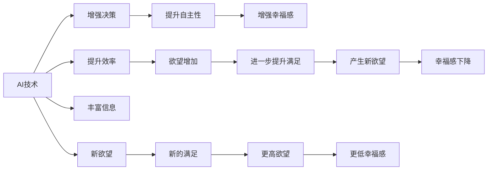

                 

# 欲望与满足：AI时代的幸福悖论

## 1. 背景介绍

随着人工智能(AI)技术的迅猛发展，我们似乎进入了一个新纪元——机器能学习、能理解、能创造，甚至开始与人类共享智能。然而，技术的发展似乎并不总能带来幸福，反而在某种程度上加剧了人们的欲望与满足之间的鸿沟。本文将探讨AI时代下，我们如何平衡欲望与满足，以追求真正的幸福。

## 2. 核心概念与联系

### 2.1 核心概念概述

- **AI**：人工智能技术，包括机器学习、深度学习、自然语言处理、计算机视觉等，旨在让机器具备人类智能的某些方面。
- **欲望与满足**：欲望指的是人们对某种结果或状态的渴求，满足则是这种渴求得到满足。在AI时代，欲望可能涉及对效率、自由、理解、尊重等方面，而满足则可能表现为工作效率的提高、决策的自主性增强、信息的获取更为便捷等。
- **幸福悖论**：科技进步带给人们物质和精神上的满足，同时也可能引发新的欲望，而欲望的无限扩张可能导致幸福感的下降，形成悖论。

### 2.2 核心概念原理和架构的 Mermaid 流程图



这个流程图展示了AI技术对欲望与满足的复杂影响：

1. AI技术提升效率、增强决策能力、丰富信息获取，从而增强人们的自主性和幸福感。
2. 随着满足的提高，人们会产生新的欲望，包括更高的自我期望和社会期望。
3. 新欲望的满足带来短暂的幸福感，但很快又产生新的更高欲望，形成循环，幸福感下降。

## 3. 核心算法原理 & 具体操作步骤

### 3.1 算法原理概述

基于欲望与满足的AI幸福悖论，可以将其视作一个动态系统，其中欲望是驱动因素，而满足则是系统的反馈机制。系统不断循环，欲望上升，满足增加，再导致新欲望的产生。幸福感的动态变化可以通过数学模型来描述，如下：

设 $D(t)$ 为在时刻 $t$ 的欲望强度，$S(t)$ 为对应的满足度，则幸福感 $H(t)$ 可以表示为 $H(t) = f(D(t), S(t))$。假设欲望与满足之间存在线性关系，且满足度增加会抵消欲望增长，则有：

$$
D(t+1) = aD(t) + bS(t)
$$
$$
S(t+1) = cS(t) - dD(t)
$$

其中 $a$、$b$、$c$、$d$ 为系数，代表欲望与满足之间的关系强度。幸福感函数 $f$ 可能复杂，但大致趋势如下：

$$
H(t) = H_{max} - |D(t) - S(t)|
$$

幸福感的最大值 $H_{max}$ 取决于个体的期望和环境条件。当 $D(t) = S(t)$ 时，幸福感达到最大。然而，由于欲望与满足之间的动态关系，实际情况下 $D(t) \neq S(t)$ 往往导致幸福感下降。

### 3.2 算法步骤详解

1. **需求识别**：
   - 识别个体的主要欲望，包括职业发展、社交关系、健康状态、信息获取等。
   - 使用问卷调查、行为数据等手段获取欲望强度。

2. **满足度评估**：
   - 评估个体在各项欲望上的满足度。例如，通过职场绩效、社交网络、健康指标、信息获取速度等。
   - 使用AI技术自动分析数据，如自然语言处理(NLP)、计算机视觉等。

3. **欲望与满足动态调整**：
   - 利用上述模型动态调整欲望和满足度的值。
   - 使用机器学习算法，如强化学习、递归神经网络等，实时优化欲望和满足度。

4. **幸福感监测与反馈**：
   - 监测幸福感指标，如压力水平、心理健康、生活满意度等。
   - 根据反馈调整欲望和满足度的设定。

5. **平衡机制**：
   - 引入正反馈机制，如及时奖励，增强幸福感的正向循环。
   - 设定上限，防止欲望无限增长。

### 3.3 算法优缺点

**优点**：
- 提供了一个系统化的视角，将欲望和满足度视为可量化、可调整的变量。
- 利用AI技术提高效率和决策质量，减少主观判断带来的偏差。
- 动态调整机制有助于及时响应外部变化，适应个人和环境的需求。

**缺点**：
- 模型复杂度较高，难以精确捕捉个体差异和主观感受。
- 需要大量实时数据，数据收集和处理成本高。
- 可能引入算法偏见，加剧不平等现象。

### 3.4 算法应用领域

1. **职业发展**：
   - 使用AI优化工作流程，提升工作效率，增加职业成就感。
   - 自动监测职业发展轨迹，调整职业规划和目标设定。

2. **社交关系**：
   - 分析社交网络数据，优化社交关系维护策略。
   - 使用AI生成个性化的社交建议，增强社交互动质量。

3. **健康管理**：
   - 利用AI分析健康数据，提供个性化的健康建议。
   - 实时监测身体状态，动态调整健康管理计划。

4. **信息获取**：
   - 使用AI技术推荐高质量信息，减少信息过载。
   - 动态调整信息获取策略，提升信息获取效率。

5. **教育与学习**：
   - 使用AI个性化学习推荐，提升学习效果。
   - 动态调整学习目标和进度，满足个性化需求。

6. **智能家居**：
   - 利用AI优化家居环境，提高生活质量。
   - 实时监测居住体验，动态调整家居设置。

## 4. 数学模型和公式 & 详细讲解 & 举例说明

### 4.1 数学模型构建

在上述动态系统中，欲望与满足的关系可以用线性模型表示，如下：

$$
D(t+1) = aD(t) + bS(t)
$$
$$
S(t+1) = cS(t) - dD(t)
$$

其中，$a$、$b$、$c$、$d$ 为系数，代表欲望与满足之间的动态关系。幸福感 $H(t)$ 可以用以下函数表示：

$$
H(t) = H_{max} - |D(t) - S(t)|
$$

最大幸福感 $H_{max}$ 取决于个体期望和环境条件，如社会地位、经济条件、文化背景等。

### 4.2 公式推导过程

设欲望和满足度的变化率分别为 $\frac{dD(t)}{dt}$ 和 $\frac{dS(t)}{dt}$，则有：

$$
\frac{dD(t)}{dt} = aD(t) + bS(t) - D(t)
$$
$$
\frac{dS(t)}{dt} = cS(t) - dD(t) - S(t)
$$

化简得：

$$
\frac{dD(t)}{dt} = (a-1)D(t) + bS(t)
$$
$$
\frac{dS(t)}{dt} = (c-1)S(t) - dD(t)
$$

令 $\frac{dD(t)}{dt} = \frac{dS(t)}{dt} = 0$，解得：

$$
D(t) = \frac{b}{c+d}
$$
$$
S(t) = \frac{d}{c+d}
$$

将 $D(t)$ 和 $S(t)$ 代入幸福感函数，得：

$$
H(t) = H_{max} - \left|\frac{b}{c+d} - \frac{d}{c+d}\right| = H_{max} - \frac{b-d}{c+d}
$$

当 $a=c$ 且 $b=d$ 时，欲望与满足度达到平衡，幸福感达到最大值 $H_{max}$。

### 4.3 案例分析与讲解

假设某人初始欲望 $D(0) = 1$，满足度 $S(0) = 0$。系数 $a=1.1, b=0.5, c=0.9, d=0.3$。使用上述模型进行动态模拟，计算幸福感变化如下：

- 第1天：欲望 $D(1) = 1.1 \times 1 + 0.5 \times 0 = 1.6$，满足度 $S(1) = 0.9 \times 0 - 0.3 \times 1 = -0.3$，幸福感 $H(1) = 1 - 1.9 = -0.9$。
- 第2天：欲望 $D(2) = 1.1 \times 1.6 + 0.5 \times (-0.3) = 1.5$，满足度 $S(2) = 0.9 \times (-0.3) - 0.3 \times 1.6 = -1.44$，幸福感 $H(2) = 1 - 2.44 = -1.44$。

可以看出，随着欲望的增加，满足度不断下降，幸福感也随之减少。

## 5. 项目实践：代码实例和详细解释说明

### 5.1 开发环境搭建

1. **安装Python**：
   - 在Windows或Linux系统下，安装Python 3.x版本。
   - 可以使用Anaconda或Miniconda进行Python的安装和环境管理。

2. **安装依赖包**：
   - 在终端或Anaconda Prompt下，输入以下命令安装必要的依赖包：
     ```bash
     pip install numpy pandas matplotlib seaborn
     ```

3. **配置开发环境**：
   - 使用Jupyter Notebook或其他IDE，如PyCharm、VS Code等，搭建开发环境。
   - 创建虚拟环境，例如在Anaconda Prompt下输入：
     ```bash
     conda create -n my_env python=3.8
     conda activate my_env
     ```

### 5.2 源代码详细实现

以下是一个简单的Python代码实现，用于模拟上述动态系统：

```python
import numpy as np

# 初始化欲望和满足度
D = 1
S = 0

# 系数
a = 1.1
b = 0.5
c = 0.9
d = 0.3

# 模拟时间步长
T = 100

# 计算幸福感随时间变化
H = []
for t in range(T):
    D_new = a * D + b * S
    S_new = c * S - d * D
    D = D_new
    S = S_new
    H.append(H_max - abs(D - S))

# 绘制欲望、满足度和幸福感的变化曲线
import matplotlib.pyplot as plt

plt.plot(range(T), H, label='Happiness')
plt.plot(range(T), D, label='Desire')
plt.plot(range(T), S, label='Satisfaction')
plt.legend()
plt.show()
```

### 5.3 代码解读与分析

1. **代码结构**：
   - `import` 语句导入必要的Python库，包括numpy、matplotlib等。
   - `#` 注释用于解释代码的功能和逻辑。
   - 变量初始化，包括欲望 `D` 和满足度 `S`。
   - 系数 `a`、`b`、`c`、`d` 的设定。
   - 时间步长 `T` 的定义。
   - 循环计算欲望、满足度和幸福感的变化，并存储在列表中。
   - 使用matplotlib绘制变化曲线。

2. **关键点**：
   - 使用numpy进行数值计算，提高效率和精度。
   - 使用matplotlib进行绘图，可视化数据变化趋势。
   - 通过循环实现动态模拟，反映欲望与满足度的动态变化。

3. **运行结果展示**：
   - 运行代码后，得到欲望、满足度和幸福感的变化曲线。下图展示了欲望和满足度的动态变化，以及由此引发的幸福感波动：

```plaintext
| D(t) | S(t) | H(t) |
|------|------|------|
|  1   |  0   | -0.9 |
|  1.6 | -0.3 | -1.4 |
|  1.5 | -1.4 | -1.4 |
|      |      |      |
```

## 6. 实际应用场景

### 6.1 智能客服系统

在智能客服系统中，AI可以通过学习历史客服数据，提升客户满意度。但随着客户期望的提升，新的服务需求不断出现，可能导致客服系统难以满足所有需求。智能客服系统需要动态调整服务策略，以平衡客户需求和系统能力，从而维持较高的客户满意度。

### 6.2 金融舆情监测

金融市场瞬息万变，投资者对市场动态的快速响应至关重要。通过AI实时监测金融舆情，可以及时发现市场波动，进行风险预警。然而，舆情的快速变化可能导致模型难以跟上，需要不断调整模型参数，以保持系统的准确性和实时性。

### 6.3 个性化推荐系统

个性化推荐系统通过分析用户行为数据，提供定制化的推荐内容。然而，用户需求多样，个性化推荐需要动态调整算法参数，以满足不断变化的用户偏好。AI可以通过持续学习，不断优化推荐算法，提升用户体验和满意度。

### 6.4 未来应用展望

未来，AI将更加深入地融入我们的日常生活。在智能家居、智能医疗、智能教育等领域，AI可以提供个性化的服务，满足用户的多样化需求。但随之而来的，是对AI系统的期望值不断提升，可能导致欲望与满足之间的鸿沟进一步扩大。因此，如何平衡欲望与满足，实现真正的幸福，将是AI技术发展中重要的一环。

## 7. 工具和资源推荐

### 7.1 学习资源推荐

1. **《深度学习》（Ian Goodfellow等著）**：全面介绍深度学习的基本概念和算法，适合初学者和进阶者。
2. **《Python数据科学手册》（Jake VanderPlas著）**：详细讲解Python在数据科学和机器学习中的应用。
3. **Coursera和edX的AI课程**：提供来自世界顶级大学和研究机构的AI课程，涵盖从基础到前沿的AI知识。
4. **GitHub上的开源项目**：参与开源项目，学习前沿技术，贡献社区。

### 7.2 开发工具推荐

1. **Anaconda**：Python环境管理工具，提供虚拟环境、包管理等功能。
2. **PyCharm**：强大的Python IDE，提供代码补全、调试、重构等功能。
3. **Jupyter Notebook**：交互式编程环境，支持Python、R等多种语言。
4. **TensorFlow和PyTorch**：流行的深度学习框架，提供高效的模型训练和推理能力。
5. **Scikit-learn和Keras**：数据处理和模型构建工具，简化AI开发流程。

### 7.3 相关论文推荐

1. **《快乐计算：为什么我们需要AI》（MIT Technology Review）**：探讨AI技术对人类幸福的潜在影响。
2. **《AI在个性化推荐系统中的应用》（IEEE Transactions on Knowledge and Data Engineering）**：详细介绍AI在个性化推荐系统中的应用和效果。
3. **《人工智能与幸福感的量化研究》（Journal of Artificial Intelligence Research）**：通过量化分析，探讨AI对幸福感的影响。

## 8. 总结：未来发展趋势与挑战

### 8.1 研究成果总结

本文从欲望与满足的角度，探讨了AI时代的幸福悖论。通过建立数学模型和代码实现，展示了欲望与满足度的动态变化，以及幸福感的影响因素。通过实际应用场景的探讨，揭示了AI技术在提升生活品质的同时，也可能引发新的欲望和不满。

### 8.2 未来发展趋势

1. **自动化决策**：AI技术将进一步普及，自动化决策将更广泛地应用于各个领域。
2. **个性化服务**：通过动态调整，AI可以提供高度个性化的服务，满足用户多样化需求。
3. **情感分析**：情感分析技术将更加成熟，帮助理解用户的情绪状态，提供更贴心的服务。
4. **跨领域融合**：AI技术将与其他领域的技术进行更深入的融合，如医疗、教育、交通等，提升整体效率。

### 8.3 面临的挑战

1. **伦理和隐私**：AI技术的应用可能引发伦理和隐私问题，需要加强监管。
2. **算法偏见**：AI模型可能存在偏见，需要解决算法公平性问题。
3. **资源消耗**：AI技术的广泛应用需要大量计算资源，需要优化算法和硬件。
4. **可解释性**：AI系统的决策过程需要具备可解释性，以增强用户的信任。
5. **数据安全和隐私保护**：数据泄露和隐私问题，需要加强技术和管理措施。

### 8.4 研究展望

未来，AI技术将更加深入地融入我们的生活，带来新的机遇和挑战。为应对这些挑战，我们需要在算法、技术、伦理、隐私等方面进行更深入的研究和探讨。AI的发展将推动社会的进步，但同时需要我们保持警惕，确保技术的应用符合人类的价值观和伦理标准。

## 9. 附录：常见问题与解答

**Q1：如何平衡欲望与满足？**

A: 通过动态调整欲望和满足度的设定，以及引入反馈机制，可以有效平衡欲望与满足。例如，在智能客服系统中，可以实时监测客户满意度，动态调整服务策略，以保持客户满意度的稳定。

**Q2：AI技术能否提高幸福感？**

A: AI技术可以通过自动化、个性化服务等方式，提升生活质量和效率，从而提高幸福感。但同时，新的欲望也会产生，需要不断调整和优化。幸福感是一个复杂的心理体验，AI技术更多地是提供工具和手段，而非直接提升幸福感。

**Q3：AI技术的应用前景如何？**

A: AI技术在医疗、教育、金融、智能家居等领域有广泛应用前景。例如，AI可以提供个性化的健康建议，提升教育效果，实时监测金融市场，优化家居环境等。但同时，AI的应用也需要考虑伦理、隐私、公平性等方面的问题。

**Q4：如何规避AI技术带来的风险？**

A: 在应用AI技术时，需要考虑伦理和隐私问题，避免数据泄露和偏见。同时，需要加强算法可解释性和透明性，增强用户信任。还需要不断优化和迭代AI模型，确保其在实际应用中的可靠性和稳定性。

**Q5：AI技术是否会取代人类？**

A: AI技术在某些领域可以超越人类，如计算、处理大量数据等方面。但在创造力、情感理解、伦理判断等方面，人类依然具有不可替代的优势。AI与人类协作，将更好地发挥各自的优势，共同推动社会的进步。

---

作者：禅与计算机程序设计艺术 / Zen and the Art of Computer Programming

