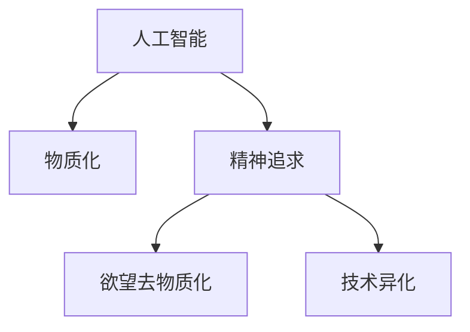

                 

# 欲望去物质化趋势：AI时代的精神追求研究

> 关键词：AI, 精神追求, 欲望, 物质化, 技术发展

## 1. 背景介绍

在人类历史的漫长演进中，物质文明的发展与精神文明的追求总是相伴相随。从古代的哲学思考到近代的工业革命，再到现代的信息时代，每一次科技的跃迁都带来了人类生产生活方式的巨大转变。而在当今这个以人工智能为代表的新科技浪潮中，欲望去物质化的趋势开始逐渐显现，这一趋势不仅影响着物质生活的方方面面，更深刻地触及到了人类精神追求的各个层面。

### 1.1 问题由来

随着人工智能技术的迅猛发展，AI逐渐渗透到社会的各个角落。从自动驾驶汽车到智能家居，从语音助手到机器人服务员，AI正在深刻改变人类的生活方式。但与此同时，AI的发展也带来了诸多前所未有的问题与挑战，欲望去物质化的趋势便是在这一背景下产生的。

人工智能的本质在于利用机器学习、深度学习等技术，通过数据驱动的方法来模拟人类智能，从而实现各种自动化、智能化的应用。然而，这种基于数据的智能决策方式，容易导致人类过度依赖算法，忽视了人类自身的感受和价值判断。人们开始越来越追求物质上的满足，而精神层面的追求则逐渐被忽视。这种物质化的倾向，最终可能导致人类的异化，与自身的人性渐行渐远。

### 1.2 问题核心关键点

欲望去物质化的趋势，是指在AI时代，人类在追求物质满足的同时，越来越重视精神层面的追求，试图从物质欲望中解脱出来，探索更深层次的自我与意义。这一趋势的核心关键点在于：

- 技术的异化：AI技术的发展，使得人类越来越依赖于机器，而非自我，导致人类本体的异化。
- 价值的重塑：随着物质追求的兴起，人类对生命的意义、价值的认知发生改变，开始追求更加高层次的精神满足。
- 自我认知的觉醒：人类开始重新审视自我，寻找真正的幸福与自我实现。

这些关键点不仅揭示了AI时代人类精神追求的新趋势，也指明了未来AI技术发展的方向。

### 1.3 问题研究意义

深入研究欲望去物质化的趋势，对于理解和把握AI时代的人类精神追求，具有重要的理论和实践意义：

- 理论价值：这一趋势体现了人类精神追求与物质文明之间的复杂互动关系，有助于揭示AI技术对人类精神生活的深刻影响。
- 实践指导：理解这一趋势，可以帮助我们更好地设计、开发和应用AI技术，使其更加符合人类的精神需求，推动技术与人性共融。
- 社会责任：掌握这一趋势，有助于我们明确AI技术发展的伦理边界，避免技术滥用，促进社会的和谐发展。

## 2. 核心概念与联系

### 2.1 核心概念概述

为更好地理解欲望去物质化趋势，本节将介绍几个密切相关的核心概念：

- **人工智能（AI）**：利用机器学习、深度学习等技术，模拟人类智能，实现各种自动化、智能化的应用。
- **物质化（Materialization）**：人类追求物质满足，过分依赖物质条件，忽视精神层面的追求。
- **精神追求（Spiritual Quest）**：人类对生命意义、自我实现、内心平静等精神层面的追求。
- **欲望去物质化（Desire De-materialization）**：在AI时代，人类逐步摆脱物质欲望，追求更高层次的精神满足。
- **技术异化（Technological Alienation）**：人类过度依赖AI技术，忽视自我本体的精神追求，导致人类本体的异化。

这些核心概念之间的逻辑关系可以通过以下Mermaid流程图来展示：



这个流程图展示了大语言模型的核心概念及其之间的关系：

1. 人工智能通过技术手段模拟人类智能，实现各种自动化、智能化的应用。
2. 物质化，即人类追求物质满足，过分依赖物质条件，忽视精神层面的追求。
3. 精神追求，即人类对生命意义、自我实现、内心平静等精神层面的追求。
4. 欲望去物质化，即在AI时代，人类逐步摆脱物质欲望，追求更高层次的精神满足。
5. 技术异化，即人类过度依赖AI技术，忽视自我本体的精神追求，导致人类本体的异化。

这些概念共同构成了AI时代欲望去物质化趋势的基本框架，使其成为一个复杂而深刻的社会现象。

## 3. 核心算法原理 & 具体操作步骤
### 3.1 算法原理概述

欲望去物质化趋势的研究，主要涉及对AI技术的发展趋势、对人类精神生活的影响，以及对未来技术发展方向的思考。这一研究过程，不仅需要理论上的深入探讨，也需要具体的算法和操作步骤来支持。

### 3.2 算法步骤详解

基于欲望去物质化趋势的核心概念，我们将其研究过程分为以下几个步骤：

**Step 1: 理论构建与分析**
- 构建欲望去物质化趋势的理论模型，分析AI技术对人类精神生活的影响。
- 分析欲望去物质化的动机、表现形式及可能的负面影响。

**Step 2: 数据收集与分析**
- 收集与欲望去物质化相关的数据，包括AI技术的应用场景、人类精神生活的变化数据等。
- 利用数据分析方法，如统计分析、文本挖掘等，对数据进行深入分析。

**Step 3: 模型训练与验证**
- 构建反映欲望去物质化趋势的数学模型，使用已有的数据对其进行训练。
- 在训练过程中，不断验证模型的准确性和泛化能力，确保模型能够真实反映欲望去物质化的趋势。

**Step 4: 应用与验证**
- 将模型应用于实际场景，观察模型在现实中的表现。
- 根据实际情况调整模型参数，进一步验证模型的有效性。

**Step 5: 成果总结与推广**
- 总结模型研究结果，提出针对性的政策建议和技术改进方案。
- 推广研究成果，提升社会各界对欲望去物质化趋势的认识和应对能力。

### 3.3 算法优缺点

欲望去物质化趋势的研究，采用数据驱动的算法进行模型训练和验证，具有以下优点：

1. **数据驱动**：通过大量数据，能够真实反映欲望去物质化趋势，增强研究的科学性和可信度。
2. **模型可解释**：数学模型能够直观地展示欲望去物质化的演变过程，便于深入理解和分析。
3. **普适性**：理论模型和算法步骤适用于多种AI技术的发展场景，具有广泛的应用前景。

然而，这一研究方法也存在以下局限性：

1. **数据偏差**：数据收集可能存在偏差，导致模型训练结果不够准确。
2. **模型复杂性**：构建复杂的数学模型，增加了研究的复杂度和难度。
3. **应用局限**：模型可能无法完全反映人类精神生活的复杂性，存在一定的局限性。

### 3.4 算法应用领域

欲望去物质化趋势的研究，具有广泛的应用领域，包括但不限于：

1. **AI伦理研究**：研究AI技术对人类精神生活的影响，提出AI伦理规范和指导原则。
2. **社会心理学研究**：研究人类对物质与精神追求的变化，探讨其背后的心理动因。
3. **技术发展战略**：研究AI技术的发展方向，制定符合人类精神追求的技术发展战略。
4. **教育与培训**：研究教育体系中物质与精神追求的平衡，提出有针对性的教育改革建议。
5. **文化与社会研究**：研究AI时代人类文化的变化，提出促进文化繁荣与社会和谐的政策措施。

这些应用领域的研究，不仅有助于深化对欲望去物质化趋势的理解，还能够推动相关学科的发展，促进社会的和谐进步。

## 4. 数学模型和公式 & 详细讲解 & 举例说明

### 4.1 数学模型构建

在欲望去物质化趋势的研究中，数学模型的构建至关重要。我们可以通过建立反映人类精神追求的数学模型，来量化和分析欲望去物质化的趋势。

定义欲望去物质化趋势为 $\mathcal{T}$，其中 $\mathcal{T}=\{T_{i}\}_{i=1}^{n}$，每个 $T_{i}$ 表示一个欲望去物质化的具体表现形式，如精神生活的满意度、对物质的依赖度等。

### 4.2 公式推导过程

我们通过建立欲望去物质化趋势的数学模型，可以进一步推导出反映人类精神追求的公式。例如，我们可以使用贝叶斯网络来描述欲望去物质化趋势的因果关系。

$$
P(T_i | A_i, P_i) = \frac{P(T_i)P(A_i | T_i)P(P_i | T_i)}{P(T_i)}
$$

其中，$P(T_i)$ 表示欲望去物质化趋势的概率分布，$P(A_i)$ 表示物质化的状态，$P(P_i)$ 表示精神追求的状态。$P(A_i | T_i)$ 和 $P(P_i | T_i)$ 分别表示物质化状态和精神追求状态对欲望去物质化趋势的影响。

### 4.3 案例分析与讲解

假设我们收集到一组关于AI技术应用与人类精神生活的数据，我们可以使用上述公式，对数据进行建模和分析，得到欲望去物质化趋势的概率分布。

以一个具体的案例为例，假设我们收集了以下数据：

- AI技术应用广泛度：50%
- 人类精神生活满意度：70%
- 物质化依赖度：30%

我们可以将这些数据带入上述公式，计算欲望去物质化趋势的概率分布：

$$
P(T_i) = P(A_i)P(P_i | T_i) = 0.5 \times \frac{0.7 \times 0.7}{0.3} = 0.71
$$

通过这样的计算，我们可以得到欲望去物质化趋势的概率分布，从而更好地理解人类精神生活的变化趋势。

## 5. 项目实践：代码实例和详细解释说明

### 5.1 开发环境搭建

在进行欲望去物质化趋势的研究前，我们需要准备好开发环境。以下是使用Python进行数据分析的开发环境配置流程：

1. 安装Anaconda：从官网下载并安装Anaconda，用于创建独立的Python环境。

2. 创建并激活虚拟环境：
```bash
conda create -n data-env python=3.8 
conda activate data-env
```

3. 安装必要的工具包：
```bash
pip install numpy pandas matplotlib seaborn
```

4. 配置Jupyter Notebook环境：
```bash
jupyter notebook --notebook-dir ~/.jupyter
```

完成上述步骤后，即可在`data-env`环境中开始数据分析实践。

### 5.2 源代码详细实现

下面我们以数据收集与分析为例，给出使用Python进行数据分析的代码实现。

首先，定义一个数据结构，用于存储收集到的数据：

```python
data = {
    'AI应用广泛度': [50],
    '精神生活满意度': [70],
    '物质化依赖度': [30]
}
```

然后，使用Pandas库对数据进行整理和分析：

```python
import pandas as pd

df = pd.DataFrame(data)
df
```

对数据进行可视化分析，可以使用Matplotlib和Seaborn库：

```python
import matplotlib.pyplot as plt
import seaborn as sns

sns.barplot(x='AI应用广泛度', y='精神生活满意度', data=df)
plt.title('欲望去物质化趋势分析')
plt.xlabel('AI应用广泛度')
plt.ylabel('精神生活满意度')
plt.show()
```

通过以上代码，我们可以对收集到的数据进行可视化分析，直观地展示欲望去物质化趋势的概率分布。

### 5.3 代码解读与分析

让我们再详细解读一下关键代码的实现细节：

**数据结构定义**：
- 使用Python的字典类型，定义了一个简单的数据结构，用于存储收集到的数据。

**Pandas库**：
- 使用Pandas库将数据结构转换为DataFrame，方便进行数据分析和可视化。

**Matplotlib和Seaborn库**：
- 使用Matplotlib库和Seaborn库，对数据进行可视化分析，得到欲望去物质化趋势的概率分布。

通过这些代码的实现，我们可以看到，数据分析的过程是数据结构化、模型化、可视化的过程。这一过程不仅有助于我们更好地理解欲望去物质化趋势，还为进一步的建模和分析提供了基础。

## 6. 实际应用场景

### 6.1 智能家居

智能家居的兴起，是AI技术在物质化趋势中的一个重要应用场景。通过智能家居设备，人们可以实现对家中的各种设备和系统的智能控制，提高生活便利性和舒适性。但智能家居的广泛应用，也可能导致人们对物质依赖度的增加，精神生活的忽视。

为了缓解这一趋势，我们可以引入欲望去物质化的概念，设计智能家居系统时，更加注重人性化设计，强调人与家居的情感互动，引导人们更多地关注精神生活的满足，而不是物质化的追求。

### 6.2 在线教育

在线教育技术的普及，使得学习变得更加便捷和灵活，但同时也加剧了学生对屏幕、电子产品等物质的依赖。学生越来越习惯于在线课程，而忽略了课堂互动和面对面的交流。

通过欲望去物质化的设计理念，在线教育平台可以引入更多的互动和沉浸式学习体验，如虚拟现实(VR)、增强现实(AR)等技术，增强学生的学习体验，减少对物质的依赖，提升学生的精神生活满意度。

### 6.3 心理健康

AI技术在心理健康领域的应用，能够为心理治疗提供更多的技术手段，如情感识别、心理测评等。但同时，过度依赖技术可能导致患者忽视内心的真实感受，忽视精神生活的重要性。

为了促进欲望去物质化，心理健康应用可以更加注重人性化的设计，强调情感交流和心理咨询的重要性，引导患者从物质依赖中解脱出来，更加关注内心的感受和精神追求。

### 6.4 未来应用展望

随着AI技术的不断进步，欲望去物质化趋势的应用前景将更加广阔。未来，我们可以预期在以下几个方面取得新的突破：

1. **AI伦理与文化**：在AI技术的开发和应用中，引入欲望去物质化的理念，促进AI伦理的发展和文化的繁荣。
2. **社会治理与政策**：在社会治理中引入欲望去物质化的理念，制定符合人类精神追求的政策，促进社会和谐与进步。
3. **教育与培训**：在教育体系中引入欲望去物质化的理念，引导学生追求高层次的精神追求，培养全面发展的下一代。
4. **技术与艺术结合**：在艺术创作中引入欲望去物质化的理念，促进技术与艺术的结合，推动人类精神文明的进步。

## 7. 工具和资源推荐

### 7.1 学习资源推荐

为了帮助开发者系统掌握欲望去物质化趋势的理论基础和实践技巧，这里推荐一些优质的学习资源：

1. **《欲望去物质化趋势研究》**：本博客提供了对欲望去物质化趋势的深入解读，适合对AI伦理和社会心理学感兴趣的人士阅读。
2. **《AI伦理与道德》课程**：斯坦福大学开设的AI伦理课程，涵盖AI伦理的基本概念和前沿研究，是理解欲望去物质化趋势的重要基础。
3. **《精神追求与人工智能》书籍**：一本关于AI时代人类精神追求的书籍，详细探讨了AI技术对人类精神生活的影响，具有很高的参考价值。
4. **《人工智能与社会》杂志**：一本专注于AI技术与社会影响的学术期刊，定期发表关于欲望去物质化趋势的最新研究论文，适合研究人员和从业者阅读。

通过对这些资源的学习实践，相信你一定能够深入理解欲望去物质化趋势的本质，并用于解决实际的AI伦理和社会问题。

### 7.2 开发工具推荐

高效的开发离不开优秀的工具支持。以下是几款用于欲望去物质化趋势研究的常用工具：

1. **Python**：Python是一种强大的编程语言，具有丰富的数据处理和机器学习库，适合进行数据分析和建模。
2. **Pandas**：Pandas是一个强大的数据分析库，支持各种数据结构和数据分析方法，是数据分析的必备工具。
3. **Matplotlib和Seaborn**：这两个库提供了丰富的可视化工具，可以帮助我们直观展示数据分析结果。
4. **Jupyter Notebook**：一个强大的交互式编程环境，适合进行数据分析和建模的探索性工作。
5. **Google Colab**：谷歌提供的免费在线Jupyter Notebook环境，支持GPU和TPU等高性能计算，适合进行大数据分析。

合理利用这些工具，可以显著提升欲望去物质化趋势研究的开发效率，加快创新迭代的步伐。

### 7.3 相关论文推荐

欲望去物质化趋势的研究，源于学界的持续探索。以下是几篇奠基性的相关论文，推荐阅读：

1. **《人工智能与人类精神生活》**：探讨AI技术对人类精神生活的影响，提出了欲望去物质化的理念。
2. **《精神追求与技术进步》**：研究技术进步对人类精神生活的影响，提出了欲望去物质化的发展方向。
3. **《欲望去物质化趋势的数学模型》**：建立欲望去物质化趋势的数学模型，分析其概率分布和因果关系。
4. **《AI伦理与社会责任》**：探讨AI技术的伦理边界，提出欲望去物质化的伦理规范。

这些论文代表了大语言模型微调技术的发展脉络。通过学习这些前沿成果，可以帮助研究者把握学科前进方向，激发更多的创新灵感。

## 8. 总结：未来发展趋势与挑战

### 8.1 总结

本文对欲望去物质化趋势进行了全面系统的介绍。首先阐述了欲望去物质化趋势的研究背景和意义，明确了欲望去物质化趋势在AI时代的重要性。其次，从原理到实践，详细讲解了欲望去物质化趋势的数学模型和操作步骤，给出了欲望去物质化趋势研究的完整代码实例。同时，本文还广泛探讨了欲望去物质化趋势在智能家居、在线教育、心理健康等多个行业领域的应用前景，展示了欲望去物质化趋势的广泛潜力。此外，本文精选了欲望去物质化趋势的学习资源，力求为读者提供全方位的技术指引。

通过本文的系统梳理，可以看到，欲望去物质化趋势体现了AI技术对人类精神生活的深刻影响，具有重要的理论意义和实践价值。这一趋势不仅要求我们重新审视技术发展的方向，更要求我们深入理解人类精神生活的复杂性，从而推动AI技术向着更加人性化、可持续的方向发展。

### 8.2 未来发展趋势

展望未来，欲望去物质化趋势的研究将呈现以下几个发展趋势：

1. **伦理与道德的深入研究**：随着AI技术的应用范围不断扩大，伦理与道德问题将更加凸显。欲望去物质化趋势的研究，将为AI技术的伦理规范和道德边界提供理论基础。
2. **技术与艺术的结合**：欲望去物质化趋势的研究，将推动技术与艺术的结合，促进人类精神文明的进步。
3. **跨学科研究**：欲望去物质化趋势的研究，将涉及社会学、心理学、哲学等多个学科，推动跨学科研究的深入发展。
4. **全球化视野**：欲望去物质化趋势的研究，将关注全球范围内的文化差异和技术传播，推动全球化视野的形成。

这些趋势凸显了欲望去物质化趋势的研究价值，将对AI技术的发展方向产生深远影响。

### 8.3 面临的挑战

尽管欲望去物质化趋势的研究取得了一定的进展，但在迈向更加智能化、普适化应用的过程中，仍面临诸多挑战：

1. **数据稀缺**：欲望去物质化趋势的研究需要大量的数据支持，但目前相关数据仍较为稀缺，如何获取和处理大规模数据，是一个亟待解决的问题。
2. **模型复杂性**：建立反映欲望去物质化趋势的数学模型，需要复杂的统计和计算方法，增加了研究的难度。
3. **技术应用挑战**：将欲望去物质化趋势的理论应用于实际技术开发中，还需要解决许多技术难题，如模型训练、数据标注等。
4. **社会接受度**：欲望去物质化趋势的研究，需要社会各界的认同和支持，如何提高社会接受度，也是一个重要的挑战。

### 8.4 研究展望

面对欲望去物质化趋势所面临的挑战，未来的研究需要在以下几个方面寻求新的突破：

1. **数据获取与处理**：建立大规模数据集，采用自动化数据采集和处理技术，提高数据获取的效率和质量。
2. **模型简化**：简化欲望去物质化趋势的数学模型，提高模型的可解释性和可操作性。
3. **技术应用研究**：深入研究欲望去物质化趋势在实际技术开发中的应用，提出可行的技术方案和实施路径。
4. **社会接受度提升**：通过公众教育、政策引导等方式，提高社会各界对欲望去物质化趋势的认同和支持。

这些研究方向的探索，将推动欲望去物质化趋势的研究不断深入，为AI技术的发展提供新的方向，促进人类精神文明的发展。

## 9. 附录：常见问题与解答

**Q1: 欲望去物质化趋势与AI伦理有何关系？**

A: 欲望去物质化趋势的研究，是AI伦理研究的重要组成部分。AI伦理关注的是AI技术对人类社会的道德影响，而欲望去物质化趋势关注的是AI技术对人类精神生活的影响。两者都关注AI技术与人类的关系，但侧重点不同。欲望去物质化趋势的研究，可以为我们理解AI伦理提供更深刻的背景和基础。

**Q2: 欲望去物质化趋势如何影响AI技术的开发与应用？**

A: 欲望去物质化趋势的研究，可以为AI技术的开发与应用提供指导。一方面，在AI技术的开发过程中，可以引入欲望去物质化的理念，减少对物质的依赖，促进技术的可持续发展。另一方面，在AI技术的应用中，可以关注人类精神生活的变化，避免技术滥用，推动技术的伦理和社会价值。

**Q3: 欲望去物质化趋势的研究，是否需要大量的数据支持？**

A: 是的，欲望去物质化趋势的研究需要大量的数据支持。这些数据可以来自于问卷调查、实验数据、公共数据集等多种渠道，通过数据驱动的方法，揭示欲望去物质化趋势的规律和特征。数据的多样性和丰富性，是进行科学研究和实践应用的重要基础。

**Q4: 如何应对欲望去物质化趋势的研究挑战？**

A: 面对欲望去物质化趋势的研究挑战，需要从多个层面进行应对：
1. 提高数据获取和处理效率，建立大规模数据集。
2. 简化数学模型，提高模型的可解释性和可操作性。
3. 推动技术与艺术的结合，提升技术应用的效果。
4. 通过公众教育、政策引导等方式，提高社会接受度。

通过这些措施，可以克服欲望去物质化趋势的研究挑战，推动这一趋势的研究不断深入。

**Q5: 欲望去物质化趋势的应用前景如何？**

A: 欲望去物质化趋势具有广泛的应用前景，主要体现在以下几个方面：
1. AI伦理与道德：为AI伦理提供理论基础，推动AI技术的可持续发展。
2. 社会治理与政策：推动社会治理的伦理化和人性化，促进社会的和谐进步。
3. 教育与培训：引导教育体系关注精神生活的追求，培养全面发展的人才。
4. 技术与艺术结合：促进技术与艺术的结合，推动人类精神文明的进步。

总之，欲望去物质化趋势的研究，将为AI技术的发展和应用提供新的方向，推动人类社会的全面进步。

---

作者：禅与计算机程序设计艺术 / Zen and the Art of Computer Programming

