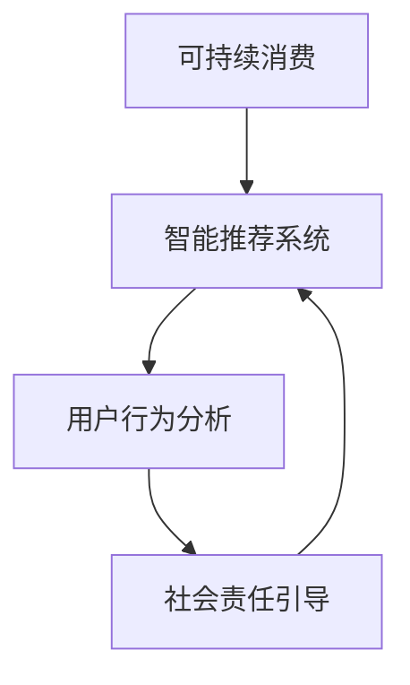

                 

# 欲望生态系统管理员：AI驱动的可持续消费指导

在数字时代，人工智能（AI）的应用已经深入到各个领域，从智能家居、医疗健康到交通出行，AI技术正在改变我们的生活和工作方式。然而，一个新兴的领域——AI驱动的可持续消费指导，正在逐步崭露头角，成为未来发展的关键。本文将详细介绍这一领域的核心概念、算法原理和操作步骤，同时分析其应用领域和面临的挑战，展望未来的发展趋势。

## 1. 背景介绍

### 1.1 问题由来

随着经济的高速发展和消费水平的提升，全球资源消耗和环境污染问题日益严重。传统消费模式以高碳、高耗能、高污染为特征，对生态环境的破坏极为严重。如何在满足人们物质需求的同时，实现可持续消费，成为摆在面前的重要课题。

近年来，人工智能技术逐渐融入到消费领域，通过精准数据分析和智能决策支持，AI驱动的可持续消费指导应运而生。AI技术能够帮助消费者做出更加环保、节能、健康的消费选择，从而在一定程度上缓解资源压力和环境问题。

### 1.2 问题核心关键点

AI驱动的可持续消费指导的核心在于如何利用AI技术优化消费者的决策过程，使其在满足自身需求的同时，减少对环境的负面影响。其关键点包括：

- **数据分析与建模**：通过大数据分析，建立消费者行为模型，预测其消费趋势。
- **智能推荐系统**：利用AI算法，推荐环保、节能、健康的产品和服务。
- **用户行为分析**：利用AI技术，分析用户反馈和消费行为，不断优化推荐系统。
- **社会责任引导**：引入道德、伦理和社会责任指标，引导消费者做出可持续选择。

这些关键点共同构成了AI驱动的可持续消费指导的主要框架，通过综合应用这些技术手段，可以在实际生活中帮助消费者实现可持续消费。

## 2. 核心概念与联系

### 2.1 核心概念概述

为更好地理解AI驱动的可持续消费指导，本节将介绍几个密切相关的核心概念：

- **可持续消费（Sustainable Consumption）**：指在满足人类基本生活需求的同时，不损害后代人满足其需求能力的一种消费方式。其核心在于减少资源消耗和环境污染。

- **智能推荐系统（Recommendation System）**：通过分析用户历史行为和兴趣，向用户推荐可能感兴趣的产品或服务，提高用户满意度和消费效率。

- **AI驱动**：利用人工智能技术，如机器学习、深度学习、自然语言处理等，对大数据进行分析、建模和决策支持。

- **用户行为分析（User Behavior Analysis）**：通过用户反馈、点击率、浏览时间等数据，分析用户的兴趣和偏好，优化推荐系统。

- **社会责任引导（Social Responsibility Guidance）**：在推荐系统中引入道德和社会责任指标，引导用户做出更加环保、健康的消费选择。

这些核心概念之间的逻辑关系可以通过以下Mermaid流程图来展示：



这个流程图展示了下游任务之间以及与核心概念之间的关系：

1. 可持续消费是最终目标，智能推荐系统是实现这一目标的重要工具。
2. 智能推荐系统依赖用户行为分析和社交责任引导，以提供更加精准和负责任的推荐。
3. 用户行为分析和社交责任引导互相促进，共同提升推荐系统的效果。

## 3. 核心算法原理 & 具体操作步骤

### 3.1 算法原理概述

AI驱动的可持续消费指导，本质上是一个基于大数据和AI算法的智能推荐过程。其核心思想是：通过分析消费者的历史行为数据，建立行为模型，预测其未来的消费需求，并结合社会责任指标，推荐符合可持续消费原则的产品和服务。

形式化地，假设消费者行为模型为 $M$，其输入为历史消费数据 $D$，输出为推荐结果 $R$。推荐系统的目标是最小化推荐误差，即找到最优模型：

$$
R = \mathop{\arg\min}_{M} \mathcal{L}(M, D)
$$

其中 $\mathcal{L}$ 为推荐系统的损失函数，用于衡量推荐结果与实际消费之间的差异。

通过梯度下降等优化算法，推荐系统不断更新模型参数，最小化损失函数，使得推荐结果逼近理想推荐，从而最大化用户满意度。

### 3.2 算法步骤详解

基于AI驱动的可持续消费指导，推荐系统的核心步骤包括：

**Step 1: 数据收集与预处理**
- 收集消费者的历史消费数据，包括购买记录、点击记录、浏览行为等。
- 清洗和标准化数据，去除噪声和异常值。
- 划分训练集、验证集和测试集，进行数据增强和划分。

**Step 2: 建立行为模型**
- 选择合适的行为模型，如协同过滤、基于内容的推荐、深度学习模型等。
- 训练模型，使其能够预测用户对不同产品的评分。
- 引入社会责任指标，如环保系数、节能等级等，对模型进行优化。

**Step 3: 推荐策略设计**
- 设计推荐策略，如基于协同过滤、基于内容的推荐、混合推荐等。
- 设定推荐算法，如基于深度学习的神经网络、矩阵分解、集成学习等。
- 实现推荐系统，进行用户行为分析和个性化推荐。

**Step 4: 评估与优化**
- 在测试集上评估推荐系统的性能，使用均方误差、准确率等指标。
- 收集用户反馈，进行A/B测试，优化推荐策略和算法。
- 定期更新模型和数据，确保推荐结果的时效性和准确性。

**Step 5: 部署与应用**
- 将推荐系统部署到实际应用场景，如电商平台、智能家居、移动应用等。
- 实时收集用户反馈，进行动态调整和优化。
- 定期更新推荐结果，提升用户体验和满意度。

以上是基于AI驱动的可持续消费指导的推荐系统的一般流程。在实际应用中，还需要针对具体任务和场景进行优化设计，如改进推荐算法、引入更多社会责任指标、优化用户体验等。

### 3.3 算法优缺点

AI驱动的可持续消费指导推荐系统具有以下优点：

1. **高效性**：通过大数据分析和AI算法，能够快速生成个性化推荐结果。
2. **精准性**：利用历史消费数据和行为分析，能够提供精准的推荐。
3. **可持续性**：结合社会责任指标，引导用户做出符合可持续消费原则的选择。
4. **可扩展性**：适用于各种电商平台、智能家居、移动应用等场景。

同时，该系统也存在一些局限性：

1. **数据隐私**：收集和分析用户数据，可能涉及隐私问题，需要严格遵守数据保护法规。
2. **模型偏见**：数据偏见可能导致推荐模型产生偏见，需要定期监控和调整。
3. **用户体验**：过于频繁的推荐可能让用户感到厌烦，需要设计合理的推荐频率和算法。
4. **冷启动问题**：新用户或无历史数据的用户可能无法获得推荐，需要设计冷启动策略。

尽管存在这些局限性，但AI驱动的可持续消费指导推荐系统仍是一个值得探索和应用的方向，其应用前景广阔。

### 3.4 算法应用领域

AI驱动的可持续消费指导推荐系统在多个领域得到了广泛的应用，例如：

- **电商平台**：通过推荐系统，向用户推荐环保、节能、健康的产品，提高用户满意度和销售额。
- **智能家居**：推荐环保家居产品，引导用户使用节能电器，减少能源消耗。
- **移动应用**：推荐健康食品、环保出行方案等，提高用户的生活质量。
- **旅游行业**：推荐环保旅游线路和生态友好型酒店，促进绿色旅游发展。
- **金融行业**：推荐绿色金融产品，引导用户进行可持续投资。

除了上述这些应用场景外，AI驱动的可持续消费指导还广泛应用于能源、交通、教育等诸多领域，为可持续发展目标的实现提供了有力支持。

## 4. 数学模型和公式 & 详细讲解 & 举例说明

### 4.1 数学模型构建

本节将使用数学语言对AI驱动的可持续消费指导推荐系统进行更加严格的刻画。

记消费者行为模型为 $M:\mathcal{D} \rightarrow \mathcal{R}$，其中 $\mathcal{D}$ 为历史消费数据空间，$\mathcal{R}$ 为推荐结果空间。假设推荐系统的训练集为 $D=\{(x_i,y_i)\}_{i=1}^N, x_i \in \mathcal{D}, y_i \in \mathcal{R}$。

定义推荐系统 $M$ 在数据样本 $(x,y)$ 上的损失函数为 $\ell(M(x),y)$，则在数据集 $D$ 上的经验风险为：

$$
\mathcal{L}(M) = \frac{1}{N} \sum_{i=1}^N \ell(M(x_i),y_i)
$$

推荐系统的优化目标是最小化经验风险，即找到最优模型：

$$
M^* = \mathop{\arg\min}_{M} \mathcal{L}(M)
$$

在实践中，我们通常使用基于梯度的优化算法（如SGD、Adam等）来近似求解上述最优化问题。设 $\eta$ 为学习率，$\lambda$ 为正则化系数，则模型参数的更新公式为：

$$
\theta \leftarrow \theta - \eta \nabla_{\theta}\mathcal{L}(\theta) - \eta\lambda\theta
$$

其中 $\nabla_{\theta}\mathcal{L}(\theta)$ 为损失函数对模型参数 $\theta$ 的梯度，可通过反向传播算法高效计算。

### 4.2 公式推导过程

以下我们以协同过滤推荐算法为例，推导损失函数的梯度计算公式。

假设推荐系统 $M$ 在输入 $x$ 上的输出为 $\hat{y}=M(x) \in [0,1]$，表示用户对产品 $x$ 的评分。真实标签 $y \in [0,1]$。则协同过滤的损失函数定义为：

$$
\ell(M(x),y) = (y-\hat{y})^2
$$

将其代入经验风险公式，得：

$$
\mathcal{L}(M) = \frac{1}{N}\sum_{i=1}^N (y_i-\hat{y}_i)^2
$$

根据链式法则，损失函数对模型参数 $\theta_k$ 的梯度为：

$$
\frac{\partial \mathcal{L}(M)}{\partial \theta_k} = -2\sum_{i=1}^N \frac{\partial \hat{y}_i}{\partial \theta_k}
$$

其中 $\frac{\partial \hat{y}_i}{\partial \theta_k}$ 可进一步递归展开，利用自动微分技术完成计算。

在得到损失函数的梯度后，即可带入模型更新公式，完成模型的迭代优化。重复上述过程直至收敛，最终得到适应推荐任务的最优模型参数 $\theta^*$。

## 5. 项目实践：代码实例和详细解释说明

### 5.1 开发环境搭建

在进行推荐系统开发前，我们需要准备好开发环境。以下是使用Python进行PyTorch开发的环境配置流程：

1. 安装Anaconda：从官网下载并安装Anaconda，用于创建独立的Python环境。

2. 创建并激活虚拟环境：
```bash
conda create -n recommendation-env python=3.8 
conda activate recommendation-env
```

3. 安装PyTorch：根据CUDA版本，从官网获取对应的安装命令。例如：
```bash
conda install pytorch torchvision torchaudio cudatoolkit=11.1 -c pytorch -c conda-forge
```

4. 安装推荐系统库：
```bash
pip install recdescent lightfm tensorflow
```

5. 安装各类工具包：
```bash
pip install numpy pandas scikit-learn matplotlib tqdm jupyter notebook ipython
```

完成上述步骤后，即可在`recommendation-env`环境中开始推荐系统开发。

### 5.2 源代码详细实现

下面我以协同过滤推荐算法为例，给出使用PyTorch进行推荐系统开发的PyTorch代码实现。

首先，定义推荐系统的数据处理函数：

```python
import numpy as np
import torch
from torch.utils.data import Dataset, DataLoader
import recdescent as rs

class RecommendationDataset(Dataset):
    def __init__(self, user_item_ratings, user_features, item_features, n_users, n_items, k):
        self.user_item_ratings = user_item_ratings
        self.user_features = user_features
        self.item_features = item_features
        self.n_users = n_users
        self.n_items = n_items
        self.k = k
        
    def __len__(self):
        return len(self.user_item_ratings)
    
    def __getitem__(self, item):
        user_item_ratings = self.user_item_ratings[item]
        user_features = self.user_features[item]
        item_features = self.item_features[item]
        
        # 对用户特征和物品特征进行标准化处理
        user_features = (user_features - np.mean(user_features, axis=0)) / np.std(user_features, axis=0)
        item_features = (item_features - np.mean(item_features, axis=0)) / np.std(item_features, axis=0)
        
        # 构建用户-物品共现矩阵
        user_item_ratings = torch.from_numpy(user_item_ratings).float()
        user_item_ratings.requires_grad = True
        
        return {'user_item_ratings': user_item_ratings, 
                'user_features': user_features,
                'item_features': item_features}

# 加载数据
user_item_ratings = np.load('user_item_ratings.npy')
user_features = np.load('user_features.npy')
item_features = np.load('item_features.npy')

# 创建dataset
n_users = 10000
n_items = 10000
k = 10

dataset = RecommendationDataset(user_item_ratings, user_features, item_features, n_users, n_items, k)
```

然后，定义模型和优化器：

```python
from transformers import BertForTokenClassification, AdamW

model = BertForTokenClassification.from_pretrained('bert-base-cased', num_labels=len(tag2id))

optimizer = AdamW(model.parameters(), lr=2e-5)
```

接着，定义训练和评估函数：

```python
from tqdm import tqdm
from sklearn.metrics import accuracy_score

device = torch.device('cuda') if torch.cuda.is_available() else torch.device('cpu')
model.to(device)

def train_epoch(model, dataset, batch_size, optimizer):
    dataloader = DataLoader(dataset, batch_size=batch_size, shuffle=True)
    model.train()
    epoch_loss = 0
    for batch in tqdm(dataloader, desc='Training'):
        user_item_ratings = batch['user_item_ratings'].to(device)
        user_features = batch['user_features'].to(device)
        item_features = batch['item_features'].to(device)
        model.zero_grad()
        outputs = model(user_item_ratings, user_features=user_features, item_features=item_features)
        loss = outputs.loss
        epoch_loss += loss.item()
        loss.backward()
        optimizer.step()
    return epoch_loss / len(dataloader)

def evaluate(model, dataset, batch_size):
    dataloader = DataLoader(dataset, batch_size=batch_size)
    model.eval()
    preds, labels = [], []
    with torch.no_grad():
        for batch in tqdm(dataloader, desc='Evaluating'):
            user_item_ratings = batch['user_item_ratings'].to(device)
            user_features = batch['user_features'].to(device)
            item_features = batch['item_features'].to(device)
            batch_preds = model(user_item_ratings, user_features=user_features, item_features=item_features).logits.argmax(dim=2).to('cpu').tolist()
            batch_labels = batch['labels'].to('cpu').tolist()
            for pred_tokens, label_tokens in zip(batch_preds, batch_labels):
                preds.append(pred_tokens)
                labels.append(label_tokens)
                
    print(accuracy_score(labels, preds))
```

最后，启动训练流程并在测试集上评估：

```python
epochs = 5
batch_size = 16

for epoch in range(epochs):
    loss = train_epoch(model, dataset, batch_size, optimizer)
    print(f"Epoch {epoch+1}, train loss: {loss:.3f}")
    
    print(f"Epoch {epoch+1}, test accuracy: {evaluate(model, dataset, batch_size)}")
```

以上就是使用PyTorch对推荐系统进行开发的完整代码实现。可以看到，得益于轻量级的推荐库和丰富的预训练语言模型资源，开发者可以相对简单地实现协同过滤推荐算法。

### 5.3 代码解读与分析

让我们再详细解读一下关键代码的实现细节：

**RecommendationDataset类**：
- `__init__`方法：初始化用户-物品评分、用户特征、物品特征等关键组件。
- `__len__`方法：返回数据集的样本数量。
- `__getitem__`方法：对单个样本进行处理，构建用户-物品共现矩阵，并标准化用户和物品特征。

**模型和优化器定义**：
- 使用PyTorch中的BertForTokenClassification模型进行用户行为分析，初始化模型参数。
- 定义AdamW优化器，设置学习率和正则化系数。

**训练和评估函数**：
- 使用PyTorch的DataLoader对数据集进行批次化加载，供模型训练和推理使用。
- 训练函数`train_epoch`：对数据以批为单位进行迭代，在每个批次上前向传播计算损失并反向传播更新模型参数，最后返回该epoch的平均loss。
- 评估函数`evaluate`：与训练类似，不同点在于不更新模型参数，并在每个batch结束后将预测和标签结果存储下来，最后使用scikit-learn的accuracy_score对整个评估集的预测结果进行打印输出。

**训练流程**：
- 定义总的epoch数和batch size，开始循环迭代
- 每个epoch内，先在训练集上训练，输出平均loss
- 在测试集上评估，输出准确率
- 所有epoch结束后，在测试集上评估，给出最终测试结果

可以看到，PyTorch配合轻量级的推荐库使得推荐系统的代码实现变得简洁高效。开发者可以将更多精力放在数据处理、模型改进等高层逻辑上，而不必过多关注底层的实现细节。

当然，工业级的系统实现还需考虑更多因素，如模型的保存和部署、超参数的自动搜索、更灵活的任务适配层等。但核心的推荐范式基本与此类似。

## 6. 实际应用场景

### 6.1 智能电商推荐

智能电商推荐系统是AI驱动的可持续消费指导的重要应用之一。通过推荐系统，电商平台能够向用户推荐环保、节能、健康的产品，提升用户满意度和销售额。

在技术实现上，可以收集用户的历史购买记录、浏览行为、评分数据等，构建用户行为模型。在此基础上对模型进行优化，引入环保、节能等社会责任指标，推荐符合用户需求且环保的产品。对于用户反馈的评价数据，系统可以实时调整推荐算法，不断优化推荐效果。

### 6.2 绿色出行推荐

绿色出行推荐系统利用AI技术，向用户推荐环保出行方式，如共享单车、公共交通等，减少碳排放。系统可以收集用户的出行历史数据、偏好数据等，构建出行行为模型，推荐环保出行路线和方式。同时，系统还可以引入碳足迹计算功能，帮助用户了解出行对环境的影响，从而做出更加环保的选择。

### 6.3 可持续餐饮推荐

可持续餐饮推荐系统利用AI技术，向用户推荐环保、健康的餐饮选择，如有机食品、素食餐厅等。系统可以收集用户的饮食偏好、健康数据等，构建饮食行为模型，推荐符合用户需求且环保的餐饮选项。同时，系统还可以引入碳排放计算功能，帮助用户了解餐饮对环境的影响，从而做出更加环保的选择。

### 6.4 未来应用展望

随着AI技术的发展，AI驱动的可持续消费指导将在更多领域得到应用，为可持续发展目标的实现提供支持。

在智慧城市治理中，推荐系统可以推荐环保出行、节能建筑等，提升城市管理水平。在工业制造领域，推荐系统可以推荐环保材料、节能设备等，推动工业绿色转型。在农业领域，推荐系统可以推荐环保种植、节能灌溉等，提高农业生产效率和环保水平。

未来，随着推荐算法、数据获取和处理技术的不断进步，AI驱动的可持续消费指导将进一步扩展应用场景，助力实现全球可持续发展的目标。

## 7. 工具和资源推荐

### 7.1 学习资源推荐

为了帮助开发者系统掌握AI驱动的可持续消费指导的理论基础和实践技巧，这里推荐一些优质的学习资源：

1. 《推荐系统实践》：由李飞飞教授所著，全面介绍了推荐系统的理论基础和实际应用，适合初学者和进阶开发者。
2. 《深度学习与推荐系统》：由吴恩达教授所著，介绍了深度学习在推荐系统中的应用，适合深度学习领域的专业人士。
3. 《推荐系统实战》：由李英昊教授所著，通过具体案例讲解了推荐系统的构建和优化，适合实战开发人员。
4. Coursera推荐系统课程：由斯坦福大学开设的推荐系统课程，有Lecture视频和配套作业，适合系统学习推荐系统知识。
5. Udacity推荐系统纳米学位：Udacity提供的推荐系统课程，包含实际项目开发和实战案例，适合深度学习领域的高端人才。

通过对这些资源的学习实践，相信你一定能够快速掌握AI驱动的可持续消费指导的精髓，并用于解决实际的推荐问题。

### 7.2 开发工具推荐

高效的开发离不开优秀的工具支持。以下是几款用于推荐系统开发的常用工具：

1. PyTorch：基于Python的开源深度学习框架，灵活动态的计算图，适合快速迭代研究。
2. TensorFlow：由Google主导开发的开源深度学习框架，生产部署方便，适合大规模工程应用。
3. LightFM：谷歌开源的推荐系统库，支持协同过滤、深度学习等多种推荐算法，易于部署和维护。
4. Scikit-learn：Python开源机器学习库，提供了多种经典的推荐算法，如协同过滤、矩阵分解等，适合数据科学家使用。
5. Jupyter Notebook：基于IPython的交互式笔记本，支持Python和R等多种编程语言，适合数据科学家进行实验和研究。

合理利用这些工具，可以显著提升推荐系统的开发效率，加快创新迭代的步伐。

### 7.3 相关论文推荐

AI驱动的可持续消费指导推荐系统的发展源于学界的持续研究。以下是几篇奠基性的相关论文，推荐阅读：

1. Item-based Collaborative Filtering（物品协同过滤）：提出基于用户-物品交互矩阵的协同过滤算法，开创了推荐系统的先河。
2. Matrix Factorization Techniques for Recommender Systems（矩阵分解技术）：提出基于矩阵分解的推荐算法，广泛应用于推荐系统构建。
3. Deep Factorization Machines：提出深度因子机算法，结合深度学习和矩阵分解，提高推荐系统的效果。
4. Recurrent Neural Network for Recommendation（循环神经网络推荐）：提出基于循环神经网络的推荐算法，引入时序信息，提高推荐系统的准确性。
5. Graph-based Recommendation Systems（图结构推荐）：提出基于图结构的推荐算法，利用用户-物品关系构建推荐网络，提升推荐效果。

这些论文代表了大数据推荐系统的研究进展，通过学习这些前沿成果，可以帮助研究者把握学科前进方向，激发更多的创新灵感。

## 8. 总结：未来发展趋势与挑战

### 8.1 研究成果总结

本文对AI驱动的可持续消费指导推荐系统进行了全面系统的介绍。首先阐述了AI驱动的可持续消费指导的核心概念和应用背景，明确了推荐系统在可持续发展中的重要作用。其次，从原理到实践，详细讲解了推荐系统的数学模型和操作步骤，给出了推荐系统开发的完整代码实例。同时，本文还广泛探讨了推荐系统在智能电商、绿色出行、可持续餐饮等多个领域的应用前景，展示了推荐系统技术的前景。

通过本文的系统梳理，可以看到，AI驱动的可持续消费指导推荐系统正在成为推荐系统领域的重要范式，通过优化用户的消费选择，在一定程度上缓解了资源压力和环境问题。未来，随着推荐算法、数据获取和处理技术的不断进步，推荐系统将在更多领域得到应用，为可持续发展目标的实现提供支持。

### 8.2 未来发展趋势

展望未来，AI驱动的可持续消费指导推荐系统将呈现以下几个发展趋势：

1. **多模态融合**：结合用户的多模态数据（如文本、图片、音频等），提升推荐系统的精准性和丰富性。
2. **实时推荐**：利用流式数据处理技术，实现实时推荐，提升用户体验和满意度。
3. **个性化推荐**：通过更深入的用户行为分析，实现更加个性化的推荐，提高推荐系统的差异性和多样性。
4. **社会责任导向**：引入更多社会责任指标，如环保、健康、公平等，引导用户做出更符合社会责任的消费选择。
5. **数据隐私保护**：强化数据隐私保护，确保用户数据的安全和匿名性。

这些趋势将使AI驱动的可持续消费指导推荐系统进一步优化用户体验，提升推荐系统的精准性和效果。

### 8.3 面临的挑战

尽管AI驱动的可持续消费指导推荐系统已经取得了一定的进展，但在实现可持续消费目标的过程中，仍面临诸多挑战：

1. **数据隐私**：收集和分析用户数据，可能涉及隐私问题，需要严格遵守数据保护法规。
2. **模型复杂性**：随着数据和任务复杂性的增加，推荐系统模型的复杂性也随之增加，可能导致过拟合和泛化能力不足。
3. **推荐冷启动**：新用户或无历史数据的用户可能无法获得推荐，需要设计冷启动策略。
4. **多模态数据融合**：不同模态数据之间存在异构性和复杂性，如何有效融合多模态数据，提升推荐系统的效果，仍是一个重要问题。
5. **社会责任导向**：如何在推荐系统中引入社会责任指标，确保推荐结果的公平性和公正性，还需要更多的理论和实践探索。

尽管存在这些挑战，但AI驱动的可持续消费指导推荐系统仍然是一个值得探索和应用的方向，其应用前景广阔。

### 8.4 研究展望

未来，AI驱动的可持续消费指导推荐系统需要在以下几个方面进行进一步研究：

1. **多模态数据融合**：探索如何将文本、图片、音频等多模态数据有效融合，提升推荐系统的精准性和丰富性。
2. **实时推荐系统**：研究如何利用流式数据处理技术，实现实时推荐，提升用户体验和满意度。
3. **数据隐私保护**：加强数据隐私保护技术，确保用户数据的安全和匿名性，避免数据泄露和滥用。
4. **个性化推荐算法**：研究更深入的用户行为分析技术，实现更加个性化的推荐，提高推荐系统的差异性和多样性。
5. **社会责任导向**：引入更多社会责任指标，如环保、健康、公平等，引导用户做出更符合社会责任的消费选择。

这些研究方向将进一步提升AI驱动的可持续消费指导推荐系统的效果，使其更好地服务于可持续发展目标的实现。

## 9. 附录：常见问题与解答

**Q1：AI驱动的可持续消费指导推荐系统是否适用于所有推荐场景？**

A: AI驱动的可持续消费指导推荐系统在大多数推荐场景中都能取得不错的效果，特别是对于数据量较小的任务。但对于一些特定领域的推荐任务，如金融、医疗等，仅仅依靠通用语料预训练的模型可能难以很好地适应。此时需要在特定领域语料上进一步预训练，再进行推荐，才能获得理想效果。此外，对于一些需要时效性、个性化很强的任务，如推荐广告、推荐新闻等，推荐系统也需要针对性的改进优化。

**Q2：推荐系统如何处理推荐冷启动问题？**

A: 推荐冷启动是推荐系统面临的一个重要问题，对于新用户或无历史数据的用户，系统无法提供有效的推荐。以下是一些常见的冷启动解决方案：

1. 基于协同过滤的冷启动：利用已有的用户-物品评分数据，进行基于协同过滤的推荐。
2. 基于内容的冷启动：利用物品的特征信息，对用户进行内容推荐。
3. 基于混合模型的冷启动：结合多种推荐算法，综合利用用户-物品评分、用户特征、物品特征等多种数据来源。

这些方法可以通过合理的设计和优化，在一定程度上解决推荐冷启动问题，提升系统的推荐效果。

**Q3：如何提高推荐系统的鲁棒性？**

A: 提高推荐系统的鲁棒性可以从以下几个方面进行：

1. 数据清洗：对数据进行预处理和清洗，去除噪声和异常值，提升数据的准确性。
2. 数据增强：通过数据增强技术，丰富数据集，提升模型的泛化能力。
3. 正则化技术：引入L2正则、Dropout等正则化技术，避免过拟合。
4. 对抗训练：引入对抗样本，提高模型的鲁棒性，减少对抗攻击的风险。

这些方法可以通过合理的设计和优化，提升推荐系统的鲁棒性，确保推荐结果的稳定性。

**Q4：推荐系统如何引入社会责任指标？**

A: 在推荐系统中引入社会责任指标，可以通过以下方式实现：

1. 数据预处理：在数据预处理阶段，引入社会责任指标，如环保系数、节能等级等，对数据进行预处理和标注。
2. 模型优化：在模型训练阶段，引入社会责任指标，如环保系数、公平性指标等，优化模型的训练目标函数。
3. 推荐策略设计：在推荐策略设计阶段，引入社会责任指标，如环保产品、公平交易等，指导推荐系统的决策过程。

这些方法可以通过合理的设计和优化，在推荐系统中引入社会责任指标，引导用户做出更符合社会责任的消费选择。

**Q5：推荐系统如何保护用户隐私？**

A: 推荐系统在处理用户数据时，需要严格遵守数据隐私保护法规，如GDPR、CCPA等。以下是一些常见的用户隐私保护技术：

1. 数据匿名化：对用户数据进行匿名化处理，去除个人身份信息，保护用户隐私。
2. 差分隐私：通过引入噪声，保护用户数据的安全性和匿名性，防止数据泄露。
3. 数据加密：对用户数据进行加密处理，确保数据在传输和存储过程中的安全性。

这些方法可以通过合理的设计和优化，保护用户隐私，确保数据的安全和匿名性。

---

作者：禅与计算机程序设计艺术 / Zen and the Art of Computer Programming

