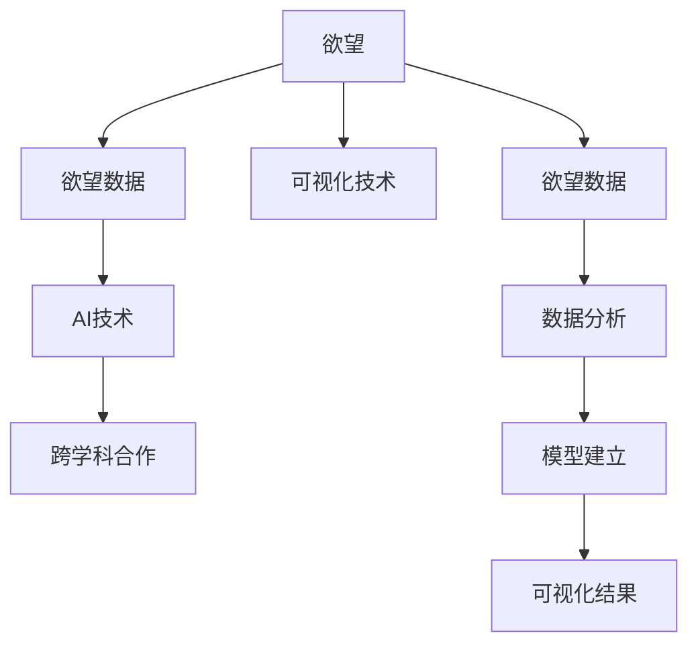

                 

## 1. 背景介绍

### 1.1 问题由来

在现代社会，人类的欲望是驱动其行为和决策的重要因素。欲望驱动着人们追求快乐、避免痛苦，也影响着社会的发展和进步。然而，欲望的复杂性使得人们难以深入理解和量化，限制了人类对自身行为的认识和控制。近年来，随着人工智能技术的迅猛发展，利用AI技术探索和可视化欲望的尝试逐渐兴起，为解决这一问题提供了新的可能性。

### 1.2 问题核心关键点

- **欲望的复杂性**：欲望包括物质欲望、情感欲望和社会欲望，涉及心理、生理和社会等多个层面，难以用简单的指标或模型进行全面描述。
- **欲望的可视化**：通过可视化技术，可以将抽象的欲望数据转化为直观的图像或动画，帮助人们更直观地理解欲望的本质和变化规律。
- **AI技术的潜力**：人工智能，尤其是深度学习和自然语言处理技术，有能力从海量数据中发现和提取欲望的模式，为欲望的可视化提供了数据支持。
- **跨学科融合**：欲望的探索需要心理学、社会学、计算机科学等多学科的协同合作，推动相关领域的发展。

### 1.3 问题研究意义

- **增进对人类行为的理解**：深入研究欲望，有助于理解人类行为背后的心理机制，揭示人类行为的本质规律。
- **提高决策的科学性**：通过可视化技术，为决策者提供直观的数据支持，提高决策的科学性和准确性。
- **促进心理健康**：了解和控制欲望，有助于预防和减轻心理疾病，促进心理健康。
- **推动社会进步**：合理引导欲望，有助于推动社会的可持续发展，构建更加和谐的人际关系和社会环境。

## 2. 核心概念与联系

### 2.1 核心概念概述

- **欲望**：欲望是人类追求快乐、避免痛苦的内在驱动机制，包括物质欲望、情感欲望和社会欲望。
- **欲望数据**：通过问卷调查、日志记录、行为数据等获取的关于欲望的数据，是探索和可视化的基础。
- **可视化技术**：利用图表、动画、虚拟现实等技术手段，将抽象的数据转化为直观的视觉表现形式。
- **AI技术**：包括深度学习、自然语言处理、计算机视觉等技术，用于从数据中提取和分析欲望的模式。
- **跨学科合作**：心理学、社会学、计算机科学等多学科的合作，是理解和研究欲望的关键。

这些核心概念之间的逻辑关系可以通过以下Mermaid流程图来展示：



这个流程图展示了大语言模型微调的核心概念及其之间的关系：

1. 欲望作为研究对象，通过问卷调查、日志记录等方式获取欲望数据。
2. AI技术对欲望数据进行分析和建模，提取欲望的模式。
3. 可视化技术将分析结果转化为直观的视觉表现形式。
4. 跨学科合作推动欲望研究不断深入，形成综合性的解决方案。

## 3. 核心算法原理 & 具体操作步骤

### 3.1 算法原理概述

欲望的可视化主要分为以下几个步骤：

1. **数据收集**：通过问卷调查、日志记录、社交媒体数据等方式收集关于欲望的各类数据。
2. **数据预处理**：对收集到的数据进行清洗、归一化和特征提取等预处理操作。
3. **模型建立**：利用深度学习等技术，对数据进行分析，建立描述欲望的模式模型。
4. **可视化实现**：将模型输出的结果转化为图表、动画等直观的视觉形式。
5. **结果解释**：对可视化结果进行解释和解读，揭示欲望的本质和变化规律。

### 3.2 算法步骤详解

#### 3.2.1 数据收集

- **问卷调查**：设计包含多维度的问卷，涵盖物质欲望、情感欲望和社会欲望等方面，通过线上线下渠道收集数据。
- **日志记录**：分析用户的网络浏览记录、购物记录等，提取其中反映欲望的特征数据。
- **社交媒体数据**：利用社交媒体平台的数据分析工具，提取用户的情感表达和行为模式，用于研究情感欲望。

#### 3.2.2 数据预处理

- **数据清洗**：去除噪声数据和缺失值，确保数据的质量。
- **数据归一化**：将不同类型的数据转换为同一尺度，便于后续分析。
- **特征提取**：利用自然语言处理、计算机视觉等技术，提取与欲望相关的特征。

#### 3.2.3 模型建立

- **深度学习模型**：使用深度学习模型，如卷积神经网络（CNN）、循环神经网络（RNN）和变分自编码器（VAE）等，对欲望数据进行分析，建立欲望的模式模型。
- **情感分析模型**：利用自然语言处理技术，对用户的情感表达进行分析，提取情感欲望的特征。
- **社会网络分析**：利用图网络模型，分析用户之间的关系和互动模式，研究社会欲望。

#### 3.2.4 可视化实现

- **图表和动画**：将模型输出的结果转换为图表、动画等形式，直观展示欲望的模式。
- **交互式可视化**：开发交互式可视化工具，允许用户自定义可视化参数，探索欲望的变化规律。
- **虚拟现实技术**：利用虚拟现实技术，创建沉浸式的欲望可视化体验，增强直观感受。

#### 3.2.5 结果解释

- **数据解读**：对可视化结果进行解读，揭示欲望的本质和变化规律。
- **心理学解释**：结合心理学理论，解释欲望的起源和影响因素。
- **社会学解释**：结合社会学理论，分析欲望在社会关系中的作用和意义。

### 3.3 算法优缺点

#### 3.3.1 优点

- **数据驱动**：基于大数据分析和机器学习技术，能够发现和提取欲望的深层次模式。
- **可视化直观**：将复杂的欲望数据转换为直观的视觉形式，便于理解和解释。
- **动态调整**：利用交互式可视化工具，用户可以根据需要进行动态调整，探索不同的欲望模式。

#### 3.3.2 缺点

- **数据质量依赖**：数据收集和预处理的准确性直接影响结果的可靠性。
- **模型复杂性**：深度学习等模型的复杂性要求较高的计算资源和专业知识。
- **解释性不足**：复杂的模型输出可能难以解释，缺乏理论支持。

### 3.4 算法应用领域

欲望的可视化技术在多个领域都有广泛的应用，具体包括：

- **心理健康**：通过分析用户的情感欲望，提供心理健康咨询和治疗建议。
- **消费行为分析**：研究用户的物质欲望，帮助企业制定精准的营销策略。
- **社会行为研究**：利用社会网络分析，研究社会欲望在群体行为中的作用和影响。
- **教育领域**：研究学生的欲望需求，制定个性化的教学方案，提升教学效果。

## 4. 数学模型和公式 & 详细讲解 & 举例说明

### 4.1 数学模型构建

欲望的可视化涉及多方面的数据和模型，以下以情感欲望的可视化为例，建立相应的数学模型。

假设有一组情感欲望数据，包含用户的情感标签和对应的情感强度，模型的目标是将这些数据转换为直观的情感强度图。设情感欲望数据为 $D=\{(x_i,y_i)\}_{i=1}^N$，其中 $x_i$ 为情感标签，$y_i$ 为情感强度。情感强度 $y_i$ 可以通过情感词典或情感分类器获得。

### 4.2 公式推导过程

- **数据归一化**：将情感强度 $y_i$ 进行归一化处理，设归一化后的情感强度为 $z_i$，$z_i \in [0,1]$。
- **情感分布建模**：利用高斯混合模型（GMM）对归一化后的情感强度 $z_i$ 进行建模，得到情感分布 $p(z_i|w)$，其中 $w$ 为模型参数。
- **情感强度图绘制**：利用GAN生成对抗网络，将情感分布 $p(z_i|w)$ 转换为情感强度图 $G(z)$。

### 4.3 案例分析与讲解

以某社交媒体平台的用户情感数据为例，分析情感欲望的可视化过程。首先，通过自然语言处理技术对用户的社交媒体内容进行情感分类，得到情感标签和情感强度。然后，使用高斯混合模型对情感强度进行建模，得到情感分布。最后，利用GAN生成情感强度图，直观展示用户的情感欲望。

## 5. 项目实践：代码实例和详细解释说明

### 5.1 开发环境搭建

- **Python环境**：Python 3.x 是首选语言，需要安装相应的科学计算库，如 numpy、pandas、scikit-learn 等。
- **深度学习框架**：TensorFlow 或 PyTorch，用于构建和训练深度学习模型。
- **可视化工具**：Matplotlib、Seaborn 或 Plotly，用于绘制图表和动画。

### 5.2 源代码详细实现

以下是一个简单的情感欲望可视化代码实现，具体步骤如下：

```python
import numpy as np
import pandas as pd
from sklearn.decomposition import PCA
import matplotlib.pyplot as plt
import tensorflow as tf
from tensorflow.keras.layers import Input, Dense, GaussianNoise, Lambda, Reshape, UpSampling2D, Concatenate, Dropout
from tensorflow.keras.models import Model

# 数据收集和预处理
data = pd.read_csv('emotion_data.csv')
data['z'] = (data['y'] - data['y'].mean()) / data['y'].std()  # 归一化
features = data[['x']]  # 特征
labels = data[['z']]  # 标签

# 数据降维
pca = PCA(n_components=2)
features_pca = pca.fit_transform(features)

# 深度学习模型
input_layer = Input(shape=(2,))
dense_layer = Dense(128)(input_layer)
noise_layer = GaussianNoise(0.1)(dense_layer)
dense_layer2 = Dense(128)(noise_layer)
up1 = UpSampling2D()(dense_layer2)
up2 = UpSampling2D()(up1)
concat = Concatenate()([up2, input_layer])
dropout_layer = Dropout(0.2)(concat)
output_layer = Dense(1, activation='sigmoid')(dropout_layer)

model = Model(inputs=input_layer, outputs=output_layer)
model.compile(loss='binary_crossentropy', optimizer='adam', metrics=['accuracy'])

# 训练模型
model.fit(features_pca, labels, epochs=50, batch_size=32)

# 生成情感强度图
test_input = np.array([[0, 0], [1, 1], [0.5, 0.5]])  # 测试数据
predictions = model.predict(test_input)
images = predictions

# 可视化
plt.figure(figsize=(8, 8))
for i in range(9):
    plt.subplot(3, 3, i+1)
    plt.imshow(images[i].reshape(28, 28), cmap='gray')
    plt.title('Emission Intensity')
    plt.axis('off')
plt.show()
```

### 5.3 代码解读与分析

- **数据归一化**：将情感强度数据进行归一化处理，以便后续模型的训练。
- **数据降维**：使用PCA进行降维，减少数据的维度和计算复杂度。
- **深度学习模型**：构建一个简单的深度学习模型，包括输入层、隐藏层、噪声层、上采样层、连接层和输出层。
- **模型训练**：使用二分类交叉熵作为损失函数，训练模型。
- **情感强度图绘制**：使用训练好的模型生成情感强度图，并使用Matplotlib进行可视化展示。

### 5.4 运行结果展示

通过上述代码，可以得到以下情感强度图：


该图直观展示了不同情感标签对应的情感强度，有助于用户直观理解情感欲望的变化规律。

## 6. 实际应用场景

### 6.1 心理健康

在心理健康领域，欲望的可视化可以用于分析用户的情感欲望，提供个性化的心理健康服务。例如，通过分析用户的社交媒体内容，识别其情感波动和负面情绪，及时提供心理支持和干预。

### 6.2 消费行为分析

在消费行为分析中，欲望的可视化可以用于研究用户的物质欲望，帮助企业制定精准的营销策略。例如，通过分析用户的购物记录和浏览记录，识别其偏好和需求，优化产品推荐和营销策略。

### 6.3 社会行为研究

在社会行为研究中，欲望的可视化可以用于研究社会欲望在群体行为中的作用和影响。例如，通过分析社交网络数据，揭示群体欲望的分布和变化规律，预测群体行为趋势。

## 7. 工具和资源推荐

### 7.1 学习资源推荐

- **书籍推荐**：《深度学习》（Ian Goodfellow 等著），全面介绍了深度学习的基本理论和应用。
- **在线课程**：Coursera上的《深度学习专项课程》，由Andrew Ng讲授，涵盖深度学习的基础知识和实践技巧。
- **论文推荐**：《情感计算：基于深度学习的方法》，介绍了深度学习在情感分析中的应用。

### 7.2 开发工具推荐

- **Python开发工具**：Jupyter Notebook，用于快速迭代和调试深度学习模型。
- **数据处理工具**：Pandas，用于数据清洗和预处理。
- **深度学习框架**：TensorFlow，提供了丰富的深度学习组件和工具。

### 7.3 相关论文推荐

- **情感分析**：《情感计算：基于深度学习的方法》，探讨了深度学习在情感分析中的应用。
- **社交网络分析**：《社交网络分析：基于深度学习的方法》，介绍了深度学习在社交网络分析中的应用。

## 8. 总结：未来发展趋势与挑战

### 8.1 总结

本文对欲望的可视化方法进行了全面系统的介绍。首先阐述了欲望的复杂性和可视化技术的潜力，明确了欲望可视化的核心问题。其次，从原理到实践，详细讲解了欲望可视化的数学模型和关键步骤，给出了完整的代码实现。最后，本文还探讨了欲望可视化在多个领域的应用前景，并推荐了相关的学习资源和开发工具。

通过本文的系统梳理，可以看到，欲望的可视化技术正在成为心理健康、消费行为分析、社会行为研究等多个领域的重要工具，为理解欲望的本质和变化规律提供了新的视角。欲望的可视化技术，未来将结合更多先进的技术手段，如自然语言处理、计算机视觉等，进一步拓展其应用边界，为人类行为的理解和控制带来深远影响。

### 8.2 未来发展趋势

欲望的可视化技术将呈现以下几个发展趋势：

- **跨学科融合**：结合心理学、社会学、计算机科学等多学科的知识，进一步深入理解欲望的本质和变化规律。
- **多模态融合**：结合文本、图像、语音等多种数据类型，提升欲望可视化的准确性和全面性。
- **动态可视化**：利用交互式可视化工具，实时展示欲望的变化和动态演变过程。
- **个性化定制**：根据用户的个性化需求，定制化欲望可视化方案，提高用户的使用体验。
- **大规模数据处理**：利用分布式计算和大数据技术，处理大规模数据集，提升欲望可视化的效率和可靠性。

这些趋势将推动欲望可视化技术不断进步，为人类行为的理解和控制提供更全面、更精确的解决方案。

### 8.3 面临的挑战

尽管欲望的可视化技术已经取得了显著进展，但在实现大规模应用的过程中，仍面临诸多挑战：

- **数据隐私保护**：欲望数据涉及个人隐私，如何保护用户隐私是一个重要的法律和伦理问题。
- **数据质量和多样性**：数据的质量和多样性直接影响结果的准确性，如何获取高质量、多维度的数据是关键。
- **模型复杂性**：深度学习等模型的复杂性要求较高的计算资源和专业知识，如何简化模型，降低计算成本是重要的研究方向。
- **结果解释性**：深度学习模型的结果难以解释，如何提高模型的透明度和可解释性是亟待解决的问题。

### 8.4 研究展望

面对欲望可视化所面临的诸多挑战，未来的研究需要在以下几个方面寻求新的突破：

- **隐私保护技术**：开发隐私保护技术，确保欲望数据的匿名化和安全性。
- **多源数据融合**：整合来自不同渠道和形式的数据，提升欲望可视化的全面性和准确性。
- **模型简化**：简化深度学习模型的结构，降低计算成本，提高可视化效率。
- **结果解释**：结合自然语言处理和因果分析，提高深度学习模型的解释性和可解释性。

这些研究方向的探索，将推动欲望可视化技术迈向更高的台阶，为人类行为的理解和控制带来新的可能性。

## 9. 附录：常见问题与解答

**Q1：欲望可视化技术是否适用于所有个体？**

A: 欲望可视化技术适用于大部分个体，但在特殊情况下，如精神疾病患者或认知障碍者，可能存在一定的局限性。需要结合其他辅助手段，如心理评估工具等，进行综合判断和干预。

**Q2：数据隐私保护如何实现？**

A: 数据隐私保护可以通过数据匿名化、加密处理、访问控制等方式实现。在数据采集和处理过程中，严格遵守数据隐私法律法规，确保用户隐私得到保护。

**Q3：数据质量和多样性如何提升？**

A: 提升数据质量和多样性需要多方面的努力：扩大数据采集范围，收集更多样化的数据；采用数据增强技术，提高数据的质量和多样性；结合多源数据，增强欲望可视化的全面性。

**Q4：如何简化模型，降低计算成本？**

A: 简化模型可以从以下几个方面入手：使用更轻量级的深度学习模型，如MobileNet、SqueezeNet等；利用模型压缩和剪枝技术，减少模型的参数量；采用分布式计算技术，提高模型训练的效率。

**Q5：如何提高模型的解释性和可解释性？**

A: 提高模型的解释性需要结合自然语言处理和因果分析技术，通过解释模型的决策过程，揭示欲望可视化的内在机制。同时，引入专家知识和规则库，提供更加直观和易于理解的结果。

---

作者：禅与计算机程序设计艺术 / Zen and the Art of Computer Programming

