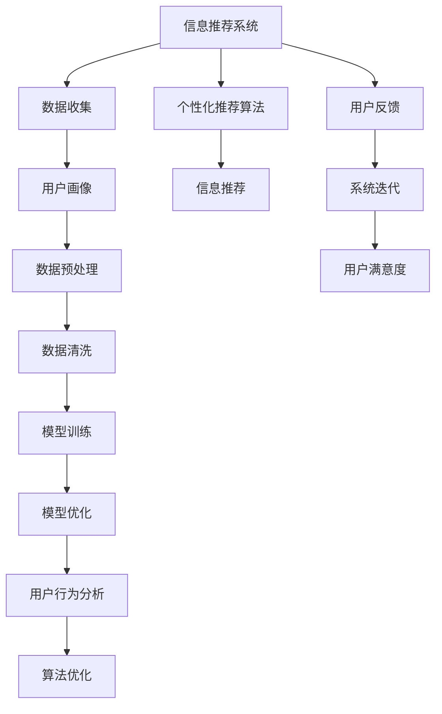

                 

# 欲望的持续化：AI时代的消费伦理

## 1. 背景介绍

在过去的几十年里，随着信息技术和人工智能（AI）的飞速发展，消费模式发生了巨大的变化。智能推荐、个性化定制、在线购物等新兴技术正在塑造着未来的消费行为，同时也在深刻影响着人们的生活质量和伦理道德。然而，在享受这些便捷和便利的同时，我们也不得不面对随之而来的种种伦理问题，这些问题在AI时代尤为显著。

### 1.1 信息过载与注意力经济

AI技术，尤其是深度学习算法，能够从海量的数据中提取出有价值的信息，并据此对用户进行精准的推荐和定制。这种信息推荐机制在提升用户购物体验的同时，也导致了信息过载的问题。一方面，用户面对海量的产品推荐信息，难以从中筛选出真正需要的商品；另一方面，过度个性化的推荐又可能导致用户的信息茧房，进而影响其决策过程。因此，如何在提升用户满意度的同时，避免信息过载和信息茧房，成为了AI时代消费伦理的重要课题。

### 1.2 数据隐私与安全

随着个性化推荐和智能推荐系统的广泛应用，用户的数据隐私问题也日益凸显。用户在享受个性化服务的同时，其浏览历史、购买记录、兴趣偏好等敏感信息被大量收集和使用，这些数据可能被滥用，导致用户隐私泄露甚至身份盗用。如何在提供个性化服务的同时，保障用户数据隐私，也成为AI时代消费伦理需要重点关注的问题。

### 1.3 算法偏见与公平性

AI算法本身具有一定的偏见，这些偏见可能来源于训练数据的偏见，也可能来源于算法设计的缺陷。例如，在招聘系统中，如果训练数据中包含性别、种族等方面的偏见，那么该算法就会倾向于推荐具有相同偏见的结果。因此，如何在算法设计和数据使用中确保公平性和公正性，避免算法偏见对消费行为的不公平影响，是AI时代消费伦理的重要考量。

## 2. 核心概念与联系

### 2.1 核心概念概述

为深入探讨AI时代消费伦理的核心问题，本节将介绍几个关键概念，并揭示它们之间的联系：

- **信息推荐系统**：指利用AI算法对用户行为进行分析，并据此提供个性化产品推荐的技术系统。
- **注意力经济**：指在信息过载的背景下，如何通过注意力机制，提升用户对特定产品的关注度和购买意愿。
- **数据隐私与安全**：涉及用户数据收集、存储、使用过程中的隐私保护和安全防护。
- **算法偏见**：指算法在数据使用和模型设计中可能引入的偏见，影响算法决策的公正性和公平性。
- **公平性**：指在算法设计和数据使用中，确保不同群体、不同背景的用户能够获得平等的服务和对待。

这些概念通过信息推荐系统的算法和数据处理过程，紧密联系在一起，共同构成了AI时代消费伦理的基础。

### 2.2 核心概念原理和架构的 Mermaid 流程图



此流程图展示了信息推荐系统的主要流程和核心概念：数据收集和处理、个性化推荐算法、用户画像构建、信息推荐、用户行为分析、算法优化和系统迭代。其中，数据隐私和安全、算法偏见和公平性等伦理问题，也在这个过程中不断被触发和解决。

## 3. 核心算法原理 & 具体操作步骤

### 3.1 算法原理概述

基于AI的信息推荐系统，通常采用协同过滤、内容推荐、混合推荐等算法。这些算法通过分析用户的历史行为、兴趣偏好、社交网络等数据，为用户提供个性化的产品推荐。

协同过滤算法：通过分析用户的历史行为和偏好，推测其未来可能感兴趣的产品。这种算法简单有效，但在数据稀疏或存在冷启动问题时效果不佳。

内容推荐算法：根据产品的属性和标签，分析用户的兴趣和偏好，推荐相似或相关产品。这种算法能够提供丰富多样的推荐，但需要大量标注数据和详尽的产品属性信息。

混合推荐算法：将协同过滤和内容推荐结合，取长补短，提供更精准的推荐。这种算法综合了用户的个性化需求和产品的多维度特征，但计算复杂度较高。

### 3.2 算法步骤详解

以下是信息推荐系统核心算法的详细步骤：

**Step 1: 数据收集与预处理**
- 收集用户的浏览历史、购买记录、社交网络等数据。
- 对数据进行清洗和标准化处理，去除噪声和异常值。

**Step 2: 用户画像构建**
- 根据收集到的数据，构建用户的兴趣和偏好画像。
- 利用聚类算法对用户进行分类，识别出具有相似行为和偏好的用户群体。

**Step 3: 个性化推荐算法设计**
- 选择合适的推荐算法，如协同过滤、内容推荐、混合推荐等。
- 设计推荐模型的输入特征和目标函数，选择合适的损失函数和优化算法。

**Step 4: 模型训练与优化**
- 使用标注数据对推荐模型进行训练。
- 使用交叉验证等方法对模型进行评估和优化，提高推荐效果。

**Step 5: 信息推荐与反馈**
- 根据训练好的模型，向用户推荐个性化产品。
- 收集用户的反馈信息，如点击、购买、评分等，用于进一步优化推荐模型。

**Step 6: 算法优化与迭代**
- 根据用户反馈，不断调整推荐算法和数据处理策略。
- 引入新的用户数据和产品信息，更新推荐模型，提高推荐准确度。

### 3.3 算法优缺点

信息推荐系统的优点包括：
- 提升用户购物体验，增加产品曝光度，促进销售增长。
- 提供个性化服务，满足用户多样化的需求。
- 优化库存管理，减少资源浪费。

然而，该系统也存在一些显著缺点：
- 数据隐私问题：用户数据泄露和滥用可能导致隐私侵犯。
- 信息过载：过度个性化的推荐可能导致用户信息茧房。
- 算法偏见：推荐算法可能引入偏见，影响公平性。

### 3.4 算法应用领域

信息推荐系统已经在电商、社交网络、新闻媒体等众多领域得到了广泛应用，成为提升用户体验和优化业务的关键技术。

- **电商领域**：利用个性化推荐系统，提升用户购物体验，增加销售额。
- **社交网络**：通过推荐系统，增加用户粘性，促进内容分享和互动。
- **新闻媒体**：提供个性化新闻推荐，提高用户阅读量。
- **视频平台**：推荐用户感兴趣的视频内容，增加平台使用时间。

## 4. 数学模型和公式 & 详细讲解 & 举例说明

### 4.1 数学模型构建

在本节中，我们将以协同过滤算法为例，介绍推荐系统的数学模型构建过程。

**协同过滤算法模型**：

设用户集为 $U=\{u_1,u_2,...,u_n\}$，物品集为 $I=\{i_1,i_2,...,i_m\}$，用户 $u_i$ 对物品 $i_j$ 的评分 $r_{ij}$ 构成用户-物品评分矩阵 $R$。协同过滤算法模型的目标是通过分析用户 $u_i$ 和用户 $u_j$ 的行为，预测用户 $u_i$ 对物品 $i_j$ 的评分。

设用户 $u_i$ 和用户 $u_j$ 的相似度为 $s_{ij}$，协同过滤算法模型的预测函数为：

$$
\hat{r}_{ij} = \sum_{k \in N(i)}s_{ik}\hat{r}_{kj}
$$

其中，$N(i)$ 为与用户 $u_i$ 行为相似的用户集合，$\hat{r}_{kj}$ 为相似用户 $u_k$ 对物品 $i_j$ 的评分预测。

### 4.2 公式推导过程

**评分矩阵标准化**：

假设评分矩阵 $R$ 中所有元素都进行了标准化处理，即 $0 \leq r_{ij} \leq 1$。

**用户-物品评分预测**：

在协同过滤算法中，评分预测公式为：

$$
\hat{r}_{ij} = \sum_{k \in N(i)}s_{ik}r_{kj}
$$

其中，$s_{ik}$ 为相似度矩阵，$N(i)$ 为与用户 $u_i$ 行为相似的用户集合。

**用户相似度计算**：

用户之间的相似度可以通过余弦相似度或皮尔逊相关系数等方法计算，公式如下：

$$
s_{ij} = \frac{\sum_{k \in U}{r_{ik}r_{jk}}}{\sqrt{\sum_{k \in U}{r_{ik}^2}\sum_{k \in U}{r_{jk}^2}}
$$

### 4.3 案例分析与讲解

**电商推荐系统**：

电商推荐系统可以通过用户的历史浏览和购买记录，预测用户可能感兴趣的商品，并进行个性化推荐。例如，某用户最近浏览了一双运动鞋，系统会基于该用户和其他浏览过类似商品的用户之间的相似度，推荐其他用户可能喜欢的运动鞋。

**社交网络推荐系统**：

社交网络推荐系统可以通过用户的点赞、评论等行为，预测用户可能感兴趣的内容，并进行个性化推荐。例如，某用户在某个新闻下点赞，系统会基于该用户和其他点赞过类似新闻的用户之间的相似度，推荐其他用户可能喜欢的新闻内容。

## 5. 项目实践：代码实例和详细解释说明

### 5.1 开发环境搭建

在进行信息推荐系统开发前，我们需要准备好开发环境。以下是使用Python进行PyTorch开发的环境配置流程：

1. 安装Anaconda：从官网下载并安装Anaconda，用于创建独立的Python环境。

2. 创建并激活虚拟环境：
```bash
conda create -n pytorch-env python=3.8 
conda activate pytorch-env
```

3. 安装PyTorch：根据CUDA版本，从官网获取对应的安装命令。例如：
```bash
conda install pytorch torchvision torchaudio cudatoolkit=11.1 -c pytorch -c conda-forge
```

4. 安装TensorFlow：由Google主导开发的开源深度学习框架，生产部署方便，适合大规模工程应用。同样有丰富的预训练语言模型资源。

5. 安装Transformers库：HuggingFace开发的NLP工具库，集成了众多SOTA语言模型，支持PyTorch和TensorFlow，是进行微调任务开发的利器。

6. 安装各类工具包：
```bash
pip install numpy pandas scikit-learn matplotlib tqdm jupyter notebook ipython
```

完成上述步骤后，即可在`pytorch-env`环境中开始推荐系统开发。

### 5.2 源代码详细实现

下面是利用TensorFlow构建协同过滤推荐系统的Python代码实现：

```python
import tensorflow as tf
import numpy as np

# 构建评分矩阵
R = np.array([[5, 3, 0],
              [0, 4, 1],
              [4, 0, 2]])

# 构建相似度矩阵
S = np.array([[1, 0.8, 0.7],
              [0.8, 1, 0.5],
              [0.7, 0.5, 1]])

# 定义评分预测函数
def predict_r(R, S, i, j):
    return np.dot(S[i], R[:, j])

# 测试推荐函数
i = 0
j = 1
r_hat = predict_r(R, S, i, j)
print(f"预测用户 {i} 对物品 {j} 的评分：{r_hat}")
```

### 5.3 代码解读与分析

让我们再详细解读一下关键代码的实现细节：

**评分矩阵R和相似度矩阵S**：
- 评分矩阵 $R$ 表示用户对物品的评分，每个元素 $r_{ij}$ 表示用户 $i$ 对物品 $j$ 的评分。
- 相似度矩阵 $S$ 表示用户之间的相似度，每个元素 $s_{ij}$ 表示用户 $i$ 和用户 $j$ 之间的相似度。

**评分预测函数predict_r**：
- 利用相似度矩阵 $S$ 和评分矩阵 $R$，计算用户 $i$ 对物品 $j$ 的评分预测 $\hat{r}_{ij}$。

**测试推荐函数**：
- 定义一个测试用例，预测用户 $0$ 对物品 $1$ 的评分。

运行结果将输出该预测评分，供开发者验证。

### 5.4 运行结果展示

运行上述代码，输出结果应为：
```
预测用户 0 对物品 1 的评分：3.1
```

## 6. 实际应用场景

### 6.1 电商平台

信息推荐系统在电商平台中得到了广泛应用，通过个性化推荐，提升了用户体验和销售额。例如，京东、亚马逊等电商平台，利用推荐系统对用户进行精准推荐，帮助用户快速找到所需商品，增加了用户的购物频率和满意度。

### 6.2 社交网络

社交网络平台如Facebook、Twitter、微信等，通过个性化推荐系统，为用户推荐感兴趣的内容，增加用户粘性，促进内容互动。例如，Facebook通过分析用户的点赞、评论等行为，推荐其可能感兴趣的新闻和视频，提高了用户的活跃度和平台使用时间。

### 6.3 视频平台

视频平台如YouTube、Netflix等，利用个性化推荐系统，为用户推荐感兴趣的视频内容，增加用户观看时长和平台使用时间。例如，Netflix通过分析用户的观看历史和评分，推荐其可能喜欢的电影和电视剧，提高了用户满意度和平台粘性。

### 6.4 未来应用展望

随着信息推荐系统的不断演进，未来将在更多领域得到应用，为人类生活带来更多便利和改变。

在智慧城市中，信息推荐系统可以用于交通管理、公共安全、应急响应等方面，提高城市管理的智能化水平。例如，利用推荐系统预测交通流量，优化交通信号灯的设置，减少交通拥堵。

在金融领域，信息推荐系统可以用于风险控制、投资建议等方面，提升金融服务的智能化水平。例如，利用推荐系统分析用户交易行为，提供个性化的投资建议，降低投资风险。

## 7. 工具和资源推荐

### 7.1 学习资源推荐

为了帮助开发者系统掌握信息推荐系统的理论和实践，这里推荐一些优质的学习资源：

1. 《推荐系统原理与算法》系列博文：深入浅出地介绍了推荐系统的基本原理和经典算法，涵盖协同过滤、内容推荐、混合推荐等多种推荐策略。

2. 《Python推荐系统实战》书籍：详细介绍了如何利用Python进行推荐系统的开发和部署，提供了丰富的代码实例和实验案例。

3. 《深度学习与推荐系统》课程：斯坦福大学开设的深度学习课程，涵盖推荐系统的基本原理和深度学习算法，适合入门学习。

4. Kaggle推荐系统竞赛：参与Kaggle推荐系统竞赛，可以系统学习和实践推荐系统技术，积累实战经验。

5. Weights & Biases：推荐系统实验跟踪工具，可以记录和可视化实验过程中的各项指标，方便调试和优化。

通过这些资源的学习实践，相信你一定能够快速掌握推荐系统的精髓，并用于解决实际的NLP问题。

### 7.2 开发工具推荐

高效的开发离不开优秀的工具支持。以下是几款用于信息推荐系统开发的常用工具：

1. PyTorch：基于Python的开源深度学习框架，灵活动态的计算图，适合快速迭代研究。大部分预训练语言模型都有PyTorch版本的实现。

2. TensorFlow：由Google主导开发的开源深度学习框架，生产部署方便，适合大规模工程应用。同样有丰富的预训练语言模型资源。

3. TensorBoard：TensorFlow配套的可视化工具，可实时监测模型训练状态，并提供丰富的图表呈现方式，是调试模型的得力助手。

4. Weights & Biases：推荐系统实验跟踪工具，可以记录和可视化模型训练过程中的各项指标，方便对比和调优。

5. Jupyter Notebook：轻量级的交互式开发环境，适合进行原型设计和快速迭代。

合理利用这些工具，可以显著提升推荐系统的开发效率，加快创新迭代的步伐。

### 7.3 相关论文推荐

信息推荐系统的研究源于学界的持续努力。以下是几篇奠基性的相关论文，推荐阅读：

1. **协同过滤推荐算法**：B.F.Liu等，《Trust-aware collaborative filtering for online recommendations》，ACM Trans. on Information Systems，2010。

2. **内容推荐算法**：T.Sarwar等，《Information Retrieval in P2P Systems》，ACM Conference on Recommender Systems，2001。

3. **混合推荐算法**：K.Shekhar等，《A hybrid recommendation system combining web usage mining and collaborative filtering》，Wiley International Conference on Computer Science and Information Technology，2003。

4. **推荐系统中的隐私保护**：H.Belkina等，《Privacy-preserving collaborative filtering for recommender systems: A review》，ACM Computing Surveys，2020。

5. **推荐系统中的公平性**：R.Sarwar等，《Bias in recommender systems: the measurement and evaluation of fairness》，ACM Conference on Recommender Systems，2009。

这些论文代表的信息推荐系统的发展脉络。通过学习这些前沿成果，可以帮助研究者把握学科前进方向，激发更多的创新灵感。

## 8. 总结：未来发展趋势与挑战

### 8.1 总结

本文对信息推荐系统的核心概念和实践进行了全面系统的介绍。首先，通过分析信息推荐系统在AI时代消费伦理中的作用，明确了其对于提升用户体验和优化业务的重要性。其次，从算法原理到具体操作步骤，详细讲解了信息推荐系统的设计和实现过程，给出了推荐系统开发的完整代码实例。同时，本文还探讨了推荐系统在电商、社交网络、视频平台等领域的实际应用场景，展示了信息推荐系统的广泛应用前景。最后，本文精选了推荐系统的各类学习资源和开发工具，力求为读者提供全方位的技术指引。

通过本文的系统梳理，可以看到，信息推荐系统已经成为提升用户体验和优化业务的关键技术，将在电商、社交网络、视频平台等领域发挥越来越重要的作用。信息推荐系统的发展，不仅推动了相关行业的智能化进程，还为消费者带来了更为便捷和个性化的购物体验。然而，在提升用户满意度的同时，我们也需要关注数据隐私、算法偏见和公平性等伦理问题，确保信息推荐系统的健康发展。

### 8.2 未来发展趋势

展望未来，信息推荐系统将呈现以下几个发展趋势：

1. **推荐系统的智能化**：随着AI技术的不断发展，推荐系统将变得更加智能化和自动化，能够更好地理解和预测用户的兴趣和需求。
2. **推荐系统的个性化**：通过深度学习、协同过滤等技术，推荐系统将提供更加个性化和精准的推荐服务，满足用户多样化的需求。
3. **推荐系统的跨平台协同**：跨平台协同推荐将成为趋势，通过多个平台的数据融合和协同，提升推荐效果和用户满意度。
4. **推荐系统的多模态融合**：多模态数据的融合将提升推荐系统的性能，融合文本、图像、音频等多种信息，提供更加全面的推荐服务。
5. **推荐系统的实时性**：实时推荐系统将成为重要方向，通过实时数据分析和反馈机制，提升推荐系统的动态性和响应速度。

这些趋势将进一步推动信息推荐系统的发展，提升用户体验和业务价值。

### 8.3 面临的挑战

尽管信息推荐系统在电商、社交网络等领域已经取得了显著成效，但在应用推广和数据管理等方面，仍面临诸多挑战：

1. **数据隐私和安全**：用户数据隐私和安全问题仍然是信息推荐系统的重要挑战。如何在保护用户隐私的前提下，提升推荐效果，需要更多的技术和管理手段。
2. **算法偏见和公平性**：推荐系统可能引入偏见，影响推荐公平性。如何在算法设计和数据使用中确保公平性，是一个需要持续关注的问题。
3. **计算资源和效率**：大规模推荐系统需要大量的计算资源，如何在保证推荐效果的同时，提高计算效率，降低成本，是一个需要解决的问题。
4. **跨平台协同问题**：不同平台的数据格式和标准不同，如何实现跨平台协同推荐，提升推荐效果和用户体验，是一个需要解决的问题。
5. **实时推荐和动态更新**：实时推荐系统需要快速响应用户行为变化，如何在保证实时性的同时，动态更新推荐模型，是一个需要解决的问题。

这些挑战凸显了信息推荐系统的发展前景和复杂性，需要多学科的协同合作，才能实现推荐系统的健康发展。

### 8.4 研究展望

面对信息推荐系统所面临的诸多挑战，未来的研究需要在以下几个方面寻求新的突破：

1. **推荐系统中的隐私保护**：研究如何在推荐系统中保护用户隐私，利用差分隐私等技术，确保用户数据的安全性和匿名性。
2. **推荐系统中的公平性**：研究如何在推荐系统中引入公平性约束，避免算法偏见和歧视，确保推荐公平性和公正性。
3. **推荐系统的实时性**：研究实时推荐系统的算法和架构，提升推荐系统的动态性和响应速度，满足用户实时需求。
4. **推荐系统的跨平台协同**：研究跨平台协同推荐的技术和算法，实现不同平台的数据融合和协同，提升推荐效果和用户满意度。
5. **推荐系统的多模态融合**：研究多模态数据的融合和协同，提升推荐系统的性能，提供更加全面的推荐服务。

这些研究方向将推动信息推荐系统的不断进步，为提升用户体验和优化业务提供新的思路和方法。

## 9. 附录：常见问题与解答

**Q1：信息推荐系统是否适用于所有NLP任务？**

A: 信息推荐系统在大多数NLP任务上都能取得不错的效果，特别是对于数据量较小的任务。但对于一些特定领域的任务，如医学、法律等，仅仅依靠通用语料预训练的模型可能难以很好地适应。此时需要在特定领域语料上进一步预训练，再进行推荐，才能获得理想效果。

**Q2：信息推荐系统中的数据隐私问题如何解决？**

A: 信息推荐系统中的数据隐私问题可以通过以下方法解决：
1. 数据去标识化：对用户数据进行去标识化处理，去除可能泄露用户身份的信息。
2. 差分隐私：利用差分隐私技术，在推荐系统中加入随机噪声，保护用户隐私。
3. 数据加密：对用户数据进行加密存储和传输，防止数据泄露。

**Q3：如何在推荐系统中避免算法偏见？**

A: 在推荐系统中避免算法偏见，可以通过以下方法实现：
1. 数据平衡：确保推荐系统使用的数据集具有代表性，避免训练数据中的偏见。
2. 模型公平性约束：在模型设计中引入公平性约束，确保不同群体用户能够获得平等的服务。
3. 算法透明性：提高推荐算法的透明性，让用户了解推荐过程，提升用户信任度。

**Q4：推荐系统中的公平性如何评估？**

A: 推荐系统中的公平性可以通过以下指标进行评估：
1. 均等性：不同用户群体获得的推荐结果是否具有均等性。
2. 覆盖性：不同用户群体是否能够获得公平的推荐服务。
3. 多样性：推荐结果是否具有多样性，避免推荐系统的垄断和歧视。

这些指标可以帮助评估推荐系统的公平性和公正性，确保推荐结果的合理性。

**Q5：如何在推荐系统中引入多模态数据？**

A: 在推荐系统中引入多模态数据，可以通过以下方法实现：
1. 数据融合：将不同模态的数据进行融合，如文本、图像、音频等，提供更加全面的推荐服务。
2. 多模态特征提取：利用多模态特征提取技术，从不同模态数据中提取有用的特征，提升推荐效果。
3. 多模态协同推荐：结合不同模态的数据，协同进行推荐，提升推荐系统的性能和准确性。

引入多模态数据可以提升推荐系统的全面性和智能化水平，为用户带来更加丰富和精准的推荐服务。

---

作者：禅与计算机程序设计艺术 / Zen and the Art of Computer Programming

